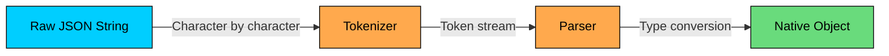
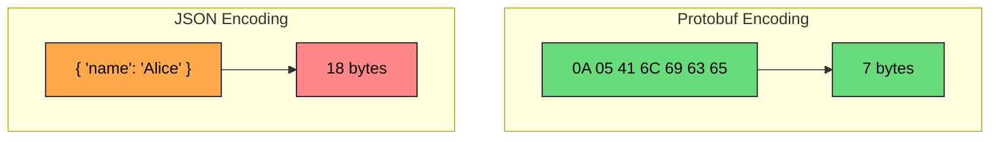
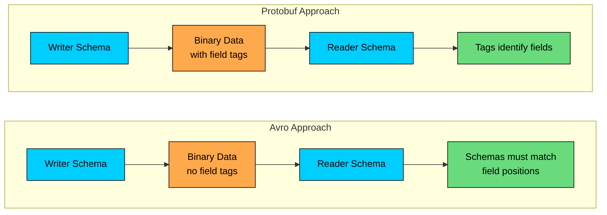
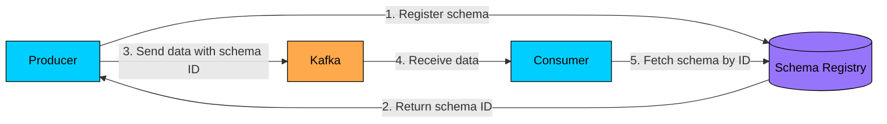
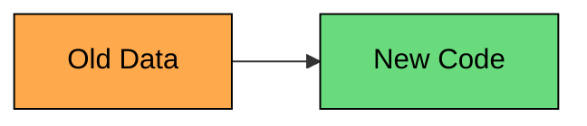
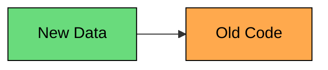

Every time two systems communicate, they need to agree on a common language. When a mobile app fetches user data from a server, when microservices exchange messages through Kafka, or when you store configuration in a file, **data formats** are working behind the scenes.

The format you choose affects everything: how fast your system runs, how much bandwidth it consumes, how easily you can evolve your APIs, and how simple it is to debug problems in production.

Yet most developers never think twice about data formats. They default to JSON because it's familiar, without considering whether it's the right tool for the job.

---

# Why Data Formats Matter

Consider a microservices architecture where services exchange millions of messages per second. The data format affects:

#### **1. Performance**

Serialization (converting objects to bytes) and deserialization (converting bytes back to objects) happen on every single message. A format that's 10x slower to parse will significantly impact your system's throughput and latency.

#### **2. Bandwidth**

Binary formats can be 3-10x smaller than text formats. When you're transferring terabytes of data daily, this translates directly to infrastructure costs.

#### **3. Interoperability**

Some formats work seamlessly across languages and platforms. Others require careful coordination between teams.

#### **4. Schema Evolution**

As your system grows, data structures change. Adding fields, removing fields, changing types. The format you choose determines how painful (or painless) these changes will be.

---

# Text-Based vs Binary Formats

Data formats fall into two broad categories: **text-based** and **binary**.

### Text-Based Formats

Text formats like JSON and XML encode data as human-readable strings.

### Advantages

- Human-readable and debuggable
- Easy to inspect with standard tools (cat, grep, curl)
- Self-describing (field names included)
- Universal support across all languages

### Disadvantages

- Larger payload size (field names repeated)
- Slower to parse (string processing)
- Type ambiguity (is "123" a string or number")
- No built-in schema validation

### Binary Formats

Binary formats like Protocol Buffers and Avro encode data in compact binary representations.

### Advantages

- Compact (3-10x smaller than text)
- Fast serialization and deserialization
- Strong typing with schema enforcement
- Efficient for high-throughput systems

### Disadvantages

- Not human-readable
- Requires schema to decode
- More complex tooling for debugging
- Learning curve for developers

---

# JSON (JavaScript Object Notation)

JSON is the most widely used data format on the web. It originated from JavaScript but is now language-agnostic and supported everywhere.

### Structure

JSON supports six data types:

| Type | Example |
|------|---------|
| String | `"hello"` |
| Number | `123`, `3.14`, `-5` |
| Boolean | `true`, `false` |
| Null | `null` |
| Array | `[1, 2, 3]` |
| Object | `{"key": "value"}` |

**Example JSON:**

### How JSON Parsing Works

When a system receives JSON data, the parser must:

1. **Tokenize**: Read characters and identify tokens (strings, numbers, braces)
2. **Parse**: Build a tree structure based on token relationships
3. **Convert**: Transform parsed values into native language types

This is computationally expensive because the parser must examine every character and handle string escaping, Unicode, and number parsing.



### Pros and Cons

### Pros

- **Universal support:** Every programming language has JSON libraries
- **Human-readable:** Easy to debug and log
- **Flexible:** No schema required, can add/remove fields freely
- **Web-native:** First-class support in browsers and HTTP APIs
- **Simple:** Easy to learn and use

### Cons

- **Verbose:** Field names repeated in every object
- **No schema enforcement:** Type errors discovered at runtime
- **Limited types:** No dates, binary data, or custom types
- **Parsing overhead:** Text parsing is slower than binary decoding
- **No comments:** Cannot document inline

### When to Use JSON

JSON is ideal for:

- REST APIs consumed by web browsers
- Configuration files that humans edit
- Logging and debugging output
- Public APIs where simplicity matters
- Any situation where human readability is important

---

# XML (Extensible Markup Language)

XML was the dominant data format before JSON took over. While less popular for new projects, it remains important in enterprise systems, SOAP web services, and document-centric applications.

### Structure

XML uses tags to define elements and attributes for metadata:

### XML vs JSON Size Comparison

For the same data, XML is typically 30-50% larger than JSON due to closing tags:

| Format | Size (bytes) |
|--------|--------------|
| JSON | 312 |
| XML | 489 |

### Unique XML Features

XML has capabilities that JSON lacks:

**1. Namespaces**: Prevent naming conflicts when combining documents from different sources.

**2. Schema Validation (XSD)**: Define strict schemas that validators can enforce.

**3. Transformation (XSLT)**: Transform XML documents into other formats using stylesheets.

**4. Querying (XPath/XQuery)**: Powerful query languages for extracting data.

### Pros and Cons

### Pros

- **Mature ecosystem:** Rich tooling, validation, transformation
- **Schema support:** XSD provides strong typing and validation
- **Namespaces:** Handle complex documents with multiple vocabularies
- **Document-centric:** Good for mixed content (text with markup)
- **Enterprise adoption:** Widely used in banking, healthcare, government

### Cons

- **Verbose:** Tags add significant overhead
- **Complex:** Namespaces, DTDs, and schemas add complexity
- **Slower parsing:** More overhead than JSON
- **Declining popularity:** Fewer modern libraries and tools

### When to Use XML

XML makes sense for:

- Enterprise integrations (SOAP, EDI)
- Document formats (HTML, SVG, Office files)
- Configuration with complex validation needs
- Systems that need XSLT transformations
- Legacy system compatibility

---

# Protocol Buffers (Protobuf)

Protocol Buffers, developed by Google, is a binary serialization format designed for speed and efficiency. It's the default format for gRPC and is used internally at Google for almost all inter-service communication.

### How It Works

First, you define your data structure in a `.proto` file:

Each field has:

- A **type** (string, int32, double, bool, or another message)
- A **name** (for code generation)
- A **unique number** (for binary encoding)

The `.proto` file is then compiled into language-specific code:

This generates classes with type-safe getters, setters, and serialization methods.

### Binary Encoding

The magic of Protobuf is in its binary encoding. Instead of including field names, it uses the small field numbers as identifiers:



The encoding uses:

- **Varints**: Small numbers use fewer bytes (1 uses 1 byte, 300 uses 2 bytes)
- **Wire types**: Indicate how to parse each field (varint, fixed64, length-delimited, etc.)
- **Field tags**: Combine field number and wire type in a single byte

### Code Generation Example

Using the generated Python code:

### Schema Evolution

Protobuf handles schema changes gracefully:

**Adding fields**: Old code ignores unknown field numbers. New code uses defaults for missing fields.

**Removing fields**: Mark as `reserved` to prevent reuse of field numbers.

**Renaming fields**: Safe, since encoding uses numbers, not names.

**Changing types**: Dangerous. Must be compatible types (int32 to int64 is ok).

### Pros and Cons

### Pros

- **Compact:** 3-10x smaller than JSON
- **Fast:** Binary encoding is much faster to parse
- **Type-safe:** Generated code catches errors at compile time
- **Schema evolution:** Forward and backward compatible
- **Language support:** Official support for 10+ languages

### Cons

- **Not human-readable:** Requires tools to inspect
- **Schema required:** Cannot decode without the .proto file
- **Limited collection types:** Only repeated (list), no maps in proto2
- **Learning curve:** Developers must learn the schema language

### When to Use Protobuf

Protobuf excels for:

- gRPC services
- Internal microservice communication
- High-throughput systems (millions of messages/sec)
- Mobile apps (smaller payloads save bandwidth)
- Any performance-critical serialization

---

# Apache Avro

Apache Avro is a binary serialization format developed within the Hadoop ecosystem. Its killer feature is **schema evolution** with full backward and forward compatibility.

### Schema Definition

Avro schemas are defined in JSON:

### How Avro Differs from Protobuf

The key difference is that Avro doesn't use field tags. Instead, it relies on **schema resolution** at read time.



When reading Avro data:

1. You need both the **writer's schema** (how data was written) and the **reader's schema** (what you want)
2. Avro's resolution algorithm maps fields by name
3. Missing fields use defaults, extra fields are skipped

### Schema Registry

In practice, Avro is often used with a **Schema Registry** (like Confluent Schema Registry for Kafka):



The schema ID is stored with each message (typically 4-5 bytes overhead), allowing consumers to fetch the exact schema used to encode the data.

### Schema Evolution Rules

Avro has strict but powerful evolution rules:

| Change | Backward Compatible | Forward Compatible |
|--------|--------------------|--------------------|
| Add field with default | Yes | Yes |
| Add field without default | No | Yes |
| Remove field with default | Yes | Yes |
| Remove field without default | Yes | No |
| Rename field | Use aliases | Use aliases |

**Backward compatible**: New code can read old data.

**Forward compatible**: Old code can read new data.

### Pros and Cons

### Pros

- **Dynamic typing:** Can read data without code generation
- **Compact:** No field tags in the data itself
- **Rich schema evolution:** Full forward and backward compatibility
- **Schema registry integration:** First-class support in Kafka ecosystem
- **Great for Hadoop:** Native support in HDFS, Spark, Hive

### Cons

- **Requires writer schema:** Cannot decode without knowing how it was written
- **JSON schema format:** Verbose compared to Protobuf's DSL
- **Less language support:** Fewer official bindings than Protobuf

### When to Use Avro

Avro is the best choice for:

- Kafka message serialization (with Schema Registry)
- Big data pipelines (Hadoop, Spark, Hive)
- Systems where schemas evolve frequently
- Data lakes and long-term storage
- When you need strong schema compatibility guarantees

---

# MessagePack

MessagePack is a binary format that aims to be "like JSON, but fast and small." It's self-describing (no schema required) while being more compact and faster than JSON.

### How It Works

MessagePack maps directly to JSON types but uses binary encoding:

### Encoding Comparison

| Value | JSON | MessagePack |
|-------|------|-------------|
| `true` | 4 bytes | 1 byte |
| `123` | 3 bytes | 1 byte |
| `"hello"` | 7 bytes | 6 bytes |
| `[1,2,3]` | 7 bytes | 4 bytes |

MessagePack achieves this through:

- **Type prefixes**: Single byte indicates type and sometimes size
- **Compact integers**: Small numbers (0-127) fit in 1 byte
- **No field names in maps**: Uses the same representation as JSON objects

### Pros and Cons

### Pros

- **No schema needed:** Works like JSON, just faster
- **Compact:** Typically 50-80% of JSON size
- **Fast:** Binary parsing is faster than text
- **Wide language support:** Libraries for most languages
- **Drop-in replacement:** Can often replace JSON with minimal changes

### Cons

- **Not human-readable:** Requires tools to inspect
- **No schema validation:** Same as JSON
- **Less compact than Protobuf/Avro:** Still includes field names
- **No schema evolution support:** Same limitations as JSON

### When to Use MessagePack

MessagePack is great for:

- Caching (Redis, Memcached)
- IPC between services in the same organization
- When you need JSON semantics with better performance
- Game networking and real-time applications
- Mobile apps where bandwidth matters but schemas are overkill

---

# Apache Thrift

Apache Thrift, originally developed at Facebook, is both a serialization format and an RPC framework. It predates both Protobuf (publicly) and gRPC.

### Interface Definition

Thrift uses its own IDL (Interface Definition Language):

### Multiple Protocols

Thrift supports multiple serialization protocols:

| Protocol | Description |
|----------|-------------|
| Binary | Compact binary format (default) |
| Compact | More compact, variable-length encoding |
| JSON | Human-readable JSON output |
| SimpleJSON | JSON without type metadata |

This flexibility lets you choose the right trade-off for each use case.

### Pros and Cons

### Pros

- **Mature and battle-tested:** Used at Facebook scale for years
- **Integrated RPC:** Serialization and services in one framework
- **Multiple protocols:** Switch between binary and JSON easily
- **Wide language support:** Code generators for many languages

### Cons

- **Less momentum:** Protobuf/gRPC have more community activity
- **Complex ecosystem:** Many options can be confusing
- **Heavier weight:** More opinionated than pure serialization libraries

### When to Use Thrift

Thrift makes sense for:

- Organizations already invested in Thrift
- When you need both serialization and RPC
- Polyglot environments needing protocol flexibility
- Systems requiring JSON and binary from the same schema

---

# Comparison: Choosing the Right Format

### Performance Comparison

Benchmarks vary by implementation and data, but typical relative performance:

| Format | Serialization Speed | Deserialization Speed | Size |
|--------|--------------------|-----------------------|------|
| JSON | Baseline | Baseline | Baseline |
| XML | 0.5-0.8x | 0.3-0.5x | 1.3-1.5x |
| MessagePack | 2-5x | 2-5x | 0.5-0.8x |
| Protobuf | 5-10x | 5-10x | 0.2-0.4x |
| Avro | 3-7x | 3-7x | 0.2-0.4x |
| Thrift (binary) | 4-8x | 4-8x | 0.2-0.4x |

### Feature Comparison

| Feature | JSON | XML | Protobuf | Avro | MessagePack | Thrift |
|---------|------|-----|----------|------|-------------|--------|
| Human-readable | Yes | Yes | No | No | No | No |
| Schema required | No | Optional | Yes | Yes | No | Yes |
| Schema evolution | Poor | Poor | Good | Excellent | Poor | Good |
| Type safety | No | With XSD | Yes | Yes | No | Yes |
| Code generation | No | No | Yes | Optional | No | Yes |
| Binary format | No | No | Yes | Yes | Yes | Yes |
| Built-in RPC | No | No | With gRPC | No | No | Yes |

### Decision Framework

```mermaid
flowchart TD
    A{Human readability<br/>important"}:::orange
    B{Schema evolution<br/>critical"}:::orange
    C{Maximum<br/>performance"}:::orange
    D{Kafka/Big Data<br/>ecosystem"}:::orange
    E{Need RPC<br/>framework"}:::orange

    JSON[JSON]:::green
    XML[XML]:::green
    MSGPACK[MessagePack]:::cyan
    PROTO[Protobuf]:::cyan
    AVRO[Avro]:::cyan
    THRIFT[Thrift]:::cyan

    A -->|Yes| JSON
    A -->|No| B
    B -->|Yes| D
    B -->|No| C
    D -->|Yes| AVRO
    D -->|No| PROTO
    C -->|Yes| PROTO
    C -->|No| E
    E -->|Yes| PROTO
    E -->|No| MSGPACK

    classDef orange fill:#ffa94d,stroke:#000,color:#000
    classDef green fill:#69db7c,stroke:#000,color:#000
    classDef cyan fill:#00ceff,stroke:#000,color:#000
```

### Recommendations by Use Case

| Use Case | Recommended Format | Why |
|----------|-------------------|-----|
| Public REST APIs | JSON | Universal support, debuggable |
| Internal microservices | Protobuf + gRPC | Performance, type safety |
| Kafka event streaming | Avro + Schema Registry | Schema evolution, ecosystem fit |
| Configuration files | JSON or YAML | Human-editable |
| Caching (Redis) | MessagePack | Compact, schemaless |
| Big data storage | Avro or Parquet | Compression, schema evolution |
| Mobile/IoT | Protobuf | Minimal payload size |
| Legacy enterprise | XML | Existing tooling, compliance |

---

# Schema Evolution: The Hidden Complexity

One of the most important and often overlooked aspects of data formats is **schema evolution**. How do you change your data structures without breaking existing producers and consumers"

### The Problem

Imagine you have a service that produces events:

You want to add a timestamp field:

What happens to:

- **Old consumers** that don't know about `timestamp`"
- **Old producers** that don't send `timestamp`"
- **Old data** in your database or message queue"

### Compatibility Types

**Backward compatibility**: New code can read old data.



Example: Adding a field with a default value.

**Forward compatibility**: Old code can read new data.



Example: Old code ignores unknown fields.

**Full compatibility**: Both backward and forward compatible.

### Format Comparison for Evolution

| Change | JSON | Protobuf | Avro |
|--------|------|----------|------|
| Add optional field | Works | Works | Works (with default) |
| Remove field | Works* | Works | Works (with default) |
| Rename field | Breaks | Works | Works (with alias) |
| Change field type | Breaks | Limited | Limited |
| Reorder fields | Works | Works | Breaks |

*JSON "works" but has no enforcement. Your code must handle missing fields gracefully.

---

# Practical Tips

#### 1. Start Simple, Optimize Later

Begin with JSON for new projects. The simplicity aids development and debugging. Migrate to binary formats when you have performance data showing it's necessary.

#### 2. Use Schema Registries

Even with JSON, consider using JSON Schema or OpenAPI specifications. For binary formats, use schema registries (Confluent, AWS Glue) to manage schema evolution.

#### 3. Plan for Evolution

Before choosing a format, think about how your data will change:

- Will you add fields frequently"
- Can you guarantee all consumers update before producers"
- How long will old data exist in your system"

#### 4. Benchmark Your Workload

Published benchmarks may not reflect your data. Test with your actual payloads:

#### 5. Consider the Full System

The serialization format is just one piece. Also consider:

- Compression (gzip, snappy, zstd)
- Transport protocol (HTTP/1.1, HTTP/2, raw TCP)
- Batching multiple messages
- Connection pooling and reuse

---

# Quiz
