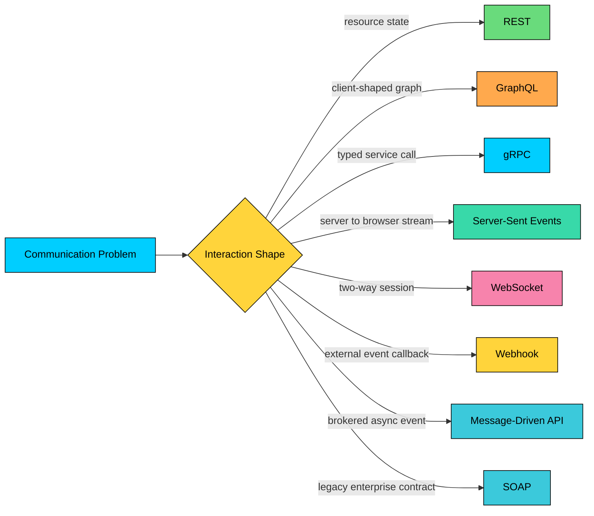
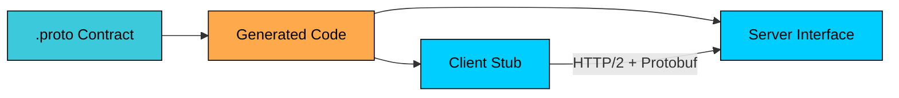
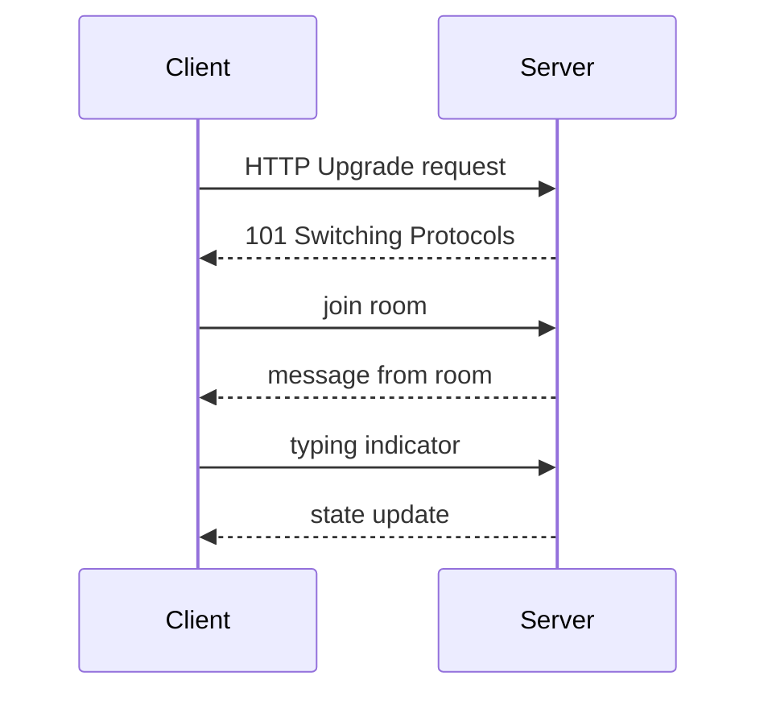
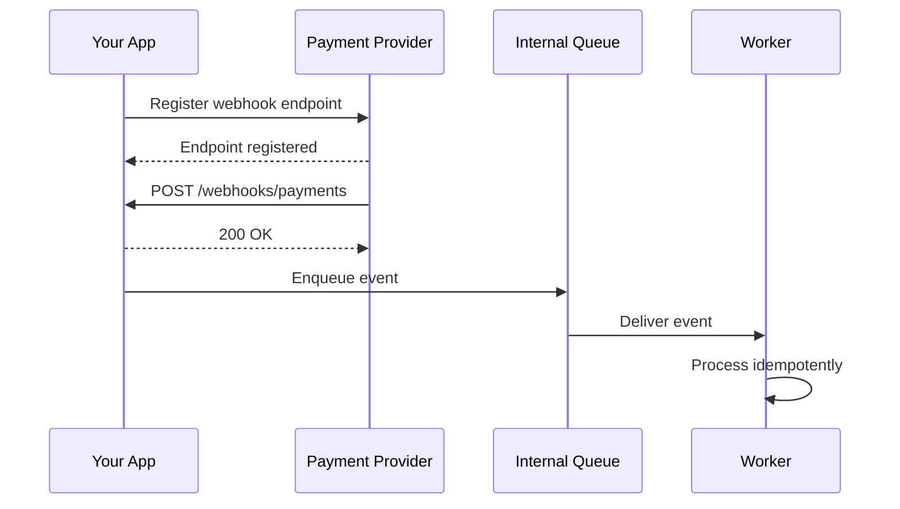
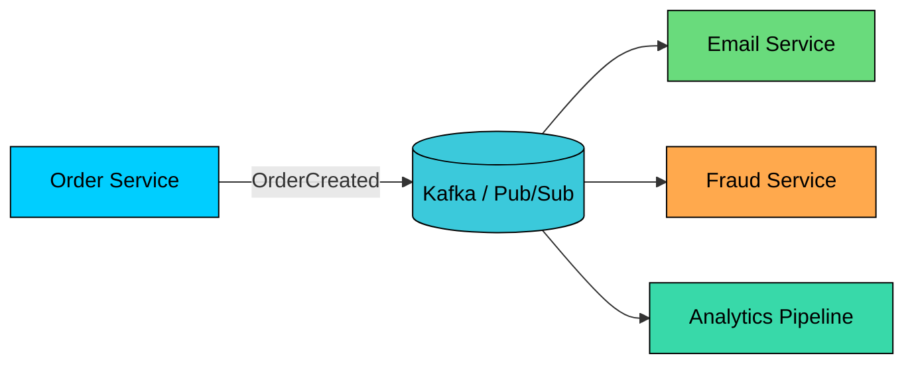

An **API architectural style** is the set of conventions an API follows for how clients express intent, how servers expose capability, how failures are reported, how contracts evolve, and how traffic behaves under load. REST, GraphQL, gRPC, WebSocket, Server-Sent Events, webhooks, SOAP, and message-driven APIs each fit a different communication problem.

A public product API needs predictable HTTP behavior, caching, documentation, and broad client support. A mobile screen may need one round trip across many backend systems. A model-serving path may need strict schemas, deadlines, and streaming tokens. A payment provider needs to notify another server after a charge settles. Those are different API problems and no single style is the right answer for all of them.

Good API architecture starts with the interaction pattern, then chooses the style that fits it.

---

# 1. What an API Style Decides

An API architectural style defines the constraints around communication:

- **Interaction model:** request-response, streaming, bidirectional session, callback, or brokered event
- **Contract shape:** resources, query schema, RPC methods, event types, or XML service descriptions
- **Transport:** HTTP/1.1, HTTP/2, HTTP/3, WebSocket, Kafka, MQTT, AMQP, or another protocol
- **Data format:** JSON, XML, Protocol Buffers, Avro, text/event-stream, or custom frames
- **Failure model:** HTTP status codes, GraphQL errors, gRPC status codes, retryable events, or dead-letter queues
- **Evolution model:** optional fields, versioned endpoints, schema registries, generated clients, or compatibility rules
- **Operational model:** caching, load balancing, observability, retries, backpressure, and security controls



Teams often choose by familiarity. REST is a strong default for public APIs, but it does not fit every problem. WebSocket is useful for bidirectional sessions, but it is unnecessary for one-way server updates. gRPC is excellent for internal service contracts, but it is usually awkward as a public browser API. Webhooks are simple at the surface, but they require idempotency, signature verification, and retry handling.

---

# 2. REST

**REST** is an architectural style for networked systems described by Roy Fielding in 2000. The full style imposes six constraints: a uniform interface, statelessness (the server keeps no per-client session state between requests), cacheability of responses, a client-server separation, a layered system (intermediaries are allowed), and an optional "code on demand" capability. Fielding's uniform interface also requires **HATEOAS**, where the server returns hypermedia links that drive the client's next action.

In everyday API design, REST is used more loosely. It usually means resources identified by URLs, manipulated through standard HTTP methods, with representations such as JSON. Most APIs called "RESTful" satisfy the resource model, statelessness, and uniform method use, but skip HATEOAS in favor of an OpenAPI document. Knowing the full constraints is useful in interviews and when reading older systems, but pragmatic REST in 2026 is what most teams ship.

REST works well when the domain can be modeled as resources such as users, orders, payments, files, conversations, model runs, and evaluation jobs.

### 2.1 Resource-Oriented Design

The method carries the operation semantics:

| Method | Common Meaning | Safe | Idempotent |
|--------|----------------|------|------------|
| GET | Read a resource | Yes | Yes |
| POST | Create or trigger processing | No | No by default |
| PUT | Replace a resource | No | Yes |
| PATCH | Partially update a resource | No | Depends on patch semantics |
| DELETE | Delete a resource | No | Yes |

HTTP status codes, cache headers, content negotiation, conditional requests, and standard authentication patterns give REST APIs a strong operational base.

### 2.2 Example

### 2.3 When REST Fits

Use REST when:

- The API exposes resource state.
- External developers need broad tooling and simple HTTP behavior.
- Responses benefit from HTTP caching.
- Clients can work with server-defined response shapes.
- The API needs clear semantics for retries, status codes, rate limits, and pagination.

REST is a poor fit when clients need highly variable nested data, a single user action fans out across many backend reads, or the API is mainly a set of typed internal commands.

---

# 3. GraphQL

**GraphQL** is a query language and execution model for APIs. The server exposes a typed graph. The client sends a query describing the exact fields it wants.

GraphQL is useful when multiple clients need different views of the same connected data. A mobile feed, admin console, partner dashboard, and moderation tool may all read posts, users, comments, policy decisions, and model-generated labels, but each screen needs a different shape.

### 3.1 Query Shape

The client gets one response shaped like the query.

### 3.2 Schema Contract

GraphQL supports queries for reads, mutations for writes, and subscriptions for long-lived update streams. The GraphQL specification defines the language and execution semantics, including the `Subscription` operation type. Deployment details such as transport, caching strategy, authorization model, and the wire protocol used for subscriptions (typically `graphql-ws` over WebSocket, or `graphql-sse` over Server-Sent Events) are implementation choices that sit outside the spec.

### 3.3 Tradeoffs

GraphQL moves data shaping from server endpoints to client queries. That improves client flexibility, but it also creates backend responsibilities: query complexity limits, authorization at field and object boundaries, N+1 query prevention with batching or data loaders, pagination conventions, observability by operation name, persisted queries for production clients, and a cache strategy that goes beyond simple URL-based HTTP caching.

Use GraphQL when client-driven selection solves a real product problem. Avoid it when a small set of stable REST endpoints would be easier to secure, cache, monitor, and operate.

---

# 4. gRPC

**gRPC** is an RPC framework built around service definitions, generated clients and servers, Protocol Buffers, HTTP/2, deadlines, metadata, status codes, and streaming.

RPC APIs model actions directly:

- `GetUser`
- `CreatePayment`
- `RankCandidates`
- `GenerateEmbedding`
- `StreamTokens`

That fits internal service-to-service calls better than public resource APIs.

### 4.1 Service Definition

The `.proto` file is the contract. Code generation gives each language typed clients and server interfaces.



### 4.2 When gRPC Fits

Use gRPC when:

- Services are owned by the same organization.
- Contracts need strong typing and generated clients.
- Calls need deadlines, cancellation, and structured status codes.
- Payload size and parsing cost matter.
- Streaming is part of the service contract.
- Multiple backend languages need one contract definition.

gRPC is less convenient for public browser APIs. Browsers speak HTTP/2 fine, but the Fetch and XHR APIs do not expose the low-level HTTP/2 features gRPC needs, in particular trailers and frame-level control of the request body. Browser clients usually need gRPC-Web, Connect, or a JSON/REST facade in front of a gRPC service.

---

# 5. Server-Sent Events

**Server-Sent Events**, or SSE, is a browser-supported way for a server to push a one-way stream of events over HTTP. The browser uses `EventSource`, and the response uses the `text/event-stream` format.

SSE is a better fit than WebSocket when the server sends updates and the client only needs normal HTTP requests for commands.

### 5.1 Event Stream

### 5.2 Client Example

Use SSE for live notifications, progress updates, LLM token streaming to browsers, monitoring dashboards, and append-only event feeds.

SSE is one-way from server to client. Use WebSocket when both sides need to send messages frequently over the same connection.

---

# 6. WebSocket

**WebSocket** creates a long-lived, bidirectional connection between client and server. It starts with an HTTP upgrade request, then both sides exchange WebSocket frames over the same connection.



### 6.1 Handshake

### 6.2 When WebSocket Fits

Use WebSocket for chat and collaboration, multiplayer games, trading interfaces, presence and typing indicators, device control channels, and interactive voice or agent sessions where both sides send frequent messages.

WebSocket changes the operational model. Servers hold connections open, load balancers need connection-aware behavior, deployments must handle reconnects, and horizontal scaling needs shared state or a pub/sub layer. Backpressure, authentication refresh, and message ordering need explicit design.

---

# 7. Webhooks

**Webhooks** are HTTP callbacks for event notification. One system registers a URL. Another system sends an HTTP request to that URL when an event occurs.



The receiving endpoint should authenticate the sender, persist the event, return quickly, and process asynchronously.

### 7.1 Production Rules

- Verify signatures using the provider's documented scheme.
- Reject old timestamps to reduce replay risk.
- Use idempotency keys or event IDs.
- Return `2xx` only after the event is durably accepted.
- Process work through a queue.
- Expect retries and duplicate delivery.
- Track delivery failures and dead-letter events.
- Keep raw event payloads for audit and replay when policy allows it.

Webhooks are push-style integration over HTTP. They are not a guaranteed exactly-once delivery mechanism. Treat delivery as at-least-once unless the provider explicitly documents stronger behavior.

---

# 8. Message-Driven APIs

Some APIs are not direct calls at all. In event-driven systems, producers publish messages to a broker, and consumers process those messages independently.



This style fits workflows where the producer should not wait for every consumer: order events, payment lifecycle events, model evaluation results, feature ingestion, audit logs, notification fanout, and data pipeline triggers.

Message-driven APIs need contracts too. Event names, schemas, partitioning keys, ordering guarantees, retry behavior, retention, and compatibility rules must be documented. AsyncAPI describes message-driven APIs in a machine-readable format, and CloudEvents defines a common envelope for event metadata.

### 8.1 Event Contract Example

Message-driven APIs improve decoupling, but they shift complexity into observability, replay, ordering, schema evolution, and failure handling.

---

# 9. SOAP

**SOAP** is an XML-based protocol for exchanging structured messages. It is often paired with WSDL, an XML service description that defines operations, messages, bindings, and endpoints.

SOAP is uncommon for new consumer APIs, but it still appears in banking, insurance, healthcare, government, enterprise resource planning, and older B2B integrations.

### 9.1 Message Shape

SOAP can support formal contracts, XML Schema validation, WS-Security, and enterprise middleware integration. The tradeoff is heavier tooling, verbose payloads, and less natural browser/mobile development.

Use SOAP when the integration partner requires it or when the surrounding enterprise platform already standardizes on SOAP contracts. For new web and mobile APIs, REST, GraphQL, or a typed RPC style is usually easier to operate.

---

# 10. Choosing the Style

Start with the communication pattern, then choose the style.

| Problem | Good Fit | Avoid When |
|---------|----------|------------|
| Public resource API | REST | Clients need arbitrary nested graph queries |
| Product screen reads connected data | GraphQL | A few stable endpoints cover the use case |
| Internal typed service call | gRPC | Browser clients need direct access without a proxy |
| Server pushes one-way browser updates | SSE | Client also sends frequent messages on the stream |
| Long-lived bidirectional interaction | WebSocket | Normal request-response or one-way stream is enough |
| External provider sends event notifications | Webhooks | Caller needs synchronous success from your system |
| Many consumers react to domain events | Message-driven API | Caller requires immediate response from every consumer |
| Legacy enterprise XML integration | SOAP | Starting a new public API |

### 10.1 Decision Flow

```mermaid
flowchart TD
    A{Is the caller waiting<br/>for an immediate response"}:::yellow
    B{Is the API public<br/>and resource-oriented"}:::yellow
    C{Does the client need<br/>custom nested data"}:::yellow
    D{Is this internal<br/>typed service-to-service"}:::yellow
    E{Does the server push<br/>updates to a browser"}:::yellow
    F{Does the client also<br/>send frequent messages"}:::yellow
    G{Is it an external<br/>event callback"}:::yellow

    REST[REST]:::green
    GQL[GraphQL]:::orange
    GRPC[gRPC]:::primary
    SSE[SSE]:::teal
    WS[WebSocket]:::rose
    HOOK[Webhook]:::yellow
    EVENT[Message-Driven API]:::lightblue

    A -->|Yes| B
    A -->|No| G
    B -->|Yes| REST
    B -->|No| C
    C -->|Yes| GQL
    C -->|No| D
    D -->|Yes| GRPC
    D -->|No| E
    E -->|Yes| F
    F -->|No| SSE
    F -->|Yes| WS
    E -->|No| REST
    G -->|Yes| HOOK
    G -->|No| EVENT

    classDef primary fill:#00ceff,stroke:#000,color:#000
    classDef green fill:#69db7c,stroke:#000,color:#000
    classDef orange fill:#ffa94d,stroke:#000,color:#000
    classDef yellow fill:#ffd43b,stroke:#000,color:#000
    classDef teal fill:#38d9a9,stroke:#000,color:#000
    classDef rose fill:#f783ac,stroke:#000,color:#000
    classDef lightblue fill:#3bc9db,stroke:#000,color:#000
```

---

# Summary

API styles are not ranked by modernity. They are designed around different constraints.

**REST** fits resource-oriented public APIs and benefits from HTTP semantics.

**GraphQL** fits product surfaces that need flexible reads over connected data.

**gRPC** fits internal typed service contracts, low-latency calls, and streaming RPC.

**SSE** fits one-way server updates to browsers.

**WebSocket** fits long-lived bidirectional sessions.

**Webhooks** fit external event notifications over HTTP.

**Message-driven APIs** fit asynchronous fanout through brokers.

**SOAP** remains relevant where enterprise contracts and legacy integrations require it.

The practical design question is what communication shape the system needs, what failure model it can tolerate, and what operational tools the team can run reliably. The chosen style follows from those answers.

---

# Quiz
