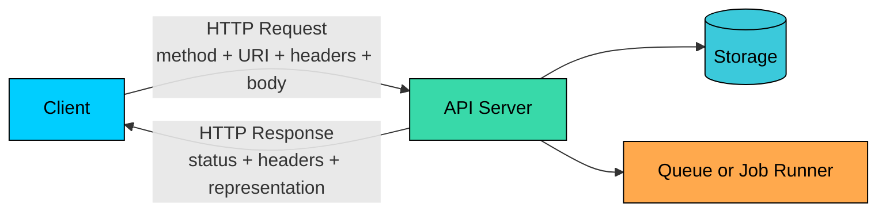
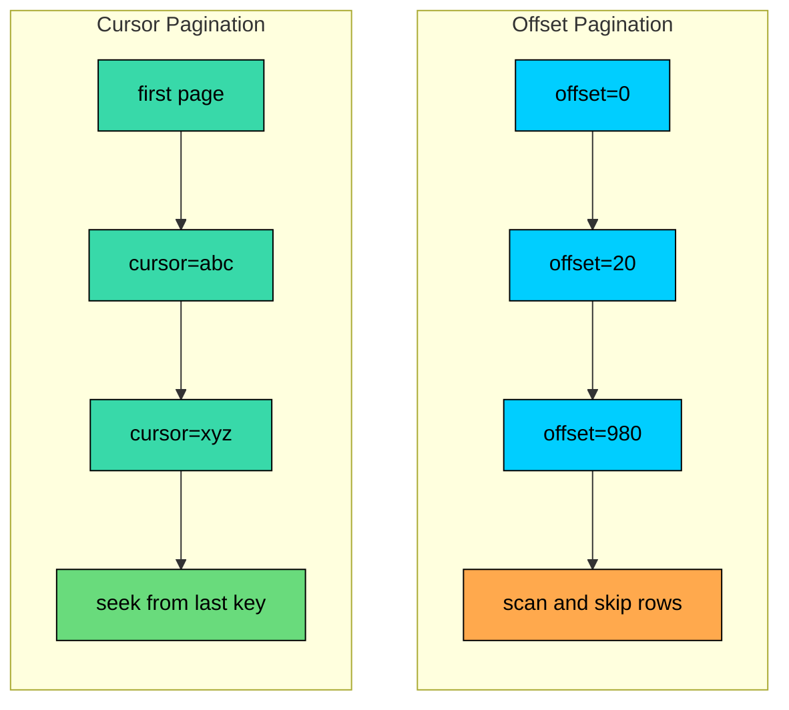

REST remains the default API style for public web APIs, product backends, partner integrations, and many internal services. It works because HTTP is everywhere, tooling is mature, JSON is easy to inspect, and the model is simple enough for clients to use without generated code.

That familiarity can hide design mistakes. A REST API with inconsistent resource names, vague status codes, unsafe retries, unbounded list endpoints, and ad hoc error responses becomes expensive to integrate with. Clients add workarounds. Server teams become afraid to change behavior. Every new endpoint copies old mistakes.

Good REST API design is mostly disciplined use of HTTP semantics: resources, representations, methods, status codes, headers, caching, authentication, and explicit evolution rules.

---

# 1. What REST Means in Practice

**REST (Representational State Transfer)** is an architectural style for networked applications. Roy Fielding described it in his 2000 dissertation. In everyday API design, REST usually means resource-oriented HTTP APIs that expose JSON representations.

REST is not the same thing as "any JSON over HTTP." The important parts are:

- Resources have stable identifiers, usually URIs.
- Clients manipulate resources through standard HTTP methods.
- Requests are stateless.
- Responses carry representations of resource state.
- HTTP metadata, such as status codes, cache headers, validators, and content negotiation, has meaning.

REST is a strong fit when:

- The API exposes resources such as users, orders, files, invoices, model runs, datasets, or projects.
- External developers need easy integration with standard HTTP clients.
- HTTP caching, proxies, gateways, logs, and browser tooling are useful.
- The request and response shapes are stable enough to document with OpenAPI.
- The API needs broad compatibility more than strict generated contracts.

REST is less ideal when clients need arbitrary graph traversal, strongly typed internal RPC, or bidirectional streaming. GraphQL, gRPC, WebSocket, and event-driven APIs exist because they solve different problems.

### 1.1 The Richardson Maturity Model

Leonard Richardson described four levels of REST adoption that are useful for placing real-world APIs:

| Level | Description                                                                                     |
| ----- | ----------------------------------------------------------------------------------------------- |
| 0     | One URI, one method. Everything tunneled through `POST` to a single endpoint.                   |
| 1     | Multiple resource URIs, but still using a single method (often `POST`).                         |
| 2     | Resource URIs plus correct use of HTTP methods and status codes.                                |
| 3     | Level 2 plus hypermedia controls (HATEOAS): responses include links that drive the next action. |

Most APIs called "REST" today sit at Level 2. Fielding's original constraints require Level 3, where the server returns links and clients follow them rather than constructing URIs from out-of-band knowledge. **HATEOAS (Hypermedia as the Engine of Application State)** is the formal name for this constraint.

A Level 3 response might look like this:

In practice, HATEOAS is rarely implemented in full. Most teams treat resource discovery as an OpenAPI concern, not a runtime one. Level 2 plus a published OpenAPI document is the working definition of "RESTful" in most production systems. Knowing the model is still useful: it gives a shared vocabulary for discussing how strictly an API follows REST, and it explains why some critics say a JSON-over-HTTP API "is not really REST."

---

# 2. Resource Design

Resource design is the foundation of a REST API. The URI should identify a thing or collection, not describe an action.

### 2.1 Use Nouns for Resources

The HTTP method carries the action. The URI identifies the resource.

Use action-like subresources only when the operation is not a natural CRUD operation on the resource.

These are commands. Model them deliberately, not as a replacement for normal resource design.

### 2.2 Use Consistent Collection Names

Plural collection names are a common convention:

The exact convention matters less than consistency. Do not mix `/user/123`, `/users/123`, `/customerOrders`, and `/order_items` in the same API.

### 2.3 Keep URLs Stable and Boring

Use lowercase path segments and hyphens for multi-word names.

Avoid putting implementation details in URLs:

- Table names: `/tbl_users`
- File extensions: `/users.json`
- Storage technology: `/dynamo-users`
- Internal service names: `/user-service/users`

Clients should not need to know how the server stores or routes the resource.

### 2.4 Use Nesting Sparingly

Nesting is useful when a child resource only makes sense under a parent.

Deep nesting makes URLs harder to use and can confuse ownership.

Use nesting when it clarifies scope. Flatten when the child can stand alone.

---

# 3. HTTP Methods

HTTP methods define request semantics. Correct method choice affects retries, caching, logs, proxies, and client behavior.

| Method   | Common Use                                     | Safe | Idempotent     |
| -------- | ---------------------------------------------- | ---- | -------------- |
| `GET`    | Read a resource or collection                  | Yes  | Yes            |
| `HEAD`   | Read headers without a response body           | Yes  | Yes            |
| `POST`   | Create subordinate resources or start commands | No   | No by default  |
| `PUT`    | Replace or create a resource at a known URI    | No   | Yes            |
| `PATCH`  | Partially update a resource                    | No   | Not guaranteed |
| `DELETE` | Delete a resource                              | No   | Yes            |

**Safe** means the client did not ask the server to change resource state. `GET` and `HEAD` are safe.

**Idempotent** means repeating the same request has the same intended effect as sending it once. `PUT` and `DELETE` are idempotent by method semantics. `POST` is not idempotent unless the API adds an idempotency mechanism. `PATCH` is not guaranteed to be idempotent because it depends on the patch format and the server; a JSON Merge Patch that sets fixed values is idempotent, a delta operation like `{"counter": "+1"}` is not.

Idempotent does not mean every retry returns the same response. A first `DELETE /users/123` may return `204 No Content` and a retry may return `404 Not Found`. The resource state after both requests is the same, which is what idempotency guarantees.

### 3.1 GET

Use `GET` for reads. Do not use `GET` for state-changing actions.

Avoid designs like this:

Browsers, crawlers, retries, and prefetchers can issue `GET` requests. A `GET` endpoint that changes state is an incident waiting to happen.

### 3.2 POST

Use `POST` to create a resource under a collection or start a command.

`POST` is commonly used when the server chooses the new resource ID.

For retryable creates, use an idempotency key.

The server stores the result for that key and returns the same outcome if the client retries after a timeout.

### 3.3 PUT

Use `PUT` when the client sends a complete representation for a known URI.

With `PUT`, omitted fields may be removed or reset because the request represents the whole resource. That behavior must be documented.

`PUT` can also create a resource at a client-chosen URI. If the resource does not exist, the server creates it and returns `201 Created`; if it already exists, the server replaces it and returns `200 OK` or `204 No Content`. This is useful for resources where the client owns the identifier (such as a user-chosen username or a deterministic key).

### 3.4 PATCH

Use `PATCH` for partial updates.

`PATCH` is a method, not a patch format. Common formats include a partial JSON object (common but API-specific), JSON Merge Patch (`application/merge-patch+json`), and JSON Patch (`application/json-patch+json`). Document the patch semantics so clients know how to remove a value, clear a field, update arrays, and handle unknown fields.

### 3.5 DELETE

Use `DELETE` to remove a resource.

Hard delete, soft delete, archival, and cancellation are different behaviors. Make the resource lifecycle explicit if deletion is not immediate or permanent.

### 3.6 HEAD and OPTIONS

`HEAD` and `OPTIONS` round out the method set. They are rarely the focus of API design, but every server speaks them and clients depend on them.

`HEAD` is identical to `GET` except the server must not return a response body. It returns the same status code and headers a `GET` would. Use it to check whether a resource exists, read its size from `Content-Length`, or refresh an `ETag` without paying the body cost. A well-behaved server should not require any application code to handle `HEAD`; the HTTP framework should strip the body from the corresponding `GET` automatically.

`OPTIONS` describes the communication options for a resource. The most common use is the **CORS preflight** request that browsers send before cross-origin calls that are not "simple requests." The server responds with the methods and headers it accepts:

`OPTIONS` can also describe a resource's capabilities through an `Allow` header listing supported methods. APIs that are not browser-facing usually do not implement `OPTIONS` beyond what the framework provides automatically.

---

# 4. Status Codes

Status codes tell generic HTTP software and API clients what happened at the protocol level. The response body can carry domain details.

### 4.1 Success Codes

| Code  | Name            | Use When                                           |
| ----- | --------------- | -------------------------------------------------- |
| `200` | OK              | Request succeeded and a response body is returned  |
| `201` | Created         | A resource was created                             |
| `202` | Accepted        | Work was accepted for asynchronous processing      |
| `204` | No Content      | Request succeeded and no response body is returned |
| `206` | Partial Content | Byte range response for downloads                  |

Examples:

For `201 Created`, include a `Location` header when the new resource has a URI.

For `202 Accepted`, return a status resource the client can poll.

### 4.2 Client Error Codes

| Code  | Name                   | Use When                                                                            |
| ----- | ---------------------- | ----------------------------------------------------------------------------------- |
| `400` | Bad Request            | Malformed syntax, invalid JSON, invalid parameter shape                             |
| `401` | Unauthorized           | Authentication is missing or invalid                                                |
| `403` | Forbidden              | Caller is authenticated but not allowed                                             |
| `404` | Not Found              | Resource does not exist or should not be revealed                                   |
| `405` | Method Not Allowed     | Method is not supported for this resource                                           |
| `409` | Conflict               | Request conflicts with current resource state (duplicate, illegal state transition) |
| `412` | Precondition Failed    | Conditional request header (`If-Match`, `If-Unmodified-Since`) did not match        |
| `415` | Unsupported Media Type | Request `Content-Type` is not supported                                             |
| `422` | Unprocessable Content  | Request is syntactically valid but semantically invalid                             |
| `429` | Too Many Requests      | Rate limit exceeded                                                                 |

Use `400` for malformed requests. Use `422` for requests that parse correctly but fail domain validation.

Example of `422 Unprocessable Content`, where the JSON is valid but the domain value is invalid:

For authorization failures, `403` is clearer when the caller is allowed to know the resource exists. Use `404` when revealing existence would leak sensitive information.

### 4.3 Server Error Codes

| Code  | Name                  | Use When                                          |
| ----- | --------------------- | ------------------------------------------------- |
| `500` | Internal Server Error | Unexpected server failure                         |
| `502` | Bad Gateway           | Upstream service returned an invalid response     |
| `503` | Service Unavailable   | Temporary overload, maintenance, or load shedding |
| `504` | Gateway Timeout       | Upstream service did not respond in time          |

Clients may retry some 5xx responses, but retries must be bounded and use backoff with jitter. Retrying non-idempotent operations without an idempotency key can create duplicate work.

---

# 5. Request and Response Design

Good request and response design makes the API predictable and reduces client-specific workarounds.

### 5.1 Request Bodies

Request bodies should contain client-controlled fields. Do not require clients to send server-generated fields.

Avoid this:

If the client chooses IDs, make that part of the contract. Client-generated IDs are useful for offline-first systems, idempotency, and distributed writes, but they need validation and collision rules.

### 5.2 Response Bodies

For creates and updates, return the resulting representation unless response size is a concern.

This lets the server return defaults, computed fields, canonical formatting, and server-generated IDs without forcing the client to perform an immediate `GET`.

### 5.3 Envelopes

Two common response styles are direct resources and envelopes.

Direct:

Envelope:

Direct responses align well with HTTP resource representations. Envelopes give a stable place for metadata and pagination. Choose one style per API surface and document it.

### 5.4 Headers

Headers carry protocol metadata, representation metadata, authentication, tracing, and caching controls.

Common request headers:

Common response headers:

`X-Request-ID` or `Traceparent` is valuable for debugging. Echo client-provided request IDs when safe, and generate one when missing.

---

# 6. Pagination

List endpoints must be bounded. Unbounded collection responses become slow, expensive, and unreliable.

### 6.1 Offset Pagination

Offset pagination uses `offset` and `limit`.

Response:

Offset pagination is simple and supports page-numbered interfaces. It performs poorly for deep pages in many databases and can produce duplicates or gaps when records are inserted or deleted while the client paginates.

### 6.2 Cursor Pagination

Cursor pagination uses an opaque token that marks the next position.

Response:

The cursor should be opaque to clients. It may encode a timestamp, ID, sort key, shard key, or signed server state. Clients should store and send it back without parsing it.

Cursor pagination is usually better for large feeds, activity streams, logs, search results, and model-run histories. The tradeoff is that clients cannot jump to arbitrary page numbers without additional server support.

### 6.3 Page Size Rules

Every paginated endpoint should define a default page size, a maximum page size, a stable sort order, cursor expiration behavior, and what happens when the cursor no longer matches current data. Without a stable sort order, pagination cannot be reliable.

---

# 7. Filtering, Sorting, and Search

Filtering, sorting, and search control which resources appear in a collection response.

### 7.1 Filtering

Use query parameters for filters.

Keep filter names consistent across resources. If one endpoint uses `created_after`, do not use `from_date` on another endpoint for the same concept.

For multiple values, choose one convention:

Both can work. Repeated parameters are often easier for generic HTTP tooling. Comma-separated values are compact but need clear escaping rules.

### 7.2 Sorting

Use a `sort` parameter with documented field names.

Do not allow arbitrary database column names. Expose a whitelist of stable API field names.

### 7.3 Search

Use `q` or `search` for broad text search.

Search endpoints often behave differently from simple filters. They may use ranking, stemming, typo tolerance, semantic search, vector search, or permissions-aware indexing. Document ranking behavior, supported filters, and result freshness.

For AI products, separate search resources can be clearer than hiding expensive semantic search behind a normal list endpoint.

---

# 8. Caching and Conditional Requests

Caching is one of REST's major advantages over ad hoc RPC-style HTTP APIs. Use it deliberately.

### 8.1 Cache-Control

`Cache-Control` tells clients and intermediaries how a response can be stored and reused.

- `public` allows shared caches such as CDNs to store the response.
- `private` limits storage to a single user agent.
- `no-store` prevents storage and is appropriate for highly sensitive responses.

Do not use `no-cache` when the goal is "never store this." In HTTP caching, `no-cache` means the stored response must be revalidated before reuse.

### 8.2 ETags

An `ETag` is a validator for a representation. A **strong ETag** (`ETag: "user-123-v7"`) means the representation is byte-for-byte identical. A **weak ETag** (`ETag: W/"user-123-v7"`) means the representations are semantically equivalent but may differ at the byte level, for example after gzip compression or whitespace normalization. Use weak ETags when proxies or content transformations sit in front of the origin.

A client can revalidate with `If-None-Match`:

ETags also protect writes from lost updates:

If another client updated the resource first, the ETag no longer matches and the server returns `412 Precondition Failed`. Use `412` whenever the failure is tied to a conditional request header. Reserve `409 Conflict` for state conflicts that are not expressed as a precondition, such as creating a resource with a duplicate unique key or applying an illegal state transition.

### 8.3 Vary

Use `Vary` when the response depends on request headers.

Incorrect `Vary` headers can leak data or destroy cache efficiency. Be careful with authenticated responses and shared caches.

---

# 9. Versioning and Evolution

API versioning is a compatibility strategy, not a substitute for careful change management.

### 9.1 Additive Changes

These changes are usually safe:

- Add a new endpoint.
- Add an optional request parameter.
- Add a nullable response field.
- Add a new enum value when clients handle unknown values.
- Add a new error code when the HTTP status remains sensible.

Clients should ignore unknown response fields. Servers should ignore unknown request fields only if that behavior is documented and safe.

### 9.2 Breaking Changes

These changes require a new version, migration path, or explicit client opt-in:

- Remove a field.
- Rename a field.
- Change a field type.
- Change a field meaning.
- Add a required request field.
- Change pagination behavior.
- Change authentication or authorization semantics.
- Change error response shape.

### 9.3 Versioning Styles

Path versioning is common and easy to operate:

Header or media type versioning keeps URLs stable:

Custom version headers are explicit but less standard:

Date-based versions are useful for public APIs where behavior is pinned per account or per request.

For most teams, `/v1` path versioning is the easiest to document, route, test, and deprecate.

### 9.4 Deprecation

A versioning strategy should define how long old versions are supported, how clients receive deprecation notices, whether sunset dates are communicated through headers, documentation, and dashboards, and how incompatible behavior changes are tested before rollout. Treat API deprecation like a migration project, not a cleanup task.

---

# 10. Authentication and Authorization

Authentication identifies the caller. Authorization decides what the caller can do.

### 10.1 API Keys

API keys are common for server-to-server access and public developer APIs.

Avoid putting API keys in query parameters. URLs are logged by browsers, proxies, analytics systems, and load balancers.

Well-managed API keys carry a prefix that identifies the key type without exposing the secret, are hashed at rest, support rotation and revocation, are scoped to one environment, and are paired with rate limits and audit logs.

### 10.2 Bearer Tokens and JWTs

Bearer tokens are sent with the `Authorization` header.

JWTs are self-contained signed tokens. They can reduce database lookups, but they require careful validation:

- Verify signature.
- Verify issuer and audience.
- Enforce expiration.
- Handle key rotation.
- Avoid trusting unvalidated claims.
- Define revocation behavior for high-risk actions.

Do not use JWTs as a session database replacement without thinking through logout, compromised tokens, permission changes, and tenant membership changes.

### 10.3 OAuth 2.0

OAuth 2.0 is for delegated authorization. It lets one application access resources on behalf of a user or another workload without sharing the user's password.

Use OAuth when third-party applications access user data, when users grant limited scopes to those applications, when an enterprise identity provider issues access tokens, or when machine-to-machine clients need scoped credentials. Do not describe OAuth as "login" by itself. Login is authentication. OAuth is authorization. OpenID Connect builds authentication on top of OAuth 2.0.

### 10.4 Authorization

Authorization belongs close to business logic. Broad checks at the gateway are useful, but resource-level checks must still happen inside the service.

Common authorization models:

| Model | Use Case                                                          |
| ----- | ----------------------------------------------------------------- |
| RBAC  | Roles such as admin, editor, viewer                               |
| ABAC  | Rules based on attributes such as region, tenant, risk, ownership |
| ReBAC | Relationship-based access such as user belongs to workspace       |

AI systems often need tenant-aware and data-aware authorization. A user may be allowed to see a model run but not the source documents, prompt, tool output, or evaluation labels attached to it.

### 10.5 CORS for Browser Clients

**CORS (Cross-Origin Resource Sharing)** is the browser-enforced mechanism that controls which web origins can call an API. It only matters when a browser script makes the request. Server-to-server clients, mobile apps, and CLI tools ignore CORS entirely.

The browser classifies requests as either *simple* (a small set of methods and headers) or *non-simple*. For non-simple requests, the browser sends an `OPTIONS` preflight first and refuses to call the real endpoint unless the preflight succeeds.

A minimal CORS configuration for a public API typically looks like this:

A few things that trip up real APIs:

- `Access-Control-Allow-Origin: *` cannot be combined with `Access-Control-Allow-Credentials: true`. If the API uses cookies or `Authorization` headers from browsers, the origin must be echoed explicitly and the `Vary: Origin` header set so caches stay correct.
- Custom request headers (such as `Idempotency-Key` or `X-Trace-Id`) must be listed in `Access-Control-Allow-Headers` or the browser will block the request.
- Custom response headers (such as `X-Request-Id` or `RateLimit-*`) are not visible to JavaScript unless they appear in `Access-Control-Expose-Headers`.
- CORS is not a defense against unauthorized access. It only restricts what browser JavaScript can read. Authentication, authorization, and rate limiting still need to be enforced on the server.

---

# 11. Error Handling

Errors need a stable shape. Clients should not parse prose to decide what to do.

### 11.1 Problem Details

RFC 9457 defines **Problem Details for HTTP APIs**, commonly serialized as `application/problem+json`.

The standard fields are:

- `type`: stable URI identifying the problem type.
- `title`: short human-readable summary.
- `status`: HTTP status code.
- `detail`: human-readable explanation for this occurrence.
- `instance`: URI or identifier for this occurrence.

Extension fields such as `errors`, `error_code`, or `request_id` are allowed when documented.

### 11.2 Stable Application Error Codes

HTTP status codes are intentionally broad. Add stable application codes for programmatic handling.

| Error Code                | HTTP Status | Meaning                             |
| ------------------------- | ----------- | ----------------------------------- |
| `VALIDATION_ERROR`        | `422`       | Field or business validation failed |
| `AUTHENTICATION_REQUIRED` | `401`       | Missing or invalid credentials      |
| `PERMISSION_DENIED`       | `403`       | Caller lacks permission             |
| `RESOURCE_NOT_FOUND`      | `404`       | Resource was not found              |
| `VERSION_CONFLICT`        | `409`       | Resource version conflict           |
| `RATE_LIMIT_EXCEEDED`     | `429`       | Quota exhausted                     |
| `INTERNAL_ERROR`          | `500`       | Unexpected server failure           |

Keep codes stable across versions. Changing an error code can break clients as surely as changing a field name.

### 11.3 Hide Internals

Exclude stack traces, SQL queries, file paths, table names, provider credentials, model prompts, and internal service names from API errors.

Bad:

Better:

Log internal details with the request ID. Return safe details to the client.

---

# 12. Rate Limiting and Quotas

Rate limiting protects availability, controls cost, and gives clients predictable boundaries.

### 12.1 Limit Dimensions

Rate limits can apply by:

| Dimension  | Example                                            |
| ---------- | -------------------------------------------------- |
| IP address | Anonymous traffic                                  |
| User       | Authenticated product usage                        |
| API key    | Developer platform access                          |
| Tenant     | Enterprise workspace quota                         |
| Endpoint   | Expensive report or search calls                   |
| Cost unit  | Tokens, GPU seconds, vector queries, exported rows |

AI APIs often need cost-based limits rather than request counts alone. A request that generates 50 tokens and a request that processes a 200-page document should not cost the same quota unit.

### 12.2 Algorithms

Common strategies:

- **Fixed window:** Simple, but allows bursts at window boundaries.
- **Sliding window:** Smoother, more accurate, more expensive.
- **Token bucket:** Allows controlled bursts while limiting sustained rate.
- **Leaky bucket:** Smooths traffic into a steady rate.
- **Concurrency limit:** Caps in-flight expensive work.

Use different limits for different work.

### 12.3 Response Headers

Use `429 Too Many Requests` when a client exceeds a limit. Include `Retry-After` when the client should wait before retrying.

Many APIs also expose rate-limit headers. Older `X-RateLimit-*` names are widely deployed. Newer `RateLimit-*` names came from IETF draft work and are also used, but implementations still vary. Document exact semantics, especially whether reset time is a Unix timestamp or seconds from now.

Clients should treat these as guidance and still handle `429`.

---

# 13. Documentation and Contracts

A REST API should have a machine-readable contract. OpenAPI is the common choice. The contract should describe every endpoint and method, the authentication requirements, the request and response schemas, the error schema, the status codes returned, the behavior of pagination, sorting, filtering, and rate limiting, the idempotency semantics, and any deprecation timelines.

Use contract checks in CI when possible. Breaking a public API should be intentional, reviewed, and announced.

---

# Summary

REST API design is disciplined HTTP design.

**Model resources clearly.** Use stable resource names, consistent collection conventions, shallow nesting, and command resources only when CRUD does not fit.

**Use HTTP semantics precisely.** Method safety, idempotency, status codes, validators, cache headers, and content types affect real client and infrastructure behavior.

**Bound every collection.** Pagination, filtering, sorting, and search need documented limits and stable ordering.

**Design for retries and conflicts.** Use idempotency keys for retryable creates, ETags for conditional updates, and clear `409` or `412` responses for conflicts.

**Return consistent errors.** `application/problem+json` gives a standard base. Add stable application error codes and safe field-level details.

**Treat security and quotas as API design.** Authentication, authorization, rate limits, request IDs, audit logs, and safe error messages are part of the contract clients rely on.

---

# Quiz
