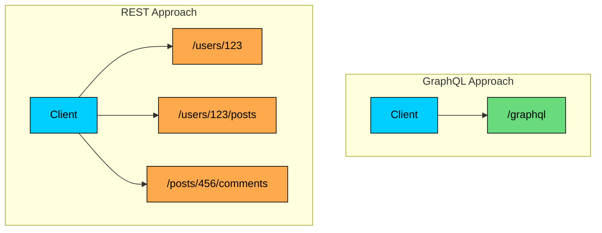
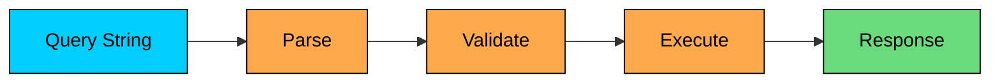
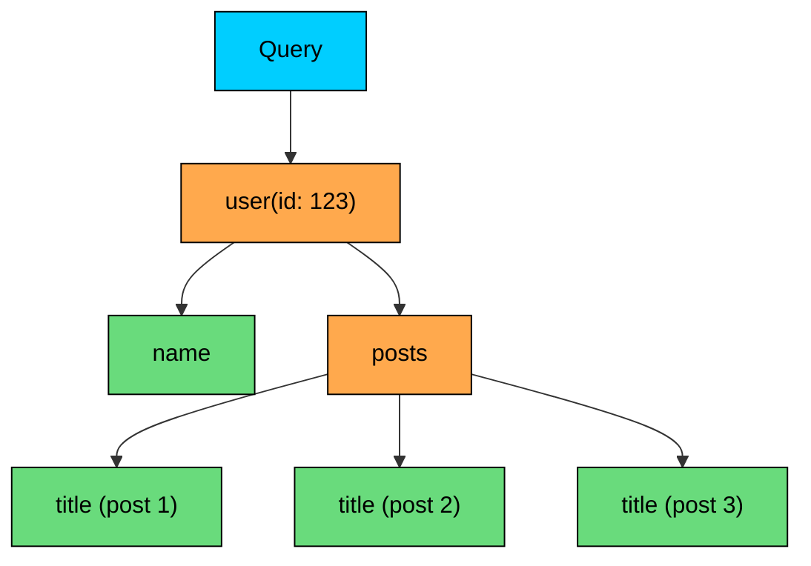
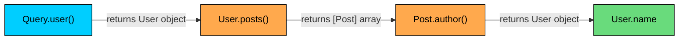
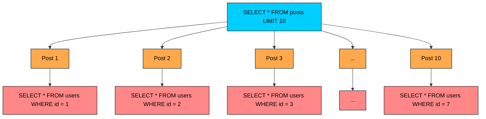
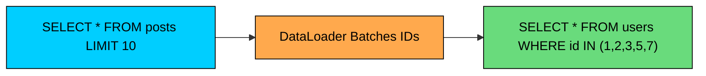

If you've built APIs using REST, you've probably run into its limitations. A mobile app needs just a user's name and avatar, but the `/users/123` endpoint returns 30 fields. Or worse, you need data from three different endpoints to render a single screen, turning one user action into a waterfall of network requests.

**GraphQL** was created to solve these problems. But calling it "just a better REST" misses the point. GraphQL represents a fundamentally different way of thinking about API design, where the client, not the server, decides what data it needs.

In this chapter, we'll go beyond the basics. We'll explore how GraphQL actually works under the hood, how resolvers execute queries, common pitfalls like the N+1 problem, and when GraphQL is (and isn't) the right choice.

---

# 1. The Problem GraphQL Solves

> [!PAYWALL] This content is for premium members only.

Before diving into GraphQL, let's understand why Facebook engineers created it in 2012.

Facebook's mobile app was struggling. The News Feed needed to fetch posts, authors, comments, likes, and media, all interconnected. 

With REST, this meant either:

1. **Over-fetching:** One endpoint returns everything, wasting bandwidth on mobile networks
2. **Under-fetching:** Multiple round trips to different endpoints, causing latency

Neither option worked well for a mobile app on spotty 3G connections.

The team needed a way for the client to declare exactly what data it needed and get it all in a single request. That's the core insight behind GraphQL.

With REST, you need three round trips. With GraphQL, you describe what you want once, and the server assembles it for you.

---

# 2. Core Concepts

GraphQL has three fundamental building blocks: the **Schema**, **Operations**, and **Resolvers**.

### The Schema: Your API's Type System

The schema is the heart of any GraphQL API. It defines what data exists, how it's structured, and what operations clients can perform.

Think of it as a contract between the client and server. The schema guarantees that if you ask for a field, it will be there (or explicitly null).

A few things to notice:

- **`!` means non-nullable.** `name: String!` guarantees the field will always have a value.
- **`[Post!]!` means a non-null list of non-null posts.** The list will always exist (never null), and every item in it will be a valid Post.
- **Types can reference each other.** A `User` has `posts`, and a `Post` has an `author` who is a `User`. This creates a graph structure.
- **Three root types:** `Query` for reading data, `Mutation` for writing data, and `Subscription` for real-time updates.

### Operations: Queries, Mutations, and Subscriptions

GraphQL supports three types of operations:

#### Queries: Reading Data

Queries fetch data. The client specifies exactly which fields it wants:

The response mirrors the query structure exactly:

Notice how we didn't ask for `email`, `followers`, or `createdAt`. We only get what we requested.

#### Mutations: Writing Data

Mutations modify data on the server. They work like queries but signal that something will change:

After the mutation executes, you can immediately query the result. This is useful for updating your UI with the new data.

#### Subscriptions: Real-Time Updates

Subscriptions maintain a persistent connection (usually via WebSocket) and push data to the client when events occur:

When someone adds a comment to post 456, all subscribed clients receive the new comment data instantly.

---

# 3. How Query Execution Works

Understanding how GraphQL executes queries helps you write better schemas and debug performance issues.

When a query arrives, GraphQL goes through four phases:

### Phase 1: Parsing

The GraphQL server parses the query string into an Abstract Syntax Tree (AST). This tree represents the structure of the query in a form the server can work with.

If the query has syntax errors (missing braces, typos in keywords), parsing fails immediately.

### Phase 2: Validation

The server validates the AST against the schema:

- Do all requested fields exist on their types"
- Are arguments the correct types"
- Are required arguments provided"

This catches errors before any database queries run. If you ask for a `user.phone` field that doesn't exist in the schema, validation fails with a clear error message.

### Phase 3: Execution

This is where the magic happens. The server traverses the query tree and calls **resolver functions** to fetch the actual data.

Consider this query:

Execution works depth-first:

1. Call the `user` resolver with `id: "123"`
2. Once we have the user, call the `name` resolver (usually just returns `user.name`)
3. Call the `posts` resolver to fetch the user's posts
4. For each post, call the `title` resolver

### Phase 4: Response

The server assembles all resolved values into a JSON response that matches the query shape exactly.

---

# 4. Resolvers: The Engine Room

Resolvers are functions that fetch the data for each field. They're where GraphQL connects to your databases, APIs, and business logic.

A resolver receives four arguments:

### Default Resolvers

You don't need to write a resolver for every field. If no resolver is defined, GraphQL uses a default resolver that simply returns `parent[fieldName]`.

This means for a field like `name` on a `User` type, if your database already returns an object with a `name` property, you're done.

### Resolver Chains

Resolvers form a chain. The return value of a parent resolver becomes the first argument to child resolvers:

This chain allows you to traverse relationships naturally. When you query `user.posts.author.name`, each resolver only needs to know how to get its piece of the puzzle.

---

# 5. The N+1 Problem and DataLoader

Here's where naive GraphQL implementations run into trouble.

Consider this query:

With naive resolvers, here's what happens:

1. One query to fetch 10 posts
2. For each post, one query to fetch the author

That's 1 + 10 = 11 database queries. If you had 100 posts, you'd make 101 queries. This is the **N+1 problem**.

### The Solution: DataLoader

**DataLoader** (created by Facebook) solves this by batching and caching requests within a single GraphQL operation.

Instead of fetching authors one by one, DataLoader collects all the author IDs requested during execution, then makes a single batched query:

Now instead of 11 queries, we have 2:

1. `SELECT * FROM posts LIMIT 10`
2. `SELECT * FROM users WHERE id IN (1, 2, 3, 5, 7)` (deduplicated!)

DataLoader also deduplicates requests. If two posts have the same author, that author is only fetched once.

---

# 6. Caching in GraphQL

One of REST's advantages is HTTP caching. Each URL is a natural cache key, and CDNs can cache responses effortlessly.

GraphQL is trickier because:

1. Most implementations use POST requests (which aren't cached by default)
2. Different queries to the same endpoint return different data
3. The same data might appear in multiple queries under different paths

### Client-Side Caching

GraphQL clients like **Apollo Client** and **Relay** implement sophisticated caching by normalizing the response.

When you fetch a user with ID 123, the client stores it in a normalized cache keyed by type and ID:

Now if another query requests the same user, the client can serve it from cache without a network request. The key insight is that entities are cached by their **global identity** (type + ID), not by the query path.

### Server-Side Caching

For server-side caching, you have several options:

**1. Response Caching:** Cache entire responses for identical queries. Works well for public data.

**2. Persisted Queries:** Instead of sending the full query string, send a hash. The server maps hashes to queries. This enables GET requests and traditional HTTP caching.

**3. Field-Level Caching:** Cache individual resolver results. If multiple queries need the same user, the resolver can return a cached value.

---

# 7. Security Considerations

GraphQL's flexibility is a double-edged sword. Clients can construct complex queries that stress your server.

### Query Depth Limiting

Deeply nested queries can be expensive:

**Solution:** Limit query depth. Most GraphQL servers support this:

### Query Complexity Analysis

Some queries are expensive regardless of depth:

This could fetch 1000* *x* *100 x 100 = 10 million comments.

**Solution:** Assign complexity scores to fields and reject queries exceeding a threshold:

### Rate Limiting

Standard rate limiting still applies. You might limit by:

- Requests per minute
- Total complexity points per minute
- Specific expensive operations

### Introspection in Production

GraphQL's introspection feature lets clients discover your entire schema. This is great for development but potentially dangerous in production.

**Solution:** Disable introspection in production or restrict it to authenticated users.

---

# 8. Schema Design Best Practices

Good schema design makes GraphQL APIs intuitive and performant.

### Use Connections for Pagination

Instead of returning raw arrays, use the **Connections** pattern for paginated data:

This pattern enables cursor-based pagination, which is more reliable than offset-based pagination for frequently changing data.

### Input Types for Mutations

Use dedicated input types for mutation arguments:

This makes mutations cleaner and easier to evolve.

### Use Enums for Fixed Options

Enums provide type safety and documentation built into the schema.

### Nullable vs Non-Nullable

Be intentional about nullability:

- Use `!` for fields that should always exist
- Allow null for optional data or when fetching might fail
- Non-null arrays of non-null items (`[Post!]!`) are often the safest default

---

# 9. GraphQL vs REST: When to Use Each

GraphQL isn't universally better than REST. Here's when each shines:

| Aspect | GraphQL | REST |
|--------|---------|------|
| **Multiple clients with different needs** | Excellent. Each client queries exactly what it needs. | Poor. You end up with multiple endpoints or over-fetching. |
| **Simple CRUD operations** | Overkill. GraphQL adds complexity. | Perfect fit. REST's conventions work great. |
| **HTTP caching** | Challenging. Requires workarounds. | Native support. CDNs just work. |
| **Real-time updates** | Built-in subscriptions. | Requires separate WebSocket implementation. |
| **File uploads** | Awkward. Requires multipart spec extensions. | Straightforward. |
| **Public API for third parties** | Good with careful design. Self-documenting. | Great. Well-understood conventions. |
| **Mobile apps** | Excellent. Minimizes bandwidth usage. | Acceptable with careful endpoint design. |
| **Microservices orchestration** | Great as a gateway that aggregates services. | Works but requires more client-side coordination. |

### Use GraphQL When:

- You have multiple clients (web, mobile, IoT) with different data needs
- Your data is highly interconnected (social graphs, content with relationships)
- You want to iterate quickly without breaking clients
- Bandwidth efficiency matters (mobile apps)

### Use REST When:

- You're building a simple CRUD API
- HTTP caching is critical for performance
- Your team is more familiar with REST
- You're exposing a public API where simplicity matters
- File uploads are a core feature

---

# Summary

GraphQL is a powerful alternative to REST that gives clients precise control over the data they fetch. Its type system, introspection capabilities, and flexible queries make it well-suited for complex applications with diverse client needs.

Key takeaways:

- **Schema-first:** The schema is your contract. Design it thoughtfully.
- **Resolvers execute depth-first:** Understanding this helps you optimize performance.
- **Use DataLoader:** The N+1 problem will bite you otherwise.
- **Client-side caching is sophisticated:** Libraries like Apollo Client handle normalized caching.
- **Security requires attention:** Depth limiting, complexity analysis, and rate limiting are essential.
- **GraphQL isn't always the answer:** Sometimes REST's simplicity and caching are exactly what you need.

GraphQL represents a fundamental shift in how we think about APIs: from server-defined endpoints to client-defined queries. Used in the right context with proper precautions, it can dramatically improve developer experience and application performance.

---

# Quiz
