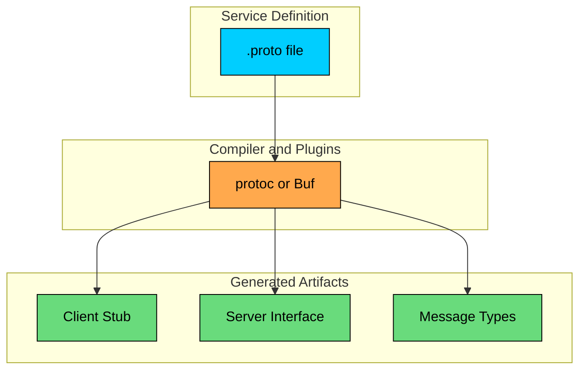
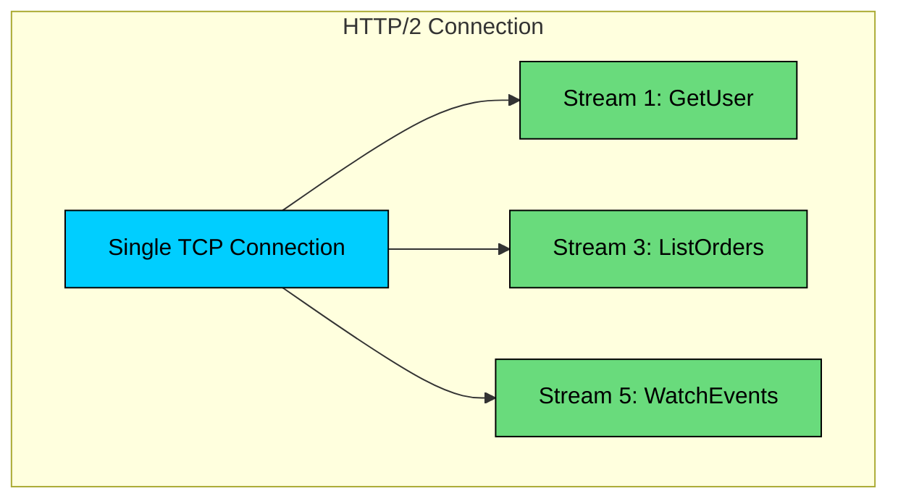
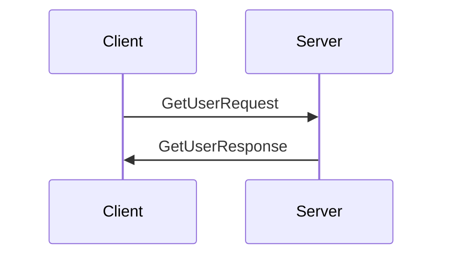
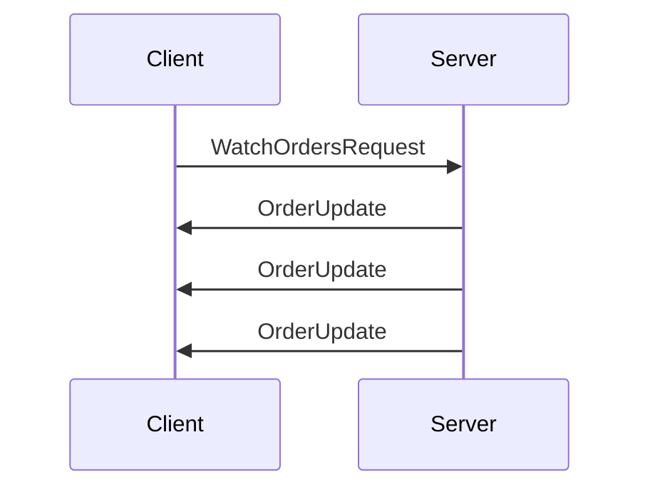
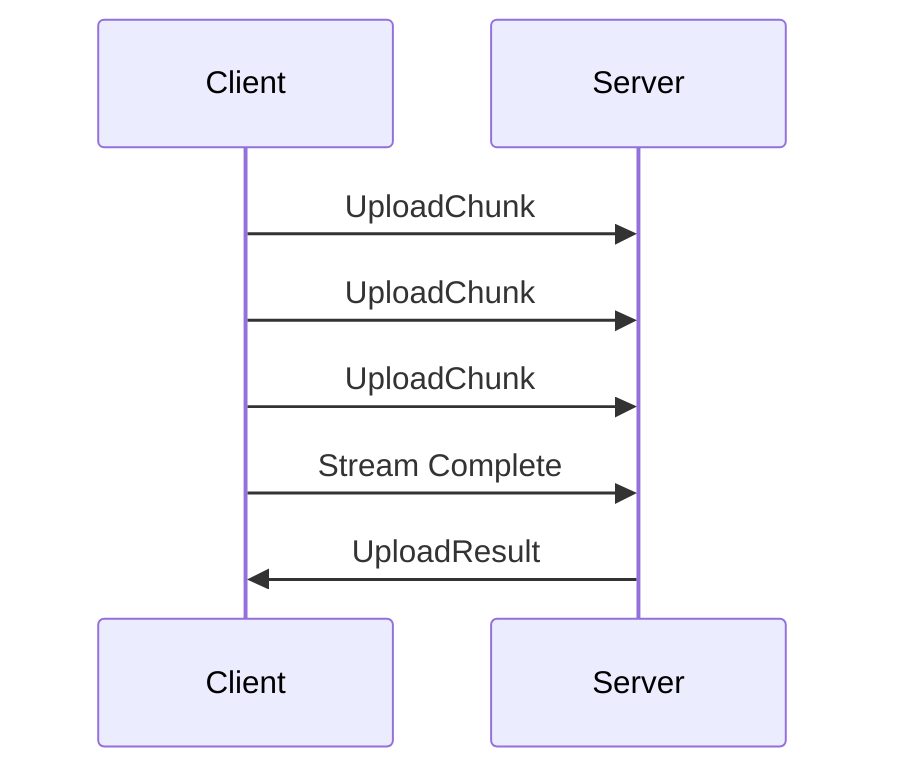
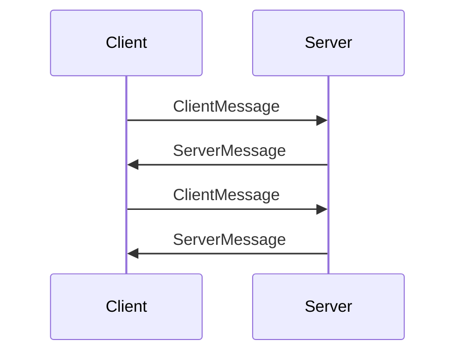
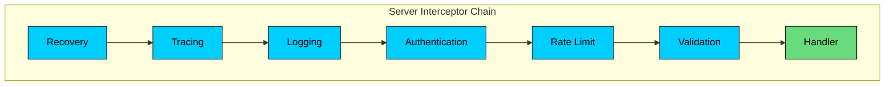
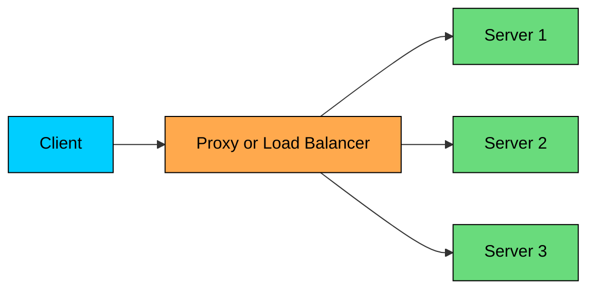
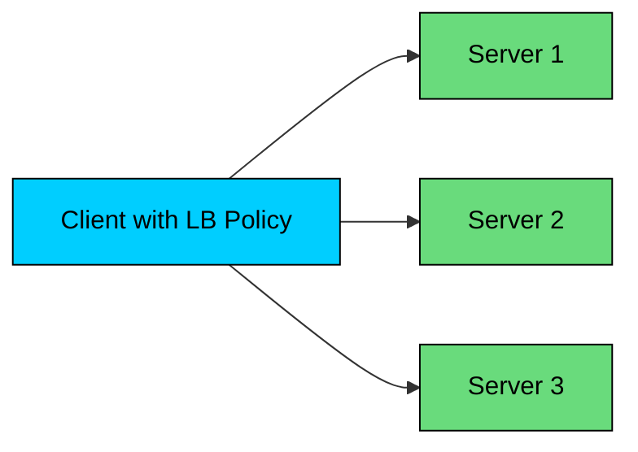
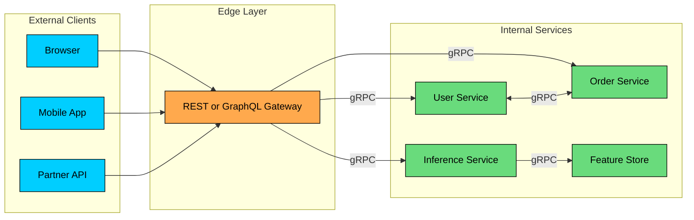

**gRPC** is a contract-first RPC framework built around Protocol Buffers and HTTP/2. A `.proto` file defines the service. Code generation produces typed clients and server interfaces in every supported language. Calls carry deadlines, cancellation, metadata, structured status codes, and optional streaming.

Service-to-service APIs fail in different ways than public web APIs. The caller and server are usually deployed by the same organization, latency budgets are tighter, request rates are higher, and a small contract mismatch can break an entire request path. REST and JSON remain excellent defaults for many systems, but for internal APIs with strict contracts, high call volume, streaming, and services in several languages, REST leaves too much to convention.

gRPC is strongest when you control both sides of the API and can afford the operational discipline that comes with generated contracts. It is not a default replacement for REST at the edge.

---

# 1. What is gRPC"

**gRPC** is an open-source Remote Procedure Call framework. You define services and messages in a `.proto` file, generate client and server code, then implement the server methods in your application.

At a high level, a gRPC call looks like a method call:

Remote calls are not local calls. They can time out, be retried, be cancelled, arrive twice, or fail after the server has already changed state. Good gRPC design keeps those distributed-system realities visible.

### 1.1 Core Components

gRPC has three core pieces:

**Protocol Buffers:** The default interface definition language and serialization format. Protobuf defines the shape of requests, responses, enums, and services. It also defines how messages evolve over time.

**HTTP/2:** The transport used by standard gRPC. HTTP/2 gives gRPC multiplexed streams, binary framing, header compression, flow control, and long-lived connections.

**Generated code:** Language-specific clients, server interfaces, and message types generated from `.proto` files. Generated code is what turns the API contract into something compilers and build pipelines can enforce.

### 1.2 Why Teams Use gRPC

Teams use gRPC for practical reasons:

- **Clear contracts:** The `.proto` file is the source of truth. Clients and servers do not guess field names, status shapes, or payload formats.
- **Polyglot support:** A Go service, Java service, Python worker, and TypeScript edge service can share the same service definition.
- **Efficient payloads:** Protobuf usually sends fewer bytes than equivalent JSON and avoids runtime field-name parsing.
- **Streaming:** gRPC supports unary, server-streaming, client-streaming, and bidirectional-streaming APIs without switching protocols.
- **Operational hooks:** Deadlines, cancellation, metadata, status codes, health checking, and interceptors are part of the programming model.

These benefits matter in internal systems such as payment processing, identity services, recommendation pipelines, search infrastructure, model serving, feature stores, and real-time coordination between backend services.

### 1.3 gRPC vs REST

The choice is a tradeoff, not a contest between "modern" and "old."

| Aspect | gRPC | REST |
|--------|------|------|
| API model | Methods on services | Resources over HTTP |
| Common payload format | Protobuf | JSON |
| Contract | `.proto` schema | Often OpenAPI or documentation |
| Transport | HTTP/2 | HTTP/1.1, HTTP/2, or HTTP/3 |
| Browser support | Usually through gRPC-Web or a gateway | Native |
| Streaming | Built into the framework | SSE, WebSocket, chunked responses, or custom patterns |
| Debugging | Requires tools such as grpcurl, reflection, logs | Easy with curl and browser tooling |
| Best fit | Internal service APIs | Public APIs, browser APIs, simple resource APIs |

Performance claims need care. Protobuf can be much smaller and faster to parse than JSON for many schemas, but the actual gain depends on message shape, compression, language runtime, network distance, connection reuse, and server work. If the database query takes 80 ms, changing JSON to Protobuf will not save the system. If a request path makes 40 small internal calls per user action, gRPC may matter a lot.

### 1.4 When to Choose gRPC

Choose gRPC when the system benefits from a strict generated contract and you control both ends of the connection.

- **Internal microservices:** Service owners can version contracts, generate clients, and enforce deadlines consistently.
- **High-volume request paths:** Small reductions in payload size and parsing overhead matter when the same API is called thousands of times per second.
- **Polyglot systems:** Protobuf keeps Go, Java, Python, C#, Rust, and Node clients aligned.
- **Streaming APIs:** Logs, telemetry, model tokens, event feeds, file chunks, and interactive sessions fit naturally.
- **AI infrastructure:** Model-serving platforms, embedding services, feature retrieval, vector search sidecars, and inference orchestration often need typed internal APIs with explicit deadlines and streaming responses.

### 1.5 When to Avoid gRPC

Avoid gRPC when its contract and tooling overhead do not pay for themselves.

- **Public APIs for broad developer audiences:** REST or GraphQL is usually easier for external developers to explore, debug, and call from any environment.
- **Browser-first applications:** Browsers do not expose the low-level HTTP/2 features needed by native gRPC. gRPC-Web works for many cases, but it adds a proxy or compatible server and does not provide the full native gRPC feature set.
- **Simple CRUD systems:** A small JSON API with OpenAPI documentation may be easier to build and operate.
- **Teams without schema discipline:** gRPC does not save a team from poor API design. Bad proto files become bad generated clients in every language.
- **Payloads dominated by large blobs:** Do not push giant media files, model weights, or large tensor batches through ordinary unary RPCs. Store large objects separately or stream bounded chunks with backpressure.

---

# 2. Protocol Buffers

Protocol Buffers are central to gRPC. They define both the service methods and the messages that cross the wire.

### 2.1 Basic Syntax

A `.proto` file defines messages, enums, and services:

**Field numbers identify fields on the wire.** The serialized message uses field numbers, not field names. Once a field number is used in a production schema, treat it as permanent.

**Enum zero values matter.** In proto3, the first enum value must be zero. Use an explicit `UNSPECIFIED` value so missing data does not accidentally look like a real state.

**Names are for code and JSON mappings.** Renaming a field is usually wire-compatible for binary protobuf, but it can affect generated code, JSON serialization, logs, dashboards, and clients that use reflection.

**Time needs a convention.** Use `google.protobuf.Timestamp` for protobuf's standard timestamp type. Use an explicit numeric convention such as `created_at_unix_ms` when that shape is required, and document it in the field name.

### 2.2 Field Numbers and Encoding

Protobuf encodes a message as a sequence of fields. Each field includes a tag derived from the field number and wire type. Field numbers `1` through `15` encode more compactly than higher numbers, so reserve them for common fields. Field numbers `19000` through `19999` are reserved by protobuf and should not be used. And never reuse a field number for a different meaning, even after the original field has been removed.

This compact encoding is one reason protobuf works well for high-volume service APIs. The tradeoff is that raw binary protobuf is not self-describing. To decode it correctly, the receiver needs the schema.

### 2.3 Scalar Types

Choose scalar types intentionally:

| Protobuf Type | Use For | Notes |
|---------------|---------|-------|
| `int32`, `int64` | Signed integers | Varint encoding; negative values always take 10 bytes, so use only when values are expected to be non-negative |
| `uint32`, `uint64` | Non-negative integers | Varint encoding; cannot represent negative values |
| `sint32`, `sint64` | Signed integers that may be negative | Zigzag encoding; small negative values stay small |
| `fixed32`, `fixed64` | Large or fixed-width numeric values | Always 4 or 8 bytes |
| `float`, `double` | Floating point values | Avoid for money |
| `bool` | Boolean values | Defaults to false |
| `string` | UTF-8 text | Not arbitrary bytes |
| `bytes` | Binary data | Use carefully and bound size |

Do not model money as `float` or `double`. Use integer minor units such as cents, or a decimal representation with currency. Do not model identifiers as numbers unless they are truly numeric; string IDs are easier to migrate across storage systems.

### 2.4 Schema Evolution

Schema evolution is where protobuf pays for itself, but only if the team follows the rules.

**Generally safe changes:**

- Add a new optional field with a new field number.
- Add a new enum value if clients handle unknown or unexpected values safely.
- Rename a field when binary compatibility is enough and generated-code impact is understood.
- Remove a field only after clients no longer depend on it, then reserve its number and name.

**Breaking or risky changes:**

- Change a field number.
- Reuse a deleted field number.
- Change a field type incompatibly.
- Change field meaning while keeping the same field number.
- Tighten validation in a way that rejects requests older clients already send.

Use `reserved` for deleted fields:

In mature organizations, proto changes go through compatibility checks in CI. Tools such as Buf are common because they can lint schemas, detect breaking changes, and standardize code generation across repositories.

---

# 3. HTTP/2 Foundation

Standard gRPC runs over HTTP/2. The transport details explain several gRPC behaviors that show up in production.

### 3.1 What HTTP/2 Gives gRPC

**Multiplexing:** Multiple logical streams share one TCP connection. A slow RPC does not block every other RPC at the HTTP layer.

**Header compression:** HTTP/2 uses HPACK to reduce repeated header overhead. This helps when many calls carry similar metadata, such as authorization, tracing, and routing headers.

**Flow control:** Receivers can slow senders down at the stream and connection level. This matters for streaming APIs where one side can produce data faster than the other side can consume it.

**Binary framing:** HTTP/2 sends structured frames rather than text lines. gRPC builds its message framing on top of this.

HTTP/2 reduces HTTP-level head-of-line blocking, but it does not remove every bottleneck. It still commonly runs over TCP, so packet loss can affect all streams on the same connection. Servers and clients also enforce limits such as maximum concurrent streams and flow-control windows. These limits become important under high concurrency.

### 3.2 Why Browsers Need gRPC-Web

Browsers speak HTTP/2 to servers, but native gRPC depends on low-level HTTP/2 features that the Fetch and XHR APIs do not expose to JavaScript, in particular HTTP/2 trailers (where gRPC sends the final status code) and frame-level control of the request body for client streaming. Browser apps usually call gRPC services through one of these patterns:

- **gRPC-Web:** Browser client uses the gRPC-Web protocol, often through Envoy or a compatible server.
- **JSON transcoding:** An API gateway exposes REST/JSON externally and translates to gRPC internally.
- **Separate BFF:** A Backend-for-Frontend speaks browser-friendly HTTP to the UI and gRPC to internal services.

This distinction matters in system design. gRPC is often excellent inside the data center. It is not the default shape for public browser APIs.

---

# 4. Service Definition and Code Generation

gRPC starts with the service definition. The quality of that definition determines the quality of every generated client.

### 4.1 Project Structure

A typical layout keeps proto files versioned and separate from generated code:

The `v1` package is not decoration. It gives you room to create `users.v2` later without forcing every client to migrate at once.

### 4.2 Code Generation Workflow

The workflow is straightforward:

1. Define services and messages in `.proto` files.
2. Run `protoc`, Buf, or a build-system wrapper with language-specific plugins.
3. Generate message types, client stubs, and server interfaces.
4. Implement server interfaces and publish client libraries or generated artifacts.
5. Run compatibility checks before merging proto changes.

Build pipelines commonly automate this with Bazel, Gradle, Maven, Go generate, Make, or Buf. The goal is reproducibility: a developer should not hand-edit generated code or generate different clients on different machines.

### 4.3 Design the API, Not the Database

A common mistake is copying database tables into proto messages. That leaks storage decisions into clients.

Prefer API-shaped messages. Use request and response wrapper messages even when a method seems to need only one field, since the wrapper leaves room to grow. Keep internal columns, flags, and migration fields out of public service contracts. Separate read models from write commands when validation, authorization, or lifecycle differs. Make pagination, filtering, and ordering explicit in the schema. And use idempotency keys for create operations that clients may retry.

Example:

The explicit response wrapper gives you space to add metadata later without changing the method shape.

---

# 5. Communication Patterns

gRPC supports four RPC patterns. Choose the simplest one that fits the data flow.

### 5.1 Unary RPC

The client sends one request and receives one response.

Use unary RPCs for most ordinary service operations: lookups, commands, validation calls, and small queries.

### 5.2 Server Streaming

The client sends one request and receives a stream of responses.

Use server streaming for event feeds, large scans, log tailing, incremental search results, and token-by-token model responses.

### 5.3 Client Streaming

The client sends a stream of messages and receives one response.

Use client streaming for uploads, batched telemetry, and client-produced data where the server should respond after aggregation.

### 5.4 Bidirectional Streaming

Both sides send streams. The request stream and response stream are independent.

Use bidirectional streaming for chat, collaborative editing, interactive compute sessions, and long-running AI agent sessions where both sides exchange incremental state.

### 5.5 Choosing the Pattern

| Scenario | Pattern | Reason |
|----------|---------|--------|
| Get account by ID | Unary | Simple request-response |
| Create payment | Unary | Command with explicit result |
| Stream model output tokens | Server streaming | One prompt, incremental output |
| Tail logs | Server streaming | Continuous server-side events |
| Upload a large file | Client streaming | Bounded chunks, single result |
| Send telemetry samples | Client streaming | Client produces many records |
| Collaborative editing | Bidirectional streaming | Both sides send updates |
| Interactive agent session | Bidirectional streaming | Ongoing input and output |

Start with unary unless streaming clearly improves memory usage, latency, or interaction model. Streaming adds lifecycle complexity: cancellation, half-closed streams, backpressure, idle timeouts, load balancer behavior, and harder retries.

---

# 6. Deadlines, Cancellation, and Retries

Production gRPC APIs should be designed around deadlines. A service without deadlines can keep doing work long after the caller has given up.

### 6.1 Deadlines

A deadline tells the server how long the client is willing to wait. If the operation exceeds that time, the client receives `DEADLINE_EXCEEDED`.

Deadlines should be set by callers and propagated downstream. For example:

- External request budget: 300 ms
- API gateway work: 40 ms
- User service call: 80 ms
- Recommendation call: 120 ms
- Remaining margin for retries and response assembly: 60 ms

Without propagation, each service may start its own generous timeout and the request path can exceed the user's latency budget.

### 6.2 Cancellation

When a client cancels an RPC or its deadline expires, the server should stop unnecessary work. That means handlers need to check cancellation through the language's context mechanism and pass that context to database calls, queue operations, and downstream RPCs.

Cancellation is especially important for expensive AI workloads. If a user closes a chat session, the inference service should stop generating tokens instead of consuming GPU time for a response nobody will read.

### 6.3 Retries

Retries are useful only when the operation is safe to retry.

- Retry `UNAVAILABLE` for idempotent reads or commands with idempotency keys.
- Be careful with `DEADLINE_EXCEEDED`; the server may still complete the operation after the client times out.
- Do not blindly retry non-idempotent creates, payments, emails, or inventory mutations.
- Use bounded retries with backoff and jitter.

Retries amplify load during incidents. A small timeout plus aggressive retries can turn a slow dependency into a fleet-wide outage. Use retry budgets and circuit breakers for critical paths.

---

# 7. Error Handling

gRPC returns a status for every RPC. The status includes a code, an optional message, and optional trailing metadata.

### 7.1 Status Codes

Use specific status codes. They are part of the API contract.

| Code | Name | Use When |
|------|------|----------|
| 0 | OK | The RPC succeeded |
| 1 | CANCELLED | The operation was cancelled |
| 2 | UNKNOWN | The server cannot classify the error |
| 3 | INVALID_ARGUMENT | The request is malformed or invalid regardless of system state |
| 4 | DEADLINE_EXCEEDED | The deadline expired |
| 5 | NOT_FOUND | The requested resource does not exist |
| 6 | ALREADY_EXISTS | The resource already exists |
| 7 | PERMISSION_DENIED | The caller is authenticated but not allowed |
| 8 | RESOURCE_EXHAUSTED | Quota, rate limit, or capacity was exceeded |
| 9 | FAILED_PRECONDITION | The system state does not allow the operation |
| 10 | ABORTED | A concurrency conflict occurred |
| 11 | OUT_OF_RANGE | A value is outside the allowed range |
| 12 | UNIMPLEMENTED | The method is not implemented |
| 13 | INTERNAL | An invariant failed or unexpected server error occurred |
| 14 | UNAVAILABLE | The service is temporarily unavailable |
| 15 | DATA_LOSS | Unrecoverable data loss or corruption occurred |
| 16 | UNAUTHENTICATED | Authentication is missing or invalid |

Some distinctions matter:

- Use `UNAUTHENTICATED` when identity is missing or invalid.
- Use `PERMISSION_DENIED` when identity is valid but lacks access.
- Use `INVALID_ARGUMENT` when the request is invalid in any state.
- Use `FAILED_PRECONDITION` when the request might be valid in another state.
- Use `ABORTED` for concurrency conflicts that clients may retry with fresh state.

### 7.2 Error Messages and Details

Error messages should help the caller act without exposing internals.

Good:

Bad:

For structured errors, use rich error details such as field violations, retry information, quota failures, and localized messages. This lets clients handle errors programmatically instead of parsing strings.

---

# 8. Interceptors and Middleware

Interceptors are gRPC middleware. They wrap calls and centralize cross-cutting behavior.

### 8.1 How Interceptors Work

Interceptors run before and after the handler. They can inspect metadata, enforce policies, record metrics, attach trace context, convert panics to errors, or reject the call before business logic runs.

There are separate interceptor types for unary and streaming RPCs. Stream interceptors need extra care because they may wrap message receive and send operations, not a single function call.

### 8.2 Common Interceptor Patterns

| Interceptor | Purpose |
|-------------|---------|
| Recovery | Convert panics or exceptions to controlled errors |
| Tracing | Propagate and record distributed traces |
| Logging | Log method, status, peer, latency, and request IDs |
| Authentication | Validate credentials and attach caller identity |
| Authorization | Enforce permissions |
| Rate limiting | Protect capacity and tenant quotas |
| Metrics | Record latency, throughput, payload sizes, and error counts |
| Validation | Reject invalid requests before handlers |

Do not log full request and response bodies by default. Protobuf messages often contain tokens, user data, prompts, embeddings, or other sensitive fields. Log identifiers, sizes, status codes, and selected safe fields.

### 8.3 Ordering

Interceptor order should be deliberate:

1. Recovery, so unexpected failures become controlled statuses.
2. Tracing, so the full call path is visible.
3. Logging and metrics, so failures in later layers are recorded.
4. Authentication and authorization, so unauthenticated work stops early.
5. Rate limiting, so expensive work is protected.
6. Validation, so handlers receive clean input.

The exact order varies by stack, but the principle is constant: centralize common behavior and keep handlers focused on domain logic.

---

# 9. Load Balancing and Service Discovery

gRPC clients often keep long-lived HTTP/2 connections. That changes how load balancing behaves.

### 9.1 Proxy Load Balancing

In proxy load balancing, clients connect to a load balancer such as Envoy, NGINX, HAProxy, AWS ALB, or a service mesh sidecar. The proxy routes requests to backend instances.

This keeps clients simple and centralizes routing, retries, mTLS, policy, and observability. The cost is an extra network hop and another component on the request path.

### 9.2 Client-Side Load Balancing

In client-side load balancing, the gRPC client receives a list of backend addresses and chooses a backend for each RPC.

Core gRPC commonly uses policies such as `pick_first` and `round_robin`. More advanced routing can be done through xDS (the dynamic configuration API family originally developed for Envoy and adopted as the standard control-plane protocol for service meshes), custom policies, or service mesh infrastructure.

### 9.3 Service Discovery

Before a client can balance traffic, it needs addresses.

- **DNS:** Simple and common. In Kubernetes, headless services can return pod IPs.
- **Control plane:** xDS and service meshes can provide endpoints, routing rules, circuit breaking, and outlier detection.
- **Service registry:** Systems such as Consul or etcd can be integrated through custom resolvers or sidecars.

Be careful with connection stickiness. If every client opens one long-lived connection through a layer-4 load balancer, traffic may not distribute evenly as pods scale up and down. HTTP/2-aware load balancing or client-side balancing often gives better results.

### 9.4 Health Checking

gRPC defines a standard health checking service. Load balancers and clients can use it to avoid sending traffic to instances that cannot serve requests.

A useful health check verifies readiness rather than process liveness alone. For example, an inference service may be alive but not ready until the model is loaded, GPU memory is available, and required downstream services are reachable.

---

# 10. Security

gRPC security is mostly the same security work every internal API needs: transport encryption, identity, authorization, input validation, and careful logging.

### 10.1 TLS and mTLS

Use TLS for production traffic. Without it, protobuf messages are still readable to anyone who can capture traffic and has the schema.

For service-to-service traffic, mutual TLS is common. Both client and server present certificates, which lets the system authenticate workloads rather than only servers.

| Aspect | TLS | mTLS |
|--------|-----|------|
| Server identity verified | Yes | Yes |
| Client workload identity verified | No | Yes |
| Common use | External or simple internal APIs | Service-to-service APIs |
| Operational cost | Lower | Higher |

Service meshes can automate certificate issuance and rotation, but they do not remove the need for authorization. Identity proves who is calling. Authorization decides what that caller can do.

### 10.2 Token-Based Authentication

User identity is often passed in metadata:

1. Client sends `authorization: Bearer <token>`.
2. Authentication interceptor validates the token.
3. Server attaches user or tenant context to the request.
4. Authorization checks run before business logic.

JWTs can reduce database lookups, but they require key rotation, issuer and audience checks, expiration handling, and a revocation strategy for high-risk actions. Treat token validation as security-critical infrastructure, not handler boilerplate.

### 10.3 Security Practices

- Require TLS for production traffic.
- Use mTLS for workload identity where the environment supports it.
- Enforce authorization in interceptors or policy layers.
- Set request size limits and stream message limits.
- Apply deadlines to prevent resource exhaustion.
- Avoid logging secrets, prompts, access tokens, embeddings, and raw user content.
- Validate every request, even for internal callers.

Internal does not mean trusted. It usually means easier to exploit once one service or credential is compromised.

---

# 11. gRPC in AI and Data Systems

Modern AI systems often combine HTTP APIs at the edge with gRPC inside the platform. The edge API may be REST, GraphQL, or a streaming HTTP endpoint because browsers, SDKs, and external customers need simple access. Behind that edge, gRPC is useful for typed, low-latency calls between internal services.

### 11.1 Common Internal APIs

Examples include:

- **Model inference:** Request carries model name, parameters, tenant, and prompt references; response streams tokens or structured output.
- **Embedding generation:** Unary or batched requests with explicit size limits.
- **Feature retrieval:** Low-latency calls from ranking or inference services to feature stores.
- **Vector search:** Typed query requests with filters, top-k limits, and score metadata.
- **Tool execution:** Agent runtime calls internal tools with deadlines and cancellation.
- **Telemetry ingestion:** Client-streaming or batched unary calls for traces, evaluation events, and model metrics.

### 11.2 Design Considerations

AI workloads make some gRPC design choices more important:

- **Deadlines protect expensive compute.** GPU work should stop when the caller no longer needs the result.
- **Streaming improves perceived latency.** Token streaming lets clients render partial output before the full generation completes.
- **Payload limits matter.** Prompts, retrieved documents, images, audio chunks, and embeddings can grow quickly.
- **Versioning matters.** Model parameters, safety settings, and output schemas change often. Keep contracts explicit.
- **Observability needs domain labels.** Track model, tenant, route, status, queue time, inference time, token counts, and cancellation rate.

Do not use gRPC as a dumping ground for arbitrary blobs. Large documents, images, audio files, and model artifacts often belong in object storage, with gRPC carrying references, metadata, and bounded chunks.

---

# 12. gRPC vs REST: Decision Framework

Many systems use both styles: REST or GraphQL at the edge, gRPC between internal services.

### 12.1 Choose gRPC When

- You control both client and server.
- You want generated, strongly typed clients.
- You need efficient internal communication.
- You need native streaming.
- You have a disciplined schema review and compatibility process.
- You can invest in gRPC-aware observability, load balancing, and debugging tools.

### 12.2 Choose REST When

- The API is public or browser-facing.
- Human inspectability and simple tooling matter.
- Resource-oriented CRUD is the natural model.
- The team does not need generated contracts.
- HTTP caching, links, status codes, and intermediaries are central to the design.

### 12.3 Use a Hybrid Approach When

- External clients need simple REST or GraphQL.
- Internal services need typed RPC and streaming.
- An API gateway can translate protocols without hiding important error semantics.
- The organization can support both styles consistently.

---

# Summary

gRPC is a disciplined internal API framework. REST remains the better fit for many public and browser-facing APIs.

**Use it where the contract matters.** gRPC is strong for internal service calls, polyglot systems, high-volume APIs, model-serving infrastructure, and streaming workflows.

**Treat **`.proto`** files as production contracts.** Field numbers, enum values, request shapes, and error semantics become dependencies across languages and teams. Review proto changes with the same seriousness as database migrations.

**Design for distributed failure.** Every RPC needs a deadline. Mutating operations need idempotency or careful retry rules. Handlers should honor cancellation. Clients should expect partial failure.

**Keep operations in the design.** Load balancing, health checking, mTLS, tracing, metrics, logging, and debugging tools determine whether the service can survive production traffic.

In interviews and real design reviews, avoid saying "use gRPC because it is faster." Explain the contract, transport, streaming model, failure behavior, and operational tradeoffs. That is the difference between naming a technology and designing a system.

---

# Quiz
