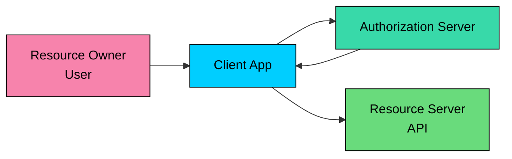
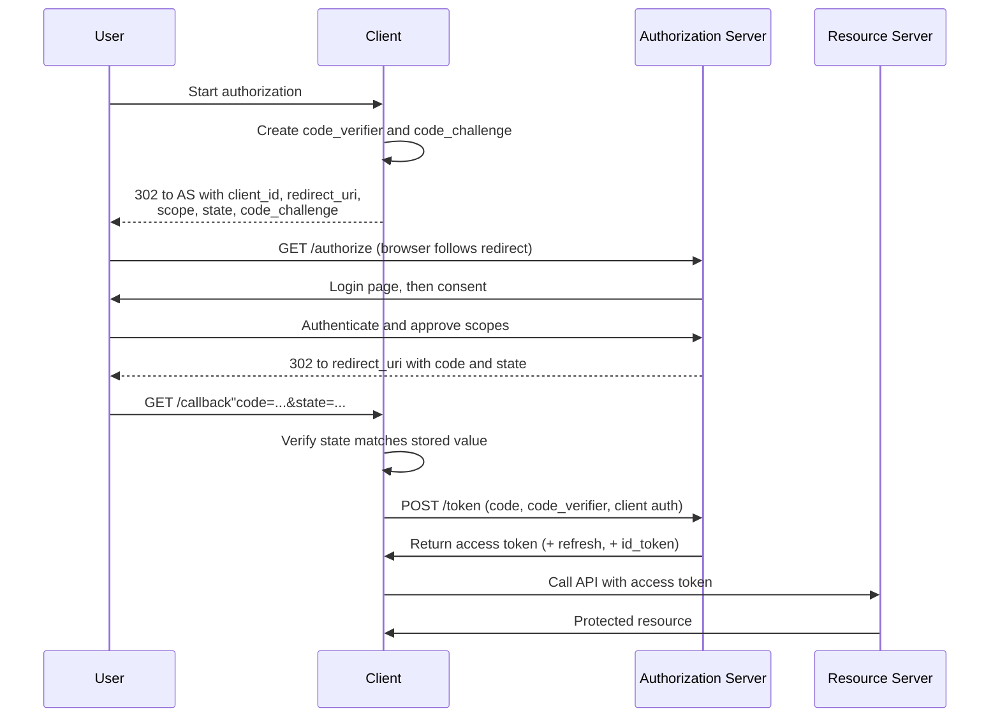

OAuth 2.0 is a protocol for delegated authorization.

It lets one application access a protected resource on behalf of a user without asking for the user's password. A calendar app can read a user's Google Calendar, a deployment tool can access a GitHub repository, or a reporting service can read data from another SaaS product, all without ever seeing the user's credentials.

**OAuth 2.0 is about access, not login.** When people say "Login with Google," they are usually talking about **OpenID Connect (OIDC)**, which adds an authentication layer on top of OAuth 2.0. OAuth gives the client an access token for APIs. OIDC adds an ID token that tells the client who the user is.

The recommendations in this chapter follow **OAuth 2.1**: PKCE everywhere, no Implicit grant, no Resource Owner Password Credentials, and exact redirect URI matching.

---

# 1. Why OAuth Exists

Before OAuth, third-party integrations often required users to hand over their username and password.

For example, a photo printing app might ask for a user's photo service password so it could fetch albums. That model is bad on every axis: the third-party app sees the user's password, usually gets broader access than it needs, and cannot be revoked without changing the password. A breach of the app exposes credentials for the original service, and MFA and modern login policies become difficult to enforce.

OAuth fixes this by introducing an authorization server that issues **access tokens**.

Instead of giving the client a password, the user approves limited access. The client receives a token with a scope, lifetime, and audience. The resource server accepts that token only for the access it represents.

OAuth separates three decisions:

- The user decides whether to grant access.
- The authorization server issues tokens.
- The resource server validates tokens and serves API requests.

---

# 2. OAuth Roles

> [!PAYWALL] This content is for premium members only.

OAuth 2.0 defines four main roles.

| Role | Meaning | Example |
|------|---------|---------|
| **Resource Owner** | The user or system that owns the protected data | A Google Calendar user |
| **Client** | The application requesting access | A scheduling app |
| **Authorization Server** | Authenticates the resource owner and issues tokens | `accounts.google.com` |
| **Resource Server** | Hosts the protected API or resource | Google Calendar API |

### Resource Owner

The resource owner is usually a human user, but it can also be an organization or service account. It is the party that can grant access to a resource.

### Client

The client is the application that wants access. It can be a server-side web app, a single-page application, a mobile app, a CLI tool, or a backend service. OAuth uses the word "client" for all of these. It does not mean the app runs in the browser.

### Authorization Server

The authorization server handles user authentication, consent, client registration, token issuance, refresh token rotation, and token revocation.

In many systems, this is the identity provider.

### Resource Server

The resource server is the API that receives access tokens. Its job is to validate the token and enforce scopes, audience, expiration, and local authorization rules.

---

# 3. Authorization Code Flow with PKCE

The main flow to understand is **Authorization Code with PKCE**.

It is the default choice for modern web apps, single-page apps, mobile apps, and CLIs that involve a user. Older guidance treated PKCE as mostly for mobile and public clients. Current best practice applies PKCE broadly, including confidential web clients.

### Step 1: Redirect to the Authorization Server

The client sends the user's browser to the authorization endpoint.

Key fields:

| Field | Purpose |
|-------|---------|
| `response_type=code` | Requests an authorization code |
| `client_id` | Identifies the client application |
| `redirect_uri` | Where the authorization server sends the browser back |
| `scope` | Requested permissions |
| `state` | Binds the response to the request and helps prevent CSRF |
| `code_challenge` | PKCE challenge derived from the private `code_verifier` |

### Step 2: User Authenticates and Approves Access

The authorization server authenticates the user. If consent is required, it shows the requested scopes.

The user is not giving the client their password. They are approving a limited grant through the authorization server.

### Step 3: Authorization Server Returns a Code

After approval, the authorization server redirects the browser back to the client.

The code is short-lived and single-use. It is not the API credential.

The client must validate `state` before continuing.

### Step 4: Client Exchanges the Code for Tokens

The client sends the code to the token endpoint. This is where PKCE matters.

The authorization server hashes the `code_verifier` and checks that it matches the earlier `code_challenge`. If an attacker steals only the authorization code, they still cannot redeem it without the verifier.

The example above is for a confidential client. It authenticates with HTTP Basic (or `client_secret_post`, or private key JWT in stricter setups). Public clients such as SPAs, mobile apps, and CLIs cannot hold a secret, so they omit client authentication and rely on PKCE plus exact redirect URI matching. For public clients, the form body still includes `client_id`, but there is no `client_secret`.

### Step 5: Client Calls the API

The client sends the access token to the resource server.

The resource server validates the token, checks scope and audience, and returns the protected resource if the request is allowed.

---

# 4. Tokens

OAuth is token-based. The token is what the client presents to access protected resources.

### Access Token

An **access token** is the credential used to call an API.

Access tokens should be:

- Short-lived.
- Sent only over HTTPS.
- Scoped to the minimum required access.
- Audience-restricted to the intended resource server.
- Treated as sensitive credentials.

Access tokens can be opaque strings or structured tokens such as JWTs. If the token is a JWT, the resource server must validate the signature, issuer, audience, expiration, and any required claims. If the token is opaque, the resource server usually introspects it or validates it through shared infrastructure.

### Refresh Token

A **refresh token** lets a client obtain new access tokens without sending the user through the full authorization flow every time.

Refresh tokens are more sensitive than access tokens because they live longer. Store them only where appropriate for the client type, rotate them when used, revoke the entire token family if reuse is detected, and bind them to the client where possible. For public clients, current best practice requires refresh token rotation or sender-constrained refresh tokens.

### ID Token

An **ID token** is not part of plain OAuth 2.0. It comes from OpenID Connect.

The ID token tells the client who authenticated. The access token tells an API what access was granted. Do not use an access token as proof of login unless the system explicitly defines it that way.

---

# 5. Grant Types

A grant type is the way a client obtains tokens.

| Grant type | Use it" | Notes |
|------------|---------|-------|
| **Authorization Code + PKCE** | Yes | Default for user-facing apps |
| **Client Credentials** | Yes | Service-to-service access with no user |
| **Device Authorization** | Yes | TVs, CLIs, and limited-input devices |
| **Refresh Token** | Yes, carefully | Used to renew access without full user interaction |
| **Implicit** | Avoid | Exposes tokens through the browser front channel |
| **Resource Owner Password Credentials** | Do not use | Trains users to give passwords to clients and breaks modern MFA patterns |

### Authorization Code + PKCE

Use this when a user is involved. This includes server-rendered web apps, SPAs, mobile apps, and CLIs that can open a browser.

### Client Credentials

Use this for machine-to-machine communication.

There is no user. The client authenticates as itself and receives a token representing the client's own access.

### Device Authorization

Use this for devices that cannot comfortably type credentials, such as TVs, consoles, and some CLI flows.

The device shows a short code. The user completes authorization on another device with a browser.

### Implicit Grant

The implicit grant returns access tokens directly from the authorization endpoint. That exposes tokens through the browser front channel and makes leakage/replay harder to control.

Modern systems should use Authorization Code with PKCE instead.

### Resource Owner Password Credentials

The Resource Owner Password Credentials grant asks the user to type their password into the client application.

Do not use it. It increases credential exposure, trains bad user behavior, and does not work cleanly with MFA, WebAuthn, SSO, or modern risk-based authentication.

---

# 6. Scopes and Consent

Scopes describe what access the client is requesting.

Examples:

Scopes should be narrow enough to enforce least privilege, but not so fine-grained that they become impossible for users and operators to understand. A good scope model is clear to users during consent, easy for APIs to enforce, stable enough that clients do not break constantly, and narrow enough to limit damage from token leakage.

Scopes are not a replacement for application authorization. The API still needs local checks. A token with `repo.write` may allow write operations, but the API still needs to verify which repository the caller can write to.

---

# 7. Security Checklist

OAuth failures are usually implementation failures: loose redirect URI matching, leaked tokens, missing state validation, overbroad scopes, or unsafe storage.

### Use Authorization Code with PKCE

Use `response_type=code` and PKCE with `S256`. Avoid Implicit. Avoid Resource Owner Password Credentials.

### Validate Redirect URIs Exactly

Register redirect URIs ahead of time and compare them with exact string matching. Do not allow wildcard domains, partial path matching, or open redirect endpoints.

Bad redirect URI validation is one of the easiest ways to leak authorization codes and tokens.

### Validate `state`

The `state` value should be unpredictable, tied to the user's session, and checked when the browser returns to the client.

It prevents attackers from injecting an OAuth response into a session they did not start.

### Store Tokens Based on Client Type

Server-side web apps should keep tokens on the server and use a secure application session cookie in the browser.

SPAs and mobile apps cannot keep long-term secrets. Use Authorization Code with PKCE, short-lived access tokens, refresh token rotation where needed, and platform storage appropriate to the device.

### Keep Access Tokens Short-Lived

Short access token lifetimes limit the damage when a token leaks. Use refresh tokens to renew access, and protect refresh tokens more aggressively.

### Restrict Tokens

Access tokens should be restricted by scope, audience, and expiration at minimum, plus resource or tenant where applicable. In higher-security systems, bind the token to the sender with mTLS or DPoP so a stolen token cannot be replayed from a different client.

### Do Not Log Tokens

Tokens should not appear in URLs, logs, analytics events, crash reports, browser history, or referrer headers.

Treat bearer tokens like passwords. Anyone who has one can use it unless the token is sender-constrained.

### Use OpenID Connect for Login

If your application needs to know who the user is, use OIDC. Validate the ID token's issuer, audience, signature, expiration, and `nonce`.

`state` and `nonce` serve different purposes:

- `state` is sent on the authorization request and echoed back on the redirect. The client checks it to confirm the response belongs to a request the client started. It defends the redirect against CSRF and session injection.
- `nonce` is sent on the authorization request and embedded as a claim in the issued ID token. The client checks it after token exchange to confirm the ID token belongs to this login attempt. It defends the ID token against replay.

Use both for OIDC login. State on its own does not protect the ID token, and nonce on its own does not protect the redirect.

OAuth access tokens are for APIs. ID tokens are for the client.

### Be Careful with Refresh Tokens in Browsers

Refresh tokens in single-page apps are a recurring source of OAuth incidents.

If you must keep a refresh token in the browser, use refresh token rotation with reuse detection, short refresh token lifetimes, and storage that is not reachable from arbitrary JavaScript. `localStorage` is not such a place. A successful XSS exfiltrates the refresh token instantly and gives the attacker long-lived access.

The safer pattern is a backend-for-frontend (BFF) that holds the refresh token server-side and gives the browser only a short-lived session cookie. The browser never sees the refresh token.

---

# Summary

OAuth 2.0 lets a client access protected resources without handling the user's password.

The modern default for user-facing applications is Authorization Code with PKCE. Client Credentials is for service-to-service access. Device Authorization is for limited-input devices. Implicit and Resource Owner Password Credentials should be avoided in new systems.

The core production concerns are redirect URI validation, PKCE, state validation, short-lived and scoped tokens, refresh token protection, and using OpenID Connect when the problem is login rather than API authorization.

---

# Quiz
