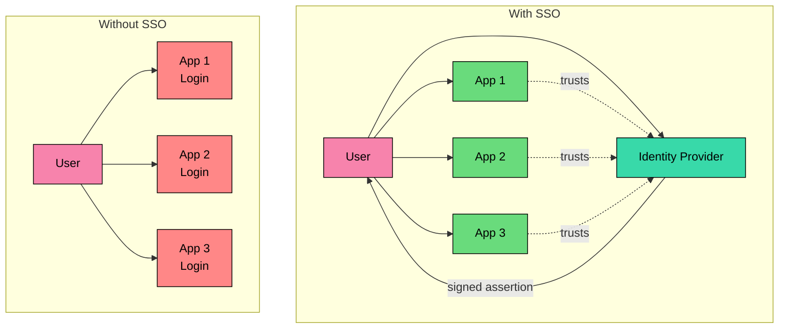
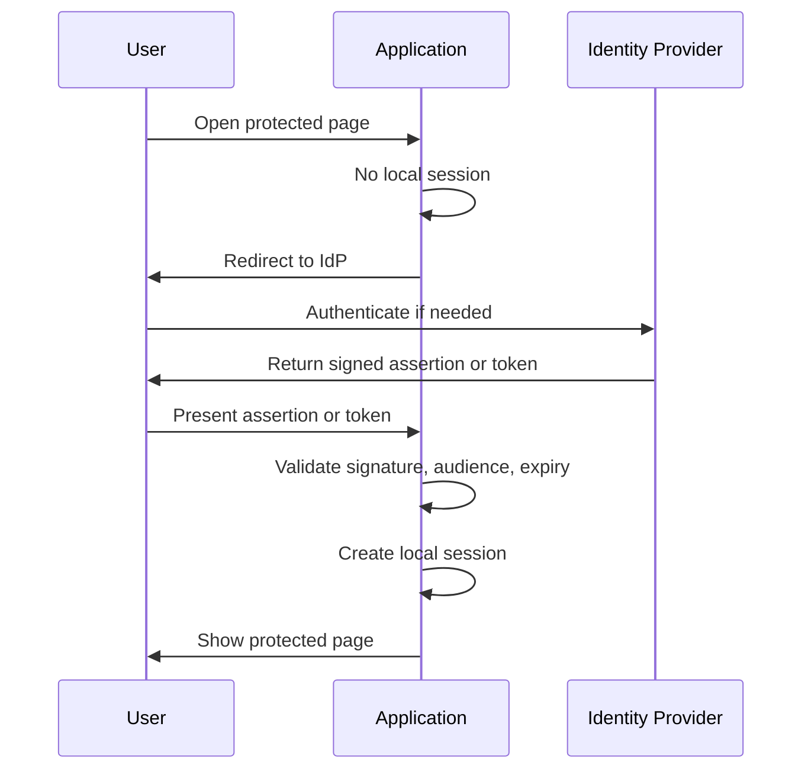
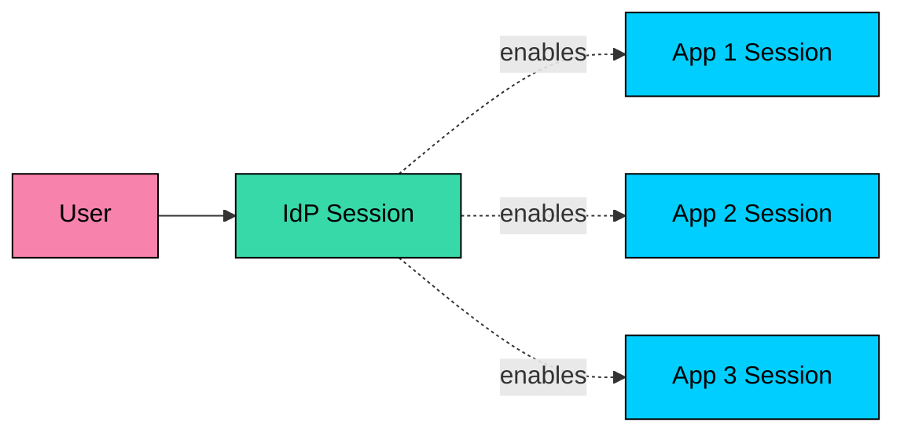
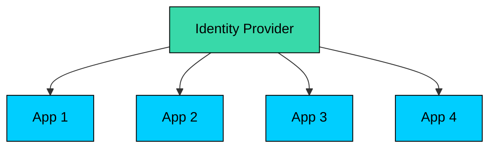

**Single Sign-On (SSO)** lets users authenticate with one trusted identity system and then access multiple applications without each application handling passwords directly.

In an enterprise, this usually means an employee signs in through a corporate Identity Provider such as Okta, Microsoft Entra ID, Google Workspace, or Keycloak. Applications such as Salesforce, Workday, Jira, and AWS trust that identity provider instead of maintaining separate login systems.

SSO is not one shared session across every application. It is a trust pattern: the IdP authenticates the user, the application validates a signed token or assertion from the IdP, and the application creates its own local session. Each application still owns its own session, authorization model, and failure handling.

---

# 1. What SSO Solves

Without SSO, every application becomes an identity system. Each one needs password storage, password reset, MFA, account lockout, audit logs, provisioning, deprovisioning, and security monitoring.

That does not scale well.

SSO moves authentication to a dedicated identity layer.

The benefits are practical. Users remember fewer credentials, applications avoid storing passwords, and MFA and access policies are enforced in one place. Authentication events become easier to audit, and joiner, mover, and leaver workflows become more manageable.

The last benefit needs a caveat. Disabling a user at the IdP usually prevents future logins, but existing application sessions may continue until they expire, are revoked, or receive a logout/revocation signal. Design for that explicitly.

---

# 2. Core Roles

SSO systems use slightly different names depending on the protocol, but the shape is the same.

| Generic role | SAML name | OIDC name | Responsibility |
|--------------|-----------|-----------|----------------|
| User | Principal | End User | Person trying to access an app |
| Identity system | Identity Provider (IdP) | OpenID Provider (OP) | Authenticates the user and issues signed identity data |
| Application | Service Provider (SP) | Relying Party (RP) / Client | Validates identity data and creates a local session |

The boundary between the two roles is sharp. The IdP answers "Who is this user, and how did they authenticate"" The application answers "Should this user be allowed to do this action here""

SSO can carry attributes such as email, department, tenant, or group membership. Those attributes help with authorization, but they do not replace application authorization. The application still needs local checks for roles, permissions, resource ownership, and tenant boundaries.

---

# 3. How SSO Works

The most common flow starts when a user opens an application without an existing application session.

The first application login may require the user to enter credentials and complete MFA. Later, when the user opens another SSO-enabled application, the second app also redirects to the IdP. If the IdP session is still valid, the IdP can issue a new token or assertion without prompting for credentials again.

That is the "single" in Single Sign-On. The user authenticates once to the IdP, but each application still gets its own proof of identity and creates its own session.

---

# 4. SAML vs OpenID Connect

Modern SSO is usually built with **SAML 2.0** or **OpenID Connect (OIDC)**.

| Topic | SAML 2.0 | OpenID Connect |
|-------|----------|----------------|
| Message format | XML assertions | JSON / JWT |
| Common use | Enterprise SaaS and legacy enterprise apps | Modern web, mobile, SPA, and API-heavy apps |
| Built on | SAML standard | OAuth 2.0 |
| Identity artifact | SAML assertion | ID token |
| API access | Separate concern | Works naturally with OAuth access tokens |
| Setup style | Metadata, certificates, ACS URLs | Client registration, redirect URIs, discovery, JWKS |

### Use SAML When

- A customer or enterprise IdP requires it.
- You are integrating with older SaaS or enterprise applications.
- The environment already has SAML federation in place.

### Use OpenID Connect When

- You are building a new web or mobile application.
- You need login plus API access.
- You want simpler JSON-based integration and discovery.
- You are supporting SPAs, mobile apps, or modern developer tooling.

For new systems, OIDC is usually easier. For enterprise SaaS, supporting SAML is often required because many customers already depend on it.

---

# 5. Sessions and Logout

SSO usually creates multiple sessions.

There is an IdP session, and there are application sessions. They are related, but they are not the same session.

This creates a few important design questions:

- How long should the IdP session last"
- How long should each application session last"
- When should the user be asked to reauthenticate"
- Do sensitive actions require step-up authentication"
- What happens when the IdP account is disabled"
- What happens when the user clicks logout in one app"

Single Logout tries to coordinate logout across the IdP and all applications. It is useful when it works, but it is hard to make reliable across many independent systems. Some apps do not support it. Some users close the browser mid-flow. Some sessions may already be stale or unreachable.

A production design should not rely only on logout propagation. Use reasonable idle timeouts, absolute session lifetimes, short token lifetimes, revocation where available, and step-up authentication for sensitive operations.

---

# 6. Architecture Patterns

SSO can be deployed in a few common ways.

### Centralized IdP

One organization uses one IdP for all applications.

This is common inside companies. It gives centralized policy and auditing, but the IdP becomes critical infrastructure.

### Federated Identity

An application trusts identity providers from multiple organizations.

This is common in B2B SaaS. Each customer keeps their own IdP. Your application accepts SAML or OIDC from each customer after tenant-specific configuration.

The hard parts are tenant routing, certificate/key rotation, attribute mapping, and handling each customer's slightly different IdP behavior.

### Identity Broker

An identity broker sits between applications and many upstream identity providers.

Applications integrate once with the broker. The broker integrates with enterprise IdPs, social login providers, or internal directories.

This simplifies application code, but the broker becomes a dependency for every login path.

---

# 7. Security and Operations

SSO improves security when implemented well. It also concentrates risk.

### Protect the IdP

The IdP is a high-value system. Protect it with MFA, phishing-resistant authentication where possible, strong admin controls, audit logging, anomaly detection, and tested recovery procedures.

If the IdP is unavailable, new logins may fail across many applications. Treat availability, disaster recovery, and incident response as part of the SSO design.

### Validate Tokens and Assertions

Applications must validate the signature, issuer, audience, and expiration on every assertion or ID token, plus the nonce or request correlation value where applicable, the redirect URI or destination, and the tenant or organization binding.

Do not treat SSO data as trusted just because it came through a browser redirect. The application must verify it.

### Handle Provisioning Separately

SSO answers authentication. It does not automatically create the right account, assign the right role, or remove every active session.

Many systems pair SSO with provisioning protocols such as SCIM, internal account lifecycle jobs, or just-in-time provisioning. Keep authentication, provisioning, and authorization separate in the design.

### Make Failures Debuggable

SSO failures are often configuration failures:

- Wrong redirect URI.
- Wrong ACS URL.
- Expired certificate.
- Rotated signing key.
- Missing email or subject claim.
- Clock skew.
- Tenant mapped to the wrong IdP.
- User exists in the IdP but not in the application.

Good systems show operators which validation step failed without logging raw tokens, assertions, or sensitive user attributes.

---

# Summary

SSO centralizes authentication through a trusted identity provider. Applications rely on signed identity data from that provider, validate it, and create their own local sessions.

The main protocols are SAML and OpenID Connect. SAML remains common in enterprise SaaS. OIDC is usually the better fit for modern web, mobile, and API-heavy systems.

The production details matter: local sessions, logout behavior, token validation, tenant mapping, provisioning, certificate/key rotation, and IdP availability. SSO reduces password sprawl, but it does not remove the need for careful application authorization and operational design.

---

# Quiz
