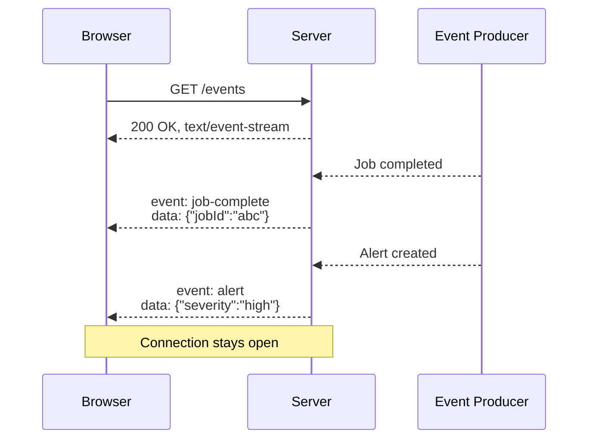
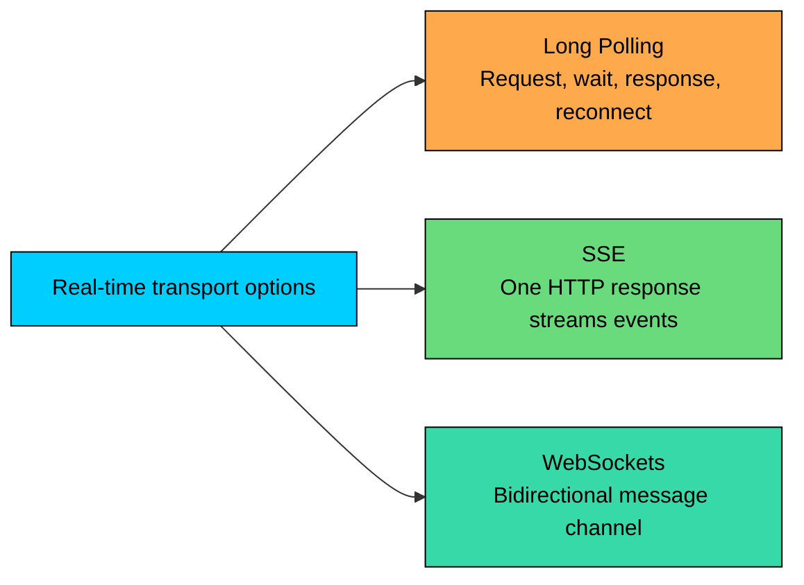
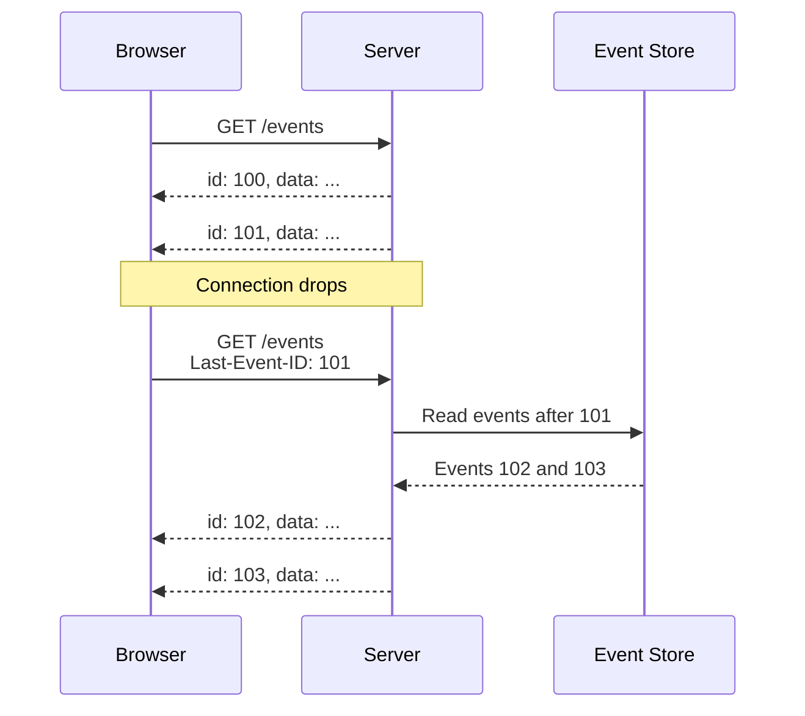
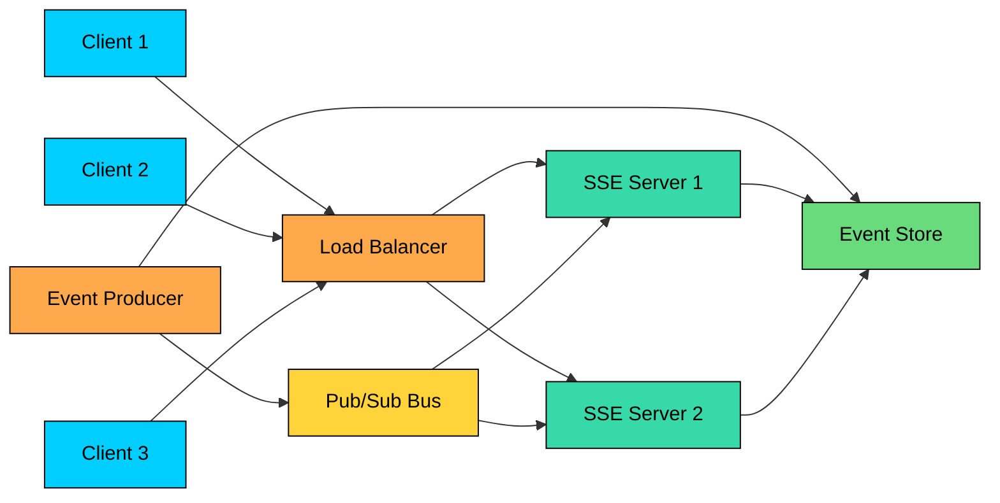

Suppose you are building a live dashboard. The server needs to push updates whenever a job finishes, a metric changes, or a new alert appears, but the browser does not need to send messages back over the same connection.

WebSockets work, but full bidirectional messaging may be more complexity than you need. Long polling works, but every response closes the request and forces the client to reconnect.

**Server-Sent Events (SSE)** sit between those two. The browser opens one connection and the server streams text events over a single long-lived HTTP response.

This chapter covers what SSE provides and what it does not, how the event stream format works, how browser reconnection and `Last-Event-ID` work, how to implement SSE safely on the server, and when to choose SSE instead of long polling or WebSockets.

---

# What SSE Provides

SSE is a browser API and wire format for one-way server-to-client streaming.

SSE is one-way (events flow from server to browser) and HTTP-based (the stream is a long-lived HTTP response). Payloads are UTF-8 text, often JSON strings, and each event is a distinct message rather than a byte stream. Browsers reconnect automatically after most disconnects and send the `Last-Event-ID` header on reconnect if the stream provided event IDs.

SSE is a good fit for notifications, activity feeds, dashboard updates, progress updates, build logs, status changes, and other server-authored event streams.

It is not a replacement for WebSockets when the browser needs to send frequent messages on the same connection. It is also not a media protocol; use WebRTC, HLS, or DASH for audio and video.

> [!PAYWALL] This content is for premium members only.

---

# How SSE Compares

SSE is easiest to understand next to polling, long polling, and WebSockets.

| Technique | Direction | Connection Model | Best For | Trade-Off |
|-----------|-----------|------------------|----------|-----------|
| Short polling | Client asks repeatedly | Many short requests | Rare updates | Wasted requests or delayed updates |
| Long polling | Server holds one request | Repeated held requests | Infrequent server updates | Reconnect after every response |
| SSE | Server to browser | One long HTTP response | Continuous one-way event streams | Browser sends data separately |
| WebSockets | Client and server | One upgraded connection | Bidirectional messaging | More connection and protocol management |
| WebRTC | Peer/media transport | Peer or media-server paths | Audio, video, screen sharing | NAT traversal and media complexity |

The key distinction is direction. If the server mostly talks and the browser mostly listens, SSE is often simpler than WebSockets. If both sides send frequent messages, WebSockets are usually a better fit.

---

# The Event Stream Format

An SSE response uses the `text/event-stream` content type.

Each event is made of line-based fields followed by a blank line:

A blank line ends the event. The browser then dispatches it to the matching listener.

The standard fields are:

| Field | Purpose |
|-------|---------|
| `data` | Event payload. Multiple `data` lines are joined with newline characters |
| `event` | Event type. If omitted, the browser treats it as a generic `message` event |
| `id` | Cursor used for reconnection through `Last-Event-ID` |
| `retry` | Reconnect delay in milliseconds suggested by the server |

SSE is text-only, but the text can contain serialized JSON:

For multi-line payloads, repeat the `data` field:

Lines that start with `:` are comments. They are ignored by the browser and are commonly used as heartbeats:

Heartbeats are useful because proxies and load balancers may close idle connections.

---

# The EventSource API

Browsers consume SSE through `EventSource`.

`EventSource` has three states:

| State | Value | Meaning |
|-------|-------|---------|
| `CONNECTING` | 0 | Connecting or reconnecting |
| `OPEN` | 1 | Stream is open |
| `CLOSED` | 2 | Stream was closed and will not reconnect |

One practical browser limitation: native `EventSource` does not let you set arbitrary request headers. Authentication is usually handled with cookies, or with short-lived tokens in carefully controlled URLs. If you put tokens in URLs, remember that URLs often appear in logs and browser history.

---

# Reconnection and Resuming

Automatic reconnection is one of SSE's best features.

When the stream drops, the browser usually waits a short delay and reconnects. If the last received event had an `id`, the browser sends it back in the `Last-Event-ID` header.

This only works if the server keeps enough event history to replay missed events. The browser remembers the last ID, but the server must make that ID meaningful.

A good SSE system usually has stable event IDs, a retention window for replay, idempotent client-side event handling, and a fallback response when the requested ID is too old.

The server can also send a `retry` field to suggest a reconnect delay. The field belongs inside an event block, not as a separate dispatch:

If `retry` is absent, browsers default to a reconnect delay of about 3 seconds.

Browsers handle reconnection, but you should still design for duplicates. A reconnect can cause an event to be delivered twice if the server already wrote it but the client never finished processing before the drop.

---

# Server Implementation

An SSE endpoint is an HTTP handler that sets streaming headers and keeps the response open.

Here is a small Node.js example:

This example demonstrates the mechanics, but production code needs more. It needs authentication and authorization before opening the stream, per-user or per-topic subscriptions, and event replay using `Last-Event-ID`. It also needs heartbeats for idle periods, cleanup on disconnect, backpressure handling for slow clients, and limits on connections per user and per IP.

---

# Scaling SSE

Those production needs become harder as soon as the system has more than one server. SSE connections are long-lived, which changes how you scale them.

If all clients connect to one server, that server owns all open streams. In a multi-server deployment, events must reach the server that owns each client's connection.

A common pattern is:

1. Write each event to a durable event store.
2. Publish a notification through a broker or pub/sub system.
3. Each SSE server receives the notification.
4. Each server forwards the event to its connected clients that are subscribed.
5. On reconnect, the server replays missed events from the store.

Do not rely only on pub/sub if clients need reliable delivery. Pub/sub wakes up servers quickly; durable storage lets clients recover after reconnects.

---

# Operational Challenges

SSE is simple, but the long-lived response creates operational details.

### Connection Limits

Under HTTP/1.1, browsers cap connections per origin at about 6. Each open SSE stream consumes one slot, so a page with several streams or many tabs can exhaust the budget and stall ordinary requests.

HTTP/2 multiplexing reduces this problem because one connection can carry many streams (typically up to 100 concurrent streams per connection by default), but real behavior still depends on browser, server, proxy, and load balancer support for HTTP/2 end to end.

### Buffering

Some proxies, CDNs, and application frameworks buffer responses by default. Buffering breaks SSE because events do not reach the browser until the buffer flushes.

Disable buffering for SSE endpoints. In Nginx, `X-Accel-Buffering: no` and appropriate proxy buffering settings are commonly used.

### Idle Timeouts

Load balancers and proxies may close idle streams. Send heartbeat comments more frequently than the shortest idle timeout in the path.

### Backpressure

A slow client can cause the server to buffer outbound data. Track write failures and queued bytes where your platform exposes them. Close connections that cannot keep up, and let the browser reconnect.

### Deploys

During deployments, drain streams gracefully where possible. If streams are closed, clients will reconnect, so make sure reconnect storms are tolerable and event replay works.

---

# Security

SSE is HTTP, so normal web security rules apply. Use HTTPS, authenticate the stream request, and authorize every topic, room, account, or resource. Validate `Last-Event-ID` so a client cannot replay another user's stream. Limit connections per user and per IP, avoid leaking sensitive data through shared event streams, and be careful with tokens in URLs.

If you use cookie-based auth, remember that cross-origin requests and credentials need deliberate CORS configuration. Also validate `Origin` when appropriate, especially for authenticated streams.

---

# When to Use SSE

Use SSE when:

- Updates flow mostly from server to browser
- Events are text or JSON
- The browser should reconnect automatically
- You want a simple HTTP-based streaming model
- The update stream is continuous enough that long polling feels wasteful

Choose another option when:

- The browser sends frequent messages: use WebSockets.
- Updates are rare and delay is acceptable: use short polling.
- You need a simple fallback over plain HTTP requests: use long polling.
- You need audio, video, or peer-to-peer media: use WebRTC.
- You need binary bidirectional transport: use WebSockets or another protocol.

| Requirement | Better Starting Point |
|-------------|-----------------------|
| Notifications and activity feeds | SSE |
| Job progress and build logs | SSE |
| Chat with typing indicators and read receipts | WebSockets |
| Browser receives updates, sends occasional commands | SSE plus normal HTTP POST |
| Audio/video calls | WebRTC |
| Rare status checks | Short polling |

---

# Metrics to Track

Useful SSE metrics include:

- Active streams per server
- Stream duration
- Reconnect rate
- Events sent per second
- Bytes sent per stream
- Heartbeat failures
- Replay requests by `Last-Event-ID`
- Replay misses because the requested ID expired
- Slow-client disconnects
- Proxy or load balancer disconnects

These metrics tell you whether the stream is healthy, whether clients are reconnecting too often, and whether your replay window is large enough.

---

# Summary

Server-Sent Events are a clean way to stream server-authored events to browsers over HTTP.

The main ideas to remember:

1. **SSE is one-way.** The server streams to the browser; browser-to-server actions use separate HTTP requests.
2. **The format is simple.** Events are text fields ending with a blank line.
3. **Browsers reconnect automatically.** `Last-Event-ID` lets the server resume if it stores enough history.
4. **Infrastructure must allow streaming.** Disable buffering and tune idle timeouts.
5. **Scaling still needs architecture.** Use pub/sub for fanout and durable storage for replay.
6. **Choose SSE before WebSockets when one-way push is enough.** It is simpler and easier to debug.

SSE is not the most general real-time transport, and that is its strength. When the server talks and the browser listens, it gives you a small, readable protocol that fits well into HTTP systems.

---

# Quiz
