Most real-time web features keep a server in the middle. Long polling, SSE, and WebSockets are good fits for notifications, chat, dashboards, and collaborative state, all of which route data through your application servers.

Video calls are different. Sending every audio and video packet through your servers adds latency and burns bandwidth.

**WebRTC** is a set of browser APIs and network protocols for low-latency audio, video, and data transfer directly between peers when the network allows it.

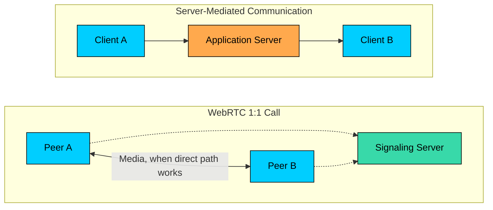

WebRTC is not "magic peer-to-peer." Most users are behind NATs, firewalls, mobile networks, or corporate proxies, so a production WebRTC system still needs servers for signaling, NAT traversal, relay fallback, and group-call scaling.

This chapter covers what WebRTC does and what it deliberately leaves to your application, how signaling, SDP, ICE, STUN, and TURN fit together, how media and data move once a connection is established, why group calls usually need media servers, and what to monitor when operating WebRTC in production.

---

# What Is WebRTC"

The name expands to **Web Real-Time Communication**, but the more useful framing is what it tries to do: establish the best available path between endpoints, in this order of preference.

1. Direct local path, if both peers are on the same network
2. Direct public path through NAT, if NAT traversal works
3. Relayed path through a TURN server, if direct connectivity fails
4. Media-server path, if the product needs group calls, recording, moderation, or broadcast scale

So the right mental model is not "WebRTC removes servers." It is:

> WebRTC keeps media off your servers when it can, and gives you controlled fallbacks when it cannot.

WebRTC is commonly used for:

| Use Case | Why WebRTC Fits |
|----------|-----------------|
| 1:1 video calls | Low latency and direct media when possible |
| Voice chat | Real-time audio with jitter handling and echo cancellation |
| Screen sharing | Browser-native capture and low-latency delivery |
| Group video calls | Works well with SFU media servers |
| Telehealth and support | Runs in the browser without a custom client install |
| Interactive live streams | Lower latency than segment-based streaming |
| Peer-to-peer file transfer | Data can move directly between peers |
| Multiplayer data sync | Data channels support low-latency unreliable delivery |

WebRTC gives you media capture APIs, connection negotiation, encryption, congestion control, codec negotiation, and transport. It does **not** define your application protocol, user model, room model, or signaling service.

That separation is intentional. A video chat app, a remote support app, and a multiplayer game all need different application logic, even if they use the same WebRTC transport underneath.

---

# The Bootstrap Problem

Before two peers can send media, they need to discover enough information about each other to form a connection.

This is the bootstrap problem. Alice needs to know Bob exists and is allowed to join, both sides need to exchange media capabilities and possible network paths, and they need to agree on encryption and transport parameters before any media flows.

WebRTC does not specify how this information is exchanged. Your application must provide a **signaling channel**, usually over WebSockets or HTTPS.

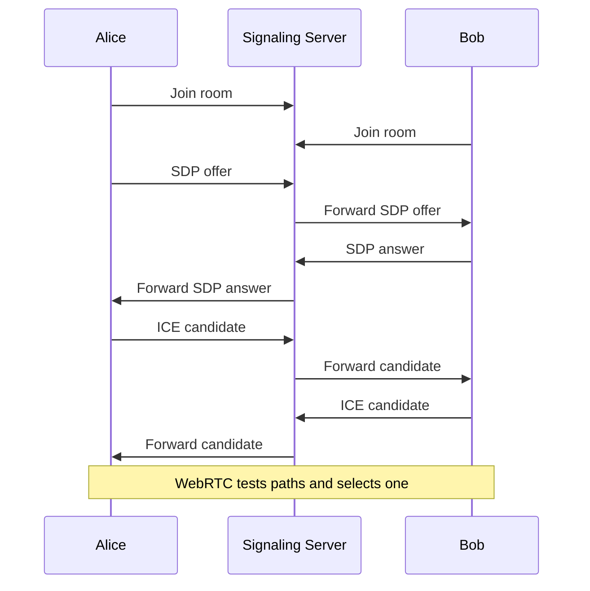

The signaling server does not need to understand audio or video packets. It routes small control messages:

- Who is in the room"
- Who is calling whom"
- What SDP offer or answer should be forwarded"
- Which ICE candidates should be forwarded"
- Has a participant left, muted, reconnected, or changed devices"

For a small product, this can be a straightforward WebSocket service. At larger scale, signaling also handles authentication, authorization, room sharding, reconnects, presence, rate limits, and abuse controls.

---

# SDP: Agreeing on the Session

SDP stands for **Session Description Protocol**. In WebRTC, SDP is the text format peers use to describe the session they want to create.

An SDP message describes audio, video, and data sections, the supported codecs (Opus, VP8, H.264, VP9, or AV1), media directions (send, receive, or both), DTLS fingerprints for encryption, and ICE parameters used during connectivity checks.

The negotiation follows an offer/answer model.

Alice creates an offer that says, in effect: "Here is what I can send and receive." Bob responds with an answer that says: "Here is what we can actually use together."

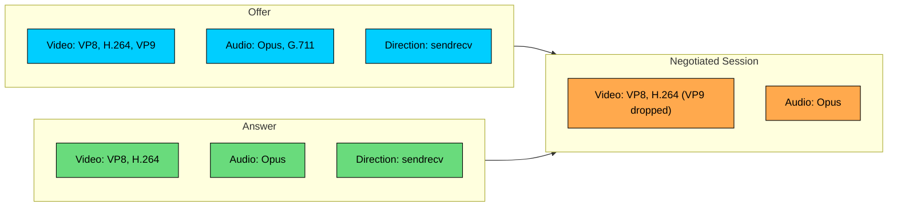

Most application developers should treat SDP as an interoperability format, not as something to hand-edit casually. Browser implementations are particular, and small SDP changes can break negotiation in surprising ways.

---

# ICE: Finding a Working Network Path

The hardest part of WebRTC is often not encoding video. It is getting two devices to reach each other across real networks.

Most clients do not have public IP addresses. Your laptop may have a private address like `192.168.1.100`. Your phone may be behind a carrier-grade NAT. A corporate firewall may block inbound UDP entirely.

ICE, short for **Interactive Connectivity Establishment**, handles this by collecting multiple possible addresses, exchanging them through signaling, and testing candidate pairs until one works.

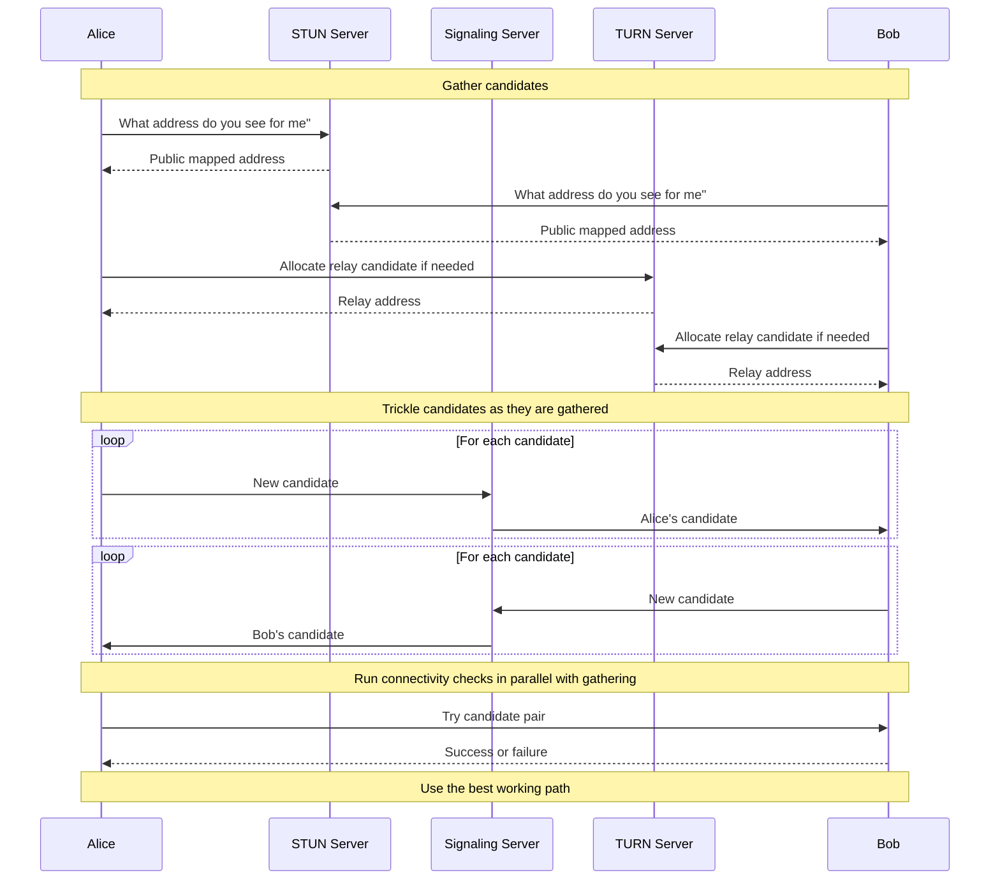

ICE candidates usually fall into three categories:

| Candidate Type | What It Represents | When It Helps | Trade-Off |
|----------------|--------------------|---------------|-----------|
| Host | Local interface address | Same LAN or reachable private networks | Fastest, but rarely enough on the public internet |
| Server reflexive | Public mapped address discovered through STUN | Many home and mobile NATs | Low overhead, but not guaranteed |
| Relay | Address allocated on a TURN server | Strict NATs, firewalls, blocked UDP | Most reliable fallback, but costs bandwidth |

ICE prefers lower-cost paths first. If a direct path works, media flows peer to peer. If not, the connection can fall back to TURN.

Avoid describing TURN as "always works." It is the most compatible option, especially with TCP or TLS on port 443, but some networks block or inspect traffic aggressively enough to break even relay paths.

---

# STUN and TURN

STUN and TURN are easy to confuse because both appear in WebRTC configuration. They solve different problems.

### STUN

STUN, short for **Session Traversal Utilities for NAT**, helps a client discover how it appears to the public internet.

The flow is simple:

1. The client sends a packet to a STUN server.
2. The NAT rewrites the packet source address.
3. The STUN server replies with the source address it observed.
4. The client uses that mapped address as a server-reflexive ICE candidate.

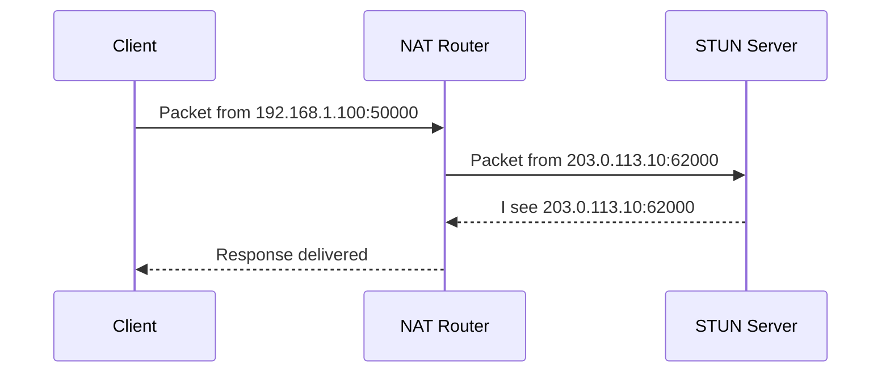

STUN is lightweight. It exchanges small packets during setup and does not relay media. Public STUN servers are useful for development, but production systems should treat STUN availability as part of their reliability plan.

### TURN

TURN, short for **Traversal Using Relays around NAT**, relays traffic when peers cannot reach each other directly.

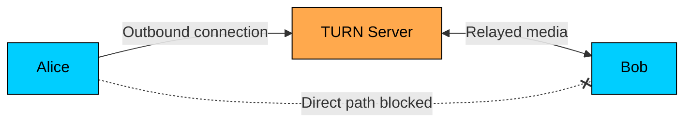

TURN is not just a connection setup service. When TURN is used, media packets flow through the TURN server for the duration of the session, which means more bandwidth egress, more latency from the extra hop, more regional capacity planning, and more monitoring and abuse protection.

Production WebRTC systems usually deploy TURN close to users, support UDP first, and keep TCP/TLS fallback for restrictive networks.

---

# The Basic Browser API Flow

The browser API hides much of the protocol machinery, but the application flow is still explicit.

At a high level:

1. Capture local media with `getUserMedia()`.
2. Create an `RTCPeerConnection`.
3. Add audio and video tracks to the peer connection.
4. Create an SDP offer or answer.
5. Send SDP through your signaling channel.
6. Exchange ICE candidates through signaling.
7. Render remote tracks when they arrive.

Real applications need more state handling than this example shows. You must handle glare, retries, device changes, reconnects, permissions, page refreshes, and users joining rooms in different orders.

---

# Media Transport

After negotiation succeeds, WebRTC sends media using protocols designed for real-time delivery.

WebRTC prefers UDP because real-time media values freshness over perfect delivery. If one video packet is lost, waiting for it may make the call worse. It is usually better to conceal the loss and keep playing newer frames.

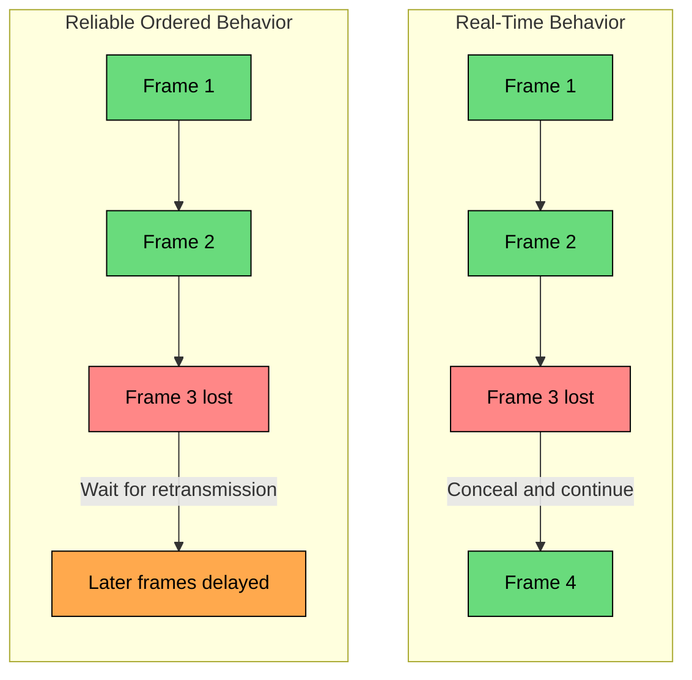

This does not mean WebRTC never uses TCP. If UDP is blocked, a browser can relay through TURN over TCP or TLS. That improves reachability but usually hurts latency and quality.

### RTP, RTCP, and SRTP

Media travels in RTP packets. RTP adds the metadata receivers need to play media correctly: sequence numbers to detect loss and reordering, timestamps for playback and audio/video sync, and a payload type to identify the codec format.

RTCP runs alongside RTP and reports quality information such as packet loss, jitter, and round-trip time. Senders use this feedback to adapt bitrate, resolution, and frame rate.

WebRTC encrypts media with SRTP, and the SRTP keys are themselves negotiated through a DTLS handshake between the peers (DTLS-SRTP). Data channels run SCTP over that same DTLS connection. Encryption is mandatory in modern WebRTC: there is no unencrypted mode. Your signaling server can route SDP and ICE messages but cannot decrypt media unless you deliberately terminate media on a server such as an SFU or MCU.

### Codecs

WebRTC endpoints negotiate codecs during SDP exchange.

| Codec | Type | Notes |
|-------|------|-------|
| Opus | Audio | Default choice for WebRTC audio; works well for speech and music |
| G.711 | Audio | Useful for telephony interoperability |
| VP8 | Video | Baseline interoperable video codec in WebRTC |
| H.264 | Video | Widely supported, often hardware accelerated |
| VP9 | Video | Better compression than VP8, support varies by platform |
| AV1 | Video | Efficient but more demanding; support continues to improve |

Do not pick a codec only from a quality table. In production, codec choice depends on browser support, mobile hardware acceleration, CPU budget, recording needs, and whether your media server supports simulcast or SVC for that codec.

---

# Data Channels

WebRTC can also send arbitrary data through `RTCDataChannel`.

Data channels use SCTP over DTLS over the same ICE-selected transport. They are useful when you want low-latency peer-to-peer data without opening a separate WebSocket path through your servers.

Common uses include in-call chat, file transfer, collaborative cursors and drawing events, game state updates, and remote control messages during screen sharing.

The useful feature is configurability. A file transfer wants reliable ordered delivery. A game state update may prefer dropping stale updates rather than delaying newer ones.

| Mode | Behavior | Example |
|------|----------|---------|
| Reliable, ordered | Similar to TCP semantics | Chat messages, file transfer |
| Reliable, unordered | Guaranteed delivery without ordering | Independent data chunks |
| Partially reliable | Retries only for a limited time or count | State updates that become stale |
| Unreliable, unordered | Best effort with low delay | Fast telemetry or game updates |

Data channels are not a replacement for every WebSocket use case. If the server must validate, persist, fan out, or audit the data, route it through the server. Use data channels when peer-to-peer delivery is actually part of the product requirement.

---

# Scaling Beyond 1:1 Calls

Pure peer-to-peer is a good fit for simple 1:1 calls. It becomes expensive for group calls.

In a mesh call with 10 participants, each user may need to upload 9 copies of their video. That is too much for many home and mobile networks.

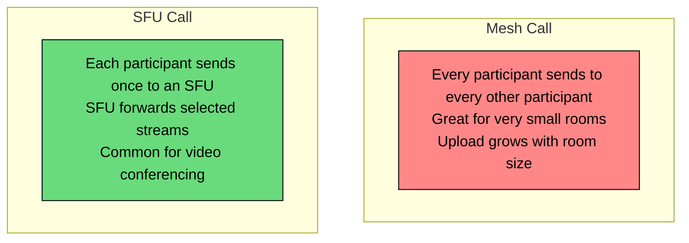

There are three common media architectures.

### Mesh

Every participant connects directly to every other participant.

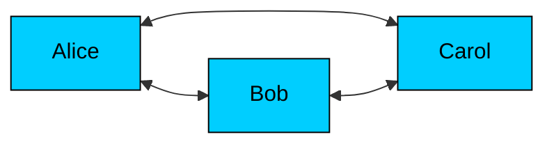

Mesh is simple and has no media-server bandwidth cost, but it does not scale well. Use it for 1:1 calls or very small rooms where quality expectations are modest.

### SFU

An SFU, or **Selective Forwarding Unit**, receives media from participants and forwards selected streams to other participants. It usually does not decode and re-encode every video frame.

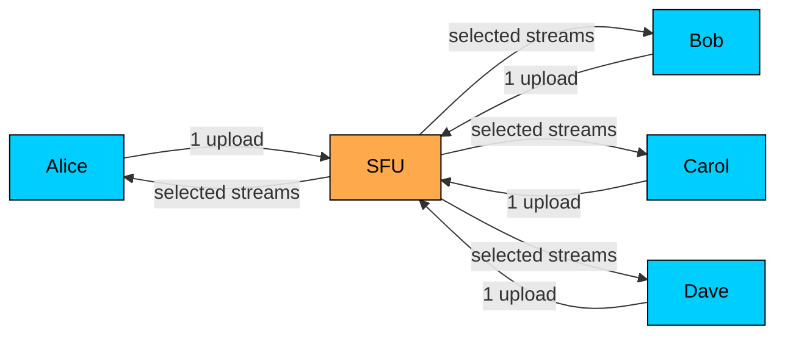

SFUs are the default choice for many modern group calling systems because they balance latency, server cost, and client flexibility.

SFUs also enable server-side features such as active speaker switching, simulcast layer selection, recording and compliance hooks, moderation controls, regional routing, and large rooms with selective subscription.

### MCU

An MCU, or **Multipoint Control Unit**, decodes participant streams, mixes or composites them, and sends a single output stream back to clients.

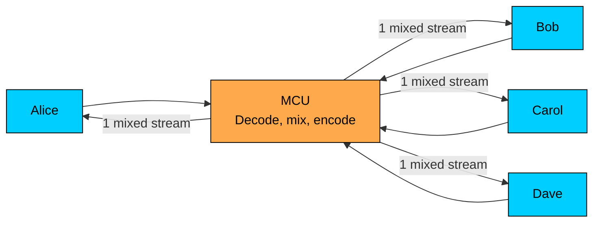

MCUs reduce client download bandwidth and simplify old or constrained clients, but they add server CPU cost and latency. They also reduce layout flexibility because everyone receives the mixed view chosen by the server.

| Architecture | Best For | Client Upload | Client Download | Server Cost | Notes |
|--------------|----------|---------------|-----------------|-------------|-------|
| Mesh | 1:1 and tiny rooms | Grows with participants | Grows with participants | Low | Simple but quickly stresses clients |
| SFU | Most group calls | Usually one stream | Depends on subscribed streams | Medium | Best general-purpose trade-off |
| MCU | Constrained clients or fixed layouts | One stream | One stream | High CPU | Requires decode and re-encode |

---

# Simulcast and SVC

Not every receiver has the same screen size, CPU, or network connection. A participant on a desktop fiber connection can receive higher quality than a participant on a weak mobile network.

SFUs handle this with simulcast or SVC.

### Simulcast

With simulcast, the sender encodes the same video at multiple qualities. The SFU forwards the right layer to each receiver.

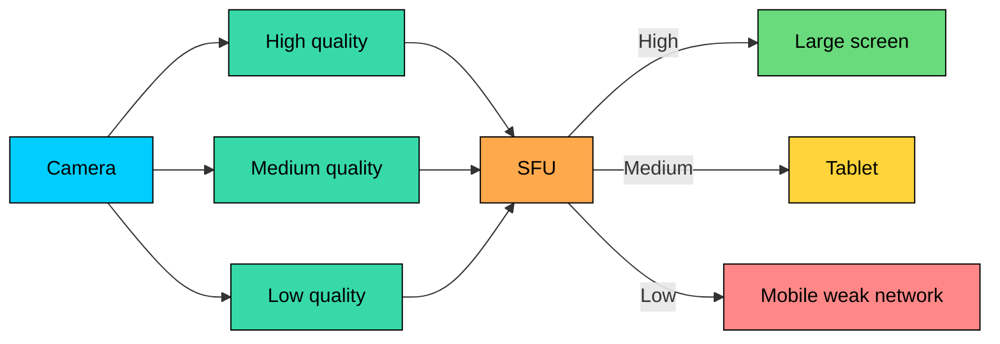

Simulcast costs extra upload bandwidth and encoder work, but it is widely used because it gives the SFU simple routing choices.

### SVC

SVC, or **Scalable Video Coding**, encodes video as layered data inside one stream. The SFU can drop enhancement layers for receivers that need lower quality.

SVC can be more efficient than simulcast, but support depends on codec, browser, device, and media server behavior. Treat it as an architecture choice to test, not as a checkbox.

---

# WebRTC and Live Streaming

WebRTC can deliver live video with very low latency, often below a second in well-designed systems. That makes it useful for interactive streams where delay changes the product experience: live auctions, online classrooms with participation, remote assistance, watch parties, and creator streams with real-time audience interaction.

For passive broadcast to a large audience, HLS and DASH are still common because they work well with CDNs and scale economically.

| Aspect | WebRTC | HLS/DASH |
|--------|--------|----------|
| Typical latency goal | Sub-second to a few seconds | Several seconds to tens of seconds |
| CDN compatibility | More specialized | Excellent |
| Scaling model | SFU or WebRTC edge infrastructure | HTTP caching and CDN distribution |
| Cost profile | Higher for large passive audiences | Usually lower at mass scale |
| Best fit | Interactive real-time experiences | Large one-way broadcasts |

Many real products use hybrid delivery: WebRTC for hosts, guests, or highly interactive viewers; HLS/DASH for large passive audiences. The right design depends on latency requirements, audience size, cost, and failure tolerance.

---

# Security

WebRTC has strong security defaults, but your application still has security work to do.

### Built-In Security

WebRTC media is encrypted. Browsers require explicit user permission before granting camera, microphone, or screen capture access. Modern browser APIs also require secure contexts such as HTTPS, with localhost exceptions for development.

These properties are helpful, but they do not secure your product by themselves.

### Application Security

Your application must still handle user authentication, room authorization, and short-lived TURN credentials. It is also responsible for abuse prevention and rate limiting, moderation and reporting, secure signaling, and a clear policy for recording consent and retention.

TURN credentials deserve special care. A public TURN server with static credentials is an expensive abuse target. Production systems usually mint short-lived credentials for authenticated users.

### Privacy

ICE candidate gathering can reveal network information such as local or public IP-derived addresses. Modern browsers have added privacy protections, including mDNS host candidates in many cases, but privacy behavior varies by browser and configuration.

For sensitive applications, consider stricter ICE policies such as relay-only mode. That improves privacy and predictability at the cost of TURN bandwidth and added latency.

---

# Operational Challenges

WebRTC failures often look like "the call is bad" rather than a clean HTTP 500. You need different observability.

### Metrics to Track

At minimum, track:

- Call setup success rate
- Time to first media
- ICE connection state transitions
- TURN fallback rate
- Selected candidate type and region
- Packet loss, jitter, and round-trip time
- Send and receive bitrate
- Frame rate and resolution
- Audio level and silence detection
- Reconnects and media interruptions

The browser exposes much of this through `getStats()`. Collect it carefully. Raw WebRTC stats are detailed, noisy, and browser-specific, so build product-level metrics such as "percentage of calls with first media under 3 seconds" and "minutes with packet loss above threshold."

### TURN Capacity

TURN can dominate cost because it relays full media streams.

The exact fallback rate depends heavily on user networks, geography, ports, firewalls, and client mix. Measure your own traffic before making capacity or cost promises.

### Mobile Networks

Mobile clients add their own failure modes: switching between WiFi and cellular, app backgrounding and OS suspension, battery and thermal limits, variable uplink bandwidth, and Bluetooth device changes.

Good WebRTC applications treat network changes as normal. They listen for ICE state changes, restart ICE when appropriate, adapt bitrate, and keep room state recoverable after reconnect.

---

# When to Use WebRTC

Use WebRTC when the product needs low-latency media or peer-to-peer data:

- Video and audio calls
- Screen sharing
- Interactive live sessions
- Browser-based remote support
- Low-latency data channels between peers

Do not reach for WebRTC just because something is "real time." For server-authored events, notifications, chat, dashboards, and collaborative documents, WebSockets, SSE, or normal HTTP APIs are often simpler and easier to operate.

| Requirement | Better Starting Point |
|-------------|-----------------------|
| User-to-user audio/video | WebRTC |
| Browser screen sharing | WebRTC |
| Interactive broadcast with very low latency | WebRTC or hybrid WebRTC/HLS |
| Notifications | SSE or WebSockets |
| Chat messages that must be stored and moderated | WebSockets plus server persistence |
| Large passive video broadcast | HLS/DASH |
| File upload to a service | HTTP |

The engineering question is not "Can WebRTC do this"" It often can. The better question is: "Do we need WebRTC's latency and media stack enough to accept its operational complexity""

---

# Summary

WebRTC is the browser platform's real-time media stack. It handles capture, negotiation, NAT traversal, encryption, congestion control, and low-latency transport.

The main ideas to remember:

1. **WebRTC tries direct paths first.** Direct media lowers latency and reduces server bandwidth, but real networks often require fallback.
2. **Signaling is your job.** WebRTC does not define rooms, users, permissions, or how SDP and ICE messages move between peers.
3. **ICE finds the path.** STUN discovers public mappings; TURN relays traffic when direct paths fail.
4. **Media is optimized for freshness.** WebRTC prefers low latency over perfect packet delivery.
5. **Group calls need architecture.** Mesh works only for tiny rooms. SFUs are the common default. MCUs trade server CPU for simpler client delivery.
6. **Operations matter.** Monitor setup success, time to first media, candidate types, TURN usage, and media quality.

WebRTC is powerful because it brings real-time communication into the browser. It is also demanding because it sits at the intersection of browsers, codecs, NATs, firewalls, mobile networks, and distributed systems. Treat it as infrastructure, not just an API, and the design decisions become much clearer.

---

# Quiz
