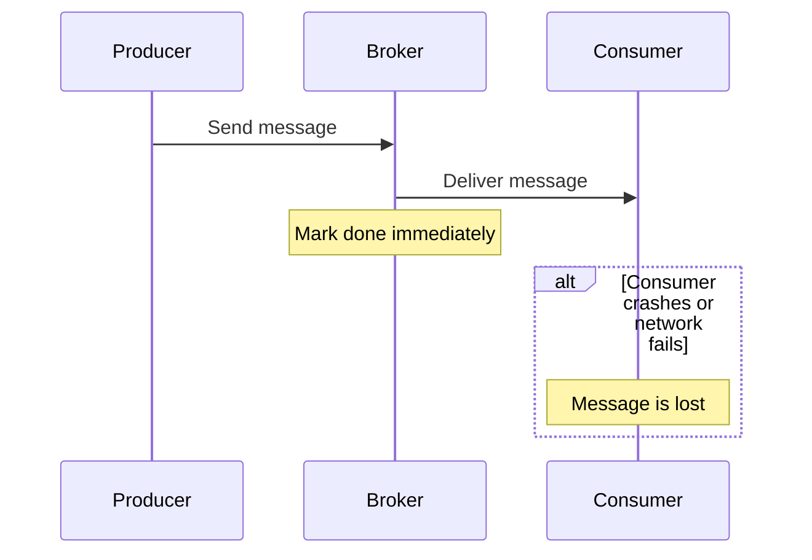
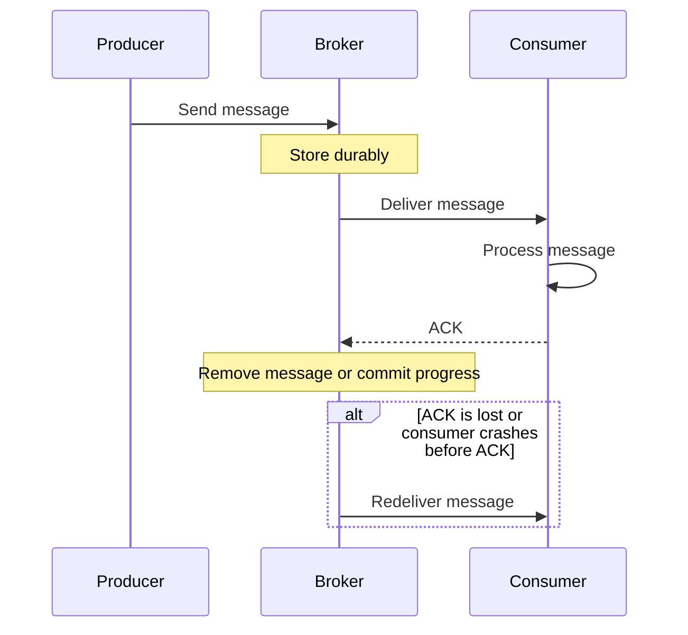
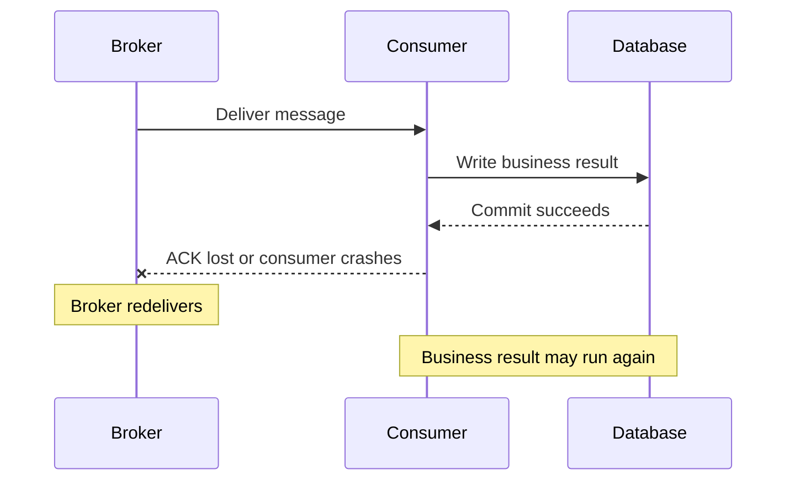
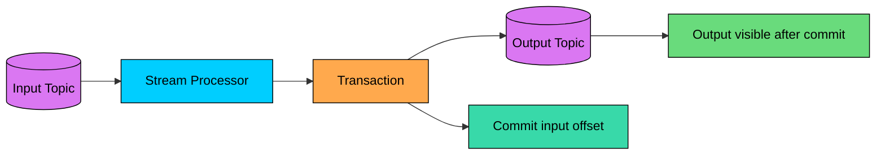

When a system sends a message, several things can go wrong.

The producer may retry because it did not receive an acknowledgment. The broker may redeliver a message because a consumer crashed. The consumer may finish the work but fail before committing progress.

**Delivery semantics** describe what the messaging system promises about message delivery and redelivery.

These promises matter because they shape the consumer code. If a message can be delivered twice, the consumer must handle duplicates. If a message can be lost, the business must be able to tolerate loss.

The most important practical lesson is this:

> Delivery semantics describe message delivery. Your application still owns the correctness of the business effect.

---

# Delivery vs Processing

Before comparing the semantics, separate two ideas:

| Concept | Meaning |
|---------|---------|
| **Delivery** | The broker gives a message to a consumer. |
| **Processing** | The consumer performs the business action. |
| **Acknowledgment** | The consumer tells the broker it is done. |
| **Commit** | The system records progress, such as deleting the message or storing a consumer offset. |

A broker can know whether a message was acknowledged. It usually cannot know whether the consumer's business action was completed correctly.

For example, a payment worker might charge a card and then crash before acknowledging the message. The broker sees no acknowledgment, so it redelivers. The second delivery may charge the card again unless the consumer is designed to prevent that.

That is why delivery semantics and idempotency belong together.

---

# The Three Semantics

The usual three categories are:

| Semantic | Broker Behavior | Main Risk | Consumer Requirement |
|----------|-----------------|-----------|----------------------|
| **At-most-once** | Try once, then move on | Message loss | Application must tolerate loss |
| **At-least-once** | Retry until success or policy limit | Duplicate delivery | Consumer must be idempotent |
| **Exactly-once** | Avoid duplicate effects within a defined boundary | Hidden complexity | Transactional or deduplicated processing |

These are not absolute guarantees by themselves. They depend on configuration, durability, retention, acknowledgments, retries, and how the consumer writes its results.

---

# At-Most-Once Delivery

> [!PAYWALL] This content is for premium members only.

At-most-once means the system makes one delivery attempt and does not retry if something goes wrong.

The message may be processed once, or it may not be processed at all. It should not be processed twice by the messaging system.

### How It Works



The broker does not wait for a durable confirmation that the consumer completed the work. This keeps the system simple and fast, but it accepts loss.

### Example

This is acceptable for data where occasional loss is fine.

### When to Use

At-most-once works for high-volume metrics where small gaps are acceptable, real-time telemetry that is quickly replaced by newer data, best-effort notifications, and other low-value events where duplicates are worse than drops.

It is a poor fit for orders, payments, account changes, inventory updates, or anything that must be recovered after failure.

### Trade-offs

### Advantages

- Simple consumer logic
- Low latency
- No broker-level duplicate delivery
- Low retry overhead

### Disadvantages

- Messages can be lost
- Failures may be hard to recover
- Not suitable for critical workflows
- Silent loss can hide production issues

---

# At-Least-Once Delivery

At-least-once means the system keeps a message available until it receives confirmation that processing completed, or until a configured retry, retention, or dead-letter policy stops further delivery.

In a healthy configuration, accepted messages are not silently dropped. The trade-off is that a message may be delivered more than once.

### How It Works



The broker retries when it cannot prove the message was completed. This is the right conservative choice when losing the message is worse than processing it twice.

### Why Duplicates Happen

Duplicates happen because the broker cannot reliably distinguish these cases:

- The consumer never received the message.
- The consumer received the message but crashed before doing the work.
- The consumer completed the work but crashed before acknowledging it.
- The consumer acknowledged the message, but the acknowledgment was lost.

```mermaid
flowchart LR
    M[Message delivered]:::primary --> Work[Consumer does work]:::green
    Work --> Crash{What happens next"}:::yellow
    Crash -->|"ACK succeeds"| Done[Broker removes message]:::green
    Crash -->|"Crash before ACK"| Retry[Broker redelivers]:::orange
    Crash -->|"ACK lost"| Retry
    Retry --> Duplicate[Consumer may see duplicate]:::red

    classDef primary fill:#00ceff,stroke:#000,color:#000
    classDef green fill:#69db7c,stroke:#000,color:#000
    classDef yellow fill:#ffd43b,stroke:#000,color:#000
    classDef orange fill:#ffa94d,stroke:#000,color:#000
    classDef red fill:#ff8787,stroke:#000,color:#000
```

This is not a bug in the broker. It is a consequence of failure and uncertainty.

### When to Use

At-least-once is the default choice for most production systems, including order processing, payment workflows, background jobs, search index updates, data pipelines, and cross-service events. It works well when consumers are idempotent or can deduplicate messages.

---

# Idempotency

An operation is **idempotent** if running it multiple times has the same final effect as running it once.

At-least-once delivery depends on idempotent consumers. Without idempotency, retries can create duplicate side effects.

### Natural Idempotency

Some operations are naturally safe to repeat:

| Safer to Repeat | Risky to Repeat |
|-----------------|-----------------|
| Set order status to `SHIPPED` | Append `SHIPPED` event without a unique ID |
| Upsert user profile by `userId` | Insert a new row with a random ID |
| Delete session by `sessionId` | Increment a counter |
| Put object at a known key | Charge a card |

The safer operations use a stable identity. The risky operations create a new side effect each time.

### Deduplication with Message IDs

A common approach is to store processed message IDs or operation IDs.

```mermaid
flowchart LR
    M["Message<br/>id=msg_123"]:::primary --> Check{"Already<br/>processed""}:::yellow

    Check -->|"No"| Tx["Apply work + record msg_123"]:::green
    Tx --> ACK["ACK"]:::green

    Check -->|"Yes"| Skip["Skip duplicate"]:::teal
    Skip --> ACK2["ACK"]:::teal

    classDef primary fill:#00ceff,stroke:#000,color:#000
    classDef yellow fill:#ffd43b,stroke:#000,color:#000
    classDef green fill:#69db7c,stroke:#000,color:#000
    classDef teal fill:#38d9a9,stroke:#000,color:#000
```

The important detail is that the business update and the deduplication record should be committed together when possible. If you update the business state and crash before recording the message ID, a duplicate can still slip through.

### Database Constraints

Unique constraints are one of the simplest and strongest deduplication tools.

The `operation_id` must come from the business operation, not from a newly generated random value on each retry.

---

# Exactly-Once Semantics

"Exactly-once" is the most misunderstood phrase in messaging.

In casual conversation, it sounds like this:

> Every message is delivered once, processed once, and causes one side effect.

In real distributed systems, that broad promise is usually too strong. Networks fail, processes crash, acknowledgments are lost, and external systems may not participate in the same transaction.

What production systems usually provide is narrower:

> Within a specific transactional boundary, the observable effect is as if each input was processed once.

That boundary matters.

### Exactly-Once Delivery vs Exactly-Once Processing

| Term | Reality |
|------|---------|
| **Exactly-once delivery** | Rare in a distributed system. The same message may still be retried when acknowledgments are uncertain. |
| **Exactly-once processing** | More realistic. The message may be delivered more than once, but deduplication or transactions prevent duplicate effects. |
| **Exactly-once side effects** | Hardest. Requires the external side effect, such as a payment charge or email send, to be idempotent or transactional. |

This is why "exactly-once" claims should always be read with the fine print: exactly once for what, and inside which system boundary"

### Why It Is Hard

The hard part is coordinating two facts:

1. The business work completed.
2. The broker progress was committed.

If those facts are stored in different systems, one can succeed while the other fails.



To make this safe, the consumer needs idempotency, deduplication, or a transaction that covers both progress and output.

### Kafka Example

Kafka can provide exactly-once semantics for supported Kafka-to-Kafka workflows when producers, consumers, transactions, and offset commits are configured correctly.

The important boundary is Kafka itself.



The transaction can make the output records and consumed offsets commit together. If the processor crashes, Kafka can avoid making partial Kafka output visible.

But if the same processor also charges a credit card, sends an email, or writes to a database outside the transaction, Kafka cannot automatically make that external side effect exactly-once. That side effect still needs its own idempotency or transactional design.

### When Exactly-Once Is Worth It

Exactly-once processing is worth the extra complexity when duplicate effects are expensive or dangerous, you control the whole processing boundary, the platform supports transactions for the operations involved, and the added latency and operational cost are acceptable.

For many systems, at-least-once delivery plus idempotent consumers is simpler, more portable, and easier to operate.

---

# Choosing the Right Semantic

| Use Case | Good Default | Why |
|----------|--------------|-----|
| Metrics and telemetry | At-most-once or at-least-once | Small gaps may be acceptable, depending on business need. |
| Email notifications | At-least-once | Better to retry, but use idempotency to avoid duplicate sends where it matters. |
| Order processing | At-least-once + idempotency | Lost orders are unacceptable; duplicate effects must be prevented. |
| Payment capture | At-least-once + idempotency key | The payment provider or ledger must reject duplicate operation IDs. |
| Kafka stream processing | Exactly-once processing where supported | Useful when input offsets and output topics can commit transactionally. |
| Audit logs | At-least-once, sometimes exactly-once processing | Loss is usually worse than duplicates; deduplicate during reads or writes. |

The right choice is a business decision as much as a technical one. Ask what is worse: losing the message, processing it twice, delaying it, or adding complexity to prevent both.

---

# Summary

Delivery semantics define how a messaging system behaves when delivery, acknowledgment, or processing fails.

**At-most-once** delivery tries once and does not retry. Messages can be lost, but duplicate delivery is avoided. It is best for low-value or replaceable data, such as high-volume metrics that are quickly superseded.

**At-least-once** delivery retries until the consumer confirms success or the policy limit is reached. Accepted messages are much less likely to be lost, but duplicate delivery is possible. It is the right default for most critical business workflows when consumers are idempotent.

**Exactly-once** usually means exactly-once processing within a defined boundary, such as a Kafka-to-Kafka pipeline. It requires transactions, deduplication, or idempotency, and it does not automatically make external side effects safe. It is worth the extra complexity only when the platform supports it and the correctness benefit justifies the operational cost.

The practical default for most systems is at-least-once delivery with idempotent consumers. That combination accepts the reality of retries while protecting the business from duplicate effects.

---

# Quiz
