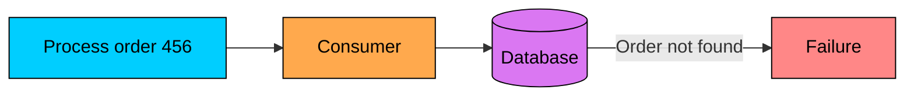
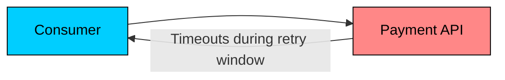
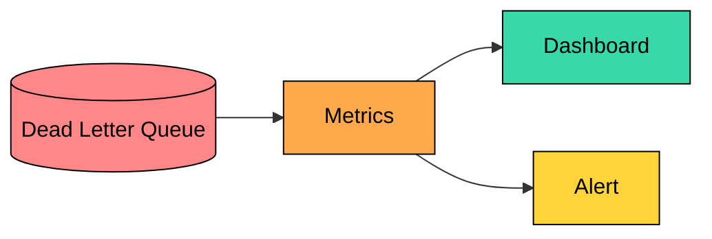
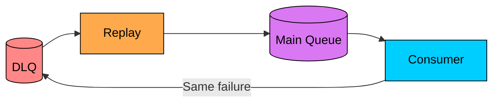
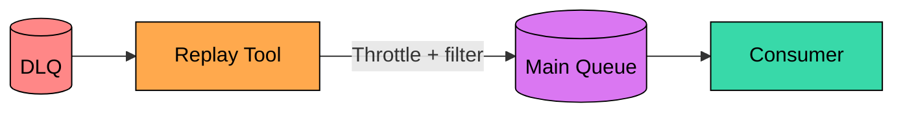
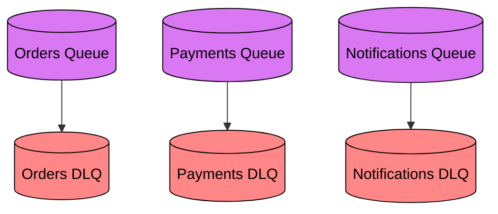
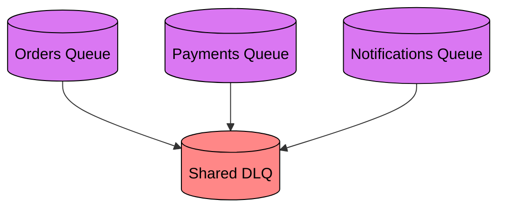
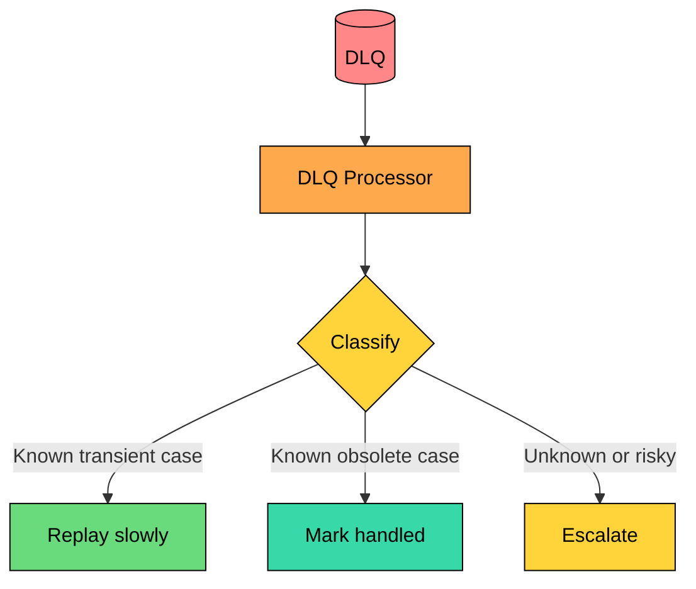

Retries are useful only when a failure might go away. A network timeout, a busy database, or a temporary service outage is worth retrying.

Some failures are different. A message may have invalid data, refer to an object that no longer exists, violate a business rule, or trigger a bug in the consumer. Retrying that message forever wastes capacity and can stop later messages from making progress.

A **dead letter queue (DLQ)** is where a messaging system puts messages that cannot be processed through the normal path. It keeps the main queue moving while preserving failed messages for investigation, repair, replay, or deletion.

The important idea is simple:

> A DLQ is not where messages go to be forgotten. It is a quarantine area for messages that need a decision.

---

# What Is a Dead Letter Queue"

A dead letter queue is a separate queue, topic, or stream that receives messages after normal delivery has failed too many times or the broker has been told not to redeliver them.

The exact mechanism depends on the messaging system, but the pattern is the same:

```mermaid
flowchart LR
    Q[(Main Queue)]:::purple --> Consumer[Consumer]:::primary

    Consumer -->|"Success"| Done["Processed"]:::green
    Consumer -->|"Failure"| Retry{"Retry<br/>allowed""}:::yellow

    Retry -->|"Yes"| Q
    Retry -->|"No"| DLQ[(Dead Letter Queue)]:::red

    classDef purple fill:#da77f2,stroke:#000,color:#000
    classDef primary fill:#00ceff,stroke:#000,color:#000
    classDef green fill:#69db7c,stroke:#000,color:#000
    classDef red fill:#ff8787,stroke:#000,color:#000
    classDef yellow fill:#ffd43b,stroke:#000,color:#000
```

The normal flow is:

1. A message arrives in the main queue.
2. A consumer tries to process it.
3. If processing fails, the message is retried.
4. After the retry policy is exhausted, the message is moved to the DLQ.
5. The main queue continues processing other messages.

This prevents one bad message from consuming worker capacity forever. In FIFO or ordered systems, it can also prevent a poison message from blocking everything behind it.

---

# Why Messages Reach a DLQ

> [!PAYWALL] This content is for premium members only.

Messages usually reach a DLQ for one of five reasons.

### The Message Is Malformed

The consumer expected a valid order event, but the payload is missing required fields or has the wrong types. This is usually a producer bug, a schema compatibility problem, or an old client sending an outdated format.

Retries will not fix malformed data. The producer or schema contract must be fixed first.

### The Message Refers to Missing State



The message is syntactically valid, but it references data that is missing or no longer valid. The user may have been deleted, the order cancelled, an inventory record moved, or an external system may not have created the referenced object yet.

Sometimes this is a real data bug. Sometimes it is an ordering issue where event B arrived before event A.

### The Operation Violates a Business Rule

The message may be well formed, but the requested operation is no longer allowed. These cases often need a business decision, not just an engineering fix.

### The Consumer Has a Bug

Here the message is not the problem. The consumer code is. Replaying before deploying the fix will only fail the same way again.

### A Dependency Stayed Unhealthy Too Long



Not every DLQ message is permanently bad. A downstream service may be unavailable longer than the retry window. Once the dependency recovers, those messages may be safe to replay.

That does not mean they should be replayed blindly. A large replay can overload the service that just recovered.

---

# How Different Systems Handle DLQs

"Dead letter queue" is a pattern, not one identical feature across all brokers.

| System | How DLQs Usually Work |
|--------|------------------------|
| **Amazon SQS** | A source queue has a redrive policy with a `maxReceiveCount`. After a message is received too many times without being deleted, SQS moves it to the configured DLQ. |
| **RabbitMQ** | Queues can dead-letter messages to a dead letter exchange. Messages can be dead-lettered after rejection without requeue, expiration, queue length limits, or quorum queue delivery limits. |
| **Apache Kafka** | Kafka brokers do not provide a single generic DLQ behavior for all consumers. Applications often publish failed records to an error topic. Kafka Connect sink connectors support configurable DLQ topics. |
| **Google Cloud Pub/Sub** | A subscription can forward messages to a dead-letter topic after an approximate maximum number of delivery attempts. The dead-letter topic needs its own subscription for inspection. |
| **Azure Service Bus** | Queues and subscriptions have a dead-letter subqueue. Messages can be dead-lettered by the system or explicitly by the receiver. |

The design lesson is more important than the product names: know exactly when your broker moves a message, what metadata it keeps, and what happens when you replay.

---

# What a DLQ Message Should Preserve

When a message reaches a DLQ, the payload alone is rarely enough. You need enough context to answer three questions:

1. What was the message"
2. Why did it fail"
3. Is it safe to replay"

Useful metadata includes:

| Field | Why It Matters |
|-------|----------------|
| **Original payload** | Needed to inspect or replay the message |
| **Source queue/topic/subscription** | Tells you where the message came from |
| **Message ID and correlation ID** | Links the failure to logs, traces, and user requests |
| **Idempotency key** | Helps make replay safe |
| **Attempt count** | Shows whether the message failed once or repeatedly |
| **First seen and dead-lettered time** | Shows how long the failure took to surface |
| **Last error class/message** | Speeds up triage |
| **Consumer version** | Helps connect failures to deployments |

Be careful with sensitive data. DLQs often contain the same personally identifiable information, tokens, or business data as the original message. Encrypt the queue, restrict access, and avoid copying full payloads into logs unless your data policy allows it.

---

# Handling DLQ Messages

A DLQ is useful only if there is an operational process behind it. The process does not need to be complicated, but it does need to be explicit.

### Monitor the DLQ



At minimum, track the number of messages in the DLQ, the rate at which new messages are entering it, the age of the oldest message, the failure reason where available, and the source queue or consumer group.

For critical workflows such as payments or account provisioning, even one DLQ message may deserve an immediate page. For lower priority workflows, a ticket or daily review may be enough. The threshold should match business impact.

### Classify the Failure

| Failure Type | Typical Meaning | First Action |
|--------------|-----------------|--------------|
| **Malformed payload** | Producer or schema bug | Fix producer, then decide whether old messages can be transformed |
| **Missing dependency** | Data ordering issue or missing record | Restore/create the missing state or confirm the event is obsolete |
| **Consumer bug** | Code cannot handle a valid message | Deploy a fix before replay |
| **Dependency outage** | Retry window ended before recovery | Replay gradually after the dependency is healthy |
| **Business rejection** | Operation should not happen | Mark as handled, compensate, or discard with audit trail |

The goal is not to empty the DLQ as fast as possible. The goal is to make the correct decision for each class of failure.

### Fix the Cause Before Replay

Replaying a message without fixing the cause usually creates a loop:



Before replay, confirm that something actually changed. The producer or consumer may have been fixed, missing data may have been repaired, or a downstream dependency may have recovered. If the schema has moved on, the message may need to be transformed into the current shape, and duplicate processing must not corrupt state.

### Replay in a Controlled Way

Replay means sending the message back to the normal processing path, or to a special repair path that applies the same business rules.



Good replay tooling supports filtering by time range, source, error type, or message ID; dry runs that show what would be replayed; rate limits and batch sizes; idempotency checks; audit records for who replayed what and why; and a way to stop replay if failures start again.

Bulk replay is one of the easiest ways to turn a resolved incident into a second incident. Start small, watch the metrics, then increase the rate.

### Discard Only With an Audit Trail

Some messages should not be replayed. For example, a duplicate cancellation event for an already-closed order may be safe to discard.

Discarding should still leave a record that captures the message ID, the source, the reason for discard, the operator or automated rule that made the decision, and a timestamp.

Do not blindly write full message bodies to logs. Store only what your privacy, security, and compliance rules allow.

---

# DLQ Architecture Patterns

### Per-Queue DLQ

Each source queue has its own DLQ.



This is usually the best default. Ownership is clear, message formats are consistent, and replay rules are easier to reason about. The trade-off is more queues to monitor.

### Shared DLQ

Several source queues send failed messages to one DLQ.



This can reduce operational overhead for small systems. It requires strong metadata because messages from different workflows will have different owners, schemas, and replay rules.

### DLQ Processor

Some systems add a processor that reads the DLQ and applies known handling rules.



Automation is useful for well-understood cases. It should be conservative. Unknown messages should be escalated, not silently dropped.

---

# Best Practices

### Use Retries Before DLQ, but Do Not Retry Forever

Short transient failures should not send messages straight to the DLQ. Permanent failures should not burn worker capacity for hours.

A common retry policy is to attempt a few times with exponential backoff and jitter, stop after a bounded time or attempt count, and then move the message to the DLQ with full error context attached.

Three to five attempts is a common starting point for simple background jobs. Use longer windows for dependencies that commonly recover after a few minutes. Use fewer retries for validation errors that are clearly permanent.

### Separate Retryable and Non-Retryable Errors

Not all exceptions deserve the same treatment. Retry transient issues such as timeouts, rate limits, and temporary dependency failures, but dead-letter the things that will never recover on retry, like malformed payloads, schema errors, and impossible business operations. For programming errors, fail fast if continuing would corrupt data.

This keeps DLQs meaningful and avoids hiding bugs behind endless retries.

### Make Consumers Idempotent

Replay means a message may be processed after a previous attempt partially succeeded. Consumers should handle duplicates and partial progress safely.

Use idempotency keys, unique constraints, compare-and-set updates, or processed-message tables where appropriate. Without idempotency, replay becomes risky and operators will avoid using it when it matters most.

### Preserve Context, Not Just Payload

A DLQ message without error context forces engineers to reconstruct the incident from logs that may already have expired.

At minimum, keep the source, attempt count, timestamps, error type, and correlation ID. If your broker does not add this automatically, add it in the consumer before publishing to the DLQ.

### Set Retention Deliberately

DLQ messages should not disappear before the team has a chance to investigate them. Set retention long enough for normal incident response, archive important failures before broker retention expires, and avoid keeping sensitive data longer than policy allows. Document who owns periodic DLQ review.

Retention is a product and compliance decision, not just a broker setting.

### Protect DLQ Data

DLQs often contain production payloads. Treat them like production data: encrypt in transit and at rest, restrict read and replay permissions, audit reads/replays/deletes, redact or tokenize sensitive fields where practical, and avoid sending DLQ payloads to broad logging systems.

### Test the Whole Failure Path

DLQ behavior should be tested before an incident. A useful test set covers an invalid payload reaching the DLQ, a retryable error being retried with backoff, a message moving to the DLQ after the configured limit, an alert firing with useful context, a successful replay after the root cause is fixed, and replay not creating duplicate side effects.

The most common DLQ failure is not that messages cannot be stored. It is that nobody notices them, or nobody knows how to replay them safely.

---

# Summary

Dead letter queues keep failed messages from blocking normal processing. They are especially important in at-least-once systems, where retries are expected but infinite retries are dangerous.

A good DLQ design includes a clear retry policy, enough metadata to debug failures, monitoring and ownership, secure access controls, safe replay tooling, and a documented discard process.

The key habit is to treat the DLQ as part of the production workflow. Messages in a DLQ represent unfinished work. Some need a code fix, some need data repair, some need careful replay, and some should be discarded with a record of why.

---

# Quiz
