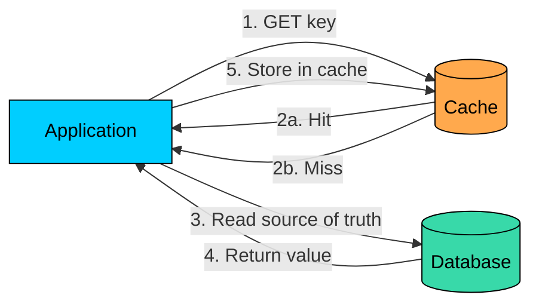
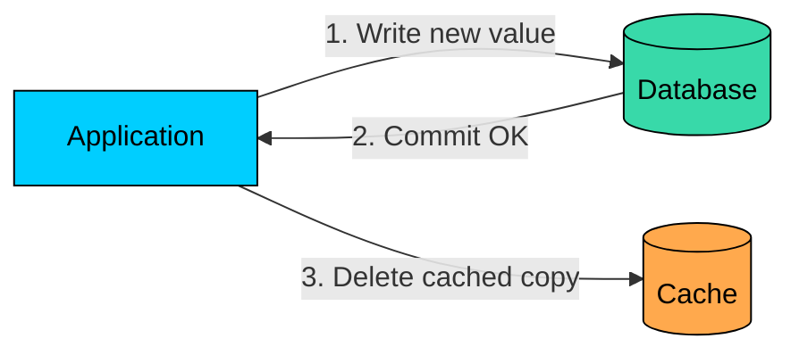
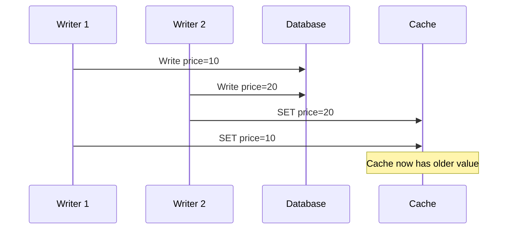
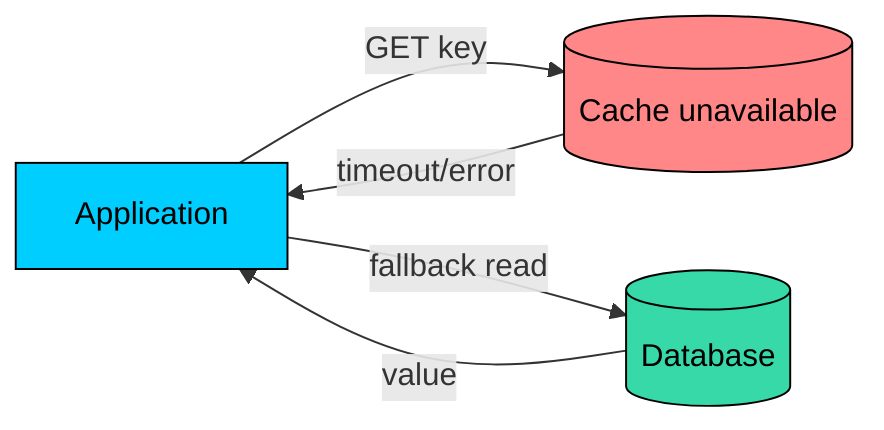
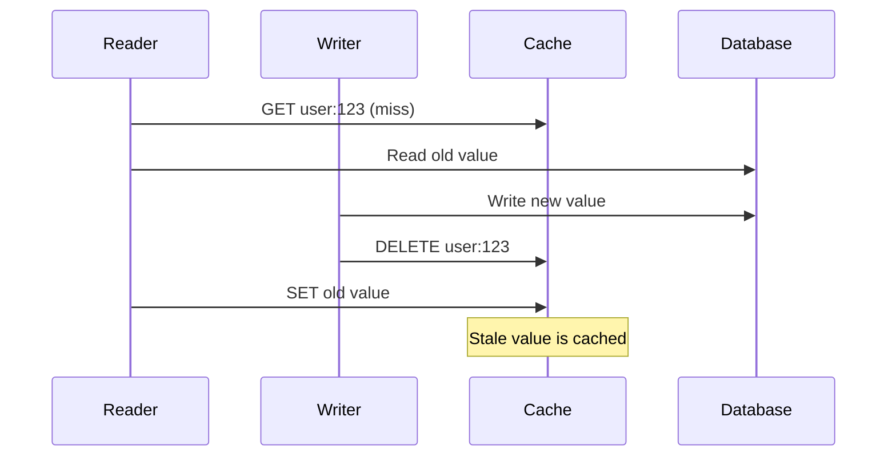

The first design question in caching is simple:

> Who decides what goes into the cache"

In the **cache-aside pattern**, the application makes that decision.

On reads, the application checks the cache first. If the value is missing, it reads from the database and stores the result in the cache. On writes, the application updates the database and usually deletes the affected cache entry.

This pattern is also called **lazy loading** because data is cached only after something asks for it.

Cache-aside is popular because it works with ordinary key-value stores such as Redis and Memcached. The cache does not need to know your database schema. Your application owns the logic.

That is both the strength and the cost of the pattern.

This chapter walks through how cache-aside reads and writes work, why invalidation usually means deletion, key design and TTL choices, null caching, failure handling, and when the pattern is a good fit.

---

# How Cache-Aside Works

> [!PAYWALL] This content is for premium members only.

In cache-aside, the cache sits beside the database. It is not the source of truth. It is a fast copy that the application manages.

#### Read Path

Step by step:

1. Build the cache key and check the cache
2. On a hit, return the cached value
3. On a miss, read from the database
4. Store the result in the cache with a TTL
5. Return the result

The important point: the cache is populated only after a miss.

#### Write Path

When data changes, the application writes to the database first, then invalidates the cache.

The next read misses the cache, reads the committed value from the database, and stores a fresh copy.

---

# Why Delete Instead of Update"

After a database write, it is tempting to update the cache with the new value.

In cache-aside systems, deletion is usually safer.

#### The Database May Change the Value

The value you send to the database may not be the final value stored by the database.

If the application stores only the write request in cache, the cache may differ from the committed database row.

#### Concurrent Writes Can Race

Two writers can update the same record at nearly the same time. If both update the cache directly, the older value can overwrite the newer value.

Deleting is idempotent. If both writers delete the same key, the result is still safe: the key is missing, and the next read reloads from the database.

Deletion does not solve every race, but it avoids a common class of stale cache updates.

---

# Key Design

Good cache-aside code starts with good keys. They should be deterministic, so the same request always produces the same key. They should be namespaced, so different data types never collide. They should be specific enough that different views of the same entity use different keys. And they should be versionable, so schema or serialization changes can move to a new key namespace without colliding with old data.

Avoid keys that are ambiguous or depend on unstable formatting.

#### Versioned Keys

When the cached value format changes, version the key.

The new application version reads and writes `v2` keys. Old `v1` keys naturally expire by TTL or can be cleared later.

---

# TTLs and Staleness

Cache-aside systems usually use TTLs even when they also explicitly invalidate on writes.

TTL provides a backstop. If invalidation fails, stale data eventually expires.

Choose TTLs based on freshness requirements:

| Data Type | Typical TTL Thinking |
|-----------|----------------------|
| Permissions or account state | Short TTL or avoid caching critical decisions |
| Product details | Minutes may be acceptable |
| Feature configuration | Short TTL plus explicit invalidation |
| Recommendations | Longer TTL often acceptable |
| Expensive reports | Cache only if users repeat the same request |

Add jitter to avoid many keys expiring at the same time.

---

# Null and Negative Caching

If a database lookup returns "not found," you may still want to cache that result briefly.

Without negative caching, repeated requests for a missing key hit the database every time.

Use a short TTL for negative results so newly created data does not stay hidden for long.

---

# Failure Handling

A major advantage of cache-aside is that the cache can be optional.

If the cache is down, the application can still read from the database. It may be slower, but it can keep serving.

#### Read Failures

Use short cache timeouts. A slow cache should not make the application slower than going to the database.

#### Write Failures

If the database write fails, do not change the cache.

If the database write succeeds but cache deletion fails, stale data may remain until TTL expires. For important data, record the failed invalidation and retry it through an outbox or background job.

---

# Common Race Conditions

Cache-aside is simple, but it is not race-free.

#### Read-Fill Race

A reader can fetch an old database value and write it into the cache after a writer has already updated the database and deleted the cache key.

Mitigations include using a TTL as a backstop, adding versions to keys or values, request coalescing for hot keys, a delayed second delete for high-risk updates, and durable invalidation events for important keys.

#### Cache Stampede

When a popular key expires, many requests may miss at the same time and all query the database.

Common mitigations include per-key locking, request coalescing, stale-while-revalidate, early refresh before expiration, and cache warming for known hot keys.

---

# When to Use Cache-Aside

Cache-aside is a good fit for read-heavy workloads where repeated reads benefit from cache hits, and for existing database-backed applications where it can be added around current code without disruption. It works well when the cache is optional and the application can fall back to the database, when different data types need different TTLs that the application controls per key, and when access patterns are unpredictable so only requested data ends up cached.

It is a poor fit when many services write the same data and invalidation ownership is unclear, when the application cannot tolerate stale reads, when every read must be strongly consistent, when cache misses would overload the database without additional protection, or when teams are likely to duplicate inconsistent caching logic across services.

---

# Monitoring Cache-Aside

Track cache behavior by route and key pattern, not only globally. The metrics worth watching are the hit rate (whether the cache is useful at all), the miss rate by key pattern (which data falls through to the database), hit and miss latency (the user impact of misses), the cache error rate (whether fallback paths are active), the set and delete failure rate (invalidation and population problems), the eviction rate (whether memory pressure is hurting hit rate), and the database QPS during misses (whether the backing store is being exposed).

Useful alerts fire when hit rate drops on critical paths, when cache errors increase, when cache delete failures occur on important keys, when database QPS rises after a spike in cache misses, or when miss latency crosses the request timeout budget.

---

# Summary

Cache-aside is the most common caching pattern because it is simple, flexible, and works with ordinary key-value caches.

The application owns the cache. On the read path, it checks the cache, reads the database on a miss, and stores the result with a TTL. On the write path, it writes the database and then deletes the affected cache entries. When the cache is unavailable, the application falls back to the database. The trade-off is more application responsibility and eventual consistency.

Prefer deleting cached values over updating them directly on writes. Use deterministic keys, TTLs as a safety net, short-lived negative caching for missing data, and monitoring that can detect stale data, miss spikes, and cache failures.

Cache-aside gives you control. It also makes cache correctness your application's job.

---

# Quiz
