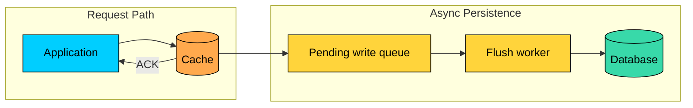
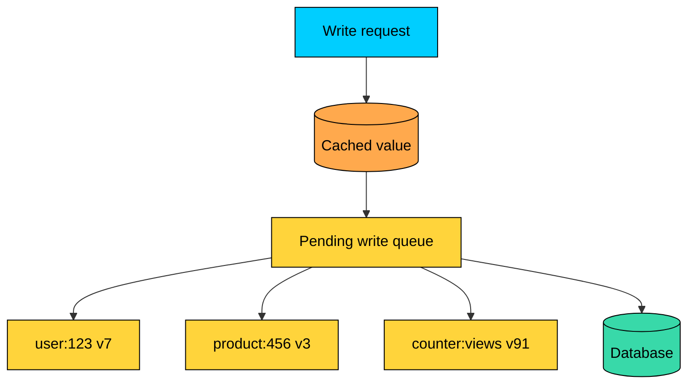
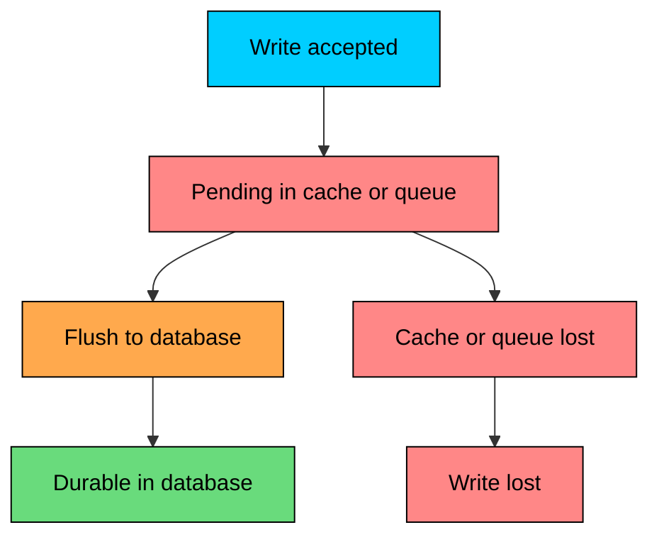
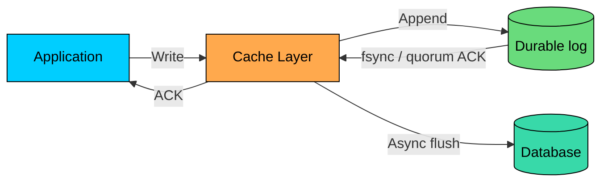

Write-through caching waits for the database before acknowledging a write. That keeps the write path simple, but every write pays database latency.

**Write-behind caching**, also called **write-back caching**, changes the contract. The cache accepts the write into a fast memory-backed buffer, acknowledges the application immediately, and persists the write to the database later from a background worker.

This can reduce write latency and smooth traffic spikes. It also opens a window where the application has been told the write succeeded but the database does not have it yet.

Write-behind is not a free performance upgrade. It is an asynchronous write pipeline, and it must be designed like one.

This chapter walks through how write-behind caching works, why it improves write latency, where data can be lost, batching and coalescing, ordering, retries, failure handling, when the pattern is safe to use, and what to monitor in production.

---

# How Write-Behind Works

> [!PAYWALL] This content is for premium members only.

In write-behind, the request path writes to the cache layer and returns quickly. A background path later flushes pending writes to the database.



#### Step-by-Step

1. Application writes a value to the cache layer
2. Cache stores the value and records a pending database write
3. Cache acknowledges success to the application
4. A background worker reads pending writes
5. Worker persists them to the database
6. Successfully persisted writes are marked complete

The application sees cache latency, not database latency.

| Pattern | Acknowledged After | User-Visible Write Latency |
|---------|--------------------|----------------------------|
| Write-through | Database commit | Database latency |
| Write-behind | Cache write / queue append | Cache or queue latency |

The database still does the work. Write-behind only moves that work out of the user request path.

---

# The Write Queue

A write-behind system needs a place to track writes that have been accepted but not persisted.



Each entry in the queue moves through a small set of states. A **pending** write has been accepted by the cache but not yet written to the database. An **in-flight** write is currently being flushed. A **persisted** write has succeeded against the database. A **failed** write hit an error and needs retry or operator attention. A **dead-lettered** write has exhausted its retry budget and is parked for manual recovery.

The queue may live inside the cache system, in a durable log, or in a separate message queue. The durability of this queue determines how much data you can lose.

---

# Why It Improves Performance

Write-behind improves perceived write latency because the user request does not wait for the database.

It can also improve throughput because background workers can batch, merge, and rate-limit database writes.

#### Batching

Instead of writing each change separately, the worker writes a batch.

Common batching policies flush every `N` milliseconds, flush when the batch reaches `N` entries, flush when the queue age crosses a maximum threshold, or use a hybrid of size and time limits.

#### Coalescing

Coalescing merges multiple updates to the same key before flushing.

Coalescing is safe only when the final state is all that matters.

It is unsafe when every intermediate event matters, such as audit logs, financial ledgers, inventory movements, or workflows with side effects.

---

# Durability Risk

The central risk of write-behind is data loss.

After the cache acknowledges a write, there is a period where the write exists in the cache or queue but not in the database.



The size of this risk depends on how durable the pending-write queue is, how many replicas must acknowledge the write, how often workers flush, how long the database is unavailable, and whether writes can be replayed after a crash.

If pending writes live only in memory, a process crash can lose acknowledged writes. That is unacceptable for many product features.

---

# Reducing Durability Risk

You can reduce the risk, but you cannot make write-behind identical to synchronous database writes without giving up much of its benefit.

#### Durable Write-Ahead Log

Before acknowledging the application, append the write to a durable log.



On recovery, replay the log and flush any writes that were acknowledged but not persisted.

This improves durability, but the acknowledgement now waits for the log. That is still usually faster than a full database write, but it is not free.

#### Replication

Replicate pending writes to multiple nodes before acknowledging.

Replication protects against a single node loss. It does not protect against software bugs, bad deployments, corrupted queues, or all replicas failing before flush.

#### Shorter Flush Intervals

Flush more often to reduce the time window where data is pending.

| Flush Interval | Maximum Time at Risk |
|----------------|----------------------|
| 5 seconds | Up to 5 seconds |
| 1 second | Up to 1 second |
| 100ms | Up to 100ms |

Short intervals reduce risk but increase database write load and reduce batching efficiency.

#### Synchronous Path for Critical Writes

Many systems use write-behind for low-risk data and synchronous writes for important data.

This keeps the dangerous optimization away from data that cannot be lost.

---

# Ordering and Idempotency

Write-behind systems must handle retries and out-of-order flushes.

#### Per-Key Ordering

For most use cases, writes to the same key must reach the database in order.

Common ways to preserve ordering are partitioning the queue by key, assigning one worker per key partition, including monotonically increasing versions with each write, and rejecting stale versions at the database.

#### Retry Can Reorder Writes

Retries are necessary, but they can corrupt data if older writes succeed after newer writes.

The database should reject stale versions:

#### Idempotency

Flush workers may retry the same write after a timeout even if the database already applied it.

Make writes idempotent when possible: attach operation IDs, use upserts keyed by version, store deduplication keys, make increments explicit and uniquely identified, and keep non-idempotent side effects out of the flush worker.

---

# Handling Flush Failures

The background flush path needs a real failure policy.

```mermaid
flowchart TD
    P[Pending write]:::yellow
    F[Flush attempt]:::primary
    S{Succeeded"}:::yellow
    Done[Mark persisted]:::green
    Retry[Retry with backoff]:::orange
    DLQ[Dead-letter queue]:::red

    P --> F --> S
    S -->|Yes| Done
    S -->|No| Retry
    Retry --> F
    Retry -->|retry budget exhausted| DLQ

    classDef primary fill:#00ceff,stroke:#000,color:#000
    classDef yellow fill:#ffd43b,stroke:#000,color:#000
    classDef green fill:#69db7c,stroke:#000,color:#000
    classDef orange fill:#ffa94d,stroke:#000,color:#000
    classDef red fill:#ff8787,stroke:#000,color:#000
```

A healthy failure policy combines exponential backoff, retry budgets, dead-letter queues, circuit breakers when the database is unhealthy, and alerts that fire on old pending writes.

Do not retry aggressively into a failing database. That can turn a database incident into a larger outage.

---

# Backpressure

Write-behind can hide database slowness for a while, but it cannot make the database infinitely fast.

If writes arrive faster than workers can flush them, the queue grows.

At some point, the system must apply backpressure. That can mean slowing down writers, rejecting non-critical writes, switching some writes to synchronous mode, dropping low-value writes if the product allows it, or increasing flush capacity when the database has headroom.

Without backpressure, the queue can consume memory, increase data-loss exposure, and make recovery painfully slow.

---

# When to Use Write-Behind

Use write-behind only when delayed durability is acceptable or when pending writes are protected by a durable log.

Good candidates include metrics and counters where small delays or occasional loss are acceptable, view counts and engagement stats where users expect fast feedback and exactness matters less, session-like state where the product can tolerate losing recent updates, derived or regenerable data whose source lives elsewhere, and high-volume state snapshots where only the latest value matters.

Poor candidates include payments and financial ledgers where every committed write must be durable and auditable, user-generated content where users expect saved posts and messages to stick, inventory reservations where lost or reordered writes can oversell, audit logs where missing records can violate compliance requirements, and security state where delayed persistence can lead to unsafe authorization decisions.

If losing an acknowledged write would require an apology, a refund, or an incident report, do not use plain write-behind for that write.

---

# Real-World Analogies

#### Database Buffer Pools

Databases use a form of write-behind internally, but with a critical difference: they write to a durable WAL before acknowledging a transaction.

The dirty page may be flushed to disk later, but the committed change can be recovered from the log.

That is the important lesson: asynchronous flushing is safe only when acknowledged writes are recoverable.

#### CPU Caches

CPUs use write-back caches for performance. They also need cache coherence protocols and memory ordering rules because delayed writes create visibility problems.

The analogy is useful, but application-level write-behind has a different failure model. A process crash, node loss, or queue corruption can lose data unless you design against it.

#### Distributed Data Grids

Some distributed cache and data grid systems support write-behind through a configured store or writer.

Those systems can help with batching and retries, but they do not remove the need to choose durability, ordering, and failure semantics.

---

### Comparing Write Patterns

| Aspect | Cache-Aside | Write-Through | Write-Behind |
|--------|-------------|---------------|--------------|
| Write acknowledgement | After DB write | After cache-managed DB write | Before DB write |
| User-visible latency | Database latency | Database latency plus cache-layer work | Cache or queue latency |
| Durability at ACK | Durable in DB | Durable in DB if write succeeds | Depends on pending-write durability |
| Database load | Immediate | Immediate | Smoothed by batching/coalescing |
| Failure complexity | Low to medium | Medium | High |
| Data loss risk after ACK | Low | Low | Higher unless protected by durable log/quorum |

Write-behind is the fastest acknowledgement path, but it has the most complicated failure model.

---

# Production Checklist

Before using write-behind, answer these questions:

- What is the maximum acceptable delay before persistence"
- Can an acknowledged write be lost"
- Where are pending writes stored"
- Can pending writes survive process and node failure"
- Are writes idempotent"
- What ordering is required per key"
- What happens when the database is down for 5 minutes"
- When do writers get throttled or rejected"
- Who handles dead-lettered writes"
- What alerts fire before data is at serious risk"

#### Metrics to Track

The metrics worth watching are queue depth (whether flush workers are falling behind), the age of the oldest pending write (the current durability exposure), the flush rate (write throughput to the database), the flush failure rate (database or writer problems), the retry count (repeated persistence failures), the dead-letter count (data that needs manual recovery), and the coalescing ratio (how much write load is being reduced).

#### Shutdown and Recovery

On shutdown:

1. Stop accepting new writes
2. Flush or durably hand off pending writes
3. Verify queue state is safe
4. Shut down workers

On startup:

1. Replay durable pending writes
2. Resume from the last committed offset or checkpoint
3. Reconcile failed and dead-lettered entries

If shutdown drops the in-memory queue, write-behind will lose data.

---

# Summary

Write-behind caching acknowledges writes before they reach the database. It can reduce write latency, batch database operations, and absorb short write spikes.

The trade-off is durability and complexity. Pending writes must be queued, flushed, retried, ordered, monitored, and recovered. If the queue is only in memory, acknowledged writes can be lost.

Use write-behind for low-risk, high-volume, latency-sensitive data where delayed persistence is acceptable or where pending writes are protected by a durable log and replay path.

Avoid it for payments, audit logs, user-generated content, inventory reservations, security state, and other data where losing or reordering an acknowledged write is unacceptable.

Write-behind is fine when the product can tolerate delayed persistence. It becomes dangerous when users believe "saved" means durable.

---

# Quiz
