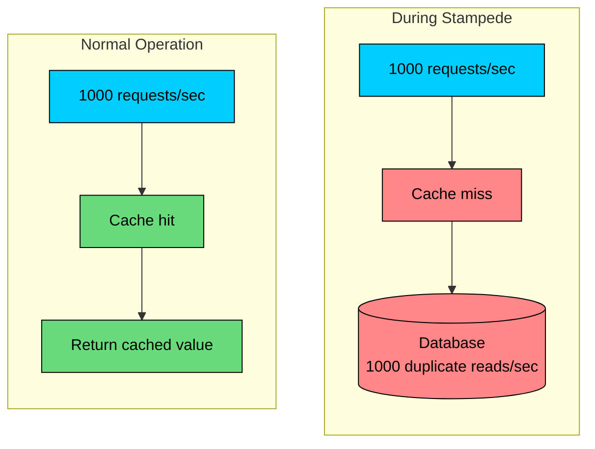
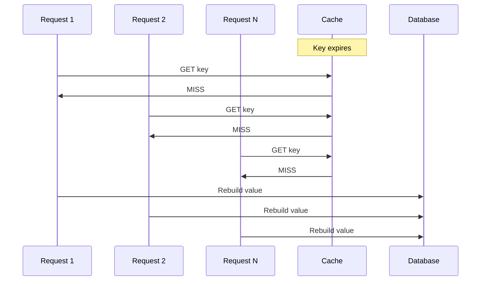
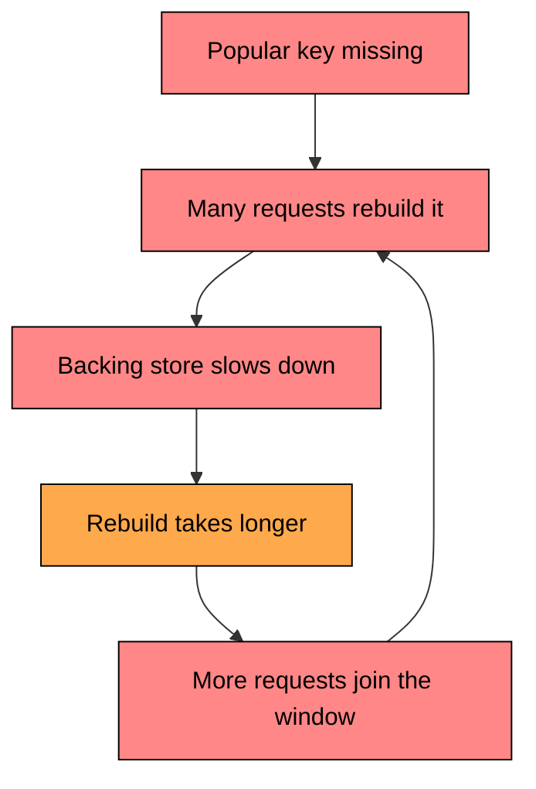
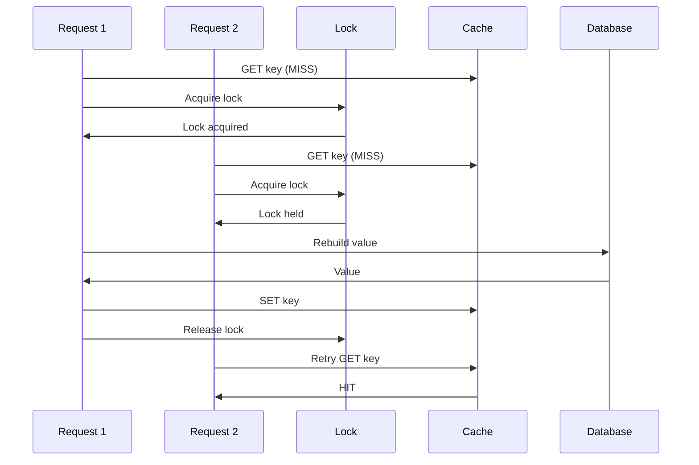
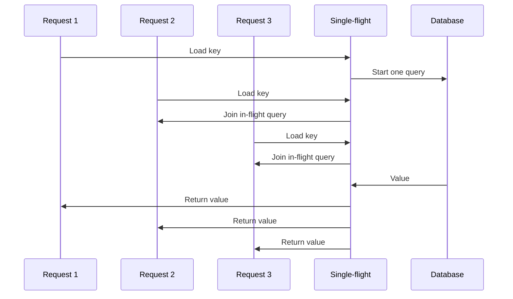
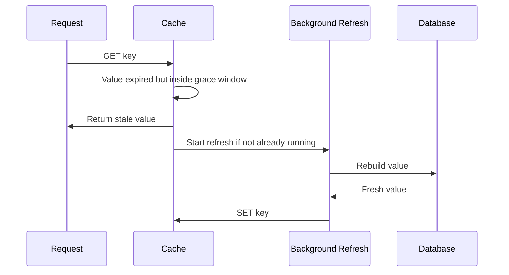
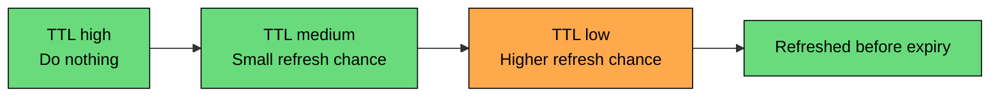
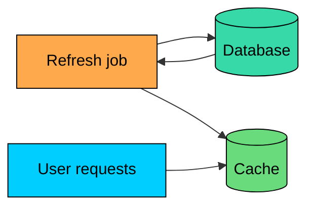

A cache protects a database by absorbing repeated reads.

But when a popular cached value disappears, many requests can miss at the same time. If every request tries to rebuild the value independently, the database receives a burst of duplicate work.

That is a **cache stampede**, also called the **thundering herd** problem.

What makes this dangerous is the volume of concurrent misses landing on the same key, all racing to rebuild it.

In this chapter, we will cover what a cache stampede is, why stampedes happen, how they affect a system, the main prevention strategies, how to monitor and detect them, and the production practices that reduce the risk.

---

# What is a Cache Stampede"

A cache stampede happens when many concurrent requests observe a cache miss for the same key and all try to regenerate the cached value.

In normal operation, one popular key may serve thousands of requests per second from memory. During a stampede, those requests can turn into thousands of identical database queries, API calls, or expensive computations.

The same pattern can happen with any backing dependency, whether that is a relational database query, a search request, a downstream API call, a file read from object storage, or a CPU-heavy computation. The cache miss opens a rebuild window. Every request that arrives during that window may try to do the same work.

---

# Why Stampedes Happen

Stampedes occur when a hot key becomes unavailable and the system does not control who rebuilds it.

#### TTL Expiration

The most common trigger is TTL expiration.

A popular key expires at `T=0`. Requests arrive at `T=1ms`, `T=2ms`, and `T=3ms`. All of them see a miss before any one request has repopulated the cache.

#### Explicit Invalidation

Delete-on-write invalidation creates the same window.

After a write, the cache entry is removed. Until one request reloads it, all concurrent readers for that key miss.

#### Cold Cache

A deployment, restart, resharding event, or cache flush can leave many keys missing at once.

Cold cache behavior is broader than a single-key stampede, but the mechanics are similar: many requests fall through to the backing store before the cache has recovered.

#### Hot Key Failure

Sometimes the key itself has not expired. The cache node holding that key may be slow, overloaded, or unavailable.

If clients treat the cache failure as a miss and go directly to the database, a hot key can still stampede the backing store.

#### Synchronized Expiration

If many keys are written with the same TTL at the same time, they may expire together. That creates a wider miss spike.

TTL jitter helps by spreading expirations over time.

---

# Why Stampedes Hurt

The system receives the same user traffic, but the backing store sees much more work.

| Metric | Normal | During Stampede |
|--------|--------|-----------------|
| Requests/sec | 10,000 | 10,000 |
| Cache hit rate | 95% | 0% for affected key |
| Backing-store reads/sec | 500 | 10,000 |
| Query latency | 10ms | 500ms+ under load |
| Application latency | Low and stable | High and variable |

Once the backing store slows down, the problem can feed on itself:

The usual symptoms are database QPS spikes without a matching traffic increase, connection pools filling up, request latency rising sharply, clients retrying and adding more traffic, and cache repopulation becoming slow or failing entirely.

The fix is to control rebuild work.

---

# Prevention Strategies

Stampede prevention falls into a few broad categories: serializing rebuilds so only one worker does the expensive work, sharing one in-flight rebuild across many callers, avoiding hard expiration for hot keys, and moving refresh work out of the user request path. The strategies below combine these ideas in different ways, and most production systems use more than one at a time.

#### Strategy 1: Per-Key Locking

On a cache miss, the first request acquires a lock for that key. It rebuilds the value while other requests wait, retry, or serve a fallback.

### Pros

### Cons

A few details matter. Use a short lock TTL so locks eventually expire, recheck the cache after acquiring the lock, add a timeout for waiting callers, lock per key rather than using one global lock, and be careful about deleting a lock you no longer own.

#### Strategy 2: Request Coalescing

Request coalescing, also called single-flight, lets multiple callers share one in-flight rebuild.

The first request starts the database read. Later requests for the same key wait on the same future or promise instead of starting new database reads.

### Pros

### Cons

Use coalescing inside a service even if you also use distributed locks. It is cheap protection against local duplicate work.

#### Strategy 3: Stale-While-Revalidate

Stale-while-revalidate keeps serving an expired value for a short grace period while one background refresh updates the cache.

This pattern uses two freshness windows:

- **Fresh TTL:** Serve normally
- **Stale TTL:** Serve stale data while refreshing in the background

If the stale window expires too, the request must either rebuild synchronously or fail gracefully.

### Pros

### Cons

Use this for data where brief staleness is acceptable: product details, profiles, feeds, search suggestions, recommendations, and rendered page fragments.

#### Strategy 4: Early Refresh

Instead of waiting until a key expires, refresh it before expiration.

There are two common versions:

- **Scheduled refresh:** A background job refreshes known hot keys
- **Probabilistic refresh:** Requests occasionally trigger refresh as the key approaches expiration

Probabilistic refresh spreads rebuilds over time. Instead of every caller discovering expiration at the same instant, a small number of callers refresh early.

### Pros

### Cons

#### Strategy 5: TTL Jitter

TTL jitter adds a small random offset to expiration times so many keys do not expire at the same moment.

Jitter does not solve a single hot-key stampede. It helps prevent many keys from expiring together.

### Pros

### Cons

#### Strategy 6: Background Refresh for Known Hot Keys

For predictable hot keys, refresh the cache from a scheduled job instead of waiting for users to trigger rebuilds.

This is useful for homepage data, trending lists, popular products, feature configuration, and other keys you can identify ahead of time.

### Pros

### Cons

#### Strategy Comparison

| Strategy | Main Idea | Best For | Main Trade-off |
|----------|-----------|----------|----------------|
| Per-key locking | One worker rebuilds a key | Cross-process protection | Waiters and lock complexity |
| Request coalescing | Share one in-flight rebuild | High concurrency inside a service | Usually process-local |
| Stale-while-revalidate | Serve stale while refreshing | Latency-sensitive reads | Brief staleness |
| Early refresh | Refresh before hard expiry | Hot keys with TTLs | Extra refresh work |
| TTL jitter | Spread expirations | Many keys expiring together | Does not fix one hot key |
| Background refresh | Refresh known keys on schedule | Predictable hot keys | Requires key selection |

---

# Production Practices

#### Recheck the Cache After Lock Acquisition

If a request waits for a lock, another request may have already rebuilt the value.

Always check the cache again after acquiring the lock. This avoids unnecessary database reads.

#### Put Timeouts on Everything

Waiting forever is worse than a cache miss. Put timeouts on lock acquisition, on waiting for in-flight rebuilds, on database reads, and on background refresh tasks.

If a value is non-critical, serve stale data or a degraded response instead of tying up request threads.

#### Use Negative Caching Carefully

Stampedes can happen for missing data too.

For example, many requests ask for `product:999`, which does not exist. If the system does not cache the "not found" result, every request hits the database.

Cache negative results with a short TTL:

Keep the TTL short so newly created data does not stay hidden for long.

#### Protect the Backing Store

Stampede prevention should reduce load, but the backing store still needs protection. Use database query timeouts, connection pool limits, per-key rebuild rate limits, circuit breakers for overloaded dependencies, and graceful fallback for non-critical data.

#### Treat Hot Keys Separately

Most keys do not need special handling. A few keys cause most of the risk.

Track hot keys and give them stronger protection: stale-while-revalidate, background refresh, local caching, or replication.

---

# Monitoring and Detection

Stampedes often show up as a mismatch: user traffic is stable, but backing-store load jumps.

#### Key Metrics

| Metric | What to Watch |
|--------|---------------|
| Cache hit rate by key pattern | Sudden drops for hot keys |
| Cache misses per key | Many concurrent misses for one key |
| Backing-store QPS | Spikes without traffic growth |
| Backing-store latency | Rising latency during rebuilds |
| Rebuild duration | Long rebuilds widen the stampede window |
| Lock wait time | Shows contention around hot keys |
| In-flight rebuild count | Shows whether coalescing is working |

#### Useful Alerts

Worth paging on: the cache miss rate for a hot key crossing a threshold, backing-store QPS rising well above normal, rebuild latency exceeding the request timeout budget, lock wait time or lock timeout rate climbing, and a background refresh job failing or falling behind.

Global cache hit rate is not enough. A system can have a 95% hit rate and still stampede on one key that receives heavy traffic.

---

# Summary

A cache stampede happens when many requests miss the same key at the same time and all try to rebuild it.

The core problem is duplicate rebuild work. The main defenses are:

- **Per-key locking:** Let one worker rebuild while others wait or fall back
- **Request coalescing:** Share one in-flight rebuild across callers
- **Stale-while-revalidate:** Serve stale data while refreshing in the background
- **Early refresh:** Refresh hot keys before hard expiration
- **TTL jitter:** Avoid synchronized expiration across many keys
- **Background refresh:** Keep known hot keys warm outside the request path

In production, combine strategies. Use coalescing or locking for correctness under concurrency, stale-while-revalidate for latency-sensitive reads, jitter for broad expiry spikes, and monitoring that can identify hot-key misses before they overload the database.

---

# Quiz
