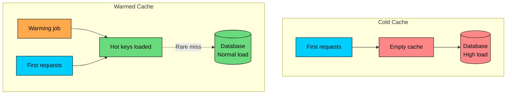
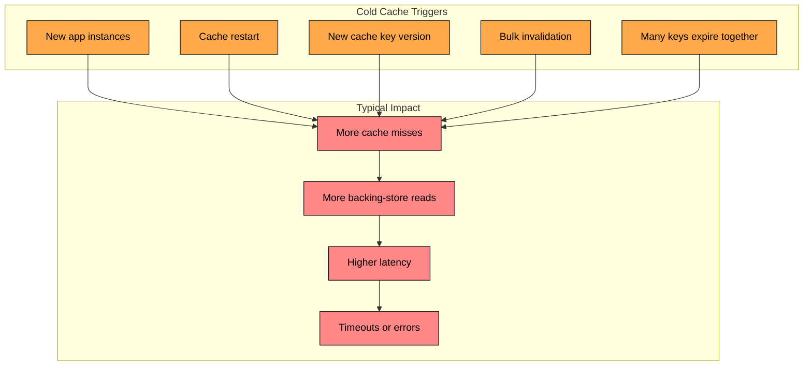
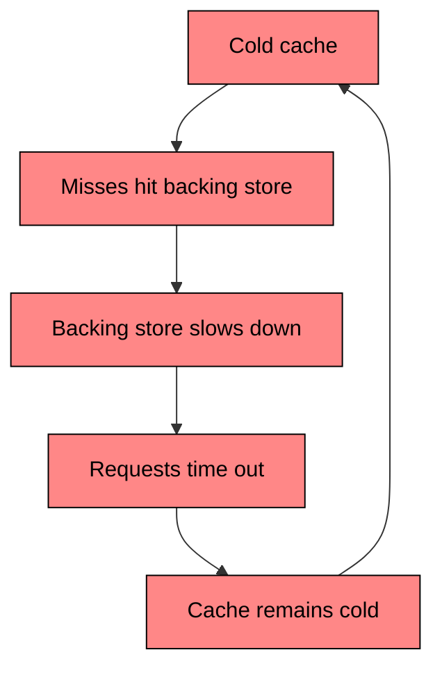
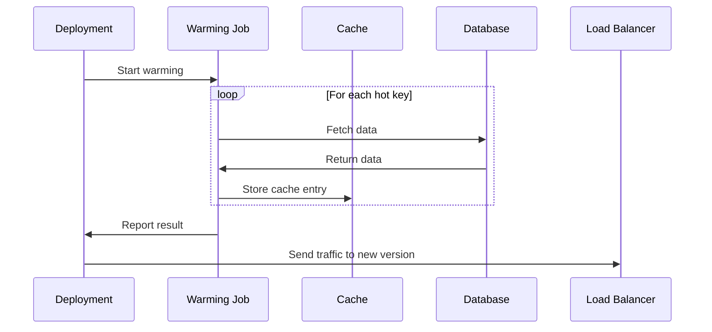
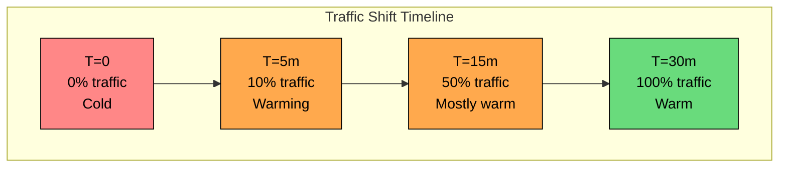
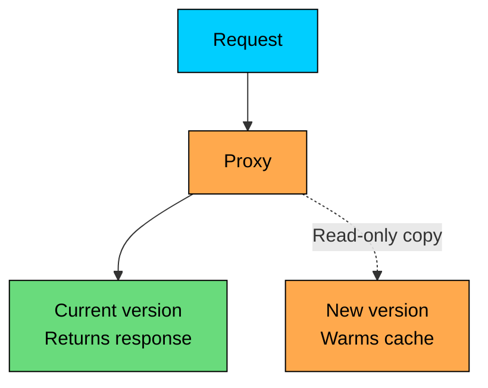
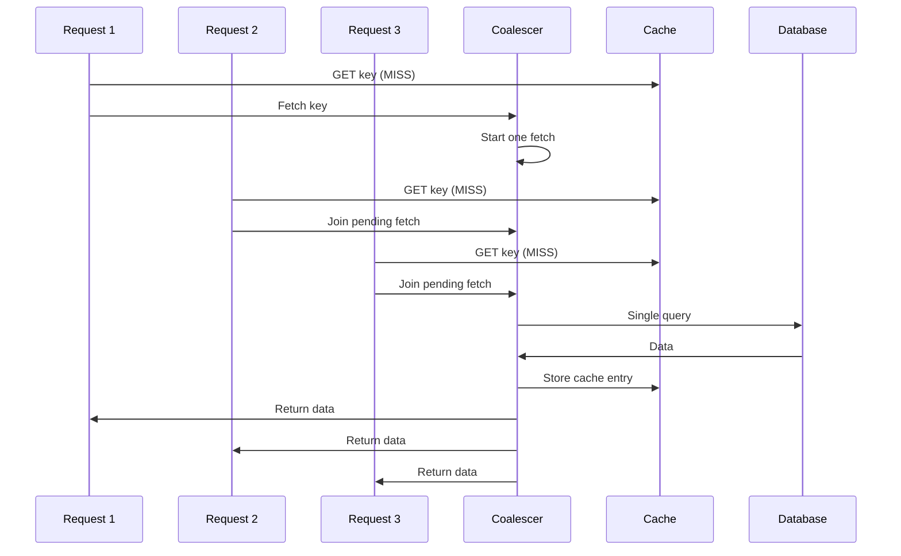

Caching works well when the data your users need is already close to the application.

The difficult moment is the first few minutes after a deploy, cache restart, large scale-out event, or bulk invalidation. The application is healthy, but the cache does not yet contain the data needed for normal traffic. Requests that usually return from memory now fall through to the database or another backing service.

That is the **cold cache problem**.

**Cache warming** reduces this risk by loading important data into the cache before the full production workload depends on it.

In this chapter, we will cover what cache warming means, why cold caches cause incidents, when cache warming is worth the extra work, the common warming strategies, how to choose what to warm, and the production practices that keep warming safe.

---

# What is Cache Warming"

Cache warming is the process of pre-populating a cache with data that is likely to be requested soon.

Without warming, the first request for each key pays the full cost of a cache miss. With warming, those keys are loaded ahead of time, so real users are more likely to see a cache hit.

Warming does not mean loading the entire database into memory. That is usually wasteful and sometimes dangerous. Good cache warming focuses on the small set of data that protects the most important or highest-volume paths: homepage modules and navigation data, product catalog entries for popular items, feature flags and application configuration, permission metadata for high-traffic services, frequently requested API responses, and search suggestions or trending content.

---

# The Cold Cache Problem

A cache is cold when it cannot serve the requests it normally absorbs.

This can happen even if the cache system itself is working correctly. Often the cache is up, but empty, partially empty, or empty for a specific application version.

#### Common Causes

**New application instances:** Process-local caches start empty. This is common with in-memory L1 caches inside application servers. A shared Redis or Memcached cluster may still be warm, but each new process has to rebuild its local cache.

**Cache restart or replacement:** Memcached loses data on restart. Redis may keep data if persistence is configured, but failovers, resharding, memory pressure, or operational mistakes can still leave parts of the cache cold.

**New cache key version:** Deployments often change cache key prefixes or serialized value formats. The old keys still exist, but the new application version cannot use them.

**Bulk invalidation:** A migration, configuration change, or manual flush can remove a large portion of cached data at once.

**Synchronized TTL expiry:** If many keys are written with the same TTL at the same time, they may expire together. This creates a sudden wave of misses.

#### Why It Hurts

Assume a service handles 10,000 requests per second with a 95% cache hit rate.

| Metric | Warm Cache | Cold Cache |
|--------|------------|------------|
| Requests/sec | 10,000 | 10,000 |
| Cache hit rate | 95% | 0% |
| Backing-store reads/sec | 500 | 10,000 |
| Average response time | 10ms | 500ms+ |
| Database CPU | 30% | 100% |

The application receives the same traffic, but the database sees 20 times more reads. Once the database slows down, application threads and connection pools stay busy longer. Retries can add even more load. At that point, the cache may not repopulate quickly because the requests doing the repopulation are timing out.

Cache warming is one way to break this cycle before live traffic triggers it.

---

# When You Need Cache Warming

Cache warming is useful, but it is not free. It adds deployment steps, operational code, and another path that can fail. Use it when a cold cache is likely to hurt users or overload a dependency.

#### Good Candidates

- **High-traffic services:** If the database cannot safely absorb a large temporary miss rate, warming is worth considering.
- **Low headroom dependencies:** A database already running at 50% to 70% utilization may not survive a sudden 10x or 20x read increase.
- **Critical user paths:** Login, checkout, pricing, feed loading, search, and homepage rendering often need predictable latency.
- **Predictable hot data:** Warming works best when you know the popular keys in advance.
- **Versioned cache keys:** If a deploy creates a new key namespace, the new namespace starts cold even when the old namespace is warm.
- **Process-local caches:** New instances can be marked ready only after loading the small local cache they need to serve traffic.

#### Poor Candidates

- **Low-traffic systems:** If the database can comfortably handle all reads, warming may add complexity without much benefit.
- **Highly personalized data:** If every user requests different data, warming a global key list will not help much.
- **Fast-changing data:** Data that changes every few seconds may be stale by the time warming finishes.
- **Very large working sets:** Trying to warm too much data can evict useful entries, waste memory, or overload the backing store.
- **Best-effort features:** Recommendations, analytics widgets, and non-critical side panels can often tolerate lazy loading.

Eliminating every cache miss is not realistic. The aim is to prevent dangerous miss storms on the paths that matter.

---

# Warming Strategies

There is no single best warming strategy. The right approach depends on the cache type, deployment model, data freshness requirements, and how predictable your hot keys are.

#### Strategy 1: Pre-Deployment Warming

Pre-deployment warming loads known hot keys before the new version receives full traffic.

#### How It Works

1. Deploy the new version with little or no traffic
2. Build or fetch the list of hot keys
3. Load each key through the same code path used by real reads when possible
4. Verify that the expected keys are present
5. Shift traffic only after the critical keys are warm

This is a strong fit for versioned cache keys, product catalogs, configuration, and other predictable data.

### Pros

### Cons

#### Strategy 2: Instance Readiness Warming

For process-local caches, warm each instance before marking it ready for traffic.

This is common for services that keep small in-process caches for configuration, routing tables, authorization rules, or frequently used reference data.

Keep this warmup small. If readiness waits on a huge cache, deployments and auto-scaling become slow and brittle.

### Pros

### Cons

#### Strategy 3: Gradual Traffic Shift

Instead of sending all traffic to cold instances at once, gradually increase their traffic share while watching cache and database metrics.

#### How It Works

1. Start with a small traffic percentage
2. Watch cache hit rate, database QPS, latency, errors, and saturation
3. Increase traffic in steps
4. Pause or roll back if the backing store starts to struggle

This is often the most practical option when the cache is warmed naturally by real traffic.

### Pros

### Cons

#### Strategy 4: Shadow Traffic Warming

Shadow traffic sends a copy of production read requests to the new version. The new version processes the request and warms its cache, but the user receives the response from the current production path.

Shadow warming is useful because it follows real access patterns. It catches hot keys that a static warming list might miss.

Be careful with side effects. Shadowed requests should not send emails, charge cards, mutate state, enqueue jobs, or update user-visible counters. In practice, teams usually shadow only safe read paths or run the shadow path in a mode that disables writes.

### Pros

### Cons

#### Strategy 5: Lazy Warming with Request Coalescing

Sometimes you cannot know what to warm in advance. In that case, allow misses, but prevent many concurrent requests from rebuilding the same key.

This technique is also called request collapsing or single-flight. It does not remove the first miss, but it prevents hundreds of identical misses from becoming hundreds of identical database queries.

### Pros

### Cons

#### Strategy Comparison

| Strategy | User Impact | Complexity | Best For |
|----------|-------------|------------|----------|
| Pre-deployment warming | Very low | Medium | Known hot keys and versioned cache keys |
| Instance readiness warming | Low | Low to medium | Small process-local caches |
| Gradual traffic shift | Low to medium | Low | Rolling deploys and scale-outs |
| Shadow traffic warming | Very low | High | Real traffic patterns and safe read paths |
| Lazy warming with coalescing | Medium | Medium | Unpredictable keys and stampede prevention |

---

# Identifying What to Warm

Cache warming is only as good as the key list. Warming the wrong data wastes memory, adds load, and may evict useful entries.

#### Sources for Hot Keys

**Cache access logs:** The best source is usually the cache itself: recent gets, misses, hit counts, and key-level latency.

**Application analytics:** Route-level and entity-level analytics can identify popular products, organizations, tenants, regions, pages, or API responses.

**Request logs:** Logs can be sampled and aggregated to find frequently requested IDs or query patterns.

**Business rules:** Some data is important even if it is not currently the hottest: global configuration, feature flags, pricing rules, active campaigns, and launch-day content.

**Database queries:** For predictable domains, query the database directly. For example, fetch active products, top sellers, recently updated listings, or the current leaderboard.

#### Prioritizing Keys

Warm the keys that reduce the most risk first.

| Priority | Criteria | Examples |
|----------|----------|----------|
| Critical | Required for core traffic or revenue | Feature flags, pricing rules, checkout configuration |
| High | Very high read volume | Homepage modules, popular products, category pages |
| Medium | Common but not critical | User profile summaries, organization metadata |
| Low | Nice to have | Recommendations, analytics widgets, secondary panels |

If warming critical keys succeeds and low-priority keys fail, the deployment may still be safe. If critical keys fail, pause the rollout.

---

# Production Practices

Cache warming should protect the system, not become another source of load spikes.

#### Rate Limit the Warming Job

Warmers read from the same backing stores your users need. Use bounded concurrency, request budgets, and backoff.

A safe warming job starts small, watches database saturation, and increases parallelism only while the system has headroom.

#### Use the Real Read Path When Possible

If the application normally builds a cache value by joining several tables, applying permissions, filtering fields, and serializing a response, the warmer should use the same logic.

Bypassing the application may be faster, but it can produce cache entries that do not match real responses.

#### Add TTL Jitter

Do not write thousands of keys with the exact same expiration time. Add a small random offset to TTLs so keys expire over a window.

TTL jitter prevents a successful warming job from accidentally creating a synchronized expiry event one hour later.

#### Make Warmers Idempotent

Warmers should be safe to retry. Writing the same cache key twice should not corrupt state or create duplicate side effects.

This is especially important when warming is part of deployment automation, where failures and retries are normal.

#### Keep the Scope Small

Warming everything is rarely the right answer. Large warming jobs can delay deployments, evict better entries, increase database load, fill cache memory with data nobody requests, and hide inefficient queries until a deploy is already in progress. Start with the smallest set that protects the most important paths.

#### Decide What Happens on Failure

Not every warming failure should block a deployment. A reasonable policy is to require critical keys to warm successfully, give high-priority keys a small failure budget, never let low-priority keys block the rollout, and let database saturation pause or stop warming entirely. This keeps automation predictable during stressful deployments.

#### Monitor the Warmup

Track both the warming job and the systems it touches.

| Metric | Why It Matters |
|--------|----------------|
| Keys warmed / keys planned | Shows progress and coverage |
| Warming failures | Finds bad keys, bad queries, or serialization errors |
| Warming duration | Detects slow jobs that delay deploys |
| Cache hit rate by route | Confirms user paths are warmer |
| Backing-store QPS | Ensures warming is not overloading the database |
| Backing-store latency | Shows whether warming is competing with users |

Worth paging on: a critical warming job failing, the cache hit rate being lower than expected after a rollout, database QPS or latency rising during warmup, and warming duration exceeding the deployment budget.

---

# Summary

Cache warming means loading important cache entries before live traffic fully depends on them.

It is most useful when a cold cache could overload a database, slow down a critical path, or make a deployment risky. It is less useful when traffic is low, access patterns are unpredictable, or the data changes too quickly.

The main strategies are:

- **Pre-deployment warming:** Load known hot keys before shifting traffic
- **Instance readiness warming:** Prepare small process-local caches before an instance becomes healthy
- **Gradual traffic shift:** Let real traffic warm caches slowly while limiting blast radius
- **Shadow traffic warming:** Mirror safe read traffic to warm a new version
- **Lazy warming with coalescing:** Allow misses but collapse duplicate work

In production, the details matter: choose a small and useful key set, throttle the warmer, add TTL jitter, use the real read path when possible, make retries safe, and monitor the database while warming runs.

Warming exists to keep a routine deploy, restart, or scale-out from turning into a database incident.

---

# Quiz
