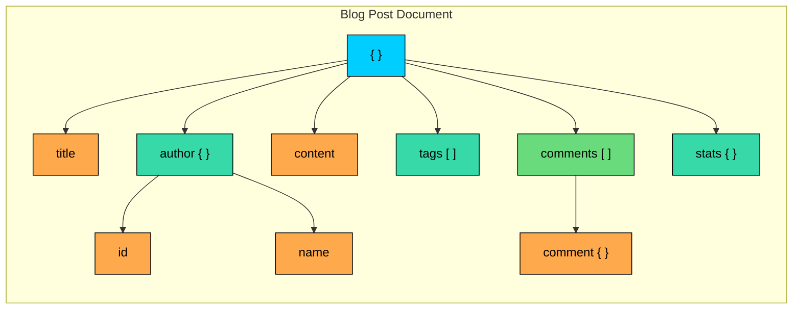
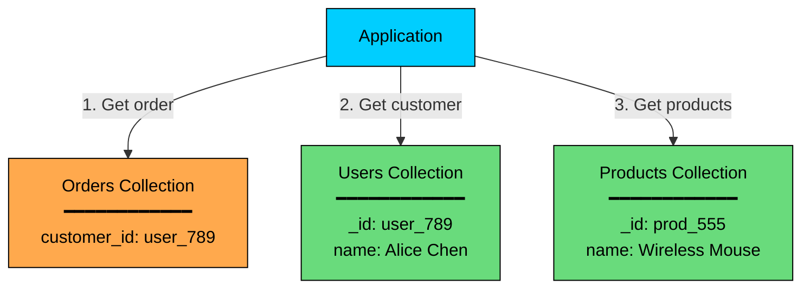
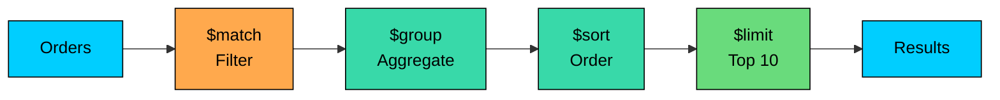
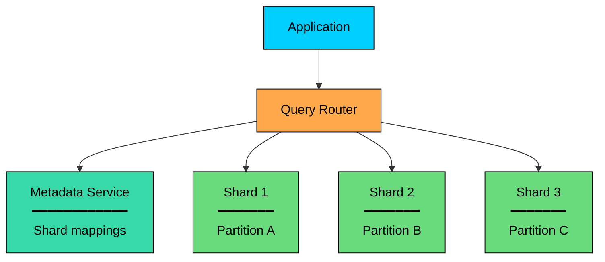
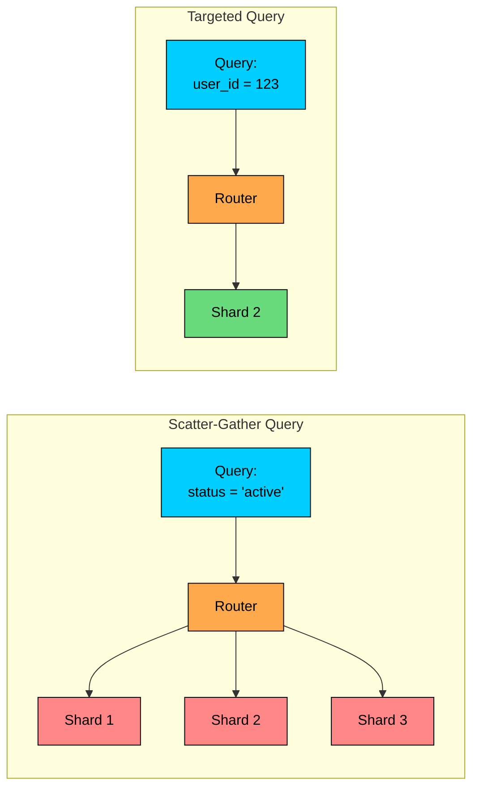

Document databases store records as JSON-like documents instead of rows spread across many tables.

They are useful when the data naturally forms an aggregate: a product with specifications, a user profile with preferences, an article with metadata, or an application setting with nested options. The document can hold the shape the application usually reads and writes.

The core idea is to model data around access patterns. If the application usually needs one complete object, storing that object as one document can be efficient and easy to work with.

Document databases are not "relational databases without schemas." They have a different set of strengths and failure modes. With good modeling, they make aggregate-oriented data simple to store and query. With careless modeling, they produce duplicated data, inconsistent records, and documents that grow without limit.

---

# The Document Model

A document is a structured record, usually represented as JSON or a binary format such as BSON. It can contain scalar values, nested objects, arrays, and optional fields.

### Document Structure

Here is a document representing a blog post:

Nested objects like `author` and `stats` group related fields, while arrays such as `tags` and `comments` store repeated values.

Other posts might have optional fields such as `featured_image`, `series_id`, or no comments at all. The comment also embeds snapshot data by storing `user_name`, so rendering the post does not require another read.

### Collections

Documents are grouped into collections. A collection is similar to a table, but it usually does not require every document to have the exact same fields.

The terminology maps fairly directly across models. A database is still a database. A table becomes a collection, a row becomes a document, and a column becomes a field.

A join table is replaced by an embedded array or a referenced collection. The schema is a flexible structure, often with optional validation.

In production, "schemaless" should not mean "anything goes." Documents in the same collection usually share a common shape because the application needs predictable data. The flexibility is for controlled evolution and natural variation, not for avoiding data design.

### Document IDs

Every document needs a unique identifier. MongoDB uses `_id`; other databases have similar concepts.

Common ID choices include database-generated IDs, which are convenient and often optimized for the database, UUIDs or time-ordered IDs, which are useful when services generate IDs before writing, and application IDs, which are useful when the domain has an external identifier such as an order number.

The ID choice affects indexes, URL design, data imports, replication, and shard distribution. Random IDs spread writes well but may reduce index locality. Time-ordered IDs improve locality but can create write hotspots if used carelessly as shard keys.

---

# Embedding vs Referencing

The most important modeling decision in a document database is whether related data should be embedded inside the same document or referenced by ID.

Relational design often starts by normalizing data. Document design starts by asking: "What does the application read and write together""

### Embedding

Embedding stores related data inside the parent document:

This is often a good model for orders. An order should preserve the customer and product details as they were at purchase time. If the customer changes their email later, the old order history should usually not change.

### Advantages of embedding

- **Single read:** The application can fetch the whole aggregate in one operation.
- **Atomic document updates:** Changes within one document are atomic in most document databases.
- **Data locality:** Related fields are stored together.
- **Simple rendering:** The application does not need to assemble many records for common reads.

### Disadvantages of embedding

- **Duplication:** Repeated data appears in many documents.
- **Update work:** If duplicated data must change everywhere, the application needs a propagation strategy.
- **Document growth:** Large or unbounded arrays can make documents slow or hit size limits.
- **Contention:** A heavily updated document can become a bottleneck.

### Referencing

Referencing stores IDs to other documents:

To display the full order, the application typically fetches the order, customer, and products, or uses a database feature that performs a lookup.

### Advantages of referencing

- **Less duplication:** Shared records live in one place.
- **Smaller documents:** Parent documents stay compact.
- **Independent updates:** Customer or product records can change without rewriting every order.
- **Better for large relationships:** References handle unbounded or many-to-many relationships more safely.

### Disadvantages of referencing

- **More reads:** The application may need multiple queries to assemble a view.
- **Weaker integrity:** The database may not enforce foreign-key-like relationships.
- **More consistency work:** Deletes, updates, and backfills need careful handling.
- **Less locality:** Related data may live on different partitions or shards.

### When to Embed vs Reference

| Factor | Favor Embedding | Favor Referencing |
|--------|-----------------|-------------------|
| Access pattern | Read together most of the time | Read independently |
| Relationship size | One-to-one or one-to-few | One-to-many or many-to-many |
| Growth | Bounded | Unbounded |
| Update frequency | Rarely changes, or changes with parent | Changes independently |
| Consistency need | Snapshot is acceptable | One authoritative copy is needed |
| Contention | Low write contention | Many writers update related data |

### Practical Guidelines

Embed small, bounded data that is read with the parent, and embed snapshots when history should preserve the old value. Reference data that grows without limit, and reference data that is updated often and must be authoritative.

Avoid arrays that can grow forever, such as all comments on a viral post or all events for a user.

---

# Query Capabilities

Document databases provide query APIs for fields, nested fields, arrays, and indexes. The examples below use MongoDB syntax because it is widely recognized, but the same ideas appear in other document databases with different APIs.

### Basic Queries

### Projection

Projection returns only selected fields:

Projection reduces network transfer and parsing cost when documents contain fields the caller does not need.

### Array Queries

Arrays are a natural fit for tags, small lists, and bounded child records:

Array queries are useful, but large arrays are a design smell. If the array can grow without a clear bound, consider a separate collection.

### Aggregation Pipeline

Many document databases support some form of aggregation. MongoDB's aggregation pipeline processes documents through stages:

### Query Limitations

Document databases can be powerful, but they are still best suited to document-oriented access.

Single-document reads and writes are usually the best case. Queries by an indexed field work well when indexes match the access pattern. Join-like lookups are possible in some systems, but they are not the main design target.

Multi-document transactions are supported in some systems, with coordination overhead. Ad hoc analytics are often better served by a relational, columnar, or analytical store, and relationship traversal is usually better in a graph database.

If most screens require assembling data from many collections, the model is probably a poor fit for the workload.

---

# Indexing

Indexes make queries fast by keeping a searchable structure beside the documents. Without the right index, a query may scan an entire collection.

### Index Types

| Index Type | Use Case | Example |
|------------|----------|---------|
| **Single field** | Query by one field | `email` |
| **Compound** | Query or sort by multiple fields | `{customer_id, created_at}` |
| **Multikey** | Query values inside arrays | `tags` |
| **Text** | Basic text search | `title`, `content` |
| **Geospatial** | Location queries | nearby stores |
| **TTL** | Expire old documents | sessions or temporary tokens |
| **Hashed** | Even distribution for sharding | hashed user ID |

### Creating Indexes

### Index Trade-offs

Indexes speed reads but slow writes, because each insert, update, or delete may need to update multiple indexes. They also consume memory and storage, and large indexes can become a major part of the working set.

Compound index order matters, since the index should match filtering and sorting patterns. Array indexes can grow quickly, because indexing large arrays can produce many index entries per document.

Indexes do not fix a poor model. If the access pattern requires assembling many scattered records, another model may be better.

---

# Schema Validation

Document databases are often described as schemaless, but production systems still need contracts.

Modern document databases usually support some form of schema validation. Applications also commonly validate documents at the service layer. The goal is to keep flexibility where it helps and enforce rules where bad data would be expensive to repair.

The settings control how strictly validation is applied. `validationLevel: "strict"` validates inserts and updates, while `validationLevel: "moderate"` validates only documents that already match the rules. For the action, `validationAction: "error"` rejects invalid documents, and `validationAction: "warn"` allows invalid documents but logs a warning.

Schema validation is not a replacement for modeling. It is a guardrail. You still need clear ownership of document shape, migrations for old documents, and compatibility between old and new application versions.

---

# Transactions and Consistency

Most document databases provide atomic updates to a single document. This is one reason embedding related data is useful: the aggregate can be updated safely in one operation.

Multi-document transactions are supported in several modern document databases, but they are not free. They add coordination, error handling, lock or conflict behavior, and performance overhead.

A single-document update is the best fit, since it is simple and usually atomic. A transaction across a few documents is useful when correctness requires it.

A large distributed transaction is usually a sign to revisit the model, and a cross-service workflow is often better handled with events, sagas, or explicit state machines.

The design goal is to model common writes so they usually touch one document, and reserve multi-document transactions for cases where they are needed.

Consistency also depends on read preference, write concern, replication mode, and database-specific guarantees. Always check the behavior of the system you are actually using.

---

# Scaling Document Databases

Many document databases support horizontal scaling through partitioning or sharding. Sharding distributes documents across nodes based on a shard key.

The concepts below use MongoDB terminology, but the design principles apply broadly.

### Sharding Architecture

### Shard Key Selection

The shard key determines where documents live. A poor shard key can create hot partitions or force every query to touch every shard.

| Shard Key Property | Good | Risky |
|-------------------|------|-------|
| Cardinality | Many distinct values | Few values, such as `status` |
| Distribution | Even load | One tenant or value dominates |
| Write pattern | Spreads writes | All new writes hit one shard |
| Query pattern | Included in common queries | Rarely used in filters |
| Locality | Keeps related data together | Splits common reads across shards |

Good shard keys depend on the workload. A `tenant_id` can work for multi-tenant systems if tenant sizes are balanced, a hashed user ID can spread writes evenly, and a compound key can preserve useful locality while improving distribution.

Bad shard keys are usually low-cardinality, monotonically increasing, or unrelated to common queries.

### Targeted vs Scatter-Gather Queries

When a query includes the shard key, the router can send it to the relevant shard. When it does not, the router may need to query every shard and merge the results.

Scatter-gather queries may be acceptable for rare admin operations. They are usually a poor fit for high-traffic request paths.

---

# Common Document Databases

Document databases differ significantly in query model, consistency, hosting, and operational behavior.

### MongoDB

MongoDB is a widely used general-purpose document database. It supports rich querying, secondary indexes, aggregation pipelines, schema validation, replica sets, sharding, change streams, and multi-document transactions.

It is a common choice for flexible application data, catalogs, content systems, user profiles, and event-like records.

### Firestore

Firestore is a serverless document database commonly used for mobile and web applications. It provides real-time listeners, offline support in client SDKs, automatic scaling, and a query model built around collections and documents.

Its query model is more limited than MongoDB's. There are no joins, compound queries usually require explicit composite indexes, and Firestore does not support an aggregation pipeline. Plan reads carefully when many predicates need to combine.

It is a good fit for client-facing apps that benefit from real-time sync and managed operations.

### CouchDB

CouchDB is built around JSON documents, HTTP APIs, and replication. It fits offline-first and occasionally connected use cases, where replicas may diverge and later sync.

It is a good fit when replication and conflict handling are central requirements.

### Amazon DocumentDB

Amazon DocumentDB is an AWS-managed document database with MongoDB API compatibility. It can be useful for teams that want a managed AWS service and can live within its compatibility and feature boundaries.

It is important to check compatibility carefully instead of assuming it behaves exactly like MongoDB.

---

# When to Choose Document Databases

Choose a document database when data is aggregate-oriented and the application usually reads and writes one complete object. They also fit when data is nested or variable, with optional fields, nested structures, or type-specific attributes.

Schema evolution matters when you need controlled flexibility while the product changes, and denormalized reads are valuable because duplicating snapshot data makes common reads simpler and faster. Horizontal partitioning fits the access pattern when queries can usually include the partition or shard key.

### When to Consider Alternatives

Consider another database type when strict relational integrity is central and foreign keys, joins, and constraints are core to the workload. A relational or graph database may model the problem better when many-to-many relationships dominate.

Documents that grow without bound create operational problems through large arrays and ever-growing records. Frequent ad hoc analytics are usually better served by analytical stores built for broad scans and reports, and a key-value store may be simpler when the data is mainly exact-key lookup.

Document databases work best when the document boundary is clear. If the meaning of a single document and its bounds cannot be explained, the model needs more thought.

---

# Summary

Document databases trade rigid table structure for flexible, aggregate-oriented documents.

The data model is JSON-like documents with nested objects and arrays. The schema is flexible by default, with optional validation. For relationships, embed bounded aggregates and reference shared or unbounded data.

Single-document operations are the natural fit for transactions, while multi-document transactions vary by system. Indexes are required for important field, array, sort, and shard-key queries, and sharding works best when queries include the shard key.

The core design skill is choosing document boundaries. Embed what is small, bounded, and read together. Reference what is shared, independently updated, or unbounded. Add validation and indexes deliberately.

The next chapter covers key-value stores, which use an even simpler model: lookup by key, with almost no structure imposed by the database.

---

# Quiz
