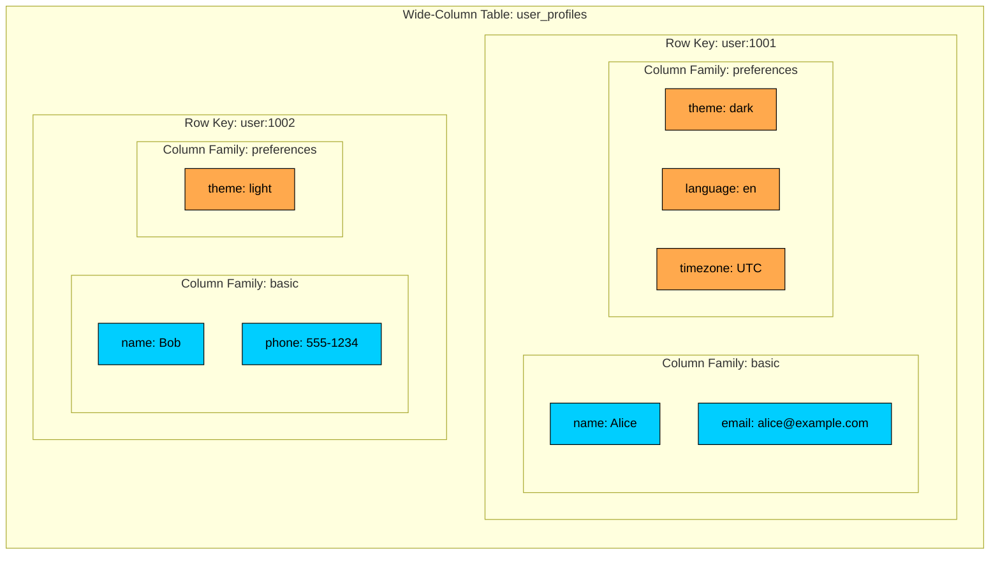
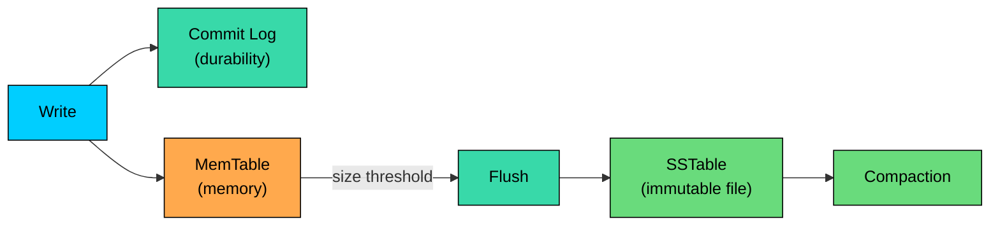
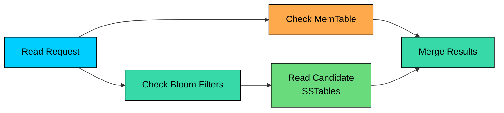
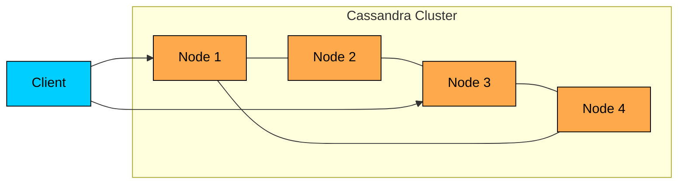
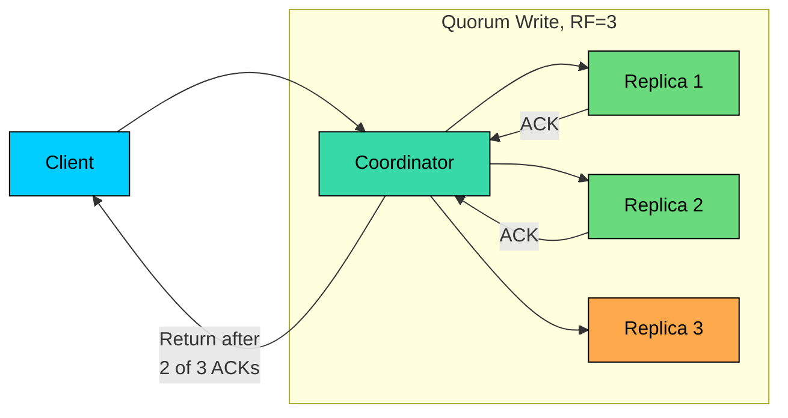
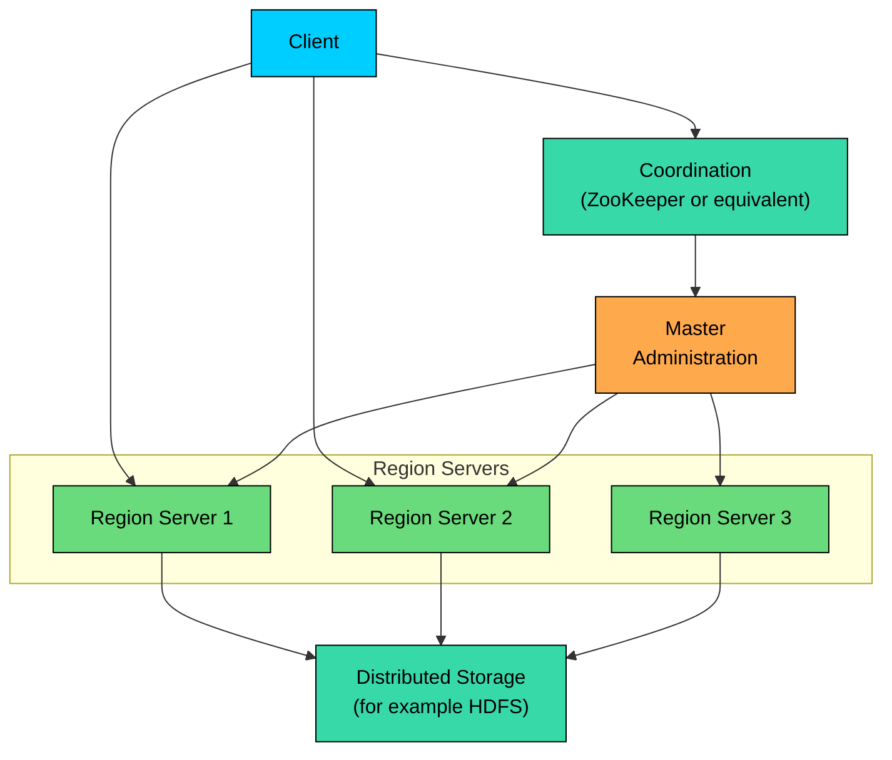
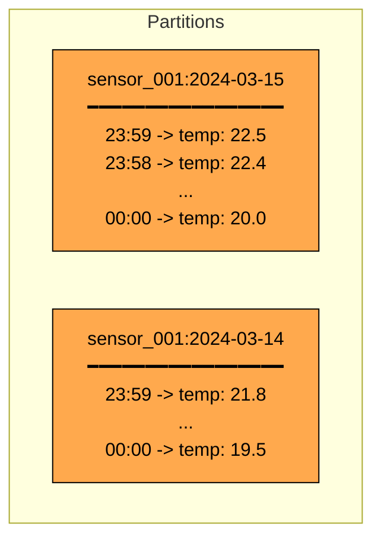
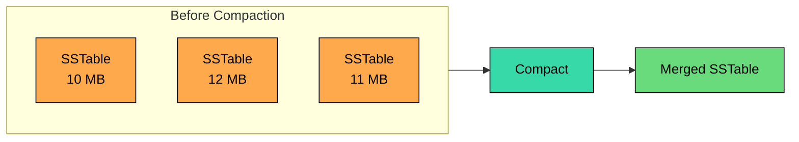
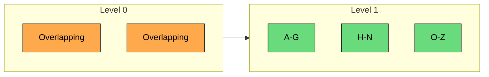
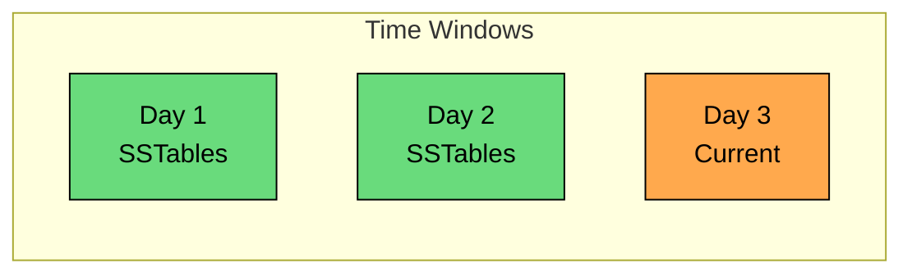

Wide-column databases are built for large, distributed datasets where the access patterns are known in advance.

They are common in systems that store event logs, activity feeds, telemetry, audit records, time-series data, messaging data, and other write-heavy workloads. The usual pattern is simple: write a lot of data, spread it across many machines, and read it back by a carefully chosen key.

The name can be misleading. A wide-column database is a storage model where data is organized by row keys, partitions, and column-oriented groups, not a relational table with many columns.

Different rows may contain different columns, and the physical layout is designed for fast key-based access at scale.

The trade-off: wide-column databases scale very well, but they expect you to design tables around queries. They are poor fits for ad hoc joins, arbitrary filters, and transaction-heavy relational workloads.

---

# The Wide-Column Data Model

> [!PAYWALL] This content is for premium members only.

Wide-column systems were influenced by Google's Bigtable paper. Apache HBase follows the Bigtable model closely. Cassandra combines ideas from Bigtable and Amazon Dynamo, giving it a peer-to-peer architecture and tunable consistency.

The exact model differs by database, but the core ideas are similar. Data is partitioned by a row key or partition key, and related columns are stored together. Rows can be sparse, and queries are designed around keys and sorted ranges rather than arbitrary joins.

### Rows, Columns, and Column Families

In Bigtable/HBase-style systems, a table contains rows. Each row has a row key. Columns are grouped into column families, and each cell can have versions.

Important properties:

- **Sparse rows:** rows do not need the same columns. Missing values are not stored as `NULL`.
- **Column families:** related columns are grouped for physical storage and access.
- **Dynamic qualifiers:** in Bigtable/HBase-style systems, column names inside a family can be created dynamically.
- **Versioned cells:** some systems can store multiple versions of a cell by timestamp.

Cassandra's CQL model looks more like tables with declared columns, but the same design principle applies: the partition key decides data placement, and clustering columns decide sort order within a partition.

### Comparison with Relational Databases

| Aspect | Relational Database | Wide-Column Database |
|--------|---------------------|----------------------|
| Data model | Normalized tables and relationships | Query-specific tables keyed by partition |
| Query style | Flexible SQL with joins | Key-based reads and range scans |
| Schema | Table columns are declared | Depends on system; often sparse or partition-oriented |
| Transactions | Strong multi-row support in one database | Usually limited or partition-scoped |
| Scaling | Read replicas and sharding with care | Designed for horizontal partitioning |
| Best fit | Correctness and query flexibility | High write volume and predictable access |

### Two-Dimensional Key-Value Model

A useful way to think about it is a two-dimensional key-value store. The row key finds the row or partition, and the column name finds a value inside that row.

That model explains the strengths and the limits. If you know the key, access is fast. If you want to ask a new question that does not match the key design, the database may need to scan too much data.

---

# Storage Architecture

Many wide-column databases use log-structured storage based on LSM trees. The goal is to make writes sequential and cheap.

### Write Path

The write path usually works like this:

1. Append the write to a commit log for durability.
2. Apply the write to an in-memory structure, often called a memtable.
3. Flush the memtable to disk as an immutable sorted file, commonly called an SSTable.
4. Compact SSTables in the background to merge updates, remove overwritten values, and reclaim deleted data.

This design turns many random updates into sequential writes, which is how these systems handle heavy ingest well.

### Read Path

Reads are more work because the newest value may be in memory, in one SSTable, or spread across several SSTables.

Common read optimizations include:

- **Bloom filters:** avoid reading SSTables that definitely do not contain the key.
- **Partition indexes:** locate the right area of an SSTable.
- **Block caches:** keep frequently read data in memory.
- **Compaction:** reduce the number of files a read must check.

This creates a trade-off. Writes are fast because data is appended, but reads may need to merge data from multiple places until compaction catches up.

---

# Cassandra

Apache Cassandra is a distributed wide-column database optimized for high availability and high write throughput. It uses a peer-to-peer architecture: every node can accept reads and writes, and data is replicated across nodes.

### Architecture

Key ideas:

- **Partitioning:** a partition key is hashed to decide which nodes own the data.
- **Replication factor:** each partition is stored on multiple replicas.
- **Coordinator node:** any node can coordinate a client request.
- **Tunable consistency:** each operation can choose how many replicas must respond.

### Consistency Levels

Cassandra lets clients trade latency, availability, and freshness per operation. With `ONE`, only one replica must respond. `QUORUM` requires a majority of replicas, while `LOCAL_QUORUM` requires a majority in the local datacenter. `ALL` requires every replica to respond.

A common rule is `R + W > RF`, where `R` is the number of replicas required for reads, `W` is the number of replicas required for writes, and `RF` is the replication factor.

With replication factor 3, quorum reads and quorum writes overlap on at least one replica. This guarantees that a read sees the latest acknowledged write, which is often described as strong consistency in the operational sense.

It is not linearizability though. Cassandra resolves conflicts using last-write-wins on timestamps, so concurrent writes can still lose updates, and the result is closer to read-your-writes than to single-copy serializability.

For true linearizable operations on a single partition, Cassandra offers lightweight transactions (LWT) using `IF` clauses backed by Paxos, at a significant latency cost.

### CQL: Cassandra Query Language

Cassandra uses CQL, which looks like SQL but behaves very differently. Tables are designed for specific queries.

In this table, `(user_id, activity_date)` is the partition key and `activity_time` is the clustering column. Rows for one user on one day are stored together and sorted by time.

Efficient queries include the partition key:

Queries that do not include the partition key are usually a bad fit:

To support that query efficiently, create another table, such as `activity_by_type_and_day`, with a partition key that matches the access pattern.

### What CQL Is Not

| SQL Feature | CQL Reality |
|-------------|-------------|
| Joins | Not supported as a general query feature |
| Arbitrary filters | Must match keys or indexes carefully |
| Cross-table transactions | Not the design target |
| Aggregations | Limited compared with SQL analytics |
| `ORDER BY` | Works within clustering-column rules |
| Foreign keys | Not enforced by the database |

These restrictions are deliberate. Cassandra avoids operations that would require broad coordination across the cluster.

---

# HBase and Bigtable-Style Systems

Apache HBase follows the Bigtable model more closely. It stores data in tables split into regions. Region servers serve reads and writes, while coordination services manage assignment and metadata.

### Architecture

Important pieces:

- **Regions:** contiguous row-key ranges for a table.
- **Region servers:** serve reads and writes for assigned regions.
- **Master:** handles administration and region assignment, but is not usually on the read/write path.
- **Distributed storage:** stores immutable files and write-ahead logs.

### HBase vs Cassandra

| Aspect | HBase / Bigtable Style | Cassandra |
|--------|-------------------------|-----------|
| Architecture | Region servers with coordination | Peer-to-peer cluster |
| Data placement | Ordered row-key ranges | Hash-partitioned by partition key |
| Consistency | Strict consistency per row, single region server per region | Tunable per operation, last-write-wins conflict resolution |
| Storage layer | Separate distributed storage (HDFS or compatible) | Local node storage on each node |
| Access pattern | Range scans by row key | Partition-key reads and clustering ranges |
| Multi-region setup | Possible but more involved | Core design focus for many deployments |

Neither is universally better. HBase-style systems are attractive when ordered range access and Hadoop-style integration matter. Cassandra is attractive when peer-to-peer availability, multi-datacenter replication, and predictable partition-key access matter.

---

# Data Modeling Patterns

Wide-column modeling is query-first. You do not start by normalizing entities. You start by listing the reads the system must serve.

### Query-First Design

For a messaging system, the queries might be:

The same event may be written to multiple tables. This is normal in wide-column systems.

### Time-Series Data

A common time-series pattern is to include a time bucket in the partition key:

This model works because the partition key keeps one sensor's readings for one day together, and the date bucket prevents one partition from growing forever. The clustering column supports efficient time-range scans within the partition, and descending order makes "most recent readings" cheap.

### Denormalization

Denormalization is expected. If two queries need different keys or sort orders, create two tables.

The cost is extra storage and more write paths. The benefit is predictable reads without joins.

### Bucketing

Hot or unbounded partitions are a common modeling mistake. Bucketing splits data into smaller partitions.

Bucketing improves distribution, but it can make reads more complex because the application may need to query several buckets and merge results.

### Secondary Indexes and Materialized Views

Some wide-column databases provide secondary indexes or materialized views. Treat them carefully.

They can help with small or narrow access patterns, but they often add write overhead, consistency behavior to understand, and operational surprises at scale. In many high-throughput systems, explicit query-specific tables are more predictable.

---

# Compaction Strategies

Compaction merges immutable files to reduce read amplification, remove overwritten values, and reclaim space from deleted or expired data.

### Size-Tiered Compaction

Size-tiered compaction groups similarly sized files and merges them.

It is often good for write-heavy workloads, but it can leave more overlapping files for reads.

### Leveled Compaction

Leveled compaction organizes files into levels with tighter key-range overlap.

It can improve read latency, but data may be rewritten more often during compaction.

### Time-Window Compaction

Time-window compaction groups data by time period. It is useful when data arrives mostly in time order and old data is rarely updated.

It pairs well with TTL-based retention because old windows can expire cleanly.

---

# Performance Considerations

### Partition Size

Partitions should be large enough to amortize overhead but small enough to read, compact, and move safely. Partitions that are too small create too much metadata and overhead.

Partitions that are too large lead to slow reads, hot partitions, and expensive repairs and compaction. A hot partition is one that receives too much read or write traffic, and an unbounded partition eventually grows large enough to break assumptions.

Exact limits depend on the database, hardware, and workload. The important habit is to estimate partition size and row count before choosing the key.

### Avoiding Hot Spots

Hot spots happen when too much traffic lands on one partition or one node.

### Read and Write Trade-offs

| Choice | Benefit | Cost |
|--------|---------|------|
| More denormalized tables | Faster reads | More writes and consistency work |
| Higher consistency level | Fresher reads or safer writes | More latency and less availability |
| Larger time buckets | Fewer partitions to query | Larger partitions |
| Smaller time buckets | Safer partition size | More queries to merge |
| More indexes/views | More query options | Write overhead and operational complexity |

Wide-column performance is decided mostly by data modeling. Hardware helps, but it will not rescue a poor partition key.

---

# When to Choose Wide-Column

Choose a wide-column database when:

- **Write volume is high.** Event streams, activity logs, telemetry, and time-series workloads fit well.
- **Queries are predictable.** You can list the main reads before designing tables.
- **Access is key-based.** Reads usually include a partition key and a bounded range.
- **Horizontal scale matters.** Data and traffic need to spread across many nodes.
- **High availability matters.** The system should keep serving during node failures, with understood consistency trade-offs.

### When to Consider Alternatives

Consider another database type when:

- **Ad hoc queries are common.** Relational or analytical databases are better for flexible querying.
- **Joins are central.** Wide-column stores expect denormalized, query-specific tables.
- **Multi-row transactions are critical.** Relational databases are usually a better fit.
- **The workload is small.** The operational complexity may not be worth it.
- **The access patterns are unknown.** You cannot model wide-column tables well without knowing the queries.

---

# Summary

Wide-column databases are designed for large-scale, key-oriented workloads.

| Aspect | Wide-Column Approach |
|--------|----------------------|
| **Data model** | Partition keys, clustering/range order, sparse columns or column families |
| **Storage** | Log-structured writes, SSTables, compaction |
| **Queries** | Designed around known access patterns |
| **Transactions** | Usually limited compared with relational databases |
| **Consistency** | System-dependent; Cassandra offers tunable consistency |
| **Scaling** | Horizontal partitioning across nodes |

The core design skill is choosing keys. A good key spreads load, keeps reads bounded, and matches the query. A bad key creates hot partitions, scatter-gather reads, and expensive repairs.

The next chapter explores graph databases, where relationships are the primary data model instead of something to denormalize away.

---

# Quiz
