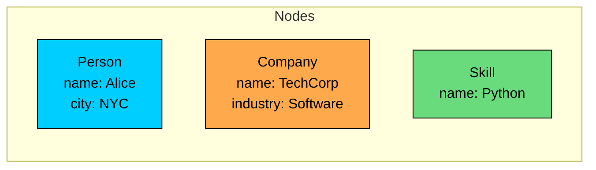
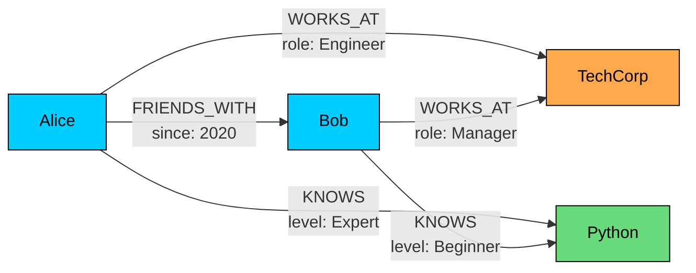
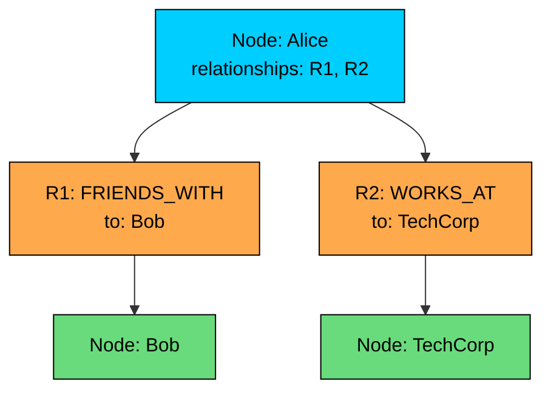
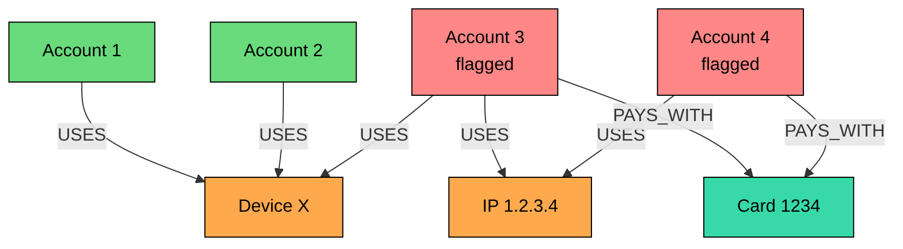
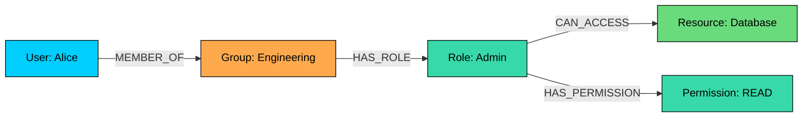
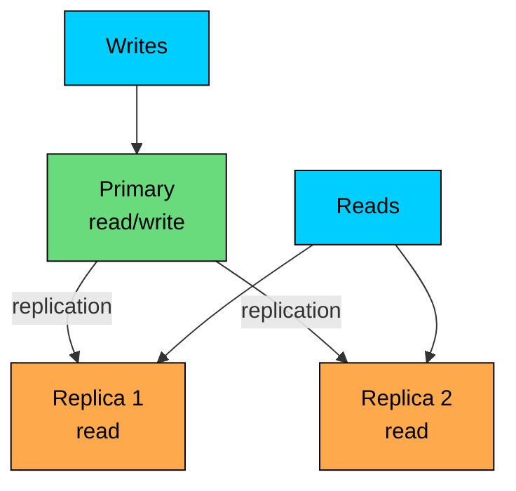

Graph databases store data as entities and relationships.

They are useful when relationships are the primary thing being queried, rather than incidental foreign keys or references. Examples include social connections, permissions, fraud rings, dependency graphs, knowledge graphs, network topology, and supply-chain relationships.

The practical question is not "does my data have relationships"" Most data does. The better question is: "Do my important queries traverse relationships, follow paths, or search for patterns in connected data""

If the answer is yes, a graph database may fit. If the system mostly retrieves entities by ID, filters rows, or aggregates facts, a relational, document, key-value, or analytical database may be simpler.

---

# The Property Graph Model

> [!PAYWALL] This content is for premium members only.

The property graph model represents data with three building blocks. Nodes are entities such as users, accounts, devices, companies, products, or resources. Relationships are typed connections between nodes. Properties are key-value attributes on nodes or relationships. Nodes also carry labels, which act as categories or types and help organize the graph.

### Nodes

Nodes represent things in the domain.

A node can have labels such as `Person`, `Company`, or `Skill`. Labels help organize the graph and make queries more selective.

### Relationships

Relationships connect nodes. They have a type and direction. They can also have properties.

Relationship properties are often important. `WORKS_AT` might include a role and start date. `TRANSFERRED_TO` might include amount, currency, and timestamp. `DEPENDS_ON` might include dependency type.

### Properties

Properties describe both entities and connections. A Person node might carry `name: "Alice"` and a Company node might carry `industry: "Software"`, both attributes of an entity.

A `WORKS_AT` relationship might carry `role: "Engineer"`, an attribute of the connection itself, and a `FRIENDS_WITH` relationship might carry `since: 2020` to record when the relationship began.

The ability to attach properties to relationships is one reason graph models are expressive. In a relational database, the same idea is usually modeled with a join table.

---

# Graph vs Relational Modeling

Relational databases can model graph-shaped data. A friendship table, permission table, or dependency table can represent edges. The difference is usually query shape and ergonomics, not raw possibility.

### Relational Edge Table

| user_id | friend_id | since |
| ------- | --------- | ----- |
| Alice   | Bob       | 2020  |
| Alice   | Carol     | 2021  |
| Bob     | Dave      | 2022  |

This works well for simple lookups and fixed-depth joins.

Graph databases become more attractive when queries ask for variable-depth paths, repeated traversals, or patterns that are awkward to express and optimize as joins.

Examples:

- Find all accounts within three hops of a known fraudulent account.
- Find the shortest dependency path between two services.
- Check whether a user inherits access through groups, roles, and policies.
- Find suppliers connected to a delayed shipment through shared parts or facilities.

The advantage is not that relational databases lack a way to model this data. The advantage is that graph databases are designed around this style of traversal and pattern matching.

---

# Storage and Traversal

Graph databases often store relationships in a way that makes local traversal efficient. Starting from a node, the database can follow outgoing or incoming relationships without repeatedly searching a global table.

### Adjacency

This local adjacency, sometimes called index-free adjacency, is what makes graph traversal efficient. Each node holds direct pointers to its relationships, so following an edge does not require looking the next node up in a global index.

Query cost is driven mostly by the part of the graph touched: starting nodes, relationship fan-out, filters, path length, and result size.

It is not independent of data size in every sense. Indexes are still needed to find starting nodes. High-degree nodes can expand to huge result sets. Deep traversals can touch enormous parts of the graph.

### Starting Point Indexes

Relationships are traversed from nodes, but the database still needs to find the first node.

Good graph queries usually start from a selective indexed node or small set of nodes, specify relationship types, limit traversal depth, filter early, and avoid returning huge paths unless required.

---

# Query Languages

Graph databases use query languages built for patterns and traversals.

### Cypher

Cypher is a declarative pattern-matching language used by Neo4j and supported by some other systems. An open subset is published as openCypher.

In 2024, ISO published GQL (ISO/IEC 39075), the first international standard for graph query languages. GQL borrows heavily from Cypher and is starting to appear in commercial products.

The pattern `(node)-[:RELATIONSHIP]->(node)` mirrors the shape of the graph.

### Gremlin

Gremlin, from Apache TinkerPop, is an imperative traversal language.

Gremlin reads like a pipeline: start with vertices, filter, traverse, transform, and return values.

### SPARQL and RDF

SPARQL is used with RDF graphs. RDF represents data as triples: subject, predicate, object. It is common in semantic web, ontology, and knowledge graph systems.

Each pattern in the `WHERE` clause is a triple, and SPARQL matches all of them across the dataset.

### Comparing the Languages

| Language | Graph Model    | Style                        |
| -------- | -------------- | ---------------------------- |
| Cypher   | Property graph | Declarative pattern matching |
| Gremlin  | Property graph | Imperative traversal         |
| SPARQL   | RDF graph      | Declarative triple matching  |

The choice often follows the database and graph model. Property graphs are common for application graphs. RDF graphs are common when semantic meaning, ontologies, and standards matter.

---

# Common Use Cases

Graph databases are well-suited to workloads where relationship traversal is part of the core product or operational flow.

### Fraud Detection

Fraud is often relational in the human sense: accounts share devices, IPs, addresses, cards, phone numbers, or behavior.

The graph database helps find connected patterns. The final fraud decision usually combines graph signals with rules, statistical models, ML models, and review workflows.

### Access Control

Permission systems often form graphs: users belong to groups, groups have roles, roles grant permissions, resources belong to projects or organizations.

For high-throughput authorization checks, many systems precompute permissions or cache answers. The graph remains valuable for explanation, administration, and complex inheritance.

### Dependency and Impact Analysis

Graphs are useful when one component depends on another: services, databases, queues, libraries, network devices, or supply-chain parts.

Typical questions:

- What breaks if this service is down"
- Which services depend on this database"
- Which customers are affected by this supplier delay"
- What is the path from this API to this storage system"

### Knowledge Graphs

Knowledge graphs model entities and facts: people, places, organizations, papers, products, concepts, and relationships.

Knowledge graphs are often paired with search, vector retrieval, and data integration pipelines. The graph provides structure and explainable relationships.

### Social and Recommendation Graphs

Social graphs and recommendation graphs are natural examples, but production recommendation systems are rarely "just graph traversal."

Graphs can generate candidates:

Final ranking may still use ML models, business rules, availability, freshness, and personalization.

---

# Performance Considerations

### Fan-Out and Traversal Depth

Traversal cost grows with the number of relationships explored. A broad set of starting nodes touches too much of the graph. Specific relationship types reduce fan-out, while high-degree nodes expand quickly.

Each hop can multiply the search space, so traversal depth compounds the work. Early filters reduce work, and returning full paths instead of summarized results can be expensive.

A two-hop traversal from a user with 50 friends is small. A four-hop traversal through high-degree celebrity nodes can explode. Graph databases make traversal ergonomic, but they do not remove combinatorial growth.

### Supernodes

Supernodes are nodes with unusually many relationships: celebrities, popular products, public groups, major airports, common IP addresses, or shared payment processors.

They can dominate query cost.

Mitigation strategies:

- filter before expanding from high-degree nodes
- cap traversal depth
- use relationship properties such as time or type
- precompute common aggregates
- treat supernodes specially in the application model
- avoid traversing through generic nodes such as "United States" unless needed

### Indexing

Indexes are still important. They find starting nodes and support property filters.

The usual pattern is index lookup first, traversal second.

---

# Scaling Graph Databases

Graph databases can scale, but the scaling model is different from key-value stores or wide-column databases.

### Vertical Scale and Replicas

Many graph workloads run well on a single primary graph with enough memory and fast storage, plus replicas for read scale and high availability.

This helps read throughput, but all writes may still go through a leader depending on the database architecture.

### Partitioning

Partitioning a graph is hard because relationships cross boundaries. A traversal that crosses partitions becomes a distributed query with network hops and coordination.

Partitioning works best when the graph has natural boundaries:

- one graph per tenant
- one graph per region
- one graph per customer
- mostly independent subgraphs

It is harder when the graph is globally connected, such as a large public social network or open knowledge graph.

### Precomputation

For high-traffic product paths, precompute common answers:

- friend suggestions
- permission closure
- dependency impact sets
- fraud risk features
- PageRank-like scores

Use the graph database for modeling, exploration, and complex traversal. Use caches, search indexes, feature stores, or relational tables for serving the hottest repeated queries.

---

# Common Graph Databases

Graph systems differ by model, query language, storage architecture, and operational style.

### Neo4j

Neo4j is a mature property graph database with Cypher, ACID transactions, indexing, clustering options, and broad tooling support.

It fits application graphs, fraud investigation, knowledge graphs, access-control graphs, and teams that want strong graph tooling.

### Amazon Neptune

Amazon Neptune is a managed AWS graph database supporting both property graph and RDF workloads through Gremlin and SPARQL.

It fits AWS-centered teams that want managed graph infrastructure and can work within Neptune's operational model.

### JanusGraph

JanusGraph is an open-source distributed graph database that uses storage backends such as Cassandra or HBase and commonly uses Gremlin.

It fits teams that need large distributed graph storage and are comfortable operating the underlying storage systems.

### RDF Stores

RDF stores such as GraphDB, Stardog, and Virtuoso focus on triples, SPARQL, ontologies, and semantic reasoning.

They fit knowledge graphs where standards, ontologies, and inference matter more than property-graph application modeling.

---

# When to Choose Graph Databases

Choose a graph database when:

- **Queries are relationship-first.** The value is in paths, neighborhoods, and patterns.
- **Traversal depth varies.** Queries explore one to many hops depending on the data.
- **Relationships have properties.** The connection itself carries important information.
- **Explainability matters.** You need to show why two things are connected.
- **The domain is naturally connected.** Fraud, permissions, dependencies, topology, and knowledge graphs fit well.

### When to Consider Alternatives

Consider another database type when:

- **Simple lookups dominate.** Key-value or document stores are simpler.
- **Aggregations dominate.** Analytical databases are better for broad scans and rollups.
- **Relationships are fixed and shallow.** Relational joins may be enough.
- **The graph is small.** A relational schema with edge tables may be simpler.
- **The workload requires massive distributed traversals.** Batch graph processing or precomputed features may be better.

---

# Summary

Graph databases are built for connected data. The data model is built from nodes, relationships, labels, and properties. Their strength is in traversals, paths, neighborhoods, and graph patterns, expressed in query languages such as Cypher, Gremlin, and SPARQL.

Indexes are still used to find starting nodes and filter properties. The main risks are fan-out, supernodes, and distributed traversal cost, and the usual scaling pattern is replicas, natural partitioning, and precomputation.

The core design skill is recognizing when relationships are the workload itself rather than incidental structure in the schema.

A graph database is a strong fit when the question is "how are these things connected"" It is a poor fit when the question is mostly "find this record" or "aggregate these rows."

The next chapter looks at time-series databases, which optimize for timestamped data, retention, and time-window queries.

---

# Quiz
