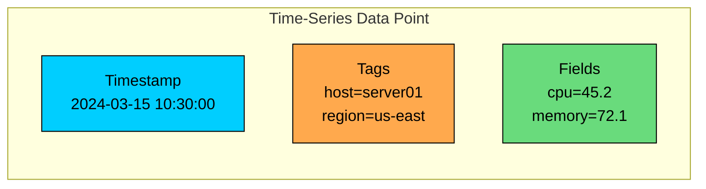
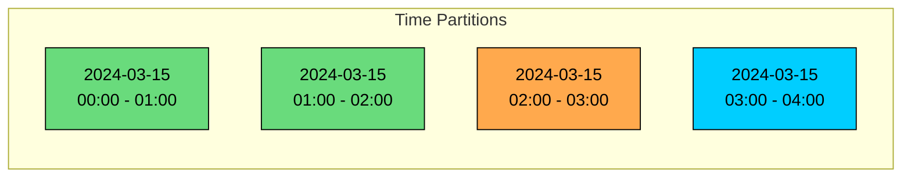
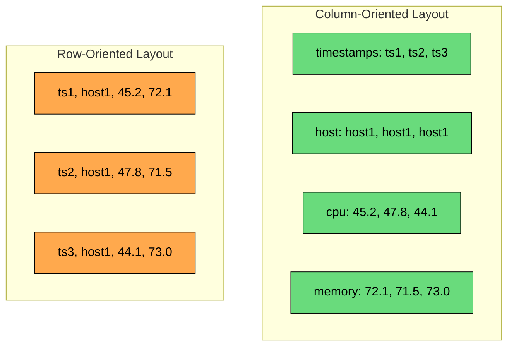
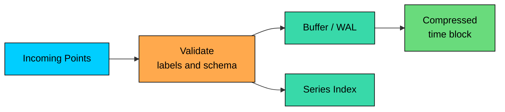
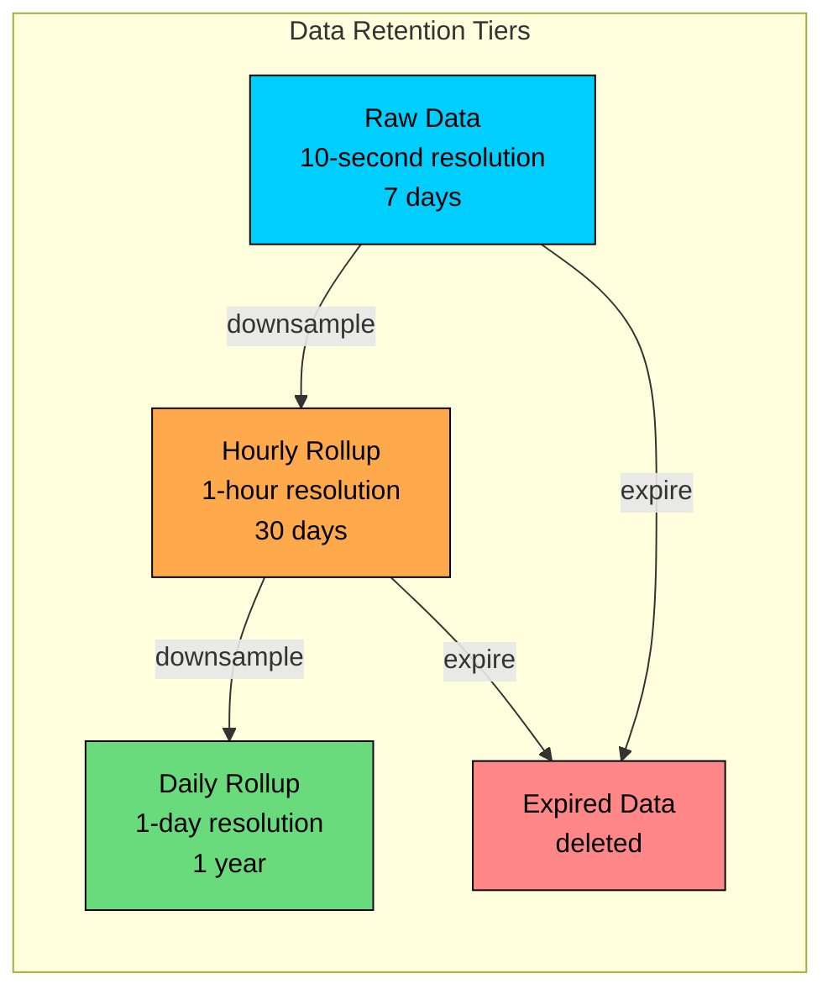
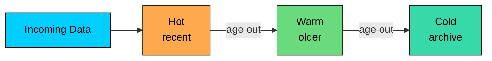
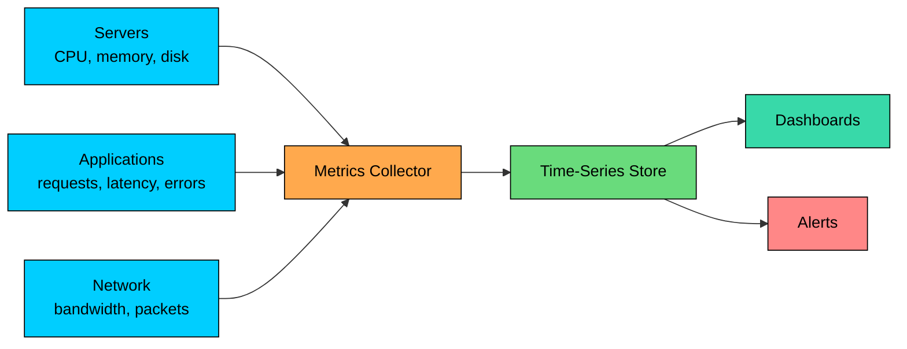

Time-series data is data measured over time.

Servers emit CPU and memory metrics. Applications record request rates and latency. Sensors report temperature. Exchanges publish prices and trades. All of these records have one thing in common: the timestamp is central to how the data is stored, queried, and expired.

Time-series databases are optimized for this shape of workload. Writes are mostly append-only and queries usually include a time range.

Aggregations over windows are more common than single-record lookups, and recent data is usually queried more often than old data. Old data often expires or is downsampled to a lower resolution.

A regular relational database can handle modest time-series workloads with good indexes and partitioning. A dedicated time-series database becomes useful when ingest volume, retention, compression, rollups, or cardinality become central design concerns.

---

# Understanding Time-Series Data

> [!PAYWALL] This content is for premium members only.

A time-series record usually has a timestamp marking when the observation happened, a metric or measurement that identifies what was measured, one or more fields holding the measured values such as CPU usage or temperature, and tags or labels carrying metadata used for filtering and grouping, such as host, region, service, or device.

### Common Properties

Time-series workloads are append-heavy, so new points are inserted far more often than old points are updated. Access patterns are time-range driven, with queries usually filtering by recent minutes, hours, days, or months.

They are aggregation-heavy, since averages, rates, sums, counts, and percentiles are common. The data is highly compressible because timestamps, labels, and numeric values often compress well.

It is retention-driven, since data usually has a defined lifetime. It is also burst-prone, because ingestion can spike during incidents, deployments, or device reconnects.

### Series, Tags, and Fields

Most time-series systems use a version of this model. A metric is the thing being measured, such as `cpu_usage`. A series is a unique metric plus a unique tag set. A point is one timestamped observation in a series, and a field is the measured value or values.

Tags are indexed metadata. Fields are measured values. This distinction matters because tags drive query speed and memory usage.

---

# Cardinality

Cardinality is the number of unique series.

It is one of the most important concepts in time-series design. A metric with one tag can produce a few series or millions of series depending on the tag values.

High cardinality is a common production problem with time-series systems.

A label like `region` carries low risk because there are only a few regions. `service` is moderate, since there are usually tens or hundreds of services.

`container_id` is high risk because it changes often and creates many series. `user_id` is very high, often reaching millions of values. `request_id` is dangerous, since it usually produces one value per request.

Cardinality hurts because more series require larger indexes and give the query planner more series to scan. Memory pressure rises, compaction and retention work increases, and dashboards and alerts become slower or more expensive.

Use tags for dimensions that are commonly filtered or grouped by, and keep high-cardinality values in fields, logs, traces, or a different analytical store.

---

# Storage Architecture

Time-series databases vary internally. Some use columnar storage. Some use LSM-style storage. Some, like Prometheus, use custom block formats optimized for metrics. The common theme is that storage is organized around time ranges, series, compression, and retention.

### Time-Based Partitioning

Time-series data is commonly split into chunks or partitions by time.

Queries can skip partitions outside the time range, and retention can delete old partitions cheaply. Recent and older data can use different storage tiers, and background jobs can compact or downsample one time range at a time.

### Column-Oriented Layout

Many time-series workloads benefit from storing values by column or series because queries often read a small set of fields over many points.

Column-oriented layouts help because aggregations can read only the needed field, similar adjacent values compress well, batch processing can use CPU-friendly scans, and queries avoid loading irrelevant columns.

### Compression

Time-series data often compresses well because timestamps are ordered, labels repeat, and numeric values often change gradually.

Delta encoding works well for sequential timestamps, and delta-of-delta encoding handles regular sampling intervals efficiently. XOR encoding compresses floating-point values with small changes. Dictionary encoding helps with repeated tags or labels, run-length encoding handles repeated values, and block compression provides general compression over chunks.

Compression ratios depend heavily on the data. Regular metrics with stable labels compress much better than sparse, high-cardinality, irregular events.

### Write Path

Most time-series write paths batch and buffer data before writing durable compressed blocks.

Batching improves throughput, and write-ahead logs protect recent data before block files are finalized. Out-of-order points may be accepted, rejected, or handled more slowly depending on the database. Label validation matters because one bad label choice can create huge cardinality.

---

# Query Patterns

Time-series queries are usually built from a small set of patterns.

### Time-Range Filters

Most queries include a time range:

Time partitioning lets the database skip irrelevant time ranges.

### Aggregations

Aggregations summarize many points into fewer values.

`avg` is used for things like average CPU or temperature, while `sum` totals bytes or requests. `count` returns the number of events, and `min` and `max` give the lowest and highest values.

`percentile` or histogram queries compute P95 or P99 latency. `rate` measures the per-second change of a counter, and `derivative` gives the rate of change for a gauge.

### Tag Filtering

Tags narrow the series set before aggregation:

Good tag filters are selective enough to reduce the data scanned. Bad tag choices either match too much data or create too many series.

### Downsampling Queries

Downsampling converts high-resolution data into lower-resolution summaries.

Downsampling is useful when old raw data is rarely needed but long-term trends matter.

---

# Retention and Downsampling

Time-series systems need a data lifecycle plan. Without one, storage grows forever.

### Retention Policies

Retention defines how long data is kept.

Tiered retention works because recent data is useful for debugging, while older data is usually used for trends and capacity planning.

### Rollups

Rollups precompute summaries. They reduce query cost and storage size, but they also discard detail.

For example, 10-second CPU samples can roll up to 5-minute average, min, and max. Per-request latency rolls up to histogram buckets per minute. Individual sensor readings become hourly averages by device, and per-event counts become daily totals by region.

Be careful with averages. Averaging averages can produce wrong results unless you also keep counts or sums. For latency, histograms or sketches are often better than storing only an average.

### Continuous Aggregation

Some databases can maintain rollups automatically.

The operational question is how late-arriving data is handled. Real systems often receive delayed points, retries, and backfilled data.

### Storage Tiering

Older data can move to cheaper storage if the database supports it.

| Tier            | Common Storage      | Use Case                        |
| --------------- | ------------------- | ------------------------------- |
| Hot             | SSD or memory cache | Recent data, dashboards, alerts |
| Warm            | Lower-cost disk     | Older data, occasional queries  |
| Cold            | Object storage      | Archive and rare access         |
| Offline archive | Deep archive        | Compliance or long-term history |

---

# Common Time-Series Databases

Different time-series databases make different trade-offs. Pick based on workload, ecosystem, query model, and operating model.

### Prometheus

Prometheus is built for metrics and alerting. It uses a pull model, stores numeric time-series, and queries them with PromQL.

It fits infrastructure and application monitoring, especially in Kubernetes-heavy environments. It is not a general analytics database, and long-term storage is commonly handled with systems such as Thanos, Cortex, Mimir, or remote storage backends.

### InfluxDB

InfluxDB is a purpose-built time-series database with a measurement, tag, field, and timestamp model. It is commonly used for metrics, IoT, and operational data.

It fits teams that want a dedicated time-series system with built-in ingestion and query tooling.

### TimescaleDB

TimescaleDB extends PostgreSQL with time-series features such as hypertables, time partitioning, compression, and continuous aggregates.

It fits workloads that need SQL, relational joins, and time-series data in the same PostgreSQL ecosystem.

### QuestDB

QuestDB is a time-series database with a SQL interface and a focus on high-ingest analytical workloads.

It is often considered for market data, operational analytics, and workloads where fast ingestion and SQL-style queries matter.

### Wide-Column and Analytical Stores

Not every time-series workload needs a dedicated TSDB. Cassandra, Bigtable, ClickHouse, Druid, Pinot, and cloud warehouses can all be valid choices depending on the query pattern.

For example, use Prometheus for metrics and alerting, or TimescaleDB when relational joins and SQL matter. Cassandra or Bigtable suit huge key-based time-series writes, while ClickHouse, Druid, or Pinot fit analytical scans and dashboards.

---

# Common Use Cases

### Infrastructure Monitoring

Infrastructure monitoring tracks service and system health.

Typical metrics include request rate, error rate, latency percentiles, CPU usage, memory usage, queue depth, and saturation.

### IoT Sensor Data

IoT systems collect readings from devices over time.

Typical queries include trends by device, threshold violations, missing readings, and aggregates by location.

### Financial and Market Data

Market data can require precise timestamps, high ingest, and long retention.

These systems often care about backtesting, replay, late corrections, and strict auditability.

### Product and Business Metrics

Business metrics are also time-series, but they often need joins with product, customer, or cohort data.

Examples include daily active users, conversion rate by platform, revenue by region, and checkout failures by payment provider.

For this style of analytics, a warehouse or OLAP database may be more appropriate than a metrics-first TSDB.

---

# Performance Considerations

### Write Performance

Batch size matters because larger batches reduce per-write overhead. Label validation prevents accidental high-cardinality explosions.

Out-of-order data may force slower write paths. Replication improves durability but adds write cost, and compression reduces storage and I/O at the cost of CPU.

### Query Performance

The time range matters because wider ranges read more partitions or blocks. Series count matters too, since more matching series means more index and data work.

Tag selectivity helps when good filters reduce the data scanned. The aggregation window also affects work, because smaller windows produce more output points. Rollups speed common dashboards by serving precomputed summaries.

### Operational Risks

Cardinality explosions happen when a new label such as `user_id` or `request_id` overwhelms the system. Dashboard fan-out is another common problem, since one dashboard can issue many expensive queries at once.

Alert reliability also depends on query speed, because alert queries must stay fast during incidents, when ingest may spike.

Clock issues show up when device clocks and server clocks produce late or incorrect timestamps. Retention mistakes are less visible but equally costly, since keeping raw data forever can become expensive.

---

# When to Choose Time-Series Databases

Choose a time-series database when time is the primary query dimension and most queries filter or group by time.

It also fits when writes are append-heavy with new points arriving continuously, when aggregations dominate so dashboards and alerts depend on rates, windows, and percentiles, when retention is time-based with old data expiring or rolling up naturally, and when cardinality can be controlled through carefully designed labels.

### When to Consider Alternatives

Consider another database type when data is small enough that PostgreSQL with a time index or partitioning may be enough, or when relationships and joins dominate and a relational or analytical store fits better.

For events that are high-cardinality and exploratory, logs or OLAP systems may fit better. If point lookups by ID dominate, a key-value or relational database may be simpler. When updates and corrections are common, check whether the TSDB handles them well.

---

# Summary

Time-series databases are optimized for timestamped, append-heavy data with time-range queries.

| Aspect         | Time-Series Approach                                       |
| -------------- | ---------------------------------------------------------- |
| **Data model** | Metrics or measurements with timestamps, tags, and fields  |
| **Storage**    | Time partitions, compressed blocks, series indexes         |
| **Writes**     | Batched append-heavy ingestion                             |
| **Queries**    | Time ranges, tag filters, aggregations, rates, percentiles |
| **Retention**  | Expiration, rollups, downsampling, storage tiering         |
| **Main risk**  | High cardinality and unbounded retention                   |

The core design skill is controlling cardinality and retention. Choose labels carefully, keep high-cardinality identifiers out of tags, roll up old data when detail no longer matters, and pick the database based on the query pattern rather than the label "time-series."

The next chapter explores full-text search engines, which optimize for keyword search, relevance ranking, faceted filtering, and linguistic analysis.

---

# Quiz
