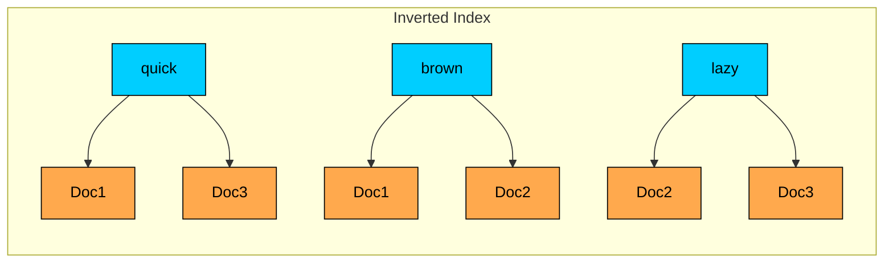
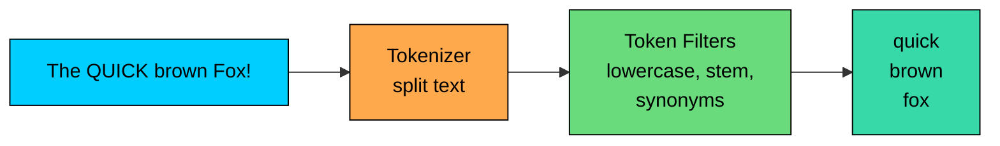
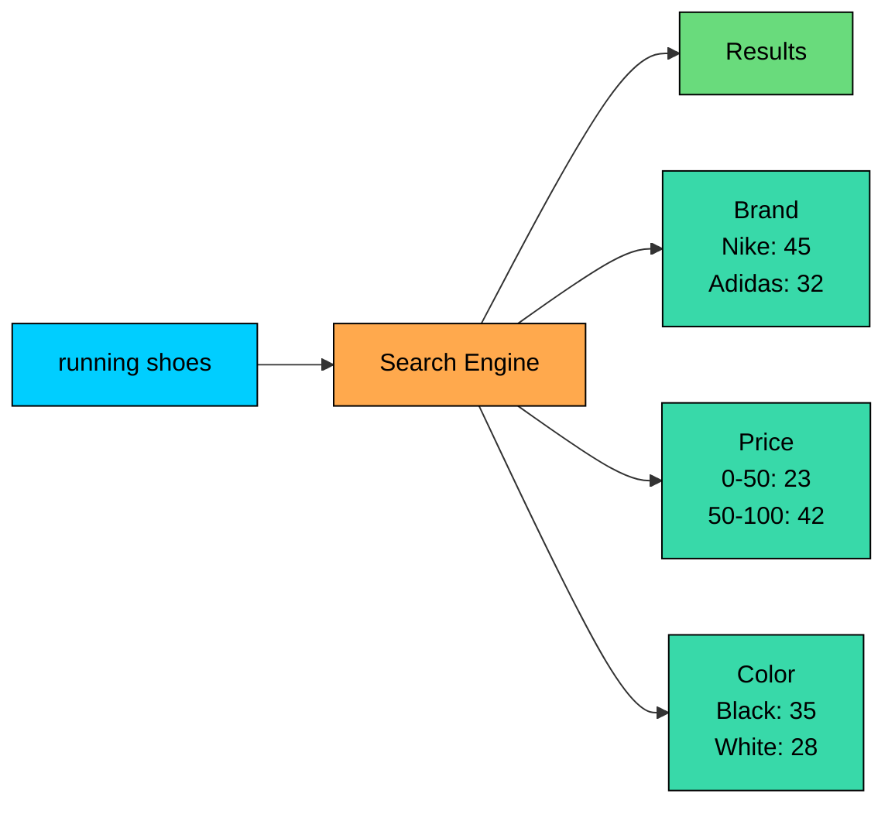
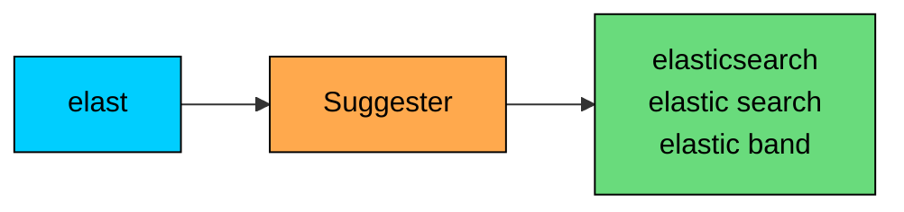
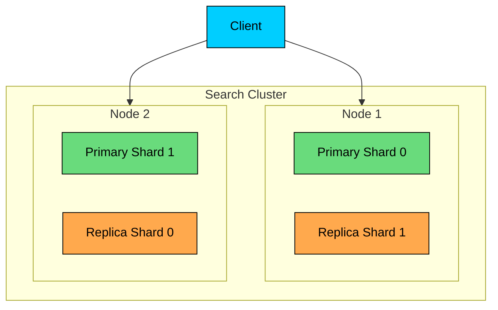
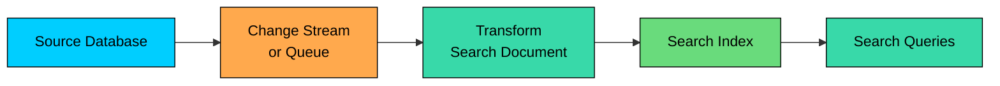
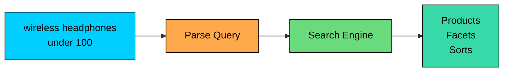

Full-text search engines are built for finding and ranking text.

Users rarely search with exact database values. They type partial phrases, misspell words, use synonyms, filter by structured fields, and expect the best results first.

A product search for `running shoes size 10` is more than a substring lookup. It needs tokenization, relevance scoring, filters, facets, typo tolerance, and usually business ranking.

Relational databases can provide useful full-text search for many applications.

Dedicated search engines become a better fit when search is a core product feature, the dataset is large, ranking quality matters, or users need features such as autocomplete, highlighting, faceted navigation, and log exploration.

Search engines are usually secondary indexes. The source of truth stays in a database or object store. The search engine stores a searchable copy optimized for retrieval.

---

# The Inverted Index

> [!PAYWALL] This content is for premium members only.

The inverted index is the core data structure behind full-text search.

A normal document store maps document IDs to content. An inverted index maps terms to the documents that contain them.

### Example

Consider three documents:

An inverted index stores terms like this:

Visually, each term points at the documents that contain it:

To search for `quick brown`, the engine looks up both posting lists and combines them. It does not scan every document.

### Posting Lists

Each term points to a posting list. A posting can include more than the document ID:

Common posting data includes the document ID (which document contains the term) and the term frequency (how often the term appears in that document).

It also includes the positions where the term appears (used for phrase queries), and field information (whether the term appeared in title, body, tags, or another field).

Positions make queries like `"quick brown"` possible because the engine can check whether the words appear next to each other in order.

---

# Text Analysis

Search engines do not index raw text directly. They analyze text into tokens.

The same analysis, or a compatible one, is applied to both indexed documents and user queries. If the document and query are analyzed differently, relevant matches can disappear.

### Analysis Pipeline

Analysis runs in two stages. A tokenizer splits raw text into tokens, and token filters then normalize each token before it reaches the index.

### Tokenizers

The standard word tokenizer fits general text search. A whitespace tokenizer does simple splitting when punctuation should remain.

An n-gram tokenizer supports autocomplete or partial matching. A keyword tokenizer treats the whole field as one token. Language-specific tokenizers handle languages with different word-boundary rules.

### Token Filters

Lowercase filters match `Fox` and `fox`. Stop word filters remove very common words when appropriate. Stemming reduces `running` and `runs` toward a root form, while lemmatization normalizes words using vocabulary and grammar.

Synonym filters treat `laptop` and `notebook` as related. ASCII folding matches `cafe` against accented forms like `café`.

Analysis choices are product decisions. Aggressive stemming may improve recall but hurt precision. Synonyms can help users, but bad synonym rules can make results worse.

### Field Mapping

Different fields often need different analysis. A product title is typically full-text analyzed and boosted in ranking. A SKU or model number is an exact keyword field.

A description is full-text analyzed. A brand is usually an exact filter plus searchable text. Price is a numeric field for filtering and sorting, and a created date is a date field used for filtering and recency boosts.

Good search schemas usually store both analyzed and exact versions of important fields. For example, `brand` might be searchable as text and filterable as `brand.keyword`.

---

# Relevance Scoring

Search engines rank matching documents. Matching alone is not enough.

### TF-IDF

TF-IDF is the classic idea behind text relevance.

Term frequency captures the intuition that a term appearing more often in a document may be more important, while inverse document frequency reflects that rare terms are usually more useful than common terms.

Combined, the two factors score documents like this:

### BM25

BM25 is a widely used ranking function derived from TF-IDF ideas. It adds two important improvements: term frequency has diminishing returns, and document length is normalized.

This prevents long documents from winning because they contain more words, and prevents repeated terms from dominating the score.

### Boosting and Business Signals

Text relevance is usually only one part of ranking.

Search systems often combine:

- text score
- field boosts, such as title matches over body matches
- popularity
- recency
- inventory availability
- personalization
- business rules
- quality or trust signals

A simple form of boosting weights matches in some fields more than others. The `^` syntax below tells the engine that title matches count three times as much as description matches, and brand matches count twice as much:

Boosting should be tested with real queries. It is easy to make one class of searches better while making another worse.

---

# Search Features

Full-text search engines usually provide more than text matching.

### Filters

Filters narrow results using structured fields. They are not the same as scored text queries.

Use text queries for relevance. Use filters for exact constraints such as brand, price, status, tenant, date range, and permissions.

### Facets

Facets are aggregations over the result set. They power filters such as brand, price, color, file type, or category.

Facets are one reason search engines are common in e-commerce and document portals.

### Phrase Queries

Phrase queries require terms to appear in order and near each other.

They depend on term positions in posting lists.

### Fuzzy Matching

Fuzzy matching handles small typos.

Fuzzy matching improves recall, but it can be expensive and can introduce strange matches. Use it carefully on fields where typos are expected.

### Autocomplete

Autocomplete returns suggestions as the user types.

Common implementations use edge n-grams, completion suggesters, tries, or finite state transducers.

### Highlighting

Highlighting returns snippets showing why a document matched.

This is useful for document search, logs, support articles, and knowledge bases.

---

# Search Engine Architecture

Many search engines, including Elasticsearch, OpenSearch, and Solr, are built on Apache Lucene or similar indexing ideas.

### Indexes, Shards, and Replicas

A search cluster spreads documents across nodes by partitioning each index into shards and replicating those shards for availability.

Core concepts:

- **Index:** a collection of searchable documents.
- **Shard:** a partition of an index.
- **Replica:** a copy of a shard for availability and read scaling.
- **Segment:** an immutable Lucene index unit, made up of several files (postings, term dictionary, stored fields, doc values), created during indexing.
- **Refresh:** makes recently indexed documents visible to search. Elasticsearch and OpenSearch call this a refresh and run it every second by default. Solr uses similar mechanics but calls them soft commit (visible to search) and hard commit (durable on disk).
- **Merge:** combines smaller segments into larger ones in the background.

### Write Path

Search indexing is often near-real-time, not immediately consistent.

Typical flow:

1. Source database changes.
2. Change event is sent through an ingestion pipeline.
3. Search document is transformed and indexed.
4. Index refresh makes the document searchable.
5. Segment merges happen later in the background.

This is why search engines are usually secondary indexes. If the search index is stale, the source database still has the authoritative record.

### Query Path

A distributed search query usually fans out to relevant shards, collects top results, and merges them.

Important costs:

- number of shards queried
- size of posting lists
- sort mode
- aggregations and facets
- highlighting
- deep pagination
- script or custom scoring

Deep pagination is especially expensive because the engine may need to score and sort many results before returning a later page. Search APIs often use cursor-like approaches such as `search_after` instead.

---

# Common Search Engines

### Elasticsearch and OpenSearch

Elasticsearch and OpenSearch are distributed search engines built around Lucene. They support full-text search, structured filters, aggregations, log analytics, vector search, and large ecosystems of ingestion and dashboarding tools.

OpenSearch began in 2021 as an AWS-led fork of Elasticsearch 7.10, after Elastic relicensed Elasticsearch under SSPL and the Elastic License v2. The two projects share a Lucene foundation and most of the API surface, but they have diverged over time.

Pick the one whose licensing, hosting, and ecosystem suits your team. In 2024, Elasticsearch added AGPLv3 as a third license option, restoring an OSI-approved path for users that need one.

They are common for product search, document search, observability, security analytics, and operational log exploration.

### Apache Solr

Solr is another mature Lucene-based search platform. It is common in enterprise search, e-commerce, and organizations with long-running search infrastructure.

It has different operational and configuration patterns from Elasticsearch/OpenSearch, but the core Lucene concepts are similar.

### Managed Search Services

Services such as Algolia and similar hosted search platforms focus on developer experience, low operational overhead, typo tolerance, autocomplete, and product search workflows.

They can be a strong choice when the team wants search as a service rather than operating a search cluster.

### Lightweight Search Engines

Engines such as Meilisearch and Typesense focus on simpler setup and fast developer experience for smaller to medium workloads.

They can be good for application search when operational simplicity matters more than advanced distributed search features.

---

# Common Use Cases

### E-Commerce Product Search

Product search combines text relevance with structured filters and business ranking.

Typical requirements:

- autocomplete
- typo tolerance
- exact matching for brands and model numbers
- facets for category, price, color, size, and rating
- boosts for availability, popularity, margin, or freshness
- synonym handling

### Document and Knowledge Search

Search engines are used for documentation, intranets, support centers, and legal or policy archives.

Important features:

- parsing PDFs, HTML, Markdown, and office documents
- field boosts for title and headings
- phrase search
- highlighting
- access-control filtering
- freshness and version handling

### Log and Event Search

Search engines are also used for logs and operational events.

Log search cares about ingestion throughput, retention, compression, time filters, and operational cost as much as text relevance.

---

# Search vs Vector Search

Full-text search and vector search solve different retrieval problems.

| Need | Better Starting Point |
|------|-----------------------|
| Exact terms, names, IDs, model numbers | Full-text or keyword search |
| Natural language meaning | Vector search |
| Product search with filters and exact terms | Hybrid search |
| Legal, technical, or code search | Often hybrid |
| RAG over private documents | Usually hybrid plus reranking |

Modern systems often combine them:

1. Use keyword search for exact terms and lexical relevance.
2. Use vector search for semantic candidates.
3. Merge candidates.
4. Rerank with a stronger model or domain-specific scoring.

---

# Performance Considerations

### Index Design

Index design affects both relevance and cost.

| Choice | Trade-off |
|--------|-----------|
| More analyzed fields | Better matching, larger index |
| More exact keyword fields | Better filters/facets, more storage |
| More shards | More parallelism, more overhead |
| More replicas | More read capacity, more storage |
| More frequent refresh | Fresher search, higher write cost |
| More aggressive analyzers | Higher recall, possible lower precision |

### Operational Risks

Search clusters fail in predictable ways. The most common issues include:

- **Mapping mistakes:** wrong field types can require reindexing.
- **Shard sprawl:** too many small shards waste memory and coordination.
- **Hot shards:** uneven routing can overload one shard.
- **Expensive aggregations:** broad facets can consume significant CPU and memory.
- **Deep pagination:** later pages can be expensive to compute.
- **Stale index data:** asynchronous indexing creates consistency windows.

### Reindexing

Search schema changes often require reindexing.

Common pattern:

1. Create a new index with the new mapping.
2. Backfill documents from the source of truth.
3. Dual-write or replay changes while backfill runs.
4. Switch an alias from the old index to the new index.
5. Remove the old index after validation.

This is another reason the search engine should not be the only copy of critical data.

---

# When to Choose Search Engines

Choose a full-text search engine when:

- **Text search is a product feature.** Users search by words, phrases, and partial queries.
- **Relevance ranking matters.** Results need to be ordered by usefulness.
- **Facets and filters matter.** Users need navigation by structured fields.
- **Autocomplete or typo tolerance matters.** The search box needs interactive behavior.
- **Operational log search matters.** Teams need fast filtering and exploration over logs or events.

### When to Consider Alternatives

Consider another approach when:

- **Simple search is enough.** Database full-text search may be sufficient.
- **Strong transactions are required.** Keep writes in the source database.
- **The workload is mostly analytics.** Columnar or OLAP systems may fit better.
- **The workload is mostly semantic similarity.** Use vector search, or hybrid search if exact terms still matter.
- **The data is small.** A simple database index may be easier to operate.

---

# Summary

Full-text search engines are optimized for keyword-based retrieval and ranking.

| Aspect | Search Engine Approach |
|--------|------------------------|
| **Core data structure** | Inverted index |
| **Text processing** | Tokenization, normalization, stemming, synonyms |
| **Ranking** | BM25, boosting, business signals, reranking |
| **Features** | Filters, facets, autocomplete, fuzzy matching, highlighting |
| **Scaling** | Shards, replicas, immutable segments, background merges |
| **Main role** | Secondary search index, not primary source of truth |

The core design skill is matching the search experience to the data. Good search requires analyzers, mappings, ranking signals, filters, operational pipelines, and evaluation with real queries.

The next chapter explores database durability, which explains how storage systems keep committed data safe through crashes, corruption, and hardware failure.

---

# Quiz
