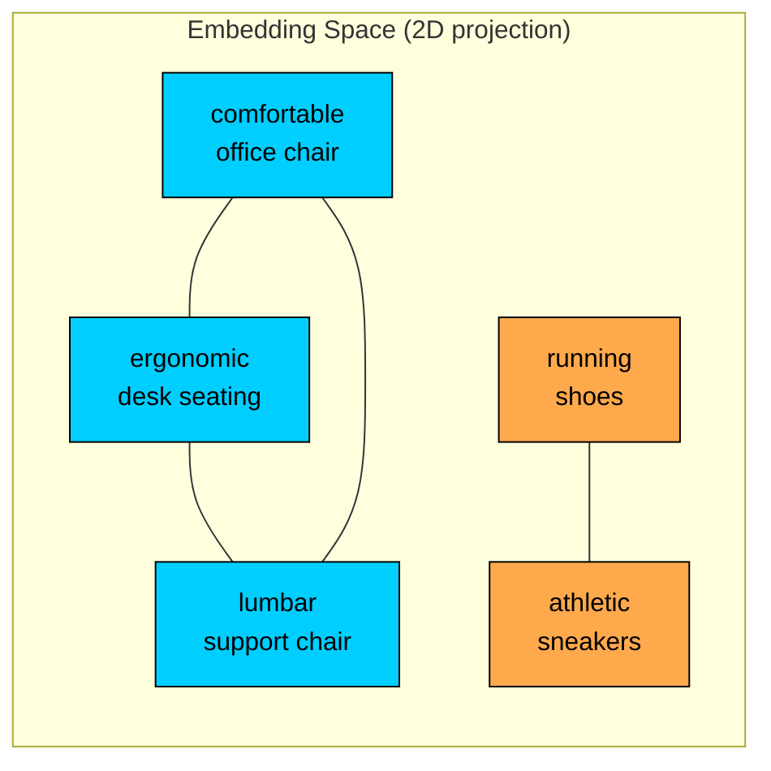
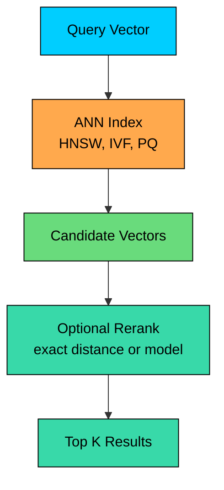
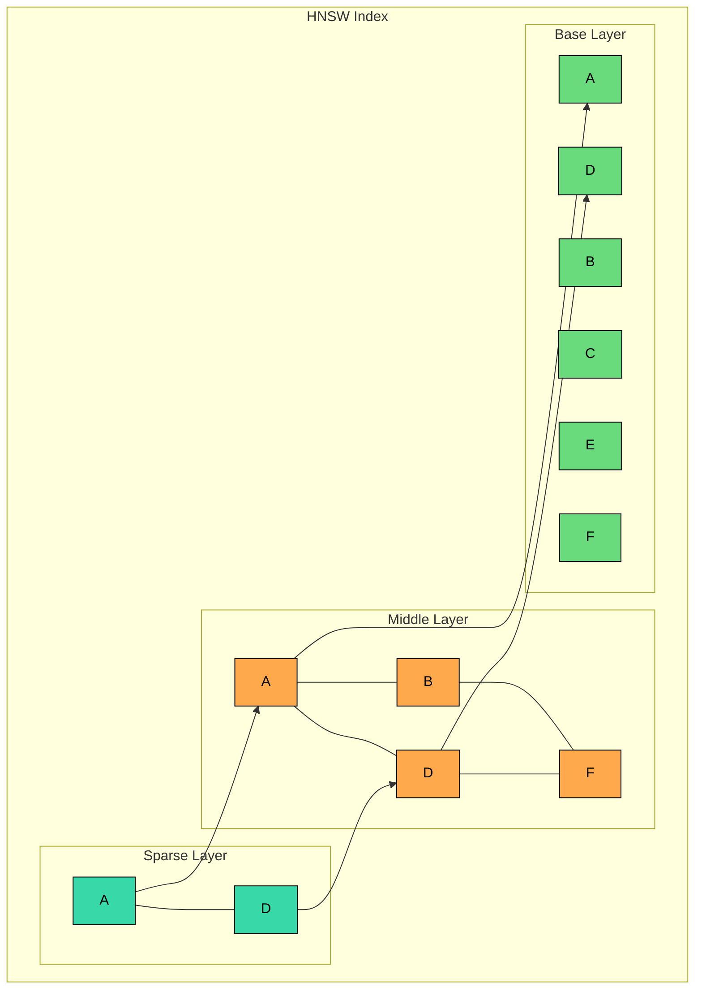
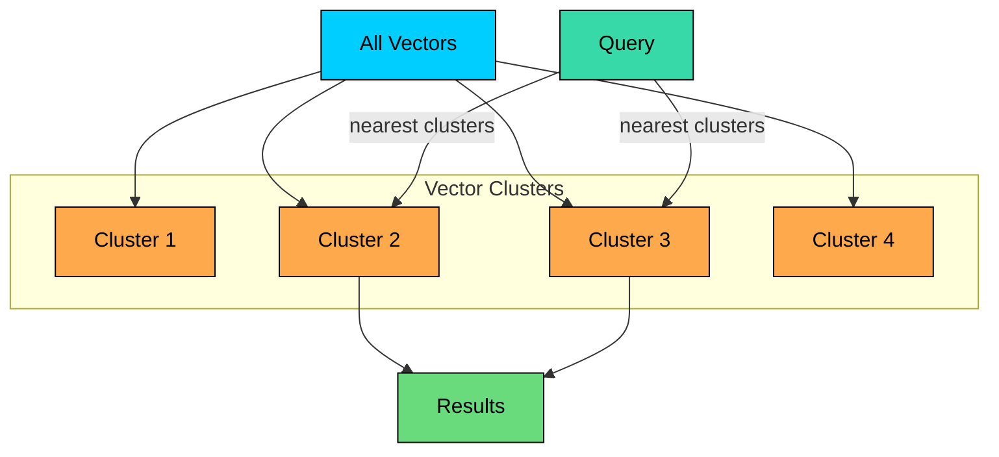
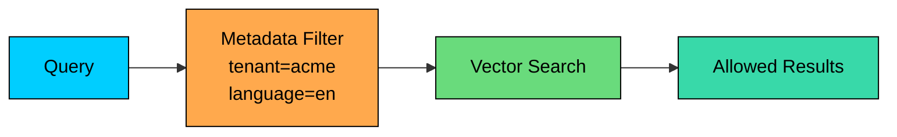
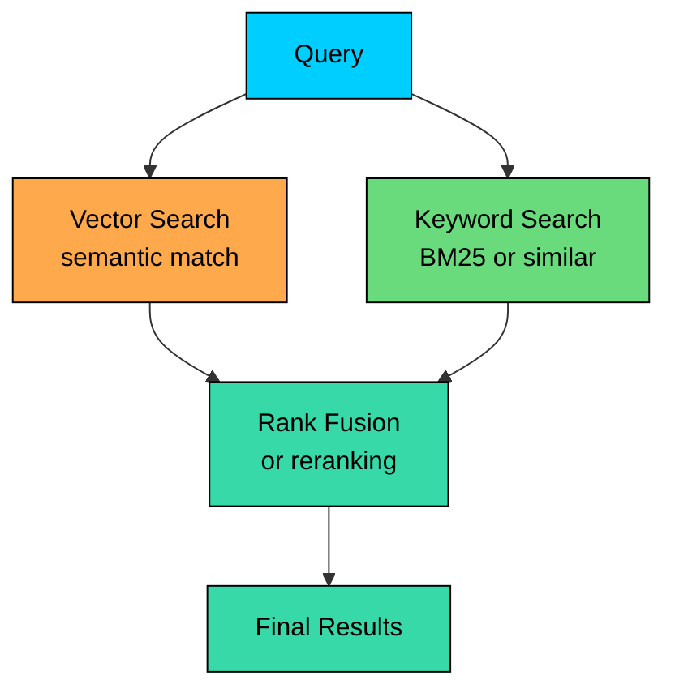
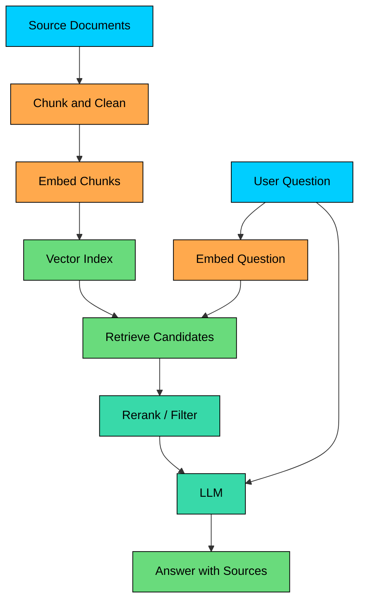
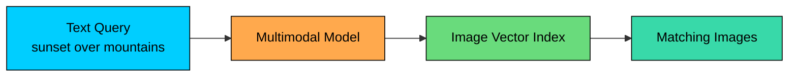

Vector databases store and search embeddings.

An embedding is a list of numbers produced by a machine learning model. The useful property is that similar items tend to have similar vectors. Text with similar meaning, images with similar content, or users with similar behavior can be placed near each other in vector space.

This enables queries that ordinary keyword search does not handle well:

- "Find documents similar to this paragraph."
- "Find products like this product."
- "Find support articles that answer this question."
- "Find images matching this text description."
- "Find examples of behavior similar to this event."

A vector database does not understand meaning by itself. The embedding model creates the representation. The vector database stores those vectors, indexes them, filters them, and retrieves the nearest matches efficiently.

---

# Understanding Embeddings

> [!PAYWALL] This content is for premium members only.

An embedding maps an input into a fixed-length vector.

The first two phrases should end up closer to each other than either is to "running shoes." That closeness is what vector search uses.

### What Gets Stored

A production vector record usually contains more than the vector.

The vector database often stores:

- **ID:** stable identifier for the vector.
- **Embedding:** the numeric vector.
- **Metadata:** fields used for filtering, authorization, and routing.
- **Pointer to source data:** the original document, product, image, or chunk usually lives elsewhere.

The original content should normally remain in a source-of-truth store such as PostgreSQL, object storage, a document store, or a search index. The vector database is an index over that content.

### Similarity Metrics

Vector search uses a distance or similarity metric.

| Metric | How to Think About It | Common Use |
|--------|------------------------|------------|
| Cosine similarity | Compares direction | Text embeddings, often with normalized vectors |
| Dot product | Compares direction and magnitude | Models trained for dot-product scoring |
| Euclidean distance | Compares geometric distance | General vector search |

Use the metric expected by the embedding model. Changing the metric can reduce retrieval quality without any obvious error.

---

# Vector Search

The core operation is nearest-neighbor search: given a query vector, find the closest stored vectors.

### Exact Search

Exact search compares the query vector with every stored vector.

This is simple and accurate, but it becomes expensive as the dataset grows. For small datasets, exact search inside PostgreSQL, a search engine, or even memory may be enough. For larger datasets, systems use approximate nearest-neighbor indexes.

### Approximate Nearest Neighbors

Approximate nearest-neighbor search, or ANN, trades perfect accuracy for speed and lower cost.

Instead of checking every vector, the index searches a smaller candidate set that is likely to contain good matches.

The main trade-offs sit on a few axes. Higher recall usually means searching more candidates, using more memory, or accepting higher latency. Lower latency comes from searching fewer candidates or using more aggressive compression.

Lower cost is typically achieved by quantizing vectors, moving to disk, or reducing dimensions. Fresher data requires supporting incremental inserts and background index maintenance.

**Recall@K** is a common quality metric. If recall@10 is 0.9, the system found 9 of the true top 10 neighbors on average.

---

# Indexing Algorithms

Vector databases use different index types depending on scale, latency, memory, and update requirements.

### HNSW

HNSW, or Hierarchical Navigable Small World, is a graph-based ANN index introduced by Yu. A. Malkov and D. A. Yashunin in 2016. It connects vectors in layers so search can move quickly toward nearby points.

The top layer is the sparsest and acts as the search entry point; lower layers grow denser and refine the result.

HNSW is a good default for many low-latency workloads. Its trade-off is memory: the graph needs extra space beyond the vectors themselves.

Three parameters matter most. `M` controls how many graph connections each node has; more connections can improve recall but use more memory.

`efConstruction` affects index build quality, with higher values producing a better index at the cost of slower builds. `efSearch` controls the search effort at query time, where higher values improve recall but increase query latency.

### IVF

IVF, short for Inverted File Index, partitions vectors into clusters during a training step. At query time, the database identifies the clusters closest to the query and searches only those, instead of scanning the full dataset.

IVF can work well for large datasets and disk-backed search. It usually needs a training step to create clusters, and recall depends on how many clusters are searched.

### Quantization

Quantization compresses vectors to reduce memory and storage. Several variants are common in practice:

- **Scalar Quantization (SQ):** each float32 dimension is mapped to a smaller integer type, typically int8. This cuts memory by 4x with a small recall loss.
- **Product Quantization (PQ):** the vector is split into sub-vectors, and each sub-vector is replaced by the id of the nearest centroid from a small codebook learned during training. A 1024-dimensional float32 vector can drop from 4 KB to under 100 bytes.
- **Binary Quantization (BQ):** each dimension collapses to a single bit. This is the most aggressive option and usually pairs with reranking.

Quantization lowers cost and can make larger indexes practical, but it may reduce recall. A common pattern is to retrieve a larger candidate set using compressed vectors, then rerank candidates with original vectors or a stronger model.

---

# Metadata Filtering

Vector similarity alone is rarely enough in production.

Most systems need filters such as tenant or account, language, document type, access control, region, product category, and freshness window.

Filtering affects index design and performance.

There are two common approaches. Pre-filtering applies metadata filters first, then searches vectors inside the filtered set. Post-filtering searches vectors first, then removes results that do not match metadata.

Pre-filtering can be more correct for strict filters but may reduce ANN efficiency. Post-filtering is simpler but can return too few results if many candidates are filtered out. The choice between them should be made explicitly based on the workload.

---

# Hybrid Search

Pure vector search is good at semantic similarity, but it can miss exact terms.

A query like `iPhone 15 Pro Max case` needs exact matching for the model name and semantic matching for intent. Hybrid search combines keyword search with vector search.

Hybrid search is useful for:

- product search
- technical documentation
- legal or compliance search
- support knowledge bases
- any system where exact terms and semantic meaning both matter

A common pattern is:

1. Retrieve candidates from keyword search.
2. Retrieve candidates from vector search.
3. Merge results with rank fusion.
4. Rerank the top candidates with a more expensive model.

---

# Retrieval-Augmented Generation

Retrieval-augmented generation, or RAG, uses retrieval to give an LLM relevant context.

The vector database is only one part of the RAG pipeline. Quality also depends on:

- document parsing and cleanup
- chunk size and overlap
- embedding model choice
- metadata filters and permissions
- hybrid retrieval
- reranking
- prompt construction
- source citation and answer validation

Poor chunking or missing permissions checks can break a RAG system even if the vector index is excellent.

---

# Common Use Cases

### Semantic Search

Semantic search finds documents by meaning rather than exact words.

Typical flow:

1. Split documents into searchable chunks.
2. Embed each chunk.
3. Store vectors with metadata and source IDs.
4. Embed the user's query.
5. Retrieve nearest chunks.
6. Return documents or passages, often after reranking.

### Recommendations

Vector search can find similar products, articles, songs, images, or users.

For user recommendations, embeddings may represent behavior, preferences, or learned user features. The vector database retrieves candidates; the recommendation system still needs ranking, freshness, diversity, and business constraints.

### Image and Multimodal Search

Multimodal models can place text and images in a shared vector space.

This supports text-to-image search, image-to-image search, and mixed media retrieval.

### Anomaly and Similarity Detection

Embeddings can represent normal behavior, transactions, logs, or events. New events far from known clusters may be suspicious.

This is not automatic fraud detection. Vector distance is a signal. Production systems usually combine it with rules, statistical features, supervised models, and human review.

---

# Common Vector Stores

Vector search can be provided by dedicated vector databases, search engines, relational extensions, or embedded libraries.

### Dedicated Vector Databases

Systems such as Pinecone, Milvus, Weaviate, and Qdrant focus on vector search, metadata filtering, indexing, and distributed operation.

They are a good fit when vector search is central to the product, the dataset is large, or the team wants purpose-built vector operations and scaling.

### Search Engines with Vector Support

Search engines such as Elasticsearch, OpenSearch, and Solr can combine keyword search, filters, and vector search.

They are useful when hybrid search is more important than pure vector search.

### Relational Extensions

PostgreSQL with pgvector can store vectors alongside relational data.

This is often a practical starting point when the vector dataset is moderate and the application already uses PostgreSQL.

Older pgvector releases capped indexed HNSW and IVFFlat vectors at 2000 dimensions, with a separate `halfvec` type for higher dimensions; check the pgvector version when planning around modern 3072-dimension embedding models.

### Embedded Libraries

Libraries such as FAISS (from Meta AI Research) and Annoy (from Spotify) can run vector search inside an application or batch job.

They work well for offline workloads, prototypes, or single-node systems. They do not provide the operational features of a database, such as replication, access control, backups, multi-tenant filtering, and online updates.

---

# Performance Considerations

### Memory and Storage

Vector storage grows with vector count and dimension count. More vectors require more storage and larger indexes. Higher dimensions per vector increase memory, storage, and compute.

Index type matters too: graph indexes use extra memory, while compressed indexes trade recall for cost. Metadata filters can reduce or increase search cost depending on implementation. A high update rate, with frequent inserts and deletes, may require background index maintenance.

### Recall, Latency, and Cost

You usually tune vector systems by balancing three things:

- **Recall:** did the search find the relevant items"
- **Latency:** how fast did the query return"
- **Cost:** how much memory, CPU, disk, and network did it use"

Improving one often hurts another. For example, searching more candidates improves recall but increases latency.

### Evaluation

Do not judge a vector database only by benchmark numbers. Evaluate it with your own data and queries.

Useful evaluation questions:

- Are the retrieved results relevant"
- Does metadata filtering preserve recall"
- How does latency change as filters become selective"
- How expensive are inserts, deletes, and re-embedding"
- Can the system handle tenant isolation and permissions"
- How do backups, rebuilds, and index migrations work"

---

# When to Choose Vector Databases

Choose a vector database or vector index when:

- **Similarity search matters.** You need nearest neighbors, not exact matches.
- **Data is unstructured or semi-structured.** Text, images, audio, events, or behavior can be embedded.
- **Semantic retrieval is useful.** Users search by meaning, not only keywords.
- **RAG or AI retrieval is part of the system.** The LLM needs relevant context from private or changing data.
- **The dataset is large enough that exact search is too slow or expensive.**

### When to Consider Alternatives

Consider another approach when:

- **Keyword search is enough.** A search engine may be simpler and more explainable.
- **The dataset is small.** Exact search or pgvector may be sufficient.
- **Structured filters dominate.** A relational database may be the main system, with vector search as a secondary index.
- **You need strong transactional behavior.** Keep the source of truth elsewhere.
- **You cannot evaluate relevance.** Without an evaluation set, tuning vector search becomes guesswork.

---

# Summary

Vector databases are indexes for similarity search over embeddings. The data model is embeddings plus metadata and source IDs, and the primary operation is nearest-neighbor search.

Indexing relies on HNSW, IVF, quantization, or database-specific variants, with similarity measured by cosine, dot product, or Euclidean distance.

The main trade-off is balancing recall, latency, freshness, and cost. In practice, vector databases are paired with a source-of-truth database, keyword search, a reranker, and an LLM.

Vector search is retrieval infrastructure, not a complete search product by itself. Result quality depends on embedding quality, chunking, metadata, permissions, hybrid search, reranking, and evaluation.

The next chapter explores full-text search engines, which optimize for keyword search, relevance ranking, faceted filtering, and linguistic analysis.

---

# Quiz
