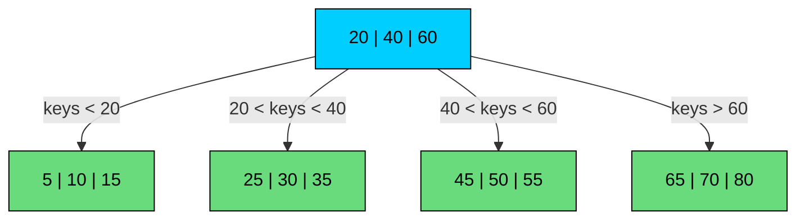
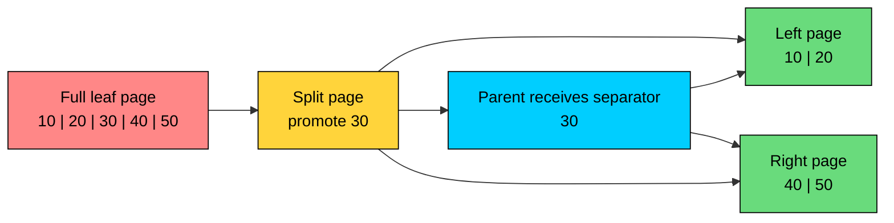
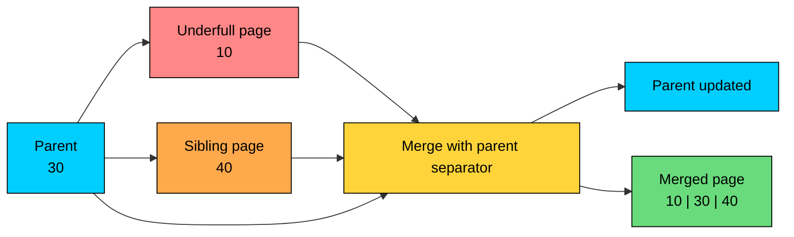
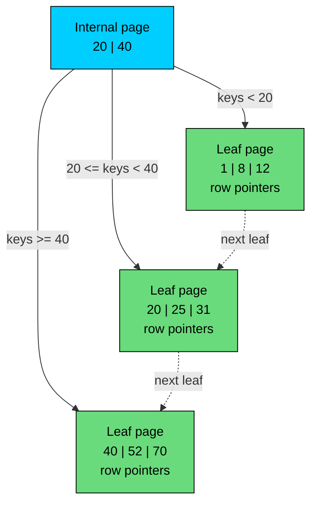

When you run a query like this:

`SELECT * FROM users WHERE id = 42`

the database can avoid scanning the whole table if it has a useful index. It searches the index, follows a small number of page pointers, and lands close to the row it needs.

For ordinary relational database indexes, that access path is commonly built on a B-tree or a close variant such as a B+ tree.

B-trees work well because of their shape: a shallow, sorted tree whose nodes are sized around storage pages. The design fits data that is too large to treat as one in-memory structure.

A binary search tree is a good teaching data structure, but it is a poor model for database storage. A balanced binary tree with a billion keys may have around 30 levels. If each level requires a separate page read, the latency is unacceptable. A B-tree node can hold hundreds of keys, so the same index may be only 3 or 4 levels deep.

A B-tree spends a little CPU searching inside a page to avoid many expensive page reads.

---

# 1. Why We Need B-Trees

> [!PAYWALL] This content is for premium members only.

Database indexes have to match how storage behaves.

Modern systems have several layers: CPU cache, RAM, the database buffer pool, the operating system page cache, SSDs, and sometimes remote storage. The latency gap between RAM and storage is still large, even on fast NVMe drives. Random I/O is much better than it was on spinning disks, but it is not free. Reads still happen in pages, writes still modify pages, and cache misses still dominate query latency.

Database indexes are designed around pages, not individual pointers.

| Option | What Works | What Breaks for Database Indexes |
| --- | --- | --- |
| **Balanced binary tree** | Simple ordered lookups in memory. | Too many levels. Pointer-heavy layouts create poor cache and page locality. |
| **Hash table** | Fast equality lookups when the hash table is in memory. | Does not support ordered scans, prefix scans, or `ORDER BY`. Large hash indexes still suffer from random page access. |
| **Sorted array** | Excellent sequential scans and binary search. | Inserts and deletes are expensive because large ranges may need to move. |
| **B-tree / B+ tree** | Shallow ordered index built from page-sized nodes. | Writes can cause page splits, and random updates are less friendly than append-only designs such as LSM trees. |

A practical database index needs to do four things well:

1. Keep keys sorted, so equality, range, and ordered queries all have a usable access path.
2. Minimize page reads by packing many keys into each node.
3. Stay balanced as rows are inserted and deleted.
4. Work with page caches, write-ahead logging, concurrency control, and crash recovery.

B-trees were designed for exactly this environment. They are storage-aware search structures built around high fanout and page locality.

---

# 2. Introduction to B-Trees

A **B-tree** is a self-balancing, multi-way search tree. Each node stores multiple sorted keys and multiple child pointers.

In a binary tree, each node has at most two children. In a B-tree, a node may have dozens or hundreds of children, depending on the page size and key size. This high fanout keeps the tree shallow.

If an internal page can hold 200 separator keys and 201 child pointers, a three-level tree can address millions of leaf entries. A four-level tree can address hundreds of millions or billions, depending on row size and fill factor.

### Properties of a B-Tree

- Keys inside each node are stored in sorted order.
- Each internal node uses separator keys to decide which child page to follow.
- All leaves appear at the same depth, so lookup cost is predictable.
- Nodes maintain minimum occupancy rules, except for the root.
- Search, insert, and delete are **O(log n)**, but the logarithm has a large base because each node has high fanout.

In real systems, the root and upper internal pages are often cached. A lookup may touch several tree levels logically, but it may only need one or two physical storage reads if the upper levels are already in memory.

## Visualizing a B-Tree

The diagram below shows a simple B-tree where each node can hold up to 4 keys. The keys in a parent node act as separators for child ranges.

For example, values less than 20 go through the first child, values between 20 and 40 go through the second child, and so on.

Two implementation choices matter. Nodes are sized to fit a database page or filesystem block, commonly 4 KB, 8 KB, or 16 KB, so a single page read brings in many keys at once. High fanout follows from that: more keys per internal page means fewer tree levels, and fewer levels means fewer cache misses and fewer storage reads. This is the practical advantage B-trees have over pointer-heavy in-memory trees.

---

# 3. Operations in a B-Tree

B-trees maintain balance through a small set of page-level operations: search, split, merge, and redistribution.

The algorithms are easy to describe at the data-structure level, but production databases add latches, write-ahead logging, page formats, MVCC visibility, and crash recovery. The high-level mechanics are still the same.

## 3.1 Search

Searching a B-tree is a top-down walk:

1. Start at the root page.
2. Search the keys inside the page, often with binary search or a small optimized linear search.
3. If the key is found, return it or follow the associated row pointer.
4. If the key is not found and the page is internal, follow the child pointer for the matching key range.
5. Repeat until the search reaches a leaf page.

Each page access is the expensive part. Searching a few hundred keys inside a page is cheap compared with fetching another page from storage.

For an equality lookup, the tree gets you to the relevant leaf quickly. For a range lookup, the tree gets you to the first matching key, then the storage engine continues from there.

## 3.2 Insertion

An insert starts by finding the leaf page where the new key belongs.

1. Search from the root to the target leaf.
2. Insert the key in sorted order within that leaf.
3. If the leaf still has space, the operation is done.
4. If the leaf is full, split it into two pages.
5. Add a separator key to the parent so future searches can find both pages.

If the parent is also full, the split can propagate upward. If the root splits, the tree grows by one level.

The diagram below shows a node split:

Splits are the cost of keeping the tree sorted and balanced. Production engines reduce split frequency with fill factors, page free space, prefix compression, and careful handling of mostly sequential inserts.

The workload matters. Inserts into an increasing primary key tend to touch the right edge of the tree. Inserts into random UUID keys scatter across many leaf pages, which can increase cache misses and page splits. Many systems now prefer time-ordered identifiers, sequence keys, or UUID versions with better locality when write path locality matters.

## 3.3 Deletion

Deletion removes a key, then repairs the tree if a page becomes too empty.

1. Find the key.
2. Remove it from the leaf, or replace an internal separator with a neighboring key and remove the real entry from a leaf.
3. If a page falls below its minimum occupancy, rebalance it.

Rebalancing usually uses one of two techniques. Redistribution moves keys between neighboring pages so both end up with enough entries. Merging combines an underfull page with a sibling and updates the parent to drop the now-redundant separator.

The diagram below shows a node merge:

Databases do not always merge pages immediately after every delete. Immediate merging can create churn when a page is deleted from and inserted into repeatedly. Many engines leave free space for future writes and rely on vacuuming, cleanup, or background maintenance to reclaim space.

The textbook B-tree describes correctness. The storage engine decides when cleanup is worth the I/O.

---

# 4. Limitations of B-Trees

B-trees are a strong default for read-heavy and mixed OLTP workloads, with clear costs under write-heavy access patterns.

1. **Random writes:** Updating a B-tree usually means modifying pages in place. Under heavy write load, that can create random I/O and page contention.
2. **Page splits:** Inserts into full pages require splits. Splits write multiple pages and update parent metadata.
3. **Write amplification:** A small logical update can dirty an entire page, plus WAL records and possibly parent pages.
4. **Fragmentation:** Random inserts and deletes can leave pages partially filled or physically scattered.
5. **Range scans in plain B-trees:** If records are stored throughout the tree, range scans may need more navigation than necessary.

These tradeoffs explain why many write-heavy systems use LSM-tree storage engines instead. LSM trees batch writes into sorted immutable files and compact them later. They trade cheaper writes for more complex reads and background compaction.

B-trees remain widely used because they give predictable point lookups, efficient range scans, mature concurrency behavior, and good performance for the mixed read/write workloads common in transactional systems.

---

# 5. Introduction to B+ Trees

A **B+ tree** is a B-tree variant optimized for database indexes.

It makes two practical changes. Internal pages store only separator keys and child pointers, never full row data, which keeps the upper levels dense and the tree shallow. Leaf pages hold the actual index entries and are linked in key order, so range scans can move sideways instead of climbing back to the root.

B+ trees fit database indexes well.

Internal pages stay small and dense, so the tree has high fanout. Leaf pages contain all searchable entries in sorted order. Once a range scan reaches the first matching leaf entry, it can move across leaf pages sequentially instead of repeatedly traversing from the root.

For example:

`SELECT * FROM orders WHERE user_id = 123 ORDER BY created_at DESC LIMIT 50`

With a matching composite B+ tree index, the database can seek to the first matching key and read the next entries in index order. This avoids scanning all orders for the user and sorting them after the fact.

---

# 6. B-Tree vs. B+ Tree Comparison

| Feature | B-Tree | B+ Tree |
| --- | --- | --- |
| **Data placement** | Search keys and associated records or pointers may appear in internal and leaf nodes. | Full index entries live at the leaf level. Internal nodes guide navigation. |
| **Internal node density** | Lower when internal nodes carry payload data. | Higher because internal nodes mostly hold separator keys and child pointers. |
| **Point lookups** | Efficient. A match may be found before reaching a leaf. | Efficient, but lookups normally continue to the leaf. |
| **Range scans** | Works, but can require more tree navigation depending on layout. | Very efficient because leaf pages are ordered and linked. |
| **Duplicate separator keys** | Less common because keys may be stored once with data. | Common because internal separator keys can repeat keys stored in leaves. |
| **Typical use** | Filesystem metadata and some storage structures. | Default shape for many relational database indexes and key-value storage engines. |

In practice, database documentation may say "B-tree" even when the implementation has B+ tree characteristics such as linked leaf pages and payloads stored only at the leaf level. The exact page format is database-specific.

---

# 7. Real-World Use Cases

B-trees and B+ trees show up wherever systems need ordered access to large datasets with predictable latency.

#### **1. MySQL InnoDB**

InnoDB stores table data in a clustered B+ tree organized by the primary key.

The leaf pages of the clustered index contain the row data. A lookup by primary key can navigate directly to the page containing the row.

Secondary indexes are also B+ trees, but their leaf entries store the secondary key plus the primary key value. If a query needs columns not present in the secondary index, InnoDB uses that primary key value to look up the row in the clustered index.

This design makes primary-key lookups and primary-key range scans efficient. It also means primary key choice matters. A wide or random primary key increases secondary index size and can hurt write locality.

#### **2. PostgreSQL**

PostgreSQL's default `btree` index is a B-tree family implementation with linked leaf pages and high-concurrency behavior based on well-known B-tree techniques.

Unlike InnoDB, PostgreSQL tables are heap-organized by default. A B-tree index entry points to a tuple location in the heap rather than storing the full row in the index leaf.

PostgreSQL B-tree indexes support multi-column indexes, unique indexes, expression indexes, partial indexes, ordering operators, deduplication for repeated values, and index-only scans when visibility information allows it.

The index structure is only part of PostgreSQL performance. MVCC visibility, heap access, table bloat, vacuum behavior, and statistics all affect whether a B-tree index is fast for a given query.

#### **3. SQLite**

SQLite stores database content in B-tree structures inside a single database file.

Tables are stored as table B-trees, usually keyed by `rowid`. Indexes are stored as separate index B-trees. A lookup through a secondary index often finds the indexed key first, then uses the rowid or primary key to fetch the table record.

Because SQLite is embedded, the B-tree is also part of its file format and transaction behavior. Page size, cache size, and access pattern can make a visible difference for large local databases.

#### **4. Filesystems: NTFS, HFS+, and APFS**

Filesystems use B-tree-like structures because directories and metadata also need ordered lookup and range traversal.

NTFS uses B+ tree-like indexes for directory entries and other metadata indexes, while cluster allocation is tracked separately in dedicated bitmap metadata. HFS+ uses B-trees for its core metadata files, including the catalog file and the extents overflow file. APFS uses copy-on-write B-tree structures for filesystem metadata, which fits cleanly with its snapshot and crash-consistency model. The details vary, but the reason is the same: ordered metadata lookup has to stay fast as the filesystem grows.

#### **5. Retrieval and AI systems**

Retrieval systems commonly combine multiple index types.

An embedding search path may use an approximate nearest neighbor index for vector similarity, while B-tree indexes handle metadata filters such as `tenant_id`, `document_id`, `created_at`, `status`, or access-control fields.

For example, a RAG service might first restrict candidates to one tenant and a recent time window using ordinary database indexes, then run vector search over the eligible document chunks. B-trees are not the vector search structure, but they still sit on the critical path for filtering, catalog lookup, deduplication, and job state.

---

# 8. Practical Design Notes

When you design or tune a system that uses B-tree indexes, these are the details that matter most:

1. **Index for queries, not columns.** A B-tree index should match the filters, joins, and ordering used by real queries.
2. **Column order matters.** In composite indexes, equality conditions usually come before range conditions, and ordering requirements should be considered deliberately.
3. **Keep hot indexes narrow.** Wider keys reduce fanout, increase memory pressure, and make writes more expensive.
4. **Prefer locality for write-heavy primary keys.** Random keys can scatter writes across the tree. Sequential or time-ordered keys often behave better, although they can create right-edge contention at very high concurrency.
5. **Do not overapply the left-prefix rule.** It is still a useful starting point, but modern optimizers may use skip scans, bitmap scans, index intersection, or other access paths depending on the database.
6. **Measure with execution plans.** The optimizer may choose a table scan over an index if the filter is not selective or if the index would require too many random heap reads.
7. **Watch maintenance costs.** Extra indexes slow writes, consume cache, increase storage, and make vacuuming or compaction more expensive.

B-trees are a careful compromise between ordered access, page locality, update cost, and operational simplicity. That compromise has held up for decades because it maps well to how production storage systems are built.

---

# Quiz
