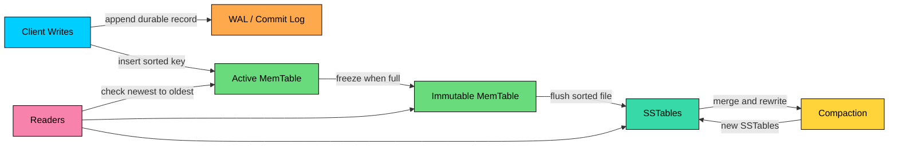
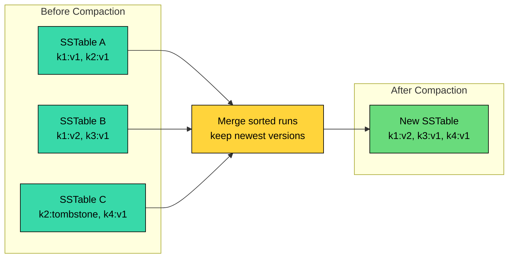

B+ trees are a strong default for read-heavy and mixed OLTP workloads. They keep index entries ordered in page-sized structures, which gives predictable point lookups and efficient range scans.

The write path has a cost. Updating a B+ tree usually modifies pages in place. An insert may dirty a leaf page, update parent pages, write WAL records, and occasionally split pages. That cost is manageable for many transactional systems, but it becomes painful when the workload is dominated by sustained writes.

LSM trees take a different approach. They buffer writes in memory, write sorted immutable files to disk, and merge those files in the background.

LSM trees make foreground writes cheap by moving much of the cleanup work to reads and compaction.

This design powers storage engines such as LevelDB, RocksDB, Cassandra, ScyllaDB, Bigtable, and HBase. It also appears in search systems through immutable segment designs such as Lucene, although Lucene is not a general-purpose key-value LSM tree.

---

# 1. The Problem with B+ Trees

> [!PAYWALL] This content is for premium members only.

B+ trees update data in sorted page structures. That gives fast reads, but writes can touch scattered pages.

#### **Random I/O**

An insert or update may need to touch the leaf page containing the key, one or more parent pages if a split occurs, the write-ahead log, and any metadata pages the storage engine maintains. On hard disks, random I/O is dominated by seeks. On SSDs, random I/O is much better, but it still creates write amplification inside the device and competes for I/O bandwidth. A storage engine that turns small writes into larger sequential writes can still win, especially under sustained ingestion.

#### **Write Amplification**

Databases write and cache data in pages, commonly 4 KB, 8 KB, or 16 KB. Updating a 100-byte value may dirty an entire page. The database also writes WAL records, updates indexes, and may rewrite pages again during checkpoints or background flushing.

Write amplification means the system writes more physical data than the application logically changed.

The cost shows up as lower sustained write throughput, more SSD wear, higher checkpoint and flush pressure, and more page and latch contention under concurrency.

#### **Page Splits and Contention**

B+ trees stay balanced through page splits and merges. These operations are correct and well understood, but they add variance to write latency.

An insert into a full leaf page splits the page and adds a separator to the parent. If the parent is full, the split can cascade upward. Storage engines reduce this with fill factors, right-edge insert optimizations, and careful latching, but the core issue remains: the write path modifies existing sorted pages.

LSM trees were designed to avoid that foreground pattern.

---

# 2. The Core Idea Behind LSM Trees

An **LSM tree** stores recent writes in memory and later flushes them to disk as immutable sorted files.

Instead of updating an old disk page in place, the engine writes a newer version of the key somewhere else. Older versions are cleaned up later during compaction.

The basic flow is:

1. Append the write to a durable log.
2. Insert the key into an in-memory sorted structure.
3. Flush that memory structure to disk as a sorted immutable file.
4. Merge immutable files in the background to remove overwritten values and tombstones.

This turns many small random updates into fewer larger writes. The foreground write path becomes short and predictable, assuming the WAL and memory buffer have capacity.

These savings come with costs elsewhere. Reads may have to check multiple places to find the newest value. Range scans may have to merge several sorted files. Compaction consumes CPU, I/O, and temporary disk space. Deletes leave tombstones until compaction can safely remove the old data.

An LSM tree is a deliberate tradeoff: lower write amplification in exchange for more read work and more space overhead.

---

# 3. Components of an LSM Tree

An LSM tree is a storage design made from several cooperating pieces.



### 1. MemTable

The **MemTable** is the active in-memory write buffer. It keeps keys sorted so the engine can later flush them as a sorted file.

Common implementations include skip lists, balanced trees, hash indexes paired with sorted flush logic, or specialized memory structures tuned for the engine. LevelDB and RocksDB commonly use skip-list based memtables, but many engines expose alternatives.

When the MemTable reaches a size threshold, the engine freezes it as an immutable MemTable and creates a new active MemTable for incoming writes. A background thread flushes the immutable MemTable to disk.

### 2. WAL or Commit Log

Before acknowledging a durable write, the engine appends it to a **write-ahead log** or **commit log**.

The log protects recent writes that are still only in memory. If the process crashes, the engine can replay the log and rebuild the MemTable.

Durability depends on configuration. Some systems fsync every write. Others group commits, sync periodically, or allow relaxed durability for higher throughput. The LSM design does not remove this choice; it makes the durable write path mostly append-oriented.

### 3. SSTables

An **SSTable** means **Sorted String Table**. It is an immutable sorted file written from a MemTable flush or a compaction.

An SSTable typically holds sorted key-value entries grouped into data blocks, an index block that maps keys to block offsets, Bloom filters or similar membership filters, and trailing metadata with offsets and checksums. Because SSTables are immutable, readers can access them without worrying about in-place changes. Updates create newer entries elsewhere. Deletes create tombstones.

### 4. Compaction

Compaction merges SSTables into new SSTables. As it walks the merged data, the engine keeps the newest version of each key, discards overwritten versions, drops tombstones once it is safe to do so, and rewrites the surviving entries into fewer or better-organized files.

Compaction is the engine's cleanup mechanism. It is also the main source of background I/O. If compaction cannot keep up with writes, read latency rises, disk usage grows, and the database may eventually throttle writes.

---

# 4. How an LSM Tree Works

The LSM write path is optimized for ingestion. The read path is optimized with filters, indexes, caches, and compaction.

## 4.1 The Write Path

The write path for a key-value engine usually looks like this:

```mermaid
flowchart TD
    Write["Write key = value"]:::primary
    WAL["Append to WAL"]:::orange
    Mem["Insert into MemTable"]:::green
    Ack["Acknowledge client"]:::primary
    Full{"MemTable full""}:::yellow
    Freeze["Freeze MemTable"]:::green
    Flush["Flush sorted SSTable"]:::purple
    Compact["Background compaction"]:::yellow

    Write --> WAL
    WAL --> Mem
    Mem --> Ack
    Mem --> Full
    Full -->|"no"| Mem
    Full -->|"yes"| Freeze
    Freeze --> Flush
    Flush --> Compact

    classDef primary fill:#00ceff,stroke:#000,color:#000
    classDef orange fill:#ffa94d,stroke:#000,color:#000
    classDef green fill:#69db7c,stroke:#000,color:#000
    classDef purple fill:#38d9a9,stroke:#000,color:#000
    classDef yellow fill:#ffd43b,stroke:#000,color:#000
```

1. **Append to the WAL:** The engine records the write in an append-only log.
2. **Insert into the MemTable:** The key is inserted into the active in-memory sorted structure.
3. **Acknowledge the client:** The engine returns success after the configured durability condition is met.
4. **Flush to SSTable:** When the MemTable fills, the engine writes it to disk as an immutable sorted file.
5. **Compact in the background:** The engine later merges SSTables to control read cost and space usage.

Because the foreground path never touches old data pages, LSM engines can absorb high write rates.

It does not mean all writes are free or always sequential. WAL appends are sequential, flushes are large writes, and compaction rewrites data later. Under pressure, compaction can become the bottleneck.

## 4.2 The Read Path

Reads are more involved because the newest value for a key may exist in several places.

A point lookup usually checks:

1. The active MemTable.
2. Immutable MemTables waiting to flush.
3. Recent SSTables.
4. Older SSTables, usually organized by level, tier, or time window.

The engine searches from newest to oldest so it can return the latest value. Bloom filters help skip SSTables that definitely do not contain the key. Block indexes help jump to the right block inside a file. Block caches keep hot data in memory.

Tombstones matter. If the newest record for a key is a tombstone, the key is deleted even if older SSTables still contain previous values.

Range scans are more expensive than point lookups because the engine may need to merge sorted iterators from several MemTables and SSTables. Compaction strategy has a large effect on how many files participate in that merge.

---

# 5. Compaction in LSM Trees

Compaction is where the LSM tradeoff becomes visible.

Each MemTable flush creates a new SSTable. Without compaction, the database would accumulate too many of them. Point lookups would have to check more filters and indexes, range scans would merge more iterators, old versions would keep consuming disk, and tombstones would stay visible to reads forever.

Compaction reads SSTables and writes new SSTables.



During compaction, duplicate key versions are resolved, overwritten values are dropped, tombstones are purged once the engine's safety rules allow it, and smaller files are combined into larger, better-organized ones.

Compaction improves future reads, but it costs CPU, I/O, and temporary disk space. Tuning an LSM engine is largely the work of choosing where to spend that cost.

### 1. Leveled Compaction

Leveled compaction organizes SSTables into levels. Lower levels contain newer data. Higher levels contain more data.

The key property is limited overlap. In mature levels, SSTables usually cover non-overlapping key ranges. That reduces the number of files a point lookup must check.

Leveled compaction is a strong fit for read-heavy key-value workloads, workloads with many updates or deletes, and systems that need predictable point-read latency. The cost is higher write amplification, heavier background compaction I/O, and the risk of write stalls if compaction falls behind sustained ingestion.

RocksDB uses leveled compaction as its default style.

### 2. Tiered or Size-Tiered Compaction

Tiered compaction waits until several similarly sized SSTables accumulate, then merges them into a larger SSTable.

This reduces write amplification because data is rewritten less aggressively. The tradeoff is read amplification: overlapping SSTables may force a read to consult more files.

Tiered compaction suits write-heavy workloads, mostly append-only data, and any workload where Bloom filters or time ordering keep read costs manageable. In exchange, reads have to consult more files, large merges need more temporary disk space, and tombstone cleanup becomes less predictable.

Cassandra's legacy Size-Tiered Compaction Strategy follows this pattern. Cassandra 5.0 introduced Unified Compaction Strategy, which can behave like leveled, tiered, or time-window compaction depending on configuration.

### 3. Time-Window Compaction

Time-window compaction groups SSTables by time windows.

This works well for TTL-heavy time-series data where old windows become immutable and eventually expire. It performs poorly when old time windows continue receiving updates, because those updates spread versions across windows and make reads and tombstone cleanup more expensive.

The natural fit is metrics, logs, event streams, and any data with predictable TTL expiration. The costs are a weaker fit for random updates, the need to size time windows carefully, and the read amplification that late-arriving data introduces when it lands in already-compacted windows.

---

# 6. Real-World Examples

LSM designs are common in systems built for sustained ingestion, large key-value datasets, and distributed storage.

### LevelDB and RocksDB

**LevelDB** is an embedded key-value store from Google built around an LSM design.

**RocksDB** started as a LevelDB-derived engine and added production features such as multi-threaded compaction, column families, more compaction styles, rate limiting, Bloom filters, prefix seek support, and SSD-oriented tuning.

RocksDB is widely used as an embedded state store in infrastructure systems. Examples include stream processing state, metadata stores, blockchain nodes, and services that need local durable key-value storage.

### Apache Cassandra and ScyllaDB

Cassandra and ScyllaDB use LSM-style storage engines on each node.

The write path is:

1. Append to a commit log.
2. Apply the update to a MemTable.
3. Flush MemTables to SSTables.
4. Compact SSTables in the background.

The modern compaction story is more nuanced than "Cassandra uses tiered compaction." Cassandra supports STCS, LCS, TWCS, and newer UCS. ScyllaDB has also invested heavily in compaction strategies and shard-aware execution. The choice depends on read patterns, write rate, TTLs, deletes, repair behavior, and available disk headroom.

### Google Bigtable and Apache HBase

Bigtable popularized the LSM-style architecture for distributed sorted maps.

Writes go to an in-memory structure and a commit log. Data is later flushed into immutable files. Background compaction merges files and removes obsolete versions.

HBase follows a similar model with MemStores and HFiles. Operationally, HBase performance depends heavily on flush sizing, compaction settings, region layout, and the underlying distributed filesystem.

### Elasticsearch and Apache Lucene

Lucene uses immutable index segments. New documents are buffered, flushed into new segments, and later merged into larger segments.

This is LSM-inspired rather than a direct key-value LSM tree. The pattern is similar: immutable files on the write path, background merges for cleanup, and search across multiple segments until merging reduces fragmentation.

### Retrieval and AI Systems

AI retrieval systems often use multiple storage paths.

Vector indexes handle nearest-neighbor search. LSM-backed stores often handle metadata, document chunks, ingestion state, deduplication keys, cache entries, checkpoints, and feature/state tables.

For example, a RAG ingestion pipeline may write millions of chunk records, embeddings, permissions, and processing states. An LSM-backed engine is a good fit for that write-heavy path. The serving path may still need careful indexing, compaction tuning, and caching to keep metadata filters and range reads predictable.

---

# 7. LSM Trees vs. B+ Trees

The choice between an LSM tree and a B+ tree is a workload decision, not a ranking.

B+ trees update sorted pages in place. LSM trees buffer writes and merge immutable files later.

| Feature | LSM Tree | B+ Tree |
| --- | --- | --- |
| **Foreground writes** | Fast append-oriented path through WAL and MemTable. | Updates sorted pages in place. |
| **Write amplification** | Depends heavily on compaction strategy. Can be low with tiered compaction or high with leveled compaction. | Comes from page writes, WAL, checkpoints, and page splits. Usually more direct and predictable. |
| **Point reads** | May check MemTables and several SSTables, reduced by Bloom filters and compaction. | Usually follows a small number of tree pages. |
| **Range scans** | Requires merging sorted runs. Good when compaction limits overlap, expensive when many files overlap. | Strong fit because leaf pages are ordered and linked. |
| **Deletes** | Written as tombstones, then removed later during compaction. | Can remove or mark entries in place, with cleanup depending on the engine. |
| **Background work** | Heavy. Compaction is central to performance. | Present, but usually less central than LSM compaction. |
| **Best fit** | Sustained writes, time-series data, logs, distributed key-value storage, embedded state stores. | Transactional workloads, read-heavy indexes, predictable range queries, mixed OLTP. |

Use an LSM tree when the system must absorb sustained writes and can afford compaction management.

Use a B+ tree when predictable reads, range scans, and simpler operational behavior matter more than maximum ingestion throughput.

Many production systems use both. A database may use a B+ tree for relational indexes, RocksDB for local state, Lucene segments for search, and a vector index for embeddings. Good system design starts by matching each access pattern to the storage structure whose cost profile fits it best.

---

# Quiz
