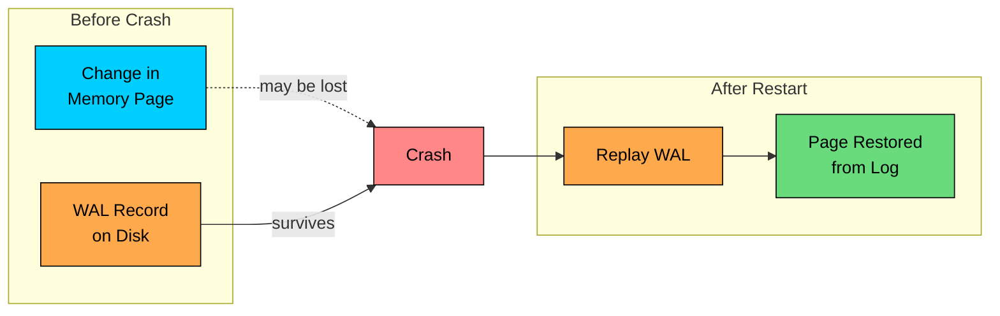
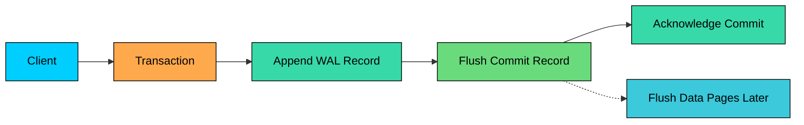
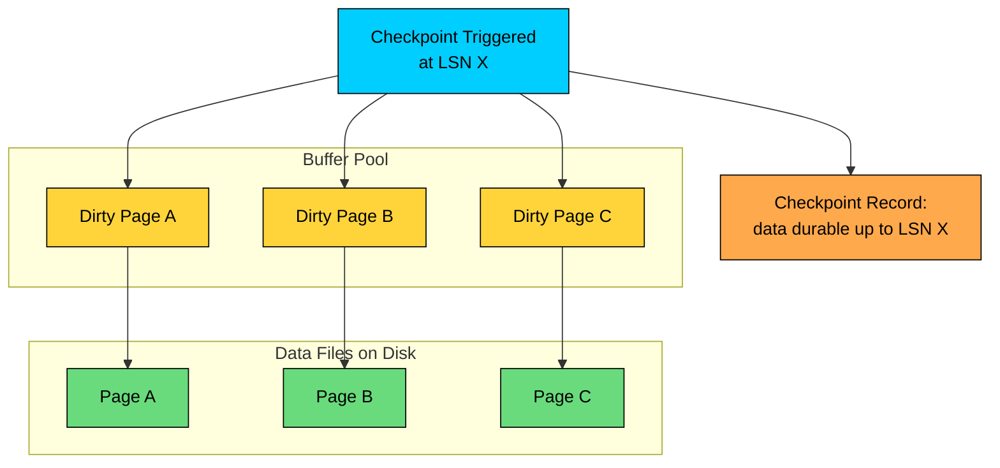
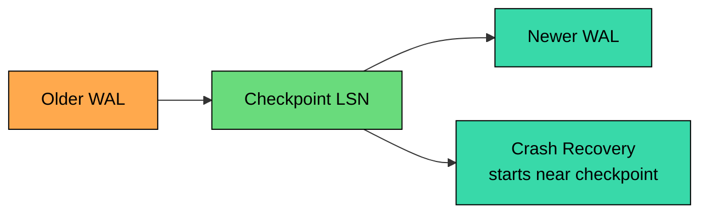
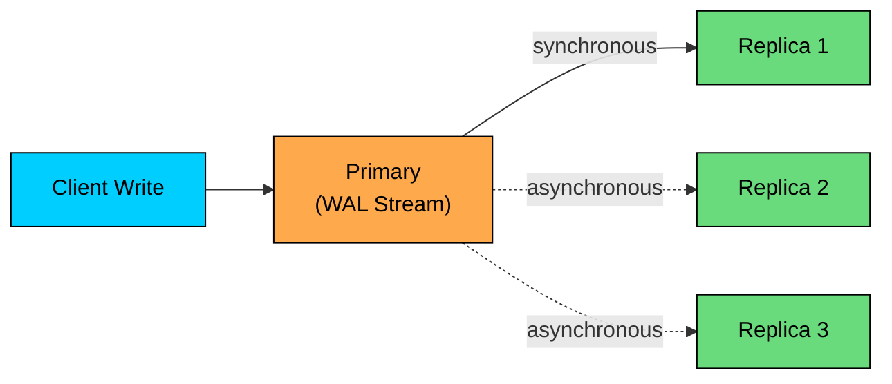
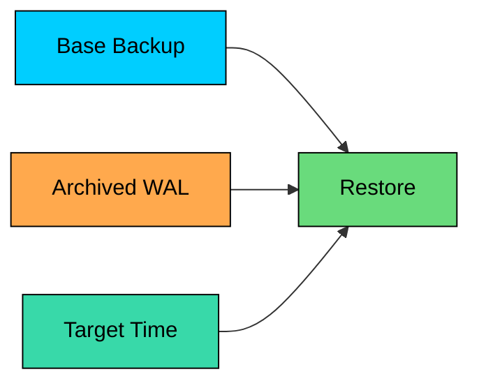

Durability means that once a database reports a transaction as committed, the system should be able to recover that transaction after a failure.

That sounds simple, but it hides several hard questions. What if the database process crashes" What if the operating system restarts before dirty pages have been flushed" What if the disk itself fails, or a replica is behind, or someone deletes the wrong rows by mistake"

Different mechanisms protect against different failures. Write-ahead logging protects against crashes on one machine. Checkpointing makes crash recovery faster. Replication protects against machine or disk loss. Backups and point-in-time recovery protect against corruption, bad deploys, and human mistakes.

Durability is a stack of safeguards rather than one feature.

---

# Write-Ahead Logging

> [!PAYWALL] This content is for premium members only.

Write-ahead logging, usually shortened to WAL, is the core technique used by many databases to survive crashes.

The rule is:

> Write the change to the log before relying on the changed data page.

The database does not need to immediately rewrite every affected table and index page when a transaction commits. Instead, it records enough information in an append-only log to redo the change during recovery.

### Basic Commit Flow

Typical sequence:

1. The database appends a WAL record describing the change.
2. The change is applied to pages in the in-memory buffer pool.
3. At commit, the commit record is flushed according to the database durability settings.
4. The database acknowledges the commit.
5. Modified data pages are written to the main data files later, after their WAL records are already durable.

This is the write-ahead rule: a WAL record must become durable before the page it describes. Recovery can then replay the WAL if the main data files are behind.

### WAL Records

A WAL record usually includes a log position, transaction identifier, operation type, and enough page or row information to recover the change.

`LSN` means log sequence number. It identifies a position in the WAL and lets the database track which changes have been flushed, replicated, checkpointed, or replayed.

### Why the Log Comes First

If the database wrote data pages first and crashed halfway through, the on-disk files might contain a partial update with no reliable way to finish or undo it.

With WAL, the database can recover by reading the log:

- Redo committed changes that were not fully written to data files.
- Ignore or undo incomplete transactions.
- Bring indexes and table pages back to a consistent state.

Different engines implement recovery differently, but the principle is the same: the log is the authoritative crash recovery record.

---

# Flushing and Fsync

Writing to a file is not the same as making data durable.

Modern operating systems cache writes in memory. Storage devices may also cache writes internally. A database must deliberately force critical log records through those caches before it can make a strong durability promise.

This is where calls such as `fsync`, `fdatasync`, or platform-specific equivalents come in. They ask the operating system to persist file contents and metadata needed for recovery.

A write travels through several layers before it counts as durable. It first lands in the database's own buffer, then gets handed to the OS page cache, then the OS flushes it toward storage, and only when the storage device acknowledges the flush is the data truly safe from a power loss.

The last step matters. If the server loses power before the WAL commit record is durable, an acknowledged transaction may be lost unless the database was configured to wait for durable flushes.

Some systems allow weaker settings for speed. For example, they may flush on a short interval instead of every commit. That improves throughput, but it creates a small window where recent acknowledged writes can disappear after a crash.

Durability settings are product decisions as much as database internals.

---

# Checkpointing

WAL protects committed changes, but the log cannot grow forever.

Without checkpointing, crash recovery might need to replay an enormous amount of WAL. Restart time would grow, disk usage would grow, and old log segments could not be removed safely.

A checkpoint records that data files are durable up to a known WAL position.

### Dirty Pages

A dirty page is an in-memory page that has changed but has not yet been written to the main data files.

During checkpointing, the database writes enough dirty pages to disk so that recovery can start from a recent point rather than from the beginning of the log.

Many production databases use fuzzy checkpoints. The database keeps serving reads and writes while checkpointing is in progress, so the checkpoint is tied to a specific WAL position rather than a full stop-the-world snapshot.

### What Checkpoints Do

Checkpointing helps with three things. It shortens recovery time, because less WAL has to be replayed after a crash. It bounds disk usage, because old WAL segments can be recycled or archived once they are no longer needed for crash recovery. And it smooths out write pressure, because dirty pages are flushed steadily in the background instead of all at once after a restart.

Checkpointing works alongside WAL, not in place of it.

---

# Crash Recovery

After a crash, the database does not assume the data files are perfectly current. It uses the WAL and checkpoint metadata to repair state.

Typical recovery flow:

1. Find the most recent usable checkpoint.
2. Read WAL records after that checkpoint.
3. Redo committed changes that may be missing from data files.
4. Handle incomplete transactions according to the engine's recovery model.
5. Open the database for normal traffic.

| Failure Moment | Recovery Behavior |
|----------------|-------------------|
| Crash before commit record is durable | Transaction is not considered committed |
| Crash after commit record is durable | Transaction is replayed if needed |
| Crash after data page is written but before checkpoint | WAL still provides the recovery truth |
| Crash during checkpoint | Previous checkpoint and WAL are used |

The important idea is that committed state is reconstructed from durable log records, not from wishful thinking about which pages happened to reach disk.

---

# Replication

WAL and checkpointing protect one database instance from process crashes and many operating system crashes. They do not by themselves protect against losing the machine, the disk, or the entire availability zone.

Replication keeps additional copies of data on other nodes.

### Asynchronous Replication

In asynchronous replication, the primary commits locally and returns success before one or more replicas have confirmed the write.

This is fast and common. The risk is data loss during failover. If the primary dies after acknowledging a commit but before the replica receives it, the promoted replica may not have that transaction.

Asynchronous replication improves availability and read scaling, but it does not guarantee zero data loss.

### Synchronous Replication

In synchronous replication, the primary waits for at least one replica, or a quorum of replicas, before acknowledging the commit.

This reduces the chance of losing an acknowledged commit when the primary fails. The tradeoff is latency and availability. If replicas are slow or unreachable, commits may slow down or stop depending on the configuration.

| Replication Mode | Commit Latency | Data Loss Risk on Primary Failure |
|------------------|----------------|-----------------------------------|
| Asynchronous | Lower | Recent acknowledged commits can be missing on replicas |
| Synchronous to one replica | Higher | Lower, if that replica survives |
| Quorum replication | Higher | Depends on quorum size and failure pattern |

Replication is about copies. It does not remove the need for WAL on each node.

---

# Distributed Databases

Distributed databases combine local durability with replicated writes.

A write may involve:

1. Appending to a local commit log.
2. Updating an in-memory structure.
3. Sending the write to replica nodes.
4. Waiting for acknowledgments based on the requested consistency level.
5. Returning success to the client.

Systems such as Cassandra-style databases expose this tradeoff directly. A write can wait for one replica, a quorum, or all replicas. Waiting for more replicas can improve durability of acknowledged writes, but it increases latency and can reduce availability during failures.

| Acknowledgment Choice | Trade-off |
|-----------------------|-----------|
| One replica | Lower latency, higher risk if that replica fails before others receive the write |
| Quorum | Balanced latency and durability for many replicated systems |
| All replicas | Stronger write durability, lower availability when any replica is unavailable |

The right setting depends on the data. A page view counter and a payment record should not use the same durability assumptions.

---

# Backups and Point-in-Time Recovery

Replication is not a backup.

If an application deletes important rows, replication may faithfully copy the deletion to every replica. If a bug corrupts data, replicas may store the same corruption. If credentials are compromised, an attacker may damage both primary and replica.

Backups protect against these cases.

A durable backup setup usually has several moving parts. Base backups are full copies of the database files at a point in time. Incremental backups or archived WAL fill in the changes since the most recent base backup. Point-in-time recovery combines the two to restore the database to a specific moment, ideally right before a mistake was made. Restore testing proves the backups work. And a retention policy keeps enough history around to recover even when a problem is detected late.

For production systems, backup quality is measured by restore quality. An untested backup is an assumption.

---

# What Durability Does Not Mean

Durability is often misunderstood.

| Misconception | Reality |
|---------------|---------|
| "Committed means impossible to lose" | It means protected within the system's configured guarantees |
| "Replication replaces backups" | Replicas copy mistakes too |
| "A write call means data is on disk" | It may only be in memory unless flushed |
| "More replicas means correct data" | Replicas can contain stale, corrupt, or deleted data |
| "Durable means available" | Durable data may still be temporarily unreachable |

Durability must be discussed with failure modes and recovery goals.

Two terms shape every durability conversation. **RPO** (recovery point objective) is how much data loss is acceptable. **RTO** (recovery time objective) is how long recovery is allowed to take. A system with low RPO and low RTO costs more to build and operate than one that can tolerate some loss and slower recovery.

---

# Summary

Databases provide durability by layering several mechanisms.

| Mechanism | Protects Against |
|-----------|------------------|
| WAL or commit log | Process crash, dirty pages not yet flushed |
| Fsync or durable flush | Loss of OS-cached writes |
| Checkpointing | Long recovery time and unbounded log growth |
| Replication | Machine, disk, or zone failure |
| Backups and PITR | Human mistakes, bad deploys, corruption, delayed detection |
| Checksums and validation | Some forms of storage corruption |

Every layer above serves one principle: acknowledge a write only after the system has enough durable evidence to recover it. The hard part is deciding how much evidence is enough for the workload.

For a cache, losing recent writes may be acceptable. For payments, inventory, identity, or compliance data, the durability bar is much higher.

---

# Quiz
