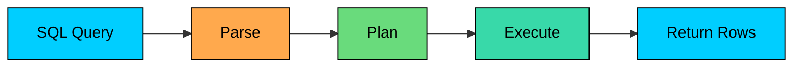
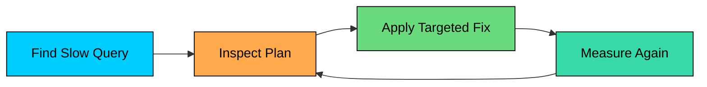

Many database scaling problems start as query problems.

A missing index, an unbounded result set, an accidental table scan, or an N+1 query pattern can make a healthy database look overloaded. Before adding replicas, sharding, caching layers, or new infrastructure, the right first question is what work the query is making the database do.

**Query optimization** is the practice of making database reads and writes do less unnecessary work while still returning correct results.

Good optimization starts with measurement, execution plans, and a clear understanding of the access pattern.

---

# 1. Why Query Optimization Matters

Slow queries hurt more than the single request that triggered them.

A bad query increases page latency, consumes CPU, memory, and disk I/O, holds locks longer than necessary, evicts useful data from the buffer cache, slows down unrelated queries on the same database, and forces larger machines that increase cloud spend.

At small scale, a query that scans 50,000 rows may not matter. At high traffic, the same query running hundreds of times per second can dominate the database.

The goal is to make important queries predictable, bounded, and aligned with the way the database can access data efficiently. Cleverness is rarely the point.

---

# 2. How Query Execution Works

Before optimizing SQL, understand the basic path a database follows.

### 2.1 Parse

The database checks syntax and resolves table and column names.

### 2.2 Plan

The optimizer chooses a plan: which indexes to use, join order, join algorithm, sort strategy, aggregation strategy, and how many rows it expects at each step.

The optimizer makes decisions using statistics. If statistics are stale or the data distribution is unusual, the plan can be poor.

### 2.3 Execute

The database runs the plan. This is where it reads pages, filters rows, joins tables, sorts data, aggregates results, and returns rows to the client.

Most query tuning is about improving the plan or reducing the amount of work done during execution.

---

# 3. The Optimization Workflow

> [!PAYWALL] This content is for premium members only.

Do not start by adding indexes randomly.

Use a simple workflow:

1. Find the slow or expensive query.
2. Measure it with realistic data.
3. Inspect the execution plan.
4. Identify what work is expensive.
5. Change one thing.
6. Measure again.

Use slow query logs, database monitoring, APM traces, and production-like load tests to find the real offenders. Optimizing a query that runs once a day is less valuable than fixing a query that runs 5,000 times per minute.

---

# 4. Read the Execution Plan

Execution plans show how the database intends to run a query.

In PostgreSQL, use:

In MySQL, use:

When reading a plan, look for:

| Signal | What It May Mean |
|--------|------------------|
| Full table scan on a large table | Missing index or filter is not selective |
| Many rows read, few rows returned | Predicate is applied too late or index is ineffective |
| Expensive sort | Missing index that matches `ORDER BY` |
| Bad row estimates | Stale statistics or skewed data |
| Nested loop over many rows | Join order or join index problem |
| Temporary table / disk spill | Sort or aggregation exceeds memory |

Be careful with `EXPLAIN ANALYZE` in PostgreSQL. It runs the query rather than only planning it, so do not use it casually on destructive statements or very expensive production queries.

---

# 5. Use Indexes Deliberately

Indexes are the most common query optimization tool, but they are not free.

They speed up reads by giving the database a faster access path. They slow down writes because every insert, update, and delete may also update indexes.

### 5.1 Index High-Value Filters

If a query frequently filters by `email`, an index can avoid scanning the whole table.

This is useful because `email` is usually selective: one value matches few rows.

Indexing a low-selectivity column such as `status` may be less useful if half the table has the same status. The database may still prefer a table scan.

### 5.2 Use Composite Indexes for Common Access Patterns

Consider an activity log that powers a per-account audit screen:

A useful index is:

The database can locate the account's events already ordered by newest first. It does not need to read all of the account's events and sort them separately.

Column order matters. A composite index on `(occurred_at, account_id)` would not serve this query as well because the query first narrows by `account_id`.

### 5.3 Consider Covering Indexes

A covering index contains all columns needed by a query, allowing the database to answer from the index without reading the table row in some engines and plans.

Covering indexes can be effective for hot read paths, but they make indexes wider and more expensive to maintain.

### 5.4 Avoid Index Sprawl

Too many indexes create real costs: writes get slower, disk and memory usage climb, migrations take longer, and the planner has more options to consider, not all of them useful.

Keep indexes tied to real queries. Remove unused indexes after confirming with database metrics.

---

# 6. Write Sargable Predicates

A predicate is **sargable** when the database can use an index to search for matching rows.

The common mistake is applying a function to the indexed column.

Other patterns that often hurt index usage:

- `LOWER(email) = 'alice@example.com'` without an expression index
- `WHERE amount + tax > 100`
- `LIKE '%term'` on a normal B-tree index
- Implicit type casts between strings, numbers, and timestamps

If you need a function-based search often, consider an expression index where your database supports it.

---

# 7. Return Less Data

The fastest row is the one you do not read, sort, send, deserialize, or render.

### 7.1 Avoid `SELECT *` on Hot Paths

This reduces disk reads, memory use, network transfer, and application deserialization cost. It also makes covering indexes more realistic.

### 7.2 Add Bounds

Unbounded queries are dangerous.

`LIMIT` is most useful when paired with an index that supports the filter and sort. Without the right index, the database may still scan or sort many rows before returning 50.

### 7.3 Prefer Keyset Pagination for Deep Pages

Offset pagination gets slower as the offset grows because the database still has to walk past skipped rows.

Keyset pagination works best with a stable sort key and a matching index.

---

# 8. Optimize Joins

A well-indexed join with a bounded result set is usually fine. Joins become a problem when they are unbounded or run without supporting indexes.

For a join like this:

Useful indexes might include:

Join optimization usually comes down to filtering early so fewer rows reach the join, indexing the foreign keys used in joins, avoiding huge intermediate result sets, selecting only the columns the caller needs, and keeping table statistics current.

Watch for accidental many-to-many joins. If a query unexpectedly returns far more rows than expected, the problem may be data shape or join conditions, not the database engine.

---

# 9. Avoid N+1 Queries

N+1 queries happen when the application makes one query to fetch a list, then one additional query for each item.

Example:

That is 101 database round trips for 100 orders.

Better options:

Or batch the second query:

ORMs can hide N+1 problems, so use query logging in development and tracing in production.

---

# 10. Handle Aggregation, Sorting, and Search Carefully

Some operations are expensive because they process large working sets.

### 10.1 Aggregations

This query may scan a large part of `orders` every time:

If it powers a dashboard, consider a summary table or materialized view refreshed on a schedule.

### 10.2 Sorting

Sorting large result sets can spill to disk. A matching index can avoid or reduce sorting.

### 10.3 Text Search

This pattern is usually slow on large tables:

A normal B-tree index cannot efficiently search for a term in the middle of a string. Better options include:

- Full-text indexes
- Trigram indexes where supported
- A dedicated search engine for ranking, stemming, faceting, and relevance

Match the search technology to the access pattern.

---

# 11. Caching and Precomputation

Sometimes the best query optimization is not running the query on every request.

Caching is a good fit when the result is read often, the underlying data changes less often than it is read, some bounded staleness is acceptable, and there is a clear invalidation or expiration strategy.

Use materialized views or summary tables when the expensive work is a repeated aggregation or join that can be refreshed outside the request path.

Caching is not a substitute for correctness. Do not cache data that must always reflect the latest write unless you have a safe invalidation design.

---

# 12. Common Mistakes

Avoid these traps:

- Adding indexes without checking the execution plan.
- Treating every full table scan as bad. Small tables can be faster to scan.
- Using `SELECT *` on hot paths.
- Adding `LIMIT` without an index that supports the filter and sort.
- Using offset pagination for deep pages.
- Ignoring N+1 queries hidden by an ORM.
- Running heavy reports on the primary during peak traffic.
- Letting statistics get stale after large data changes.
- Optimizing rare queries while ignoring frequent ones.
- Hiding a bad query behind a cache without fixing the underlying issue.

---

# Summary

Query optimization is about making the database do less unnecessary work.

Start with measurement. Find the expensive query, inspect the execution plan, and identify whether the problem is row count, missing indexes, bad predicates, joins, sorts, aggregation, network transfer, or repeated execution.

The most common wins are straightforward: add the right index, make predicates sargable, return fewer columns and rows, avoid deep offsets, batch N+1 queries, and precompute expensive repeated aggregations.

Optimize deliberately. A small, well-measured query change often delays far more expensive architecture work.

---

# Quiz
