Most production applications read more than they write.

Users browse products, open feeds, refresh dashboards, search orders, and view profiles far more often than they create or update data. A 10:1 read-to-write ratio is common. Some social, media, and catalog systems are much higher.

At first, one database server can handle everything. Eventually, the read traffic starts to compete with writes for CPU, memory, disk I/O, locks, and network bandwidth.

One tempting answer is: "add another database."

That answer only works if you are careful about who is allowed to write. If two independent databases accept writes for the same data, they can disagree. Resolving those conflicts is much harder than scaling reads.

Read replicas solve the easier part of the problem. One primary database stays responsible for writes, one or more copies follow it, and read traffic moves to those copies whenever stale data is acceptable.

The pattern is simple, but the details matter. Read replicas improve read throughput and availability, but they also introduce replication lag, stale reads, routing decisions, and failover concerns.

This chapter explains how read replicas work, where they help, where they hurt, and how experienced teams use them safely.

---

# 1. What Are Read Replicas"

> [!PAYWALL] This content is for premium members only.

A read replica is a database copy that follows changes from a primary database and serves read queries. In the usual setup, replicas are treated as read-only by the application.

The primary accepts writes. Replicas receive the primary's changes through replication and apply those changes locally. In the common setup, application writes go to the primary, while many reads can go to replicas.

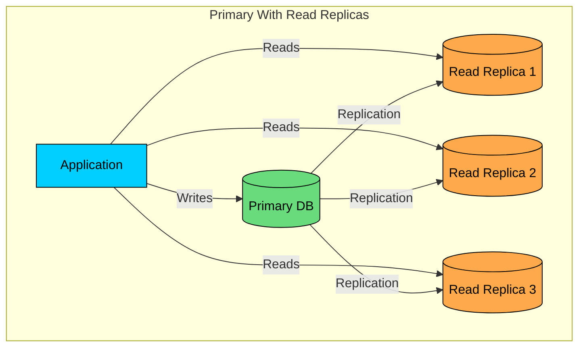

This is usually called **single-leader replication**, **primary-replica replication**, or **primary-standby replication**. Modern MySQL documentation uses source/replica terminology. PostgreSQL commonly uses primary/standby for physical streaming replication and publisher/subscriber for logical replication.

The important idea is the same: one database is the source of truth for writes, and other databases follow it.

| Characteristic | What It Means |
|----------------|---------------|
| One write leader | Writes go to the primary, not to every node independently. |
| Read scaling | Many read queries can be distributed across replicas. |
| Replication lag | Replicas can be behind the primary, especially under load. |
| Operational copy | A replica can sometimes be promoted during failover, depending on setup. |
| Same data model | A normal read replica stores the same database, not a separate read model. |

The key trade-off is freshness.

When a write commits on the primary, replicas do not see it at the exact same instant. The delay may be milliseconds in the same region or much longer during load, maintenance, network problems, or cross-region replication. That delay is called **replication lag**.

Many bugs around read replicas trace back to forgetting that lag exists.

---

# 2. Why Use Read Replicas"

Read replicas are useful when your bottleneck is read traffic, read latency, isolation of heavy queries, or failover readiness.

They scale reads. A write-heavy system will not get faster just because more replicas exist.

### 2.1 Scale Read Throughput

Every database server has limits. It has a fixed amount of CPU, memory, disk bandwidth, network bandwidth, buffer cache, and connection capacity.

If your primary is spending most of its time serving reads, replicas can move that work elsewhere.

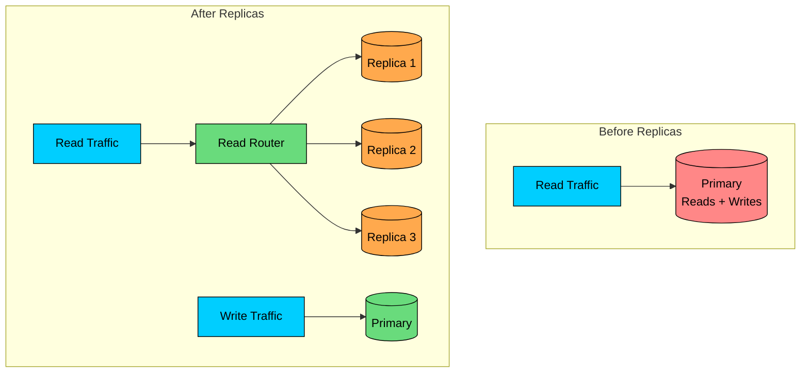

If one database can serve 10,000 read queries per second, three similar replicas may serve roughly 30,000 read queries per second.

That is a useful mental model, not a law of physics. Real scaling is limited by query shape, cache hit rate, hot rows, replica hardware, network, connection pools, and the primary's ability to generate and ship replication logs.

| Setup | Practical Read Capacity | Write Capacity |
|-------|-------------------------|----------------|
| Primary only | Limited to the primary | Limited to the primary |
| Primary + 2 replicas | Reads can be spread across 2 replicas | Still limited to the primary |
| Primary + 5 replicas | More read headroom if replicas keep up | Still limited to the primary |
| Primary + cross-region replicas | Lower local read latency | Writes still go to the primary region |

The main lesson: read replicas scale reads. They do not scale writes.

If writes are the bottleneck, you need a different approach, such as sharding, batching, queueing, data model changes, or a storage system designed for high write throughput.

### 2.2 Reduce Read Latency for Global Users

Distance matters.

If your primary database is in Virginia and a user is in Mumbai, every database round trip crosses a large physical distance. Even a trivial query can feel slow when the network path is long.

Cross-region read replicas can place data closer to users.

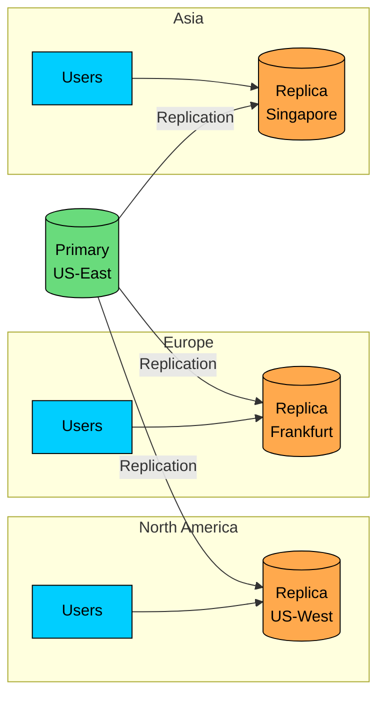

This helps read-heavy workloads such as product browsing, profile viewing, public content, dashboards, and search metadata.

The trade-off is that writes still need to reach the primary. A user far from the primary may read quickly from a nearby replica but still experience higher write latency. Cross-region replicas also tend to have more lag than same-region replicas.

Use this pattern when low-latency reads matter more than globally low-latency writes.

### 2.3 Isolate Heavy Queries

Operational queries and analytical queries behave very differently.

An application request might fetch one user by ID. A reporting job might scan millions of rows, sort large result sets, or aggregate years of data. If both run on the primary, the report can slow down customer traffic.

A common pattern is to dedicate one replica to heavy read-only workloads.

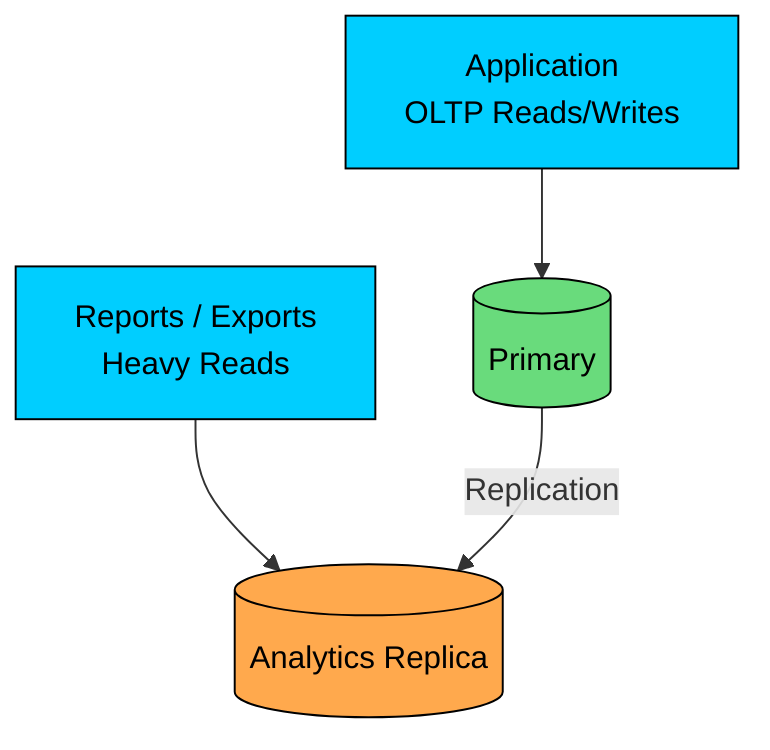

This does not turn a transactional database into a full data warehouse, but it can protect the primary from expensive reads.

For serious analytics, teams often move data into systems such as ClickHouse, BigQuery, Snowflake, Redshift, or a lakehouse. A read replica is a useful first step, not always the final architecture.

### 2.4 Improve Failover Options

A replica can often be promoted if the primary fails.

That makes replicas useful for high availability, though promotion is not automatic safety on its own. It requires monitoring, promotion logic, client reconnection, DNS or service discovery updates, and fencing to ensure the old primary cannot come back and accept writes.

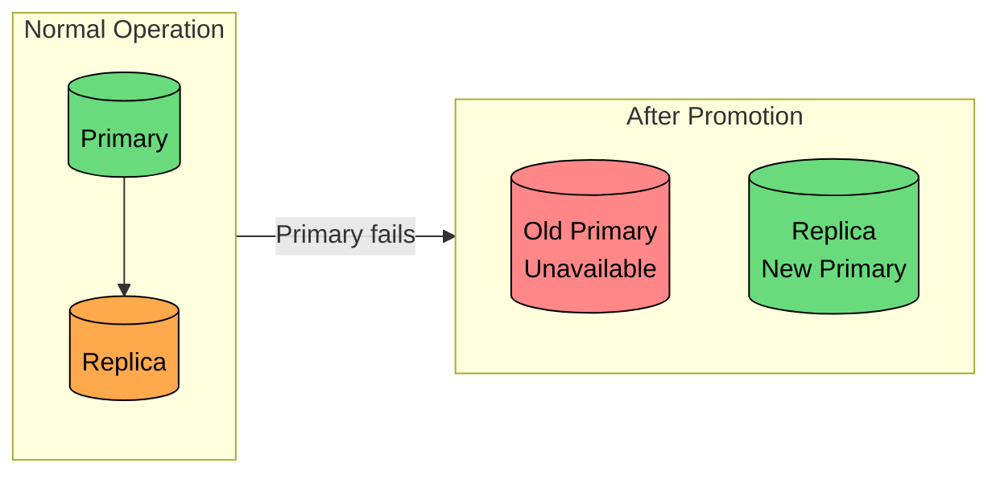

With asynchronous replication, a replica may be missing the most recent commits at the moment of failure. Promoting it can lose those writes.

With carefully configured synchronous replication, the system can reduce or avoid that loss for acknowledged commits, but write latency and availability are affected. The details depend on whether the replica has merely received, flushed, or applied the change before the primary acknowledges the write.

---

# 3. How Read Replication Works

Most database replication starts from the database's change log.

In PostgreSQL this is the write-ahead log (WAL). In MySQL it is the binary log plus replication metadata. Other databases use different names, but the pattern is similar: the primary records changes in an ordered log, and replicas consume that log.

### 3.1 The Basic Flow

When a transaction changes data, the database records enough information to recover or reproduce that change. Replication sends those change records to replicas.

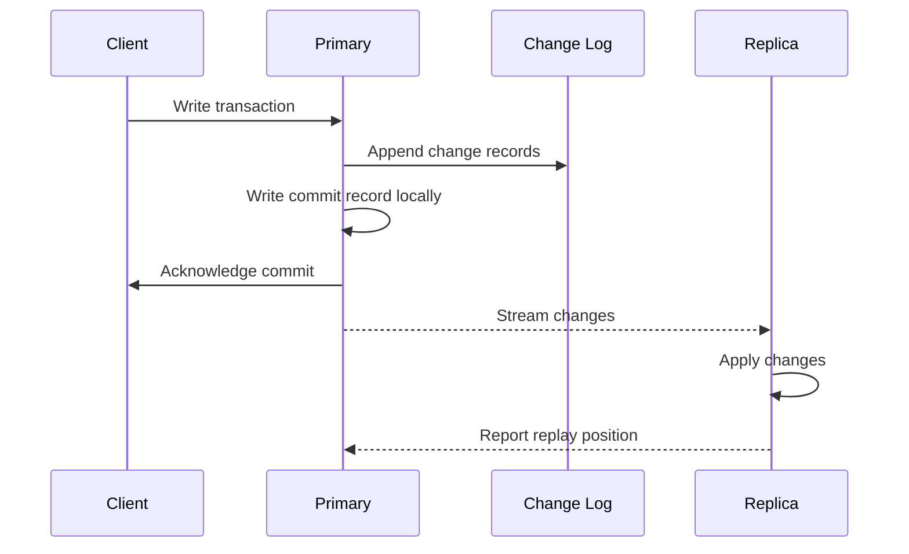

Replicas track their position in the log. PostgreSQL uses log sequence numbers (LSNs). MySQL uses binary log file positions or GTIDs, depending on configuration.

That position matters because it lets a replica reconnect and resume from the right place after a network interruption or restart.

| Concept | Meaning |
|---------|---------|
| Change log | Ordered record of committed changes on the primary. |
| Replication position | Bookmark showing how far a replica has received or applied changes. |
| Replication stream | Network connection or pull loop that transfers changes. |
| Apply/replay | The replica updates its local copy using received changes. |

Do not assume "received" means "queryable." A replica may have received a change but not yet flushed or applied it. Some systems expose separate positions for sent, written, flushed, and replayed changes.

### 3.2 Physical vs Logical Replication

There are two broad ways to replicate changes: physical and logical.

#### Physical Replication

Physical replication ships low-level storage changes. The replica is a copy of the database cluster at the storage level.

This is fast and reliable for high availability because it reproduces the primary closely. It also captures indexes, schema changes, and internal database state.

The trade-off is flexibility. A physical replica usually needs to be compatible with the primary at a low level: database engine, major version, storage format, page size, and configuration details must match. You generally cannot replicate only a few tables or maintain a different schema on the replica.

PostgreSQL streaming replication is the classic example.

#### Logical Replication

Logical replication ships higher-level changes, such as "insert this row into this table" or "update these columns."

Logical replication is more flexible. You can replicate selected tables, feed change data capture pipelines, move data between versions, or copy data into a different storage system.

The trade-off is that it has more rules. Schema changes, sequences, large transactions, unsupported data types, and conflict handling can require extra care. Logical replication is its own model with its own constraints, not a slower variant of physical replication.

| Need | Better Fit |
|------|------------|
| Fast standby for failover | Physical replication |
| Simple full read replica | Physical replication is often simplest |
| Selected tables or filtered data | Logical replication |
| Cross-version migration | Logical replication |
| Feeding analytics or search systems | Logical replication / CDC |

### 3.3 Asynchronous vs Synchronous Replication

The most important replication choice is when the primary acknowledges a write.

#### Asynchronous Replication

With asynchronous replication, the primary commits locally and returns success before replicas have caught up.

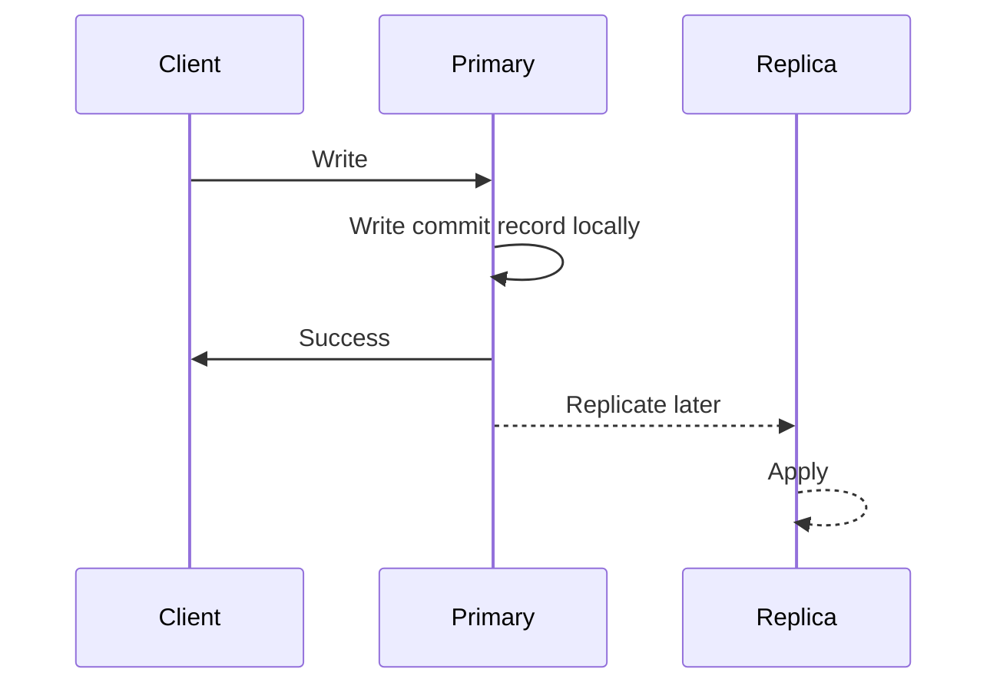

This keeps write latency low and allows writes to continue even if replicas are slow or temporarily disconnected.

The cost is a data-loss window. If the primary fails after acknowledging a write but before any promoted replica has the write, that acknowledged write can be lost.

This is the default choice for many read-replica setups because it gives the best read scaling with the least impact on writes.

#### Synchronous Replication

With synchronous replication, the primary waits for one or more replicas before acknowledging the write.

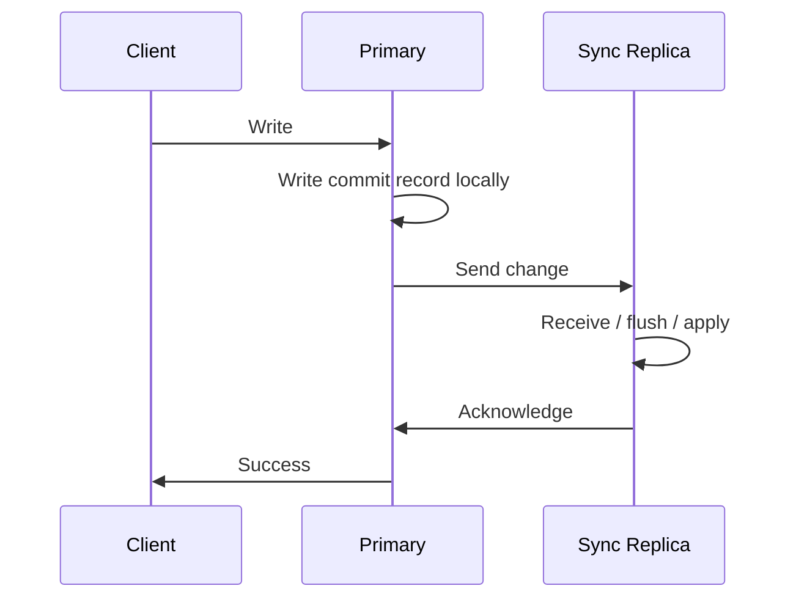

This can protect acknowledged writes during failover, depending on the exact durability level. Some systems wait until a replica receives the log. Others wait until it flushes to durable storage. Some can wait until the replica applies the change and can serve it to reads.

The cost is write latency and availability. If the synchronous replica is slow, far away, or unreachable, writes can slow down or stop.

| Aspect | Asynchronous | Synchronous |
|--------|--------------|-------------|
| Write latency | Lower | Higher |
| Replica outage impact | Usually does not block writes | Can block writes |
| Recent write loss on failover | Possible | Reduced or avoided if configured correctly |
| Typical use | Read scaling | Critical failover durability |

A common production design is one synchronous or semi-synchronous replica in the same region for failover, plus asynchronous read replicas for scaling and regional reads.

---

# 4. Replication Lag

Replication lag is the gap between the primary's latest committed change and what a replica has applied.

Lag is normal. Large or growing lag is a production problem.

### 4.1 Why Lag Happens

Lag appears whenever the primary generates changes faster than a replica can receive and apply them.

| Cause | What Happens |
|-------|--------------|
| Network delay | Changes take time to reach the replica, especially across regions. |
| Large transactions | A big update creates a large amount of log data to ship and replay. |
| Replica overload | Read queries compete with replication replay for CPU, memory, and I/O. |
| Slow storage | The replica cannot write changes as fast as the primary produces them. |
| Maintenance or restart | A replica that was offline must catch up from its last position. |
| Locks or long queries | Replay can be delayed behind conflicting reads or schema operations. |

Sustained lag growth is the dangerous signal. It means the replica cannot catch up without intervention, while a brief spike usually resolves on its own.

### 4.2 Read-Your-Writes

The most visible problem is read-your-writes consistency.

A user updates their profile. The write succeeds on the primary. Then the application reads the profile from a replica that has not replayed the update yet. The user sees the old value and thinks the save failed.

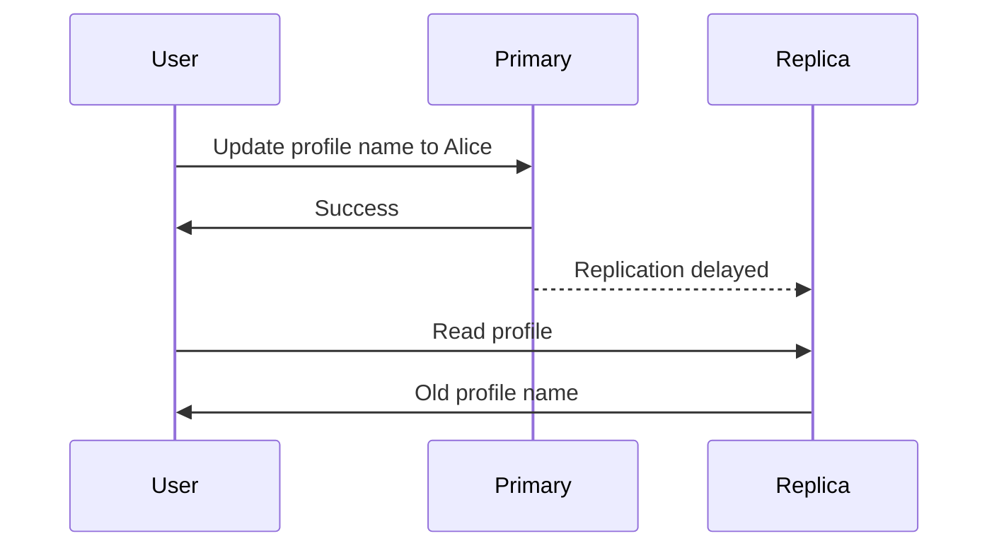

There are three common fixes.

#### Read from the Primary After a Write

After a user writes, route that user's reads to the primary for a short window.

The window should be based on observed lag, not guesswork. If p99 replication lag is usually under 2 seconds, a 5-10 second window may be enough. If lag can be minutes, the system has a deeper operational problem.

#### Track the Replication Position

For more precision, record the commit position after a write and read only from replicas that have caught up to that position.

This is more complex, but it avoids sending users to the primary longer than necessary.

#### Always Use the Primary for Critical Reads

Some reads should not come from replicas at all:

- Authorization checks
- Account balance decisions
- Inventory reservation decisions
- Idempotency checks
- Reads immediately inside a write workflow

For these paths, freshness matters more than offloading the primary.

### 4.3 Monotonic Reads

Another problem happens when a user reads from different replicas on different requests.

Replica A may be current. Replica B may be behind. If the first request goes to A and the second goes to B, the user can see data move backward.

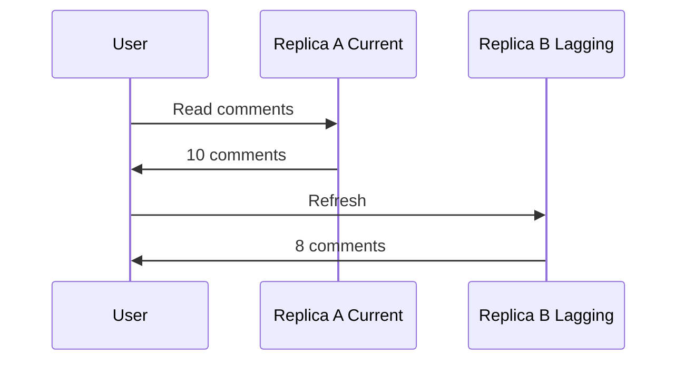

Sticky routing helps. Send the same user, tenant, or session to the same replica while it is healthy.

This does not make the data fresh. It makes the user's view stable. If a replica fails and users are reassigned, monotonic reads can still be temporarily violated.

### 4.4 Measuring Lag

Lag should be measured and alerted on. Do not wait for users to discover stale reads.

In PostgreSQL, the primary exposes replication state through `pg_stat_replication`.

In MySQL, replication status includes lag and error details.

Useful alerts include:

| Metric | Why It Matters |
|--------|----------------|
| Replay lag | Shows how stale reads can be. |
| Lag trend | Increasing lag means the replica is falling behind. |
| Replication stopped | The replica is no longer receiving or applying changes. |
| Replica CPU, memory, and I/O | Explains whether replay is resource constrained. |
| Oldest replication slot or retained log | Prevents disk from filling when replicas fall behind. |

Thresholds are business-specific. A social feed may tolerate seconds. A trading or inventory workflow may tolerate none on critical reads.

---

# 5. Read Routing Strategies

Creating replicas is only half the job. The application still needs to decide where each read goes.

Good routing answers two questions:

1. Can this read tolerate stale data"
2. If yes, which healthy replica should serve it"

### 5.1 Simple Read/Write Split

The simplest setup sends all writes to the primary and all reads to a replica pool.

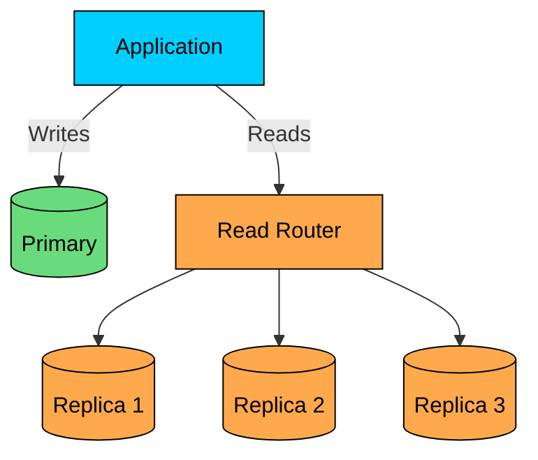

This is easy and gives maximum offload, but it exposes users to stale reads. It works best for content, public listings, old records, metrics, recommendations, and other data where a small delay is acceptable.

### 5.2 Query-Based Routing

More mature systems route based on the type of query.

| Read Type | Destination |
|-----------|-------------|
| User's own data immediately after write | Primary |
| Payment, inventory, permission checks | Primary |
| Product catalog browsing | Replica pool |
| Public profile viewed by others | Replica pool |
| Exports and reports | Dedicated analytics replica |

This keeps correctness-sensitive reads on the primary while still moving safe reads away from it.

The cost is discipline. Query routing rules become part of the application's correctness model. New code paths need to classify reads intentionally.

### 5.3 Session-Based Routing

Session-based routing is a practical way to provide read-your-writes consistency.

When a user performs a write, store a timestamp or replication position in their session. For a short period after that write, route their reads to the primary or to a replica that has caught up.

If you store this state in process memory, you need application-server stickiness. In larger deployments, store it in a shared system such as Redis so any application server can make the same routing decision.

This pattern is common because it matches user expectations without permanently sending all reads to the primary.

### 5.4 Proxies and Connection Pools

Routing can live in application code, an ORM, a database driver, or a proxy layer.

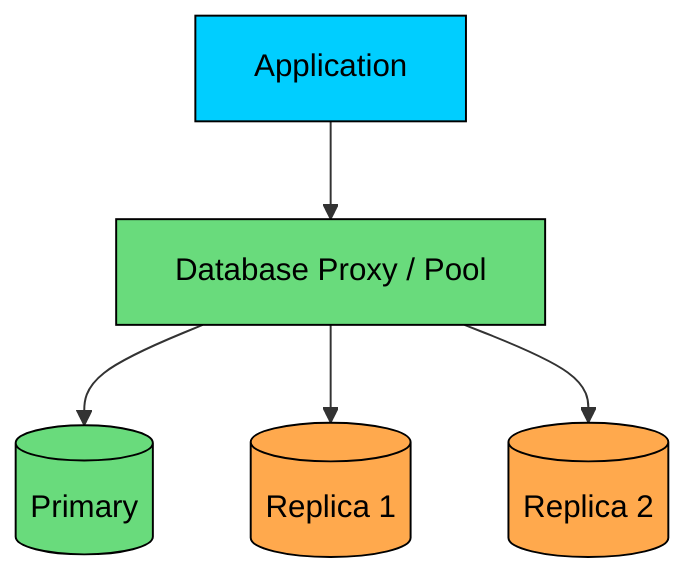

| Tool | Common Use |
|------|------------|
| ProxySQL | MySQL routing, pooling, query rules |
| PgBouncer | PostgreSQL connection pooling |
| pgpool-II | PostgreSQL pooling and read load balancing |
| HAProxy | TCP-level load balancing and health checks |
| Cloud database proxies | Managed pooling, failover, and endpoint routing |

Proxies reduce application complexity, but they are infrastructure too. They need redundancy, observability, configuration management, and careful failover behavior.

Also be careful with transactions. A transaction should not write to the primary and then read from a stale replica inside the same logical unit of work. Keep transactional reads and writes on the same connection to the primary unless the database system explicitly supports something stronger.

---

# 6. When Not to Use Read Replicas

Read replicas are useful, but they are often added too early.

Use them when they solve the actual bottleneck. Avoid them when they only make the system more complicated.

### 6.1 Write-Heavy Workloads

If the primary is overloaded by writes, read replicas do not fix the core problem.

Every write still goes to the primary. Replicas also need to receive and apply those writes, so a write-heavy workload can make replicas lag badly.

Better options may include:

- Sharding by tenant, user, region, or another stable key
- Batching small writes
- Moving append-heavy data to a log or time-series store
- Using queues to absorb spikes
- Redesigning indexes that make writes expensive
- Separating command and query models with CQRS

### 6.2 Reads That Require Fresh Data

Some reads make business decisions. They should usually go to the primary or to a strongly consistent store.

Examples:

- "Does this user have permission""
- "Is this idempotency key already used""
- "Is inventory still available""
- "What is the current account balance""
- "Has this password reset token been revoked""

Replicas are fine for many supporting reads, but they are a poor default for correctness-critical decisions.

### 6.3 Problems Caused by Bad Queries

If the primary is slow because of missing indexes, inefficient joins, unbounded scans, or excessive `SELECT *`, replicas may only spread bad behavior across more machines.

Try the boring fixes first:

1. Inspect slow queries.
2. Add or adjust indexes.
3. Use `EXPLAIN` to confirm query plans.
4. Add pagination and limits.
5. Reduce unnecessary columns and joins.
6. Cache stable, frequently read data.
7. Increase primary resources if that is the simplest reliable fix.

Many systems get a lot further with query tuning and caching than with premature replication.

### 6.4 Cost and Operational Overhead

A replica is a full database server, not a free cache.

It adds compute cost, storage cost, network cost, backup considerations, patching, monitoring, alerting, capacity planning, and failover testing. Cross-region replicas can be especially expensive because of data transfer and duplicate storage.

That cost may be worth it, but the decision should rest on real traffic numbers.

---

# 7. Practical Rules of Thumb

Use these guidelines when designing with read replicas:

1. Start with a clear reason: read throughput, regional read latency, heavy-query isolation, or failover.
2. Keep writes on the primary unless the database is explicitly designed for multi-writer replication.
3. Treat replica reads as potentially stale.
4. Send correctness-critical reads to the primary.
5. Use read-your-writes routing after user writes.
6. Prefer sticky routing when monotonic reads matter.
7. Monitor lag, replication health, and retained log growth.
8. Test failover before production incidents.
9. Do not use replicas as a substitute for indexing, query tuning, or caching.

---

# Summary

Read replicas are one of the most common patterns for scaling read-heavy databases.

They work by keeping one primary responsible for writes and maintaining one or more read-only copies that follow the primary through replication. This can increase read throughput, reduce global read latency, isolate heavy queries, and provide a path for failover.

The trade-off is consistency. Replicas can lag behind the primary, so applications must route reads carefully. User-facing flows often need read-your-writes behavior. Critical decisions should read from the primary. Analytics and public browsing can usually tolerate replicas.

The best systems use read replicas deliberately. They know which reads can be stale, measure lag continuously, and practice failover. That discipline is what separates a replica setup that helps the database from one that creates confusing production bugs.

---

# Quiz
