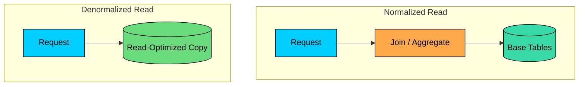
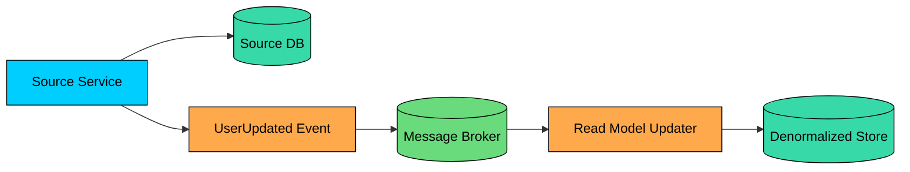

Normalized databases are excellent for correctness. Each fact lives in one place, updates are clean, and constraints are easier to enforce.

But many high-traffic systems eventually hit read paths where normalized data is too expensive to assemble on every request. A page may need data from five tables. A dashboard may aggregate millions of rows. A service may need data owned by another service, but calling that service on every request is too slow or too fragile.

**Denormalization** is the deliberate duplication of data to make reads faster, simpler, or more independent.

Done deliberately, denormalization is a considered trade-off rather than bad database design. Reads get faster and writes get more complex. Storage usage increases, and data can become stale or inconsistent.

Good denormalization starts with a clear read problem and a plan for keeping duplicated data trustworthy.

---

# 1. The Problem With Normalization

In a normalized relational schema, data is split into related tables to reduce duplication.

For a blog application, a clean schema might look like this:

- `users(id, name, email)`
- `posts(id, user_id, title, body, created_at)`
- `comments(id, post_id, user_id, text, created_at)`

This design is good for writes. If a user changes their name, you update one row in `users`.

To display a post with comments and comment author names, the database joins the tables:

At small scale, this is perfectly fine. Even at large scale, joins can be fine when tables are indexed well and the result set is bounded.

The problem appears when the read path becomes expensive or operationally awkward, for example when a query joins large tables and runs too often, aggregates too many rows at request time, crosses shards or service boundaries, or shows up on a low-latency page where the normalized version has too much variability. Reads that happen far more often than the underlying data changes are also a strong signal.

Denormalization is one way to move work away from the critical read path.

The normalized design remains the source of truth. The denormalized copy exists because a specific read path needs a faster shape.

---

# 2. What Denormalization Means

> [!PAYWALL] This content is for premium members only.

Denormalization means storing derived, duplicated, prejoined, or precomputed data so reads can avoid expensive work.

Using the blog example, you might store the author's display name directly on comments:

Now the comment list can read from `comments` without joining `users`.

That sounds easy, but it changes the write model. If a user changes their display name, what should happen to old comments"

Both answers can be valid. If `author_name` is meant as a historical snapshot, old comments should keep the old name. If it must always reflect the current profile name, every duplicate has to be updated when the source changes.

Denormalization is a data semantics decision as much as a performance one.

| Normalized Data | Denormalized Data |
|-----------------|-------------------|
| One source of each fact | Some facts are copied |
| Simpler writes | Faster or simpler reads |
| Less storage | More storage |
| Stronger integrity by default | Requires synchronization rules |
| Queries may need joins | Queries match the read pattern |

The best denormalized designs are explicit about which copy is authoritative and which copies are derived.

---

# 3. Common Denormalization Patterns

Denormalization shows up in several forms. The right pattern depends on what you are optimizing.

### 3.1 Duplicated Reference Fields

Store a few fields from a related entity directly on another record.

Examples:

- Store `customer_email` on an order.
- Store `product_name` and `product_sku` on an order item.
- Store `author_name` on a comment.

This avoids joins and also preserves history when the copied value is meant to be a snapshot.

For example, an order should often preserve the product name and price at the time of purchase. If the product is renamed later, historical invoices should keep the original name on record.

### 3.2 Precomputed Counters

Instead of counting rows on every request, store the count.

Examples:

- `post.comment_count`
- `video.view_count`
- `product.review_count`
- `user.follower_count`

Counters are simple conceptually, but they get tricky under concurrency, retries, deletes, spam filtering, and backfills. High-write counters may need batching, sharding, or asynchronous reconciliation.

### 3.3 Summary Tables

Summary tables store aggregated results for reports and dashboards.

Instead of scanning the full `orders` table to build a dashboard, the application reads one row per day.

Summary tables can be maintained by scheduled jobs, triggers, stream processors, or change data capture. Materialized views are a database-managed version of this idea.

### 3.4 Embedded Documents

Document databases often denormalize by embedding related data together.

This can make reads fast because one document contains the data needed by the page.

The trade-off is document growth and update complexity. Embedding works well for bounded child data. It is dangerous when the embedded collection can grow without limit, such as millions of comments on a popular post.

### 3.5 Search Documents

Search systems usually use denormalized documents.

A product search index may combine product fields, category names, brand names, price, review statistics, availability, and ranking signals into one searchable document.

This avoids joining relational tables during search. It also lets the search engine optimize for text matching, faceting, filtering, and ranking.

The search index is typically a derived read model rather than the source of truth, and it must be updated whenever the source data changes.

### 3.6 Service-Local Copies

In microservices, a service may keep a local copy of data owned by another service.

For example, a `Shipping` service might keep product dimensions locally even though the `Product` service owns the product catalog. That avoids calling the `Product` service during every shipping-rate calculation.

This improves latency and availability, but the copy can be stale. The owning service must publish changes, and the consuming service must apply them reliably.

---

# 4. Keeping Denormalized Data Consistent

Consistency is the harder design problem in any denormalized system. The real question is how each duplicated copy will stay correct enough for the purpose it serves.

### 4.1 Same-Transaction Updates

If the source and denormalized copy live in the same database, you may update both in one transaction.

This is simple and strongly consistent within that database.

The downside is write amplification. Every write now updates more rows and indexes. Hot counters can also become contention points.

### 4.2 Event-Driven Updates

For cross-service or cross-database copies, event-driven synchronization is common.

For example, `UserService` publishes `UserUpdated`. Feed, Search, and Recommendation systems consume that event and update their local copies.

This creates eventual consistency. The source changes first. The denormalized copies catch up later.

Use idempotent consumers because events can be retried. Include enough information in events to update the copy safely. Track failures and dead-letter queues.

### 4.3 Outbox Pattern

The outbox pattern makes event-driven updates more reliable.

Instead of writing to the database and publishing an event as two separate operations, the service writes both the data change and an outbox row in the same transaction. A relay then publishes outbox rows to the message broker.

This avoids the classic dual-write failure where the database write succeeds, the event publish fails, and downstream denormalized copies never hear about the change.

The outbox pattern does not remove eventual consistency, but it makes change delivery much safer.

### 4.4 Change Data Capture

Change data capture, or CDC, streams changes from the database transaction log.

Tools such as Debezium can read PostgreSQL WAL or MySQL binlogs and publish row-level changes to Kafka. Downstream systems use those changes to update search indexes, caches, or read models.

CDC is useful when you want to avoid adding event-publishing logic to every write path. It still needs schema-change handling, replay support, monitoring, and idempotent consumers.

### 4.5 Periodic Rebuilds and Reconciliation

Even well-designed denormalized systems drift.

Events are missed. Bugs happen. Backfills are needed. A consumer may apply an old version of an update. A counter may be incremented twice.

Production systems often include reconciliation jobs:

- Recompute counters from source tables.
- Rebuild search documents from the source of truth.
- Compare summary tables against raw events.
- Repair rows where derived data differs from source data.

Building these jobs is part of the cost of owning duplicated data.

---

# 5. Trade-offs and Failure Modes

Denormalization should be chosen with eyes open.

| Benefit | Cost |
|---------|------|
| Lower read latency | More complex writes |
| Fewer joins at request time | More storage |
| Better fit for dashboards/search/feed reads | Stale or inconsistent copies |
| Less cross-service coupling during reads | More sync infrastructure |
| Easier reads from shards or local stores | Harder backfills and migrations |

Common failure modes:

- **Stale reads:** the copy has not received the latest source update.
- **Partial updates:** one copy updates and another does not.
- **Double application:** a retried event increments a counter twice.
- **Out-of-order events:** an older update overwrites a newer value.
- **Backfill mistakes:** historical records are rebuilt with different logic than live updates.
- **Hidden ownership:** teams forget which copy is authoritative.

The antidote is clarity:

- Define the source of truth.
- Define acceptable staleness.
- Make updates idempotent.
- Store versions or timestamps when event order matters.
- Monitor lag and failed sync jobs.
- Build a repair path.

---

# 6. When to Denormalize

Denormalize when the read benefit is clear and the consistency cost is acceptable.

Good candidates:

- High-traffic pages with repeated join-heavy reads.
- Dashboards and reports that can tolerate delayed data.
- Search indexes and recommendation systems.
- Read models for CQRS-style architectures.
- Cross-service data needed for local decisions.
- Sharded systems where cross-shard joins are too expensive.

Avoid or delay denormalization when:

- A missing index or bad query plan is the real problem.
- Reads must always reflect the latest write.
- The duplicated data changes frequently and is hard to synchronize.
- The team does not have monitoring or repair jobs for derived data.
- The read path is not important enough to justify the extra complexity.

Before denormalizing, try the simple fixes:

1. Add the right indexes.
2. Limit result sets and paginate.
3. Remove unnecessary columns from queries.
4. Check query plans with `EXPLAIN`.
5. Cache stable read results.
6. Use read replicas when the query shape is fine but the primary needs read offload.

Denormalization is powerful, but it should not be the first answer to every slow query.

---

# 7. Practical Rules of Thumb

Use these guidelines:

1. Denormalize for a specific read path, not as a general habit.
2. Keep one clear source of truth.
3. Decide whether duplicated fields are snapshots or current values.
4. Make asynchronous updates idempotent.
5. Track versions, timestamps, or sequence numbers for out-of-order updates.
6. Expose freshness when users or operators need to know it.
7. Rebuild derived data periodically or on demand.
8. Monitor sync lag, failed events, and reconciliation drift.
9. Be careful with hot counters under high write volume.
10. Document why each denormalized field exists.

---

# Summary

Denormalization intentionally duplicates or precomputes data to make reads faster, simpler, or more independent.

It is useful for read-heavy pages, dashboards, counters, search documents, service-local copies, and sharded systems where normalized reads are too expensive.

The cost is consistency. Every duplicated copy needs an update strategy, a freshness expectation, and a repair path. Without those, denormalized data slowly becomes data nobody trusts.

Use denormalization when the read path matters enough to pay that cost. Keep the source of truth clear, make synchronization reliable, and treat derived data as something that must be monitored and maintained.

---

# Quiz
