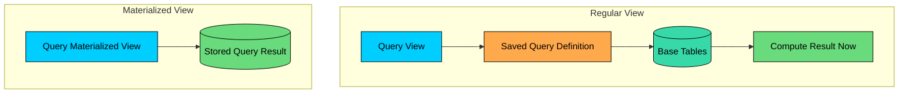
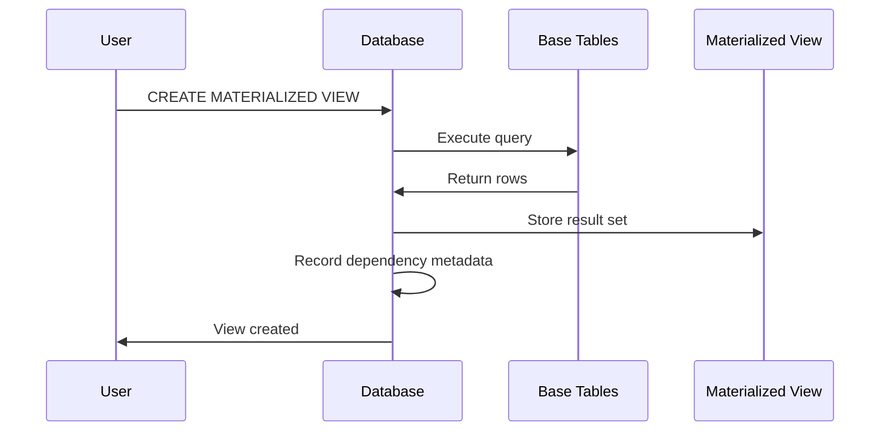
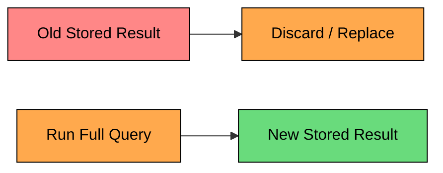
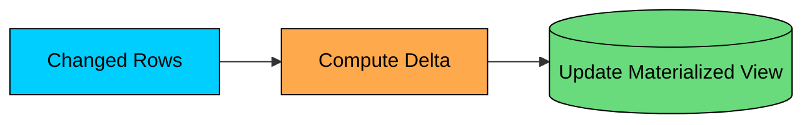
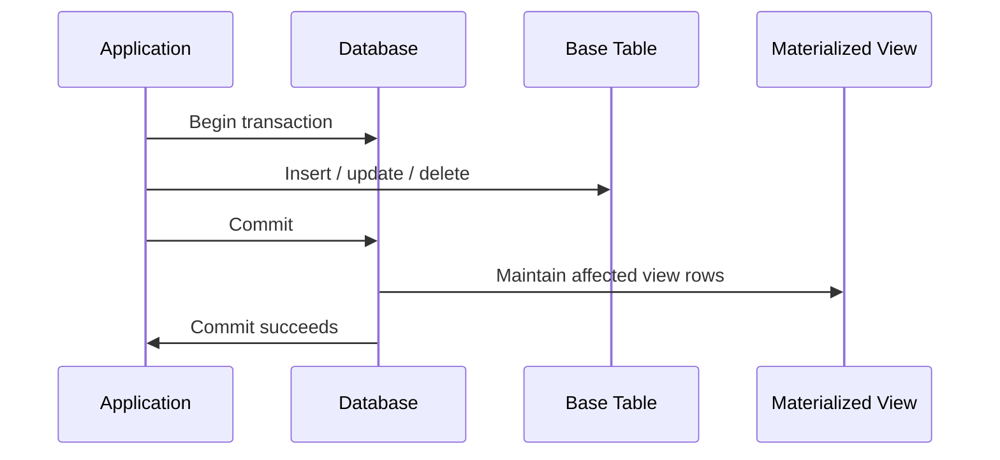
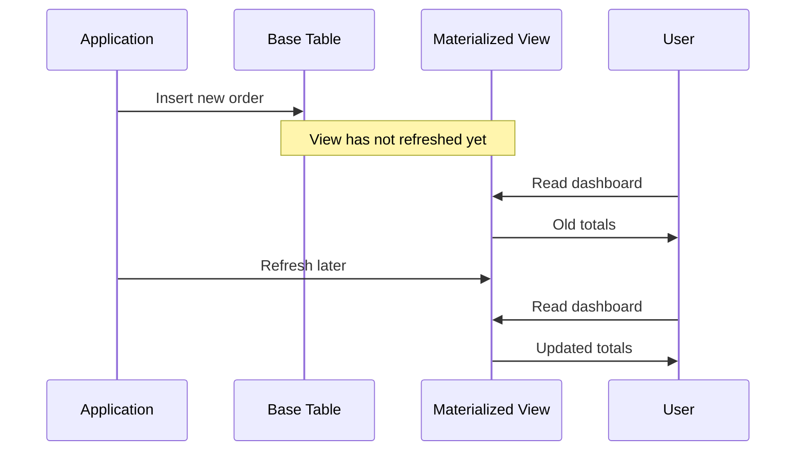

Many slow database queries do the same expensive work again and again.

A dashboard may join orders, customers, and products, then group the result by region. A reporting page may scan millions of rows to compute daily revenue. A product listing may repeatedly calculate review counts and average ratings.

If the result does not need to be perfectly live, it is wasteful to recompute it on every request.

A **materialized view** stores the result of a query so future reads can fetch precomputed data. It is a database-supported form of denormalization: keep the source tables normalized for writes, but maintain a read-optimized copy for common queries.

The trade-off is simple. Reads become much faster, but storage usage grows, the stored result can become stale, and refreshing the view costs CPU, I/O, locks, and operational care.

A materialized view is a stored query result with a refresh strategy attached. Treat it as data you have to keep current, not as a cache that takes care of itself.

---

# 1. What Are Materialized Views"

A regular view stores a query definition. When you query the view, the database expands that definition and reads the underlying tables.

A materialized view stores the query result. When you query the materialized view, the database reads stored rows, much like it reads a table.

Suppose a dashboard needs revenue by customer region. The live query joins `orders` and `customers`, then aggregates the result.

Without the materialized view, every dashboard load may scan orders, join customers, and aggregate by region.

With the materialized view, the dashboard reads a small precomputed table:

The core value of a materialized view is moving expensive work from request time to refresh time.

The important question is freshness. If a new order is inserted after the materialized view was refreshed, the stored summary may not include it yet. Different databases handle refresh differently, and many require you to refresh explicitly.

---

# 2. How Materialized Views Work

A materialized view has three main phases: creation, querying, and refresh.

### 2.1 Creation

When you create a materialized view, the database usually executes the query and stores the result.

The creation step can be expensive because it runs the full query. If the query scans 500 million rows, creating the view is a batch operation, not a cheap metadata change.

Some databases support creating an empty materialized view and populating it later. That is useful when creation must be separated from the first refresh.

### 2.2 Querying

After creation, a materialized view is queried like a table.

The database reads stored rows instead of recomputing the original query. You can often add indexes to the materialized view to match its read patterns.

This is a common production detail. Precomputing the data removes the expensive join or aggregation. Indexing the materialized view then makes common filters, sorts, and lookups fast.

Do not assume the database will automatically use a materialized view when you query the base tables. Some systems can rewrite queries to use materialized views. PostgreSQL generally does not do this automatically; your application usually queries the materialized view directly.

### 2.3 Refresh

A materialized view is only useful if its freshness matches the business need.

In PostgreSQL, refresh is explicit:

A normal refresh recomputes the view and can block reads of the materialized view while it runs. PostgreSQL's `CONCURRENTLY` option allows reads during refresh, but it has requirements, including a suitable unique index, and it does more work.

Other databases have different behavior. Oracle supports richer materialized-view refresh modes, including fast refresh and refresh on commit when the view definition and logs support it. SQL Server has indexed views, which are maintained as base tables change, but they come with strict rules. MySQL does not have native materialized views in the same sense; teams usually build summary tables or use scheduled jobs.

The concept is portable. The exact mechanics are not.

---

# 3. Refresh Strategies

The refresh strategy is the design decision that matters most.

Ask three questions:

1. How stale can the data be"
2. How expensive is a refresh"
3. What impact can refresh have on reads and writes"

### 3.1 Complete Refresh

A complete refresh recomputes the full result from the base tables.

This is simple and reliable. It is often the best starting point.

The cost is that refresh time grows with the amount of data the query must process. A view over a small summary may refresh in seconds. A view over years of raw events may take minutes or hours.

| Property | Complete Refresh |
|----------|------------------|
| Correctness | Rebuilds from source data |
| Complexity | Low |
| Refresh cost | Can be high |
| Write impact | Usually none during normal writes |
| Best for | Batch reports, dashboards, daily summaries |

Complete refresh is a good fit when users can tolerate scheduled staleness:

### 3.2 Concurrent Refresh

Some systems can refresh a materialized view without making the old result unavailable to readers.

In PostgreSQL, `REFRESH MATERIALIZED VIEW CONCURRENTLY` builds a new version while the old version remains readable, then swaps in the new result.

That avoids read downtime, but it is not free. Concurrent refresh requires a unique index that identifies rows in the materialized view, takes longer than a blocking refresh, still consumes CPU, memory, I/O, and temporary storage, and cannot be used for the first population of an empty PostgreSQL materialized view.

Use concurrent refresh when stale-but-available data is better than blocking dashboard or API reads during refresh.

### 3.3 Incremental Refresh

Incremental refresh updates only the parts of the materialized view affected by changes since the last refresh.

This can be much faster than a full rebuild. If only 10,000 rows changed in a 500-million-row table, it is attractive to process only those 10,000 changes.

The hard part is correctness.

The system must know exactly what changed, and the view definition must be maintainable from those changes. `SUM`, `COUNT`, and simple joins are often easier. `COUNT(DISTINCT ...)`, medians, complex outer joins, window functions, and non-deterministic expressions can be much harder or unsupported.

Some databases support incremental refresh natively under specific conditions. Many teams implement a similar pattern manually with summary tables, triggers, change data capture, or stream processing.

### 3.4 On-Commit Maintenance

Some databases can maintain certain materialized views as part of the transaction that changes the base table.

This gives very fresh reads because the view is updated with the write.

The trade-off is write amplification. A write to one base table may also update one or more materialized views and indexes. That increases transaction latency, lock contention, and storage I/O.

Use this style only when the database supports it well, the view is small or simple enough, and the freshness requirement is worth slowing down writes.

For critical values such as account balances or inventory reservations, be careful. A materialized view may be useful for display, but the decision to spend money or reserve stock should usually read and write the transactional source of truth.

### 3.5 Scheduled or On-Demand Refresh

Many production materialized views are refreshed by a job.

The job may run every minute, every 15 minutes, hourly, nightly, or after a data load completes.

This approach is easy to reason about because freshness is bounded by the schedule. If the job runs every 15 minutes and succeeds, users know the dashboard is at most about 15 minutes stale.

The operational work is real:

- Monitor job success and duration.
- Alert when refresh fails.
- Track when each view was last refreshed.
- Avoid refreshing too many heavy views at the same time.
- Decide what happens if refresh takes longer than the schedule interval.

### 3.6 Strategy Comparison

| Strategy | Freshness | Read Impact | Write Impact | Best For |
|----------|-----------|-------------|--------------|----------|
| Complete refresh | Stale until refreshed | May block reads | Low | Simple reports |
| Concurrent refresh | Stale until swap | Reads continue | Low | Dashboards that must stay available |
| Incremental refresh | Depends on schedule or trigger | Usually low | Depends on implementation | Large views with small deltas |
| On-commit maintenance | Very fresh | Low | Higher write latency | Small critical summaries |
| Scheduled refresh | Bounded by schedule | Depends on refresh mode | Low | Most reporting workloads |

Most teams should start with scheduled complete or concurrent refresh. Move to incremental refresh only when full refresh becomes too expensive. Use on-commit maintenance sparingly.

---

# 4. Common Use Cases

Materialized views work best when the same expensive read is run often and the result can tolerate some staleness.

### 4.1 Dashboards and Reports

Dashboards are the classic use case.

Instead of calculating every metric when the page loads, precompute the dashboard data and refresh it on a schedule.

If the business is comfortable with "updated every 15 minutes," this is usually much better than making every dashboard viewer run a large aggregation.

### 4.2 Precomputed Aggregates

Aggregations over large tables can stay expensive even with good indexes because the database still needs to process many rows.

Examples:

- Orders per customer
- Revenue per day
- Average rating per product
- Active users per region
- Error counts per service and hour

Materialized views shift that cost to refresh time.

The query `WHERE customer_id = 123` becomes a small indexed lookup instead of an aggregation over the full order history.

### 4.3 Prejoined Read Models

Many application screens need data from several tables.

For example, an order detail page may need order fields, customer fields, shipment status, product names, and return information. If this screen is read frequently and changes less often, a materialized view can store a prejoined representation.

This is denormalization with a rebuild path. The normalized tables remain the source of truth, and the materialized view serves the read path.

### 4.4 Search and Filtering Tables

Materialized views can help prepare data for filtering and sorting.

For example, a product browse page may need product fields, category, brand, average rating, and review count. A materialized view can gather those values into one read-optimized shape.

For full-text search, a dedicated search engine may still be a better fit. Materialized views are good for relational read models; they are not a replacement for Elasticsearch, OpenSearch, Solr, or a vector/search-specific system when ranking and text relevance are central.

---

# 5. Trade-offs and Limitations

Materialized views improve read performance by moving work elsewhere. That "elsewhere" still has a cost.

### 5.1 Staleness

Staleness is the main correctness risk.

Make staleness explicit. Add a `last_refreshed_at` timestamp somewhere visible to operators and, when useful, to users. A dashboard labeled "last updated at 10:45" creates fewer surprises than one that serves old data without any indication.

### 5.2 Refresh Cost

A refresh can be one of the heaviest queries in your system.

It may scan large tables, build hash tables, sort data, aggregate rows, write a new result set, update indexes, and hold locks. If you refresh several views at once, you can create a production load spike.

Practical mitigations:

- Refresh during lower-traffic periods.
- Stagger refresh jobs.
- Use concurrent refresh when read blocking is unacceptable.
- Use partitioned summary tables or incremental refresh when full refresh is too slow.
- Put heavy reporting workloads on a replica or analytics database when possible.

### 5.3 Storage and Index Cost

A materialized view stores data. Its indexes store more data.

If the base tables are 500 GB and you create several wide materialized views, storage can grow quickly. Indexes on materialized views also need maintenance during refresh.

This is usually worth it for high-value read paths, but it should be part of capacity planning.

### 5.4 Write Amplification

On-commit or trigger-maintained views can slow writes because each base-table change causes additional work.

One user action may end up touching the source table, one or more materialized views or summary tables, the indexes on those views, and any change logs used for incremental maintenance.

That is fine for small, important summaries. It is dangerous for high-write workloads such as clickstreams, logs, chat messages, or metrics ingestion.

### 5.5 Query Restrictions and Surprises

Not every query is a good materialized view.

Be careful with non-deterministic functions:

This often does not mean what beginners expect. `NOW()` is evaluated when the view is created or refreshed. The stored result is a snapshot of "recent" at that moment, not a continuously moving seven-day window.

A safer pattern is to materialize stable buckets and apply rolling filters at query time:

Also check database-specific restrictions. Incremental refresh, concurrent refresh, query rewrite, joins, aggregates, user-defined functions, and indexing rules vary widely by database.

---

# 6. Materialized Views vs Similar Patterns

Materialized views overlap with several other read-optimization techniques.

| Pattern | What It Is | When To Use |
|---------|------------|-------------|
| Regular view | Saved query definition | Simplify SQL, not performance by itself |
| Materialized view | Stored query result managed by database features | Repeated expensive reads with tolerable staleness |
| Summary table | Regular table maintained by jobs, triggers, or app code | Need custom refresh logic or database lacks materialized views |
| Cache | Key-value copy outside the database | Very hot reads, simple invalidation, low latency |
| Read replica | Copy of the database for read scaling | Offload reads without changing query shape |
| Search index | Specialized index outside the OLTP database | Text search, ranking, faceting, relevance |

In practice, teams often combine these. For example, a materialized view may feed a cache, or a summary table may be maintained from change data capture.

---

# 7. Practical Rules of Thumb

Use these guidelines when considering materialized views:

1. Use them for expensive reads that run often.
2. Avoid them when every read must reflect the latest write.
3. Start with scheduled complete or concurrent refresh.
4. Add indexes to match real query patterns.
5. Track and expose `last_refreshed_at`.
6. Monitor refresh duration, failures, lock waits, and storage growth.
7. Stagger heavy refresh jobs.
8. Prefer incremental maintenance only when full refresh is too expensive.
9. Do not use materialized views to hide bad indexing or poorly bounded queries.
10. Keep the source tables as the source of truth.

---

# Summary

Materialized views store the result of a query so repeated reads can avoid expensive joins, scans, and aggregations.

They are most useful for dashboards, reports, precomputed aggregates, prejoined read models, and filter-heavy read paths where some staleness is acceptable.

The hard design problem is refresh: how often it runs, how much it costs, whether it blocks readers, how stale the data can be, and what happens when refresh fails. Creating the view is the easy step.

Materialized views can be a practical bridge between normalized transactional data and fast read models, as long as refresh behavior is treated as part of the design. Without that attention, they tend to become stale tables that the team stops trusting.

---

# Quiz
