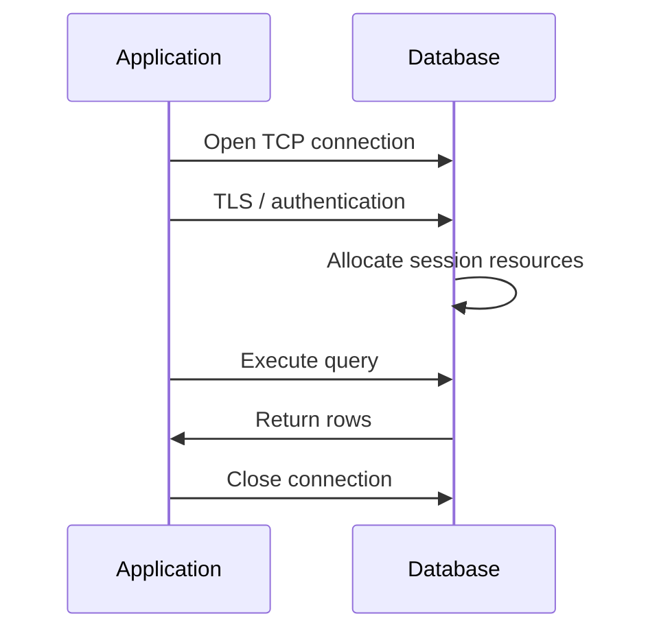
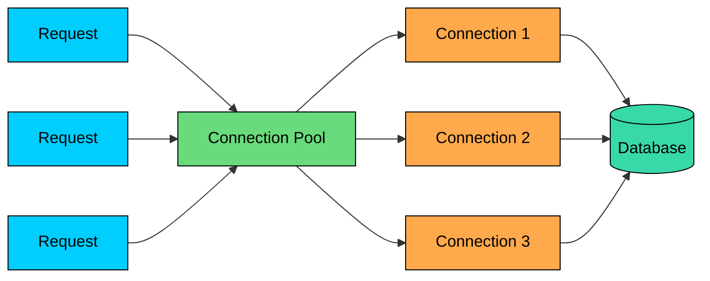
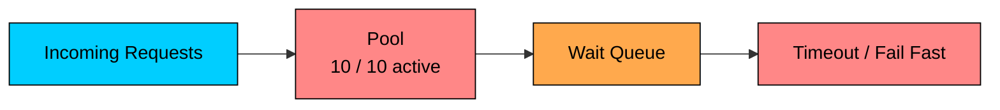

Database connections are expensive resources.

Opening a connection can involve a TCP handshake, TLS negotiation, authentication, session setup, and database process or thread allocation. Keeping a connection open also consumes memory, file descriptors, backend state, and scheduling overhead on the database.

If an application opens a new database connection for every request, it wastes time and can overload the database long before the actual queries become expensive.

**Connection pooling** solves this by keeping a limited set of open connections and reusing them across requests.

The size limit on the pool is what makes it more than a performance optimization. It also acts as a safety mechanism that controls how much concurrent work the application can send to the database.

---

# 1. The Problem Without Pooling

Without pooling, a request may do this every time it needs the database:

1. Open a TCP connection.
2. Negotiate TLS if enabled.
3. Authenticate with the database.
4. Allocate database-side session state.
5. Run the query.
6. Close the connection.

For one request, this may be acceptable. Under load, it becomes painful.

Problems include:

- **Higher latency:** connection setup may take longer than a small indexed query.
- **Database overhead:** each connection consumes memory and scheduling resources.
- **Connection storms:** traffic spikes can create a burst of new connections at the worst time.
- **Resource leaks:** missed cleanup can leave connections idle but unusable.
- **Connection limits:** databases reject new clients when limits are reached.

The database wants a manageable amount of concurrent work. Creating thousands of connections does not make it process thousands of queries efficiently. It often creates contention and queueing inside the database.

---

# 2. What Connection Pooling Does

> [!PAYWALL] This content is for premium members only.

A connection pool keeps database connections open so requests can reuse them.

The request flow changes:

1. The application asks the pool for a connection.
2. The pool returns an idle connection if one is available.
3. The application runs its query or transaction.
4. The application returns the connection to the pool.
5. If no connection is available, the request waits briefly or fails with a timeout.

The pool improves performance because most requests avoid connection setup.

It also provides backpressure. If all connections are busy, the application queues briefly instead of opening unlimited new connections and pushing the database into failure.

---

# 3. How a Pool Works Internally

A connection pool usually tracks three groups of work:

| Component | Purpose |
|-----------|---------|
| Idle connections | Open connections ready to be borrowed |
| Active connections | Connections currently checked out by requests |
| Wait queue | Requests waiting for a connection |
| Reaper / housekeeper | Closes stale, expired, or unhealthy connections |
| Metrics | Tracks usage, wait time, timeouts, and errors |

When a request borrows a connection, the pool marks it active. When the request calls `close()` or exits a managed block, the connection is returned to idle. In most libraries, `close()` does not close the physical database connection; it returns it to the pool.

If the request never returns the connection, that is a **connection leak**. Over time, leaks reduce available capacity until the pool is exhausted.

Good pools also validate connections. A connection can become invalid if the database restarts, a firewall drops an idle socket, a network partition occurs, or credentials rotate.

---

# 4. Example: Java and HikariCP

HikariCP is a high-performance JDBC connection pool. Spring Boot ships with HikariCP as the default pool.

Key settings:

| Setting | Meaning |
|---------|---------|
| `maximumPoolSize` | Maximum physical connections this pool can open |
| `minimumIdle` | Minimum idle connections to keep warm |
| `connectionTimeout` | How long a request waits for a connection before failing |
| `idleTimeout` | How long extra idle connections can sit unused |
| `maxLifetime` | Maximum age before a connection is retired and replaced |

The `try` block matters. It guarantees the connection is returned to the pool even if the query throws an exception.

Equivalent patterns exist in other languages:

- `with` blocks in Python
- `using` blocks in C#
- `defer rows.Close()` / `defer tx.Rollback()` patterns in Go
- ORM-managed sessions with clear request boundaries

The principle is the same: borrow late, return early.

---

# 5. Pool Exhaustion

Pool exhaustion happens when every connection is active and new requests are waiting.

This is not always a problem. A full pool can mean the application is applying backpressure. It becomes a problem when wait times grow, timeouts increase, and request threads pile up.

Common causes include slow queries, transactions held open too long, leaked connections, a pool that is too small for the workload, a pool so large that the database itself is overloaded, or a database that is down or unreachable.

The last two causes can look identical from the application's point of view. Requests wait for connections either because the pool is too small or because the database is slow and connections are not returning quickly.

That is why pool metrics must be read together with database metrics.

---

# 6. Sizing a Connection Pool

Pool sizing is a capacity decision.

A larger pool allows more concurrent database work from that application instance. That can help if the database has spare capacity and requests are waiting unnecessarily.

But a larger pool can also make things worse. If the database can efficiently run 40 concurrent queries and your services send 400, the database does not become 10x faster. It queues, context-switches, consumes memory, and increases latency for everyone.

Start with a conservative pool and load test.

Useful inputs:

- Database CPU cores
- Query latency and variability
- Transaction length
- Number of application instances
- Database `max_connections`
- Other clients using the same database
- Read/write mix

If you have 20 application pods and each has `maximumPoolSize = 20`, the application fleet can open 400 database connections.

That total must fit inside the database's real capacity, which is often well below the configured `max_connections` value.

A reasonable starting point for many OLTP services is a small pool per instance, such as 5-20 connections, then adjust based on load tests and production metrics. There is no universal formula.

---

# 7. Timeouts and Lifetimes

Timeouts keep failures bounded.

### 7.1 Connection Timeout

This is how long a request waits to borrow a connection from the pool.

Do not let requests wait forever. A short timeout turns pool exhaustion into a controlled error instead of a thread pileup.

### 7.2 Query Timeout

This is how long a query is allowed to run.

Connection timeout protects the pool wait. Query timeout protects the database from runaway queries.

### 7.3 Transaction Timeout

Long transactions hold connections, locks, and MVCC cleanup back. They can exhaust the pool even if individual queries are fast.

### 7.4 Idle Timeout and Max Lifetime

Idle timeout closes unused extra connections. Max lifetime retires old connections before they are killed by load balancers, firewalls, database maintenance, or server-side timeouts.

Set lifetimes below infrastructure timeouts so the pool retires connections gracefully instead of discovering broken sockets during user requests.

---

# 8. Application Pools vs Proxy Poolers

Most applications use an in-process pool. That works well for a small number of long-running application instances.

Distributed systems add a new problem: every instance has its own pool.

If you run many pods, workers, or serverless functions, the total connection count can explode.

### 8.1 Database Proxies and Poolers

A database proxy or external pooler sits between applications and the database.

Examples:

| Tool | Common Use |
|------|------------|
| PgBouncer | PostgreSQL connection pooling |
| ProxySQL | MySQL connection pooling and routing |
| RDS Proxy | Managed pooling for AWS RDS and Aurora |
| Pgpool-II | PostgreSQL pooling and load balancing |

These tools can reduce the number of physical database connections and smooth spikes from many application clients.

### 8.2 Session vs Transaction Pooling

External poolers often support different modes.

| Mode | Behavior | Caveat |
|------|----------|--------|
| Session pooling | Client holds a backend connection for the client session | Less multiplexing |
| Transaction pooling | Backend connection is returned after each transaction | Session state can break |
| Statement pooling | Backend connection is returned after each statement | Most restrictive |

Transaction pooling is efficient, but it does not work with every application pattern. Features such as session variables, temporary tables, prepared statements, advisory locks, and long transactions can behave differently or break unless configured carefully.

---

# 9. Serverless and Burst Traffic

Serverless platforms can create many concurrent execution environments quickly.

If each one opens its own pool, the database can be overwhelmed by connections even when each function does very little work.

Use one or more of these strategies:

- Put a managed proxy in front of the database.
- Keep function concurrency within database limits.
- Reuse connections across warm invocations where the platform allows it.
- Prefer HTTP APIs or queue-based workers for workloads that do not need direct database access.
- Use short transactions and strict timeouts.

Database connection limits still apply under serverless, and the fan-out of cold and warm instances makes those limits much easier to hit.

---

# 10. Monitoring a Pool

A connection pool should be monitored like any other critical dependency.

Useful metrics:

| Metric | Why It Matters |
|--------|----------------|
| Active connections | How many connections are currently borrowed |
| Idle connections | Warm capacity available immediately |
| Wait queue length | Requests waiting for a connection |
| Wait time | User-visible pressure before query execution starts |
| Connection timeout count | Pool exhaustion or database slowness |
| Connection creation count | Churn, restarts, or unstable connections |
| Leak detections | Borrowed connections not returned promptly |
| Query and transaction duration | Explains why connections stay busy |

Database-side metrics matter too:

- Current connections
- Active vs idle sessions
- CPU and I/O utilization
- Lock waits
- Slow queries
- Transaction age

Pool exhaustion is often a symptom, not the root cause. The root cause may be a slow query, a lock, a downstream outage, or a leaked transaction.

---

# 11. Common Mistakes

Avoid these mistakes:

- Creating a new database connection per request.
- Setting the pool size high without checking total fleet connections.
- Letting requests wait forever for a connection.
- Holding connections while calling external APIs.
- Keeping transactions open across slow application logic.
- Returning HTTP responses before closing cursors, rows, or transactions.
- Ignoring connection leaks.
- Using transaction pooling with code that depends on session state.
- Treating pool exhaustion as proof that the pool must be larger.
- Monitoring database CPU but not pool wait time.

---

# 12. Practical Rules of Thumb

Use these guidelines:

1. Borrow connections as late as possible.
2. Return connections as early as possible.
3. Keep transactions short.
4. Set connection, query, and transaction timeouts.
5. Size pools across the whole fleet, not one process at a time.
6. Use external poolers for many app instances or serverless workloads.
7. Monitor active connections, wait time, timeouts, and leaks.
8. Investigate slow queries before increasing pool size.
9. Avoid session state when using transaction pooling.
10. Load test pool settings with production-like traffic.

---

# Summary

Connection pooling reuses open database connections so applications avoid repeated connection setup and keep database concurrency under control.

A good pool improves latency and protects the database from connection storms. A bad pool configuration can hide slow queries, create thread pileups, or overwhelm the database with too many concurrent sessions.

Treat the pool as a backpressure mechanism. Size it deliberately, set timeouts, keep transactions short, monitor wait time, and use proxy poolers when many application instances would otherwise create too many direct database connections.

---

# Quiz
