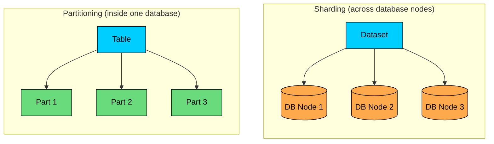
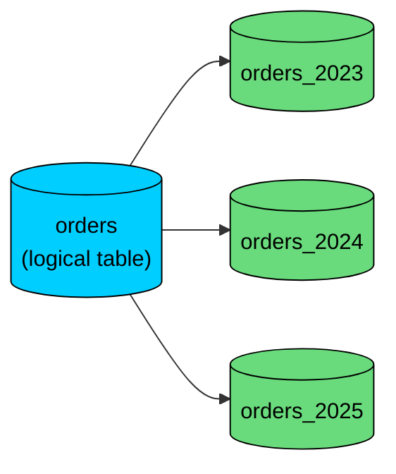
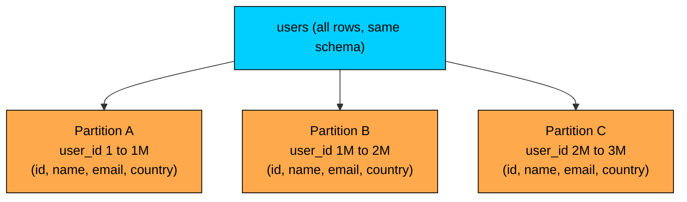
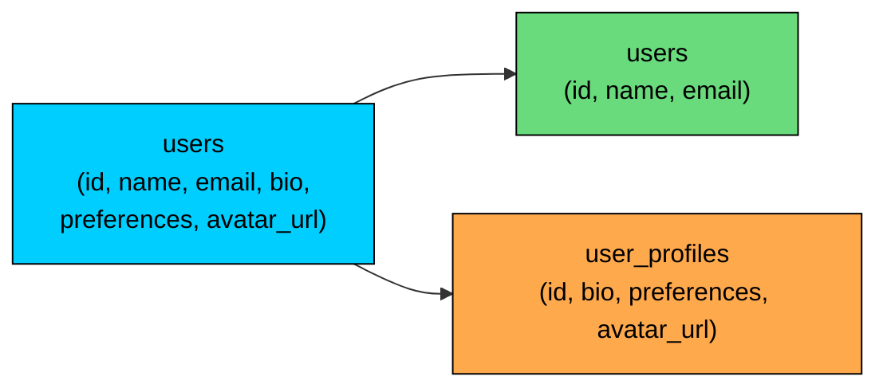
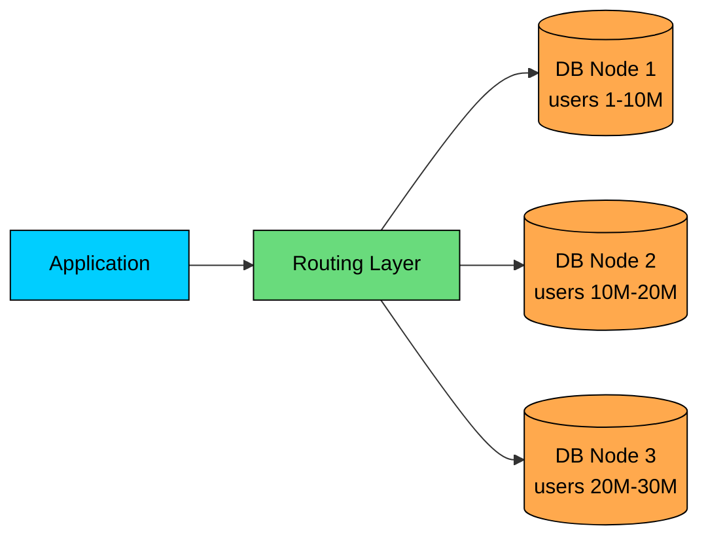
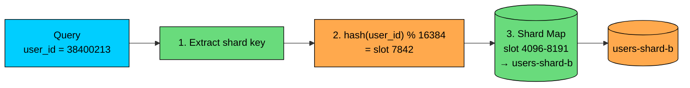

Sharding and partitioning are easy to confuse because both split data into smaller pieces.

The difference is where those pieces live and who is responsible for routing queries to them.

Partitioning usually means splitting a table inside one database system. The application still queries one logical table, and the database decides which partition to use.

Sharding means splitting data across multiple database servers or clusters. The system needs a shard key, a routing layer, and operational processes for managing many independent data owners.

The short version:

| Technique | What it splits | Where the pieces live | Who routes queries" | Main goal |
| --- | --- | --- | --- | --- |
| Partitioning | Rows or columns of a table | Usually inside one database system | The database engine | Smaller tables, faster pruning, easier maintenance |
| Sharding | Rows of a dataset | Across multiple database servers or clusters | Application, proxy, middleware, or distributed database | Horizontal scale and fault isolation |

Sharding is a form of distributed horizontal partitioning. The distribution part is what changes the design.

---

# 1. What is Partitioning"

> [!PAYWALL] This content is for premium members only.

Partitioning splits a large table or index into smaller physical pieces called partitions.

In most relational databases, the application still sees one logical table:

Internally, the database can skip partitions that cannot contain matching rows. This is called partition pruning.

Partitioning helps when:

- A table is too large to manage comfortably as one unit
- Queries usually filter by date, tenant, region, status, or another partition key
- Old data needs to be archived or deleted in large chunks
- Index maintenance, vacuuming, compaction, or backups are too expensive on the full table

Partitioning does not automatically make every query faster. If a query cannot use the partition key, the database may still need to scan many partitions.

#### 1.1 Horizontal Partitioning

Horizontal partitioning splits a table by rows. Every partition has the same schema, but each partition owns a different subset of rows.

Examples:

- Orders from 2024 go into `orders_2024`
- Orders from 2025 go into `orders_2025`
- Customers from `US` go into one partition and customers from `EU` go into another
- Users are spread across 16 partitions using `hash(user_id)`

The table shape stays the same. Only row ownership changes.

##### PostgreSQL Example

Consider an e-commerce orders table in PostgreSQL where operational queries look up recent orders and old orders are retained for reporting.

You can partition the table by `order_date`:

PostgreSQL requires a unique or primary key on a partitioned table to include the partition key. That is why the primary key includes both `order_id` and `order_date`.

Now create the partitions:

Inserts go through the parent table:

PostgreSQL routes the row to `orders_2025`.

Queries that filter on `order_date` can prune old partitions:

Instead of scanning every order ever written, the database can scan the relevant partition or partitions.

Partitioning also makes retention cheaper. Dropping one old partition is much faster and less disruptive than deleting millions of rows:

#### 1.2 Vertical Partitioning

Vertical partitioning splits a table by columns. The common columns stay in one table, and less common or larger columns move into another table using the same primary key.

For example, instead of storing everything in one wide `users` table:

You might split it into:

This keeps common reads smaller and avoids loading large profile fields when they are not needed.

Vertical partitioning is usually a schema design choice rather than a database feature. It is related to normalization, but the goal is different:

- Normalization usually reduces duplication and improves data integrity
- Vertical partitioning usually separates hot columns from cold or bulky columns

#### 1.3 Common Partitioning Strategies

Range partitioning assigns each partition a continuous range of values.

Use it when queries often filter by time or numeric ranges:

- `logs_2025_01`
- `logs_2025_02`
- `logs_2025_03`

List partitioning assigns each partition a fixed set of values.

Use it when data belongs to known categories:

- `customers_us`
- `customers_eu`
- `customers_apac`

Hash partitioning applies a hash function to the partition key.

Use it when you need a more even distribution and do not care about range pruning:

Composite partitioning combines strategies. A common pattern is range by time, then hash by tenant or user inside each time range.

---

# 2. What is Sharding"

Sharding splits a dataset across multiple database servers. Each server, called a shard, owns part of the data.

The main purpose of sharding is horizontal scale:

- More write throughput than one primary database can handle
- More storage than one node can hold comfortably
- A working set too large for one server's memory and cache
- Better tenant or regional isolation
- Smaller failure domains

In a sharded system, each shard usually has its own tables, indexes, backups, replicas, metrics, and failover process.

That is a much bigger operational boundary than a partition inside one database.

#### 2.1 How Sharding Works

A sharded system needs three things.

First, it needs a shard key. The shard key decides where a record belongs. Common examples are `user_id`, `tenant_id`, `account_id`, `organization_id`, or `region`.

Second, it needs a shard map. The shard map records which key ranges, hash slots, or tenants belong to which shard.

Third, it needs a router. The router can be in the application, a database proxy, middleware, or a distributed database layer.

For example, a social network might shard user data by `user_id`. The example below uses 16384 hash slots to match Redis Cluster's convention. The slot count is arbitrary; a common choice is a power of two large enough to allow future rebalancing without exhausting the slot space:

The application can hash a `user_id`, find the slot, and route the query:

That query is efficient because it targets one shard.

The design gets harder when a query does not include the shard key:

If users are sharded by `user_id`, the system may not know which shard owns that email. You then need a global secondary index, a lookup table, duplicated data, or a fan-out query across all shards.

This is why shard key choice shapes nearly every other decision in a sharded design.

---

# 3. The Real Difference

A useful way to compare the two is by responsibility.

Partitioning is mostly a database responsibility. The database stores the partition metadata, routes inserts to child partitions, prunes partitions during query planning, and presents a single logical table to the application.

Sharding is a system responsibility. Some layer must know where data lives, route requests, handle cross-shard operations, rebalance data, and keep shard metadata correct.

| Area | Partitioning | Sharding |
| --- | --- | --- |
| Scope | One table or index | Whole dataset or tenant set |
| Location | Usually one database system | Multiple database servers or clusters |
| Routing | Database engine | Application, proxy, middleware, or distributed DB |
| Query shape | Best when filters include the partition key | Best when requests include the shard key |
| Writes | Still limited by the database node's write capacity | Can scale writes across shards |
| Joins | Usually local to one database | Cross-shard joins are expensive |
| Transactions | Usually normal local transactions | Cross-shard transactions are harder |
| Maintenance | Drop, attach, detach, rebuild individual partitions | Move tenants, rebalance shards, update routing metadata |
| Failure domain | One database failure can affect all partitions | One shard failure affects its slice unless replicated |

The overlap is real: sharding is distributed horizontal partitioning. But in system design interviews and real architecture discussions, "sharding" implies multiple database nodes and distributed routing.

---

# 4. When to Use Partitioning

Use partitioning when one database can still handle the workload, but the tables have become too large or awkward to manage.

Partitioning is a good fit when:

- Most queries include a natural partition key, such as `created_at`, `tenant_id`, or `region`
- You frequently delete or archive old data
- Indexes are large and expensive to maintain
- You want partition-level maintenance without changing the application data model much
- The bottleneck is table size, not total cluster capacity

Common examples include logs partitioned by day or month, orders partitioned by order date, metrics partitioned by time range, multi-tenant tables partitioned by tenant group, and events partitioned by event date and subpartitioned by hash.

Partitioning is often the right step before sharding. It is simpler, keeps transactions local, and avoids introducing distributed routing too early.

---

# 5. When to Use Sharding

Use sharding when one database node is no longer enough, even after indexing, query tuning, read replicas, caching, partitioning, and hardware upgrades.

Sharding is a good fit when:

- Write throughput exceeds what one primary can handle
- Storage growth is beyond the practical limits of one node
- The working set no longer fits well in memory on one machine
- A few large tenants need isolation from everyone else
- Regional or data-residency requirements require data placement by geography
- Most requests can be routed by a stable shard key

Sharding is not a small optimization. It changes how the whole system behaves.

You now need to design for:

- Shard key selection
- Shard map storage and caching
- Request routing
- Backups and restores per shard
- Monitoring per shard
- Cross-shard queries
- Cross-shard transactions or sagas
- Rebalancing and tenant movement
- Hot shards
- Schema changes across many databases

If the access pattern is not shard-friendly, sharding can make the system slower and harder to operate.

---

# 6. Common Mistakes

#### 6.1 Thinking Partitioning Always Improves Performance

Partitioning improves queries that can prune partitions. It can hurt queries that touch many partitions because the planner and executor have more objects to consider.

Bad partitioning creates overhead without reducing the scanned data.

#### 6.2 Sharding Before the Problem Requires It

Sharding is expensive to build and operate. Many systems can run for years with good indexes, query optimization, read replicas, caching, archival policies, and table partitioning.

Do not shard just because the data is growing. Shard when one database cannot meet clear workload or operational requirements.

#### 6.3 Choosing the Wrong Shard Key

A shard key should be high-cardinality, stable, evenly distributed, and present in common queries.

Poor shard keys create hot shards, scatter-gather queries, difficult joins, and painful migrations.

For example, sharding by `country` may look simple, but one country might contain most of the traffic. Sharding by `user_id` or `tenant_id` often distributes better, depending on the product.

#### 6.4 Ignoring Global Queries

Most products need some global operations such as searching by email or username, admin dashboards, analytics, fraud detection, counts and leaderboards, and customer support lookups.

Design these paths explicitly. Options include global indexes, duplicated lookup tables, async search indexes, data warehouses, or fan-out queries for low-volume internal tools.

#### 6.5 Treating Shards Like Simple Partitions

A partition is usually managed by the database. A shard is an operational unit.

Every shard needs backups, restore testing, schema migrations, monitoring, failover, capacity planning, and incident handling.

That operational cost is the real price of sharding.

---

# 7. Practical Decision Guide

Start with the smallest change that addresses the actual bottleneck.

If queries are slow because they scan too much data, check indexing and query plans first.

If large time-based tables are hard to query or maintain, use partitioning.

If reads are too heavy but writes are manageable, add read replicas or caching.

If writes, storage, or working set size exceed one database node, consider sharding.

If tenants have very different sizes, consider tenant isolation, dedicated shards for large tenants, or a hybrid model.

Here is a simple rule:

- Partition when one database is still the right owner, but one table is too large.
- Shard when one database is no longer the right owner for the whole dataset.

---

# Summary

Partitioning divides a table into smaller pieces, usually inside one database system. It improves pruning, maintenance, retention, and manageability when queries align with the partition key.

Sharding divides a dataset across multiple database servers. It helps scale writes, storage, working set size, and isolation, but it introduces routing, rebalancing, cross-shard queries, and operational complexity.

Sharding is distributed horizontal partitioning, but that distribution changes everything.

Use partitioning when the table is the problem.

Use sharding when the single database owner is the problem.

---

# Quiz
