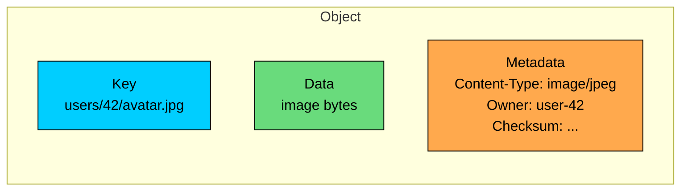
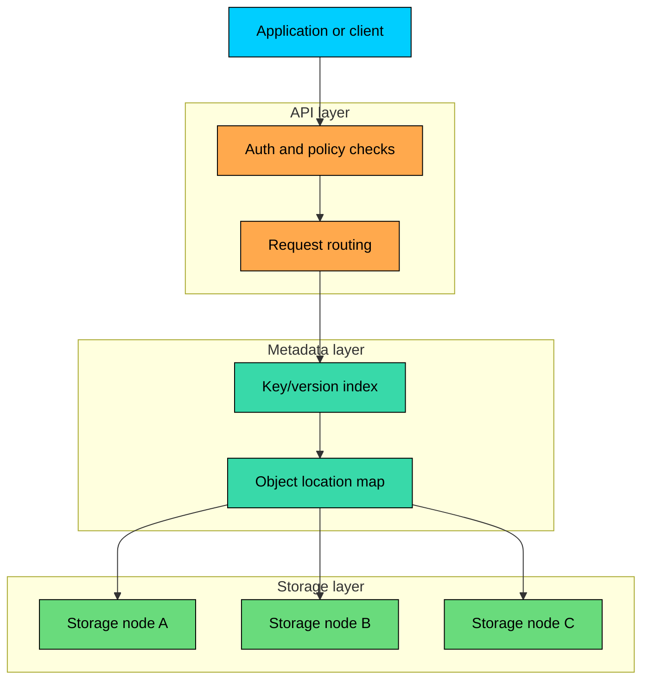
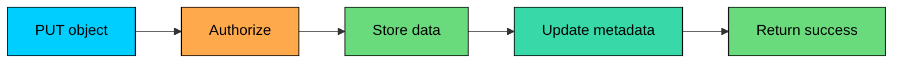
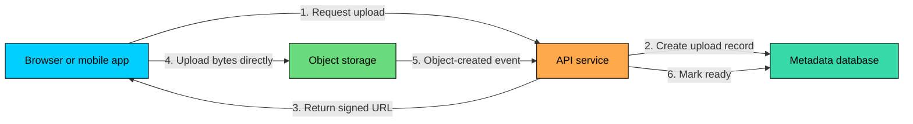

Object storage is the storage model behind services like Amazon S3, Google Cloud Storage, Azure Blob Storage, and MinIO. It is built for large amounts of unstructured data: images, videos, backups, logs, exports, ML datasets, and data lake files.

The basic idea is simple. Instead of exposing a disk or a mounted file system, object storage exposes an API. You store an object with a key, and later retrieve it by that key.

That design sounds modest, but it changes the trade-offs completely. Object storage gives you massive scale, strong durability, HTTP access, lifecycle policies, and low storage cost. In exchange, you give up normal file-system behavior such as in-place writes, file locks, and POSIX-style operations.

This chapter explains how object storage works, where it fits in system design, and where it should not be used.

---

# 1. What is Object Storage"

An **object** is a self-contained unit of data stored in a bucket or container.

It has three parts: the **data** itself (the raw bytes of an image, video, PDF, backup, log segment, or Parquet file), a **key** that the system uses to retrieve it (something like `users/42/avatar.jpg`), and **metadata** describing it (content type, size, checksum, owner, custom tags).

You do not mount object storage like a disk. You call operations such as:

The API is intentionally small. Most systems only need to create objects, read objects, delete objects, list objects by prefix, and manage metadata or access policies.

### 1.1 Keys Are Not Directories

Object keys often look like file paths:

Those slashes are part of the key string. They are not real directories in the way a file system has directories.

User interfaces often display keys as folders because it is convenient for humans. Internally, the object store can partition and index objects by key without walking a directory tree.

This matters because directory metadata is one of the hardest parts of scaling a file system. Object storage avoids much of that complexity by using a flat namespace and sharding the keyspace across many storage nodes.

The exact partitioning scheme varies (some systems hash, some range-split and re-split under load), but the client only sees keys.

### 1.2 Objects Are Usually Replaced, Not Edited

In a file system, an application can open a file, seek to byte 10,000, and overwrite a few bytes.

Object storage usually does not work that way. If you want to change an object, you write a new object or a new version of the object.

This is a good fit for naturally immutable data: uploaded photos, transcoded videos, database backups, log segments, analytics files, and static website assets.

It is a poor fit for data that changes constantly in small pieces, such as database pages, growing log files, or application state that needs frequent random updates.

---

# 2. How Object Storage Works

Object storage systems vary internally, but most have the same broad shape.

An **API layer** receives requests, authenticates clients, authorizes actions, and routes traffic. A **metadata layer** tracks object keys, versions, metadata, checksums, and storage locations. A **storage layer** holds the object bytes spread across many disks, nodes, racks, or availability zones.

### 2.1 Upload Path

When a client uploads an object, the system does roughly this:

1. Validates identity and permissions.
2. Accepts the object bytes and metadata.
3. Stores the data using replication or erasure coding.
4. Records metadata, checksum, version, and physical locations.
5. Returns success only after the write meets the service's durability rules.

Large uploads are commonly split into parts. Multipart upload lets clients retry failed parts, upload parts in parallel, and avoid restarting a multi-gigabyte transfer after a network failure.

Concrete limits matter when sizing uploads. S3 caps a single `PUT` at 5 GB and requires multipart above that.

A multipart upload can include up to 10,000 parts, with each part between 5 MB and 5 GB except the last one, which has no lower bound. That gives a maximum object size of 5 TB. Other providers use similar shapes with slightly different numbers.

### 2.2 Download Path

When a client downloads an object, the system:

1. Validates identity and permissions.
2. Looks up the key and version in the metadata layer.
3. Finds a healthy replica or reconstructs the object from encoded fragments.
4. Streams the response back to the client.

Object storage is designed to stream large content well. It is not designed for tiny synchronous reads in the inner loop of an application.

### 2.3 Durability

Durability is the probability that stored data is not lost. Cloud object stores publish very high durability targets.

S3 Standard is designed for 99.999999999% annual durability, often called eleven nines. GCS Standard and Azure Blob publish similar numbers for their multi-zone and geo-redundant tiers. Single-zone tiers offer lower durability because they cannot survive the loss of an entire zone.

Object storage systems reach those numbers by combining a few techniques. They either replicate full copies across failure domains or erasure-code the data into fragments plus parity so the object can be reconstructed after losses.

Checksums catch corruption on upload, storage, and retrieval, and background repair rebuilds missing or corrupted fragments automatically. Versioning and object lock, when configured, protect against accidental deletion and many forms of malicious change.

Durability is not the same as availability. Your data can be safe but temporarily unreachable during an outage, permission issue, network problem, or regional event.

### 2.4 Consistency

Modern managed object stores provide strong read-after-write consistency for object operations within a single region. S3 has worked this way since December 2020, and GCS and Azure Blob behave the same.

After a successful write, a later `GET` of that key sees the new object. After a successful overwrite, a later `GET` sees the new version. After a successful delete, a later `GET` returns the not-found response.

`LIST` is also strongly consistent in a single region, so a newly created object shows up in the next listing.

This was not always true. Older S3 documentation described eventual consistency for new-key reads and for `LIST`. That model is gone, and anything written against it should be revisited.

A few things stay eventually consistent and need to be designed for.

Cross-region replication can take seconds or minutes to show a new object in the destination bucket. Event notifications are usually delivered within seconds but can be delayed and may arrive more than once. Bucket configuration changes (lifecycle rules, ACLs, replication settings) propagate on their own timeline.

Object stores also do not provide multi-object transactions. Updating a database row and uploading an object are two separate operations unless the application coordinates them. The common pattern is to store object metadata in a database and treat the object store as the durable content layer.

---

# 3. Key Features

### 3.1 Storage Tiers and Lifecycle Policies

Not all data needs the same access speed. A profile photo may be read often. A seven-year-old audit export may only exist for compliance.

Object storage services provide tiers for different access patterns:

| Tier Type | Use Case | Trade-off |
|-----------|----------|-----------|
| Frequent access | Active content, hot datasets, static assets | Higher storage cost, low retrieval friction |
| Infrequent access | Data kept online but rarely read | Lower storage cost, possible retrieval charges or minimum storage duration |
| Archive | Backups, compliance, old exports | Much lower storage cost, slower or more expensive retrieval |
| Deep archive | Rarely accessed long-term retention | Lowest storage cost, retrieval may take hours |

Lifecycle policies move or delete objects automatically based on rules. A typical setup might move logs to infrequent access after 30 days, archive backups after 90 days, delete temporary exports after 7 days, and retain compliance records for 7 years.

This is one of the reasons object storage works so well at scale. Cost management becomes policy-driven instead of manual cleanup.

### 3.2 Versioning

With versioning enabled, overwriting an object creates a new version instead of destroying the old one. Deleting an object can create a delete marker while older versions remain recoverable.

This helps recover from accidental deletes, bad deployments that overwrite good data, application bugs that corrupt generated files, and some forms of malicious action.

Versioning is not a complete backup strategy by itself. If an attacker or broken job can permanently delete old versions, versioning will not save you. Use retention controls, object lock, restricted permissions, and separate backup accounts for high-value data.

### 3.3 Metadata and Tags

Object metadata is useful for content handling and application behavior. Standard headers like `Content-Type: image/jpeg` or `Cache-Control: public, max-age=31536000` shape how browsers and CDNs treat the object. Custom keys like `uploaded-by: user-42`, `source: mobile-app`, or `dataset: billing-events` carry application context that travels with the object.

Some metadata is returned with object reads. Tags can be used for lifecycle rules, access control, cost allocation, and governance.

Do not treat object metadata as a replacement for a database. Object stores are not good at arbitrary queries such as "find all images uploaded by this user last week and not yet reviewed." Store that kind of searchable state in a database or search index.

### 3.4 Event Notifications

Object stores can emit events when objects are created, deleted, or changed.

Those events are commonly used to trigger downstream work: a thumbnail job after an image upload, a transcode job after a video upload, a validator that checks a CSV export before marking it ready, a search indexer for a new document, or a catalog loader for new data lake files.

Events are usually delivered at least once. Consumers should be idempotent because duplicate events, retries, and out-of-order delivery are normal failure modes in distributed systems.

### 3.5 Encryption

Object stores encrypt data at rest by default and offer several models for managing the keys.

| Model | Who Manages the Key | When to Use |
|-------|---------------------|-------------|
| Provider-managed (SSE-S3, Google-managed, Microsoft-managed) | The cloud provider | Default for most workloads, no key handling on the application side |
| KMS-managed (SSE-KMS, CMEK, customer-managed in Azure Key Vault) | The customer, through a managed key service | Audit logging on key use, key rotation policy, per-tenant keys |
| Customer-provided (SSE-C) | The customer, supplied on every request | Strict regulatory environments where the provider must never hold the key |
| Client-side | The customer, before upload | Zero-trust setups where ciphertext is the only thing the provider ever sees |

In-transit encryption is handled with TLS on the API endpoint. Buckets can be configured to reject any request that does not use HTTPS.

The choice between provider-managed and KMS-managed keys is usually about audit and control, not about the strength of encryption.

KMS-backed keys allow per-key access policies, CloudTrail-style logging of every decryption, and explicit key rotation, at the cost of an extra API call and KMS request charges on every read and write.

---

# 4. Common System Design Patterns

### 4.1 Direct Uploads with Signed URLs

For large uploads, clients should usually upload directly to object storage instead of sending bytes through your API servers.

The API service still controls who can upload, what key they can write, how large the upload may be, and how long the URL remains valid. But the API service does not carry the file bytes.

This pattern saves bandwidth, avoids tying up application workers, and scales much better for photos, videos, documents, and backups.

### 4.2 CDN in Front of Object Storage

Object storage is often the origin for a CDN.

The object store keeps the authoritative copy. The CDN caches popular objects near users. This reduces latency, lowers origin request volume, and makes global delivery practical. Static website assets, user-uploaded images, video thumbnails and segments, public downloads, and documentation files and installers all fit this pattern well.

Cache control matters. Immutable assets should use long cache lifetimes and versioned keys. User-specific or private content needs stricter authorization and shorter caching rules.

### 4.3 Data Lakes

Object storage is the default foundation for modern data lakes because storage and compute are decoupled.

Data can land in raw form, then later be transformed into query-efficient formats such as Parquet or ORC. Compute clusters can scale up for processing and shut down afterward while the data remains in cheap durable storage.

Good data lake design still requires discipline: partitioning, file sizing, schema management, cataloging, retention, and access control. Object storage provides the durable base, not the whole data platform.

### 4.4 Backup and Disaster Recovery

Object storage is a strong fit for backups because it is durable, cheap, API-accessible, and policy-driven.

A typical setup stores database snapshots and WAL/archive logs in a primary region, replicates the critical ones to a second region or account, applies object lock or retention policies for ransomware resistance, and uses lifecycle rules to age old backups into archive tiers. Restore paths get tested on a schedule.

Backups that are never restored in tests are just optimistic files. Object storage makes retention easy, but recovery still needs operational practice.

---

# 5. Limits and Trade-offs

### 5.1 Higher Per-Operation Latency

Object storage requests go through HTTP handling, authentication, authorization, metadata lookup, routing, and distributed storage nodes. That is fine for content and batch data. It is too slow for workloads that need microsecond or low-millisecond random I/O.

Use a database, cache, block storage, or file storage when latency is part of the correctness path.

### 5.2 No In-Place Updates

Object storage is a poor fit for mutable files that change constantly: database data files, files that grow by frequent appends, large documents edited in tiny increments, or application state that needs random writes. Store the active mutable data somewhere else, then archive snapshots or segments to object storage.

### 5.3 No POSIX File System Semantics

Object storage does not behave like a mounted file system. It does not provide normal file locks, hard links, symbolic links, directory renames, open file handles, or `fsync()` semantics.

FUSE adapters can be useful for compatibility, especially read-heavy workloads, but they should not be used blindly. If an application depends on exact file-system behavior, use file storage.

### 5.4 No Multi-Object Transactions

You cannot atomically update three objects and a database row in one object-storage transaction.

A photo upload, for example, might involve writing the original image object, a thumbnail object, a database row, and a search index update. Those operations can fail independently.

Production systems handle this with state machines, idempotent workers, retries, reconciliation jobs, and cleanup of orphaned objects.

### 5.5 Request Costs and Small Objects

Object storage can be cheap per GB but expensive if the request pattern is careless.

The common offenders are millions of tiny objects (which pile up request and metadata overhead) and excessive `LIST` calls in large prefixes. Hot keys also absorb a disproportionate share of traffic.

Repeated reads of popular content with no CDN or cache in front waste both money and latency. Workloads that rewrite large objects to change a handful of bytes pay full upload cost on every edit.

Request rate per prefix is also a real ceiling on hot workloads. S3 sustains 3,500 write requests (`PUT`, `COPY`, `POST`, `DELETE`) and 5,500 read requests (`GET`, `HEAD`) per second per prefix.

S3 splits partitions automatically as traffic grows, so the practical ceiling can be raised by spreading writes across many prefixes. Concentrating all traffic on a single prefix can still trigger `503 SlowDown` responses until the partition splits.

For high-read content, put a CDN or cache in front. For analytics, use fewer larger files instead of millions of tiny files. For mutable state, use a database or file system.

---

# 6. When to Use Object Storage

| Use Object Storage For | Usually Pair It With |
|------------------------|----------------------|
| User-uploaded images, videos, and documents | Database for metadata and search |
| Static assets and downloads | CDN for delivery |
| Backups and exports | Database or block storage for active data |
| Logs and event archives | Streaming system for real-time processing |
| Data lake files | Catalog and query engine for discovery/query |
| ML datasets and model artifacts | Feature store or database for online serving |
| Compliance archives | Object lock and retention policies |

Do not use object storage as the primary store for transactional databases, VM boot volumes, low-latency session state, frequently modified files, applications that require POSIX file-system behavior, or workloads that need atomic updates across many records or objects.

---

# 7. Summary

Object storage stores data as independent objects addressed by keys. It is accessed through APIs rather than mounted as a disk or file system.

Use it for unstructured, mostly immutable data: media, backups, logs, data lakes, exports, static assets, ML artifacts, and archives. Pair it with a database when you need searchable metadata, ownership, workflow state, or transactions.

Its strengths are scale, durability, lifecycle management, HTTP access, and cost. Its trade-offs are higher per-operation latency, no normal in-place updates, no POSIX file semantics, and no multi-object transactions.

In system design, object storage is usually the content layer, not the entire storage layer. The clean pattern is: object storage for bytes, database for metadata, CDN for delivery, workers for processing, and lifecycle policies for retention.

---

# Quiz
