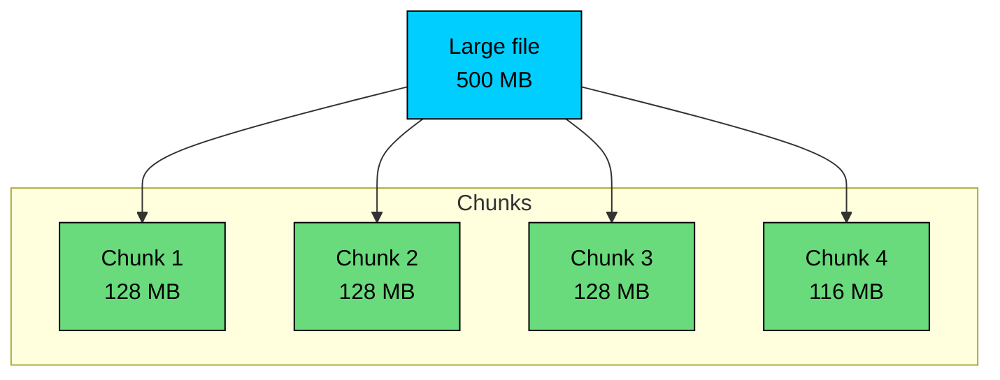
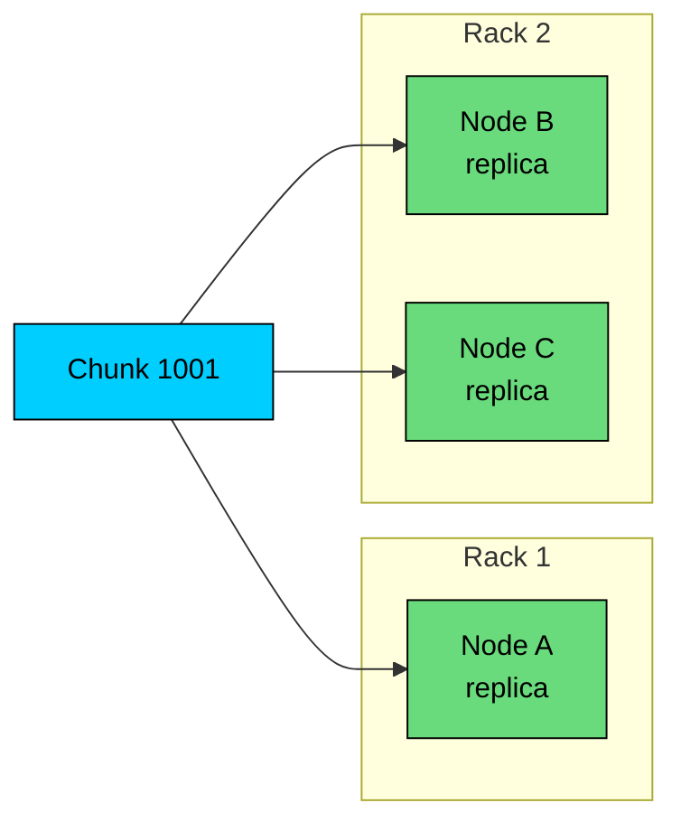
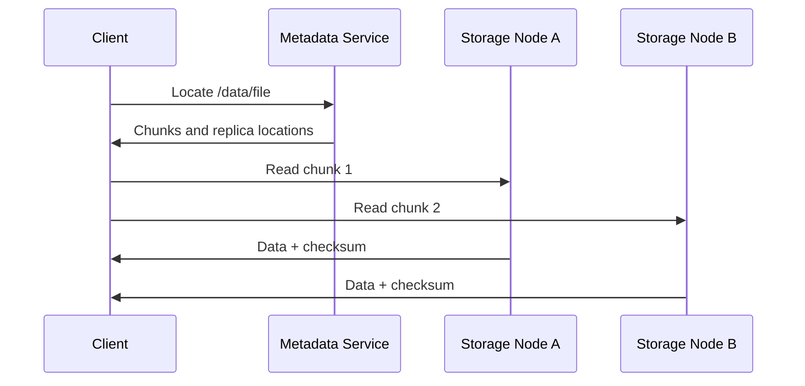
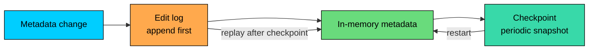
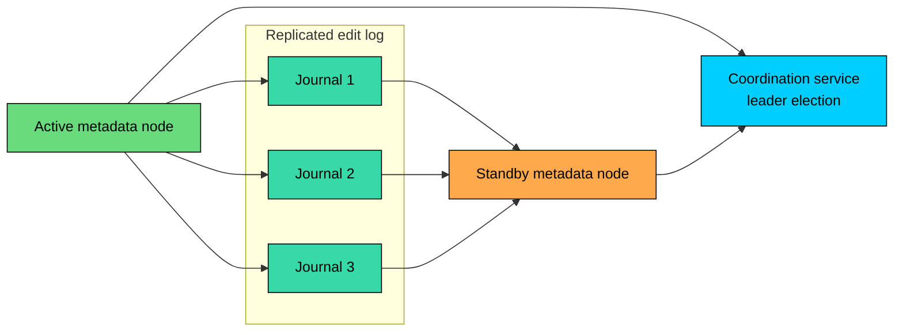
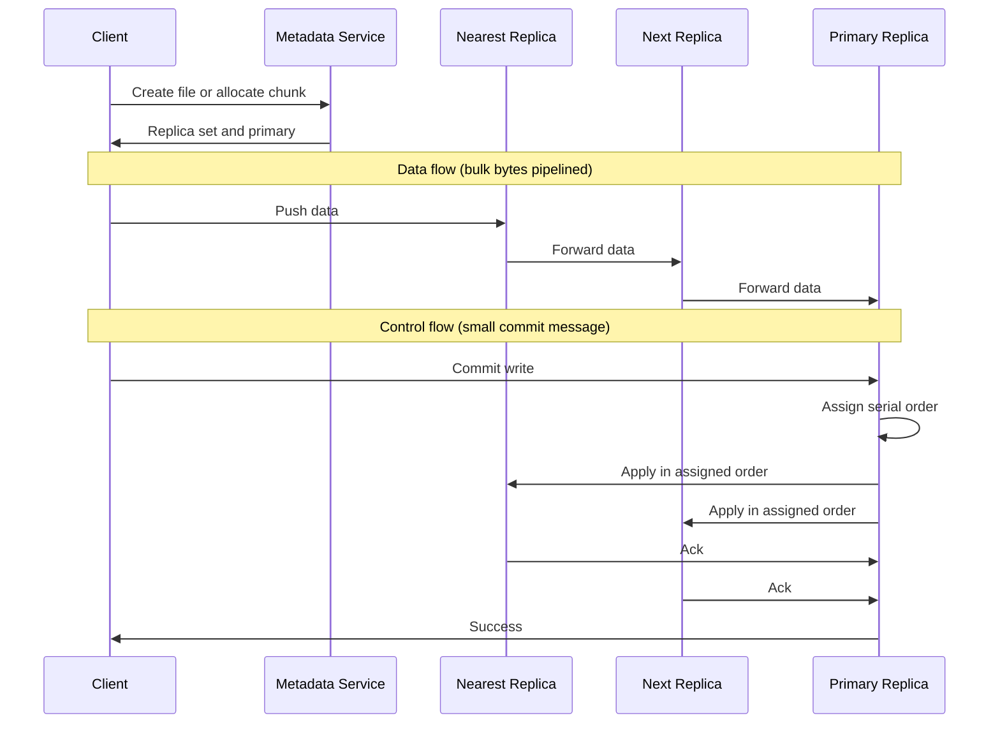
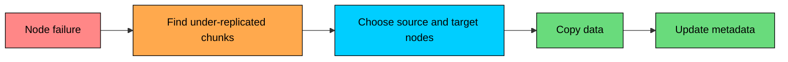

A local file system manages files on one machine. A **distributed file system (DFS)** manages files across many machines while presenting a shared namespace to clients.

When an application reads `/data/events/2026-05-24.json`, the file may actually be split across dozens of storage nodes. The client sees a path. The distributed file system handles metadata lookup, data placement, replication, recovery, and consistency.

Distributed file systems are common in large analytics clusters, HPC environments, on-premise storage platforms, and systems that need high aggregate throughput over large files. They are not always the right answer in the cloud, where object storage often provides similar durability and scale with far less operational work.

This chapter explains how distributed file systems work, why they are built the way they are, and when to choose one.

---

# 1. What is a Distributed File System"

> [!PAYWALL] This content is for premium members only.

A distributed file system stores file data on multiple servers and exposes a file-oriented interface to clients.

The exact interface depends on the system. HDFS and GFS are tuned for large files, sequential reads, and batch processing. Lustre targets high-throughput parallel I/O in HPC. CephFS aims for a POSIX-compatible file system on top of a distributed storage layer.

Cloud file services like EFS, Filestore, and Azure Files are managed distributed file systems exposed over NFS or SMB, rather than systems you operate yourself.

The common idea is the same: files are larger than one disk, disks fail, clients need a stable namespace, and the system must hide the distribution.

```mermaid
flowchart TB
    CLIENT["Client<br/>read /data/file.txt"]:::primary

    subgraph dfs["Distributed file system"]
        META["Metadata service<br/>namespace and locations"]:::orange
        S1["Storage node A<br/>chunk 1"]:::green
        S2["Storage node B<br/>chunk 2"]:::green
        S3["Storage node C<br/>chunk 3"]:::green
    end

    CLIENT -->|"Where is the file""| META
    META -->|"Chunk locations"| CLIENT
    CLIENT -->|"Read data"| S1
    CLIENT -->|"Read data"| S2
    CLIENT -->|"Read data"| S3

    classDef primary fill:#00ceff,stroke:#000,color:#000
    classDef orange fill:#ffa94d,stroke:#000,color:#000
    classDef green fill:#69db7c,stroke:#000,color:#000
```

The important design point is that metadata and file data are usually separated. Metadata tells clients what exists and where it lives. Data flows directly between clients and storage nodes so the metadata service does not become a bandwidth bottleneck.

---

# 2. Why Distributed File Systems Exist

Distributed file systems solve four practical problems.

### 2.1 Capacity

Single machines have finite disk capacity. If a dataset grows from terabytes to petabytes, it must span many machines.

A DFS spreads files across storage nodes while keeping a single logical namespace. Applications do not need to know which node holds which piece of a file.

### 2.2 Fault Tolerance

At scale, disk and server failures are routine. A DFS keeps extra copies or encoded fragments so data remains available after hardware failures.

The system also automates repair. When a node fails, the DFS detects under-replicated data and creates new replicas on healthy nodes.

### 2.3 Aggregate Throughput

A single storage server has limited I/O bandwidth. A cluster can read and write through many disks and network interfaces in parallel.

This is the main performance advantage of a DFS: not lower latency, but higher aggregate throughput for large files and large scans.

### 2.4 Data Locality

Some systems expose where file chunks live so compute frameworks can schedule work near the data.

This was a major reason HDFS fit MapReduce well. Instead of moving a huge dataset across the network to compute nodes, the scheduler tries to run tasks on nodes that already store the input blocks.

Data locality matters less in some modern cloud architectures because network bandwidth has improved and object storage is often remote from compute anyway. But for on-premise analytics and HPC clusters, it can still be a real advantage.

---

# 3. Core Architecture

Most distributed file systems combine five ideas: a metadata service, chunking, replication or erasure coding, direct client-to-storage data transfer, and failure detection with automatic repair.

### 3.1 Metadata Service

The metadata service manages the namespace and placement information. It tracks the directory tree and file names, permissions and ownership, sizes and timestamps, the mapping from files to chunks, the mapping from chunks to nodes, and the health and placement of each replica.

This metadata is small compared with file data, but it is accessed constantly. Many systems keep active metadata in memory and persist changes through logs and checkpoints.

The metadata service is also one of the hardest parts to scale. A cluster with a few million large files is much easier to manage than a cluster with billions of tiny files, even if the total bytes are smaller.

### 3.2 Chunking

DFS implementations split files into large chunks, sometimes called blocks or stripes.



Large chunks reduce metadata overhead and work well for sequential I/O. A 10 TB dataset split into 128 MB chunks creates far fewer metadata entries than the same dataset split into 4 KB blocks.

The trade-off is that DFS systems are often poor at handling many tiny files. Each file still needs namespace metadata. A million 1 KB files can put more pressure on the metadata service than a few thousand large files.

### 3.3 Replication

Replication stores multiple copies of each chunk on different nodes.



Placement is deliberate. Replicas should not all live on the same disk, server, rack, or availability zone. A rack-aware placement policy protects against shared power, switch, or rack-level failures.

Replication is simple and fast to read from, but it is expensive. Three replicas means storing three full copies. Some modern systems use erasure coding for colder data to reduce storage overhead, at the cost of more CPU and more complex recovery.

### 3.4 Client Data Path

A well-designed DFS keeps the metadata service out of the bulk data path.

The client asks the metadata service for chunk locations, then reads or writes data directly to storage nodes.



This separation lets the metadata service handle coordination while storage nodes provide aggregate bandwidth.

---

# 4. Metadata Management

Metadata management determines how large and reliable a DFS can become.

### 4.1 Namespace Metadata vs Location Metadata

There are two related but different kinds of metadata. **Namespace metadata** covers paths, directories, permissions, ownership, file sizes, and timestamps. **Location metadata** covers which chunks belong to each file and which nodes currently store each chunk.

Separating these concerns makes recovery easier. If a file is renamed, namespace metadata changes but chunk data does not move. If a node fails, chunk location metadata changes but file paths stay the same.

### 4.2 Persistence

If metadata only lived in memory, a master restart would lose the file system. DFS implementations persist metadata changes using logs and checkpoints.



The log records recent changes. The checkpoint captures a compact snapshot of current state. On restart, the system loads the latest checkpoint and replays log entries after it.

This is the same broad pattern used by many databases and consensus systems: append changes durably, keep hot state in memory, and checkpoint periodically to bound recovery time.

### 4.3 High Availability

A single metadata master is simple, but it is also a critical failure point. Production systems use standby masters, replicated logs, or distributed metadata services.



The standby follows the edit log and can take over if the active node fails. This reduces downtime, but it does not make metadata scaling free. Writes still need a clear owner or consensus path.

### 4.4 Scaling Metadata

Several techniques show up across real systems.

**Client-side caching** keeps chunk locations and file metadata around for repeated reads. **Read-only followers** serve metadata reads from replicas that trail the active master. **Federation** splits the namespace across multiple masters, for example one master for `/user` and another for `/warehouse`.

**Dynamic subtree partitioning** lets the system move hot directory subtrees between metadata servers as load shifts. **Algorithmic placement**, used by Ceph for its object layer, computes data locations from a small cluster map instead of storing every mapping centrally.

Each technique trades simplicity for scale. Centralized metadata is easier to reason about. Distributed metadata scales further but makes consistency, failover, and operations harder.

---

# 5. Read and Write Paths

### 5.1 Read Path

Reads have a simple control flow:

1. Client asks the metadata service for chunk locations.
2. Metadata service returns chunks and replica locations.
3. Client chooses nearby or healthy replicas.
4. Client reads chunks directly from storage nodes.
5. Client verifies checksums and assembles the file.

Reads can be parallelized across chunks and replicas. This is how DFS clusters provide high aggregate throughput.

Several optimizations cut read latency. Clients prefer the local node, the same rack, or a nearby zone when choosing a replica. Client-side caching of chunk locations avoids round trips to the metadata service.

Short-circuit reads bypass the network entirely when compute runs on the storage node. Speculative reads issue requests to multiple replicas and take the fastest response, which helps for tail-latency-sensitive workloads.

### 5.2 Write Path

Writes are harder because replicas must agree on what was written and in what order.

GFS introduced an idea that many later systems borrowed: separate the data flow from the control flow.

The bulk bytes travel along whichever replica is closest to the client and then pipeline through the remaining replicas, while a small control message goes to a designated primary that picks the serial order in which the write is applied.



Different systems use different details. HDFS uses a fixed pipeline from the client through `DataNode 1`, `DataNode 2`, and `DataNode 3`, with acks flowing back along the same chain. GFS picks the pipeline based on network topology and routes the control message to the primary separately.

Some systems allow only one writer per file, some support append but not random overwrite, and some allow random writes with stricter coordination. These choices directly shape the consistency model.

### 5.3 Pipeline vs Parallel Writes

| Approach | Benefit | Cost |
|----------|---------|------|
| Parallel push | Lower forwarding latency when the client has enough bandwidth | Client sends multiple copies |
| Pipeline push | Client sends one copy and replicas forward it | More hop-by-hop latency |

Pipeline writes are common when client bandwidth is limited and files are large. Parallel writes can work well in high-bandwidth datacenters when the client can efficiently send to all replicas.

---

# 6. Consistency and Semantics

Distributed file systems do not all provide the same file semantics. This is one of the easiest places to make a bad design assumption.

### 6.1 Why Consistency Is Hard

In a local file system, there is one machine coordinating file updates. In a DFS, data is replicated, clients may cache metadata, and failures can happen halfway through a write.

Every implementation has to take a position on whether two clients can write the same file at the same time, when a new file becomes visible to readers, and whether appends are atomic.

It also has to decide whether clients can read their own writes immediately, and what happens if a writer fails after some replicas have already received the data.

There is no universal answer. The correct behavior depends on the system.

### 6.2 HDFS-Style Semantics

HDFS keeps semantics simple by restricting writes. Only one writer per file is allowed, files are written sequentially, and existing data is not randomly overwritten. Readers get strong consistency for closed files, and new data can be made visible before close through explicit flush or sync operations.

This fits batch processing well. Jobs write output files once, close them, and downstream jobs read complete files.

### 6.3 GFS-Style Semantics

GFS was designed for Google's large sequential and append-heavy workloads. It allowed weaker semantics for some concurrent writes and provided an atomic record append operation.

The important lesson is not to memorize GFS terminology. The lesson is that a DFS may intentionally weaken familiar file-system behavior to get higher throughput or simpler recovery.

Applications using such systems must tolerate duplicates, padding, retry effects, or undefined regions after concurrent writes.

### 6.4 POSIX-Oriented Systems

Systems such as CephFS, Lustre, and some managed file services aim to provide more familiar file-system semantics.

That makes them easier for existing applications to use, but the implementation is more complex. Locks, cache invalidation, metadata concurrency, and rename semantics are hard in a distributed environment.

When a system says it is POSIX-compatible, still read the details. Performance and edge-case behavior can differ sharply from a local disk.

---

# 7. Fault Tolerance

Failure handling is not an add-on in a DFS. It is part of the normal control loop.

### 7.1 Failure Detection

Storage nodes send heartbeats to the metadata service or cluster manager. Heartbeats usually include liveness, disk usage, load, and sometimes chunk inventory.

Missing heartbeats does not always mean a node is permanently dead. It might be overloaded, paused, rebooting, or separated by a network issue. Good systems avoid overreacting because unnecessary repair work can flood the cluster.

### 7.2 Re-Replication and Repair

When a node is considered failed, its chunks become under-replicated. The system must create new replicas from surviving copies.



Repair is prioritized. A chunk with only one remaining replica is more urgent than a chunk that has two replicas but wants three.

Repair is also throttled. Copying too aggressively can saturate network and disk bandwidth, making the cluster less available while trying to heal it.

### 7.3 Checksums and Scrubbing

Disks can return corrupted data. Networks can corrupt data. Software bugs can write the wrong bytes.

Distributed file systems use checksums to detect corruption. On read, a client or storage node verifies the data. If a replica is corrupt, the client tries another replica and the system schedules repair.

Background scrubbing catches corruption before a client happens to read the file. This is especially important for cold data that might otherwise sit unread for months.

### 7.4 Master Recovery

After a metadata service restart, the system usually:

1. Loads the latest checkpoint.
2. Replays edit logs.
3. Receives block reports from storage nodes.
4. Rebuilds chunk-to-node mappings.
5. Stays read-only until enough block reports have arrived to confirm the cluster is healthy.
6. Resumes normal reads and writes.

HDFS calls step 5 **Safe Mode**. The NameNode exits Safe Mode once a configured fraction of known blocks have at least one reporting replica. The default threshold is 99.9% (`dfs.namenode.safemode.threshold-pct = 0.999`), and the NameNode also waits a short grace period after the threshold is reached before opening up writes.

Some systems do not persist every chunk location in the metadata checkpoint because storage nodes are the source of truth for what they actually hold. That design avoids constantly writing location changes, but it means startup depends on reports from storage nodes.

---

# 8. Major Implementations

### 8.1 Google File System (GFS)

GFS was designed for Google's early large-scale workloads: web crawling, indexing, log processing, and large sequential reads.

It uses 64 MB chunks, much larger than a typical local file-system block, which keeps metadata small. A single master handles the namespace and coordination, backed by shadow masters for read-only access and replicated operation logs for durability. Chunkservers store the data, with three replicas per chunk by default.

The design adds an atomic record append operation for many producers writing to shared files and accepts relaxed consistency where the workload can tolerate it. Data and control flow are decoupled: bulk bytes pipeline through the nearest replicas while the primary serializes the write order.

GFS is important because it made failures, commodity hardware, and application-aware semantics central to file-system design. Google has since replaced GFS internally with Colossus, which moves metadata off a single master and into a distributed store to break the namespace-size ceiling.

### 8.2 Hadoop Distributed File System (HDFS)

HDFS was inspired by GFS and built for Hadoop and MapReduce.

A single NameNode manages metadata, and DataNodes store blocks. The default block size is 128 MB (configurable through `dfs.blocksize`), and the default replication factor is 3 (configurable through `dfs.replication`).

The standard rack-aware placement policy puts one replica on a local rack and two replicas on a different rack, on different nodes. Writes go through a fixed pipeline: client to `DataNode 1` to `DataNode 2` to `DataNode 3`, with acks flowing back along the same chain.

One writer per file keeps consistency simple, and files are write-once with optional append rather than random overwrite. Data locality lets schedulers place work near data.

High availability uses a Standby NameNode that follows the edit log and takes over on failure. An Observer NameNode (Hadoop 3) can serve stale-tolerant metadata reads, and Federation splits the namespace across multiple NameNodes when one cannot hold it.

Reed-Solomon erasure coding has been available since Hadoop 3 for storage-efficient cold data.

A practical limit worth knowing: the NameNode keeps the namespace in memory, with roughly 150 bytes per file, directory, or block object.

That puts a soft ceiling of a few hundred million objects on a single NameNode, which is why HDFS handles a million large files much more comfortably than a million tiny ones.

HDFS is still relevant for Hadoop-style analytics, though many cloud data platforms now use object storage as the storage layer.

### 8.3 Lustre

Lustre is common in high-performance computing environments.

It is optimized for parallel I/O from many compute nodes to large shared files. Scientific simulations, model training pipelines, and HPC jobs often care about high aggregate bandwidth and coordinated access from many clients.

Lustre is a good reminder that not every DFS is HDFS. Some distributed file systems are built for POSIX-like shared files and high-performance parallel workloads rather than batch analytics alone.

### 8.4 CephFS

CephFS provides a file system on top of Ceph's distributed object storage layer, RADOS.

Ceph separates concerns across a few components. Monitors maintain cluster membership and the cluster maps. OSDs store objects and handle replication or erasure coding. Metadata servers manage the CephFS namespace on top of RADOS.

CRUSH, a deterministic algorithm, computes placement from the cluster map so the system does not need a central lookup for every object.

Ceph is powerful because the same cluster can expose block, object, and file interfaces. It is also operationally more complex than a managed cloud service.

### 8.5 Comparison

| System | Best Fit | Main Trade-off |
|--------|----------|----------------|
| GFS | Google's large sequential workloads | Specialized internal system with relaxed semantics |
| HDFS | Hadoop/Spark analytics on large files | Weak fit for small files and low-latency random access |
| Lustre | HPC and parallel file workloads | Operational complexity and specialized tuning |
| CephFS | On-premise unified storage with file semantics | Powerful but complex to operate well |
| Cloud object storage | Cloud-native data lakes and content storage | API/object semantics instead of file-system semantics |

---

# 9. When to Use Distributed File Systems

A distributed file system is the right choice when the dataset is too large for one machine, when the workload needs high aggregate throughput over large files, or when compute benefits from data locality.

It also fits when you run on-premise or somewhere managed object storage does not fit, when the workload is batch, analytics, HPC, or large-file oriented, or when you need a shared file namespace across many clients and understand the semantics.

It is the wrong choice when you need low-latency random access to individual records, when you have millions or billions of tiny files, or when you need ACID transactions.

It is also the wrong choice when you mainly store immutable blobs in the cloud, when your application requires exact local file-system behavior the DFS does not provide, or when your team does not have the capacity to operate storage infrastructure.

### Decision Guide

```mermaid
flowchart TD
    A{"What is the workload""}:::yellow

    A -->|"Large sequential analytics files"| B{"Need to operate storage yourself""}:::yellow
    B -->|"Yes / on-premise"| C["DFS such as HDFS"]:::green
    B -->|"No / cloud-native"| D["Object storage + compute"]:::green

    A -->|"Shared POSIX-like files"| E{"High-performance parallel I/O""}:::yellow
    E -->|"Yes"| F["Lustre or similar DFS"]:::green
    E -->|"No"| G["Managed file storage or NFS"]:::green

    A -->|"Low-latency records"| H["Database or key-value store"]:::green
    A -->|"Static blobs, media, backups"| D

    classDef yellow fill:#ffd43b,stroke:#000,color:#000
    classDef green fill:#69db7c,stroke:#000,color:#000
```

---

# 10. Summary

Distributed file systems spread files across many machines while presenting a shared file namespace.

The core techniques are metadata separation, chunking, replication or erasure coding, direct client-to-storage data transfer, checksums, heartbeats, and automatic repair.

They are excellent for large files, high aggregate throughput, data locality, analytics clusters, HPC workloads, and on-premise storage platforms. They are a poor fit for tiny files, low-latency random record access, transactional updates, and teams that do not want to operate complex storage systems.

The main design question is not "Can this store files"" It is "What file semantics does it provide, and do those semantics match the workload"" Once you answer that, the choice between DFS, object storage, file storage, and databases becomes much clearer.

---

# Quiz
