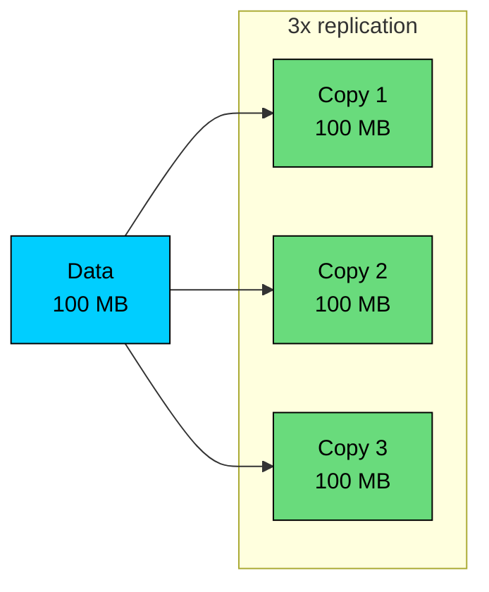
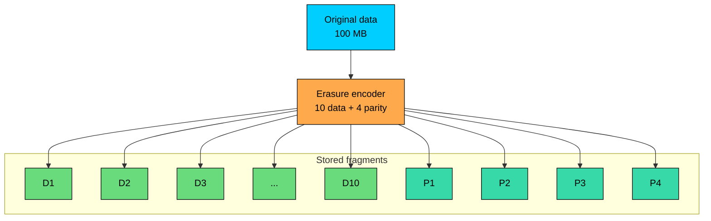
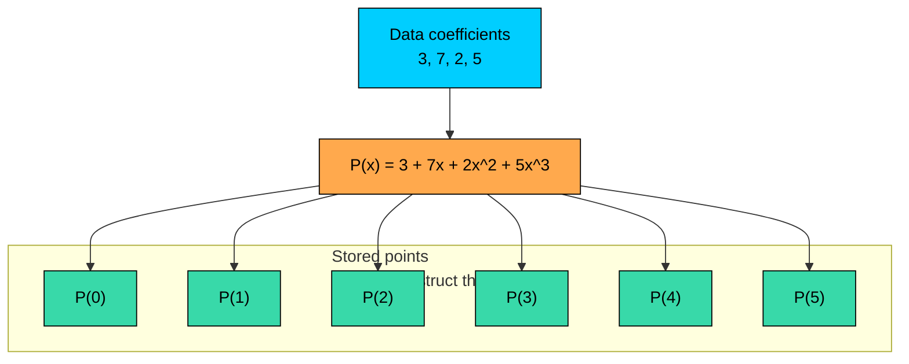
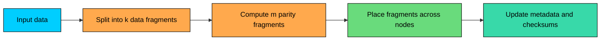
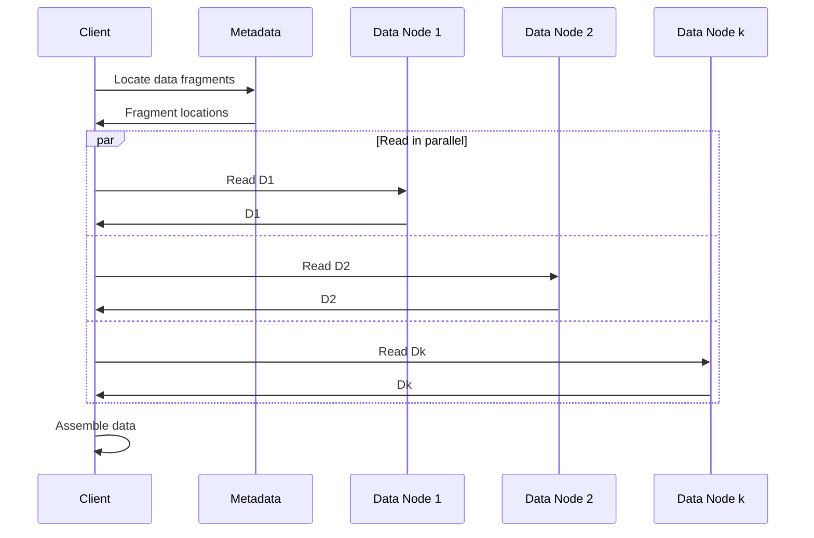
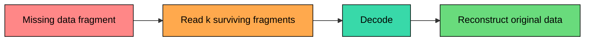
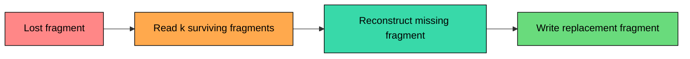
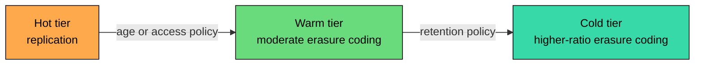

Replication is the simplest way to protect data: store multiple copies. If one copy is lost, read another one.

The problem is cost. With 3x replication, every 1 TB of user data consumes 3 TB of raw storage. That 200% overhead is acceptable for hot data, but painful for large archives, backups, data lakes, object stores, and cold file systems.

**Erasure coding** provides fault tolerance with less storage. Instead of storing full copies, it splits data into fragments, computes additional parity fragments, and stores all fragments across different failure domains. If some fragments are lost, the original data can be reconstructed from the surviving fragments.

The trade-off is not subtle: erasure coding saves storage, but makes writes, degraded reads, and repairs more expensive.

---

# 1. The Problem with Replication

> [!PAYWALL] This content is for premium members only.

With replication, the system stores complete copies of the same data.

| Metric | 3x Replication |
|--------|----------------|
| User data | 100 MB |
| Raw storage used | 300 MB |
| Storage overhead | 200% |
| Failure tolerance | Can lose 2 copies |
| Repair | Copy from a surviving replica |

Replication has real advantages. Reads are simple because any copy can serve the request. Repair is simple because a missing copy can be recreated from one surviving copy. Latency is predictable compared with reconstruction-based schemes, and operational behavior is easy to reason about.

Those advantages are why replication is still widely used for hot data, metadata, databases, and low-latency storage.

The downside is raw capacity. At petabyte or exabyte scale, storing full extra copies becomes one of the largest infrastructure costs. Erasure coding exists to reduce that overhead while preserving high durability.

---

# 2. How Erasure Coding Works

Erasure coding turns `k` data fragments into `k + m` total fragments, where `k` is the number of data fragments, `m` is the number of parity fragments, and the system can lose up to `m` of the `k + m` stored fragments and still reconstruct the original data.

Many texts use `(k, n)` notation, where `n = k + m`. Storage systems often use `(k, m)` notation. Both describe the same idea.

### 2.1 A Simple Example

A `10+4` scheme splits the data into 10 data fragments, computes 4 parity fragments, and stores all 14 across different nodes or failure domains. Any 10 surviving fragments are enough to reconstruct the original data.

For 100 MB of data, each data fragment is 10 MB. The four parity fragments are also 10 MB each, so total storage is 140 MB.

Storage overhead:

That is much lower than 200% overhead from 3x replication.

### 2.2 Common Schemes

| Scheme | Data Fragments (`k`) | Parity Fragments (`m`) | Total Fragments | Overhead | Failure Tolerance |
|--------|----------------------|------------------------|-----------------|----------|-------------------|
| 4+2 | 4 | 2 | 6 | 50% | Loss of up to 2 fragments |
| 6+3 | 6 | 3 | 9 | 50% | Loss of up to 3 fragments |
| 10+4 | 10 | 4 | 14 | 40% | Loss of up to 4 fragments |
| 12+4 | 12 | 4 | 16 | 33% | Loss of up to 4 fragments |

Higher `k` values reduce overhead, but they also increase the number of fragments that must be read for reconstruction. Higher `m` values improve fault tolerance, but add storage and write cost.

### 2.3 Placement Matters

Erasure coding only helps if fragments are placed across independent failure domains.

If all fragments for a stripe sit in one rack, a rack failure can still destroy the data. Good placement spreads fragments across disks, nodes, racks, and sometimes availability zones, depending on the system's failure model.

The math says "any 10 of 14 fragments." The storage system still has to make sure real-world failures do not take out too many fragments at once.

---

# 3. Reed-Solomon Encoding

The most common erasure coding family in storage systems is **Reed-Solomon**.

You do not need to implement Reed-Solomon by hand to understand system design, but you should understand the shape of the idea.

### 3.1 Polynomial Intuition

Reed-Solomon is based on this property:

> A polynomial of degree `k - 1` is uniquely determined by `k` points.

A line is a degree-1 polynomial. Any two points define the line. If you store three points on the line, you can lose one point and still reconstruct the line from the remaining two.

Reed-Solomon generalizes this idea. Treat the original data as the coefficients of a polynomial, evaluate that polynomial at more than `k` points, and store the evaluated points as fragments. Any `k` surviving points reconstruct the polynomial, and the polynomial coefficients recover the original data.

### 3.2 Tiny Example

For clarity, this example stores six polynomial evaluations directly rather than using a systematic layout.

Assume the data values are:

Treat them as coefficients of a polynomial:

This is a degree-3 polynomial, so any 4 points are enough to reconstruct it. To create a `4+2` code, evaluate it at 6 points and store the results.

If two points are lost, four remain. Four points are enough to interpolate the polynomial and recover the original coefficients.

Real implementations do this over finite fields, not ordinary integers. That keeps values bounded, avoids overflow, and makes byte-oriented encoding efficient. The system designer does not need the algebra details, but the consequence matters: Reed-Solomon can tolerate any `m` missing fragments in a `k+m` scheme.

### 3.3 Systematic Codes

A pure polynomial-evaluation encoding forces decoding on every read, even when nothing has failed.

Most production storage systems use **systematic** erasure codes instead. A systematic code is built so that the first `k` stored fragments are exactly the original data bytes, and the remaining `m` fragments are computed parities.

Conceptually, the encoder picks evaluation points so the first `k` outputs match the input symbols, and only the last `m` outputs are new.

That changes the operational picture. Normal reads fetch the original data fragments and concatenate them with no decoding work at all.

Decoding only runs when one or more data fragments are missing, and debugging is simpler because the fragments on disk are recognizably the original data. This is why erasure coding can have good normal-read performance while still having expensive degraded-read behavior.

---

# 4. Read, Write, and Repair Paths

### 4.1 Write Path

When data is written into an erasure-coded system:

1. The system splits data into `k` fragments.
2. It computes `m` parity fragments.
3. It writes all `k + m` fragments to selected locations.
4. It records fragment locations and checksums in metadata.
5. It acknowledges success according to the system's durability policy.

Compared with replication, writes usually involve more CPU and more destinations. That is why erasure coding is not the default choice for every hot write path.

### 4.2 Normal Read Path

With a systematic code and no failures, the client reads the `k` data fragments and reconstructs the object or file by concatenating them.

No parity decoding is needed in the normal path.

The `k` reads happen in parallel, so the read latency is bounded by the slowest of the `k` data nodes rather than the sum of their latencies. That parallelism is what lets erasure-coded reads stay competitive with replication when the cluster is healthy.

### 4.3 Degraded Read Path

If some data fragments are missing, the client reads any `k` surviving fragments and decodes the missing data.

This path is slower because it reads from more nodes, waits for the slower fragments to arrive, runs decode computation, and handles more complex retry behavior.

This is called **degraded mode**. A system can look healthy to users most of the time, then become noticeably slower during failures because many reads require reconstruction.

### 4.4 Repair Path

Repair is where erasure coding becomes operationally expensive.

If one fragment is lost, the system often has to read `k` surviving fragments to reconstruct the missing one.

In a `10+4` scheme with 10 MB fragments, repairing one lost 10 MB fragment requires reading 10 surviving fragments (100 MB) to compute and write back a single 10 MB replacement.

Replication would repair the same loss by copying 10 MB from one surviving replica, so erasure coding often reads ten times more data than replication for the same repair.

During large failures, repair traffic can compete with production traffic. Storage systems throttle repairs, prioritize the most vulnerable stripes, and choose placement carefully to avoid creating new hotspots.

### 4.5 Local Reconstruction Codes

Reed-Solomon repair cost is the main operational complaint about plain erasure coding. Reconstructing one lost 10 MB fragment in a `10+4` scheme reads 100 MB from across the cluster, and during a wide outage that adds up fast.

**Local Reconstruction Codes (LRC)** address this directly. Instead of a single global parity group, LRC splits the data into smaller local groups, computes a local parity for each group, and then adds a smaller number of global parities on top.

Microsoft's Azure Storage uses an LRC layout often written as `(12, 2, 2)`: 12 data fragments split into 2 local groups of 6, with 1 local parity per group (2 local parities total) and 2 global parities computed across all 12 data fragments.

A single fragment loss can usually be repaired by reading only the 6 fragments in its local group plus the local parity, instead of 12 fragments spread across the cluster. Two simultaneous losses in the same group, or losses that span groups, fall back to the global parities.

| Property | Reed-Solomon (10+4) | LRC (12, 2, 2) |
|----------|---------------------|----------------|
| Total fragments | 14 | 16 |
| Storage overhead | 40% | 33% |
| Fragments read to repair one loss | 10 | 6 (in the same local group) |
| Worst-case fault tolerance | 4 | Varies with where the losses fall |

LRC trades a small amount of extra storage and more complex fault analysis for a much cheaper common-case repair.

That trade-off matters at the scale of cloud object storage, where single-fragment failures are constant and reading 40% less data per repair shows up directly in bandwidth bills and tail latency during recovery.

---

# 5. Erasure Coding vs Replication

| Aspect | Replication | Erasure Coding |
|--------|-------------|----------------|
| Storage overhead | High | Much lower |
| Normal read latency | Low | Low for systematic codes |
| Degraded read latency | Usually low | Higher due to decoding |
| Write cost | Write full copies | Encode and write more fragments |
| Repair bandwidth | Low | Higher, often much higher |
| CPU cost | Minimal | Encoding and decoding cost |
| Small objects | Works well | Often inefficient without packing |
| Operational complexity | Lower | Higher |
| Best fit | Hot data, metadata, low latency | Warm/cold large data, archives, object stores |

### 5.1 Use Replication When

Replication is usually the better fit for hot data with frequent reads, for metadata and control-plane state, for low-latency services, for small objects or small files, for write-heavy workloads, and for systems where operational simplicity matters more than raw capacity.

Replication is not primitive or outdated. It is the right tool when latency, simplicity, and fast repair matter more than storage efficiency.

### 5.2 Use Erasure Coding When

Erasure coding is usually the better fit for large objects or large files, for backups and archives, for warm or cold data, for object storage backends, for data lake storage, and for any system where raw storage cost dominates the design.

The best candidates are datasets that are written once, read occasionally, and large enough that fragment metadata overhead is small compared with the data.

### 5.3 Hybrid Storage

Large storage systems often use both.

A practical policy might keep recent data replicated, move older data to a `6+3` scheme, and move long-term archives to a higher-ratio scheme. The exact policy depends on read frequency, recovery objectives, hardware, and failure domains.

---

# 6. Production Considerations

### 6.1 Small Object Problem

Erasure coding has fixed overhead per stripe: fragment metadata, placement, checksums, and minimum allocation sizes.

For tiny objects, the overhead can erase the storage savings. Storage systems handle this by replicating small objects instead of erasure-coding them, packing many small objects into larger containers, using log-structured layouts, or moving objects to erasure-coded storage only after compaction has produced larger units.

### 6.2 Tail Latency

An erasure-coded read may need `k` fragments. If one of those nodes is slow, the whole read can be slow.

Systems reduce tail latency by reading from extra fragments and using the first `k` responses, avoiding known-overloaded nodes, caching hot data, and keeping the hottest data replicated rather than erasure-coded.

### 6.3 Repair Storms

A single disk failure is normal. Many failures during a rack outage, power event, bad deployment, or network partition can create a repair storm.

Repair storms are dangerous because they increase load while the system is already less redundant. Good systems rate-limit repair, prioritize high-risk stripes, and separate repair traffic from user traffic when possible.

### 6.4 Correlated Failures

Erasure coding math often assumes independent fragment loss. Real failures are not always independent.

A rack power failure, a firmware bug affecting a whole drive batch, an operator deleting the wrong pool, a region or availability-zone outage, or a software bug corrupting multiple fragments can all knock out many fragments at once.

Placement policy, versioning, backups, object lock, and cross-region replication exist because math alone does not cover every failure mode.

### 6.5 Metadata Durability

Fragments are useless if the system loses the metadata that describes which fragments belong together.

Metadata must be protected carefully, often with stronger replication or consensus-based storage. Many systems replicate metadata even when user data is erasure-coded.

---

# 7. Real-World Use

### 7.1 Cloud Object Storage

Large object storage systems commonly use erasure coding internally because they store enormous amounts of mostly immutable data.

Providers do not usually expose the exact internal coding layout. They expose durability, availability, storage classes, lifecycle policies, and region/zone placement behavior. The implementation may combine replication, erasure coding, checksums, background repair, and cross-zone placement.

The important design lesson is that object storage uses erasure coding where its trade-offs fit: large durable objects, cost-sensitive retention, and managed background repair.

### 7.2 HDFS

HDFS added native erasure coding in Hadoop 3.

Administrators can apply erasure-coding policies to directories. For example, a cold data directory can use a Reed-Solomon policy while hot directories remain replicated.

The policy name `RS-6-3-1024k` encodes 6 data units, 3 parity units, and a 1024k cell size.

This reduces storage overhead compared with 3x replication, but it is best suited for colder files because degraded reads and repairs are more expensive.

### 7.3 Ceph

Ceph supports replicated pools and erasure-coded pools.

An erasure-code profile defines parameters such as `k`, `m`, and the coding plugin:

Ceph gives operators a lot of control, which also means more responsibility. The right profile depends on failure domains, drive count, recovery bandwidth, CPU capacity, and workload shape.

---

# 8. Summary

Erasure coding reduces storage overhead by storing data plus parity fragments instead of full extra copies.

In a `k+m` scheme, data is split into `k` fragments and `m` parity fragments are computed. Any `k` surviving fragments can reconstruct the original data, so the system can tolerate up to `m` missing fragments if placement is correct.

The main benefit is storage efficiency. The main costs are encoding CPU, degraded-read latency, repair bandwidth, placement complexity, and weaker fit for tiny or frequently modified data.

Use replication for hot data, metadata, small objects, and low-latency paths. Use erasure coding for large warm or cold data where storage cost matters more than repair and degraded-read cost.

In production, the hard part is not the formula. The hard part is choosing the right scheme, placing fragments across real failure domains, protecting metadata, controlling repair traffic, and knowing which data should stay replicated.

---

# Quiz
