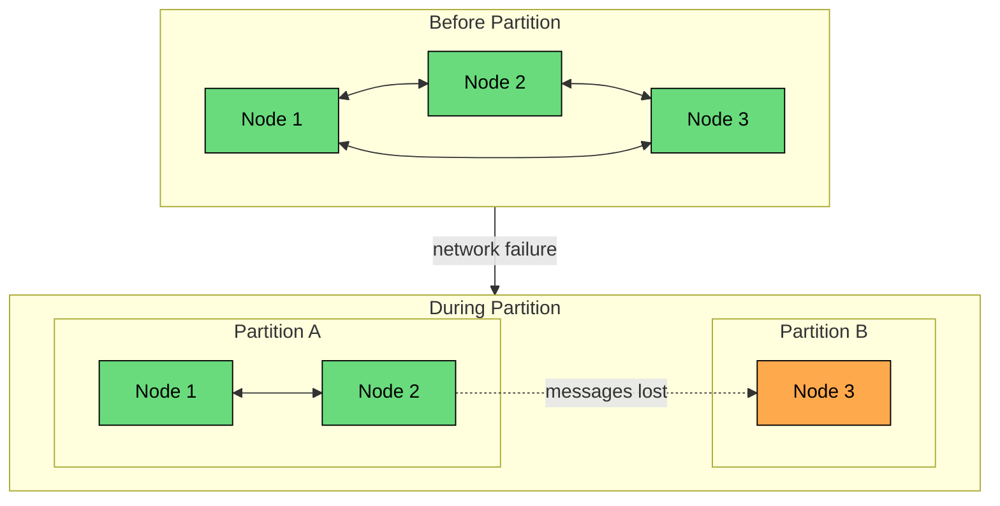
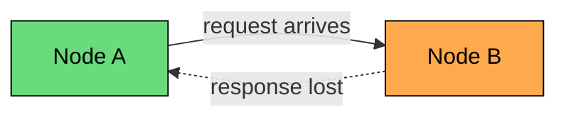
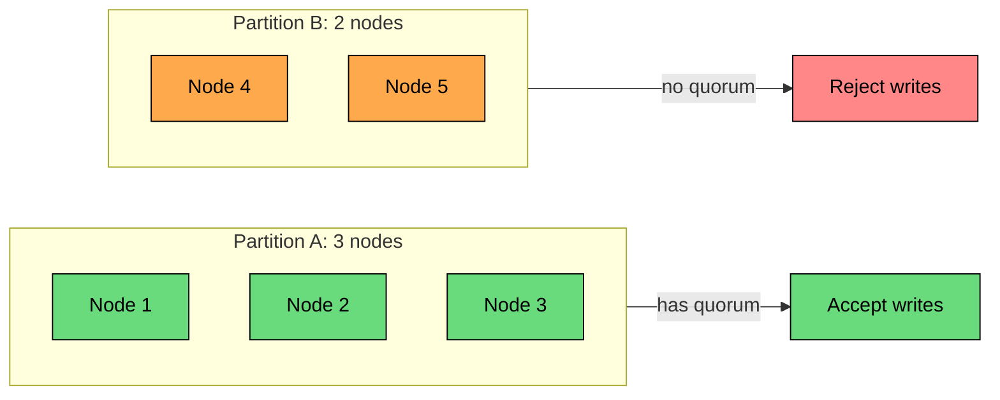
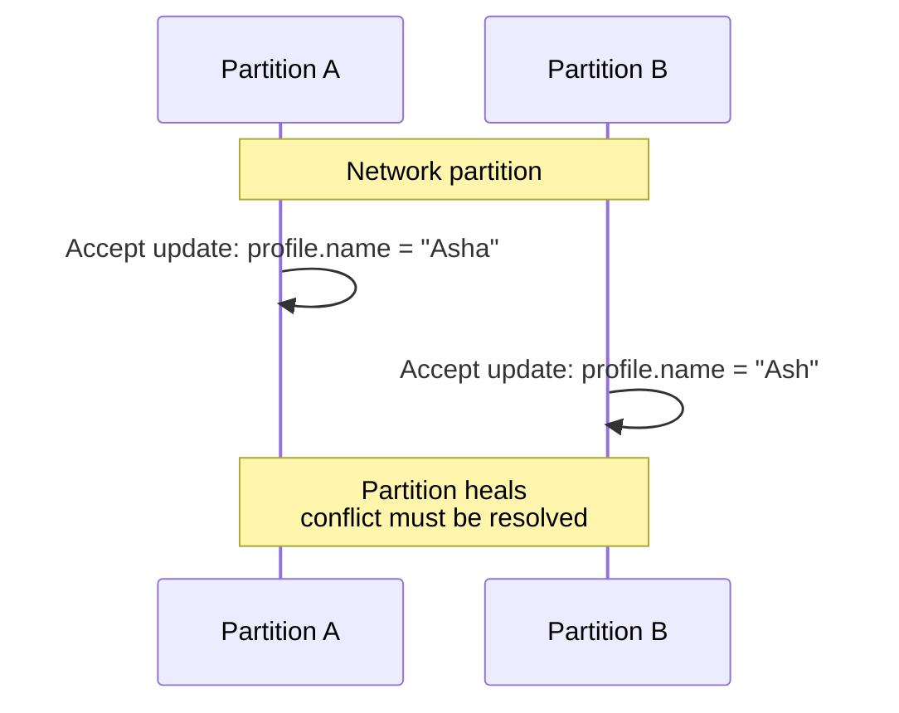
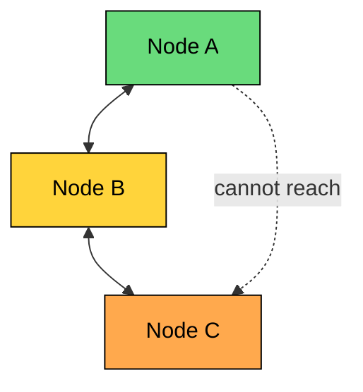
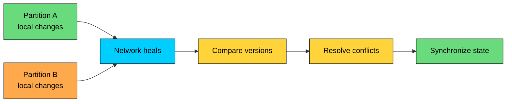

A network partition happens when parts of a distributed system can no longer communicate with each other.

The machines may still be running. The processes may still be healthy. From the outside, both sides may even look like they are serving traffic normally.

The problem is that the system has lost the ability to coordinate across the partition boundary.

That is what makes partitions dangerous. A crashed node stops making changes. A partitioned node keeps making changes, while other nodes make different changes at the same time, and neither side knows about the other until the network heals.

---

# What Is a Network Partition"

> [!PAYWALL] This content is for premium members only.

A network partition occurs when a distributed system splits into two or more groups of nodes that cannot reliably exchange messages.

Within each group, nodes still communicate normally. Across groups, messages are lost, delayed long enough to be useless, or blocked in one direction.



The important difference from a node failure is that the partitioned nodes are still alive.

A crashed node stops running, cannot serve traffic, cannot change data, and shows up to callers as a timeout or connection failure. The main risk is lost capacity.

A partitioned node is the opposite on almost every count: it is usually still running, often still serving local traffic, and still capable of changing data if the system allows it. Callers may see timeouts, stale data, or even apparent success that conflicts with another partition. The main risk is no longer lost capacity but divergent state.

The most dangerous case is not "nothing works." It is "both sides work independently."

---

# Why Partitions Happen

Partitions are not only caused by large infrastructure failures like a fiber cut. Many ordinary production failures can isolate nodes from each other.

| Cause | Example | What It Can Do |
|-------|---------|----------------|
| **Hardware failure** | Failed switch, router, NIC, or cable | Isolate a rack, host, zone, or region |
| **Routing issue** | Bad route, BGP problem, wrong subnet table | Send packets to the wrong place or nowhere |
| **Firewall or ACL change** | New rule blocks service-to-service traffic | Break one protocol while others still work |
| **DNS failure** | Nodes cannot resolve peer addresses | Make healthy nodes unreachable by name |
| **TLS or certificate issue** | Expired cert or trust-store mismatch | Make connections fail even though the network path exists |
| **Resource exhaustion** | Full connection table, port exhaustion, overloaded proxy | Drop or delay traffic under load |
| **Cloud networking issue** | Virtual network, load balancer, or zone connectivity problem | Partition infrastructure you do not directly control |

Some partitions are complete: no traffic crosses the boundary. Others are partial or asymmetric.

An asymmetric partition is especially tricky: A can send to B, but B's response does not reach A. From A's point of view, B looks down. From B's point of view, A is sending requests and ignoring responses.



This is why retry and idempotency behavior matters. Node A may retry because it never saw a response, while Node B may already have processed the original request.

---

# The CAP Trade-Off During a Partition

CAP is often explained as "choose two of three," but that phrasing is easy to misuse.

For distributed systems, partitions are not optional. The real question is what the system does **when a partition occurs**: preserve consistency by rejecting operations that cannot be coordinated, or preserve availability by accepting operations and resolving divergence later.

The three CAP properties are easy to state. Consistency means a read sees the latest committed write, or the system returns an error.

Availability means every request to a non-failing node receives a non-error response. Partition tolerance means the system continues operating correctly when messages between nodes are lost or delayed.

During a partition, a node cannot know what is happening on the other side. If it accepts a write, it may conflict with another write. If it rejects the write, the system becomes unavailable for that operation.

```mermaid
flowchart TD
    P["Network partition"]:::orange --> Q{"What should this node do""}:::yellow

    Q --> C["Reject writes that need coordination"]:::primary
    Q --> A["Accept writes locally"]:::green

    C --> C2["Consistency preserved<br/>availability reduced"]:::primary
    A --> A2["Availability preserved<br/>conflicts possible"]:::green

    classDef orange fill:#ffa94d,stroke:#000,color:#000
    classDef yellow fill:#ffd43b,stroke:#000,color:#000
    classDef primary fill:#00ceff,stroke:#000,color:#000
    classDef green fill:#69db7c,stroke:#000,color:#000
```

### Choosing Consistency

A consistency-first design refuses operations that might violate the system's invariants.

Example: a five-node cluster requires a majority quorum of three nodes for writes. If the cluster splits into three nodes and two nodes, only the three-node side can continue accepting writes.



This is the default for systems where a wrong write is much worse than a delayed write: Raft- or Paxos-based coordination services, leader election, and configuration storage.

The same logic applies to payment ledgers, inventory reservations, and anything else where violating an invariant is worse than returning an error.

The trade-off is user-visible failure. The minority partition may be healthy, but it cannot safely accept writes.

### Choosing Availability

An availability-first design keeps serving requests during the partition and deals with conflicts later.



This works well when conflicts are tolerable or mergeable: shopping carts, likes and reaction counters, drafts and collaborative edits with conflict handling, social feeds, and user preferences where stale data is acceptable.

The trade-off is reconciliation. The system must detect conflicting updates, decide how to merge them, and make that behavior acceptable to the product.

### Most Real Systems Are Configurable

Avoid labeling a whole product as "CP" or "AP" without context. Many databases and storage systems expose configuration knobs that change behavior dramatically.

Requiring majority writes will reject anything that cannot reach a quorum; allowing local writes will accept them in the partition and reconcile later.

Strong reads reject responses that cannot be proven current, while stale reads serve data from local replicas or caches. Single-leader configurations let only the partition with the valid leader write at all, while multi-leader setups allow multiple partitions to write and resolve conflicts afterward.

The right question is not "Is this database CP or AP"" The better question is "For this operation, with this configuration, what happens during a partition""

---

# Partition Shapes

Different partition shapes create different risks.

### Majority and Minority

This is the cleanest case for quorum-based systems.

Only one side can have a majority, so only one side can safely make quorum-protected decisions.

### Even Split

In a four-node cluster split 2-2, neither side has a majority.

That is why consensus clusters are usually deployed with an odd number of voting members.

With `N` voters, the majority quorum is `floor(N/2) + 1`, so a 3-node cluster tolerates 1 failure, a 5-node cluster tolerates 2, and a 7-node cluster tolerates 3.

A 4-node cluster still only tolerates 1 failure because it needs a 3-node quorum, so the extra voter does not improve write availability.

### Partial Connectivity

Not every partition is a clean split.



Node A and Node C cannot talk directly, but both can talk to Node B. This can happen with routing errors, firewall rules, or partially failed network equipment.

Partial connectivity makes failure detection harder because different nodes have different views of the cluster.

### Flapping Connectivity

Sometimes the network repeatedly fails and recovers.

This is often worse than a clean outage. Systems may elect a leader, lose it, start recovery, cancel recovery, and repeat. Without backoff and hysteresis, the cluster spends more time reacting to topology changes than serving traffic.

---

# Detecting Partitions

Detecting a partition is not the same as detecting a broken cable. Most applications only observe symptoms: missing responses, failed connections, or delayed heartbeats.

When Node A stops hearing from Node B, several explanations are possible:

```mermaid
flowchart TD
    T["No response from Node B"]:::orange --> Q{"What happened""}:::yellow

    Q --> C["Node B crashed"]:::red
    Q --> S["Node B is overloaded"]:::yellow
    Q --> N["Network is slow"]:::yellow
    Q --> P["Network is partitioned"]:::red

    classDef orange fill:#ffa94d,stroke:#000,color:#000
    classDef yellow fill:#ffd43b,stroke:#000,color:#000
    classDef red fill:#ff8787,stroke:#000,color:#000
```

From Node A's point of view, these cases can look identical.

### Common Detection Techniques

| Technique | How It Works | Limitation |
|-----------|--------------|------------|
| **Heartbeats** | Nodes periodically send "I am alive" messages | Missed heartbeats can mean slowness, overload, or partition |
| **Timeouts** | Mark a peer suspect after no response for a threshold | Short timeouts create false positives; long timeouts delay recovery |
| **Quorum checks** | Ask whether a majority can still communicate | Requires enough healthy nodes to answer |
| **Gossip membership** | Nodes exchange peer health information | Detection is eventual, not instant |
| **External witness** | A third party helps decide which side should continue | The witness can also be unreachable |

### Timeout Tuning

Timeouts are a trade-off.

Production systems usually avoid taking drastic action after a single missed response. They use multiple missed heartbeats, suspicion states, quorum checks, or failure detectors that adapt to recent latency.

The goal is not perfect detection. Perfect detection is impossible in an asynchronous network. The goal is to make conservative decisions that match the cost of being wrong.

---

# Designing for Partitions

Good partition handling starts by separating operations by their consistency requirements. Not every feature needs the same behavior.

Charging a card needs idempotency and durable confirmation so a retry cannot create a second charge. Reserving scarce inventory needs a quorum or a single authoritative owner so two requests cannot both succeed.

Adding an item to a cart can be accepted locally and merged later. Liking a post can also be accepted locally and reconciled with a counter or set. Reading a profile can serve stale data if the product allows it.

Updating access control is the exception in the other direction: it should prefer consistency, because stale authorization data is one of the more dangerous things to serve.

### Use Quorums for Critical Decisions

Quorums prevent two sides of a partition from both making the same exclusive decision.

They are the standard tool for protecting decisions that cannot be safely repeated or repaired: electing a leader, committing a write, acquiring a distributed lock, updating cluster membership, and changing configuration.

Quorums reduce availability, but they protect invariants that cannot be repaired later.

### Make Available Operations Mergeable

If an operation can proceed during a partition, design its data model so conflicts are easy to handle.

An append-only log works well for events, comments, and audit records, though it needs ordering and deduplication on top. Set union fits tags, likes, and cart items, though removes may need special handling.

Counters and CRDTs cover reactions, metrics, and some inventory-like counts, but they cannot express every business rule. Versioned records suit documents, profiles, and settings, but require a conflict UI or merge logic to resolve them.

Last-write-wins is the simplest option, but it is not neutral: it chooses data loss as the conflict-resolution strategy. Use it only when that is acceptable.

### Define Degraded Modes

Some systems continue serving a smaller feature set during partitions.

An e-commerce site might keep product pages cached and visible while disabling checkout. A storage layer might allow reads and reject writes. An order pipeline might accept orders but hold them in a pending state until payment confirmation. A recommendation system might fall back to local heuristics and disable cross-region personalization.

Degraded mode should be designed in advance. An improvised degraded mode during an incident usually becomes a second incident.

---

# Recovering After a Partition

When the network heals, the system is not automatically healthy. Recovery is work.



Recovery usually includes:

1. **Rejoining:** Nodes reconnect and exchange membership or replication state.
2. **Comparison:** Each side identifies writes, versions, log entries, or events the other side missed.
3. **Conflict detection:** The system finds records that changed independently.
4. **Resolution:** Conflicts are merged, rejected, replayed, compensated, or escalated.
5. **Catch-up:** Lagging nodes apply missing data.
6. **Verification:** The cluster confirms that replicas are consistent enough to serve normal traffic.

Recovery can be more expensive than the partition itself. Large backlogs, hot keys, conflicting writes, and cache invalidations can overload the system just as connectivity returns.

Plan for this with rate-limited catch-up, clear ownership rules, replayable logs, idempotent consumers, and observability around replication lag and conflict counts.

---

# Common Mistakes

| Mistake | Why It Hurts |
|---------|--------------|
| Treating timeouts as proof of failure | The remote side may still be running or may have completed the work |
| Retrying non-idempotent writes | A retry can duplicate payments, orders, emails, or jobs |
| Assuming one side is "correct" | Both sides may contain valid writes made by different users |
| Using timestamps as the only conflict resolver | Clock skew can cause the wrong update to win |
| Letting all partitions accept exclusive writes | This can violate uniqueness, inventory, or leadership invariants |
| Forgetting recovery load | Catch-up traffic can cause a second outage |

---

# Summary

A network partition splits a distributed system into groups that cannot reliably communicate. The nodes may still be healthy, which is exactly why the failure is dangerous.

Key ideas:

- **Partitions are partial failures:** the system may be alive, but coordination is broken.
- **CAP shows up during partitions:** preserving consistency means rejecting some work; preserving availability means accepting possible divergence.
- **Partition shape matters:** majority/minority, even split, partial connectivity, and flapping links behave differently.
- **Detection is uncertain:** timeouts and heartbeats are useful, but they cannot prove whether a peer is slow, dead, overloaded, or partitioned.
- **Recovery is part of the design:** after the network heals, the system must compare state, resolve conflicts, and catch up safely.

The safest designs start from business invariants. Decide which operations must stop during a partition, which can continue with stale data, and which can be merged later.

The next chapter goes deeper into the most dangerous partition failure mode: split-brain, where more than one node believes it is the leader.

---

# Quiz
