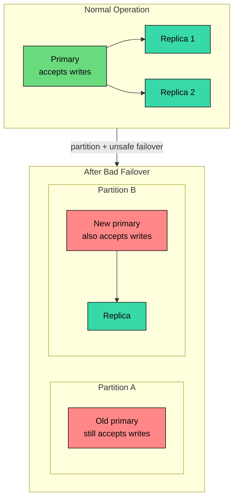
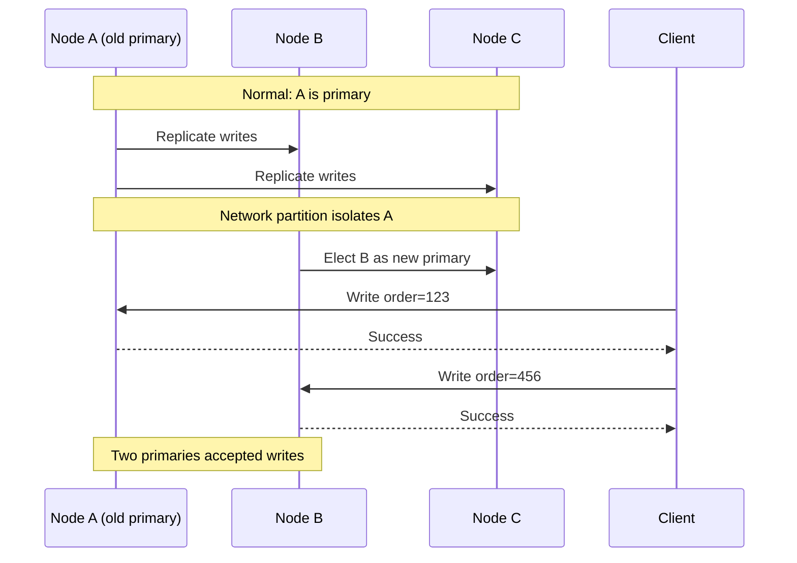
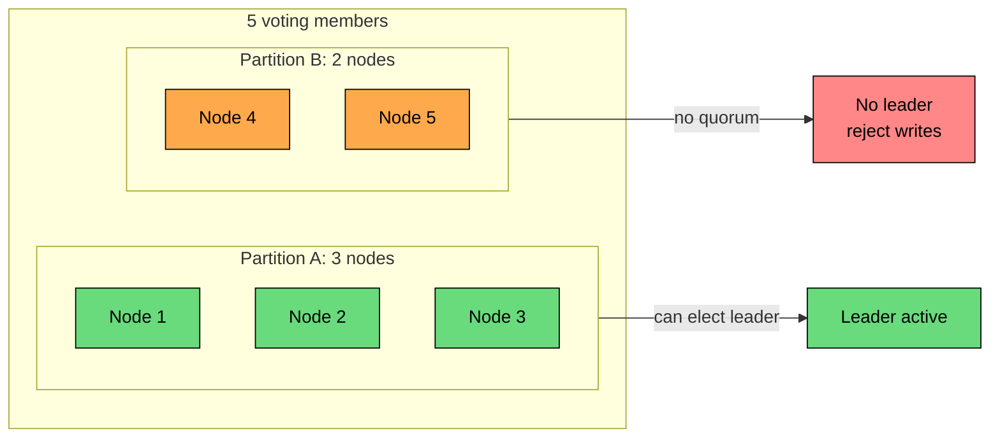
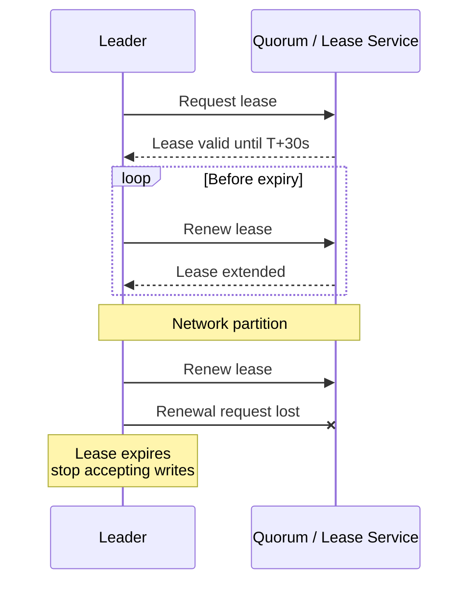
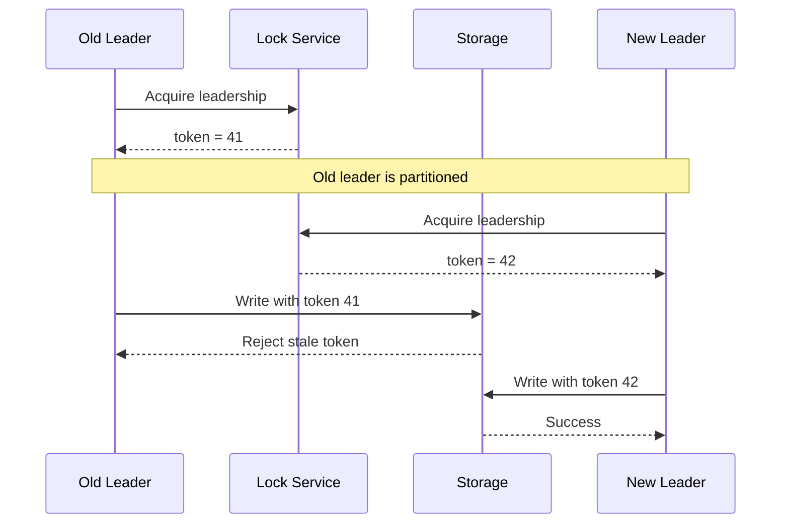
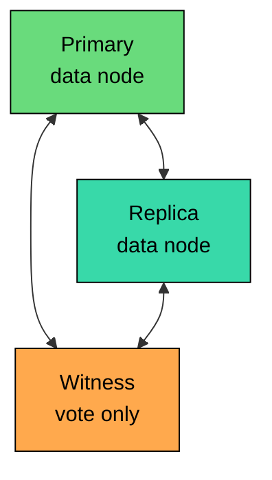

Split-brain is a failure mode where more than one node believes it is the leader and starts making authoritative decisions.

In a healthy leader-based system, one node coordinates writes and others follow. That single-leader rule is what gives the system one ordered history of changes.

Split-brain breaks the rule: a network partition, slow failure detector, or unsafe failover can leave the old leader still accepting writes while another node is promoted in its place. The system now has two sources of truth.

The damage is not always obvious at the moment. It appears later, when the system tries to merge two histories that should never have existed.

---

# What Is Split-Brain"

> [!PAYWALL] This content is for premium members only.

Split-brain occurs when a distributed system has multiple active leaders for the same responsibility.

That responsibility might be accepting writes for a database shard, owning a distributed lock, running a scheduled job, assigning work in a queue, managing cluster membership, or acting as the primary for a replicated service.



The problem is not only that two nodes are running. Many systems intentionally run many replicas. The problem is that two nodes are allowed to make exclusive decisions for the same data or resource.

---

# Why Split-Brain Is Dangerous

Split-brain creates two independent histories. Each history may look valid locally, but they can violate global rules when combined.

### Example: Account Balance

Both primaries start at a balance of $1000. Primary A processes a $700 withdrawal and updates its local balance to $300, but cannot see Primary B.

At the same time, Primary B accepts a $500 withdrawal and updates its balance to $500, blind to A's update.

When the network heals, neither final balance is correct. The user withdrew $1200 from an account that had $1000. Each primary accepted a withdrawal that seemed valid using its local state, but the global invariant was broken.

### What Can Go Wrong

The damage shows up at every level of the stack. Different primaries store different values for the same record. Recovery picks one history and silently discards writes from the other.

Two leaders run the same scheduled job, send the same email, or charge the same payment. Two users end up with the same username, booking, or invoice number. Inventory drops below zero, or money is spent twice.

And when engineers finally untangle it, they are often staring at logs trying to decide which writes to preserve.

Some conflicts can be merged. Many cannot. A shopping cart can often merge added items. A payment ledger cannot casually merge two conflicting withdrawals.

The key lesson: split-brain is more than a replication problem. It is a business-invariant problem.

---

# How Split-Brain Happens

Split-brain usually appears during failover.

Now both A and B are active primaries.



### Why the Old Primary Does Not Know

The old primary cannot reliably distinguish four cases that all look the same from its side: the replicas crashed, the network is slow, the replicas are alive but partitioned away, or the replicas have already elected a new primary.

Without a quorum, lease, or fencing mechanism, "I cannot reach the others" is not enough information to make a safe leadership decision.

---

# Where Split-Brain Shows Up

Split-brain can happen anywhere the system has an exclusive role.

In a primary-replica database, the old primary and a promoted replica both accept writes. In a distributed scheduler, two schedulers run the same job. In a queue consumer group, two consumers believe they own the same partition.

With a distributed lock, two clients each believe they hold it. In a cluster manager, two controllers both change membership or routing. In a shared-storage HA cluster, two nodes mount and write the same disk.

The names change, but the bug is the same: two actors make decisions that require a single owner.

---

# Prevention Strategy 1: Quorum-Based Leadership

The most common prevention strategy is majority quorum.

A node can become or remain leader only if it can communicate with a majority of voting members. Since two different partitions cannot both contain a majority, at most one partition can elect a valid leader.



For `N` voting nodes, the majority quorum is `floor(N/2) + 1`. A three-node cluster can tolerate one failure, a five-node cluster can tolerate two, and a seven-node cluster can tolerate three.

This is the core idea behind consensus systems such as Raft and Paxos. A leader election requires majority agreement, and committed writes require majority agreement.

### What Quorums Prevent

Quorums prevent two leaders from both being valid at the same time. They do not automatically solve every operational problem.

The minority partition becomes unavailable for writes. A slow or overloaded node can trigger an election it did not need. Misconfigured cluster membership can break the quorum math entirely.

And external systems that write outside the consensus path must still reject stale leaders, since quorum alone cannot stop them.

Quorum is the foundation. Production systems often add fencing and tokens for defense in depth.

---

# Prevention Strategy 2: Leader Leases

A leader lease is a time-limited permission to act as leader.

The leader must renew the lease before it expires. If it cannot renew, it must stop accepting writes.



Leases are useful because they give leadership an expiration time. The old leader does not need to know who replaced it. It only needs to know that it no longer has a valid lease.

### Lease Caveats

Leases depend on conservative time assumptions, and several things can undermine them.

A slow clock can convince a leader its lease is still valid when it is not. A process may pause past the expiry and resume as if nothing happened, especially during a long garbage-collection cycle.

Renewal responses can arrive late or be duplicated by the network. And clients with stale routing information may keep sending writes to an old leader long after it has lost authority.

A safe lease implementation must be conservative. If there is doubt, the leader steps down.

---

# Prevention Strategy 3: Fencing

Fencing prevents an old leader from continuing to affect shared resources after it loses leadership.

This matters because software state can lie. A node may be partitioned, paused, buggy, or unaware that it has been replaced. Fencing changes the environment so the stale leader cannot do damage.

| Fencing Type | What It Does | Example |
|--------------|--------------|---------|
| **Storage fencing** | Removes the old node's ability to write shared storage | SCSI reservations, volume detach |
| **Network fencing** | Blocks the old node from serving traffic | Switch ACL, load balancer removal |
| **Power fencing** | Powers off or reboots the old node | IPMI, iLO, cloud instance stop |

### STONITH

STONITH means "Shoot The Other Node In The Head." The name is blunt, but the idea is simple: before a standby becomes primary, it makes sure the old primary cannot still write.

```mermaid
flowchart LR
    D["Failover needed"]:::orange --> F["Fence old primary"]:::red
    F --> C{"Fencing confirmed""}:::yellow
    C -->|"yes"| P["Promote new primary"]:::green
    C -->|"no"| S["Do not promote"]:::red

    classDef orange fill:#ffa94d,stroke:#000,color:#000
    classDef red fill:#ff8787,stroke:#000,color:#000
    classDef yellow fill:#ffd43b,stroke:#000,color:#000
    classDef green fill:#69db7c,stroke:#000,color:#000
```

For shared-storage systems, fencing is not optional. If two nodes can write the same disk at the same time, filesystem or database corruption can follow quickly.

In cloud systems, fencing may mean terminating an instance, detaching a volume, revoking a lease, or removing a node from routing. The mechanism changes, but the safety requirement is the same: the stale leader must lose write authority.

---

# Prevention Strategy 4: Fencing Tokens

Fencing tokens protect downstream systems from stale leaders.

Each time leadership is granted, the leader receives a monotonically increasing token. Every write includes the token. The storage layer remembers the highest token it has accepted and rejects writes with older tokens.



Fencing tokens are powerful because they handle delayed messages and paused processes. Even if the old leader wakes up later and tries to write, the storage layer can reject it.

The catch: the downstream resource must enforce the token. A token that is checked only by the client is not fencing. The storage system, queue, or external service must reject stale tokens itself.

---

# Prevention Strategy 5: Witness Nodes

A witness is a lightweight voter used to break ties.

In a two-node database cluster, a 1-1 split has no majority. Adding a witness creates three voting members without adding a full data replica.



A witness helps decide which side can continue. It does not store the full dataset, and it does not replace fencing. If the old primary can still write somewhere after losing the vote, you still need a way to stop it.

---

# Detecting Split-Brain

Prevention is the priority, but monitoring is still necessary. Configuration bugs, manual failovers, and incomplete fencing can still create split-brain symptoms.

Watch for signals that indicate more than one authority exists. The clearest is more than one node advertising the same leader role at the same time.

Frequent elections or lease changes are a softer signal that something is destabilizing leadership. Downstream systems rejecting writes from old fencing tokens means a stale leader is still trying to work.

Divergent logs across nodes, replication conflict spikes after a partition or failover, and the same scheduled job firing on multiple nodes are all evidence that the system has split into more than one source of truth.

Useful alerts include:

The alert should not only page "cluster unhealthy." It should identify the affected shard, resource, leader role, or job owner. Split-brain recovery is hard enough without vague alarms.

---

# Recovery After Split-Brain

If split-brain happens, recovery must be careful. Do not reconnect everything and hope replication fixes it.

Typical recovery steps:

1. **Stop the damage:** Freeze writes or isolate one side.
2. **Establish authority:** Decide which leader, log, or quorum is authoritative.
3. **Preserve evidence:** Keep logs, write-ahead logs, binlogs, audit events, and snapshots.
4. **Compare histories:** Identify writes accepted by each side.
5. **Classify conflicts:** Separate mergeable changes from unsafe changes.
6. **Repair or compensate:** Replay, merge, reverse, or manually correct affected records.
7. **Rejoin carefully:** Let stale nodes catch up before serving traffic again.
8. **Fix the cause:** Update failover, quorum, fencing, or monitoring gaps.

The recovery approach has to match the data.

Append-only audit events can be deduplicated by event ID and replayed in a safe order. Shopping cart items can be merged if the semantics allow it.

Account balances should be reconstructed from ledger entries, never guessed from the final balance on either side. Unique usernames need a chosen winner and a remediation path for the other. External side effects have to be reconciled with the external provider or undone with a compensating action.

The best recovery is the one you never need because split-brain was prevented. The second best is a recovery process based on durable logs and idempotent operations.

---

# Availability Trade-Off

Split-brain prevention usually reduces availability during failures.

| Choice | Benefit | Cost |
|--------|---------|------|
| Require quorum | Prevents competing leaders | Minority partition cannot write |
| Use leases | Bounds stale leadership | Requires conservative timing and renewals |
| Fence before promotion | Prevents old primary from writing | Failover may wait or fail if fencing cannot be confirmed |
| Use fencing tokens | Blocks stale writes downstream | Every downstream writer must enforce tokens |
| Allow both sides to write | Maximizes availability | Requires conflict resolution and may violate invariants |

The right choice depends on the invariant.

For a payment ledger, stopping writes is usually better than accepting conflicting writes. For a social reaction counter, accepting writes and reconciling later may be fine.

For a job scheduler, duplicate execution may or may not be acceptable depending on whether the job is idempotent.

---

# Common Mistakes

| Mistake | Why It Is Unsafe |
|---------|------------------|
| Promoting a replica before fencing the old primary | The old primary may still accept writes |
| Trusting heartbeats alone | A timeout cannot prove a node is dead |
| Using a two-node cluster with no witness | A 1-1 split has no safe tie-breaker |
| Assuming leases are safe without clock discipline | Clock skew and pauses can extend stale leadership |
| Issuing fencing tokens but not enforcing them downstream | The stale leader can still write |
| Treating recovery as simple replication catch-up | Divergent histories may contain conflicting valid writes |

---

# Summary

Split-brain happens when more than one node acts as the authority for the same resource. It often appears during unsafe failover after a partition or false failure detection.

Key ideas:

- **The core bug is dual authority:** two leaders accept work that should have one owner.
- **The damage is business-level:** balances, inventory, locks, jobs, and uniqueness rules can be violated.
- **Quorums prevent competing valid leaders:** only a majority side can make leadership decisions.
- **Leases limit stale leadership:** leaders must stop when their lease expires.
- **Fencing stops old leaders:** stale nodes lose access to storage, network, or power.
- **Fencing tokens protect downstream systems:** stale writes are rejected even if delayed messages arrive later.
- **Monitoring is still needed:** alert on multiple primaries, stale tokens, divergent logs, and duplicate execution.

The guiding rule is simple: before a new leader starts writing, make sure the old leader cannot still write.

The next chapter covers heartbeats, the mechanism many systems use to detect failed or unreachable nodes before failover begins.

---

# Quiz
