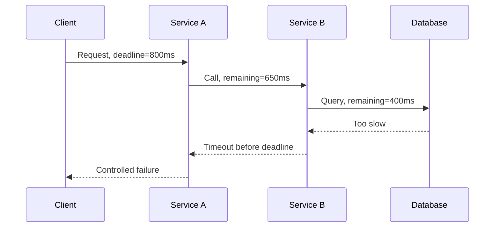
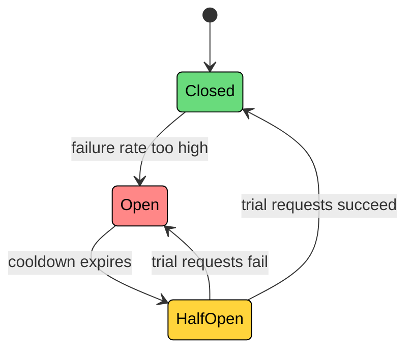
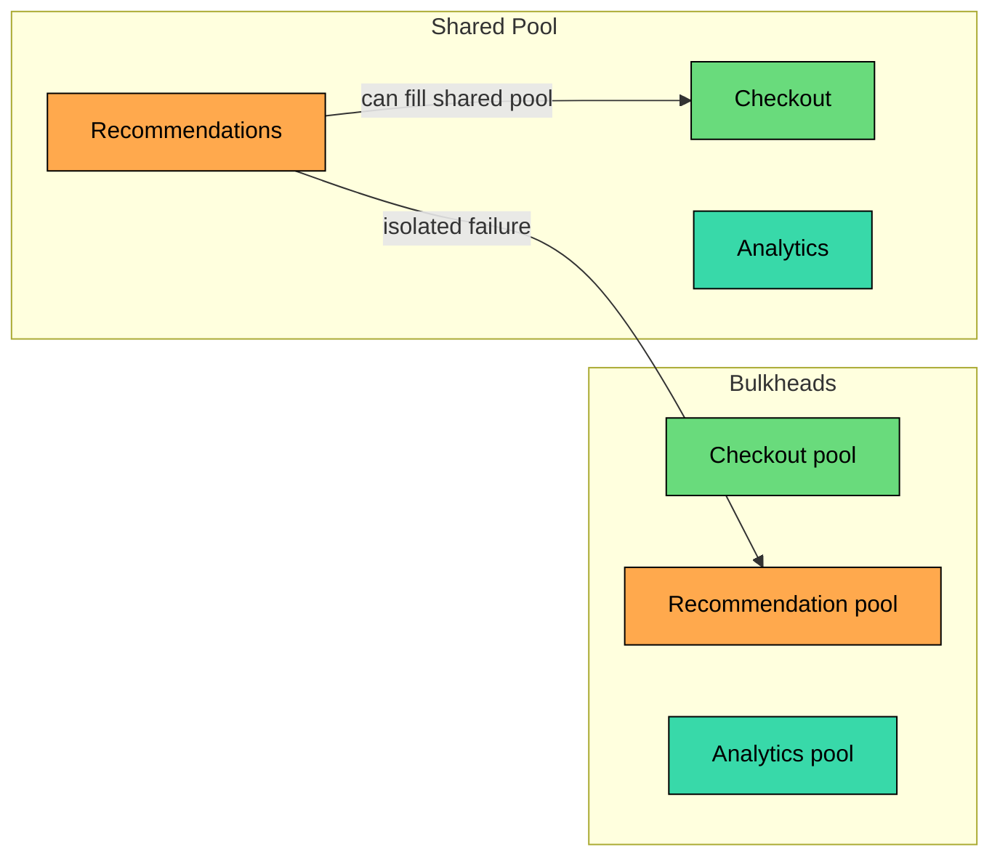
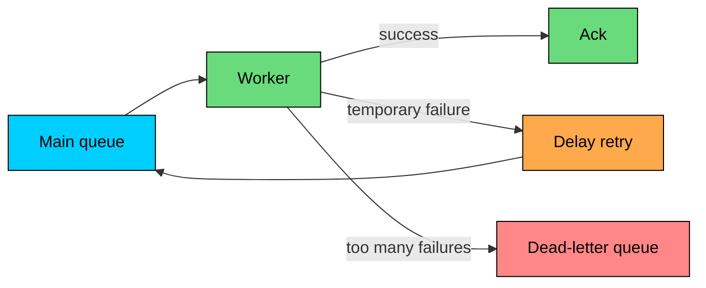

Distributed systems fail in pieces.

One service times out while the rest of the request is still running. One replica falls behind while another keeps serving reads. One region loses a dependency while another stays healthy. A deployment breaks only the new version. A retry succeeds twice.

Good distributed systems are not systems that never fail. They are systems that limit the damage, preserve the invariants that matter, recover predictably, and give operators enough visibility to understand what happened.

The hard part is not memorizing patterns; it is knowing which failure you are handling, which invariant must be protected, and what trade-off you are making.

---

# Start With Failure Modes

> [!PAYWALL] This content is for premium members only.

Before choosing a mitigation, name the failure.

| Failure Mode | Example | Common Risk |
|--------------|---------|-------------|
| **Network failure** | Timeout, packet loss, DNS issue, TLS failure | Unknown outcome |
| **Node failure** | VM crash, container killed, disk failure | Lost capacity or unavailable data |
| **Service failure** | Bug, deadlock, memory leak, bad dependency call | Error spikes or slow responses |
| **Dependency failure** | Database, cache, queue, payment provider unavailable | Cascading failure |
| **Overload** | CPU saturated, thread pool full, queue growing | Latency collapse |
| **Data inconsistency** | Stale reads, lost updates, duplicate side effects | Broken business state |
| **Deployment/config failure** | Bad flag, bad secret, incompatible schema | Fast, wide blast radius |
| **Time-related failure** | Clock skew, bad timeout, expired lease | Wrong ordering or unsafe expiry |

Different failures require different responses. Retrying a transient network error may help. Retrying a validation error will not. Failing open may be fine for recommendations. It is usually wrong for authorization.

---

# Decide What Must Be Protected

The first design question is:

> What must never be wrong, even during failure"

A payment must not be charged twice. Inventory must not be sold below zero. A user without permission must not get access. A job must not run twice unless it is idempotent. A committed ledger entry must not disappear.

These are **invariants**, and they decide where you need strong coordination, durable state, idempotency, or fail-closed behavior.

Everything else can often degrade. Payment capture prefers correctness, with idempotency keys and durable confirmation. Access control prefers fail-closed when freshness cannot be trusted.

Product recommendations can serve popular items or hide the section entirely. Search suggestions can return partial results or fall back to a cached response. Analytics events can buffer, retry, or be dropped depending on business value. Email notifications can queue and retry later without anyone noticing.

Resilience starts by separating critical correctness from optional experience.

---

# Pattern 1: Timeouts and Deadlines

Every remote call needs a timeout. Without one, a slow dependency can hold threads, sockets, memory, and request slots until the caller fails too.

A timeout answers: **How long am I willing to wait for this operation"**

A deadline answers: **How much total time does this request have left"**

Deadlines are usually better for request chains because they prevent each hop from spending a full timeout independently.



Good timeout practice is consistent across the stack: set a timeout on every network call, database call, queue call, and third-party API call. Base the values on observed latency at p95/p99, not averages.

Use shorter timeouts for optional work than for critical work, and pass a request deadline through downstream calls so each hop spends a slice of the caller's remaining budget.

Always treat a timeout as an **unknown outcome**, not proof that the operation failed.

Avoid infinite timeouts. They turn partial failure into resource exhaustion.

---

# Pattern 2: Retries With Backoff and Budgets

Retries help with transient failures: brief packet loss, a leader election, a connection reset, or a short overload period.

Retries also create load. During an outage, thousands of callers retrying at the same time can make recovery harder.

Retries are only safe when the failure might be temporary, the operation is safe to repeat (or protected by idempotency), the caller still has time before its deadline, and the retry rate is bounded so a retry storm cannot form.

Good retry practice combines exponential backoff with jitter, a cap on attempts, and a cap on total retry time bounded by the request deadline.

Never retry permanent errors such as validation failures, always respect `Retry-After` and rate-limit responses, and apply a retry budget so retries can never dominate normal traffic during an outage.

| Failure | Retry" | Why |
|---------|--------|-----|
| Network timeout | Maybe | Could be transient, but outcome may be unknown |
| HTTP 500/503 | Usually | Server may recover |
| HTTP 429 | Yes, after delay | Caller is being rate-limited |
| HTTP 400 | No | Request is invalid |
| Authentication failure | No | Credentials or permissions must be fixed |
| Payment capture timeout | Only with idempotency key | Avoid duplicate charge |

Retries are medicine. Dose matters.

---

# Pattern 3: Idempotency

Idempotency means the same operation can be applied more than once without changing the result beyond the first application.

In distributed systems, idempotency is what makes retries safe.

Example: creating an order.

The server stores the key with the result:

1. If the key is new, process the request and store the response.
2. If the key already exists, return the stored response.
3. If the first attempt is still in progress, return a safe "processing" response or wait according to policy.

This protects against client retries after timeouts, duplicate message delivery, worker restarts, at-least-once queue processing, and response loss after successful processing.

Idempotency requires durable storage. An in-memory idempotency cache is not enough for critical operations because it disappears during the exact failure it is meant to handle.

---

# Pattern 4: Circuit Breakers

A circuit breaker stops calling a dependency that is already failing.

Without a circuit breaker, callers keep sending requests to a broken dependency. Those calls wait, time out, retry, and consume resources. The failure spreads backward into the caller.



In the **Closed** state, calls flow normally and failures are counted. Once the failure rate crosses a threshold, the breaker moves to **Open**, where calls fail fast without reaching the dependency.

After a cooldown, the breaker moves to **Half-open** and lets a small number of trial calls through to check whether the dependency has recovered.

Circuit breakers are most useful for dependencies where failure can cascade: internal services, databases and caches, search clusters, third-party APIs, and any slow network call that risks tying up caller resources.

They should usually pair with a fallback, a clear error response, or a queueing strategy. Failing fast is only useful if the caller has a safe next step.

---

# Pattern 5: Bulkheads

Bulkheads isolate resources so one failing area cannot consume everything.

If checkout, search, recommendations, and analytics all share the same thread pool, a slow recommendation service can exhaust the pool and block checkout. The checkout code may be healthy, but it cannot run.



Bulkheads can be applied at any resource boundary: separate thread pools, separate connection pools, separate queues, separate worker pools, separate database users or connection limits, or separate Kubernetes deployments for critical and optional paths.

Per-tenant or per-customer limits do the same thing horizontally, keeping one heavy customer from starving the rest.

Bulkheads turn a system-wide failure into a smaller failure.

---

# Pattern 6: Load Shedding and Backpressure

When a service is overloaded, accepting more work can make everything worse.

**Load shedding** means rejecting work intentionally to preserve the health of the system.

**Backpressure** means telling upstream producers to slow down.

These ideas show up in several concrete mechanisms. Rate limiting rejects callers that send too much traffic, usually with a `429 Too Many Requests`. Concurrency limits reject or queue requests once too many are in flight.

Queue bounds stop the system from accepting new jobs when the backlog is already too large. Priority shedding drops low-importance traffic (analytics, optional features) before touching critical paths like checkout.

And when the producer is something the consumer can negotiate with, flow control reduces stream or window size so the producer slows down on its own.

The goal is controlled failure. A service that rejects 5% of low-priority requests may keep serving critical traffic. A service that accepts everything may collapse and serve nothing.

Good overload behavior is explicit about which traffic is protected, which traffic is shed first, what error the caller sees, whether callers can retry and when, and how much capacity the system holds back for recovery.

---

# Pattern 7: Fallbacks and Degraded Modes

A fallback is what the system does when the preferred dependency or data source is unavailable.

A catalog service that is slow can be replaced with cached product data. A failing ranking service can mean the recommendations section is hidden entirely. A failed live location lookup can fall back to the user's last known location.

An email that cannot be sent synchronously can be queued instead. A database going through failover can switch the application into read-only mode.

Each option has its own failure mode. Cached data is great for product pages, profiles, and configuration, but the cache can be stale or, worse, unsafe to serve. A default response works for optional UI sections, but a poorly chosen default can mislead users.

Partial responses suit search, feeds, and dashboards, as long as the missing fields are not critical. Read-only mode is fine during maintenance or failover, but users need clear feedback that writes are not happening. Queuing for later works well for email, webhooks, and analytics, but it shifts the failure to backlog growth and duplicate processing.

Bad fallbacks can be worse than errors. Do not show a stale account balance as if it is current. Do not allow a user through authorization because the auth service is down. Do not silently drop a payment event.

Fallbacks should be safe, visible, and tested.

---

# Pattern 8: Queues, DLQs, and Replay

Queues help decouple producers from consumers. They absorb bursts, smooth traffic, and let work continue when a consumer is temporarily unavailable.

They also introduce new failure modes. A message may be delivered more than once. A consumer may crash after doing the work but before acknowledging the message.

A poison message may fail forever. A backlog may grow faster than consumers can drain it.

Good queue-based failure handling pairs idempotent consumers with explicit acknowledgment after successful processing, retry limits with delayed backoff, and dead-letter queues for messages that keep failing.

On top of that, replay tooling lets the DLQ be drained safely, and monitoring tracks backlog age, not only queue depth.



A DLQ is not a trash can. It is a work queue for investigation, repair, and replay. If nobody watches it, it is just hidden data loss.

---

# Pattern 9: Replication and Failover

Replication provides spare capacity and data redundancy. Failover moves traffic or leadership from a failed component to a healthy one.

For stateless services, failover is usually straightforward: run multiple instances behind a load balancer, remove unhealthy instances from rotation, and let an orchestrator restart or replace failed ones.

For stateful systems, failover is harder because the new owner must have the right data and the old owner must stop writing.

That raises a cluster of design questions: Is replication synchronous or asynchronous" How much data loss is acceptable" Who is allowed to promote a new primary" How do you prevent split-brain" And how do stale replicas catch up before serving reads"

Each replication choice trades off availability and durability. Active-passive is the simplest ownership model, but the standby capacity sits idle. Active-active uses capacity better at the cost of harder conflict handling.

Synchronous replication minimizes data-loss risk, but raises write latency and lowers availability since every commit waits for the replica. Asynchronous replication is the opposite: low latency, but possible data loss when failover happens before the replica caught up.

Quorum-based failover prevents split-brain entirely, at the cost of making the minority partition unable to write.

Automatic failover is useful only when it is safe. For databases and other stateful systems, unsafe automatic failover can turn a short outage into data corruption.

---

# Pattern 10: Consensus for Critical Decisions

Some decisions require agreement: who is the leader, which write is committed, who owns a shard, whether a lock is acquired, and what the current cluster membership is.

Consensus algorithms such as Raft and Paxos provide a way for nodes to agree despite crashes and message loss, as long as a majority can communicate.

Consensus is useful for correctness-critical coordination, but it has costs: additional network round trips, reduced availability without quorum, more operational complexity, careful membership changes, and the need for durable logs that survive every restart.

Use consensus for small, critical decisions. Do not put every user request through a global consensus path unless the requirement truly needs it.

---

# Pattern 11: Observability and Recovery Automation

You cannot handle failures you cannot see.

A healthy production system exposes the four basic signals: **traffic** (how much work the system is receiving), **errors** (how often requests fail), **latency** (how long successful and failed requests take), and **saturation** (how close the system is to its resource limits).

For distributed systems, the next layer of signals matters just as much: timeout rates by dependency, retry rates and retry budget usage, circuit breaker state changes, and queue depth and oldest message age.

Other key indicators include replication lag, leader changes and failovers, DLQ size and replay status, error budget burn, and the deployment version running on each instance.

Good alerts are tied to user impact or exhaustion of recovery margin:

Automation should handle the actions that are known to be safe: restarting a crashed stateless process, removing an unhealthy instance from a load balancer, or rolling back a deployment when error rates spike.

The same applies to scaling consumers when queue age grows and paging a human when data safety is at risk.

Do not automate actions whose safety depends on context unless the system can prove the preconditions. Database promotion without fencing is a classic example of dangerous automation.

---

# Pattern 12: Failure Testing

Failure handling that has never been tested is a theory.

Test failures before production teaches the lesson under pressure.

Useful failure tests cover the full range of pain. Kill a service instance mid-request. Add latency to a dependency. Drop traffic between two services. Return 500s from a downstream API. Fill a worker queue.

Move up a layer: expire a TLS certificate in a staging environment, run a deployment with an incompatible schema change, stop a replica and measure catch-up behavior, force a circuit breaker open, or replay messages from a DLQ to confirm the path works.

Start with low-risk environments and clear abort conditions. Then test production carefully with small blast radius, good monitoring, and an owner watching the experiment.

The point is not chaos for its own sake. The point is to prove that the system fails the way you think it fails.

---

# How the Patterns Fit Together

These patterns work best together.

```mermaid
flowchart TD
    R["Remote call"]:::primary --> T["Timeout / deadline"]:::orange
    T --> Retry{"Retry safe""}:::yellow
    Retry -->|"yes"| I["Idempotency key<br/>backoff + jitter"]:::green
    Retry -->|"no"| F["Fail fast"]:::red
    I --> CB["Circuit breaker"]:::orange
    F --> FB["Fallback or error"]:::yellow
    CB --> FB
    FB --> O["Metrics, logs, traces"]:::primary

    classDef primary fill:#00ceff,stroke:#000,color:#000
    classDef orange fill:#ffa94d,stroke:#000,color:#000
    classDef yellow fill:#ffd43b,stroke:#000,color:#000
    classDef green fill:#69db7c,stroke:#000,color:#000
    classDef red fill:#ff8787,stroke:#000,color:#000
```

A typical resilient request path has a deadline for the whole request and per-dependency timeouts inside it. Retries are limited and only used for safe operations. Side-effecting operations carry idempotency keys.

Circuit breakers stop calls to failing dependencies; bulkheads stop one dependency from consuming all resources. Fallbacks or clear errors handle the degraded case, and observability gives operators the visibility to see which failure mode is active.

---

# Common Mistakes

| Mistake | Why It Hurts |
|---------|--------------|
| No timeout | Slow dependencies consume caller resources indefinitely |
| Retrying everything | Permanent failures and overload get worse |
| Retrying non-idempotent operations | Duplicate payments, orders, emails, or jobs |
| One shared resource pool | One bad dependency starves unrelated paths |
| Unbounded queues | Latency grows until work is useless |
| Fallbacks with unsafe data | Users see stale or misleading information |
| Automatic failover without fencing | Can create split-brain |
| Monitoring only uptime | A service can be up and still failing users |
| No DLQ ownership | Poison messages become hidden data loss |
| Never testing failure | The first real incident becomes the test |

---

# Summary

Handling failures in distributed systems is about controlling uncertainty.

The main ideas:

- Name the failure mode before choosing the pattern.
- Protect business invariants first.
- Use timeouts and deadlines to bound waiting.
- Retry only with backoff, jitter, budgets, and idempotency.
- Use circuit breakers, bulkheads, load shedding, and backpressure to stop cascades.
- Use fallbacks and degraded modes only when they are safe.
- Treat queues as at-least-once systems unless proven otherwise.
- Make stateful failover conservative; prevent split-brain.
- Invest in observability, automation, runbooks, and failure testing.

The best systems do not hide failure. They make failure bounded, visible, recoverable, and safe for the parts of the business that matter most.

The next chapter shifts from failure handling to a deeper source of distributed-system confusion: time itself. Clocks drift, machines disagree about "now," and many of the patterns above rely on time assumptions that need to be examined carefully.
