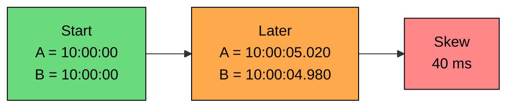
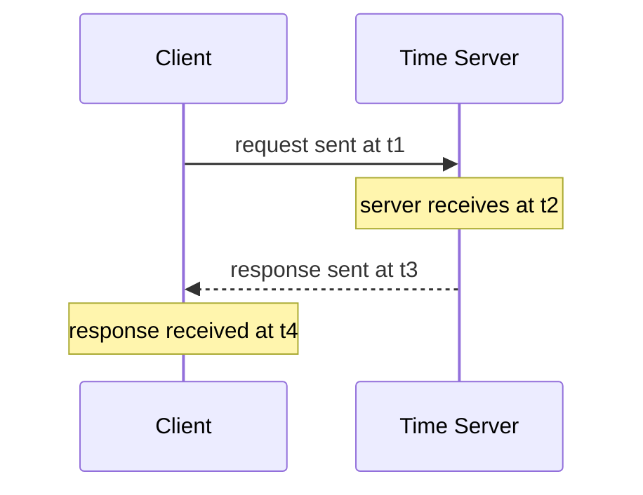

Time feels absolute on one machine. In a distributed system, it is not. Every machine has its own clock, those clocks drift apart, and synchronizing them happens over a network with variable delay.

That uncertainty matters because timestamps end up driving correctness decisions: which write happened last, whether a lock has expired, whether a token is still valid, what order to replay events in. Wall-clock time is still useful, but it is the wrong tool when correctness depends on exact ordering across machines.

This chapter covers clock drift, wall vs monotonic clocks, NTP and PTP, where skew causes bugs, and when physical time is the right tool.

---

# Why Clocks Disagree

> [!PAYWALL] This content is for premium members only.

Computer clocks are physical devices. Most servers track time using an oscillator, and no oscillator runs at exactly the ideal rate forever.

### Drift and Skew

Two terms matter. **Clock drift** is when a clock runs slightly fast or slow over time. **Clock skew** is the difference between two clocks at the same real moment. Drift creates skew. If Server A gains time and Server B loses time, their clocks move apart until synchronization corrects them.

Common causes:

- Hardware oscillator differences
- Temperature changes
- Aging hardware
- Power and virtualization effects
- Missed or delayed synchronization
- Manual clock changes

The exact amount varies by hardware, operating environment, and synchronization setup. The important point is simpler: clocks are close, not identical.

---

# Wall Clocks vs. Monotonic Clocks

Distributed systems use two different kinds of local time.

| Clock Type | What It Measures | Can Jump Backward" | Good For |
|------------|------------------|--------------------|----------|
| **Wall clock** | Calendar time, such as UTC | Yes | Logs, timestamps, expiry dates, human-facing time |
| **Monotonic clock** | Elapsed time since an arbitrary start | No, within one process/machine | Measuring durations, timeouts, latency |

This distinction is practical.

Use a wall clock when you need a timestamp a human understands:

Use a monotonic clock when measuring elapsed time:

Do not measure request duration using wall-clock time. NTP or an operator can adjust the wall clock while your request is running, producing negative or incorrect durations.

---

# The Problem With Clock Corrections

Clock synchronization software tries to keep wall clocks close to real time. Sometimes it slowly slews the clock. Sometimes it steps the clock forward or backward.

That can surprise code that assumes timestamps always increase.

Problems caused by wall-clock jumps:

- Logs appear out of order.
- Time-based IDs may collide or stop being monotonic.
- Cache entries may seem newer or older than they are.
- Lease or lock expiration logic may become unsafe.
- Metrics based on wall-clock duration become wrong.

The fix is not "never use time." The fix is to use the right kind of time for the job.

---

# How NTP Works

Network Time Protocol (NTP) is the standard way most machines synchronize wall-clock time.

At a high level, a client asks a time server what time it is. The client estimates how much network delay occurred and adjusts its local clock.

NTP uses four timestamps: `t1` when the client sends the request, `t2` when the server receives it, `t3` when the server sends the response, and `t4` when the client receives it. The client uses these values to estimate round-trip delay and clock offset:

The estimate depends on an assumption: network delay is roughly symmetric.

If the request path takes 5 ms and the response path takes 45 ms, the client sees a 50 ms round trip but cannot know the split. It has to estimate. That estimate can be wrong.

---

# What NTP Can and Cannot Do

NTP keeps clocks close enough for the things most systems need: log timestamps, certificate and token validity, coarse expiry windows, analytics, and other operational tasks where small skew is tolerable.

It does not make distributed timestamps perfectly reliable. NTP cannot guarantee exact global ordering of events, zero clock skew, monotonic wall-clock timestamps, correct conflict resolution for close writes, or safe distributed locks on its own.

Accuracy depends on:

- Network delay and asymmetry
- Quality and distance of time sources
- Local clock stability
- Host load
- Virtualization
- NTP configuration
- Whether the machine can reach its time sources

The practical rule: use NTP everywhere, monitor clock offset, but do not build correctness on the assumption that clocks are identical.

---

# Precision Time Protocol

Precision Time Protocol (PTP) is used when systems need much tighter clock synchronization than ordinary NTP can provide.

PTP can use hardware timestamping in network cards and PTP-aware switches to reduce software and network jitter.

| Aspect | NTP | PTP |
|--------|-----|-----|
| Typical use | General servers and cloud systems | Finance, telecom, industrial control, specialized networks |
| Hardware needs | Usually none | Often PTP-capable NICs and switches |
| Network path | Works across ordinary IP networks | Best on controlled local networks |
| Operational cost | Low | Higher |
| Main benefit | Good general time sync | Much tighter synchronization |

PTP is powerful, but it is not a default answer for distributed application design. It works best in environments where the network path and hardware are controlled.

Most web-scale application systems should first ask: do we need tighter physical time, or do we need a different ordering mechanism"

---

# Where Clock Skew Causes Bugs

### Last-Write-Wins Conflict Resolution

Suppose two replicas accept writes to the same record. A user first sets their name to `Asha` on Server A, which stamps the write `10:00:00.120`. Moments later, the same user sets the name to `Ash` on Server B, which stamps it `10:00:00.090` because B's clock is running behind A's.

If the system uses "largest timestamp wins," it keeps `Asha`, even though `Ash` was the later real update.

Last-write-wins is simple, but it silently turns clock skew into data loss.

### Distributed Locks and Leases

Time-based leases are useful, but they are dangerous if participants disagree about time.

If a lock holder's clock is slow, it may believe the lease is still valid after the rest of the system considers it expired. Another node may acquire the lock, and now two nodes act as owners.

Safer designs use:

- Conservative lease durations
- Monotonic clocks for local elapsed time
- Quorum-based lease services
- Fencing tokens enforced by the resource being protected

### Cache Expiration

Cache TTLs are usually fine because they tolerate approximate time. Cache invalidation based on comparing timestamps across machines is riskier.

If Server A writes data and Server B invalidates cache using its own clock, skew can make stale data appear valid.

### Logs and Incident Debugging

Clock skew does not usually break logs, but it can confuse humans.

A request might appear to leave Service A before it entered Service B. During an incident, that can send debugging in the wrong direction.

Distributed tracing systems reduce this pain by tracking request relationships, spans, and durations rather than relying only on wall-clock timestamps.

---

# When Physical Time Is Fine

Physical time is the right tool when approximate real-world time is enough. Good fits include human-readable logs, audit timestamps that must show calendar time, token expiration (with skew tolerance), cache TTLs that are inherently approximate, analytics windows where the exact ordering of close events does not matter, and user-facing timestamps where people expect real time rather than causal order.

Even here, use safety margins. Token validation often allows small clock skew. Cache expiry should tolerate early or late expiration. Log analysis should account for skew between hosts.

---

# When Physical Time Is Not Enough

Physical timestamps are the wrong foundation when correctness depends on knowing exact order across machines.

| Use Case | Better Tool |
|----------|-------------|
| Ordering writes to one shard | Single leader or replicated log |
| Leader election | Consensus terms, epochs, quorum |
| Distributed locks | Lease service plus fencing tokens |
| Conflict detection | Vector clocks or version vectors |
| Causal ordering | Lamport timestamps or vector clocks |
| Timestamp-like ordering with causality | Hybrid logical clocks |

The key distinction:

- **Physical time** tells you roughly when something happened.
- **Logical time** tells you what could have caused what.
- **Consensus** establishes one agreed order for critical operations.

If your design says "we will just compare timestamps," pause and ask what happens when clocks disagree.

---

# Practical Guidelines

A few rules go a long way:

- Run time synchronization on every host. Many systems assume clocks are at least close.
- Monitor clock offset and sync health. Bad time sync silently breaks assumptions.
- Use monotonic clocks for durations, since wall clocks can jump forward or backward.
- Avoid client-supplied timestamps for correctness. Client clocks are less controlled than server clocks.
- Add skew tolerance for expiry checks on tokens, leases, and certificates.
- Do not use wall time as the only conflict resolver. Clock skew can lose valid updates.
- Use sequence numbers or replicated logs when you need strict order.
- Use logical clocks when causality matters, since they do not depend on synchronized clocks.

Clock synchronization is still worth doing. The mistake is expecting it to solve problems it cannot solve.

---

# Summary

Clock synchronization is hard because every machine has its own imperfect clock, and synchronization itself happens over an uncertain network.

Key ideas:

- **Clock drift** means clocks move at slightly different rates.
- **Clock skew** means two clocks disagree at the same moment.
- **Wall clocks** are useful for real-world timestamps but can jump forward or backward.
- **Monotonic clocks** are the right tool for measuring elapsed time on one machine.
- **NTP** keeps clocks close enough for many operational needs, but it cannot provide perfect global ordering.
- **PTP** can provide tighter synchronization in specialized environments with controlled hardware and networks.
- **Physical timestamps are unsafe for exact distributed ordering.**

Use physical time for human-facing and approximate time. Use logical clocks, sequence numbers, replicated logs, fencing tokens, or consensus when correctness depends on order.

The next chapter explains logical clocks: a way to reason about ordering without pretending every machine shares the same perfect clock.

---

# Quiz
