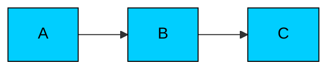
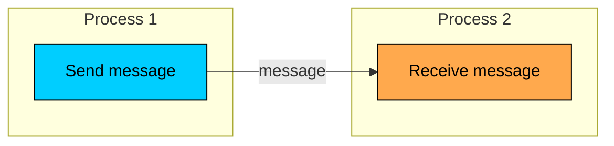
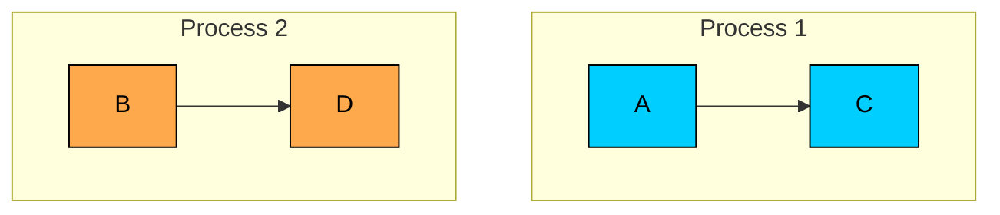
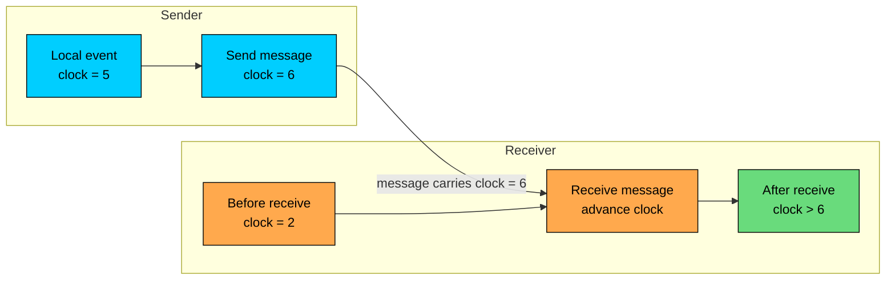

Physical clocks answer "what time did this happen"" Logical clocks answer a different question: "what could have caused this event""

That distinction is the reason logical clocks exist. Many correctness problems in distributed systems do not require calendar time. They require causal order: knowing which events could have influenced which others, even when the participants disagree about the current time.

This chapter covers happens-before, causal vs total order, concurrent events, what logical clocks guarantee, and a short tour of Lamport timestamps, vector clocks, and hybrid logical clocks.

---

# The Core Idea

> [!PAYWALL] This content is for premium members only.

Distributed systems often need to know whether one event could have influenced another.

Examples:

- Did this read happen after the write it should observe"
- Did this update know about the previous update"
- Are two writes conflicting, or did one supersede the other"
- Is this message stale compared with what the receiver already knows"

Logical clocks attach metadata to events so the system can reason about this kind of order.

They do not tell you the wall-clock time. A logical timestamp of `42` does not mean 42 seconds, 42 milliseconds, or 42 anything physical. It means "this event is at position 42 in some logical ordering scheme."

---

# Happens-Before

Leslie Lamport introduced the **happens-before** relation to formalize causality in distributed systems.

It is usually written as:

Read it as: **A happened before B**, meaning A could have influenced B.

There are three rules.

### Rule 1: Local Order

If two events happen in the same process, the earlier event happens-before the later event.

In this process:

### Rule 2: Message Order

If one process sends a message and another process receives it, the send happens-before the receive.

The receiver cannot be influenced by the message before the sender sends it.

### Rule 3: Transitivity

If A happens-before B, and B happens-before C, then A happens-before C.

This lets causal information flow through a chain of local events and messages.

---

# Concurrent Events

Not every pair of events has an order.

Two events are **concurrent** if neither event could have influenced the other.

Read it as: **A and B are concurrent**.

If the two processes never communicate, event A and event B are concurrent. Saying "A happened first" may be possible with wall-clock timestamps, but it has no causal meaning.

This is important. Logical clocks do not try to invent causality where none exists. They help separate:

- Events that are causally ordered
- Events that are independent and concurrent
- Events that require an arbitrary ordering for implementation reasons

---

# Partial Order vs. Total Order

The happens-before relation creates a **partial order**. Some events can be compared (`A -> B` or `B -> A`), and others cannot (`A || B`, concurrent).

Some systems need a **total order**, where every event is placed in one deterministic sequence.

Examples:

- A replicated log
- A distributed lock queue
- A single ordered stream partition
- A consensus decision history

A total order can be useful even when some events are concurrent. But if two events are concurrent, their order is arbitrary unless the system adds a tie-breaker or coordinates through a leader/consensus protocol.

That distinction matters:

- **Causal order** tells you what depended on what.
- **Total order** gives every event a single position.
- A total order may include arbitrary ordering between concurrent events.

---

# Physical Time vs. Logical Time

Physical and logical clocks solve different problems.

| Question | Better Tool |
|----------|-------------|
| What time did this happen for a user or audit log" | Physical clock |
| How long did this request take" | Monotonic clock |
| Did this event causally depend on another event" | Logical clock |
| Are two updates concurrent conflicts" | Vector clock or version vector |
| What is the agreed order of committed writes" | Replicated log or consensus |

Physical clocks are still useful. Logical clocks are not a replacement for timestamps in logs, dashboards, or user-visible time.

Logical clocks are for ordering relationships.

---

# The Clock Condition

A logical clock should preserve causality.

The basic rule is:

This is called the **clock condition**.

The tricky part is the reverse:

Whether the reverse is true depends on the logical clock implementation.

| Clock Type | If A -> B, timestamp(A) < timestamp(B)" | Can It Detect Concurrency" |
|------------|------------------------------------------|----------------------------|
| Lamport timestamp | Yes | No |
| Vector clock | Yes | Yes |
| Hybrid logical clock | Yes | No, not by itself |

This is the main reason different logical clock designs exist.

---

# How Logical Clocks Propagate Information

Logical clocks work because messages carry causal metadata.

When a process sends a message, it includes its current logical time. When another process receives the message, it updates its own logical time so the receive event is after the send event.

The exact update rule depends on the implementation:

- Lamport clocks keep one counter.
- Vector clocks keep one counter per participant.
- Hybrid logical clocks combine physical time with a logical counter.

But the shared idea is the same: causal information moves with messages.

---

# The Main Implementations

Logical clocks are a family of techniques, not one algorithm.

### Lamport Timestamps

Lamport timestamps use a single counter per process.

They are compact and easy to maintain:

- Increment the counter on local events.
- Attach the counter to messages.
- On receive, set local counter to `max(local, received) + 1`.

They guarantee:

They do not guarantee:

Use Lamport timestamps when you need a simple causal-safe ordering signal or a deterministic total order with a tie-breaker, but do not need to detect concurrency.

### Vector Clocks

Vector clocks keep a vector of counters, one per participant.

They can tell the difference between:

- A happened-before B
- B happened-before A
- A and B are concurrent

That makes them useful for conflict detection in replicated data systems.

The cost is size. A vector clock grows with the number of participants, so it works best when the set of participants is bounded or can be compacted.

### Hybrid Logical Clocks

Hybrid logical clocks combine a wall-clock reading with a logical counter into a single timestamp. The timestamp stays close to physical time but never moves backward, even when the underlying wall clock is corrected.

They preserve causal ordering and produce compact, sortable timestamps, which is why several distributed databases use them. They do not detect concurrency the way vector clocks do.

This section does not cover hybrid logical clocks in depth. The next two chapters focus on Lamport timestamps and vector clocks, which together cover the foundations needed to reason about causal order in distributed systems.

---

# Where Logical Clocks Help

Logical clocks are useful when event order matters but physical time is unreliable.

Replicated data systems use them to order or detect versions without trusting wall-clock timestamps. Event processing pipelines use them to preserve causal relationships between events. Distributed debuggers use them to reconstruct request causality across services. Consensus protocols use related ideas (terms, epochs, ballots) to reject stale messages. Multi-writer systems use them to identify concurrent writes that need merge logic, and causal consistency models use them to ensure reads observe causally prior writes.

Logical clocks do not solve every ordering problem by themselves. If the system needs all nodes to agree on one committed order, it usually needs a log, a leader, or consensus.

---

# Common Misunderstandings

| Misunderstanding | Correction |
|------------------|------------|
| Logical clocks tell real time | They track causal order, not wall-clock time |
| Lower timestamp always means happened-before | True for vector clocks when comparable; not true for Lamport timestamps |
| Concurrent means simultaneous | Concurrent means no causal relationship is known |
| Total order means causal order | A total order may arbitrarily order concurrent events |
| Logical clocks replace consensus | They help reason about order; they do not make nodes agree by themselves |
| Vector clocks scale to any number of clients | Metadata grows with participants unless compacted |

---

# Summary

Logical clocks let distributed systems reason about causality without relying on perfectly synchronized physical clocks.

Key ideas:

- **Happens-before** captures causal order.
- **Concurrent events** have no known causal relationship.
- **Causal order is a partial order**, not a total order.
- **Logical clocks preserve causality** by carrying metadata through messages.
- **Lamport timestamps** are simple and compact but cannot detect concurrency.
- **Vector clocks** detect concurrency but carry more metadata.
- **Hybrid logical clocks** combine logical ordering with timestamps close to physical time.
- **Consensus is still needed** when nodes must agree on one committed order.

The next chapter goes deeper into the simplest implementation: Lamport timestamps.

---

# Quiz
