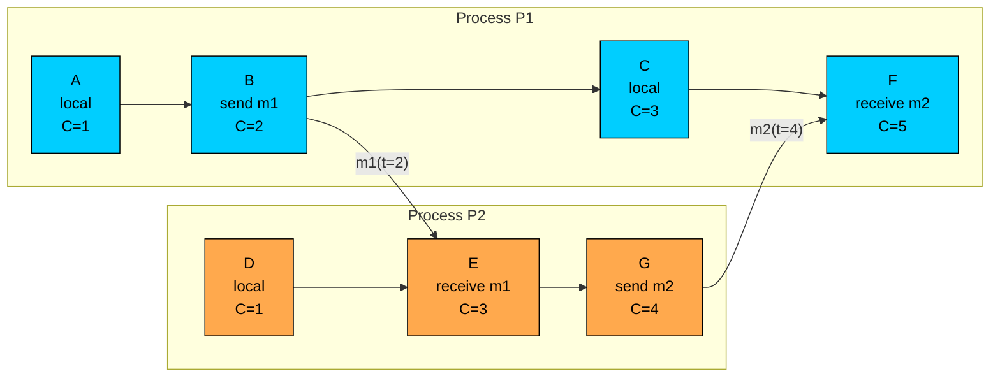
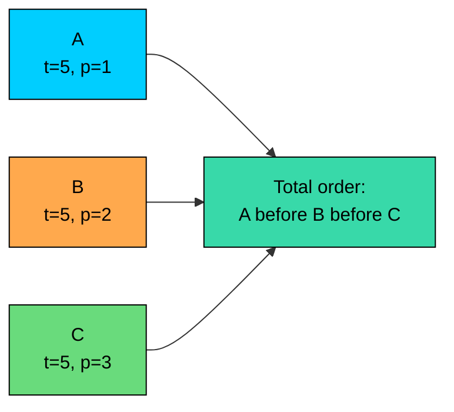

Lamport timestamps are the simplest useful logical clock. Each process keeps one integer counter, and that counter moves forward on local events, sends, and receives.

The guarantee is narrow but important: if event A could have caused event B, then `L(A) < L(B)`. That one-way property is enough for many ordering problems, but the reverse does not hold. A smaller Lamport timestamp does not prove A caused B.

This chapter covers the Lamport algorithm, the clock condition, total ordering with a tie-breaker, and where Lamport timestamps help and fall short.

---

# The Algorithm

> [!PAYWALL] This content is for premium members only.

Each process stores a local counter, usually initialized to `0`.

There are three rules.

### Rule 1: Local Event

Before a process records a local event, it increments its counter.

A local event can be a state update, a request entering a queue, a log record, or any other event the protocol cares about.

### Rule 2: Send Event

Before sending a message, the sender increments its counter and attaches the new counter value to the message.

The message carries the sender's current view of logical time.

### Rule 3: Receive Event

When a process receives a message with timestamp `t`, it moves its counter past both values: its local counter and the timestamp in the message.

The `+ 1` matters. It makes the receive event strictly later than the send event.

### Minimal Implementation

Real implementations also need locking or atomic operations if multiple threads can update the same clock.

---

# Worked Example

Consider two processes, `P1` and `P2`. Both start with counter `0`.

`P1` performs a local event, sends a message to `P2`, performs another local event, and later receives a reply. `P2` performs a local event, receives the message, and sends the reply.

The timestamps come directly from the rules.

| Event | Process | What Happens | Calculation | Timestamp |
|-------|---------|--------------|-------------|-----------|
| A | P1 | Local event | `0 + 1` | `1` |
| D | P2 | Local event | `0 + 1` | `1` |
| B | P1 | Send `m1` | `1 + 1` | `2` |
| E | P2 | Receive `m1(t=2)` | `max(1, 2) + 1` | `3` |
| G | P2 | Send `m2` | `3 + 1` | `4` |
| C | P1 | Local event | `2 + 1` | `3` |
| F | P1 | Receive `m2(t=4)` | `max(3, 4) + 1` | `5` |

Two details are worth noticing.

First, both `C` and `E` have timestamp `3`. That is allowed. Lamport timestamps are local counters, not globally unique IDs.

Second, `P1` jumps from `3` to `5` when it receives `m2`. The jump comes from the receive rule: the counter must move past the incoming message's timestamp of `4`, so it becomes `max(3, 4) + 1 = 5`.

---

# The Clock Condition

Lamport timestamps satisfy the clock condition:

`A -> B` means event `A` happens-before event `B`. `L(A)` means the Lamport timestamp assigned to `A`.

There are three cases.

### Same Process

If `A` occurs before `B` in the same process, the process increments its counter between those events.

### Message Send and Receive

If `A` is a send event and `B` is the matching receive event, the receive rule forces `B` to have a larger timestamp.

### Transitive Causality

If `A -> B` and `B -> C`, then `A -> C`. Since each step increases the Lamport timestamp, the full chain preserves the ordering.

This is the main promise of Lamport timestamps. Causal order is never inverted.

---

# The Converse Is False

The clock condition only works in one direction.

In the worked example:

- `D` has timestamp `1`.
- `C` has timestamp `3`.
- `D` and `C` are concurrent. Neither event could have caused the other.

Even though:

that does not mean:

This limitation matters when two replicas update the same record. A Lamport timestamp can give you an order, but it cannot tell you whether one write observed the other or whether the writes were concurrent conflicts.

---

# Total Ordering

The happens-before relation is a partial order. Some events are causally related. Other events are concurrent and have no natural order.

Some protocols still need every event to be comparable. Lamport timestamps can provide a deterministic total order by adding a tie-breaker.

The process ID can be any stable unique identifier: a numeric node ID, replica ID, or member ID.

This order is consistent, not causal. If two events are concurrent, the tie-breaker chooses an order so every process can make the same decision.

That distinction is important:

- A total order can make replicas apply operations in the same sequence.
- A total order does not prove that the earlier operation caused the later operation.
- A total order may choose an arbitrary winner for concurrent writes.

---

# Where Lamport Timestamps Help

Lamport timestamps are useful when a system needs small metadata and a deterministic notion of order.

### Distributed Mutual Exclusion

Lamport's mutual exclusion algorithm orders lock requests by `(timestamp, process_id)`. Every process keeps its own local queue of pending requests, sorted by that key.

The protocol has four parts: requesting the lock, handling an incoming request, entering the critical section, and releasing the lock.

The timestamp alone does not grant the lock. Two safety conditions matter together.

The queue-head condition guarantees that no earlier known request is still waiting. The higher-timestamp condition guarantees that no earlier request is still in flight on the network. Without the second condition, a process could enter the critical section while another process's older REQUEST has not yet arrived.

Channels are assumed to deliver messages in FIFO order between any two processes. With that assumption, hearing a higher-timestamped message from `Pj` proves every earlier message from `Pj` has already been processed.

### Deterministic Ordering

Replicas sometimes need to make the same choice when multiple valid choices exist.

For example, a scheduler might receive concurrent requests and choose the lowest `(timestamp, process_id)` first. That order is not morally "correct"; it is just deterministic.

Determinism is valuable when the operation is safe to order arbitrarily or when the application has already defined how conflicts are resolved.

### Protocol Epochs and Ballots

Many distributed protocols use monotonically increasing numbers such as epochs, terms, generations, or ballots. These are not always Lamport clocks, but they use the same basic idea: later protocol actions must carry a number that supersedes earlier actions.

Examples include:

- Rejecting messages from an old leader term
- Comparing lease or ownership generations
- Preventing stale coordinators from overwriting newer state

Lamport timestamps are one way to build this kind of logical ordering, but the protocol still has to define what the number means and who is allowed to advance it.

### Debugging Causal Flow

Lamport timestamps can make distributed traces easier to reason about. If a request crosses several services, carrying a logical timestamp can show how far causal knowledge has propagated.

They do not replace wall-clock timestamps in logs. Operators still need real time for incident timelines, latency, retention, and auditing.

---

# Where They Fall Short

Lamport timestamps are intentionally small. That smallness comes with tradeoffs.

### They Cannot Detect Concurrency

Given two timestamps:

both of these histories are possible:

The timestamps alone cannot tell the difference.

If your system must detect concurrent writes, use vector clocks, version vectors, dotted version vectors, or an application-specific conflict strategy.

### They Are Not Wall Clocks

A Lamport timestamp of `1000` does not mean one second, one millisecond, or any real-world time. It only means the process has advanced its logical counter to `1000`.

Use physical timestamps for human-facing timelines. Use Lamport timestamps for causal ordering.

### They Do Not Deliver Messages

Lamport timestamps describe order. They do not make the network reliable, FIFO, or exactly-once.

For example, a process can send two messages:

The network can still deliver `M2` before `M1`. If the protocol needs ordered delivery, it must buffer, retry, deduplicate, or use a transport/protocol that provides the required guarantees.

### They Are Not Consensus

A total order rule does not make distributed agreement happen.

Consensus protocols must handle failures, leader changes, quorums, log commitment, and recovery. Lamport-style ordering numbers often appear inside those protocols, but the timestamp alone is not the protocol.

---

# Implementation Notes

### Thread Safety

If a process handles events concurrently, updates to the Lamport counter must be serialized or atomic.

Without this, two local threads can assign the same timestamp when the process expected a single local sequence.

### Stable Process IDs

If you use `(timestamp, process_id)` for total ordering, process IDs must be unique and stable for the lifetime of the events being compared.

Reusing a process ID after a crash can be dangerous if old messages are still in flight. Many systems pair the process ID with an incarnation number, epoch, or membership version.

### Counter Persistence

If old messages can survive a process restart, think carefully before resetting the counter to `0`.

Some systems persist the counter. Others include a restart epoch or membership incarnation in the timestamp tuple.

The right choice depends on how the system handles membership, crashes, and delayed messages.

### Counter Size

A 64-bit unsigned counter is enough for most production systems. At one million events per second, it would take hundreds of thousands of years to wrap.

Overflow is still a correctness issue in formal protocol design. Production code should choose a counter size and overflow policy deliberately instead of relying on undefined behavior.

---

# Lamport Timestamps vs Vector Clocks

Lamport timestamps and vector clocks both track causal information, but they answer different questions.

| Question | Lamport Timestamp | Vector Clock |
|----------|-------------------|--------------|
| If `A -> B`, will the metadata show `A` before `B`" | Yes | Yes |
| Does `A < B` prove `A -> B`" | No | Yes, when using vector-clock comparison |
| Can it detect concurrent events" | No | Yes |
| Metadata per event | One counter | One counter per participant |
| Best fit | Small, deterministic ordering metadata | Conflict detection and causal comparison |

Use Lamport timestamps when you need compact ordering metadata. Use vector clocks when the system must distinguish "happened before" from "concurrent."

---

# Common Mistakes

### Treating Smaller as Causal

This is the most common mistake:

Only the reverse implication is guaranteed:

### Forgetting the Receive Rule

On receive, do not set the local counter to the message timestamp. Move past it.

The receive event must be later than the send event.

### Using Them as Conflict Detection

If two replicas write the same key, Lamport timestamps plus a tie-breaker can choose a winner. They cannot tell whether the writes are concurrent.

That may be acceptable for last-writer-wins style semantics, but it is not conflict detection. If losing writes matter, the application needs a merge rule or richer causal metadata.

---

# Summary

Lamport timestamps are a compact way to preserve causal order in a distributed system.

The algorithm has three rules:

- Increment before a local event.
- Increment and attach the timestamp before sending a message.
- On receive, set the counter to `max(local_counter, message_timestamp) + 1`.

They guarantee:

They do not guarantee the converse. `L(A) < L(B)` does not prove that `A` caused `B`.

With a stable process ID as a tie-breaker, Lamport timestamps can create a deterministic total order. That is useful for queues, request ordering, and protocols that need all participants to make the same comparison.

When you need to detect concurrent events, Lamport timestamps are not enough. That is where vector clocks come in.

---

# Quiz
