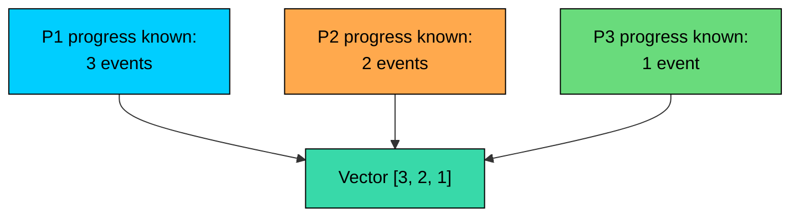
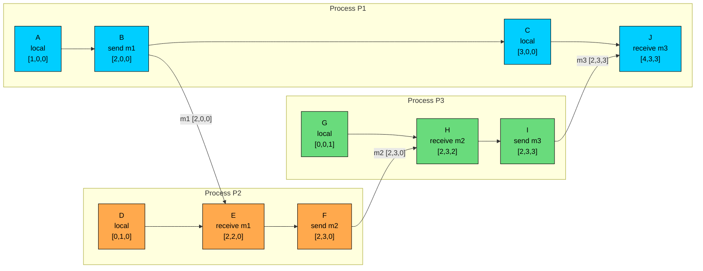

Lamport timestamps preserve causal order in one direction: if `A -> B`, then `L(A) < L(B)`. The reverse does not hold. A smaller Lamport timestamp could mean A caused B, or it could mean A and B were concurrent. Vector clocks add enough information to tell those cases apart.

Instead of one counter per process, a vector clock keeps one counter per participant. That extra metadata lets the system compare causal histories directly and decide whether one event happened before the other, or whether the two events were concurrent.

This chapter covers the update rules, vector comparison for concurrency detection, version vectors, and practical limits around size, membership, and conflicts.

---

# The Core Idea

> [!PAYWALL] This content is for premium members only.

In a system with three processes, a vector clock has three counters:

Each entry records how much progress the current process knows about from that participant.

For example:

means:

- This event knows about 3 events from `P1`.
- It knows about 2 events from `P2`.
- It knows about 1 event from `P3`.

The vector is not wall-clock time. It is a compact summary of causal knowledge.

If another event has vector `[3, 2, 2]`, it includes everything in `[3, 2, 1]` plus one more event from `P3`. That lets us say the first event happened before the second.

If another event has vector `[4, 1, 1]`, neither vector contains the other. One has more `P1` knowledge; the other has more `P2` knowledge. Those events are concurrent.

---

# The Algorithm

Each process keeps a vector with one entry per participant.

For process `Pi`, the local vector is `Vi`, and its own component is `Vi[i]`.

All counters start at `0`.

### Rule 1: Local Event

Before recording a local event, increment your own component.

### Rule 2: Send Event

Before sending a message, increment your own component and attach the full vector.

The full vector is sent because the receiver needs the sender's causal history, not only the sender's own counter.

### Rule 3: Receive Event

When `Pi` receives a message with vector `Vm`, it merges the sender's knowledge into its own vector, then increments its own component for the receive event.

The component-wise maximum keeps the most advanced knowledge from either side. The final increment records the receive event itself.

### Minimal Implementation

Sparse maps are common in real systems because many entries are `0` or irrelevant to a particular object.

---

# Worked Example

Consider three processes: `P1`, `P2`, and `P3`.

Each starts with:

The vector order is:

Now trace this execution.

The calculations are mechanical.

| Event | Process | What Happens | Calculation | Vector |
|-------|---------|--------------|-------------|--------|
| A | P1 | Local event | Increment P1 | `[1,0,0]` |
| D | P2 | Local event | Increment P2 | `[0,1,0]` |
| G | P3 | Local event | Increment P3 | `[0,0,1]` |
| B | P1 | Send `m1` | Increment P1 | `[2,0,0]` |
| E | P2 | Receive `m1` | `max([0,1,0], [2,0,0])`, then increment P2 | `[2,2,0]` |
| F | P2 | Send `m2` | Increment P2 | `[2,3,0]` |
| H | P3 | Receive `m2` | `max([0,0,1], [2,3,0])`, then increment P3 | `[2,3,2]` |
| I | P3 | Send `m3` | Increment P3 | `[2,3,3]` |
| C | P1 | Local event | Increment P1 | `[3,0,0]` |
| J | P1 | Receive `m3` | `max([3,0,0], [2,3,3])`, then increment P1 | `[4,3,3]` |

At `J`, `P1` learns about the chain of events that flowed through `P2` and `P3`. Its vector jumps from `[3,0,0]` to `[4,3,3]`.

---

# Comparing Vectors

Vector clocks are useful because comparison tells us the causal relationship.

For two event vectors `VA` and `VB`:

means every component in `VA` is less than or equal to the matching component in `VB`.

means `VA <= VB` and at least one component is strictly smaller.

The rules are direct. If `VA < VB`, then A happened before B. If `VB < VA`, then B happened before A. If `VA == VB`, both events share the same causal context. If neither vector is less than the other, A and B are concurrent.

### Causally Related Events

Compare `B` and `E` from the example:

That matches the execution: `B` is the send of `m1`, and `E` is the receive.

### Concurrent Events

Now compare `C` and `F`:

`C` has more knowledge about `P1`, while `F` has more knowledge about `P2`. Neither vector contains the other.

So:

`C` and `F` are concurrent.

This is the capability Lamport timestamps do not have.

---

# Why Comparison Works

A vector clock summarizes causal history.

If an event has vector `[4,3,3]`, then in this simplified model its causal past includes:

- The first 4 events from `P1`
- The first 3 events from `P2`
- The first 3 events from `P3`

Another event with `[2,3,0]` is inside that history because each component is less than or equal:

But `[3,0,0]` and `[2,3,0]` do not contain each other:

That is what concurrency means: each side has seen something the other side has not.

---

# Version Vectors

Most production systems do not attach vector clocks to every internal event. They usually care about versions of data.

A version vector applies the same comparison rules to one object, key, file, or record.

### Event Clock vs Version Vector

A vector clock tracks events in a distributed execution and is used for reasoning about causal order. A version vector tracks versions of a specific data item and is used for detecting conflicting writes. With version vectors, the vector travels with the data item.

Example: key `user:123` starts with no version.

Now compare that with a concurrent write.

At that point, the database must choose a conflict policy.

### Conflict Handling

When a new version arrives, a replica compares it with the stored versions. If the incoming version is newer, it replaces the older one. If the stored version is newer, the incoming write is stale and ignored. If the two versions are concurrent, the replica must either keep both, merge them, or reject one.

Systems inspired by Dynamo and Riak used version vectors to detect concurrent writes and expose siblings when the application needed to merge them.

The vector detects the conflict. It does not resolve the conflict. The application still needs semantics: choose a winner, merge shopping carts, union sets, reject the write, or ask a user.

---

# Dotted Version Vectors

Plain version vectors can be ambiguous when several concurrent writes share the same causal context.

A dotted version vector separates:

- The context a write has seen
- The single event that created the new version

The context says what the write had already seen. The dot identifies the write itself.

This helps systems distinguish individual concurrent versions without keeping an unbounded list of full histories.

---

# Practical Limits

Vector clocks are precise, but the precision has costs.

### Metadata Size

A full vector has one counter per participant.

| Participants | 64-bit Counter Storage |
|--------------|------------------------|
| 10 | 80 bytes |
| 100 | 800 bytes |
| 1,000 | 8 KB |
| 10,000 | 80 KB |

That is only the raw counter storage. Real encodings also carry IDs, lengths, and protocol overhead.

This is why vector clocks fit small replica sets better than huge fleets of short-lived clients.

### Participant Identity

The vector index must mean something stable.

If a participant leaves, crashes, rejoins, or gets replaced, the system needs a clear identity model. Reusing an ID while old messages still exist can corrupt comparisons.

Common approaches include:

- Use replica IDs instead of client IDs.
- Include an incarnation or epoch with the participant ID.
- Use sparse vectors so missing entries are treated as `0`.
- Garbage-collect entries only when it is safe.

### Truncation Loses Precision

Some systems cap vector size by dropping old entries or keeping only recent writers.

That can be a practical choice, but it changes the guarantee. Once you truncate causal metadata, the system may fail to detect some concurrency or may report conflicts conservatively.

Bounded metadata is often worth it. It should be an explicit design tradeoff, not an accidental cleanup.

### Safe Garbage Collection

Old entries can be removed only after the system knows they are no longer needed for comparison.

One common idea is a stable lower bound: if all replicas have seen progress up to a certain vector, history before that point can often be compacted.

The minimum is a conservative point that every listed replica has reached. Whether it is safe to prune depends on the replication protocol and what old versions may still be compared against.

---

# What Vector Clocks Are Not

### Not a Total Order

Vector clocks produce a partial order. Concurrent events remain unordered.

If a system needs one deterministic winner, it must add a policy:

- Compare vector clocks first.
- If versions are concurrent, apply a tie-breaker, merge rule, or application decision.

Using a tie-breaker is sometimes fine. It is not the same as detecting causality.

### Not Wall-Clock Time

Vector clocks do not answer when something happened.

They answer what causal history the event had seen.

Logs, audits, retention policies, and user-facing timelines still need physical timestamps.

### Not a Merge Function

A vector clock can say:

It cannot say:

That part belongs to the application or data type.

---

# When to Use Vector Clocks

Use vector clocks or version vectors when exact concurrency detection is worth the metadata.

Good fits:

| Scenario | Why It Fits |
|----------|-------------|
| Multi-replica writes to the same key | Detects concurrent updates |
| Offline clients that later sync | Separates superseded versions from conflicts |
| Collaborative systems | Tracks what each edit had seen |
| Small replica sets | Metadata stays manageable |
| Conflict-aware storage | Can expose siblings or trigger merge logic |

Poor fits have better alternatives. If you only need a deterministic order, Lamport timestamps with a tie-breaker are simpler. For human-readable time, use a physical clock timestamp. For external consistency, use a protocol with clock bounds and commit rules. For very large participant sets, prefer server-side versions, dotted version vectors, or bounded metadata. And if the application has no conflict semantics yet, decide the merge behavior first before adding causal metadata.

Vector clocks are not automatically better than Lamport timestamps. They answer a richer question, and they charge for it in metadata, membership complexity, and operational cleanup.

---

# Common Mistakes

### Comparing Sums

Do not add the vector components and compare totals.

Equal sums do not mean equal causal history. These events are concurrent.

### Treating Concurrent as Error

Concurrency is not always a bug. In distributed systems, it is often normal.

The question is whether the application has a safe policy for concurrent updates.

### Forgetting the Client's Context

For data versions, a write should carry the version the client read.

If the system writes without the client's causal context, it may turn a normal successor write into an artificial conflict.

### Letting Vectors Grow Forever

Vectors need lifecycle management: sparse representation, membership epochs, compaction rules, or bounded variants.

Ignoring this is how a clean academic model becomes painful production metadata.

---

# Summary

Vector clocks extend logical clocks by keeping one counter per participant.

The update rules are:

- Increment your own component for a local event.
- Increment your own component and attach the full vector when sending a message.
- On receive, take the component-wise maximum, then increment your own component.

The comparison rules are the core:

That makes vector clocks useful for conflict detection, especially in multi-replica storage systems.

The tradeoff is metadata. A vector carries one counter per participant, and real systems must handle membership, sparse encoding, truncation, and garbage collection.

Use vector clocks when you need to distinguish "this write superseded that write" from "these writes were concurrent." Use simpler clocks when all you need is ordering.

---

# Quiz
