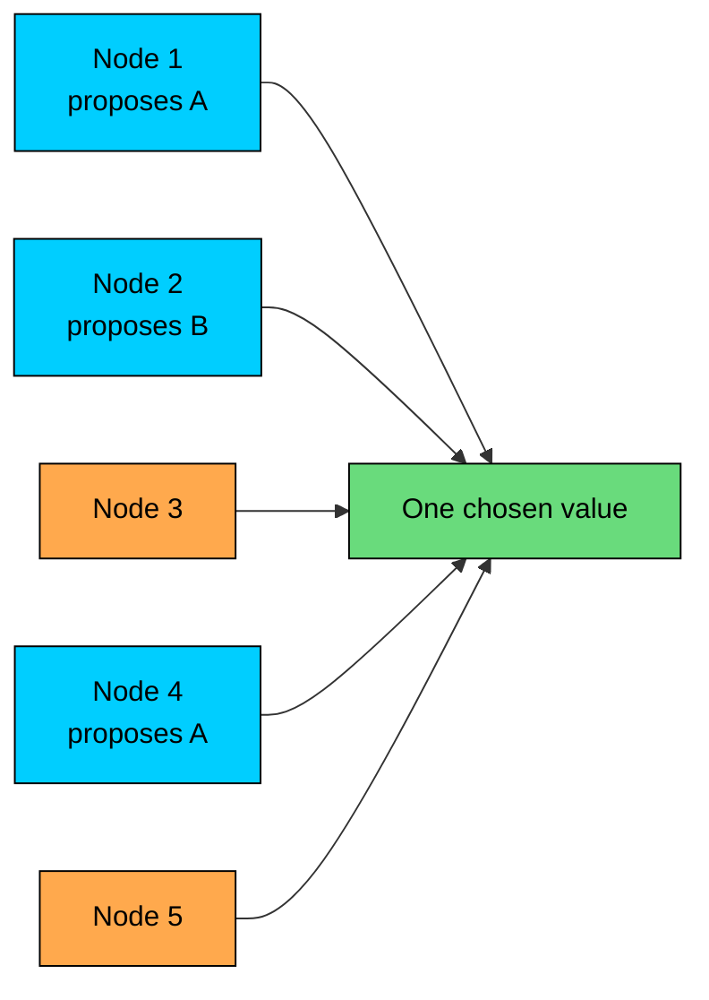
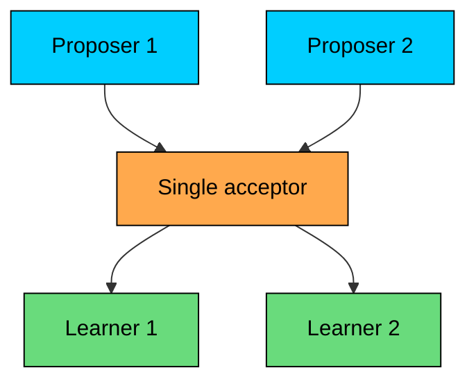
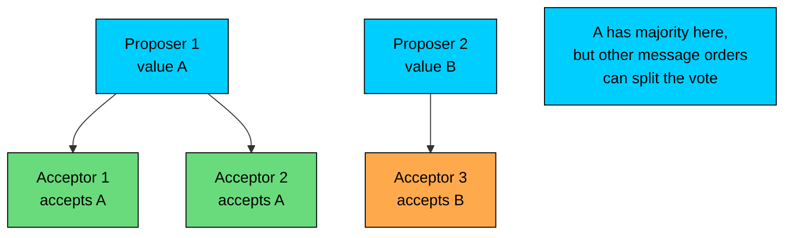
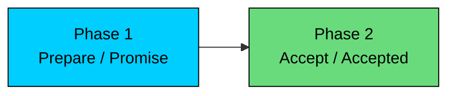
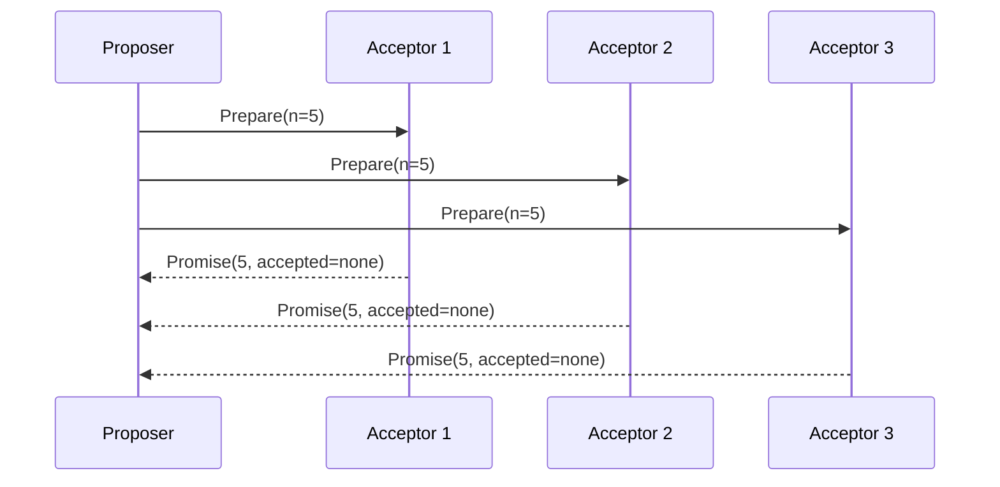
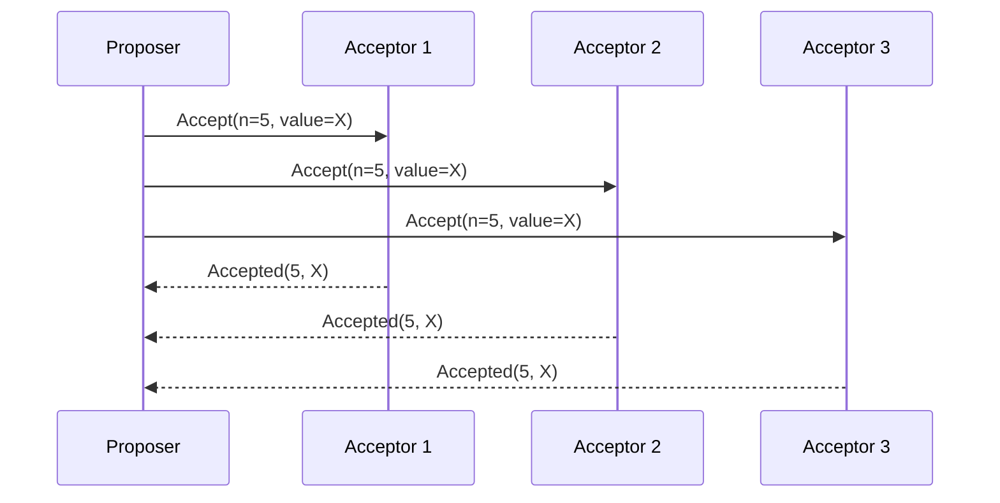
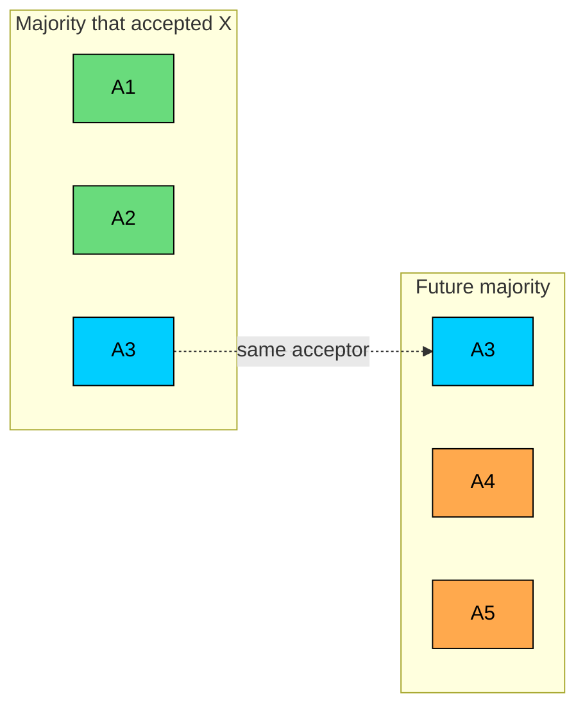
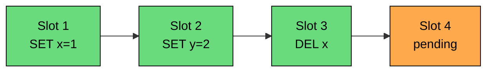

Paxos is the classic consensus algorithm for crash-fault-tolerant distributed systems.

It solves a narrow but important problem: a group of nodes must agree on one value, even when some nodes crash and messages are delayed, duplicated, or delivered out of order.

Paxos matters because its ideas appear in many later systems:

- quorum intersection
- monotonically increasing proposal numbers
- durable promises
- leader optimization
- replicated logs built from repeated consensus decisions

The algorithm has a reputation for being hard to learn. That reputation is earned. The basic protocol is small, but the safety argument is subtle, and real implementations need leader election, recovery, reconfiguration, snapshots, batching, and careful disk persistence.

This chapter focuses on the core protocol first. Multi-Paxos and production concerns come after the single-value version is clear.

---

# The Single-Value Problem

> [!PAYWALL] This content is for premium members only.

Single-value consensus asks a group of nodes to choose exactly one value.

Several nodes may propose values. Some nodes may crash. Messages may arrive late. The protocol must still avoid choosing two different values.

The protocol needs three properties. **Validity** says that only a proposed value can be chosen. **Agreement** says that two different values cannot both be chosen. **Termination** says that a value is eventually chosen when the system is stable enough.

Paxos always protects safety: validity and agreement. Liveness depends on practical conditions, such as a reachable majority and a proposer that can finish without repeated preemption.

This is the usual consensus trade-off. During a partition, a correct Paxos system may stop making progress, but it must not choose two conflicting values.

---

# Why Simple Designs Fail

The shape of Paxos makes more sense after seeing what simpler designs get wrong.

### Single Acceptor

One node could make every decision.

This is easy to understand, but it has a single point of failure. If the acceptor crashes before others learn the decision, the system may lose the chosen value.

### First Proposal Wins

Add several acceptors and have each one accept the first proposal it receives.

This can stall under concurrent proposals. Different acceptors may accept different values depending on message timing. If no value reaches a majority, no decision is made.

It also has no clean recovery path. A later proposer needs to know whether an earlier value may already have reached a majority. Paxos adds exactly that missing step.

---

# Paxos Roles

Paxos defines three logical roles.

| Role | Responsibility | State |
|------|----------------|-------|
| **Proposer** | Starts a proposal and drives the protocol | Proposal number |
| **Acceptor** | Votes on proposals | Highest promise and last accepted proposal |
| **Learner** | Learns the chosen value | Chosen value |

These are roles, not necessarily separate machines. In a real service, the same server may act as proposer, acceptor, and learner.

Acceptors are the safety boundary. They must store enough state to prevent an older proposal from overwriting a value that may already have been chosen.

Paxos needs a majority of acceptors to choose a value. With `2f + 1` acceptors, the system tolerates `f` failures: 3 acceptors tolerate 1 failure, 5 tolerate 2, and 7 tolerate 3.

The majority requirement matters because any two majorities overlap. If one majority accepted a value, every future majority contains at least one acceptor that can report what happened.

---

# Proposal Numbers

Every Paxos proposal has a unique, increasing proposal number.

Proposal numbers provide a total order over attempts. When two proposers compete, acceptors can prefer the higher-numbered proposal and reject older ones.

A common scheme combines a local counter with a proposer ID:

The proposer ID makes numbers unique. The counter makes each proposer move forward. If a proposer sees that another node used a higher number, it must jump above that number before retrying.

Proposal numbers are not timestamps. They do not measure real time. They only give the protocol a safe ordering for competing proposals.

---

# The Two Phases

Paxos has two phases:

1. **Prepare / Promise:** reserve a proposal number and discover prior accepted values.
2. **Accept / Accepted:** ask acceptors to accept the selected value.

Phase 1 is the read step. The proposer asks whether any acceptor has already accepted a value.

Phase 2 is the write step. The proposer asks acceptors to accept a value that is safe to choose.

### Phase 1: Prepare

A proposer chooses a proposal number `n` higher than any number it has already seen. It sends `Prepare(n)` to acceptors.

An acceptor replies with `Promise(n)` if `n` is higher than its current promise. The promise means:

- I will not accept proposals numbered lower than `n`.
- Here is the last proposal/value I accepted, if any.

Acceptor logic:

The proposer can move to Phase 2 after receiving promises from a majority.

### Phase 2: Accept

After a majority promises, the proposer chooses a value.

The rule is strict:

- If no promise reports an accepted value, the proposer may use its own value.
- If any promise reports an accepted value, the proposer must use the value from the highest-numbered accepted proposal.

Then the proposer sends `Accept(n, value)` to acceptors.

Acceptor logic:

A value is chosen when a majority of acceptors accepts the same proposal `(n, value)`.

A later proposal may carry the same value under a higher proposal number. The protocol must never choose a different value.

---

# Why Phase 1 Is Necessary

The safety of Paxos comes from one rule: a proposer must carry forward the highest-numbered accepted value it learns during Phase 1.

Consider a three-acceptor cluster.

A new proposer wants to choose `BLUE`. It starts proposal `10`.

P2 has a majority: A1 and A2. It also learned that `RED` was accepted at proposal `3`.

P2 must propose `RED`, even though it wanted `BLUE`.

The proposer did not need to know whether `RED` was definitely chosen. It only needed to know that `RED` might have been chosen. Paxos treats that possibility as binding.

---

# Quorum Intersection

Quorum intersection is the core safety mechanism.

In a five-acceptor cluster, any majority has three acceptors. Two majorities cannot be disjoint.

If a value was accepted by a majority, a later proposer that talks to any majority will contact at least one acceptor from the earlier majority.

That acceptor reports its accepted value during Phase 1. The later proposer must preserve the highest-numbered accepted value it hears about.

This is why Paxos can survive crashes and retries without choosing a conflicting value.

---

# Concurrent Proposals

Paxos allows multiple proposers, but competing proposers can waste work.

### Clean Preemption

No safety violation occurs. P1 made partial progress, but `X` was accepted by only one acceptor. A value needs a majority to be chosen.

### Prior Accepted Value

Partial acceptance becomes important when a later proposer observes it.

`X` was not chosen yet, but it might have been. P2 carries it forward.

### Livelock

Two proposers can repeatedly preempt each other.

The system is active, but no proposal completes.

Production systems avoid this with randomized backoff or by electing a stable leader. Multi-Paxos uses the leader approach.

---

# Acceptor Durability

Paxos safety depends on acceptors remembering their state across crashes.

Each acceptor must persist:

The acceptor must write this state durably before replying to `Prepare` or `Accept`.

Without durability, an acceptor can forget a promise:

That behavior breaks the protocol. A promise is part of the safety proof, so it must survive restart.

Disk sync latency is often a major cost in Paxos-style systems. Implementations reduce the cost with batching, group commit, stable leaders, and careful storage design.

---

# Learners

Once a value is chosen, learners need to discover it.

Paxos leaves several options:

| Approach | How It Works | Trade-off |
|----------|--------------|-----------|
| **Proposer notifies learners** | Proposer announces the chosen value after receiving majority accepts | Simple, but proposer failure can delay learning |
| **Acceptors notify learners** | Acceptors send accepted messages to learners | More resilient, more messages |
| **Distinguished learner** | One learner collects acceptances and informs others | Fewer messages, but another recovery path is needed |

Real systems usually combine approaches. The leader announces commits in the common path, and replicas can recover by querying peers or replaying the replicated log.

---

# Multi-Paxos

Basic Paxos chooses one value. Databases and coordination services need a sequence of values.

Multi-Paxos builds a replicated log by running Paxos for many log slots.

The naive design runs full Paxos for every slot:

That pays Phase 1 every time.

Multi-Paxos uses a stable leader to reduce the normal path:

1. A leader establishes a high proposal number with Phase 1.
2. Acceptors promise not to accept lower-numbered proposals.
3. The leader proposes values for log slots using Phase 2.
4. If the leader fails, a new leader runs Phase 1 and recovers any accepted values.

Basic Paxos runs both phases for every slot. Multi-Paxos with a stable leader skips Phase 1 entirely once leadership is established and replicates each new value with Phase 2 alone.

This is the optimization used by practical Paxos systems. The stable leader makes the protocol look similar to Raft during normal operation: one leader orders writes and replicates them to a quorum.

Multi-Paxos is still not a complete system specification. It does not fully define leader election, reconfiguration, log repair, snapshotting, or operational behavior. Implementations must fill those gaps.

---

# Log Gaps and Recovery

Multi-Paxos treats log slots as separate consensus instances. That means slots can complete out of order.

The state machine cannot safely apply slot 3 until slot 2 is known. The order of the log defines the order of execution.

A new leader must repair gaps:

1. Run Phase 1 for unknown slots.
2. Learn whether any value was already accepted.
3. Carry forward accepted values when required.
4. Propose no-op entries for slots that have no prior accepted value.
5. Apply entries only after all earlier slots are decided.

This is one reason production Paxos implementations are complex. The algorithm for one value is small. The surrounding system is large.

---

# Membership Changes

Changing the acceptor set is dangerous because safety relies on quorum intersection.

Consider this transition:

An old majority `{B, C}` and a new majority `{D, E}` do not overlap. If both configurations can decide at the same time, the system can choose conflicting values.

Safe reconfiguration must ensure old and new quorums overlap during the transition. Real systems use techniques such as joint consensus, configuration entries in the log, or carefully designed reconfiguration protocols.

This is another area where the basic Paxos description is incomplete for production.

---

# Paxos Variants

Several Paxos variants adjust the trade-offs.

| Variant | Main Idea | Trade-off |
|---------|-----------|-----------|
| **Multi-Paxos** | Use a stable leader and a replicated log | Fast common path, leader recovery needed |
| **Fast Paxos** | Allow clients to send proposals directly to acceptors in the fast path | Lower latency without conflicts, larger quorums and harder conflict handling |
| **Cheap Paxos** | Use auxiliary acceptors only after failures | Lower normal-case resource use, slower recovery |
| **Generalized Paxos** | Avoid ordering operations that commute | More concurrency, harder application and protocol logic |
| **EPaxos** | Let any replica lead commands and track dependencies | Better load distribution, higher implementation complexity |

These variants are useful in specialized systems. For a new internal service, a mature Raft implementation is usually easier to understand and operate.

---

# Paxos in Production

Paxos has been used in important production systems, usually with substantial engineering around the core algorithm.

### Google Chubby

Chubby is Google's distributed lock service for coarse-grained locks and small pieces of reliable metadata. A Chubby cell uses a small replicated group and Paxos to keep replicas consistent.

Chubby is a good example of consensus used for coordination rather than for every user-facing request. The data volume is small, but the correctness requirements are high.

### Google Spanner

Spanner uses Paxos-style replication for data shards. Each shard is replicated across a Paxos group, and higher-level transaction protocols coordinate work across shards.

Spanner also uses TrueTime to provide externally consistent transactions. Paxos handles replication and agreement inside groups; TrueTime helps order transactions across the distributed system.

### Cassandra Lightweight Transactions

Cassandra is normally designed for high availability and eventually consistent writes. Lightweight transactions add single-partition conditional updates, such as `INSERT ... IF NOT EXISTS`.

Those operations use Paxos-style consensus because Cassandra must ensure only one conditional update succeeds for a partition.

Cassandra's newer Accord work aims to support more general transactions. That direction reinforces the larger point: consensus protocols evolve, and production databases often combine multiple techniques rather than using textbook Paxos directly.

---

# Where Paxos Still Helps

Paxos exposes the structure behind consensus:

- a majority decision must be discoverable by future majorities
- promises must be durable
- proposal numbers order competing attempts
- leaders improve performance but do not remove the need for recovery
- log replication is repeated consensus plus a large amount of engineering

For a new implementation, Paxos is rarely the first choice. Raft gives a clearer complete specification for replicated logs, leader election, and membership changes.

Paxos still pays off in two situations: when reading distributed systems papers and older infrastructure that uses Paxos vocabulary, and when reasoning about why quorum-based consensus is safe in the first place.

---

# Summary

Paxos solves single-value consensus in a crash-fault-tolerant system.

The core mechanics are:

- Proposers use unique increasing proposal numbers.
- Acceptors promise not to accept older proposals.
- Acceptors report previously accepted values during Phase 1.
- Proposers must carry forward the highest-numbered accepted value they learn.
- A value is chosen when a majority accepts the same proposal.
- Quorum intersection ensures future proposers discover values that may already have been chosen.
- Acceptor state must survive crashes.
- Multi-Paxos turns single-value Paxos into a replicated log by using a stable leader.

Paxos is compact as an algorithm and demanding as a system. The two message phases are only the beginning. Recovery, leader stability, reconfiguration, log repair, snapshots, disk persistence, and operational tuning are where implementations become difficult.

---

# Quiz
