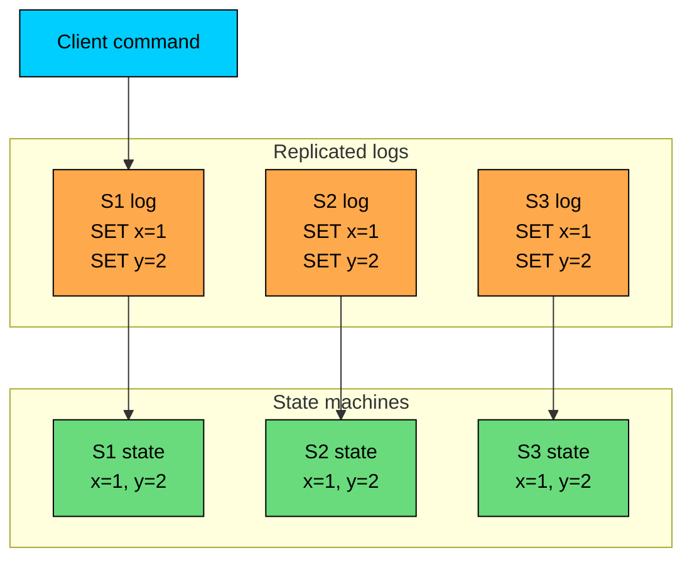
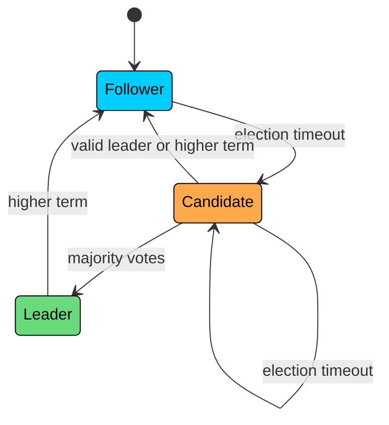
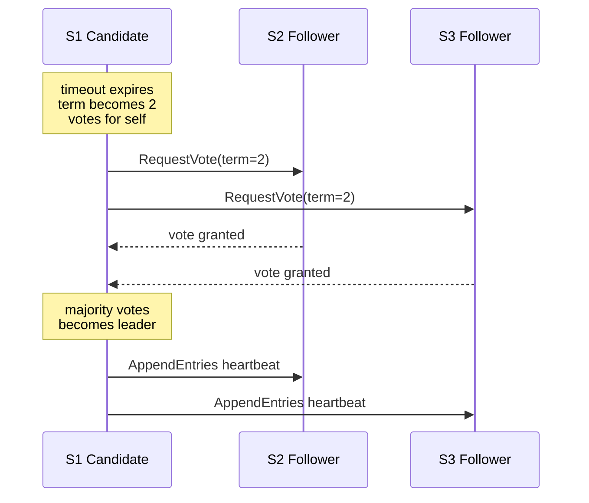
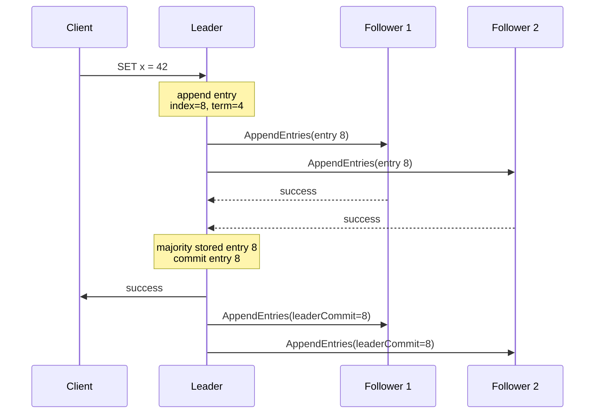
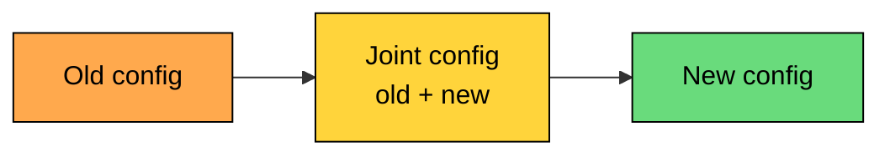
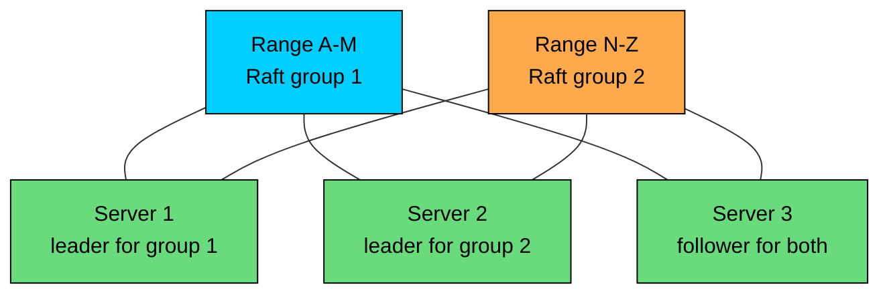

Raft is a consensus algorithm for building a replicated log.

It gives a group of servers one agreed order of commands, even when some servers crash, restart, or fall behind. Each server applies that same command sequence to its local state machine. If the state machine is deterministic, all servers end up with the same state.

Raft was designed to be easier to understand and implement than Paxos. It does this by using a strong leader, splitting the protocol into smaller pieces, and specifying the practical details that Paxos leaves open.

Systems such as etcd, Consul, CockroachDB, TiKV, Vault, and Kafka's KRaft metadata quorum use Raft or Raft-inspired protocols for critical replicated state.

---

# Design Philosophy

> [!PAYWALL] This content is for premium members only.

Raft's design is built around three choices.

| Choice | What It Means | Why It Helps |
|--------|---------------|--------------|
| **Decomposition** | Split consensus into leader election, log replication, and safety | Each part can be understood separately |
| **Strong leader** | Client writes go through one leader | Avoids competing proposers in the normal path |
| **Complete specification** | Define RPCs, state, elections, snapshots, and membership changes | Reduces implementation ambiguity |

The strong leader model is the major difference from basic Paxos. In Raft, followers do not accept arbitrary proposals from arbitrary nodes. They follow the current leader. If the leader fails, the cluster elects a new one.

This makes normal operation straightforward:

1. The leader receives a client command.
2. The leader appends it to its log.
3. The leader replicates it to followers.
4. The entry commits after a majority stores it.
5. Servers apply committed entries in log order.

---

# Replicated State Machine

Raft implements the replicated state machine pattern.

Raft does not know what the command means. The command might update a key-value store, change cluster metadata, create a lock, or update a database range. Raft only makes sure every server sees the same commands in the same order.

This gives the application a simple contract: if command execution is deterministic, identical committed logs produce identical state.

---

# Server States

Every Raft server is in one of three states.

A **follower** responds to leader and candidate RPCs. A **candidate** starts an election and requests votes. A **leader** handles writes, sends heartbeats, and replicates log entries.

The steady state is one leader and the rest followers. Followers expect periodic heartbeats from the leader. If a follower does not receive a heartbeat before its election timeout expires, it becomes a candidate and starts a new election.

Raft does not need a perfect failure detector. A timeout only means "I have not heard from a valid leader recently." The election process then decides whether the server can become leader.

---

# Terms

Raft divides execution into terms. A term is a monotonically increasing number stored by every server.

A term can elect one leader or no leader. Some terms end without a leader because an election split the vote or the candidate crashed.

Every Raft RPC includes a term.

When a server receives a message:

Terms make stale leaders safe. A leader isolated by a network partition may still think it is leader, but once it sees a higher term, it steps down.

---

# Persistent and Volatile State

Raft separates persistent state from volatile state.

Persistent state must survive crashes:

Volatile state can be rebuilt:

Leaders also track replication progress:

`currentTerm`, `votedFor`, and `log[]` must be persisted before a server replies to RPCs that depend on them. Otherwise a crash can make the server forget a vote or lose an entry that another server counted as replicated.

---

# Leader Election

Leader election starts when a follower's election timeout expires.

The server becomes a candidate:

1. Increment `currentTerm`.
2. Vote for itself.
3. Persist `currentTerm` and `votedFor`.
4. Send `RequestVote` RPCs to other servers.
5. Become leader if it receives votes from a majority.

### RequestVote

`RequestVote` includes:

A follower grants its vote only when:

- the candidate's term is at least as recent as the follower's term
- the follower has not voted for another candidate in that term
- the candidate's log is at least as up to date as the follower's log

The log check is essential. It prevents a server with a stale log from becoming leader and overwriting committed entries.

Raft compares logs using the last entry:

Term wins over length. A shorter log ending in a newer term is more up to date than a longer log ending in an older term.

### Election Safety

A term cannot elect two leaders.

The reason is quorum intersection:

- A leader needs votes from a majority.
- Any two majorities overlap.
- A server gives one vote per term.

Two candidates cannot both receive majority votes in the same term because the overlapping voter would have to vote twice.

### Randomized Timeouts

If multiple followers time out at the same time, they may split the vote. Raft reduces this by randomizing election timeouts.

The exact values depend on the deployment. The election timeout should be long enough to avoid elections during normal heartbeat delays and short enough to recover from leader failure within the required availability target.

---

# Log Entries

A Raft log entry has three pieces: an **index** (its position in the log), a **term** (the leader term that created it), and a **command** (the application-level operation).

The term in each entry is part of the safety mechanism. It lets servers detect conflicting histories.

Raft maintains this invariant:

If two logs contain an entry with the same index and term, then the logs are identical up through that entry.

This is called the Log Matching Property.

---

# Log Replication

The leader handles client writes.

For each write:

1. Append the command to the leader's log.
2. Send `AppendEntries` to followers.
3. Wait until a majority stores the entry.
4. Mark the entry committed.
5. Apply the entry to the leader's state machine.
6. Reply to the client.
7. Tell followers the latest commit index in later `AppendEntries` calls.

A leader's local write does not commit an entry. The entry commits after the leader knows a majority has stored it.

---

# AppendEntries

`AppendEntries` is used for heartbeats, log replication, and commit notification.

The follower accepts the new entries only if its log contains `prevLogIndex` with term `prevLogTerm`.

This consistency check lets the leader repair followers after crashes or partitions.

---

# Repairing Divergent Logs

After a leader change, followers may have missing or conflicting uncommitted entries.

The leader keeps `nextIndex` for each follower. If a follower rejects `AppendEntries`, the leader backs up `nextIndex` and tries an earlier prefix.

Once the leader finds a matching prefix, the follower deletes conflicting entries and appends the leader's entries.

The leader never rewrites its own log. Followers converge to the leader's log.

Practical implementations optimize this by returning conflict term and conflict index in the rejection response, so the leader can skip back faster than one entry at a time.

---

# Commit Rules

Raft has a subtle commit rule.

A leader may mark an entry committed when:

- the entry is stored on a majority, and
- the entry was created in the leader's current term

Entries from older terms are committed indirectly. When a current-term entry commits, all earlier entries in the log become committed as well.

This rule prevents an older uncommitted entry from being counted as committed by a leader that later loses leadership. Without the current-term restriction, a future leader with a different entry from a newer term could overwrite it.

The rule sounds conservative, but it is central to Raft's safety proof.

---

# Safety Properties

Raft's safety depends on four linked properties. **Election safety** says that a term cannot elect two leaders. **Log matching** says that the same index and term imply the same log prefix on every replica. **Leader completeness** says that if an entry is committed in a term, every later leader contains that entry. **State machine safety** says that servers do not apply different commands at the same log index.

Leader completeness connects elections to replication:

1. A committed entry is stored on a majority.
2. A later leader must receive votes from a majority.
3. Those two majorities overlap.
4. The overlapping voter has the committed entry.
5. The voter only votes for a candidate with an at-least-as-up-to-date log.

So a later leader must contain the committed entry.

The vote restriction includes log freshness for this reason. Leader election must pick a server that can preserve committed history.

---

# Failure Scenarios

### Leader Failure

If the leader crashes, followers stop receiving heartbeats. One follower times out, becomes candidate, and starts an election.

Uncommitted entries from the old leader may be lost. This is correct because the client should not have received success for them.

Committed entries are preserved because any future leader must contain them.

Clients retry requests when they time out. Applications usually include request IDs so a retried command is applied once.

### Follower Failure

If a follower crashes, the leader continues as long as a majority remains available.

When the follower returns, it may be behind. The leader repairs it with `AppendEntries`, or sends a snapshot if the missing log entries have already been compacted.

### Network Partition

If the leader remains with a majority, it can continue committing entries.

If the leader is isolated in a minority partition, it may still believe it is leader, but it cannot commit new entries because it cannot reach a majority.

The majority partition can elect a new leader. When the partition heals, the old leader sees the higher term and steps down. Any uncommitted entries in the old minority partition may be overwritten.

---

# Client Interaction

Clients should send writes to the leader.

A client can discover the leader in several ways:

- send to any server and follow redirects
- cache the last known leader and retry elsewhere on failure
- use service discovery that points at the current leader

### Duplicate Requests

A leader can commit a command and crash before replying. The client times out and retries with the new leader.

For non-idempotent commands, retries can duplicate effects.

The usual fix is a request ID:

The state machine records the latest sequence number and cached response for each client. If the same request appears again, it returns the cached response instead of executing the command twice.

### Reads

Linearizable reads require care. A stale leader in a minority partition must not serve old data as if it were current.

Common approaches:

| Approach | How It Works | Cost |
|----------|--------------|------|
| **Read through the log** | Append a no-op/read barrier and wait for commit | Safest, highest latency |
| **ReadIndex** | Leader confirms it still has majority support, then reads applied state | Common practical approach |
| **Lease reads** | Leader serves reads during a valid lease interval | Fast, but depends on clock assumptions |

ReadIndex avoids writing a log entry for every read, but it still confirms that the leader is current before serving the read.

---

# Membership Changes

Changing the voting set is hard because quorum intersection must hold across the transition.

A direct switch can be unsafe.

Raft's original solution is joint consensus.

During joint consensus, a configuration entry includes both old and new sets. To commit entries or elect a leader, the system needs:

- a majority of the old configuration
- a majority of the new configuration

After the joint configuration commits, the leader commits a second entry that switches to the new configuration only.

Many implementations also support changing one voter at a time. Single-server changes preserve quorum overlap and are simpler operationally, but multi-server changes still need a protocol that prevents disjoint majorities.

---

# Snapshots and Log Compaction

Raft logs cannot grow forever.

A server can compact old committed entries into a snapshot of the state machine.

`lastIncludedIndex` and `lastIncludedTerm` preserve the information needed for future log consistency checks.

If a follower is far behind and the leader no longer has the missing log entries, the leader sends an `InstallSnapshot` RPC. The follower installs the snapshot, discards older log state, and resumes normal replication from that point.

Snapshots are part of normal operation in long-running clusters. Without them, recovery and disk usage eventually become unacceptable.

---

# Multi-Raft

A single Raft group is limited by one leader's CPU, disk, and network bandwidth.

Large databases usually shard data and run many Raft groups.

Each shard has its own replicated log and leader. Leaders can be spread across servers, which distributes load.

Cross-shard transactions need additional coordination, often through two-phase commit or a transaction layer above Raft.

---

# Raft in Production

Raft is common in infrastructure that stores small or medium-sized critical metadata, and in distributed databases that shard data across many consensus groups.

| System | How Raft Is Used |
|--------|------------------|
| **etcd** | Replicated key-value store used by Kubernetes |
| **Consul** | Service discovery and strongly consistent KV metadata |
| **CockroachDB** | Replication for ranges of SQL data |
| **TiKV** | Replication for key ranges used by TiDB |
| **Vault integrated storage** | Replicated storage for Vault data |
| **Kafka KRaft** | Raft-based metadata quorum replacing ZooKeeper for Kafka metadata |

Performance depends heavily on deployment details:

- latency to a majority
- disk sync behavior
- batching
- log entry size
- leader placement
- snapshot and compaction settings

Raft makes critical state consistent. It does not make every request cheap. High-scale systems use sharding, batching, leases, follower reads, and careful placement to keep the consensus path manageable.

---

# Implementation Pitfalls

Several Raft bugs come from violating one of the safety rules. Replying before persisting term, vote, or log changes can erase a decision other servers already relied on. Granting votes without checking log freshness lets a stale server become leader. Committing old-term entries directly by counting replicas allows a later leader to overwrite them, which is exactly the Figure 8 scenario.

Other common mistakes include appending conflicting entries without deleting the old suffix (followers keep divergent histories), serving reads from an unconfirmed leader (a partitioned old leader returns stale data), and changing membership without overlapping quorums (two disjoint groups can each elect a leader).

Good Raft implementations are usually tested with fault injection, model checking, randomized simulation, or Jepsen-style testing. The protocol is understandable, but small persistence or timing mistakes still cause real correctness bugs.

---

# Summary

Raft builds a replicated log with a strong leader.

The main ideas are:

- Servers are followers, candidates, or leaders.
- Terms act as a logical clock and make stale leaders step down.
- A leader is elected by majority vote.
- Voters only support candidates with sufficiently up-to-date logs.
- The leader appends entries and commits them after majority replication.
- Followers use `prevLogIndex` and `prevLogTerm` to detect conflicts.
- The leader repairs followers by backing up to a matching prefix.
- Leaders commit current-term entries directly; older entries commit indirectly.
- Membership changes must preserve quorum intersection.
- Snapshots compact old log entries and help slow followers catch up.
- Multi-Raft scales the pattern by running many independent Raft groups.

Raft is easier to reason about than Paxos because it narrows the normal path: one leader orders commands, followers replicate that order, and elections enforce that future leaders preserve committed history.

---

# Quiz
