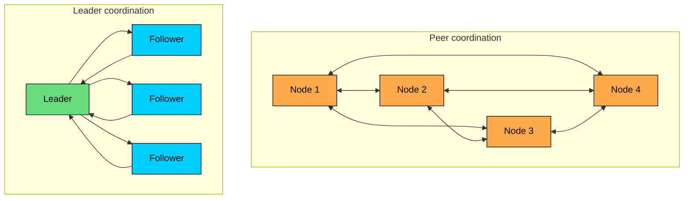
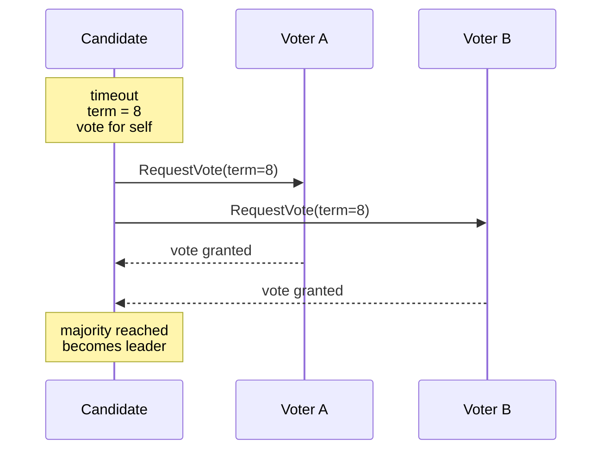
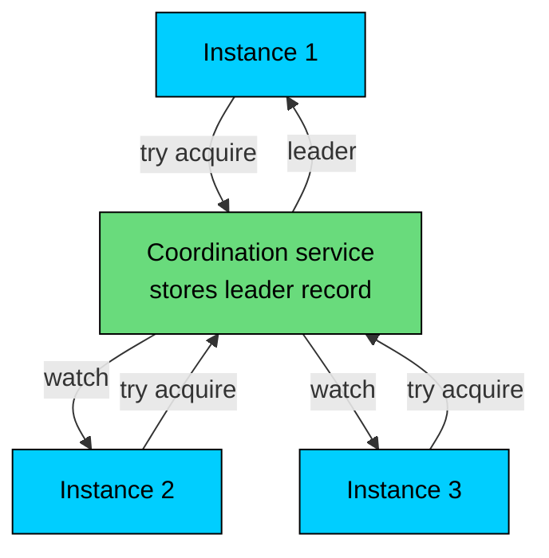
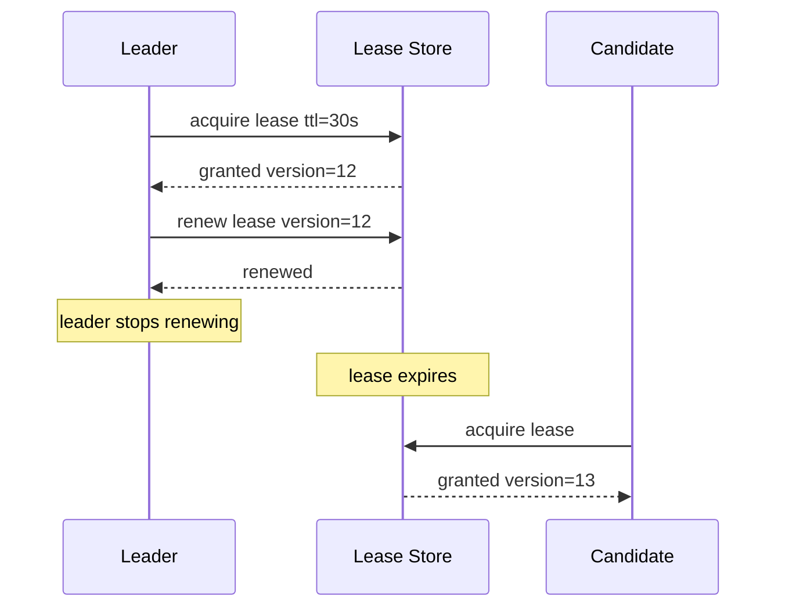
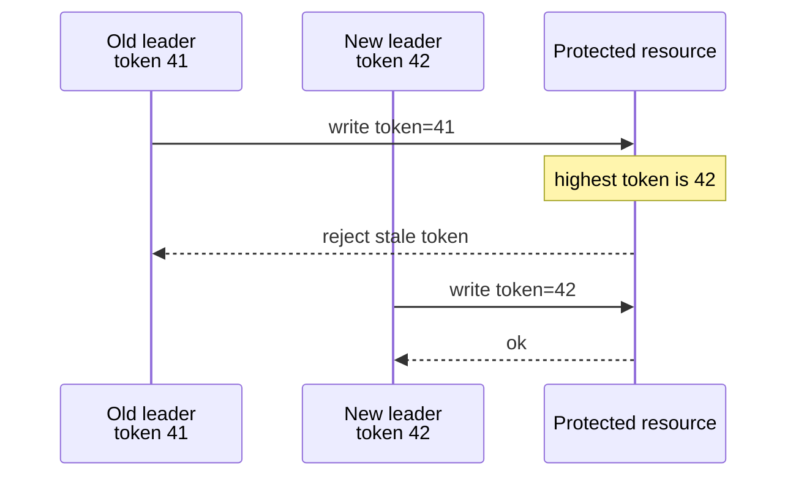
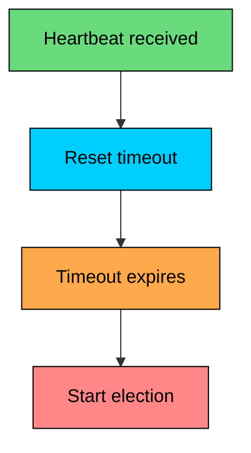

Leader election is the process of choosing one node to coordinate work for a group.

A leader might:

- accept writes for a replicated database
- assign jobs to workers
- own a shard or partition
- run a controller loop
- coordinate failover
- serialize changes to shared metadata

The leader role simplifies many systems because one node decides the order of operations. The hard part is keeping that role safe when machines crash, networks partition, clocks drift, or old leaders keep running after losing contact with the cluster.

Every node does not need to know the leader instantly. Only a valid leader should be able to make decisions that matter.

---

# Why Leaders Help

Without a leader, every node may need to coordinate with every other node. With a leader, followers send coordination work to one place.

Concrete examples are everywhere. A **database primary** orders writes and replicates them. A **Kafka partition leader** handles reads and writes for its partition. A **Kubernetes controller** runs one active reconciliation loop. A **job scheduler** assigns work and avoids duplicate scheduling. A **distributed lock service** grants locks from one consistent authority. A **consensus group** uses a leader to drive log replication on the common path.

Not every system needs a leader. Stateless services, caches, CDNs, and some eventually consistent databases can handle requests on many nodes without a single coordinator. The trade-off is usually consistency and conflict handling. Leader-based systems make ordering easier, but the leader path can become a bottleneck and a failover point.

---

# Correctness Properties

Leader election has safety and liveness requirements. **Election safety** means a term, epoch, or lease interval cannot allow two valid leaders. **Agreement** means nodes converge on the same leader. **Fencing** prevents stale leaders from mutating protected resources. **Termination** says that when enough healthy nodes can communicate, an election eventually completes. **Recovery time** is the window from leader failure to a working replacement.

Safety matters more than constant availability. A system with no leader is unavailable for writes. A system with two effective leaders can corrupt data.

The word "effective" is important. During a partition, an old leader may still believe it is leader. A safe design prevents that old leader from committing writes, acquiring locks, or changing external state after it loses authority.

---

# The Core Difficulty

Leader election depends on failure detection, and failure detection is uncertain.

From another node's point of view, a crashed leader, an overloaded leader, a network that dropped packets, a stop-the-world pause that froze the process, and a slow observer all look the same. There is no message that distinguishes them.

The usual answer is a timeout. If a node has not heard from the leader for long enough, it starts an election.

Timeouts are engineering choices:

| Timeout Choice | Benefit | Risk |
|----------------|---------|------|
| **Short timeout** | Faster failover | More false elections during pauses or network jitter |
| **Long timeout** | Fewer false elections | Longer unavailability after real failure |
| **Randomized timeout** | Reduces simultaneous elections | Adds some variability to failover time |
| **Adaptive timeout** | Tracks observed latency | More complexity and harder debugging |

No timeout can prove that a node is dead. It only says the system should stop waiting and try to make progress elsewhere.

---

# Approach 1: Consensus-Based Election

Consensus-based election is used when the elected leader also protects replicated state.

Raft is the clearest example:

1. A follower times out.
2. It increments its term and becomes a candidate.
3. It votes for itself.
4. It asks other nodes for votes.
5. It becomes leader after receiving a majority.

Why this is safe:

- a leader needs a majority
- any two majorities overlap
- a voter grants one vote per term
- log freshness rules prevent stale candidates from becoming leader

Consensus-based election is a good fit when leadership and data replication are part of the same protocol. The safety properties are strong, terms or epochs naturally fence old leaders, and the election protocol is part of the same machinery that replicates the log. The protocol is non-trivial to implement correctly, it requires a majority to make progress, and elections can stall during partitions until enough nodes are reachable again. Timeout tuning is also a real engineering task in production.

Raft, Multi-Paxos systems, ZooKeeper's internal leader election, and database replica-set elections all use this pattern.

---

# Approach 2: External Coordination Service

Many applications should not implement leader election directly. They can use a coordination service such as ZooKeeper, etcd, Consul, or the Kubernetes API.

The application sees a simple primitive:

- acquire leadership
- keep leadership alive
- observe leadership changes
- resign leadership

The coordination service handles consensus internally.

This is common for controllers, schedulers, batch workers, and services where leadership is application-level coordination rather than the database's own replication protocol.

### ZooKeeper Pattern

ZooKeeper leader election commonly uses ephemeral sequential znodes:

1. Each candidate creates an ephemeral sequential node under an election path.
2. The node with the lowest sequence number is leader.
3. Other nodes watch the predecessor immediately before them.
4. If the leader's session ends, its ephemeral node is removed.
5. The next candidate observes its predecessor disappear and checks whether it is now leader.

Observing the predecessor avoids the herd effect. If all candidates observe the leader, a leader failure wakes the full candidate set at once. With predecessor observation, ZooKeeper notifies only the next candidate.

### etcd and Kubernetes Pattern

etcd provides election and locking primitives backed by leases and Raft. A candidate creates leadership state attached to a lease. If the process dies or stops renewing, the lease expires and another candidate can take over.

Kubernetes controllers commonly use `Lease` objects in the `coordination.k8s.io` API group. One controller instance holds the lease and renews it. Other instances observe the lease and take over after it expires.

External coordination is usually the best choice for application-level leaders. The application keeps its own code simple, and the coordination service handles the hard parts: failure detection, leases, watches, and the underlying consensus. The price is operational. The team has to operate the coordination service well, every acquire adds a network hop, and election liveness depends on that service being available. Side effects outside the consensus system still need fencing, because the lease alone cannot prevent a paused leader from continuing to act.

---

# Approach 3: Lease-Based Election

A lease grants leadership for a limited time. The leader must renew the lease before it expires.

Lease-based election is attractive because it is easy to understand. It is also easy to get subtly wrong.

Important details:

- The lease store must be strongly consistent.
- The lease should include a monotonic version or fencing token.
- The old leader must stop acting before its local lease deadline.
- The new leader should not assume the old leader stopped instantly.
- Clock skew and long process pauses must be accounted for.

Using absolute wall-clock timestamps across machines is risky. Relative TTLs managed by a strongly consistent store are safer, but still require careful handling of pauses, renewal failures, and stale leaders.

Lease-based leadership is common in application controllers and schedulers. It is less appropriate for systems where the leader can mutate external resources that do not check fencing tokens.

---

# Fencing Tokens

Fencing tokens protect resources from stale leaders.

Each successful election or lease acquisition produces a monotonically increasing token: a term, epoch, version, or revision.

The leader includes that token with every request to protected resources. The resource rejects requests with an older token.

Fencing is needed because leadership changes are not instantaneous from every process's perspective. An old leader may be paused, partitioned, or processing an in-flight request while a new leader is elected.

Examples:

- A storage service rejects writes from older epochs.
- A database row stores the current leader version.
- A lock service returns a monotonically increasing lock token.
- A job worker includes the scheduler epoch when claiming work.

Without fencing, a stale leader can still damage state even if the election algorithm itself is correct.

---

# Split-Brain

Split-brain means two nodes act as leader for the same resource at the same time.

The common causes come from a few familiar places. An election can succeed without a real quorum, usually because of a bug or a misconfiguration. Lease code can ignore clock skew or process pauses and let the deadline slip. External resources can fail to reject writes from stale leaders. Manual failover can promote a new leader while the old one is still accepting writes. Network partitions can leave both sides convinced they are the survivors.

Quorums prevent two independent majorities from forming.

The minority side may still contain the old leader. A safe design prevents it from committing work because it cannot reach a quorum or because downstream resources reject its stale token.

Split-brain prevention is layered. A **quorum** prevents two elected leaders in the same term or epoch. **Terms or epochs** make stale leadership detectable. **Fencing tokens** stop old leaders from mutating protected resources. **Idempotent operations** reduce damage from retries during failover. **Operational controls** keep manual failover from bypassing the protocol.

---

# Failure Detection

Leader election usually starts with heartbeat failure.

The leader sends heartbeats. Followers reset a timer when they receive a valid heartbeat. If the timer expires, a follower starts an election or tries to acquire leadership.

Timeouts should be based on real deployment behavior:

- normal network latency
- tail latency during load
- garbage collection or stop-the-world pauses
- disk stalls
- cross-zone or cross-region jitter
- expected failover target

Randomized timeouts reduce simultaneous elections. If one follower times out first, it can often collect votes before others start their own campaigns.

Some systems use adaptive failure detectors. A phi accrual detector, for example, estimates suspicion from heartbeat arrival history instead of using one fixed threshold. This can reduce false positives in noisy networks, but it adds complexity and still cannot prove that a node is dead.

---

# Production Examples

### Kubernetes Controllers

Kubernetes runs multiple instances of important controllers for availability. Only one instance should actively reconcile at a time.

Leader election is commonly backed by a `Lease` object. The active controller renews the lease. Standby controllers watch the lease and compete after it expires.

This pattern is appropriate because controller work is application-level coordination. The Kubernetes API server and etcd provide the underlying consistency.

### ZooKeeper Recipes

ZooKeeper exposes primitives such as ephemeral znodes, sequential znodes, sessions, and watches. The leader election recipe uses those primitives to create an ordered candidate list.

ZooKeeper itself uses an internal quorum protocol. Applications using ZooKeeper do not need to implement that protocol directly.

### Databases

Databases usually integrate election with replication:

| System Type | Common Election Pattern |
|-------------|-------------------------|
| **Raft-based databases** | Majority election with log freshness checks |
| **MongoDB replica sets** | Primary election among voting members |
| **PostgreSQL with Patroni** | External coordination through etcd, ZooKeeper, Consul, or Kubernetes |
| **MySQL Group Replication** | Built-in group membership and primary election |
| **Sharded databases** | One leader per shard or range |

The database case is stricter than a simple controller election. The new primary must have the correct log position, and old primaries must be fenced or forced to step down before accepting writes.

### Kafka

Kafka has leaders at two levels:

- partition leaders handle reads and writes for topic partitions
- the controller manages cluster metadata and partition leadership

Kafka 4.0 removed ZooKeeper mode entirely, so current Kafka clusters use KRaft, a Raft-based metadata quorum, for controller election and cluster metadata. ZooKeeper-based controllers still exist in older deployments that have not yet been migrated.

---

# Operational Practices

Leader election problems are often operational problems as much as algorithm problems.

Prefer established implementations of consensus and coordination over rolling your own. Keep an odd number of voting members where a majority quorum is required. Monitor election frequency and election duration, and alert when leadership changes repeatedly. Test the failure modes that matter: leader crash, restart, slow disk, process pause, and network partition.

For side effects outside the consensus system, use fencing tokens. Prefer graceful handoff during planned maintenance, and write down manual failover procedures along with their risks before anyone needs them.

Graceful handoff reduces avoidable downtime. A leader can stop accepting new work, let a preferred follower catch up, ask it to start an election, and then step down. Raft implementations often call this leadership transfer.

Manual failover is dangerous when it bypasses quorum checks. If operators promote a new leader while the old leader is still accepting writes, the system can split-brain even if the normal election protocol is safe.

---

# Common Pitfalls

| Pitfall | Consequence |
|---------|-------------|
| Electing without a majority | Split-brain during partitions |
| Using wall-clock lease expiry without margins | Two leaders during clock skew or pauses |
| Missing fencing tokens | Old leader can still mutate external state |
| Observing one shared leader key from many candidates | Herd effect after leader failure |
| Serving reads from a stale leader | Clients observe old state as current |
| Failing over before replicas catch up | A new leader may miss acknowledged writes |
| Treating retries as unique operations | Duplicate jobs or duplicate side effects |

The safest pattern is also the most conservative one: use a proven coordination service or consensus library, require a quorum, attach a term or fencing token to leader actions, and test the failure cases.

---

# Summary

Leader election chooses one node to coordinate work.

The main ideas are:

- Leaders simplify ordering and coordination.
- A safe system prefers no leader over two effective leaders.
- Failure detection is timeout-based and uncertain.
- Consensus-based election fits best when leadership protects replicated state.
- External coordination services are usually best for application-level leaders.
- Leases are useful but require careful handling of clocks, pauses, and renewal failures.
- Fencing tokens stop stale leaders from mutating protected resources.
- Quorums prevent two independent majorities.
- Production systems monitor elections, test partitions, and avoid unsafe manual failover.

Leader election picks a winner and makes sure old winners cannot keep acting after they have lost.

---

# Quiz
