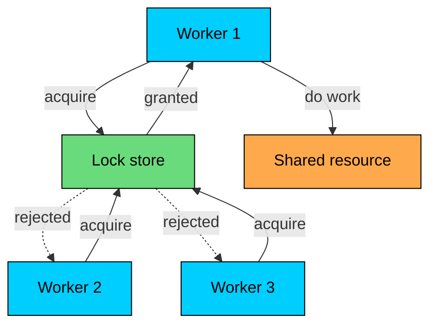
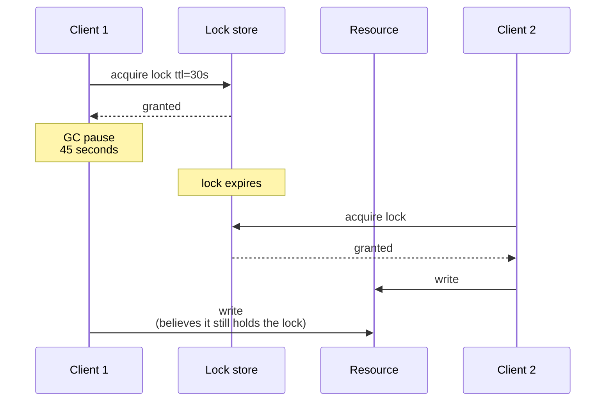
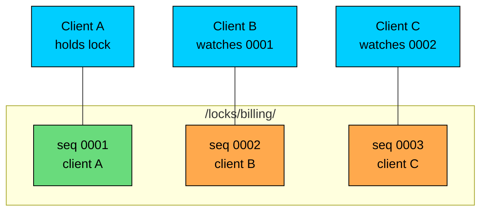
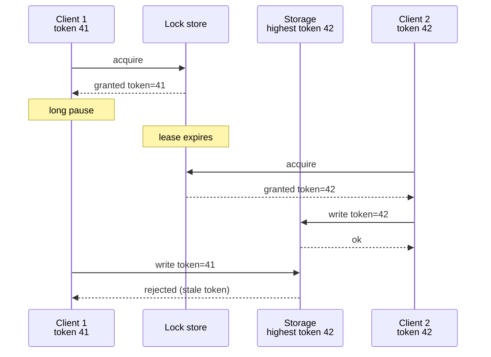

A distributed lock gives one client exclusive access to a shared resource across many processes and machines.

An in-process mutex relies on guarantees the operating system provides. A distributed lock has none of those guarantees and has to survive crashes, partitions, process pauses, and clock drift instead.

Distributed locks are used for:

- ensuring only one worker runs a scheduled job
- serializing writes to a shared external resource
- coordinating migrations or maintenance across a fleet
- single-flight protection in front of a cache or downstream service

The lock store decides who currently holds the lock. Everyone else waits, retries, or skips the work.

---

# Why Distributed Locks Exist

> [!PAYWALL] This content is for premium members only.

Many shared workloads cannot tolerate two workers running at the same time.

Consider a daily billing job that charges customers. If two instances of the job run together, customers may be charged twice. If neither instance runs, customers are not charged at all. The system needs exactly one runner at a time.

The naive answer is to pick one machine and run the job there. That works until the machine fails. Then the job stops running entirely. The next step is to have several machines try to run the job, with a lock making sure only one succeeds.

The lock store becomes the source of truth for who is allowed to act. The rest of the design is about making that source of truth correct under failure.

---

# What Makes Distributed Locks Hard

A single-machine mutex relies on guarantees the OS provides. The thread that holds the mutex is either alive and running, or it is not running at all. Memory is coherent. The clock the OS uses is the same clock the mutex uses.

In a distributed system, none of those assumptions hold cleanly.

### Process Pauses

A process can stop running without crashing. A long garbage collection pause, page swapping, container suspension, kernel scheduling delays, or a debugger can freeze a process for seconds or minutes.

To the lock store and to other clients, a paused process is indistinguishable from a network problem. The process eventually wakes up and continues from where it stopped, possibly believing it still holds a lock that has long since expired.

Both clients now believe they hold the lock. The resource cannot tell which one is right based on the lock alone.

### Clock Skew

System clocks drift. Two machines running NTP can be tens or hundreds of milliseconds apart. Cloud VMs can be worse during live migration. Containers inherit clock behavior from their host.

A lock that uses absolute wall-clock timestamps to decide expiration is exposed to that skew. Client A may believe its lease lasts until 12:00:30 while the lock store believes it expired at 12:00:25.

Lease-based locks are usually safer when expiration is measured by the lock store's relative time, not the client's wall clock. Even then, the client must respect its own deadline conservatively.

### Network Uncertainty

The lock store can grant a lock, but the grant message can be delayed. The client can hold a lock and try to extend it, but the extension can be lost. The client can release the lock, but the release can arrive late.

Any of these can produce a state where the lock store and the client disagree about who holds the lock. The lock protocol has to define how that disagreement is resolved.

### Failure Detection

If the lock holder crashes, the lock must eventually be released. The lock store cannot detect crashes directly. It uses timeouts, leases, or sessions, and those mechanisms cannot distinguish a dead client from a slow one.

This is the same fundamental problem any failure detector faces in an asynchronous network. No timeout proves that a process has died; it only proves that the process has not responded yet.

---

# Correctness Properties

A useful distributed lock provides safety and liveness with explicit limits.

| Property | Meaning |
|----------|---------|
| **Mutual exclusion** | At most one client should hold the lock for the same name at any time |
| **Liveness** | If the holder fails, the lock must eventually become available |
| **Fault tolerance** | The lock service must survive individual node failures |
| **Fencing** | Stale holders must be unable to mutate the protected resource |
| **Bounded waiting** | Clients should not starve indefinitely under normal load |

Mutual exclusion is the property most often missed in practice. Many lock services guarantee mutual exclusion under perfect conditions and fail under partitions or pauses. Two clients can each independently believe they hold the lock during a partition or after a long process pause, which is the lock equivalent of a split-brain leader.

Safety must hold during failures, not just when everything is healthy. If a lock can be held by two clients during a partition, it is not a correct mutual-exclusion lock. It is at best a hint.

---

# Approach 1: Coordination Service Locks

A coordination service such as ZooKeeper, etcd, or Consul provides primitives that make distributed locks straightforward. The service runs an internal consensus protocol, so the lock store itself is fault tolerant and consistent.

The application typically uses a small set of operations:

- create or claim a key tied to a session or lease
- watch the key for changes
- renew the session or lease while still holding the lock
- release the lock explicitly or let the session expire

### ZooKeeper Pattern

The canonical ZooKeeper lock recipe uses ephemeral sequential znodes:

1. Each client creates an ephemeral sequential node under a lock path.
2. The client lists children and finds the one with the lowest sequence number.
3. If the client owns the lowest-numbered node, it holds the lock.
4. Otherwise it sets a watch on the node immediately before its own.
5. When that watch fires, the client rechecks ordering.

Ephemeral nodes are tied to the client session. If the session ends, the node is removed and the next candidate takes the lock. Watching the predecessor avoids the herd effect that would occur if every waiter watched the current holder.

### etcd Pattern

etcd offers a lease abstraction and a transactional API. A client creates a lease, then atomically writes a lock key only if it does not already exist. The lock key is attached to the lease. If the client stops renewing the lease, the key is deleted automatically.

The transaction makes the acquire step safe under concurrent requests. The lease makes recovery automatic when a client fails.

etcd also returns a monotonic revision number for every change. That revision is a natural fencing token.

### Consul Pattern

Consul exposes sessions and key locks. A session is created with a TTL and an optional health check. A client can claim a key by tying it to a session. If the session is invalidated, the lock is released.

Consul also supports sessions tied to agent liveness, so a node failure releases the lock without waiting for TTL.

These three services share a core idea: a strongly consistent store with sessions, leases, and a way to recover the lock when the holder is no longer responsive. They give mutual exclusion on the majority side of a partition and clean up automatically when the holder dies. They also produce a monotonic identifier for every successful acquire (zxid in ZooKeeper, modify revision in etcd, modify index in Consul), which is the fencing token clients need at the protected resource.

The cost is an extra system to run and an extra network hop per acquire. Lock latency tracks the coordination service's commit latency, which is usually a few milliseconds inside a region and longer across regions. Coordination service locks are the default safe choice when correctness matters.

---

# Approach 2: Database Locks

A relational database can be a lock store. Most databases provide row-level locks, advisory locks, or both.

### Row-Level Locks

A worker can use a transaction with `SELECT ... FOR UPDATE` to lock a row that represents the protected resource.

The lock is released when the transaction commits or rolls back. If the client dies, the database eventually rolls back the transaction and releases the lock.

This pattern works well when the protected work is short and runs inside the same database. It works less well when the protected work is long or external because the transaction must remain open the whole time.

### Advisory Locks

Some databases offer advisory locks that are not tied to row contents. PostgreSQL has `pg_advisory_lock` and its session-bound and transaction-bound variants. MySQL has `GET_LOCK`.

Advisory locks are convenient because they do not require a row to lock against. They are still bound to a database session, so a connection failure releases the lock.

Database locks reuse a system the team already operates. The database supplies strong consistency, and the lock fits naturally inside the same transaction as the rest of the work.

The trade-offs follow from running the lock inside the database. Lock latency tracks database load, long-held locks tie up connections that other queries need, cross-region locks pay full replication latency, and a primary failover can break the sessions holding the locks. Database locks are a good fit when the protected work is mostly database work and the operational scope is one cluster.

---

# Approach 3: DynamoDB and Conditional Writes

Any strongly consistent key-value store with conditional writes can support leases.

The idea is simple. The lock is a record with an owner, a version, and an expiration:

Acquire is a conditional write: insert the record only if it does not exist, or replace it only if it is expired and the version matches.

Renew is a conditional update that requires the current owner and version. The version is incremented on every renewal so a fresh holder can detect a stale renewal attempt.

This pattern is used by AWS clients with DynamoDB Lock Client and by many homegrown systems on top of Cosmos DB, Spanner, FoundationDB, and similar stores. Any database that offers strong consistency and atomic conditional updates can support a correct lease lock.

The version field is what makes the renewal safe. Without it, a stale holder can succeed on a renewal it should not be allowed to make. With it, the conditional update rejects any renewal that does not match the latest version.

---

# Approach 4: Redis-Based Locks

Many systems already run Redis for caching, so it is a convenient place to put short-lived locks.

The single-instance pattern uses `SET key value NX PX 30000`:

- the key is the lock name
- the value is a unique token issued by the client
- `NX` only sets the key if it does not exist
- `PX 30000` sets a 30-second expiration

Release uses a script that checks the value before deleting, so a stale client cannot release a lock now held by someone else.

This is correct as a lease lock under a healthy single Redis instance. It is not correct against process pauses or any failover, because the single Redis instance is a single point of failure for both availability and consistency.

### Redlock

Redlock is an algorithm intended to provide a more fault-tolerant Redis lock. It uses N independent Redis nodes. A client tries to acquire the lock on a majority of them within a short timeout, then checks two conditions: that a majority of nodes granted the lock, and that enough of the lease is still left after the acquire latency to be useful. Only then does the client consider the lock held.

Redlock has a well-known critique by Martin Kleppmann. The argument is that any lease-based distributed lock built on a system without proper fencing is exposed to GC pauses, clock jumps, and scheduling delays. Two clients can each independently believe they hold the lock long enough to issue conflicting writes. Redlock's voting across instances does not prevent that because the problem is not on the lock service side; it is on the client side.

The practical takeaway is not that Redlock or Redis locks are useless. It is that any lease-based lock, including Redlock and including single-instance Redis with NX/PX, can deliver mutual exclusion only with help from the protected resource. The resource must reject writes from a client whose lease has expired, even if the client still believes it is the holder.

That help comes from fencing tokens.

Redis locks have very low latency in the happy path and use primitives most teams already understand. The protocol fits in a few lines and is easy to operate.

The downsides come from what the protocol cannot do. A single Redis instance is a single point of failure for both availability and consistency. Redlock does not produce a monotonic fencing token across its independent instances, so a paused client whose lease has expired cannot be safely fenced at the protected resource. Redis locks are reasonable for short, idempotent critical sections that can tolerate the rare double-execution. They are not a safe primitive for non-idempotent writes against an external system.

---

# Fencing Tokens

Fencing tokens are the mechanism that makes lease-based locks safe.

Every successful acquire produces a monotonically increasing token. The client sends that token along with every operation on the protected resource. The resource records the highest token it has accepted. Any operation arriving with a lower token is rejected.

Three properties matter:

- the token must be monotonic across all holders
- the token must be issued atomically with the lock grant
- the protected resource must check the token

Coordination services give monotonic tokens for free. ZooKeeper produces zxid for every change. etcd produces a modify revision. Consul produces a modify index. Conditional writes against a versioned record produce a usable version. Redlock does not produce a monotonic token across its independent Redis instances.

Fencing requires participation from the protected resource. If the resource is a third-party API that has no concept of versioning, fencing is not possible at the API level. The system may need to fence at a different layer, often a write-ahead log or a state machine that the application controls.

Without fencing, two clients can each hold what they believe is the lock and produce inconsistent writes that the resource cannot reject. The lock protocol itself can be correct under all assumed failures and still fail to deliver mutual exclusion at the resource.

---

# Lock Granularity and Hold Time

How a lock is shaped affects how often it produces contention and how much damage a failure can do.

| Choice | Effect |
|--------|--------|
| **Coarse lock** | Easy to reason about, but blocks unrelated work |
| **Fine-grained lock** | Higher throughput, more lock state to manage |
| **Short hold time** | Less exposure to pauses and failures |
| **Long hold time** | Higher chance the lease expires under the holder |
| **Lock per item** | High concurrency, larger lock table |
| **Lock per shard** | Coarser, but predictable |

The general guidance is to keep the critical section as small as possible. A lock that wraps a long external call is a long-running risk. If the external call hangs, the lock either expires under the holder or blocks every other worker.

When the work is long, the safer pattern is often to split it. A lock can be held only long enough to claim a unit of work and write a record showing it has been claimed. The actual processing then runs without holding the lock and uses idempotency to handle restarts.

---

# Common Pitfalls

| Pitfall | Consequence |
|---------|-------------|
| Using a single Redis instance for safety-critical locks | Failover or GC pause can break mutual exclusion |
| Not checking the token at the resource | Stale holder can still mutate state |
| Using wall-clock expiration on the client | Clock skew can extend the lease incorrectly |
| Releasing a lock without verifying ownership | Client B's lock can be released by Client A |
| Holding a lock across long external calls | Lease expires under the holder |
| Re-acquiring a lock after a long pause without revalidating | Holder believes it still owns the lock |
| Treating a lock as a substitute for idempotency | Retries can still produce duplicate effects |
| Using a lock when a queue would be enough | Adds coordination cost without solving the real problem |

Most production lock incidents trace back to a small number of root causes: missing fencing, stale leases, or the assumption that the lock can guarantee correctness without help from the resource it protects.

---

# When Not to Use a Distributed Lock

A distributed lock often gets reached for in cases where a simpler primitive would do.

For background jobs that must run exactly once, a job queue with at-least-once delivery and idempotent handlers is usually safer. Each job has an identifier. The handler writes a record showing the job completed and skips work that is already done.

For replicated writes, a consensus protocol or a single-writer model is usually safer. The lock has the same complexity as electing a leader, with fewer of the safety properties of a real consensus-based system.

For high-throughput shared counters or collaborative state, optimistic concurrency or CRDTs are usually faster. A lock serializes work; an optimistic protocol allows parallel work and reconciles afterward.

A distributed lock is a good fit when the protected action is short, the resource itself cannot enforce invariants, and the cost of an occasional duplicate run is high.

A lock is not a good fit when the protected resource can already check a version, the work is naturally idempotent, or the work can be partitioned so different workers handle different keys without coordinating.

---

# Production Examples

### ZooKeeper Recipes

The Curator library bundles correct lock recipes on top of ZooKeeper. Many JVM systems use it because the correctness details have been worked out and tested.

### etcd in Kubernetes

Kubernetes controllers use `Lease` objects backed by etcd for leader election, which is structurally the same as a distributed lock. The lease has an owner, a TTL, and a monotonic resource version that acts as a fencing token.

### Consul Sessions

Consul sessions can be tied to agent liveness, so a node failure releases held locks without waiting for a TTL. Tools that automate failover for stateful services often use Consul or etcd for the underlying lock.

### DynamoDB Lock Client

AWS publishes a client library that implements a lease lock on DynamoDB. It uses conditional writes for acquire and renew, an owner field, and a version counter. Many AWS-based systems use this pattern when they need a lock without standing up an extra coordination service.

### Redis Locks

Many web applications use `SET NX PX` for short critical sections such as cache regeneration or single-flight protection. The pattern is fine for those uses. It is a poor fit for cross-region locks, locks held during long external calls, or locks that protect non-idempotent writes without fencing.

---

# Summary

Distributed locks let one client act on a shared resource at a time.

The main ideas are:

- A single-machine mutex relies on guarantees that do not exist across a network.
- Process pauses, clock skew, and partitions can break mutual exclusion without the lock service noticing.
- Coordination services such as ZooKeeper, etcd, and Consul provide safe lock primitives backed by internal consensus.
- Database row locks and advisory locks work well when the protected work is also in the database.
- Conditional writes on a strongly consistent store can implement correct lease locks.
- Redis locks are fast and simple, but Redlock does not solve the underlying lease problem.
- Fencing tokens are the part that makes lease-based locks safe at the protected resource.
- Short critical sections, idempotent work, and good operational practices reduce exposure.
- A job queue, an idempotent handler, or a consensus-based primary is often a better choice than a lock.

A distributed lock is a small system on top of another distributed system. The failures it allows look the same as any other distributed system failure: a holder that has lost its lease but does not know it, a resource that accepts writes from a client whose authority has expired, and a coordinator that cannot tell a paused process from a dead one.

---

# Quiz
