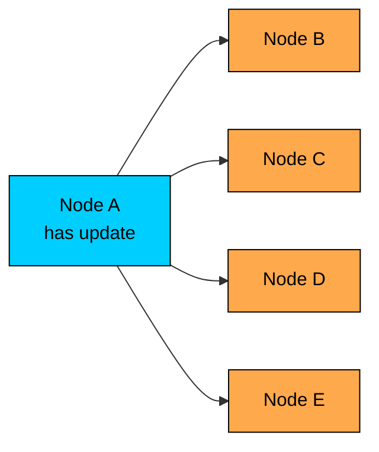
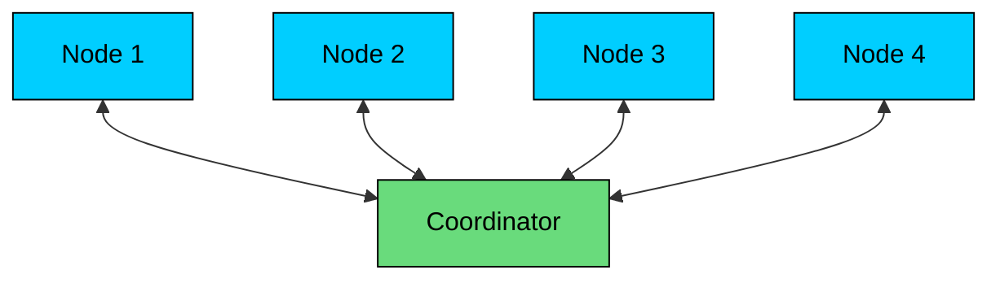
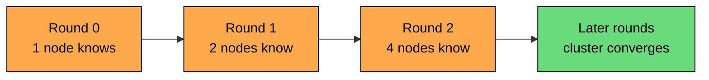
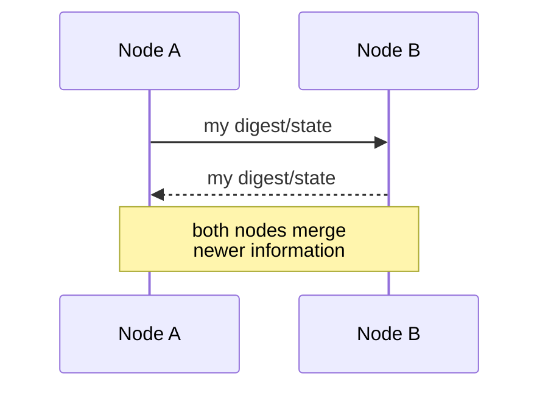
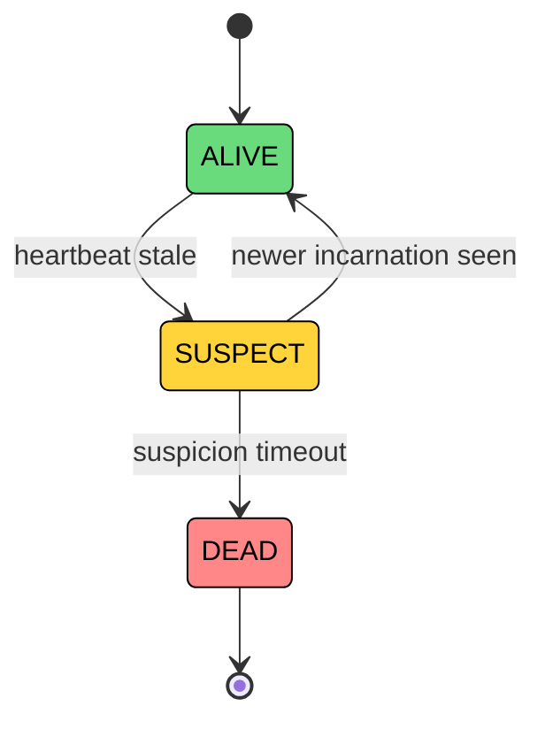
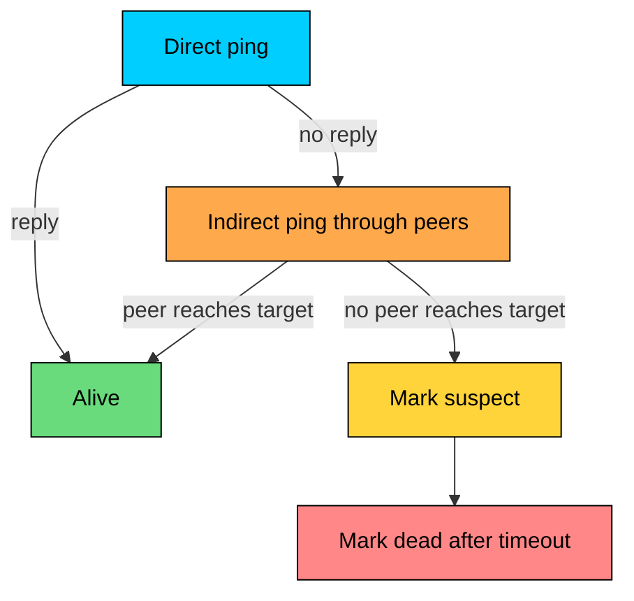
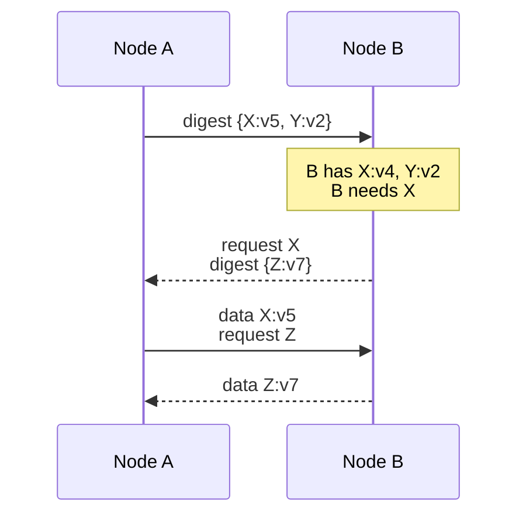

A gossip protocol spreads information through a cluster by having nodes periodically exchange state with a small number of peers.

Instead of one node broadcasting an update to every other node, each node shares what it knows with a few peers. Those peers do the same in later rounds. Information spreads through many paths, so the system can tolerate dropped messages, failed nodes, and partial network problems.

Gossip is useful for data that can be eventually consistent:

- cluster membership
- failure detection
- service metadata
- node load and health
- schema or configuration versions
- anti-entropy repair hints

Gossip complements consensus. Gossip tells nodes about state over time. Consensus makes a group agree on one decision before moving forward.

---

# Why Gossip Exists

> [!PAYWALL] This content is for premium members only.

Large clusters need to distribute small pieces of state.

If one node joins, fails, changes load, or receives new metadata, other nodes need to learn that fact. The direct approaches have problems.

## Broadcast

Broadcast sends each update to every node.

This is simple, but the sender becomes a bottleneck. If the sender fails halfway through, some nodes receive the update and others do not. Every update also costs work proportional to the cluster size.

## Central Coordinator

A coordinator can store cluster state and answer queries.

This centralizes state, but the coordinator must now be made highly available and scalable. At that point, the coordinator often becomes a distributed system of its own.

Gossip takes the opposite approach. Every node participates. No single node is responsible for telling everyone else.

---

# How Gossip Works

Each node runs a loop.

Two parameters control the behavior. The **interval** is how often a node gossips: shorter intervals converge faster but send more traffic. The **fanout** is how many peers it contacts per round: higher fanout converges faster but uses more bandwidth.

The power comes from repeated random spreading. A node does not need to know the whole communication plan. It only needs a membership list and a way to choose peers.

Random peer selection creates redundancy. Some messages repeat information the peer already has, but the redundancy is what lets gossip route around failures without a central plan.

---

# Push, Pull, and Push-Pull

Gossip exchanges usually follow one of three patterns.

### Push Gossip

In push gossip, a node with new information sends it to peers.

Push works well early because each message is likely to reach a peer that has not seen the update. Later, many pushes reach peers that already have the update.

### Pull Gossip

In pull gossip, a node asks peers for anything newer than its local state.

Pull can be slower when very few nodes know about an update, but it is useful for catching up stale nodes and reducing unsolicited traffic.

### Push-Pull Gossip

Push-pull exchanges state in both directions.

Push-pull is common in production because each exchange helps both sides converge. It also works well with digest-based protocols that first compare versions and then transfer only missing data.

---

# What Gossip Carries

Gossip is a transport pattern. The payload depends on the system.

### Membership

A membership table tracks nodes and their current state.

| Node | Address | Status | Version | Last Seen |
|------|---------|--------|---------|-----------|
| A | 10.0.1.1 | ALIVE | 1042 | now |
| B | 10.0.1.2 | ALIVE | 1038 | 2s ago |
| C | 10.0.1.3 | SUSPECT | 900 | 30s ago |
| D | 10.0.1.4 | DEAD | 812 | 5m ago |

When two nodes gossip, they merge entries by keeping the newer version. Version can be a heartbeat counter, incarnation number, generation number, logical timestamp, or system-specific revision.

The important rule is monotonicity: newer state must dominate older state. Stale gossip should not overwrite fresh information.

### Heartbeats

Each node periodically increments its own heartbeat or version. Other nodes learn that value through gossip.

If a node's heartbeat stops changing for long enough, peers mark it as suspicious. If it remains stale past another threshold, peers mark it dead.

Heartbeats do not prove correctness. They only show that a node was recently able to participate in the gossip protocol.

### Application Metadata

Gossip can also carry application metadata: service registrations, data ownership ranges, schema versions, rack and datacenter labels, load and health signals, and feature or protocol versions.

This metadata is eventually consistent. It is useful for routing and discovery, but it should not be used as the only source of truth for operations that require linearizability.

---

# Failure Detection

Gossip-based failure detection distributes observations instead of relying on one monitor.

Basic heartbeat failure detection works like this:

1. Each node increments and gossips its heartbeat.
2. Peers remember the latest heartbeat seen for each node.
3. If a heartbeat does not advance for a timeout period, the node becomes `SUSPECT`.
4. If no refutation arrives before the timeout, the node becomes `DEAD`.

The `SUSPECT` state prevents fast false positives. A slow node or temporarily partitioned node gets time to refute suspicion by publishing a newer incarnation.

### SWIM

SWIM separates failure detection from dissemination.

In each protocol period, a node probes one target:

1. Send a direct ping to the target.
2. If it responds, the target is alive.
3. If it does not respond, ask a few other nodes to ping the target.
4. If indirect probes also fail, mark the target suspect.
5. Gossip the suspicion.

Indirect probing reduces false positives. If node A cannot reach node D, nodes B and C might still reach D. That suggests a path problem rather than a dead process.

Consul's gossip layer is based on Serf, which uses a SWIM-style membership protocol with production hardening.

---

# Anti-Entropy

Regular gossip spreads recent updates. Anti-entropy repairs missed or divergent state.

A node may be offline during several updates. When it returns, normal gossip may eventually catch it up, but full repair can be faster with comparison structures.

A few techniques recur. **Digest exchange** compares compact version summaries before transferring full data. **Delta gossip** sends only the changes since the last successful exchange with a peer. **Merkle trees** compare hashes over key ranges to locate divergent data without scanning every key. **Tombstones** preserve deletes long enough for other replicas to learn them before the entry is fully removed.

Digest-first exchange avoids sending full state on every round.

Merkle trees are useful when replicas store large key ranges. Instead of comparing every key, replicas compare hashes for ranges. If a hash differs, they descend into smaller ranges until they find the keys that differ.

---

# Consistency Model

Gossip provides eventual consistency.

If updates stop and enough nodes remain connected, nodes converge toward the same view. During propagation, different nodes can legitimately have different views.

This is acceptable for:

- membership
- health and load signals
- routing hints
- service discovery metadata
- background repair

It is unsafe as the only mechanism for:

- distributed locks
- financial transactions
- primary election for replicated writes
- any operation requiring linearizable reads or writes

Systems often combine gossip with consensus:

| Need | Better Fit |
|------|------------|
| Spread membership and health | Gossip |
| Choose one leader safely | Consensus or a coordination service |
| Share load metrics | Gossip |
| Commit a write in one global order | Consensus |
| Repair replica divergence in the background | Anti-entropy |

This split is common in production systems. Gossip handles broad awareness. Consensus handles decisions that must be agreed before they take effect.

---

# Implementation Choices

### Peer Selection

Uniform random peer selection is the usual starting point. It is simple, decentralized, and resilient to failures.

Other strategies can help in specific environments:

| Strategy | Use Case | Risk |
|----------|----------|------|
| **Uniform random** | General-purpose clusters | Some redundant exchanges |
| **Weighted random** | Prefer peers not contacted recently | More bookkeeping |
| **Topology aware** | Reduce cross-zone or cross-region traffic | Slower global propagation |
| **Partial view** | Very large clusters | Requires maintaining connected peer views |

Topology-aware gossip is useful when cross-region bandwidth is expensive. Nodes can gossip frequently inside a region and less frequently across regions.

### Message Size

Gossip messages should stay small.

The common controls are to send digests before full state, cap the number of updates per message, batch small updates together, compress large payloads, and expire old tombstones on a clear schedule. Above all, do not use gossip to ship large application payloads in the first place. It is best suited to metadata and repair signals.

### Versioning

Gossip needs a deterministic merge rule. Common version types include a generation plus version counter, an incarnation number, a Lamport timestamp, a vector clock, a hybrid logical clock, or an application-specific revision.

Wall-clock timestamps are risky when clocks drift. Membership systems often use logical versions because they only need to order versions of a node's own state.

---

# Production Examples

### Cassandra

Cassandra uses gossip for cluster membership, node state, token ownership, schema version information, and failure detection. Nodes exchange compact state summaries and request missing details.

Cassandra also uses a phi accrual failure detector, which turns heartbeat timing into a suspicion score instead of relying on one fixed timeout.

### Consul and Serf

Consul uses Serf gossip for datacenter membership and failure detection. Consul has LAN gossip for nodes within a datacenter and WAN gossip for server-to-server communication across datacenters in federated deployments.

Serf is based on a SWIM-style protocol. It uses suspicion, indirect probes, and piggybacked membership updates to spread state efficiently.

### Redis Cluster

Redis Cluster nodes use gossip to exchange cluster topology, node flags, configuration epochs, and hash slot ownership. Redis Cluster still uses additional mechanisms for failover and slot migration; gossip is the cluster information layer, not the whole correctness story.

### Dynamo-Style Systems

The original Dynamo design used gossip-based membership and anti-entropy repair with Merkle trees. Many eventually consistent storage systems use the same pattern: gossip for who owns what, and anti-entropy to repair replica divergence over time.

---

# When to Use Gossip

Use gossip when the data can tolerate propagation delay and temporary disagreement. Membership discovery, failure suspicion, service metadata, health and load information, topology hints, and background repair all fit this profile well.

Gossip is a poor fit for transaction commit, lock ownership, primary election without quorum, authorization decisions that must be immediately consistent, or any user-visible write requiring linearizability.

The design question is whether stale information can cause correctness problems. If stale information only causes a slightly worse routing decision, gossip is often fine. If stale information can grant the same lock twice or lose money, use consensus or a strongly consistent coordinator.

---

# Summary

Gossip protocols spread information by repeated peer-to-peer state exchange.

The main ideas are:

- Each node periodically exchanges state with a few peers.
- Randomized spreading avoids a central bottleneck.
- Push, pull, and push-pull exchanges make different latency and bandwidth trade-offs.
- Membership gossip uses monotonic versions so newer state wins.
- Failure detection usually moves through `ALIVE`, `SUSPECT`, and `DEAD`.
- SWIM reduces false positives with indirect probes and suspicion periods.
- Anti-entropy repairs missed updates and replica divergence.
- Gossip is eventually consistent and probabilistic.
- Gossip works well for metadata, health, and repair signals.
- Consensus is still required for decisions that need immediate agreement.

Gossip is useful because it accepts a small amount of temporary disagreement in exchange for scale, decentralization, and resilience.

---

# Quiz
