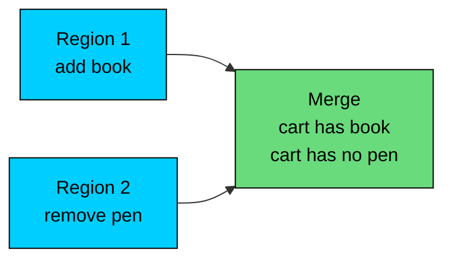
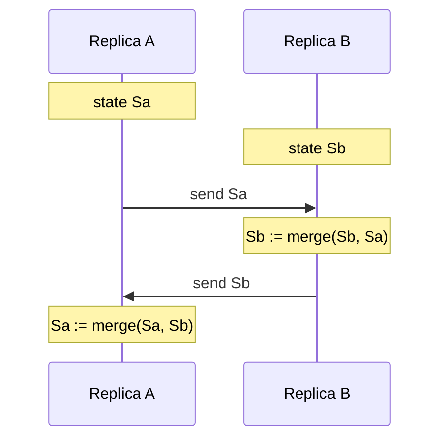
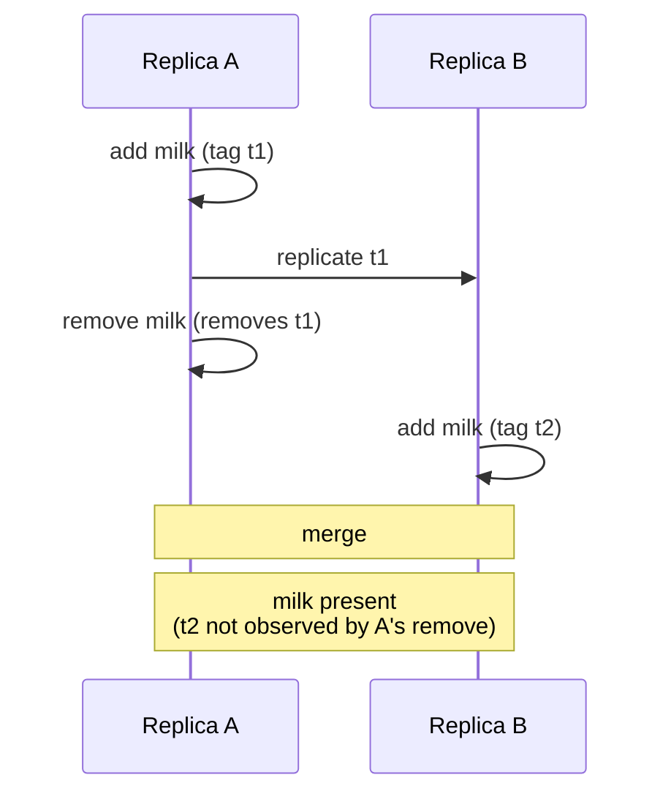

A Conflict-Free Replicated Data Type is a data structure designed to be replicated across many nodes, updated independently, and merged into the same final state without coordination.

Each replica accepts writes locally. When replicas exchange state, a merge function combines their copies into the same result regardless of the order or number of merges. There is no winner, no lost update, and no application-level conflict resolution.

CRDTs are useful for:

- multi-region databases that accept writes in every region
- offline-first applications that sync when reconnected
- collaborative editors with many concurrent authors
- shared carts, counters, and presence indicators
- replicated configuration or feature flag systems

CRDTs do not eliminate the cost of replication. They move that cost into the data type and the metadata that travels with the data.

---

# Why CRDTs Exist

> [!PAYWALL] This content is for premium members only.

Imagine a shopping cart replicated across two regions. A user adds an item from one region and removes another item from a phone that talked to a different region. Both replicas accept the update and continue to serve reads. Some time later, the replicas exchange state.

A naive replicated value would have to decide which of the two views is correct. Picking the latest by timestamp may drop one of the updates. Picking the larger value may make no sense for a cart. Picking by some other rule may give different answers depending on which replica merges first.

A CRDT defines the rule once, as part of the data type. The cart always converges to the same set of items regardless of the order in which the merges happen. The application does not need to write conflict resolution code for every field.

This idea generalizes. Counters, sets, registers, maps, and even ordered sequences can be designed so that concurrent updates always merge to the same final value.

---

# The Core Idea

A CRDT is built so that the merge operation has three properties: **commutativity** (`merge(a, b) = merge(b, a)`), **associativity** (`merge(merge(a, b), c) = merge(a, merge(b, c))`), and **idempotency** (`merge(a, a) = a`).

These three properties together let replicas exchange state in any order, any number of times, with any delays, and still converge to the same value. Messages can be duplicated, reordered, and replayed. The merge result is the same.

The formal foundation is a join-semilattice. Each CRDT defines a partial order on states and a least upper bound. The merge function returns the least upper bound of two states. Whatever path two replicas take, their states grow monotonically up the lattice until they meet.

"Conflict-free" describes this property: the data type defines the meeting point in advance, so the runtime does not need to resolve conflicts.

---

# State-Based vs Operation-Based

CRDTs come in two flavors. Both produce the same correctness properties but make different operational trade-offs.

### State-Based CRDTs

A state-based CRDT (CvRDT) replicates by sending the full state, or a delta of the state, between replicas. The receiver merges the incoming state with its local state.

State-based replication tolerates anything the transport throws at it. Messages can be lost, duplicated, reordered, or delivered through a different path on retry. The merge function absorbs all of that.

The trade-off is message size. Sending the whole state is expensive when the state is large. Delta-state CRDTs reduce this cost by sending only the parts that changed since the last successful exchange.

### Operation-Based CRDTs

An operation-based CRDT (CmRDT) replicates by sending each operation to other replicas. The receiver applies the operation locally.

For this to work, the operations themselves must commute. Two replicas that apply the same set of operations in any order must end up in the same state.

The transport must be more careful. Operations must be delivered to every replica exactly once. Some operation-based CRDTs also require causal delivery: an operation can only be applied after its causal predecessors.

| Aspect | State-Based | Operation-Based |
|--------|-------------|-----------------|
| **What is sent** | State or delta | Each operation |
| **Transport guarantees** | None required | Exactly-once and often causal delivery |
| **Message size** | Larger by default | Smaller |
| **Tolerance to network issues** | Very high | Depends on delivery semantics |
| **Common use** | Database internals, anti-entropy | Collaborative editors with a session protocol |

Both flavors are correct. Most production CRDT systems use a hybrid: operations are recorded in a log, the log is replicated as state through anti-entropy, and operations are also delivered with low latency through a separate channel.

---

# Counter CRDTs

A distributed counter is the simplest CRDT. It tracks a number that any replica can increment.

### G-Counter

A grow-only counter (G-Counter) is a vector of per-replica counts. Replica `i` only increments its own slot. The total value is the sum across all slots.

Merge takes the element-wise maximum:

The merge is commutative, associative, and idempotent. Two replicas always converge to the same total regardless of how many times they exchange state.

G-Counters only support increments. They cannot decrement because element-wise max would lose decrements.

### PN-Counter

A positive-negative counter (PN-Counter) supports both increments and decrements. It uses two G-Counters: one for positive contributions, one for negative.

Increments add to the local replica's slot in P. Decrements add to the local replica's slot in Q. Merge runs element-wise max on both P and Q separately.

PN-Counters are widely used for "likes," view counts, inventory counters, and other numeric values that can move in either direction without strict bounds.

PN-Counters do not enforce that the total stays non-negative. The data type cannot guarantee that an inventory counter remains positive without coordination, because two replicas can each independently decrement past zero.

---

# Set CRDTs

A distributed set tracks elements that can be added or removed. The challenge is removal, because a remove must work correctly when other replicas may have added the same element concurrently.

### G-Set

A grow-only set (G-Set) supports only add. Merge is the union of two sets. It is trivially a CRDT but cannot model removal.

### 2P-Set

A two-phase set (2P-Set) keeps two G-Sets: the elements that have been added and the elements that have been removed (tombstones).

Once an element is in R, it cannot return to A. The 2P-Set cannot represent "add the element again" because the tombstone wins. Many applications need to add, remove, and re-add the same element, so 2P-Set is rarely usable on its own.

### OR-Set

An observed-remove set (OR-Set) is the practical choice. Each add produces a unique identifier alongside the element. A remove only removes the identifiers it has already seen at the time of removal.

If a concurrent add produces tag "milk:t3" after the remove, that tag is not removed because it was not observed. The element stays in the set.

OR-Sets give "add wins" semantics on concurrent add/remove. This matches the intuition users tend to have about shared lists, carts, and tag editors.

The cost is metadata. Every element carries the identifiers of all unremoved adds. Cleanup of removed identifiers requires causal tracking so the system can prove no replica still references them.

---

# Register CRDTs

A register holds a single value. Concurrent writes must converge to a defined result.

### LWW-Register

A last-write-wins register attaches a timestamp to every write. Merge keeps the value with the higher timestamp.

LWW-Register is simple and common. It is also lossy: on concurrent writes, the loser is discarded with no signal to the application. The reader sees one of the writes, not both.

LWW-Register also depends on the timestamp source. Wall-clock timestamps are problematic across machines because of clock skew. Logical timestamps such as Lamport clocks or hybrid logical clocks are safer.

### MV-Register

A multi-value register keeps all concurrent values. The application reads multiple values when a conflict has not yet been resolved and must decide what to do.

Riak's "siblings," Amazon's original Dynamo design (which used vector clocks to surface concurrent versions), and many shopping-cart designs follow this pattern. The application sees both values and merges them according to its own logic.

MV-Registers and OR-Sets often work together. A cart is an OR-Set of items, and each item's quantity might be an MV-Register that the application reconciles by summing or taking the maximum.

---

# Sequence and Text CRDTs

Ordered sequences are harder than sets because positions are relative. Inserting "B" between "A" and "C" is straightforward locally, but a concurrent insert from another replica must end up in the same place after merge on every replica.

The general idea is to give every element a position identifier that is dense and totally ordered. Two positions can always be compared. There is always a new position available between any two existing positions.

Several approaches exist:

| Approach | Idea |
|----------|------|
| **RGA** | Each character has an identifier referencing its predecessor; tombstones mark deletions |
| **Treedoc** | Positions form a binary tree; new inserts pick a position in the tree |
| **Logoot** | Each element has a path of integers that can always be subdivided |
| **LSEQ** | Positions are variable-length strings designed to balance the tree shape |
| **Yjs YATA** | Doubly linked list of items with conflict resolution by origin and replica id |

All of these designs share the property that any two concurrent inserts converge to the same order on every replica. Deletions are usually marked with tombstones to preserve the position structure.

Sequence CRDTs power real-time collaborative editors. Yjs, Automerge, and Logoot-based systems are the building blocks for products like Notion-style editors, Linear's syncing, and many collaborative document tools.

The cost is metadata size. Every character has a position identifier and possibly a tombstone. Long documents with heavy editing accumulate metadata that needs background compaction.

---

# Causal Context

Most non-trivial CRDTs need to know what each replica has already seen. Causal context is the metadata that captures that history.

The classic representation is a version vector: one counter per replica. A replica increments its own counter on every local event. When it sends state, it includes the vector. A receiver can tell whether an incoming update is older, newer, or concurrent with what it has.

Version vectors grow with the number of replicas. In a system with many short-lived clients, they grow unbounded. Dotted version vectors and dot stores solve this by tracking the most recent "dots" rather than every replica's full history.

Causal context lets OR-Sets clean up tombstones safely. It lets sequences resolve concurrent inserts. It distinguishes a real concurrent write from a delayed copy of an old write. Without causal context, CRDTs can still converge, but they cannot tell why two states differ, and they often have to keep more metadata than necessary.

---

# Trade-offs and Limits

CRDTs are not free.

### Metadata Cost

Every concurrent-friendly operation needs metadata. An OR-Set element carries identifiers. A counter carries per-replica slots. A sequence carries position identifiers. The metadata can be larger than the user-visible data, especially after many edits.

Production systems use background compaction, version vector pruning, tombstone garbage collection, or hybrid logical clocks to keep metadata in bounds. None of these are free, and getting them wrong can break convergence.

### Semantic Limits

CRDTs converge to a defined value. They do not always converge to the value the user expects.

A PN-Counter can go negative even if business rules say it should not. An OR-Set cannot enforce uniqueness across replicas in real time. An LWW-Register discards concurrent writes without telling the application. A sequence CRDT can produce a merge order that no human would have written.

CRDTs work well when the merge semantics match the application's intent. When they do not match, the application must choose between coordination (give up some availability) or richer types that encode the application's rules.

### Invariants

A CRDT cannot enforce invariants that depend on global state. Examples include:

- a bank balance that must never go negative
- a unique username across all users
- an inventory counter that must not exceed stock on hand
- a seating chart that must avoid double-booking

These need coordination at write time. Consensus, a single writer, or compensating transactions handle this kind of invariant. A CRDT can still be part of the system, but it cannot enforce the invariant on its own.

| When CRDTs Fit | When They Do Not |
|----------------|------------------|
| Many writers, low conflict, easy merge rules | Strong invariants like uniqueness or balance limits |
| Offline-first apps and intermittent connectivity | Operations that must observe the latest state to be correct |
| Collaborative editing where intent is "merge everything" | Inventory and money flows with hard caps |
| Multi-region writes where coordination latency is too high | Workflows that must serialize across all replicas |

---

# Production Examples

### Riak

Riak was one of the first commercial databases to expose CRDTs as a first-class feature. Riak DT offered counters, sets, maps, and registers, and applied the merge rule for each type on every read or replication exchange.

### Redis Enterprise CRDB

Redis Enterprise offers active-active replication across regions using CRDT-backed data types. The same Redis data types behave as CRDTs underneath, with merge rules that match the type.

### Automerge and Yjs

Automerge and Yjs are libraries for building collaborative applications. They expose JSON-like documents and ordered sequences with CRDT semantics. Yjs in particular powers real-time editing in many web applications.

### Akka Distributed Data

Akka Distributed Data is a CRDT library for Akka clusters. It provides counters, sets, maps, and registers for in-memory replicated state across nodes.

### AntidoteDB

AntidoteDB is a research and production database built around CRDTs and transactional causal consistency. It targets geo-distributed deployments where coordination across regions is expensive.

### Soundcloud Roshi

Roshi was Soundcloud's CRDT-based service for time-series sets, used for streams of activity. It is an example of a domain-specific CRDT system tuned for one workload rather than a general database.

---

# When to Use CRDTs

CRDTs fit best when several conditions hold together:

- writes happen on many replicas, often without coordination
- the merge rule for concurrent updates is well defined
- the application can tolerate the CRDT's specific semantics
- the metadata cost is acceptable for the data volume
- the system has a working anti-entropy or replication channel

CRDTs are a poor fit when the application needs hard invariants, when a single writer would be simpler, or when the cost of metadata outweighs the benefit of multi-master writes.

A common production pattern is to use CRDTs for the parts of the system that benefit from them (cart contents, presence, counts, document state) and stronger coordination for the parts that need invariants (payments, identity, inventory caps). The two layers communicate through queues, idempotent handlers, and occasional consensus.

---

# Summary

CRDTs are data types whose merge function is commutative, associative, and idempotent.

The main ideas are:

- Replicas accept writes independently and converge through merging.
- The merge function is part of the type, so the system does not write conflict-resolution code per field.
- State-based CRDTs send state and tolerate anything the transport does.
- Operation-based CRDTs send operations and need exactly-once and often causal delivery.
- Counters, sets, registers, and sequences are the common building blocks.
- OR-Set is usually the right set type because it allows re-adding after remove.
- LWW-Register is simple but lossy on concurrent writes.
- Sequence CRDTs power collaborative editors.
- Causal context, often as version vectors or dotted version vectors, lets CRDTs prune metadata safely.
- CRDTs cannot enforce global invariants. They converge to a defined value, not necessarily the value the application would prefer.

CRDTs solve the merge problem at the data-type level. They trade extra metadata and specific semantics for the ability to write everywhere and converge later without coordination.

---

# Quiz
