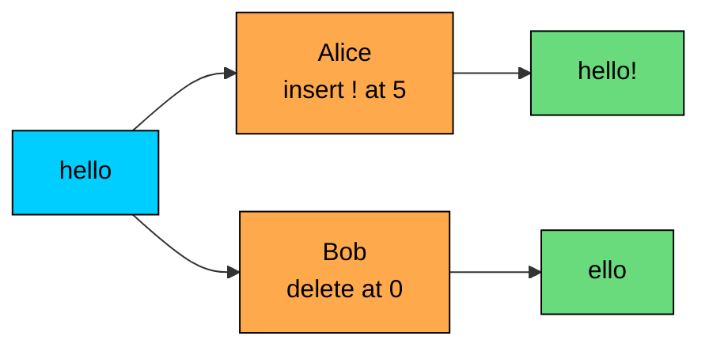
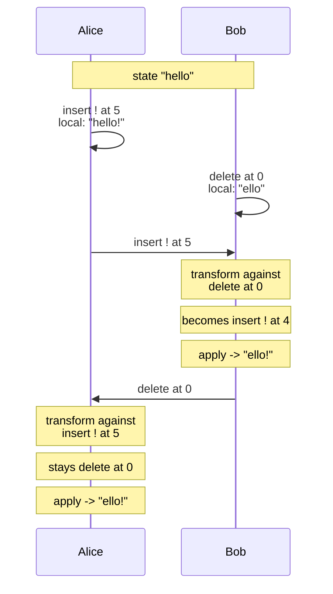
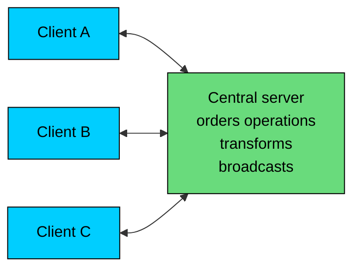

Operational Transformation (OT) lets multiple users edit the same document at the same time and end up with the same final state, with no locks and no waiting between users.

When an edit from one user arrives at another's replica, the system rewrites the incoming operation to account for what has happened locally since it was issued. Both replicas apply different sequences of operations and still converge.

OT is used for:

- real-time collaborative document editing
- multi-cursor code editors
- shared whiteboards and design tools
- collaborative spreadsheets
- any application where many clients send small, frequent edits to shared state

OT came out of groupware research in the late 1980s and is still the basis of Google Docs, Etherpad, ShareDB, and many enterprise editors.

---

# Why Operational Transformation Exists

> [!PAYWALL] This content is for premium members only.

Consider two users editing the same line of text at the same time.

The starting text is `"hello"`. Alice inserts `"!"` at position 5. Bob deletes the character at position 0. Both operations leave the user's machine immediately, because anything else would make the editor feel sluggish.

When Alice's edit arrives at Bob's editor, the text has already changed. Applying her operation at position 5 would now overflow the end of the string. Applying it without adjustment would produce a different result on Bob's side than on Alice's side. The two replicas would diverge.

The naive answers all have problems. Locking the document during edits would block one user while the other typed. Sending the full document on every keystroke would not scale. Picking a winner with a timestamp would drop edits. Asking users to merge manually would be unusable.

OT takes a different approach. The system rewrites each incoming operation to account for what has happened locally since the operation was issued. Alice's "insert at 5" becomes "insert at 4" by the time it is applied on Bob's machine, because Bob has already deleted one character. The transformed operation produces the intended effect, and both replicas end up with the same final text.

---

# The Core Idea

OT defines a transformation function. Given two concurrent operations `Oa` and `Ob` issued against the same base state, the function produces two transformed operations `Oa'` and `Ob'` such that:

Whatever order the operations are applied, the resulting state is the same.

Each replica keeps its local edits and a record of operations from peers. When a remote operation arrives, the replica looks at the operations it has applied since the remote operation's base state and transforms the remote operation against each of them in order. The transformed operation is then applied locally.

Both editors end up with `"ello!"`. Neither user had to wait, and the protocol handled the position adjustment between them.

The transformation rules depend on the operation types. Inserts shift positions of later inserts and deletes. Deletes shrink positions of later operations. Combinations of inserts, deletes, and retains in real editors lead to many transformation cases that must be defined and tested.

---

# Transformation Properties

OT systems are built around two convergence properties. The names are historical, and they appear in almost every OT paper.

### TP1

TP1 (Transformation Property 1) says that the transformation function must produce the same final state regardless of the order in which two concurrent operations are applied.

TP1 is the property the earlier example illustrated. It is the minimum a transformation function needs to make two replicas converge after they exchange operations.

TP1 alone is enough for a centralized OT system. If every operation flows through a central server that imposes a total order, the server can rewrite each operation against everything it has seen since the operation's base state. Clients receive operations in the server's order and only need TP1 to apply them safely.

### TP2

TP2 (Transformation Property 2) is the harder condition. It applies when operations can be transformed against other transformed operations, which happens in fully peer-to-peer designs.

TP2 says that transforming `Oc` against `Oa` and then against `Ob` must give the same result as transforming `Oc` against `Ob` and then against `Oa`, even after `Ob` and `Oa` have themselves been transformed.

TP2 is hard to satisfy. Several early OT papers proposed transformation functions that turned out to violate TP2 under specific orderings, and later papers published counter-examples to systems that had been considered correct.

The practical answer for most production systems is to avoid relying on TP2. A central server or a star topology with strict ordering only needs TP1 to hold, because every client sees the same operation order. A fully peer-to-peer mesh needs both TP1 and TP2, since operations can be transformed against arbitrary chains of other transformed operations. Hybrid designs typically promote concurrent edits into a central order, which lets them rely on TP1 alone.

Modern systems sidestep TP2 either by using a central server or by switching to a different model entirely, such as a CRDT.

---

# Central-Server OT

The central-server model is the dominant design in production. It is sometimes called the Jupiter model, after the system that introduced it.

Each client maintains a local document, a queue of unacknowledged operations sent to the server, and a base revision number that marks how far the client has caught up with the server's history.

The exchange follows a small protocol:

1. The client applies an operation locally and sends it to the server with the base revision it was issued against.
2. The server transforms the operation against any operations applied since that base revision.
3. The server applies the transformed operation, increments the revision, and broadcasts it to all clients.
4. Each client transforms the broadcast operation against its own unacknowledged operations and applies it locally.

The server's job is bookkeeping plus transformation. It also serializes conflicting edits into a single global order, which is what gives OT its consistency guarantee. Every client ends up applying the same sequence of transformed operations.

This model has practical advantages:

- the server can persist operations for history and undo
- ordering is unambiguous
- new clients can fetch a snapshot plus the recent operations
- only TP1 needs to hold
- the protocol is small and easy to debug

It also has practical limits. The server is on the critical path for every edit. Offline editing is harder. Cross-region servers must coordinate or accept a single primary region.

---

# Peer-to-Peer OT

Fully peer-to-peer OT systems exist in research and in some specialized tools. Each replica sends its operations directly to every other replica, and operations are transformed against arbitrary chains of other transformed operations.

This model requires TP2 to hold for the chosen operation set. Several research systems define operation sets and transformation functions that satisfy TP2, but real text editors with rich formatting, attributes, and structured content have struggled to find a TP2-correct transformation set.

The historical pattern is that production OT systems use a central server. Peer-to-peer behavior, when needed, is increasingly delegated to CRDTs, which avoid the TP2 problem by construction at the cost of richer metadata.

---

# A Concrete Example

Two clients are editing the document `"abcdef"`.

Client 1 issues:

Client 2 concurrently issues:

Both operations are sent to the server. The server already has client 2's operation in its history.

When client 1's `O1` arrives, the server transforms it against `O2`:

The server applies the transformed operation and broadcasts it:

When client 1 receives the broadcast for `O2`, it transforms `O2` against any local operations it has issued since the base revision. In this case `O1` was the only one. The transformation of a delete-before-an-insert is straightforward:

Client 1 applies the transformed delete and ends up with `"bXcdef"`, the same as the server and client 2.

The transformation rules look small in this example. A complete editor needs rules for every pair of operation types, including operations on the same position, overlapping deletes, and structured operations that span multiple fields. Production OT libraries usually express documents as a sequence of retain, insert, and delete operations and define transformation against that small vocabulary.

---

# Rich Editing

Plain text is the easiest case. Real editors handle attributes (bold, italic), embedded objects (images, tables), and structured documents (lists, headings, sections).

Most production systems use a fixed operation vocabulary that includes:

| Operation | Meaning |
|-----------|---------|
| **retain(n)** | Move the cursor forward by `n` units |
| **retain(n, attributes)** | Move forward and apply attribute changes |
| **insert(text)** | Insert text at the current position |
| **insert(text, attributes)** | Insert with attributes |
| **delete(n)** | Delete `n` units starting at the current position |

The Quill library's Delta format and ShareDB's JSON OT use shapes very close to this. Operations become lists of retains, inserts, and deletes, and the transformation function works on the list level.

Structured documents add complexity because two concurrent edits can affect the same logical region in different ways. An insert inside a paragraph that another user has deleted needs a defined transformation result. Most systems treat the deleted region as gone and rebase the insert to a nearby position, but the choice is application-dependent and must be reflected in the transformation rules.

Spreadsheets push this further. Inserting a row shifts every later row's coordinates. A formula that references those rows must be updated. The OT system has to model not just text but cells, ranges, and references.

---

# OT vs CRDT

OT and CRDTs solve overlapping problems with different mechanics. The trade-offs are concrete enough to drive product decisions.

| Aspect | OT | CRDT |
|--------|-----|------|
| **Operation form** | Original ops; rewritten by transform | Designed so concurrent ops commute |
| **Metadata** | Small per operation | Larger; identifiers, version vectors, tombstones |
| **Topology** | Often central server | Peer-to-peer or central |
| **Convergence proof** | Transformation function correctness | Algebraic properties of the type |
| **Edge cases** | Many pairs of op types; TP2 is hard | Type design encodes correctness |
| **Common use** | Text and rich-text editors | Real-time editors, offline-first apps, multi-master databases |
| **Notable systems** | Google Docs, Etherpad, ShareDB | Yjs, Automerge, Riak, Redis CRDB |

OT keeps operations small and the underlying document close to a plain representation. The complexity sits in the transformation function and the server protocol. CRDTs invert this: the data structure carries enough metadata to make merging algebraic, and the application can run peer-to-peer without the bookkeeping a central OT server provides.

For pure text editing with a central server, both models work. OT has more historical tooling, especially for rich text. CRDTs are gaining ground because peer-to-peer and offline-first are easier and TP2-style complexity goes away.

There is no rule that says one is universally better. Several products have rewritten from OT to CRDT (Atom's collaborative tools, several editor libraries) and others continue to use OT successfully at large scale (Google Docs, Microsoft 365 Office Online, Etherpad).

---

# Production Examples

### Google Docs

Google Docs uses an OT-based system. Edits flow through a central server that imposes a total order and transforms operations against the server's history. The client maintains a local optimistic state and reconciles with the server's order as acknowledgments and broadcasts arrive.

### Etherpad and Easysync

Etherpad uses an OT model called Easysync. It defines a compact representation of changes called "changesets" and a transformation function over them. Etherpad's design is one of the most accessible references for OT internals because the codebase is open and well documented.

### ShareJS and ShareDB

ShareJS, later evolved into ShareDB, is a JavaScript OT library that supports plain text and JSON documents. It is widely used in collaborative tools that need a small, embeddable OT engine on Node.js.

### Microsoft 365 Office Online

Microsoft's collaborative editors in Word, Excel, and PowerPoint Online use OT-based coauthoring. Excel in particular benefits from OT because the operation vocabulary maps naturally to cell-level changes.

### Zoho Writer

Zoho's collaborative document editor is another example of an OT-based real-time editing system, used by many enterprise teams.

---

# Common Pitfalls

| Pitfall | Consequence |
|---------|-------------|
| Defining transformations only for the common cases | Diverging states on rare operation pairs |
| Mixing operation vocabularies without a clear schema | Transformation rules become ambiguous |
| Trying to support full peer-to-peer without TP2 | Eventual divergence under specific orderings |
| Sending raw text positions across clients with different views | Wrong transformation outcomes |
| Not persisting operations on the server | Cannot replay edits for new clients or audit |
| Skipping acknowledgments | Clients cannot prune their unacknowledged queue |
| Relying on wall-clock time for ordering | Inconsistent transformation order across regions |

Most OT problems trace back to either an incomplete operation vocabulary or an unclear topology. A small, well-defined vocabulary paired with a central server is much easier to operate than a sprawling vocabulary with peer-to-peer messaging.

---

# When to Use OT

OT fits well when:

- the workload is real-time collaborative editing
- the operation set is small and stable
- a central server is acceptable for ordering
- rich text or structured documents need fine-grained operations
- the system can guarantee in-order delivery between client and server
- the team has expertise in defining and testing transformation rules

OT is less suitable when:

- the application must support fully offline editing for long periods
- the system needs peer-to-peer synchronization without a coordinator
- the operation set keeps growing as features are added
- the team prefers correctness-by-construction over correctness-by-careful-rules

Many newer applications start with a CRDT-based approach for these reasons. OT remains a good choice when the operation model is mature, a central-server topology is acceptable, and the rich-text or domain-specific transformation logic has already been written and tested.

---

# Summary

Operational Transformation lets many clients edit shared state concurrently by rewriting operations as they flow between replicas.

The main ideas are:

- Each operation is issued against a known base state.
- A transformation function rewrites operations so different application orders produce the same result.
- TP1 is the minimum property for a centralized OT system.
- TP2 is harder and is usually avoided by using a central server.
- The central-server model is the dominant production design.
- Operations are typically expressed as retain, insert, and delete sequences.
- Rich text, structured documents, and spreadsheets need larger operation vocabularies and careful transformation rules.
- OT and CRDTs solve overlapping problems; CRDTs trade larger metadata for easier peer-to-peer behavior.
- Many real systems use OT successfully, including Google Docs, Etherpad, ShareDB, and Microsoft 365 Office Online.

OT moves the cost of concurrent editing into the transformation function and the server protocol. The document representation stays close to plain text, the user sees immediate feedback, and the system reconciles the order of edits as messages arrive.

---

# Quiz
