**Two-Phase Commit (2PC)** is the classic protocol for atomic commit across multiple transactional resources. It answers one narrow question: can several participants agree to commit or abort the same transaction"

The idea is direct. A coordinator asks every participant whether it can commit. If everyone says yes, the coordinator tells them all to commit. If anyone says no or fails to respond, the coordinator tells everyone to abort.

2PC is the foundation that many distributed databases and transaction managers build on. It works best when participants are transactional resources with durable logs, short lock times, and a trusted coordinator. Across slow services, external APIs, and long-running business workflows, it is usually a poor fit, and its weaknesses explain why those workflows often reach for compensation, idempotency, and reconciliation instead.

---

# The Core Idea

> [!PAYWALL] This content is for premium members only.

2PC splits commit into two phases:

1. **Prepare:** The coordinator asks each participant, "Can you commit this transaction""
2. **Decision:** The coordinator tells all participants the final outcome: commit or abort.

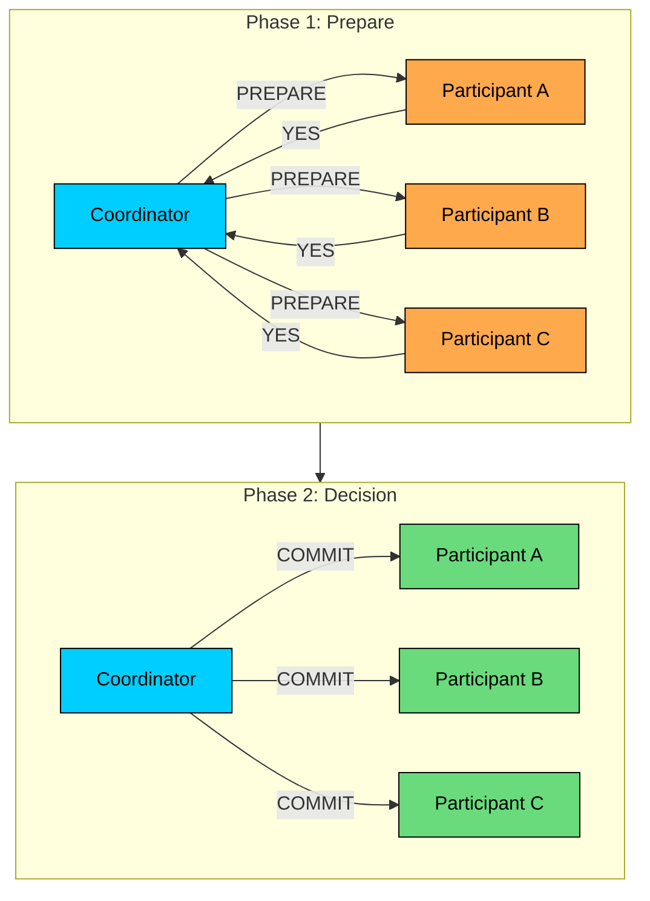
```mermaid
flowchart TB
    subgraph Phase1["Phase 1: Prepare"]
        C1[Coordinator]:::primary
        P1a[Participant A]:::orange
        P1b[Participant B]:::orange
        P1c[Participant C]:::orange

        C1 -->|PREPARE| P1a
        C1 -->|PREPARE| P1b
        C1 -->|PREPARE| P1c

        P1a -->|YES| C1
        P1b -->|YES| C1
        P1c -->|YES| C1
    end

    subgraph Phase2["Phase 2: Decision"]
        C2[Coordinator]:::primary
        P2a[Participant A]:::green
        P2b[Participant B]:::green
        P2c[Participant C]:::green

        C2 -->|COMMIT| P2a
        C2 -->|COMMIT| P2b
        C2 -->|COMMIT| P2c
    end

    Phase1 --> Phase2

    classDef primary fill:#00ceff,stroke:#000,color:#000
    classDef orange fill:#ffa94d,stroke:#000,color:#000
    classDef green fill:#69db7c,stroke:#000,color:#000
```

The important rule is this:

**After a participant votes yes, it must be able to commit later, even if it crashes and restarts.**

That means it has written enough state to durable storage and is holding whatever locks or resources are needed. It cannot decide on its own to abort after voting yes. It must wait for the coordinator's decision.

This waiting state is the heart of both 2PC's correctness and its biggest operational problem.

---

# Roles

### Coordinator

The coordinator drives the protocol. It:

- starts the distributed transaction
- sends `PREPARE` to all participants
- collects votes
- records the final decision durably
- sends `COMMIT` or `ABORT`
- retries messages until participants acknowledge or recovery takes over

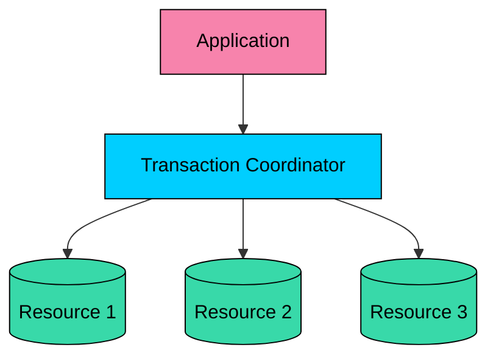
```mermaid
flowchart TB
    App[Application]:::rose --> TM[Transaction Coordinator]:::primary

    TM --> DB1[(Resource 1)]:::purple
    TM --> DB2[(Resource 2)]:::purple
    TM --> DB3[(Resource 3)]:::purple

    classDef rose fill:#f783ac,stroke:#000,color:#000
    classDef primary fill:#00ceff,stroke:#000,color:#000
    classDef purple fill:#38d9a9,stroke:#000,color:#000
```

### Participants

Participants are the transactional resources involved in the operation. They may be database shards, databases, message brokers, or other systems that support the 2PC protocol.

Each participant:

- performs its local work inside a transaction
- checks whether it can commit
- votes yes or no
- records its prepared state durably before voting yes
- waits for the coordinator's final decision
- commits or rolls back locally

### Transaction Logs

2PC depends on durable logs. Without them, the system cannot recover safely after crashes.

| Component | Must Record |
|-----------|-------------|
| **Coordinator** | Transaction ID, participants, votes, final decision |
| **Participant** | Transaction ID, local transaction state, prepared record, final outcome |

The coordinator must write the final decision before sending it. A participant must write its prepared record before voting yes. These ordering rules are what make crash recovery possible.

---

# Phase 1: Prepare

The coordinator asks every participant whether it can commit.

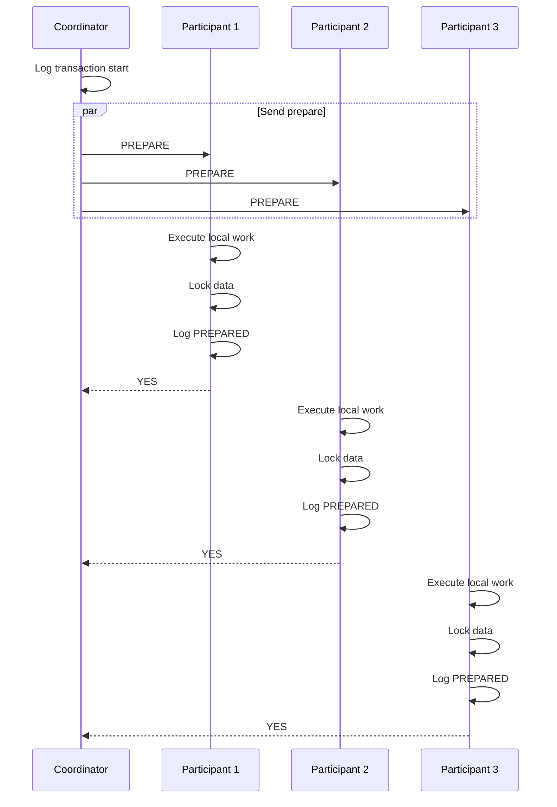
```mermaid
sequenceDiagram
    participant C as Coordinator
    participant P1 as Participant 1
    participant P2 as Participant 2
    participant P3 as Participant 3

    C->>C: Log transaction start

    par Send prepare
        C->>P1: PREPARE
        C->>P2: PREPARE
        C->>P3: PREPARE
    end

    P1->>P1: Execute local work
    P1->>P1: Lock data
    P1->>P1: Log PREPARED
    P1-->>C: YES

    P2->>P2: Execute local work
    P2->>P2: Lock data
    P2->>P2: Log PREPARED
    P2-->>C: YES

    P3->>P3: Execute local work
    P3->>P3: Lock data
    P3->>P3: Log PREPARED
    P3-->>C: YES
```

A participant votes **yes** only if it can later commit the transaction. It has checked constraints, acquired required locks, and written the prepared state to durable storage.

A participant votes **no** if it cannot safely commit. Common reasons include constraint violations, lock conflicts, validation failures, resource limits, or local errors.

If a participant does not respond before the coordinator's prepare timeout, the coordinator treats that as a no vote and aborts. This is safe only before the coordinator has decided to commit.

---

# Phase 2: Decision

After collecting votes, the coordinator makes one durable decision.

### Commit Path

If every participant voted yes, the coordinator logs `COMMIT` and tells everyone to commit.

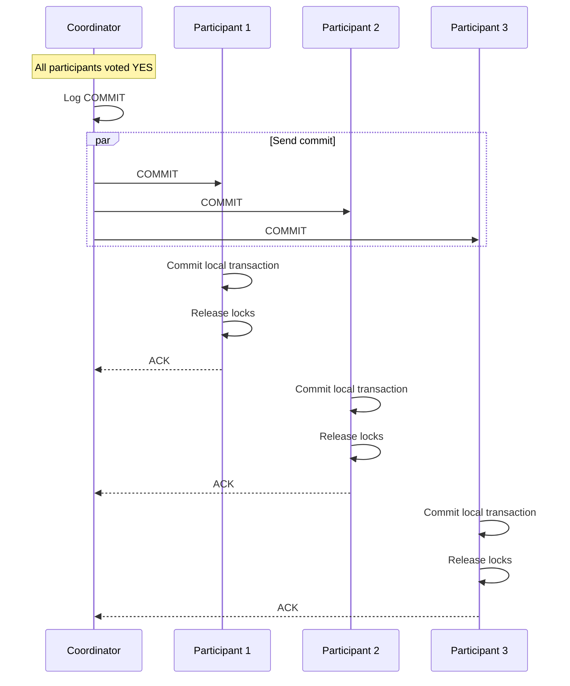
```mermaid
sequenceDiagram
    participant C as Coordinator
    participant P1 as Participant 1
    participant P2 as Participant 2
    participant P3 as Participant 3

    Note over C: All participants voted YES
    C->>C: Log COMMIT

    par Send commit
        C->>P1: COMMIT
        C->>P2: COMMIT
        C->>P3: COMMIT
    end

    P1->>P1: Commit local transaction
    P1->>P1: Release locks
    P1-->>C: ACK

    P2->>P2: Commit local transaction
    P2->>P2: Release locks
    P2-->>C: ACK

    P3->>P3: Commit local transaction
    P3->>P3: Release locks
    P3-->>C: ACK
```

Once the coordinator logs `COMMIT`, the transaction must eventually commit at every prepared participant. If messages are lost, the coordinator retries. If a participant crashes, it recovers from its log and asks for the decision.

### Abort Path

If any participant votes no, or fails to vote before the prepare timeout, the coordinator logs `ABORT` and tells everyone to abort.

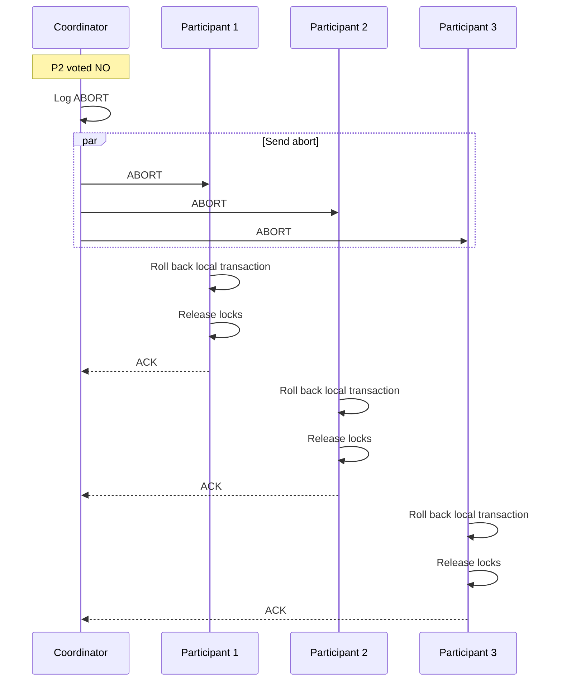
```mermaid
sequenceDiagram
    participant C as Coordinator
    participant P1 as Participant 1
    participant P2 as Participant 2
    participant P3 as Participant 3

    Note over C: P2 voted NO
    C->>C: Log ABORT

    par Send abort
        C->>P1: ABORT
        C->>P2: ABORT
        C->>P3: ABORT
    end

    P1->>P1: Roll back local transaction
    P1->>P1: Release locks
    P1-->>C: ACK

    P2->>P2: Roll back local transaction
    P2->>P2: Release locks
    P2-->>C: ACK

    P3->>P3: Roll back local transaction
    P3->>P3: Release locks
    P3-->>C: ACK
```

Participants that already voted yes must wait for this abort decision before releasing their prepared state. Participants that voted no can roll back locally.

---

# State Transitions

### Coordinator States

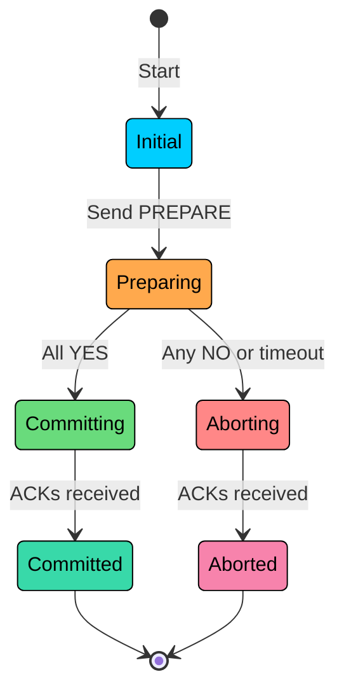
```mermaid
stateDiagram-v2
    [*] --> Initial: Start

    Initial --> Preparing: Send PREPARE
    Preparing --> Committing: All YES
    Preparing --> Aborting: Any NO or timeout

    Committing --> Committed: ACKs received
    Aborting --> Aborted: ACKs received

    Committed --> [*]
    Aborted --> [*]

    classDef initial fill:#00ceff,stroke:#000,color:#000
    classDef preparing fill:#ffa94d,stroke:#000,color:#000
    classDef committing fill:#69db7c,stroke:#000,color:#000
    classDef aborting fill:#ff8787,stroke:#000,color:#000
    classDef committed fill:#38d9a9,stroke:#000,color:#000
    classDef aborted fill:#f783ac,stroke:#000,color:#000

    class Initial initial
    class Preparing preparing
    class Committing committing
    class Aborting aborting
    class Committed committed
    class Aborted aborted
```

What happens at each state:

- **Initial**: The transaction has started, but no `PREPARE` messages have been sent.
- **Preparing**: `PREPARE` is out to every participant; the coordinator is collecting votes.
- **Committing**: Every participant voted yes. The coordinator has durably logged `COMMIT` and is delivering it.
- **Aborting**: A no vote arrived or a vote timed out before the prepare deadline. The coordinator has logged `ABORT` and is delivering it.
- **Committed** and **Aborted**: All participants have acknowledged the decision.

The critical move is **Preparing → Committing**. Once `COMMIT` is durably logged, the coordinator cannot change its mind. Even after a crash, recovery must finish delivering `COMMIT` to every prepared participant.

### Participant States

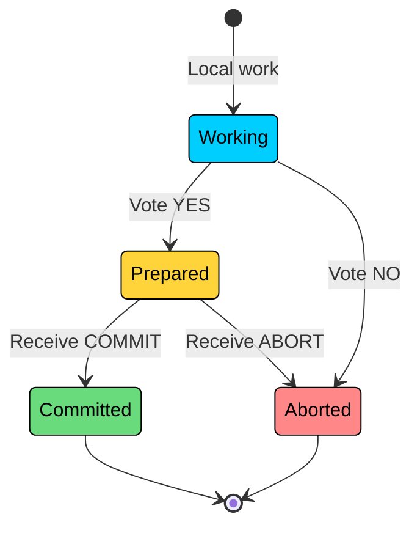
```mermaid
stateDiagram-v2
    [*] --> Working: Local work

    Working --> Prepared: Vote YES
    Working --> Aborted: Vote NO

    Prepared --> Committed: Receive COMMIT
    Prepared --> Aborted: Receive ABORT

    Committed --> [*]
    Aborted --> [*]

    classDef working fill:#00ceff,stroke:#000,color:#000
    classDef prepared fill:#ffd43b,stroke:#000,color:#000
    classDef committed fill:#69db7c,stroke:#000,color:#000
    classDef aborted fill:#ff8787,stroke:#000,color:#000

    class Working working
    class Prepared prepared
    class Committed committed
    class Aborted aborted
```

What happens at each state:

- **Working**: Executing the local transaction as instructed by the coordinator.
- **Prepared**: Voted yes. Local changes are durable but uncommitted, and any locks acquired during execution remain held while the participant waits for the decision.
- **Committed**: Received `COMMIT` after voting yes and applied the local transaction.
- **Aborted**: Either voted no and rolled back immediately, or received `ABORT` while in the Prepared state and rolled back.

The critical state is **Prepared**, also called **in doubt**. A participant here has promised to follow the coordinator's decision but has not received it yet. It cannot unilaterally commit or abort, so it must keep its local state and held locks until the outcome arrives. A participant that votes no never enters this state and can release resources immediately.

This waiting period is the heart of both 2PC's correctness and its biggest operational problem.

---

# Failure Handling

2PC is designed for crash recovery, not for arbitrary Byzantine behavior. It assumes participants and coordinators follow the protocol, logs are durable, and failed processes eventually recover or can be repaired.

### Participant Fails Before Voting

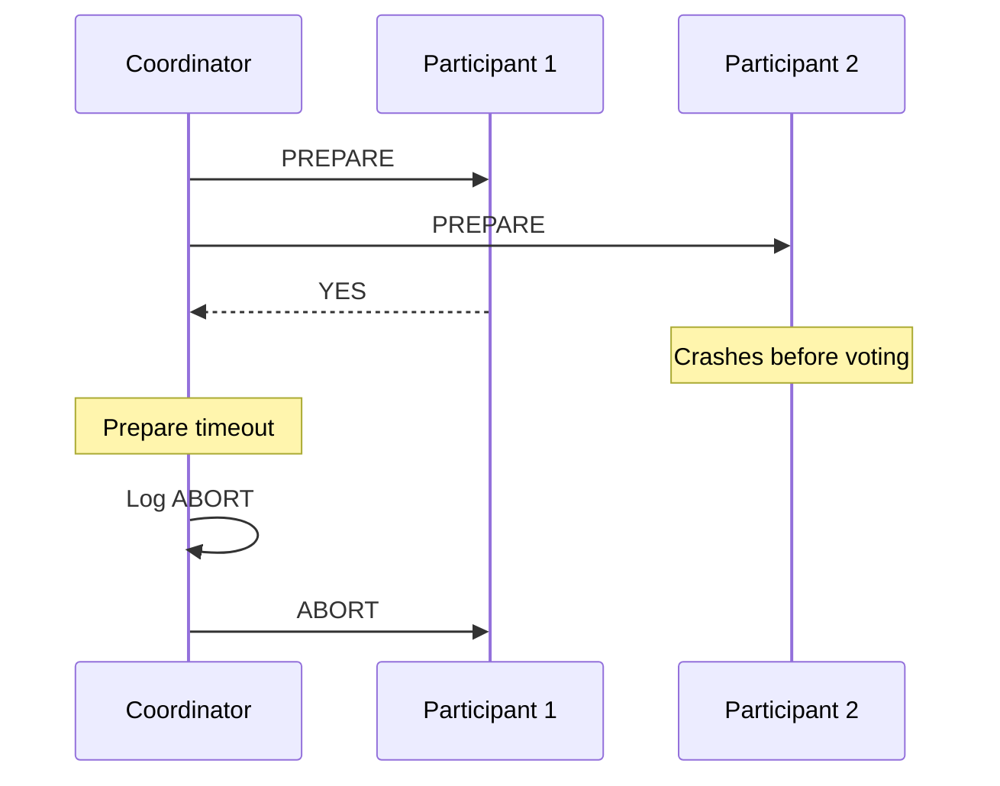
```mermaid
sequenceDiagram
    participant C as Coordinator
    participant P1 as Participant 1
    participant P2 as Participant 2

    C->>P1: PREPARE
    C->>P2: PREPARE

    P1-->>C: YES

    Note over P2: Crashes before voting
    Note over C: Prepare timeout

    C->>C: Log ABORT
    C->>P1: ABORT
```

The coordinator can abort because it has not made a commit decision. The participant that crashed before voting yes has not promised to commit.

### Participant Fails After Voting Yes

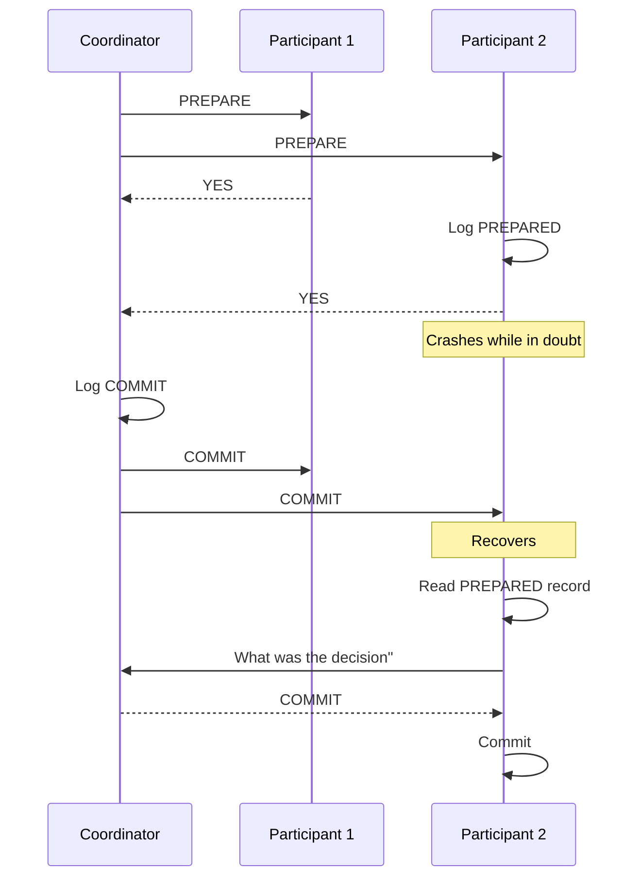
```mermaid
sequenceDiagram
    participant C as Coordinator
    participant P1 as Participant 1
    participant P2 as Participant 2

    C->>P1: PREPARE
    C->>P2: PREPARE

    P1-->>C: YES
    P2->>P2: Log PREPARED
    P2-->>C: YES

    Note over P2: Crashes while in doubt

    C->>C: Log COMMIT
    C->>P1: COMMIT
    C->>P2: COMMIT

    Note over P2: Recovers
    P2->>P2: Read PREPARED record
    P2->>C: What was the decision"
    C-->>P2: COMMIT
    P2->>P2: Commit
```

The participant's prepared record tells it that it cannot unilaterally abort. On recovery, it must learn the coordinator's decision and finish accordingly.

### Coordinator Fails Before Logging a Decision

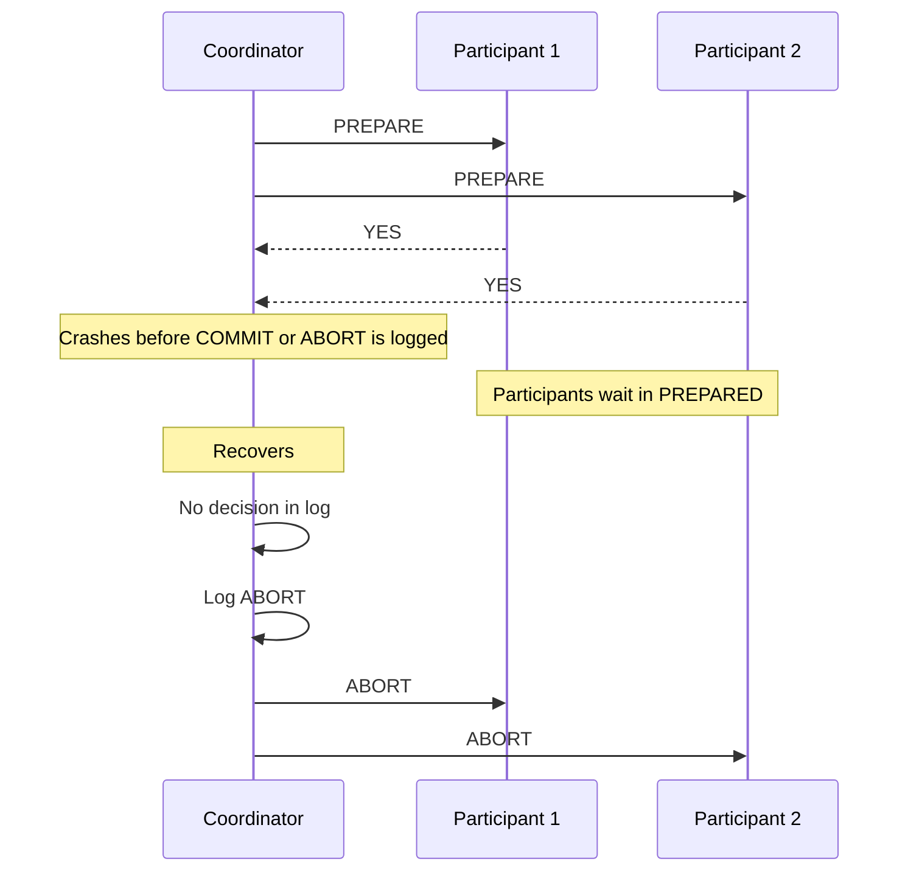
```mermaid
sequenceDiagram
    participant C as Coordinator
    participant P1 as Participant 1
    participant P2 as Participant 2

    C->>P1: PREPARE
    C->>P2: PREPARE

    P1-->>C: YES
    P2-->>C: YES

    Note over C: Crashes before COMMIT or ABORT is logged
    Note over P1,P2: Participants wait in PREPARED

    Note over C: Recovers
    C->>C: No decision in log
    C->>C: Log ABORT
    C->>P1: ABORT
    C->>P2: ABORT
```

With write-ahead logging, a coordinator must log `COMMIT` before sending `COMMIT`. If it recovers and finds no decision, it can safely abort.

### Coordinator Fails After Logging a Decision

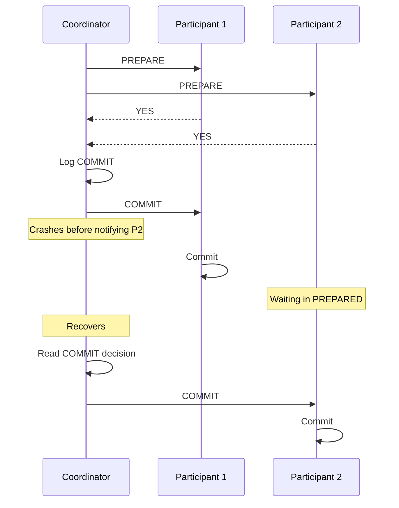
```mermaid
sequenceDiagram
    participant C as Coordinator
    participant P1 as Participant 1
    participant P2 as Participant 2

    C->>P1: PREPARE
    C->>P2: PREPARE
    P1-->>C: YES
    P2-->>C: YES

    C->>C: Log COMMIT
    C->>P1: COMMIT

    Note over C: Crashes before notifying P2

    P1->>P1: Commit
    Note over P2: Waiting in PREPARED

    Note over C: Recovers
    C->>C: Read COMMIT decision
    C->>P2: COMMIT
    P2->>P2: Commit
```

The logged decision is authoritative. Recovery must finish delivering that decision to every prepared participant.

---

# The Blocking Problem

2PC's main weakness is blocking.

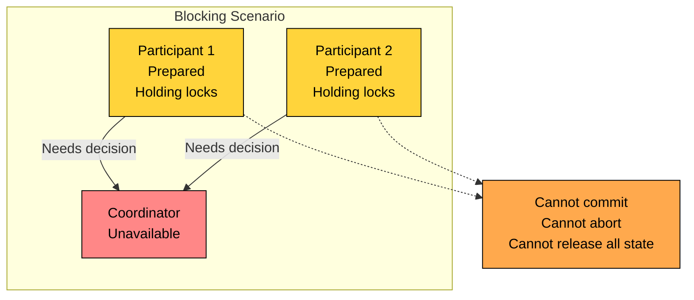
```mermaid
flowchart TD
    subgraph Problem["Blocking Scenario"]
        P1[Participant 1<br/>Prepared<br/>Holding locks]:::yellow
        P2[Participant 2<br/>Prepared<br/>Holding locks]:::yellow
        C[Coordinator<br/>Unavailable]:::red
    end

    P1 -->|Needs decision| C
    P2 -->|Needs decision| C

    Note1[Cannot commit<br/>Cannot abort<br/>Cannot release all state]:::orange

    P1 -.-> Note1
    P2 -.-> Note1

    classDef yellow fill:#ffd43b,stroke:#000,color:#000
    classDef red fill:#ff8787,stroke:#000,color:#000
    classDef orange fill:#ffa94d,stroke:#000,color:#000
```

Once a participant is prepared:

1. It cannot commit unless the decision is commit.
2. It cannot abort unless the decision is abort.
3. It may be holding locks needed by other transactions.
4. It must wait until the decision can be recovered.

Participants can sometimes ask each other for information. For example, if one participant already committed, the others can follow commit. But if all reachable participants are still prepared and nobody knows the decision, they cannot safely choose.

Scenario:

1. Participant 1 voted yes and is waiting.
2. Participant 2 received `COMMIT` and committed.
3. Participant 3 voted yes and is waiting.
4. The coordinator crashes.
5. Participant 2 is also unreachable.

Participants 1 and 3 cannot know whether the decision was commit or abort. If they abort while participant 2 has committed, atomicity is broken. If they commit when the coordinator had actually aborted, atomicity is also broken. They must wait for the coordinator or a participant with the decision to recover.

That is why 2PC is called a **blocking protocol**.

---

# Performance Costs

2PC is expensive because it adds coordination to the critical path.

### Round Trips and Disk Writes

For a normal commit, the minimum path is:

| Step | Message |
|------|---------|
| 1 | Coordinator sends `PREPARE` |
| 2 | Participants reply with votes |
| 3 | Coordinator sends `COMMIT` |
| 4 | Participants acknowledge |

That is two network round trips between the coordinator and participants, plus durable log writes at the coordinator and participants. In practice, retries, replication, disk syncs, and cross-region latency can dominate the cost.

For geographically distributed participants, 2PC can add hundreds of milliseconds before the transaction finishes.

### Lock Duration

Participants may hold locks from local execution until the final decision arrives.

```mermaid
%%{init: {'theme':'base', 'themeVariables': {
    'taskBkgColor':'#00ceff',
    'taskBorderColor':'#000',
    'taskTextColor':'#000',
    'taskTextLightColor':'#000',
    'taskTextDarkColor':'#000',
    'taskTextOutsideColor':'#000',
    'activeTaskBkgColor':'#ffa94d',
    'activeTaskBorderColor':'#000',
    'doneTaskBkgColor':'#69db7c',
    'doneTaskBorderColor':'#000',
    'critBkgColor':'#ffd43b',
    'critBorderColor':'#000',
    'sectionBkgColor':'#ffffff',
    'altSectionBkgColor':'#f5f5f5',
    'titleColor':'#000',
    'gridColor':'#cccccc'
}}}%%
gantt
    title Lock Duration in 2PC
    dateFormat X
    axisFormat %s

    section Participant
    Execute local work    :0, 2
    Acquire locks         :1, 2
    Log prepared          :active, 2, 3
    Wait for decision     :crit, 3, 7
    Commit or abort       :active, 7, 8
    Release locks         :done, 8, 9
```

Longer lock duration means:

- lower concurrency
- more lock waits
- higher deadlock risk
- larger blast radius when the coordinator or a participant is slow

### Participant Count

Every participant adds messages, logs, locks, and another failure point.

| Participant Count | Effect |
|-------------------|--------|
| **2 or 3** | Often manageable in one controlled environment |
| **5 to 10** | More latency, more lock contention, more recovery paths |
| **Dozens** | Usually a sign the transaction boundary is too large |

Large 2PC transactions are painful to operate. Good designs keep the participant set small and the transaction short.

---

# Where 2PC Is Used

2PC still matters. It is just used most successfully in controlled systems, not arbitrary business workflows across many services.

### XA Transactions

XA is a standard interface for coordinating distributed transactions across XA-capable resources.

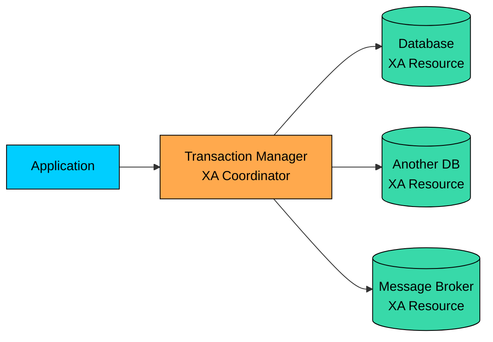
```mermaid
flowchart LR
    App[Application]:::primary --> TM[Transaction Manager<br/>XA Coordinator]:::orange

    TM --> DB1[(Database<br/>XA Resource)]:::purple
    TM --> DB2[(Another DB<br/>XA Resource)]:::purple
    TM --> MQ[(Message Broker<br/>XA Resource)]:::purple

    classDef primary fill:#00ceff,stroke:#000,color:#000
    classDef orange fill:#ffa94d,stroke:#000,color:#000
    classDef purple fill:#38d9a9,stroke:#000,color:#000
```

XA can be useful when all resources support the protocol well and the transaction is short. It can also be operationally fragile: configuration, recovery, connection pooling, timeouts, and heuristics all matter.

### Distributed Databases

Many distributed SQL databases use 2PC-like protocols internally for transactions that span shards or ranges.

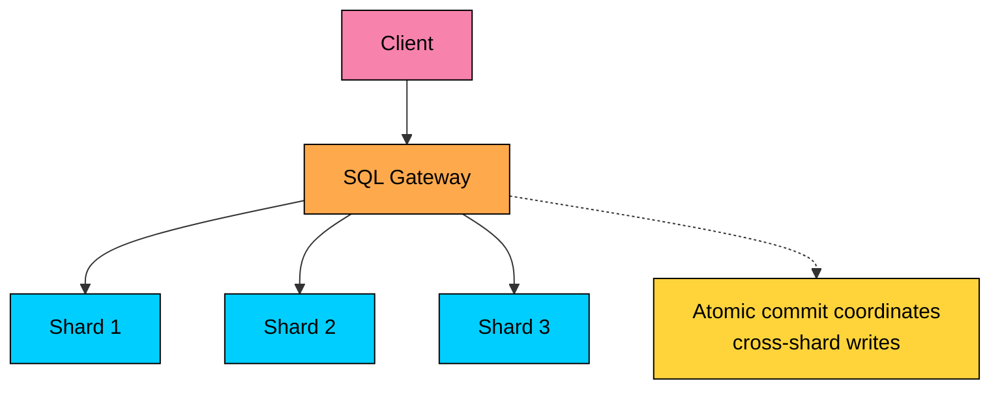
```mermaid
flowchart TB
    Client[Client]:::rose --> Router[SQL Gateway]:::orange

    Router --> S1[Shard 1]:::primary
    Router --> S2[Shard 2]:::primary
    Router --> S3[Shard 3]:::primary

    Note1[Atomic commit coordinates<br/>cross-shard writes]:::yellow
    Router -.-> Note1

    classDef rose fill:#f783ac,stroke:#000,color:#000
    classDef orange fill:#ffa94d,stroke:#000,color:#000
    classDef primary fill:#00ceff,stroke:#000,color:#000
    classDef yellow fill:#ffd43b,stroke:#000,color:#000
```

Examples include systems such as Spanner-inspired databases, CockroachDB, TiDB, and YugabyteDB. These systems usually combine atomic commit with replication, consensus, timestamp ordering, transaction records, or other optimizations. In other words, production databases rarely use the textbook protocol in isolation.

### Best Fit

| Scenario | Why 2PC Can Work |
|----------|------------------|
| **Small participant set** | Fewer messages and fewer failure combinations |
| **Short transactions** | Locks are held for less time |
| **Controlled infrastructure** | Operators can tune timeouts, recovery, and monitoring |
| **Strong atomic commit required** | Partial commit is worse than blocking |
| **Transactional resources** | Participants understand prepare, commit, abort, and recovery |

2PC is a poor fit when the workflow involves humans, external payment APIs, long-running steps, slow services, or participants that cannot hold prepared state safely.

---

# Common Optimizations

Real systems optimize 2PC heavily.

### Presumed Abort

Presumed abort reduces log writes for transactions that abort. The recovery rule is: if there is no durable commit decision, treat the transaction as aborted.

This works well when aborts are common or when systems want simpler cleanup for incomplete transactions.

### Presumed Commit

Presumed commit reduces log writes for transactions that usually commit. The system logs enough state to assume commit unless an abort record is found.

This can reduce cost on commit-heavy workloads, but recovery rules become more delicate.

### Read-Only Participant

A participant that only read data and has no commit work can opt out during prepare.

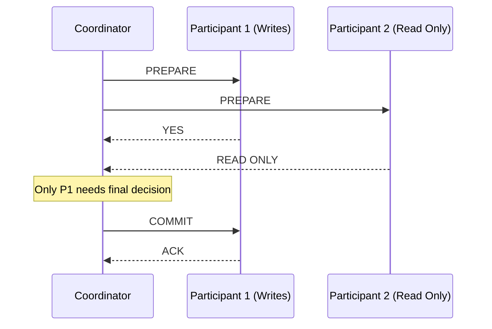
```mermaid
sequenceDiagram
    participant C as Coordinator
    participant P1 as Participant 1 (Writes)
    participant P2 as Participant 2 (Read Only)

    C->>P1: PREPARE
    C->>P2: PREPARE

    P1-->>C: YES
    P2-->>C: READ ONLY

    Note over C: Only P1 needs final decision

    C->>P1: COMMIT
    P1-->>C: ACK
```

The read-only participant can release its resources immediately because commit or abort will not change its local state.

### One-Phase Commit

If there is only one participant, there is no distributed agreement problem. The coordinator can ask that participant to commit directly.

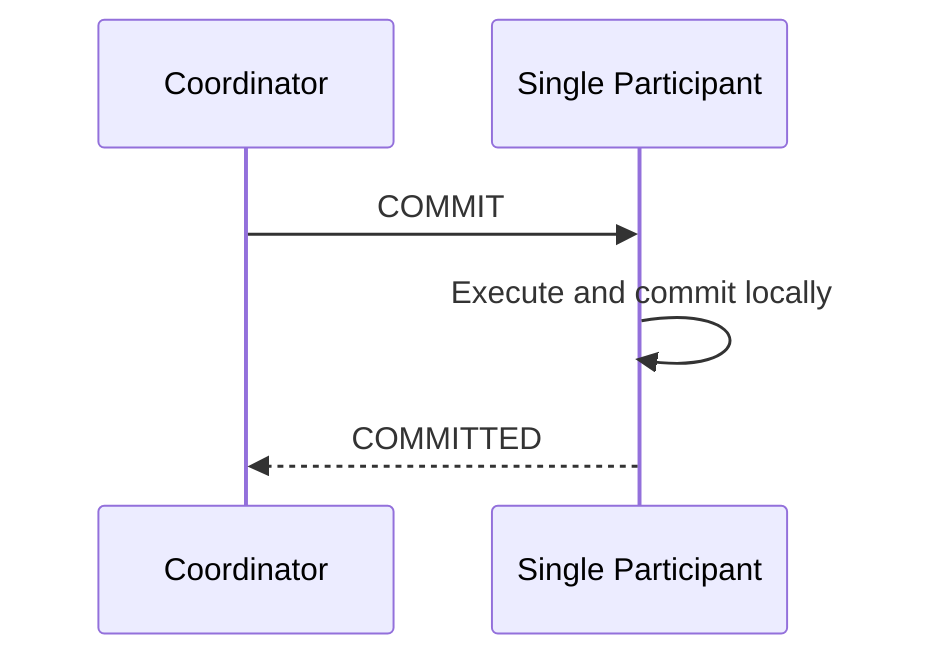
```mermaid
sequenceDiagram
    participant C as Coordinator
    participant P as Single Participant

    C->>P: COMMIT
    P->>P: Execute and commit locally
    P-->>C: COMMITTED
```

---

# Summary

Two-Phase Commit is the baseline protocol for atomic commit across multiple transactional participants.

Key points:

- 2PC has two phases: prepare, then decision.
- A yes vote is a durable promise to commit if told to commit.
- The coordinator's logged decision is authoritative.
- Participants in the prepared state are in doubt and may block while holding locks.
- 2PC can preserve atomic commit under crash-recovery assumptions, but it hurts latency, availability, and operability.
- It works best inside controlled infrastructure and distributed databases, not long-running service workflows.

The next chapter covers Three-Phase Commit, which tries to reduce 2PC's blocking problem by adding another phase. The important question is whether its assumptions match real production networks.

---

# Quiz
