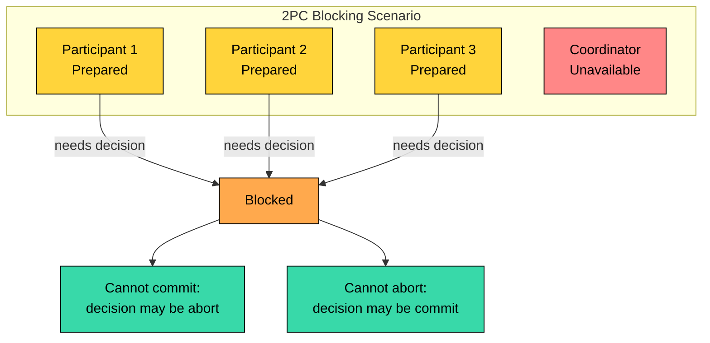
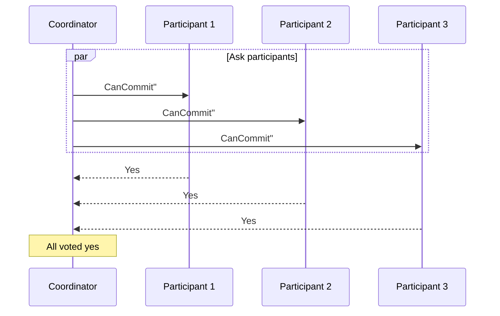
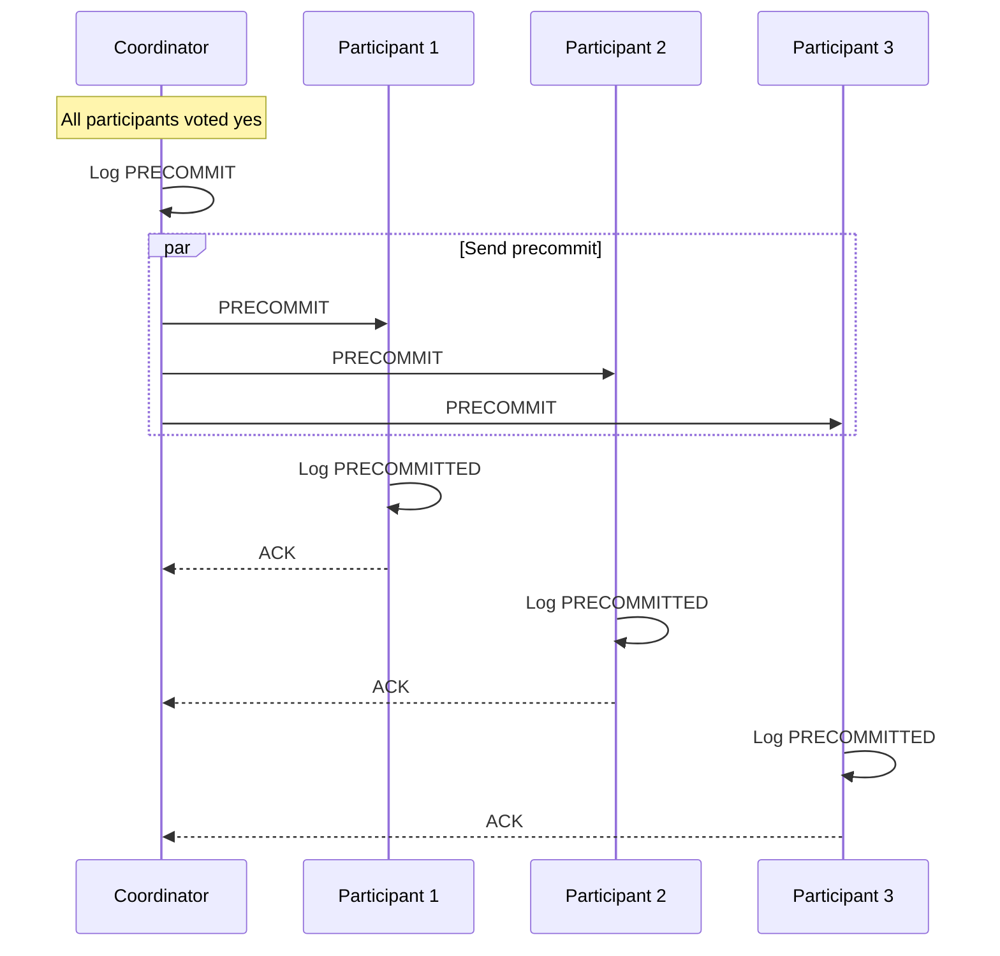
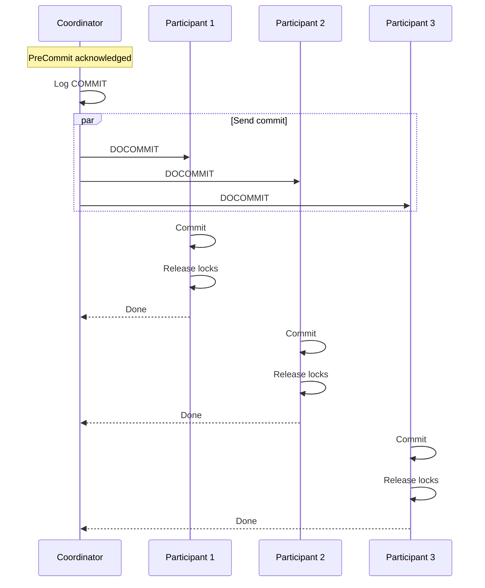
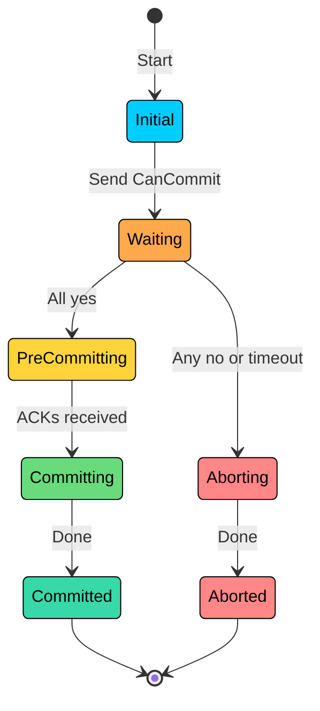
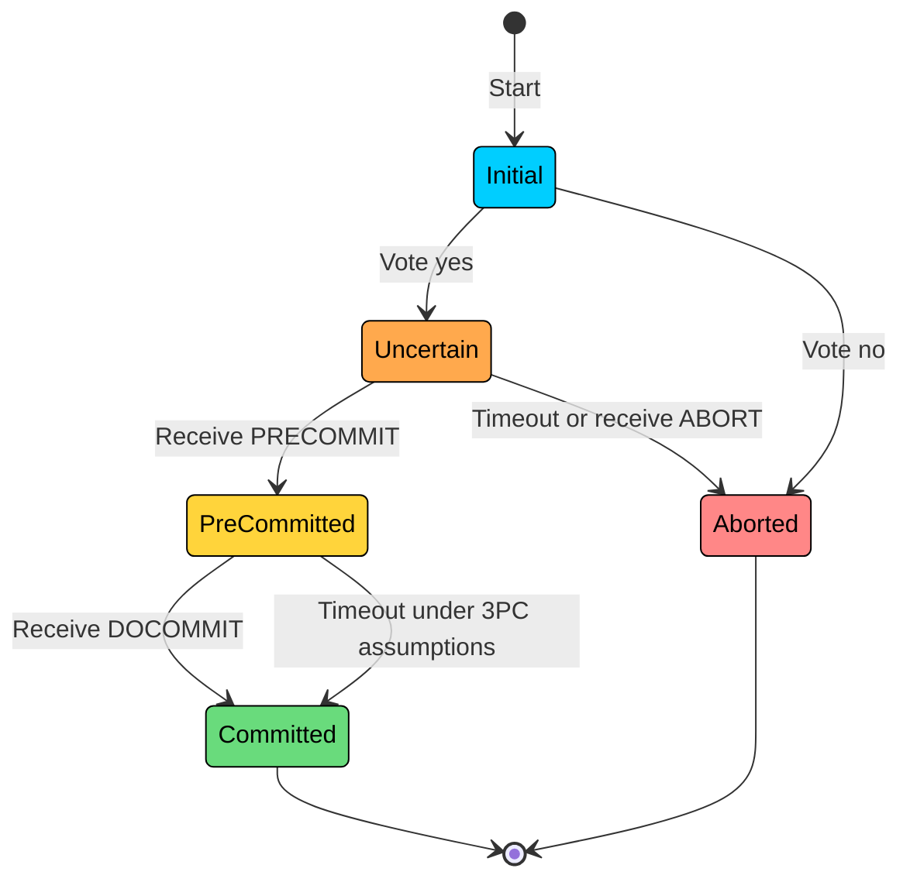
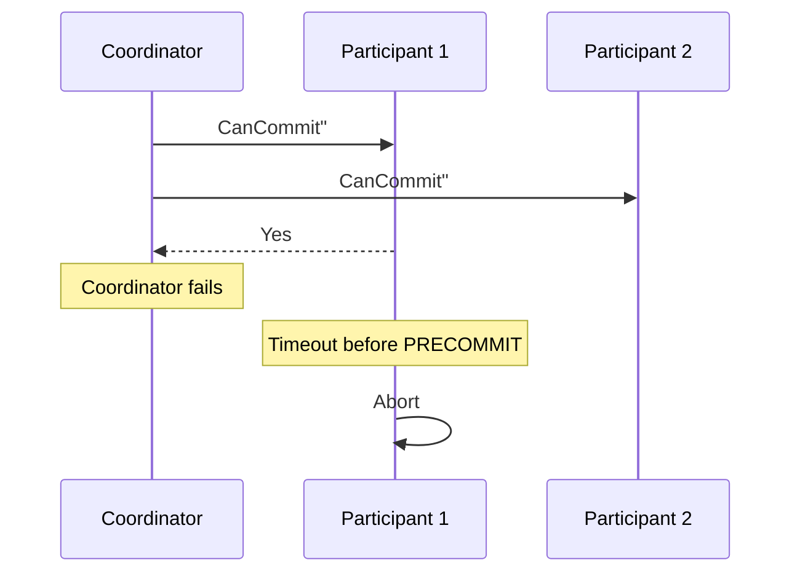
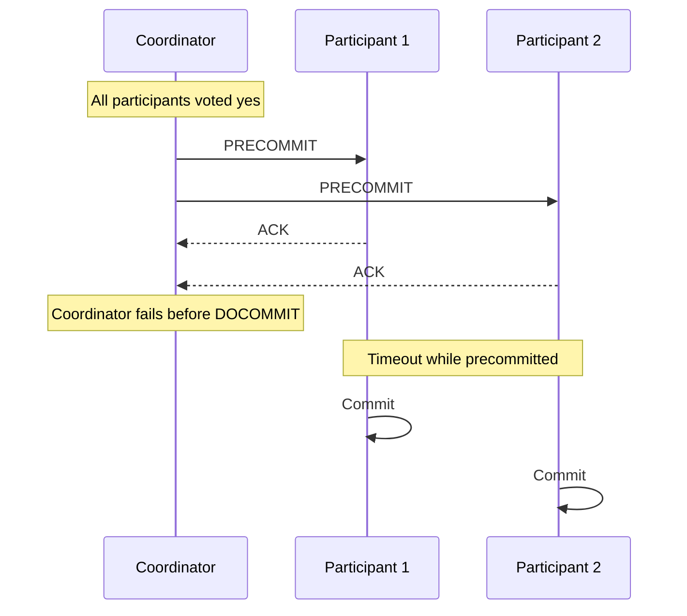
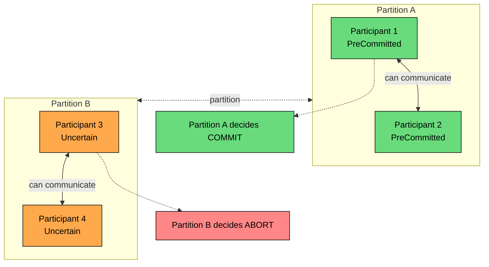

**Three-Phase Commit (3PC)** is an atomic commit protocol designed to reduce the blocking problem in Two-Phase Commit.

In 2PC, a participant that has voted yes is stuck if the coordinator disappears before delivering the final decision. It cannot safely commit or abort on its own, so it waits, often while holding locks. 3PC inserts an extra phase between "everyone voted yes" and "commit now" so that participants have enough information to make progress without the coordinator.

3PC is rarely used in production. Its non-blocking behavior depends on strong assumptions: bounded message delays, reliable failure detection, fail-stop processes, and no network partitions. Real networks usually do not satisfy those assumptions. The protocol is still worth understanding because it makes the relationship between atomic commit, blocking, and timing assumptions explicit.

---

# The 2PC Blocking Problem

In 2PC, the dangerous state is **prepared**, also called **in doubt**.



A prepared participant knows only part of the story.

| What It Knows                     | What It Does Not Know                                      |
| --------------------------------- | ---------------------------------------------------------- |
| It voted yes                      | Whether every other participant voted yes                  |
| It can commit if told to commit   | Whether the coordinator decided commit or abort            |
| It must follow the final decision | Whether another participant already received that decision |

If participants knew that everyone had voted yes before the coordinator failed, commit would be safe. If they knew that not everyone had voted yes, abort would be safe.

3PC adds a phase to communicate exactly that missing information.

---

# The Three Phases

> [!PAYWALL] This content is for premium members only.

3PC has three phases:

1. **CanCommit:** Ask participants whether they can commit.
2. **PreCommit:** Tell participants that everyone voted yes and the transaction is moving toward commit.
3. **DoCommit:** Tell participants to commit.

```mermaid
flowchart LR
    subgraph P1["Phase 1: CanCommit"]
        C1[Coordinator]:::primary
        PA1[Participants]:::orange
        C1 -->|CanCommit"| PA1
        PA1 -->|Yes / No| C1
    end

    subgraph P2["Phase 2: PreCommit"]
        C2[Coordinator]:::primary
        PA2[Participants]:::teal
        C2 -->|Everyone voted yes| PA2
        PA2 -->|ACK| C2
    end

    subgraph P3["Phase 3: DoCommit"]
        C3[Coordinator]:::primary
        PA3[Participants]:::green
        C3 -->|Commit now| PA3
        PA3 -->|Done| C3
    end

    P1 --> P2 --> P3

    classDef primary fill:#00ceff,stroke:#000,color:#000
    classDef orange fill:#ffa94d,stroke:#000,color:#000
    classDef teal fill:#38d9a9,stroke:#000,color:#000
    classDef green fill:#69db7c,stroke:#000,color:#000
```

The new state is **precommitted**.

A participant that reaches precommitted knows that all participants voted yes. If the final `DoCommit` message does not arrive, the participant has enough information to move toward commit under 3PC's timing assumptions.

That last phrase matters. 3PC is non-blocking only when timeouts can reliably distinguish failure from delay. Real networks often do not give you that guarantee.

---

# Phase 1: CanCommit

The coordinator asks every participant whether it can commit.



This looks similar to 2PC's prepare phase, but the participant state is different.

After voting yes in 3PC, a participant is **uncertain**. It has said it can commit, but it has not yet learned whether everyone else can commit.

If the coordinator fails before sending `PreCommit`, an uncertain participant can time out and abort. It has not received proof that everyone voted yes.

If any participant votes no or fails to respond, the coordinator sends `Abort`.

---

# Phase 2: PreCommit

If all participants voted yes, the coordinator sends `PreCommit`.



`PreCommit` means: everyone voted yes, and the coordinator is preparing to commit.

A precommitted participant still has not committed. It must preserve the state needed to commit later. But it now knows that the protocol has crossed the point where commit is the expected outcome.

This phase is the difference between 2PC and 3PC. It separates "I can commit" from "everyone can commit."

---

# Phase 3: DoCommit

After participants acknowledge `PreCommit`, the coordinator sends `DoCommit`.



At this point, the transaction completes like 2PC's commit path.

---

# State Transitions

### Coordinator States



What happens at each state:

- **Initial**: The transaction has started, but no `CanCommit` messages have been sent.
- **Waiting**: `CanCommit` is out to every participant; the coordinator is collecting votes.
- **PreCommitting**: Every participant voted yes. The coordinator has logged `PRECOMMIT` and is delivering it.
- **Committing**: All participants acknowledged `PreCommit`. The coordinator has logged `COMMIT` and is delivering `DoCommit`.
- **Aborting**: A no vote arrived or a vote timed out. The coordinator is delivering abort.
- **Committed** and **Aborted**: Final state once acknowledgments arrive.

The new step is **Waiting → PreCommitting**. It exists so participants can be told "everyone voted yes" before they are told "commit now." That gap is what gives a stranded participant enough information to make progress if the coordinator disappears later.

### Participant States



What happens at each state:

- **Initial**: Has not voted yet.
- **Uncertain**: Voted yes on `CanCommit` but has not received `PreCommit`. The participant knows it can commit, but it does not know whether the others can.
- **PreCommitted**: Received `PreCommit`. The participant now knows the coordinator received yes votes from everyone.
- **Committed**: Received `DoCommit` and committed locally, or committed after a timeout in `PreCommitted` under 3PC's timing assumptions.
- **Aborted**: Voted no, received `Abort`, or timed out while still in `Uncertain`.

Two timeout rules drive the protocol's non-blocking claim:

- **Uncertain + timeout** → abort. The coordinator could not have decided commit yet, so no other participant can be ahead of this one.
- **PreCommitted + timeout** → commit. Every participant must have reached at least `Uncertain` with a yes vote, so commit is the only outcome consistent with the protocol.

These rules let participants make progress without the coordinator, but only under 3PC's timing assumptions. When those assumptions break, the same rules can drive different groups to opposite decisions.

---

# Recovery Behavior

When the coordinator disappears, participants use their local state and, if possible, query other participants.

### Failure Before PreCommit



The participant is uncertain. It has not received proof that all participants voted yes, so abort is safe under the protocol.

### Failure After PreCommit



The participants have received `PreCommit`, so they know everyone voted yes. Under 3PC assumptions, they can commit after a timeout.

### Participant Recovery Rules

In a clean, partition-free failure model, recovery follows these rules:

| Observed State                 | Decision                                              |
| ------------------------------ | ----------------------------------------------------- |
| Any participant committed      | Commit                                                |
| Any participant aborted        | Abort                                                 |
| Any participant precommitted   | Move uncertain participants to precommit, then commit |
| All participants are uncertain | Abort                                                 |

These rules are useful for understanding the protocol, but they are not enough by themselves. They are safe only when the recovery group has a consistent view of participant states. If different groups observe contradictory states, such as one side seeing precommitted participants while another sees only uncertain participants, the protocol assumptions have already failed.

---

# Why 3PC Is Rare

3PC is a good teaching tool and a poor default architecture choice.

### Network Partitions Can Break Atomicity

3PC depends on timeouts meaning something reliable. In a partitioned network, a timeout may mean "the other side is slow or unreachable," not "the other side failed."



One side may see only precommitted participants and decide commit. Another side may see uncertain participants and decide abort. When the partition heals, the system has violated atomicity.

This is why 3PC is described as non-blocking in a synchronous, fail-stop model, not in the asynchronous, partition-prone model used for most real distributed systems.

### More Latency

3PC adds another coordination round.

| Protocol | Normal Commit Path                                |
| -------- | ------------------------------------------------- |
| **2PC**  | Prepare/vote, then decision/ack                   |
| **3PC**  | CanCommit/vote, PreCommit/ack, then DoCommit/done |

In round-trip terms, 2PC needs two coordinator-participant round trips for the normal commit path. 3PC needs three. Each phase may also require durable log writes.

Across regions, that extra phase can be expensive.

### More Implementation Complexity

| Area           | Added Cost in 3PC                         |
| -------------- | ----------------------------------------- |
| **States**     | Extra uncertain and precommitted behavior |
| **Messages**   | Additional `PreCommit` and acknowledgment |
| **Recovery**   | Participants may need to query each other |
| **Operations** | More timeout tuning and more edge cases   |

The complexity is not just code. Operators must understand what happens during timeouts, partitions, process restarts, and slow disks.

---

# 3PC vs 2PC

| Property                | 2PC                                          | 3PC                                               |
| ----------------------- | -------------------------------------------- | ------------------------------------------------- |
| **Main goal**           | Atomic commit                                | Atomic commit with less blocking                  |
| **Normal phases**       | 2                                            | 3                                                 |
| **Coordinator failure** | Can block prepared participants              | Can make progress under strong timing assumptions |
| **Network partitions**  | Blocks rather than guessing                  | Can make conflicting decisions                    |
| **Production usage**    | Common inside databases and XA-style systems | Rare                                              |
| **Best value**          | Practical baseline                           | Teaching coordination limits                      |

2PC is blocking but conservative. 3PC tries to avoid blocking, but its safety depends on assumptions that are difficult to guarantee in production networks.

---

# Better Practical Approaches

Production systems usually choose one of these paths instead of textbook 3PC.

### 2PC With Replicated Coordination

A system can keep the 2PC atomic commit model but make the coordinator state highly available using consensus, replication, or transaction records.

This does not make coordination free, and minority partitions may still be unavailable. But it gives the system a durable, recoverable decision point without relying on 3PC's timeout assumptions.

### Consensus Protocols

Paxos and Raft solve a related but different problem: replicated agreement. Distributed databases often combine consensus with transaction protocols so that metadata, locks, transaction records, or coordinator decisions survive failures.

Consensus does not make every partition available. It lets the side with quorum continue safely and prevents split-brain decisions.

### Sagas and Outbox Patterns

For service workflows, many teams choose eventual consistency instead of distributed atomic commit.

Sagas model the workflow as local transactions plus compensation. The outbox pattern makes event publishing reliable with a local database transaction. These patterns accept intermediate states and design recovery around business meaning.

They are often a better fit for payments, fulfillment, notifications, user-facing workflows, and anything involving external systems.

---

# Historical Context

3PC was introduced in the early 1980s as a theoretical improvement over 2PC. Its value is not that it became the standard production protocol. Its value is that it clarified the relationship between atomic commit, blocking, failure detection, and timing assumptions.

The industry largely moved in other directions:

- databases kept using 2PC-style atomic commit, often with heavy optimization
- distributed systems adopted Paxos, Raft, and consensus-backed metadata
- service architectures adopted sagas, idempotency, outbox tables, and reconciliation

That history is useful. It shows that a protocol can be elegant on paper and still be the wrong tool for most production systems.

---

# Summary

Three-Phase Commit adds a `PreCommit` phase to reduce 2PC's blocking problem.

Key points:

- 2PC can block when participants are prepared and the coordinator disappears.
- 3PC separates "I can commit" from "everyone can commit."
- An uncertain participant can abort on timeout.
- A precommitted participant can commit on timeout, but only under strong timing and failure assumptions.
- Network partitions can cause different groups to make different decisions.
- 3PC adds latency and recovery complexity.
- In practice, 3PC is mostly useful for understanding distributed commit trade-offs.

The next chapter introduces the Saga pattern, which takes a different path: instead of trying to make a multi-service workflow look like one atomic transaction, it coordinates local transactions and compensating actions over time.

---

# Quiz
