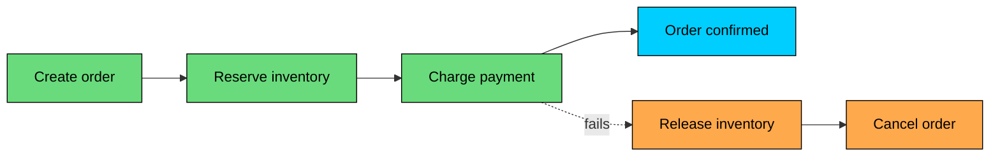
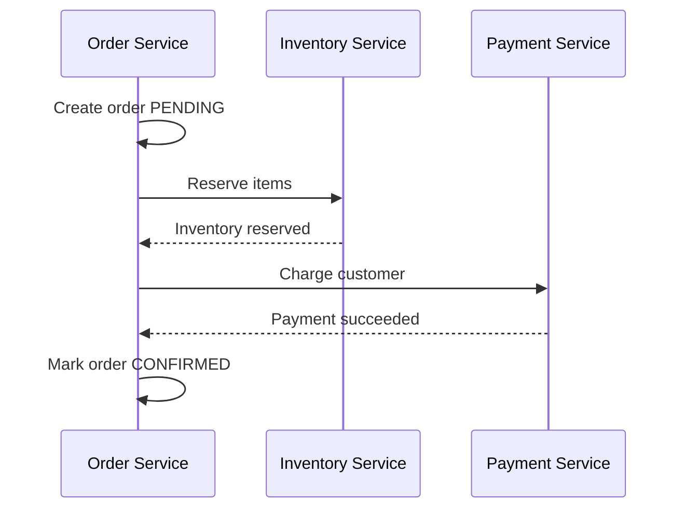
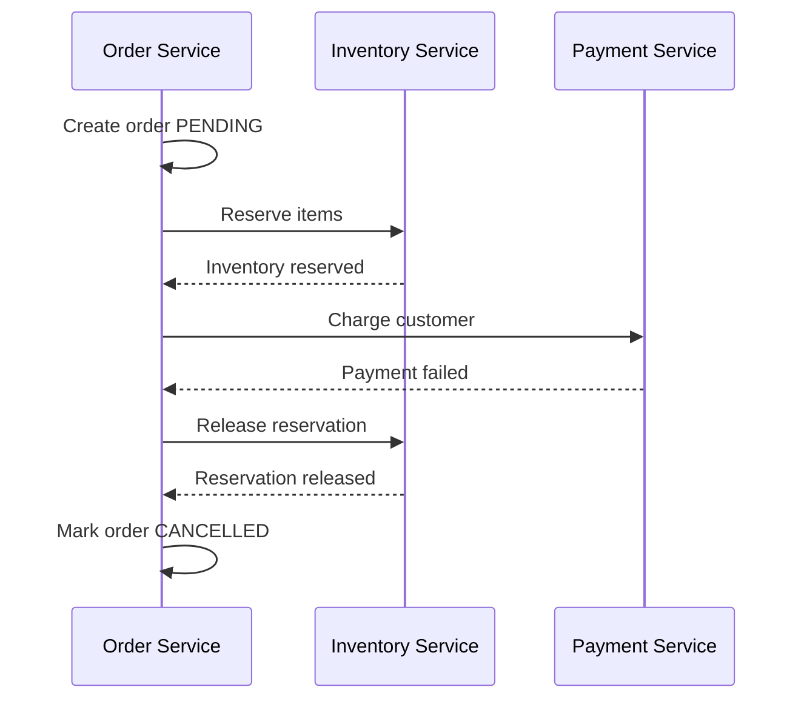
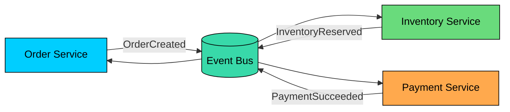
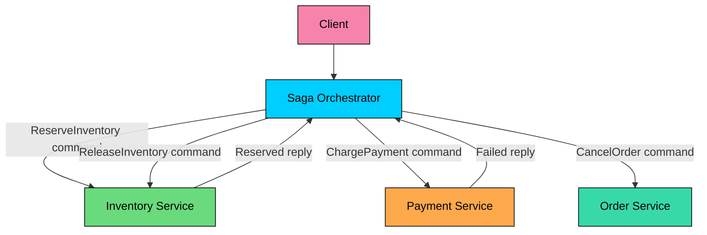

The **Saga pattern** coordinates a long-running business workflow as a sequence of local transactions across multiple services.

Each step commits in one service. If a later step fails, the saga runs compensating actions for the steps that already completed. An order workflow, for example, might create an order, reserve inventory, and charge a customer. If payment fails, the saga releases the reservation and cancels the order rather than trying to roll back committed work in other services.

A saga is not a distributed ACID transaction. It does not provide all-or-nothing isolation across services. It trades strict atomicity for service autonomy and availability, giving the system a structured way to reach a correct business outcome over time.

---

# 1. What Is a Saga"

> [!PAYWALL] This content is for premium members only.

A saga is a sequence of local transactions connected by messages, commands, or events.

Each local transaction:

1. Updates one service's database.
2. Commits independently.
3. Triggers the next step in the workflow.

If a step cannot complete, the saga executes compensating transactions for earlier successful steps.

The forward path completes the business operation. The compensation path brings the system to another valid business state, such as `ORDER_CANCELLED`.

That distinction matters. Compensation is not the same as rollback.

---

# 2. Compensation Is Not Rollback

In a local database transaction, rollback erases uncommitted work. In a saga, previous steps have already committed and may already be visible to users, services, or external systems.

A compensating transaction is a new business action that semantically reverses or offsets a previous action.

| Forward action | Possible compensation |
|----------------|-----------------------|
| Create pending order | Mark order as cancelled |
| Reserve inventory | Release reservation |
| Capture payment | Issue refund or void authorization |
| Book hotel room | Cancel reservation |
| Send confirmation email | Send cancellation email |

Some actions cannot truly be undone. You cannot unsend an email. You cannot always reverse a bank transfer instantly. You may only be able to publish a correction, issue a refund, or route the case to manual review.

Good compensation is:

- **Idempotent:** safe to retry after duplicate messages or crashes
- **Durable:** recorded in the service's database
- **Observable:** traceable by saga ID and business ID
- **Business-aware:** designed with product, finance, legal, or operations constraints

Do not design sagas by asking, "How do we undo this SQL statement"" Ask, "What business state should we move to if the workflow cannot finish""

---

# 3. Why Use Sagas Instead of 2PC"

Two-Phase Commit tries to make multiple resources commit or abort together. It can be useful inside databases and tightly controlled infrastructure, but it is usually a poor fit for service-to-service workflows.

Sagas make a different trade-off.

| Aspect | Two-Phase Commit | Saga |
|--------|------------------|------|
| Consistency model | Atomic commit across participants | Eventual consistency across steps |
| Locking | Participants may hold locks while waiting | Each local transaction commits quickly |
| Availability | Coordinator or participant failures can block progress | Workflow can retry and recover asynchronously |
| Isolation | Stronger transaction boundary | Intermediate states are visible |
| Best fit | Databases and controlled transactional resources | Long-running business workflows |

Sagas are useful when holding locks across the whole operation would be too slow, fragile, or operationally expensive.

They are not free. You are accepting intermediate states, duplicate messages, retries, and compensation logic in exchange for service autonomy and availability.

---

# 4. Example: Order Saga

Consider a simple order workflow:

1. `Order Service` creates an order with status `PENDING`.
2. `Inventory Service` reserves items.
3. `Payment Service` authorizes or captures payment.
4. `Order Service` marks the order as `CONFIRMED`.

If payment fails after inventory has been reserved, the saga does not roll back the inventory database transaction. It sends a compensating command:

Notice that `PENDING`, `CONFIRMED`, and `CANCELLED` are explicit states. Sagas work best when the domain model includes these intermediate states instead of pretending the whole workflow is instant.

---

# 5. Choreography

In a choreography-based saga, there is no central workflow coordinator. Services react to events and publish new events.

### Strengths

- Simple for small workflows
- No central workflow service
- Services remain event-driven and loosely coupled
- Easy to add passive consumers such as analytics or notifications

### Weaknesses

- The workflow is spread across services
- Failure handling becomes implicit
- Event cycles are easy to create
- End-to-end observability is harder
- Changing the workflow may require coordinated changes in many services

Choreography works well for simple flows with a few participants and clear event ownership. It becomes difficult when the workflow has many branches, timeouts, manual steps, or complex compensation.

---

# 6. Orchestration

In an orchestration-based saga, a workflow coordinator owns the saga state and tells participants what to do.

The orchestrator must persist the saga state after every transition. If it crashes, it should resume from the last durable state and continue, retry, or compensate.

### Strengths

- Workflow logic is explicit
- Easier to reason about complex branching
- Central place for timeouts and retries
- Better operational visibility
- Easier to add manual intervention states

### Weaknesses

- The orchestrator knows the workflow and participants
- It must be durable and highly available
- Poorly designed orchestrators can become too central
- Participants can become command handlers with less autonomy

Orchestration is usually the better default for complex business workflows. Choreography is attractive for simple flows, but it can hide complexity until production failures expose it.

### Choreography vs Orchestration

| Aspect | Choreography | Orchestration |
|--------|--------------|---------------|
| Coordination | Distributed through events | Central workflow coordinator |
| Flow visibility | Spread across services | Explicit in one place |
| Coupling | Event contracts between services | Orchestrator depends on participant commands |
| Failure handling | Each service reacts to failures | Orchestrator drives retries and compensation |
| Best fit | Short, simple event chains | Complex workflows with branches and timeouts |

---

# 7. Saga State

A saga needs durable state. Without it, the system cannot safely recover from crashes.

For each saga instance, store:

- Saga ID
- Business ID, such as `order_id`
- Current state
- Completed steps
- Pending command or event
- Retry count and next retry time
- Timeout deadline
- Last error
- Correlation ID and causation ID

In an orchestrated saga, this table may live in the orchestrator service. In a workflow engine such as Temporal, Step Functions, or Camunda, the engine stores equivalent durable workflow state for you.

---

# 8. Reliability Requirements

Sagas run on unreliable networks. Messages can be duplicated, delayed, lost, or delivered out of order depending on the broker and consumer behavior.

Design every participant with these requirements.

### Idempotency

Every command and compensation must be safe to retry.

For example, `ReserveInventory(order-123)` should not reserve twice if the same command is delivered twice. Use an idempotency key such as the saga ID or command ID.

### Timeouts

A saga cannot wait forever. If a participant does not respond in time, the saga must decide whether to retry, compensate, or move to manual review.

Timeouts should be business-specific. A payment authorization might time out in seconds. A hotel booking partner might require minutes.

### Retries

Retries should use exponential backoff with jitter. Permanent failures should not be retried forever.

Classify failures:

- **Transient:** retry, such as network timeout or broker unavailability
- **Business:** compensate, such as insufficient inventory or payment declined
- **Unknown:** retry status lookup before deciding, such as payment timeout after request was sent
- **Operational:** alert or manual review, such as invalid configuration

### Outbox

When a service updates local state and publishes the next saga event, use the Outbox pattern. Otherwise, the service can commit its database change and crash before publishing the event that moves the saga forward.

Sagas and Outbox often belong together:

- Saga coordinates the business workflow.
- Outbox makes each local state transition reliably visible to other services.

---

# 9. Isolation and Intermediate States

Sagas do not provide the isolation of a single database transaction.

Other users and services may observe intermediate states:

- Order is `PENDING`
- Inventory is reserved
- Payment is still unknown
- Shipping has not started

This is normal. The domain model must make these states explicit.

Common techniques:

- Use statuses such as `PENDING`, `RESERVED`, `CONFIRMED`, `CANCELLING`, `CANCELLED`
- Hide incomplete states from user-facing views when appropriate
- Use reservation expirations for scarce resources
- Prefer authorization before capture for payments when possible
- Use version numbers to reject stale updates
- Publish clear terminal states so downstream systems know when the saga is done

Do not let consumers infer workflow completion from one intermediate event. Publish explicit completion or cancellation events.

---

# 10. Failure Scenarios

### Participant Succeeds but Reply Is Lost

The orchestrator sends `ChargePayment`. The payment service charges the customer, but the reply is lost.

The orchestrator must not blindly send another charge command. It should retry with the same idempotency key or ask the payment service for the result of the previous command.

### Compensation Fails

The saga tries to release inventory, but the inventory service is down.

The saga should keep retrying with backoff. If the failure persists, it should move to an alertable state such as `COMPENSATION_FAILED`, not disappear from the system.

### Business Rule Changes Mid-Saga

A long-running saga may span minutes, hours, or days. Prices, inventory, policies, or customer status can change during that time.

Record the data needed to make consistent decisions. Do not assume the world is unchanged when a later step runs.

### Duplicate Events

A service may receive `PaymentSucceeded` twice. The order service should transition from `PENDING` to `CONFIRMED` once and ignore later duplicates.

---

# 11. When to Use Sagas

Use sagas when:

- A business workflow spans multiple services and databases
- Each step can commit locally
- Failures can be handled with compensation or manual review
- The business can tolerate temporary intermediate states
- You need availability more than strict distributed atomicity

Avoid sagas when:

- A single local transaction is sufficient
- The operation requires strict isolation across all resources
- Side effects cannot be compensated or made idempotent
- The event log itself is the source of truth, as in event sourcing
- The business cannot tolerate intermediate visible states

Sagas are a business consistency pattern. They work when the business has meaningful recovery states. They become dangerous when used to paper over operations that must be truly atomic.

---

# 12. Implementation Checklist

Before shipping a saga, make sure you have:

- Explicit states for every step and terminal outcome
- Idempotency keys for commands, events, and compensations
- Durable saga state or a durable workflow engine
- Timeouts for every remote step
- Retry policy with backoff and maximum attempts
- Compensation for every completed step that needs reversal
- Manual review path for unresolved failures
- Correlation IDs across logs, traces, events, and commands
- Outbox publishing for local state changes
- Metrics for active, completed, failed, timed-out, and compensating saga instances

Important metrics include:

- Saga completion rate
- Saga failure rate
- Average and p95 saga duration
- Oldest running saga age
- Compensation rate
- Compensation failure count
- Retry count by step
- Stuck saga count

These metrics tell you whether the workflow is healthy, not just whether individual services are up.

---

# Summary

The Saga pattern coordinates distributed business workflows without holding a single transaction open across services.

Each step commits locally. If the workflow cannot complete, the saga moves the system to another valid business state through compensating actions.

The key points are:

- A saga is not a rollback mechanism.
- Compensation is a new business action, not an undo button.
- Sagas provide eventual consistency, not distributed ACID isolation.
- Choreography fits simple event chains; orchestration fits complex workflows.
- Durable state, idempotency, timeouts, retries, observability, and Outbox publishing are required for production use.

Used carefully, sagas let distributed systems coordinate real business processes while preserving service ownership and local transactions. Used casually, they become a tangle of retries and partial failures. The difference is whether the failure paths are designed as deliberately as the happy path.

---

# Quiz
